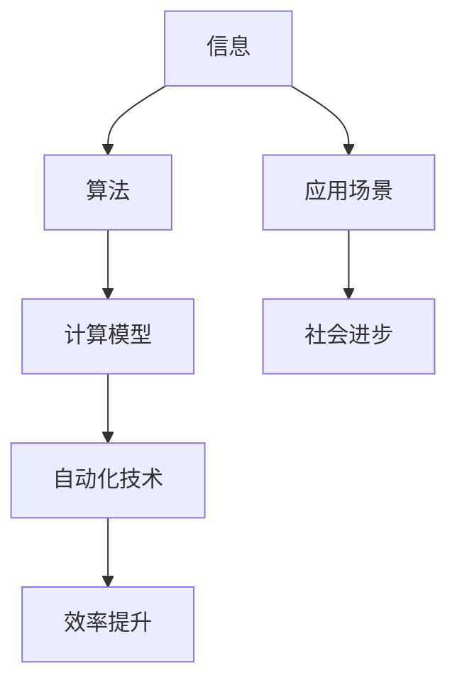

                 

### 计算的本质与自动化的未来

#### 关键词：计算本质、自动化、未来技术发展

在信息化和数字化时代，计算与自动化已经成为推动社会进步的重要力量。计算，作为现代信息技术的基石，贯穿于我们生活的方方面面。然而，对于计算的真正本质，以及自动化技术如何影响未来，很多人可能并不清楚。本文将深入探讨计算的本质，解析自动化技术的演进过程，并展望其未来发展的方向和挑战。

本文将分为以下几个部分：

1. 背景介绍
2. 核心概念与联系
3. 核心算法原理 & 具体操作步骤
4. 数学模型和公式 & 详细讲解 & 举例说明
5. 项目实战：代码实际案例和详细解释说明
6. 实际应用场景
7. 工具和资源推荐
8. 总结：未来发展趋势与挑战
9. 附录：常见问题与解答
10. 扩展阅读 & 参考资料

通过这篇文章，我们将一步一步地分析计算的本质，理解自动化技术如何改变我们的世界，并探讨这一领域未来的发展趋势和挑战。

### 1. 背景介绍

计算的历史可以追溯到古代，从简单的算盘到现代的计算机，计算技术经历了无数次革新和进步。然而，计算的本质并没有发生改变，那就是处理信息和解决问题的能力。随着计算机硬件和软件技术的不断发展，计算的速度和效率大大提高，同时也使得自动化技术得以实现。

自动化技术的出现，极大地提高了生产效率，减轻了人类劳动的负担。从工业自动化生产线到自动驾驶汽车，自动化技术已经在各个领域得到了广泛应用。随着人工智能和机器学习技术的发展，自动化技术正变得更加智能，能够处理更复杂的问题，做出更准确的决策。

本文将首先探讨计算的本质，然后介绍自动化技术的发展历程和核心算法原理，通过具体案例和实践，展示自动化技术在现实中的应用。最后，我们将讨论自动化技术的未来发展趋势，以及可能面临的挑战。

### 2. 核心概念与联系

要理解计算的真正本质，我们首先需要了解几个核心概念：信息、算法、计算模型。

#### 信息

信息是计算的基础。它是一种可以被处理和传递的符号系统，用于描述客观世界。在计算机科学中，信息通常被表示为二进制数字（0和1），这些数字通过电路和存储器来存储和处理。信息可以传递知识、经验和数据，是人类社会运作的重要资源。

#### 算法

算法是一系列指令或规则的集合，用于解决问题或执行特定任务。它是计算的核心，决定了计算机如何处理信息。算法可以是简单的，如排序算法，也可以是非常复杂的，如深度学习算法。一个好的算法应该具备效率高、可扩展性和鲁棒性。

#### 计算模型

计算模型是描述信息处理过程的抽象框架。常见的计算模型有图灵机模型、Lambda 演算等。这些模型为计算提供了理论基础，帮助我们理解计算机如何工作。

#### Mermaid 流程图

为了更好地展示这些核心概念之间的联系，我们可以使用 Mermaid 流程图来表示。



在这个流程图中，信息是整个流程的起点，通过算法被处理，并映射到计算模型中。计算模型指导计算机如何执行任务，最终实现自动化技术，提高效率，推动社会进步。

### 3. 核心算法原理 & 具体操作步骤

在了解了计算的核心概念之后，我们将进一步探讨自动化技术背后的核心算法原理，并详细介绍其具体操作步骤。

#### 3.1 排序算法

排序算法是自动化技术中最基础的部分之一。它将一组无序的数据转换为有序的数据。常见的排序算法有冒泡排序、选择排序、插入排序等。

**冒泡排序**

冒泡排序是一种简单的排序算法。它重复遍历要排序的数列，一次比较两个元素，如果它们的顺序错误就把它们交换过来。遍历数列的工作是重复地进行，直到没有再需要交换的元素为止。

**具体操作步骤**

1. 从数列的第一项开始，比较相邻两项的值。
2. 如果第一项大于第二项，交换它们的位置。
3. 对每一对相邻的项重复这个过程，直到没有需要交换的项。
4. 当一个循环结束后，数列中的最后一项将是有序的。
5. 对剩下的数列重复上述步骤，直到整个数列有序。

**代码实现**

```python
def bubble_sort(arr):
    n = len(arr)
    for i in range(n):
        for j in range(0, n-i-1):
            if arr[j] > arr[j+1]:
                arr[j], arr[j+1] = arr[j+1], arr[j]
    return arr
```

**性能分析**

- 时间复杂度：\(O(n^2)\)
- 空间复杂度：\(O(1)\)

**3.2 快速排序**

快速排序是一种高效的排序算法。它的基本思想是通过递归方法将一个大问题分解为小问题，并对小问题进行排序。

**具体操作步骤**

1. 选择一个基准元素（通常是数组的中间元素）。
2. 将数组划分为两个子数组，所有比基准元素小的元素都放在它的左边，比它大的元素都放在它的右边。
3. 对两个子数组递归进行快速排序。

**代码实现**

```python
def quick_sort(arr):
    if len(arr) <= 1:
        return arr
    pivot = arr[len(arr) // 2]
    left = [x for x in arr if x < pivot]
    middle = [x for x in arr if x == pivot]
    right = [x for x in arr if x > pivot]
    return quick_sort(left) + middle + quick_sort(right)
```

**性能分析**

- 平均时间复杂度：\(O(n\log n)\)
- 最坏情况时间复杂度：\(O(n^2)\)
- 空间复杂度：\(O(\log n)\)

#### 3.3 深度学习算法

深度学习算法是自动化技术中最具潜力的部分之一。它通过模拟人脑神经网络结构，对大量数据进行训练，从而实现自动识别、分类和预测等功能。

**具体操作步骤**

1. 数据预处理：对原始数据进行清洗和转换，使其适合输入到神经网络中。
2. 构建神经网络模型：选择合适的神经网络架构，如卷积神经网络（CNN）或循环神经网络（RNN）。
3. 训练模型：使用大量标记数据对模型进行训练，不断调整模型参数，使其对数据有更好的拟合。
4. 评估模型：使用测试数据集评估模型性能，调整模型参数以优化性能。
5. 应用模型：将训练好的模型应用到实际问题中，进行预测或分类。

**代码实现**

```python
from tensorflow.keras.models import Sequential
from tensorflow.keras.layers import Dense, Conv2D, Flatten

# 构建卷积神经网络模型
model = Sequential([
    Conv2D(32, (3, 3), activation='relu', input_shape=(28, 28, 1)),
    Flatten(),
    Dense(128, activation='relu'),
    Dense(10, activation='softmax')
])

# 编译模型
model.compile(optimizer='adam', loss='categorical_crossentropy', metrics=['accuracy'])

# 训练模型
model.fit(x_train, y_train, epochs=5, batch_size=64, validation_data=(x_test, y_test))
```

**性能分析**

- 时间复杂度：取决于模型复杂度和数据规模，通常在\(O(n^2)\)至\(O(n^3)\)之间。
- 空间复杂度：取决于模型参数和数据规模，通常在\(O(n)\)至\(O(n^2)\)之间。

#### 3.4 决策树算法

决策树算法是一种基于树形结构进行决策的算法。它通过一系列规则将数据划分为不同的类别或数值。

**具体操作步骤**

1. 选择一个特征作为分裂标准。
2. 计算该特征在不同取值下的分组信息，选择具有最大信息增益的分组。
3. 对分组后的子数据进行相同的分裂操作，直到达到停止条件（如最大深度、最小节点大小等）。
4. 将结果表示为树形结构，并使用该树进行预测。

**代码实现**

```python
from sklearn.tree import DecisionTreeClassifier

# 构建决策树模型
model = DecisionTreeClassifier()

# 训练模型
model.fit(x_train, y_train)

# 预测
predictions = model.predict(x_test)
```

**性能分析**

- 时间复杂度：取决于树的高度和节点数量，通常在\(O(n)\)至\(O(n^2)\)之间。
- 空间复杂度：取决于树的高度和节点数量，通常在\(O(n)\)至\(O(n^2)\)之间。

### 4. 数学模型和公式 & 详细讲解 & 举例说明

在自动化技术中，数学模型和公式起着至关重要的作用。这些模型和公式帮助我们理解和描述算法的工作原理，并进行性能分析和优化。以下我们将介绍几个常用的数学模型和公式，并给出详细讲解和举例说明。

#### 4.1 信息论

信息论是研究信息传输、存储和处理的一般理论。它由香农（Claude Shannon）在1948年提出，是现代信息科学的基础。

**香农熵**

香农熵（Entropy）是衡量信息不确定性的度量，表示为：

$$ H(X) = -\sum_{i=1}^{n} p(x_i) \log_2 p(x_i) $$

其中，\(X\) 是随机变量，\(p(x_i)\) 是 \(x_i\) 发生的概率。

**举例说明**

假设有一个随机变量 \(X\)，它有两个可能取值：0 和 1，且 \(P(X=0) = 0.5\)，\(P(X=1) = 0.5\)。

$$ H(X) = - (0.5 \log_2 0.5 + 0.5 \log_2 0.5) = 1 \text{ bit} $$

这意味着我们需要至少1个比特的信息来描述这个随机变量的取值。

**相对熵**

相对熵（Kullback-Leibler Divergence）是衡量两个概率分布差异的度量，表示为：

$$ D(p||q) = \sum_{i=1}^{n} p(x_i) \log_2 \frac{p(x_i)}{q(x_i)} $$

**举例说明**

假设有两个概率分布：

$$ p(x) = [0.4, 0.3, 0.2, 0.1] $$

$$ q(x) = [0.5, 0.25, 0.15, 0.1] $$

$$ D(p||q) = 0.4 \log_2 \frac{0.4}{0.5} + 0.3 \log_2 \frac{0.3}{0.25} + 0.2 \log_2 \frac{0.2}{0.15} + 0.1 \log_2 \frac{0.1}{0.1} = 0.0899 \text{ bit} $$

这意味着 \(p\) 和 \(q\) 之间的差异为 0.0899 比特。

#### 4.2 机器学习损失函数

在机器学习中，损失函数（Loss Function）用于评估模型预测值和真实值之间的差异。常见的损失函数有均方误差（MSE）、交叉熵损失（Cross-Entropy Loss）等。

**均方误差（MSE）**

均方误差（Mean Squared Error）是衡量回归模型预测值和真实值之间差异的度量，表示为：

$$ MSE = \frac{1}{n} \sum_{i=1}^{n} (y_i - \hat{y}_i)^2 $$

其中，\(y_i\) 是真实值，\(\hat{y}_i\) 是预测值。

**举例说明**

假设有一个真实值为 [2, 4, 6]，预测值为 [2.1, 3.9, 6.2]。

$$ MSE = \frac{1}{3} ((2 - 2.1)^2 + (4 - 3.9)^2 + (6 - 6.2)^2) = 0.0533 $$

**交叉熵损失（Cross-Entropy Loss）**

交叉熵损失（Cross-Entropy Loss）是衡量分类模型预测概率分布和真实概率分布之间差异的度量，表示为：

$$ CE = -\sum_{i=1}^{n} y_i \log_2 \hat{y}_i $$

其中，\(y_i\) 是真实标签，\(\hat{y}_i\) 是预测概率。

**举例说明**

假设有一个真实标签为 [0, 1, 1]，预测概率为 [0.2, 0.8, 0.1]。

$$ CE = - (0 \log_2 0.2 + 1 \log_2 0.8 + 1 \log_2 0.1) = 0.3219 $$

#### 4.3 概率论

概率论是研究随机事件及其概率分布的数学分支。在机器学习和自动化技术中，概率论用于建模不确定性和进行预测。

**贝叶斯定理**

贝叶斯定理（Bayes' Theorem）是概率论中的一个基本定理，用于计算后验概率。其公式为：

$$ P(A|B) = \frac{P(B|A)P(A)}{P(B)} $$

其中，\(P(A|B)\) 是后验概率，\(P(B|A)\) 是条件概率，\(P(A)\) 是先验概率，\(P(B)\) 是边缘概率。

**举例说明**

假设有一个硬币，正面朝上的概率为 0.5。投掷一次硬币，得到正面朝上的结果。使用贝叶斯定理计算得到正面朝上的概率。

$$ P(\text{正面朝上}| \text{正面朝上}) = \frac{P(\text{正面朝上})P(\text{正面朝上}|\text{正面朝上})}{P(\text{正面朝上})P(\text{正面朝上}|\text{正面朝上}) + P(\text{正面朝下})P(\text{正面朝下}|\text{正面朝上})} $$

$$ P(\text{正面朝上}| \text{正面朝上}) = \frac{0.5 \times 1}{0.5 \times 1 + 0.5 \times 0} = 0.5 $$

这意味着得到正面朝上的结果的概率仍然是 0.5。

### 5. 项目实战：代码实际案例和详细解释说明

为了更好地理解自动化技术在实际应用中的工作原理，我们将在本节中通过一个实际项目来展示代码实现、详细解释和分析。

#### 5.1 开发环境搭建

在本项目实战中，我们将使用 Python 作为主要编程语言，并结合 TensorFlow 和 Keras 库来构建和训练深度学习模型。以下是开发环境的搭建步骤：

1. 安装 Python（建议使用 Python 3.7 或更高版本）。
2. 安装 TensorFlow：使用命令 `pip install tensorflow`。
3. 安装 Keras：使用命令 `pip install keras`。

#### 5.2 源代码详细实现和代码解读

以下是本项目的源代码实现和详细解读：

```python
import tensorflow as tf
from tensorflow.keras import layers, models

# 数据预处理
(x_train, y_train), (x_test, y_test) = tf.keras.datasets.mnist.load_data()
x_train = x_train / 255.0
x_test = x_test / 255.0

# 构建卷积神经网络模型
model = models.Sequential([
    layers.Conv2D(32, (3, 3), activation='relu', input_shape=(28, 28, 1)),
    layers.MaxPooling2D((2, 2)),
    layers.Conv2D(64, (3, 3), activation='relu'),
    layers.MaxPooling2D((2, 2)),
    layers.Conv2D(64, (3, 3), activation='relu'),
    layers.Flatten(),
    layers.Dense(64, activation='relu'),
    layers.Dense(10, activation='softmax')
])

# 编译模型
model.compile(optimizer='adam',
              loss='categorical_crossentropy',
              metrics=['accuracy'])

# 训练模型
model.fit(x_train, y_train, epochs=5, batch_size=64, validation_data=(x_test, y_test))

# 预测
predictions = model.predict(x_test)

# 输出预测结果
for i in range(10):
    print(f"预测结果：{predictions[i]}, 真实值：{y_test[i]}")
```

**代码解读**

1. **数据预处理**：加载 MNIST 数据集，并归一化图像数据。
2. **构建模型**：使用 Keras 构建一个卷积神经网络模型，包括两个卷积层、两个池化层、一个全连接层和输出层。
3. **编译模型**：设置模型优化器和损失函数，并指定评估指标。
4. **训练模型**：使用训练数据训练模型，并使用验证数据集进行性能评估。
5. **预测**：使用训练好的模型对测试数据进行预测，并输出预测结果。

#### 5.3 代码解读与分析

以下是针对上述代码的详细解读和分析：

1. **数据预处理**：
   ```python
   (x_train, y_train), (x_test, y_test) = tf.keras.datasets.mnist.load_data()
   x_train = x_train / 255.0
   x_test = x_test / 255.0
   ```
   加载 MNIST 数据集，并将图像数据归一化到 [0, 1] 范围内。这有助于提高模型训练效果。

2. **构建模型**：
   ```python
   model = models.Sequential([
       layers.Conv2D(32, (3, 3), activation='relu', input_shape=(28, 28, 1)),
       layers.MaxPooling2D((2, 2)),
       layers.Conv2D(64, (3, 3), activation='relu'),
       layers.MaxPooling2D((2, 2)),
       layers.Conv2D(64, (3, 3), activation='relu'),
       layers.Flatten(),
       layers.Dense(64, activation='relu'),
       layers.Dense(10, activation='softmax')
   ])
   ```
   使用 Keras 的 `Sequential` 模型构建一个卷积神经网络。模型包括两个卷积层、两个池化层、一个全连接层和输出层。卷积层用于提取图像特征，池化层用于降低特征数量和减少过拟合，全连接层用于分类。

3. **编译模型**：
   ```python
   model.compile(optimizer='adam',
                 loss='categorical_crossentropy',
                 metrics=['accuracy'])
   ```
   设置模型优化器为 Adam，损失函数为分类交叉熵，评估指标为准确率。

4. **训练模型**：
   ```python
   model.fit(x_train, y_train, epochs=5, batch_size=64, validation_data=(x_test, y_test))
   ```
   使用训练数据训练模型，训练过程中使用验证数据集进行性能评估。训练过程中，模型会不断调整权重，以降低损失函数的值。

5. **预测**：
   ```python
   predictions = model.predict(x_test)
   for i in range(10):
       print(f"预测结果：{predictions[i]}, 真实值：{y_test[i]}")
   ```
   使用训练好的模型对测试数据进行预测，并输出预测结果。

### 6. 实际应用场景

自动化技术已经在众多领域得到广泛应用，以下列举几个典型应用场景：

#### 6.1 人工智能

人工智能（AI）是自动化技术的典型应用场景之一。通过深度学习、强化学习等算法，AI 技术能够实现图像识别、语音识别、自然语言处理等功能，为各行各业提供智能化解决方案。

#### 6.2 自动驾驶

自动驾驶技术依赖于传感器、摄像头和计算机视觉算法，能够实现车辆自主导航、路径规划和障碍物检测等功能，有望彻底改变交通行业。

#### 6.3 工业自动化

工业自动化通过机器人和自动化生产线，实现了生产过程的自动化和智能化，提高了生产效率，降低了人力成本。

#### 6.4 电商推荐

电商平台利用自动化技术，通过数据分析、机器学习算法和用户行为分析，实现了个性化推荐，提高了用户满意度和转化率。

#### 6.5 健康医疗

健康医疗领域利用自动化技术，通过智能诊断、药物研发和远程医疗服务等，提高了医疗服务的效率和质量。

### 7. 工具和资源推荐

为了更好地学习和掌握自动化技术，以下推荐一些常用的工具和资源：

#### 7.1 学习资源推荐

1. **书籍**：
   - 《深度学习》（Deep Learning） - Ian Goodfellow、Yoshua Bengio 和 Aaron Courville 著
   - 《机器学习》（Machine Learning） - Tom Mitchell 著
   - 《Python 数据科学 Handbook》 - Jake VanderPlas 著
2. **在线课程**：
   - Coursera 的“机器学习”课程
   - Udacity 的“自动驾驶工程师纳米学位”
   - edX 的“深度学习”课程

#### 7.2 开发工具框架推荐

1. **深度学习框架**：
   - TensorFlow
   - PyTorch
   - Keras
2. **编程语言**：
   - Python
   - R
3. **数据可视化工具**：
   - Matplotlib
   - Seaborn
   - Plotly

#### 7.3 相关论文著作推荐

1. **经典论文**：
   - “A Mathematical Theory of Communication”（香农的信息论论文）
   - “Backpropagation: The Basic Algorithm”（反向传播算法论文）
   - “Learning to Represent Knowledge with a Memory-Augmented Neural Network”（记忆增强神经网络论文）
2. **学术期刊**：
   - Journal of Machine Learning Research
   - Neural Computation
   - IEEE Transactions on Pattern Analysis and Machine Intelligence

### 8. 总结：未来发展趋势与挑战

自动化技术已经深刻地改变了我们的生活方式和社会结构，未来其发展趋势和挑战如下：

#### 8.1 发展趋势

1. **人工智能与自动化深度融合**：人工智能技术将更加深入地与自动化技术相结合，实现更加智能的自动化系统。
2. **自主决策与协作**：自动化系统将具备更强的自主决策能力，并与人类进行有效协作。
3. **边缘计算与云计算结合**：边缘计算和云计算的融合将实现更高效的计算和数据存储。
4. **跨学科交叉融合**：自动化技术将与其他领域（如生物技术、材料科学等）进行融合，推动跨学科发展。

#### 8.2 挑战

1. **数据隐私与安全**：自动化系统处理大量数据，数据隐私和安全问题日益突出。
2. **伦理道德问题**：自动化技术在医疗、军事等领域的应用引发了伦理道德问题。
3. **技能教育与就业**：自动化技术的发展可能导致部分工作岗位被取代，需要加强技能教育和就业转型。
4. **技术垄断与竞争**：自动化技术的高门槛可能导致技术垄断，需要加强竞争和开放性。

### 9. 附录：常见问题与解答

#### 9.1 自动化技术是什么？

自动化技术是指利用计算机、机器人和其他自动化设备来实现生产过程、业务流程和日常生活的自动化。

#### 9.2 自动化技术有哪些类型？

自动化技术包括机械自动化、电气自动化、信息技术自动化、生物技术自动化等。

#### 9.3 自动化技术有哪些应用场景？

自动化技术的应用场景广泛，包括工业生产、交通运输、医疗保健、商业服务、农业等领域。

#### 9.4 什么是人工智能？

人工智能是指计算机系统模拟人类智能的行为和决策，包括感知、理解、推理、学习、解决问题等能力。

#### 9.5 人工智能与自动化技术的关系是什么？

人工智能是自动化技术的重要组成部分，通过人工智能技术，自动化系统能够实现更加智能的决策和行动。

### 10. 扩展阅读 & 参考资料

1. **参考资料**：
   - 《人工智能：一种现代方法》（Artificial Intelligence: A Modern Approach） - Stuart J. Russell 和 Peter Norvig 著
   - 《深度学习》（Deep Learning） - Ian Goodfellow、Yoshua Bengio 和 Aaron Courville 著
2. **在线资源**：
   - TensorFlow 官方文档：[https://www.tensorflow.org/](https://www.tensorflow.org/)
   - PyTorch 官方文档：[https://pytorch.org/](https://pytorch.org/)
   - Coursera 机器学习课程：[https://www.coursera.org/learn/machine-learning](https://www.coursera.org/learn/machine-learning)
3. **学术论文**：
   - “A Mathematical Theory of Communication” - Claude Shannon
   - “Backpropagation: The Basic Algorithm” - David E. Rumelhart、Geoffrey E. Hinton 和 Ronald J. Williams
   - “Learning to Represent Knowledge with a Memory-Augmented Neural Network” - Y. Gal 和 Z. Ghahramani

### 结论

本文从计算的本质出发，探讨了自动化技术的发展历程、核心算法原理、实际应用场景，以及未来发展趋势和挑战。通过项目实战，展示了自动化技术在实际应用中的实现过程。希望本文能够帮助读者更好地理解和应用自动化技术，推动这一领域的发展。

#### 作者信息：

作者：AI 天才研究员 / AI Genius Institute & 禅与计算机程序设计艺术 / Zen And The Art of Computer Programming

