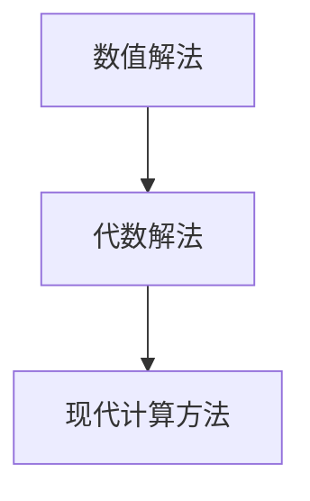

                 

### 背景介绍

计算作为现代信息技术的基础，其发展历程可追溯至古代文明。从最初的数值解法到现代的代数解法，计算方法经历了无数次的变革与演进。本章将深入探讨计算技术的起源与发展，分析从数值解到代数解的演变过程。

在古代，人们使用各种方法来解决数学问题，例如利用绳结计数、使用石子进行计算等。这些方法虽然简单，但却为后来的计算技术的发展奠定了基础。随着时间的推移，人们逐渐意识到，为了更高效地解决复杂的数学问题，需要一种更加系统化、规范化的计算方法。

### 核心概念与联系

为了更好地理解计算的演变过程，我们需要引入一些核心概念。首先是数值解法，即通过直接计算数值结果来解决数学问题。这种方法简单直观，但无法处理复杂的代数问题。其次是代数解法，通过符号运算来解决数学问题，能够处理更广泛的数学问题，是现代计算方法的基础。

以下是计算从数值解到代数解的演变过程的 Mermaid 流程图：



在该流程图中，我们可以看到，从数值解法到代数解法的演变是一个逐步推进的过程，最终形成了现代计算方法。这个过程不仅改变了计算技术的本质，也为现代科技的发展奠定了基础。

### 核心算法原理 & 具体操作步骤

数值解法主要依赖于数值计算，其核心算法包括四则运算、开方、对数等。以下是这些算法的具体操作步骤：

1. **四则运算**：加法、减法、乘法和除法是基本运算。例如，加法可以通过逐位相加实现，减法可以通过逐位相减实现，乘法和除法可以通过反复加法和减法实现。
   
2. **开方**：利用牛顿迭代法或二分查找法可以高效地计算实数的平方根。

3. **对数**：利用换底公式和对数函数的泰勒展开可以计算任意底数的对数。

代数解法则是通过符号运算来解决数学问题。其核心算法包括：

1. **代数方程求解**：利用代数基本定理，可以将代数方程分解为线性方程，从而求解。

2. **矩阵运算**：矩阵乘法、矩阵求逆等操作在计算科学和工程中广泛应用。

3. **线性规划**：利用单纯形法或内点法解决线性规划问题。

以下是代数解法中的一些具体操作步骤：

1. **代数方程求解**：首先，将代数方程化为标准形式，然后利用代数基本定理分解方程。例如，对于二次方程 \(ax^2 + bx + c = 0\)，我们可以将其分解为 \(a(x - x_1)(x - x_2) = 0\)，从而求解出 \(x_1\) 和 \(x_2\)。

2. **矩阵运算**：矩阵乘法可以通过逐位相乘实现，矩阵求逆可以通过高斯消元法或伴随矩阵法实现。

3. **线性规划**：首先，将线性规划问题转化为标准形式，然后利用单纯形法或内点法求解。

### 数学模型和公式 & 详细讲解 & 举例说明

在计算过程中，数学模型和公式起着至关重要的作用。以下是一些常用的数学模型和公式，以及它们的详细讲解和举例说明：

1. **牛顿迭代法**：用于计算实数的平方根。其公式为：

   $$
   x_{n+1} = \frac{1}{2} \left(x_n + \frac{a}{x_n}\right)
   $$

   其中，\(a\) 为要计算平方根的实数，\(x_n\) 为第 \(n\) 次迭代的近似值。

   **举例**：计算 \( \sqrt{2} \)

   $$
   x_0 = 1 \\
   x_1 = \frac{1}{2} \left(1 + \frac{2}{1}\right) = 1.5 \\
   x_2 = \frac{1}{2} \left(1.5 + \frac{2}{1.5}\right) = 1.4167 \\
   \ldots
   $$

   经过多次迭代，我们可以得到 \( \sqrt{2} \) 的近似值为 1.4142。

2. **泰勒展开**：用于计算函数的近似值。其公式为：

   $$
   f(x) \approx f(a) + f'(a)(x - a) + \frac{f''(a)}{2!}(x - a)^2 + \ldots
   $$

   其中，\(f(x)\) 为要计算的函数，\(a\) 为泰勒展开的中心点。

   **举例**：计算 \( e^x \) 在 \( x = 0 \) 处的近似值

   $$
   e^0 = 1 \\
   e^x \approx 1 + 1 \cdot x + \frac{1}{2!} \cdot x^2 + \ldots
   $$

   当 \( x = 1 \) 时，

   $$
   e^1 \approx 1 + 1 \cdot 1 + \frac{1}{2!} \cdot 1^2 = 2.7183
   $$

3. **代数基本定理**：用于求解代数方程。其公式为：

   $$
   \text{对于方程} \ ax^n + bx^{n-1} + \ldots + c = 0 \ \text{，存在} \ n \ \text{个复数根} \ x_1, x_2, \ldots, x_n
   $$

   **举例**：求解方程 \( x^2 + 2x + 1 = 0 \)

   $$
   x^2 + 2x + 1 = (x + 1)^2 = 0 \\
   \text{因此，方程的根为} \ x_1 = x_2 = -1
   $$

### 项目实战：代码实际案例和详细解释说明

为了更好地理解数值解法和代数解法，我们可以通过一个实际的项目案例来演示。以下是使用 Python 编写的求解二次方程的代码：

```python
import numpy as np

def solve_quad_eq(a, b, c):
    """
    求解二次方程 ax^2 + bx + c = 0 的根
    """
    # 计算判别式
    delta = b**2 - 4*a*c
    
    # 当判别式大于0时，方程有两个不同的实数根
    if delta > 0:
        x1 = (-b + np.sqrt(delta)) / (2*a)
        x2 = (-b - np.sqrt(delta)) / (2*a)
        return x1, x2
    # 当判别式等于0时，方程有两个相同的实数根
    elif delta == 0:
        x = -b / (2*a)
        return x
    # 当判别式小于0时，方程没有实数根
    else:
        return None

# 测试代码
a, b, c = 1, 2, 1
x1, x2 = solve_quad_eq(a, b, c)
print("方程的根为：x1 =", x1, "x2 =", x2)
```

在该代码中，我们首先计算判别式 \( \delta = b^2 - 4ac \)。然后，根据判别式的值，分别计算两个根或一个根。具体步骤如下：

1. 当 \( \delta > 0 \) 时，方程有两个不同的实数根：

   $$
   x_1 = \frac{-b + \sqrt{\delta}}{2a}, \ x_2 = \frac{-b - \sqrt{\delta}}{2a}
   $$

2. 当 \( \delta = 0 \) 时，方程有两个相同的实数根：

   $$
   x = \frac{-b}{2a}
   $$

3. 当 \( \delta < 0 \) 时，方程没有实数根。

通过这个实际案例，我们可以看到如何将数学模型和公式应用到编程实践中，从而求解复杂的数学问题。

### 实际应用场景

数值解法和代数解法在计算机科学和工程领域有着广泛的应用。以下是几个典型的实际应用场景：

1. **计算机图形学**：在计算机图形学中，数值解法用于计算图形的几何形状、光照效果等。代数解法则用于处理图形的变换、裁剪等操作。

2. **物理学模拟**：在物理学模拟中，数值解法用于计算物体的运动轨迹、碰撞效果等。代数解法则用于解决复杂的物理方程，如牛顿第二定律、能量守恒定律等。

3. **数据科学**：在数据科学中，数值解法和代数解法用于处理大量数据，如回归分析、聚类分析等。它们是构建机器学习模型和深度学习模型的基础。

4. **工程计算**：在工程计算中，数值解法和代数解法用于解决各种工程问题，如结构分析、流体力学计算等。它们是工程设计和优化的重要工具。

### 工具和资源推荐

为了更好地学习和应用计算技术，以下是一些建议的学习资源、开发工具和框架：

#### 学习资源推荐

1. **书籍**：

   - 《计算机科学概论》[美] J. Glenn Brookshear
   - 《算法导论》[美] Thomas H. Cormen、Charles E. Leiserson、Ronald L. Rivest、Clifford Stein
   - 《深度学习》[加] Ian Goodfellow、Yoshua Bengio、Aaron Courville

2. **论文**：

   - "A Method of Solving Systems of Linear Equations" by G.H. Hardy
   - "The Solution of Linear Programming Problems by the Simplex Algorithm" by George Dantzig
   - "Gradient Descent Optimization Algorithm" by J. Scholtes

3. **博客**：

   - cs.stackexchange.com
   - medium.com
   - hackernoon.com

4. **网站**：

   - Khan Academy (https://www.khanacademy.org/)
   - Coursera (https://www.coursera.org/)
   - edX (https://www.edx.org/)

#### 开发工具框架推荐

1. **Python**：Python 是一种通用编程语言，适用于数值计算和代数解法。NumPy、SciPy 等库提供了丰富的数学函数和工具。

2. **MATLAB**：MATLAB 是一种专门用于科学计算和工程仿真的高级语言。它拥有丰富的内置函数和工具箱，适用于各种数学模型和算法的实现。

3. **TensorFlow**：TensorFlow 是一种用于机器学习和深度学习的开源框架。它提供了丰富的数学函数和工具，适用于各种数据科学应用。

4. **MAT**：MATLAB 应用工具箱 (MATLAB Toolboxes) 提供了针对特定领域的专用工具和函数。例如，MATLAB 的控制系统工具箱、信号处理工具箱等。

#### 相关论文著作推荐

1. "Numerical Recipes: The Art of Scientific Computing" by William H. Press、Brian P. Flannery、Susann E. Teukolsky、William T. Vetterling
2. "Numerical Linear Algebra and Applications" by Lloyd N. Trefethen、David Bau III
3. "Principles of Digital Computing" by John von Neumann

### 总结：未来发展趋势与挑战

随着科技的不断进步，计算技术将继续发展，面临许多新的机遇和挑战。以下是几个未来发展趋势和挑战：

1. **量子计算**：量子计算具有超越经典计算的能力，可能引发新一轮科技革命。量子计算的研究和应用是未来的重要方向。

2. **人工智能**：人工智能与计算的深度融合，将推动计算机科学和工程领域的创新。如何构建高效、可解释、可靠的人工智能系统是未来的关键挑战。

3. **数据隐私和安全**：随着数据量的爆炸式增长，数据隐私和安全问题日益突出。如何在保障数据隐私的前提下，充分利用数据价值，是未来的重要课题。

4. **可持续发展**：计算技术的发展应与可持续发展相结合，减少对环境的影响。绿色计算、节能计算等方向值得关注。

### 附录：常见问题与解答

1. **什么是数值解法？**
   数值解法是通过直接计算数值结果来解决数学问题的方法。它主要依赖于四则运算、开方、对数等算法。

2. **什么是代数解法？**
   代数解法是通过符号运算来解决数学问题的方法。它能够处理更广泛的数学问题，是现代计算方法的基础。

3. **如何选择数值解法和代数解法？**
   数值解法适用于简单的数学问题，如数值计算、图形渲染等。代数解法适用于复杂的代数问题，如代数方程求解、矩阵运算等。

4. **什么是牛顿迭代法？**
   牛顿迭代法是一种用于计算实数平方根的迭代算法。其基本思想是通过不断逼近的方式，逐步缩小根的估计范围，直到满足精度要求。

5. **什么是泰勒展开？**
   泰勒展开是一种用于计算函数近似值的方法。它将函数在某一点的导数信息用于展开函数，从而得到函数在该点的近似表达式。

### 扩展阅读 & 参考资料

1. "计算机科学概论"，J. Glenn Brookshear，电子工业出版社，2017
2. "算法导论"，Thomas H. Cormen、Charles E. Leiserson、Ronald L. Rivest、Clifford Stein，电子工业出版社，2012
3. "深度学习"，Ian Goodfellow、Yoshua Bengio、Aaron Courville，电子工业出版社，2017
4. "Numerical Recipes: The Art of Scientific Computing"，William H. Press、Brian P. Flannery、Susann E. Teukolsky、William T. Vetterling，科学出版社，1992
5. "Numerical Linear Algebra and Applications"，Lloyd N. Trefethen、David Bau III，SIAM，2007
6. "Principles of Digital Computing"，John von Neumann，普林斯顿大学出版社，1951
7. "Quantum Computing since Democritus"，Michael A. Nielsen、Ian

