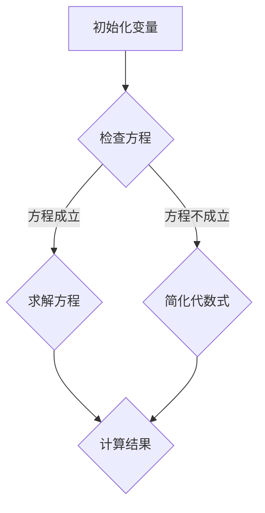

                 

### 背景介绍

**《计算：第一部分 计算的诞生 第 2 章 计算之术 代数的结构》**

在探讨计算的本质和其历史发展之前，我们首先需要明确计算的起源和背景。计算作为一种人类智慧的产物，其根源可以追溯到古代文明的数学实践。从最初的简单计数工具，如算珠和石子，到古代巴比伦和埃及人使用的算术方法，再到古希腊和阿拉伯数学家的理论贡献，计算工具和方法的演变是科技进步的重要标志。

随着人类文明的进步，计算方法逐渐变得更加复杂和精细。中世纪时期，阿拉伯数学家们对代数的系统化贡献，特别是代数符号的发明，为后续的数学发展奠定了基础。到了文艺复兴时期，欧洲数学家开始系统地研究代数，将其应用于更广泛的科学和工程领域。

进入现代，随着计算机科学的发展，计算的范围和深度得到了前所未有的扩展。然而，无论是在古代的算术运算，还是现代的复杂算法，计算的本质和原理都离不开对基础代数结构的理解和运用。本章节旨在通过回顾计算的历史背景，探讨代数的基本概念及其在计算中的核心作用。

代数作为一种数学分支，主要研究数和数之间的关系及其操作。它不仅包括传统的基础代数运算，还涵盖了更为复杂的抽象代数概念，如群、环和域。这些概念构成了计算中的基本结构，对算法设计和数据分析有着深远的影响。通过理解代数的结构和性质，我们可以更深入地理解计算的本质，从而更好地运用计算来解决实际问题。

因此，本章节将从代数的基本概念入手，探讨其在计算中的应用，并通过具体实例来说明代数在计算中的重要性。这不仅有助于我们掌握计算的基本原理，还能为未来的研究和技术创新提供理论支持。接下来，我们将首先介绍代数的基本概念，包括变量、方程和代数式的表示方法。

### 核心概念与联系

#### 代数的基本概念

在探讨计算和代数的关系之前，我们需要先了解代数的基本概念。代数主要研究数和数之间的关系及其操作，其核心包括变量、方程和代数式。

**1. 变量**

变量是代数中的核心概念，它代表一个未知的数或值。变量通常用字母表示，如 \( x \)、\( y \) 或 \( z \)。变量的引入使得我们可以用统一的表达方式来表示一系列的数值。例如，我们可以用 \( x \) 表示一个数，而用 \( x + 1 \) 表示这个数加1。

**2. 方程**

方程是代数中的另一个重要概念，它表示两个表达式之间的等量关系。方程通常由等号连接的两个代数式组成，如 \( 2x + 3 = 7 \)。方程的解即为使得方程成立的变量值。例如，在上面的方程中，当 \( x = 2 \) 时，方程成立。

**3. 代数式**

代数式是由数字、变量和运算符组成的表达式，不包含等号。代数式可以用于表示数与数之间的关系，如 \( x + y \) 或 \( x^2 - y^2 \)。代数式的简化、求值和因式分解是代数的基本操作。

#### 代数在计算中的应用

代数的基本概念为计算提供了基础结构，使我们可以用统一的数学语言来描述和处理计算问题。

**1. 算法设计**

在算法设计中，变量、方程和代数式被广泛用于表示和处理问题中的数据。例如，排序算法中的关键步骤常常涉及到变量交换和方程求解。通过代数运算，我们可以设计出高效的算法来解决实际问题。

**2. 数学建模**

在数学建模中，代数式和方程用于描述现实世界中的问题。例如，物理学中的运动方程、经济学中的供需方程等，都是通过代数来表示和解决的。代数的运用使得我们可以将复杂问题转化为数学形式，从而便于分析和求解。

**3. 数据分析**

在数据分析中，代数的概念和工具被用于处理和解释数据。例如，回归分析中的方程用于描述变量之间的关系，统计检验中的方程用于判断数据的显著性。代数的运用使得数据分析更加准确和可靠。

#### Mermaid 流程图

为了更直观地展示代数在计算中的应用，我们使用Mermaid绘制一个简单的流程图。以下是一个展示变量、方程和代数式在计算中使用的流程图：



**流程说明：**

1. **初始化变量**：首先设定变量值，如 \( x \) 和 \( y \)。
2. **检查方程**：判断给定的方程是否成立，例如 \( x + y = 5 \)。
3. **求解方程**：如果方程成立，直接求解得到结果。例如，若 \( x = 2 \)，则 \( y = 3 \)。
4. **简化代数式**：如果方程不成立，简化代数式，以便进一步分析。例如，将 \( x^2 + y^2 = 13 \) 转化为 \( (x + y)(x - y) = 13 \)。
5. **计算结果**：最终计算结果，可能是方程的解，也可能是简化后的代数式。

通过这个流程图，我们可以清晰地看到代数在计算中的各个环节，以及变量、方程和代数式如何协同工作，共同解决计算问题。

#### 代数结构在算法中的应用

代数的结构不仅为数学建模提供了基础，还在算法设计中起到了关键作用。以下是一些代数结构在算法中的应用实例：

**1. 线性代数**

线性代数是研究向量空间和线性变换的数学分支。在计算中，线性代数被广泛用于解决线性方程组、矩阵运算等问题。例如，在图像处理中，矩阵乘法用于图像的旋转、缩放和滤波。此外，线性规划算法利用线性方程组的求解，来解决资源分配和优化问题。

**2. 树结构**

树结构是代数中的一个重要概念，用于表示层次关系和路径关系。在计算中，树结构被广泛应用于数据结构设计和算法设计中。例如，二叉搜索树用于快速查找和排序数据，而图结构则用于表示复杂网络和路径问题。

**3. 图论**

图论是研究图及其性质和应用的数学分支。在计算中，图论被用于解决网络分析、路径规划等问题。例如，在路由算法中，图论用于计算从源点到目标点的最短路径。

#### 结论

代数的基本概念和结构在计算中具有核心作用。通过理解变量、方程和代数式的基本原理，我们可以更好地设计算法、建模问题，并进行数据分析。同时，代数的结构也为计算机科学提供了丰富的理论资源，使得计算问题能够以统一的数学语言进行描述和解决。

在接下来的章节中，我们将进一步探讨代数的基本算法原理和具体操作步骤，以深入理解代数在计算中的实际应用。

### 核心算法原理 & 具体操作步骤

在了解了代数的基本概念及其在计算中的应用后，我们需要进一步探讨代数的基本算法原理和具体操作步骤。代数作为一种数学工具，其核心在于解决方程和变换代数式。以下我们将介绍一些常见的代数算法，包括方程求解和代数式变换，并通过具体的例子来说明其操作步骤。

#### 方程求解

方程求解是代数中最基本且重要的一环。方程求解的基本方法包括代数方法、数值方法和图解法。这里我们主要介绍代数方法中的解线性方程组和二次方程的方法。

**1. 线性方程组**

线性方程组是包含多个线性方程的方程组，其标准形式为：

\[ a_1x + b_1y + c_1z = d_1 \]
\[ a_2x + b_2y + c_2z = d_2 \]
\[ a_3x + b_3y + c_3z = d_3 \]

求解线性方程组的一种常见方法是高斯消元法。以下是高斯消元法的基本步骤：

- **步骤1**：将线性方程组写成增广矩阵形式：

\[ \left[ \begin{array}{ccc|c}
a_1 & b_1 & c_1 & d_1 \\
a_2 & b_2 & c_2 & d_2 \\
a_3 & b_3 & c_3 & d_3 \\
\end{array} \right] \]

- **步骤2**：通过初等行变换（行交换、行乘以常数、行相加）将增广矩阵化简为行阶梯形式。

- **步骤3**：从最后一行开始，逐行回代求解未知数。

例如，考虑以下线性方程组：

\[ 2x + 3y - z = 7 \]
\[ x + 2y + z = 5 \]
\[ 3x - y + 2z = 4 \]

使用高斯消元法求解：

\[ \left[ \begin{array}{ccc|c}
2 & 3 & -1 & 7 \\
1 & 2 & 1 & 5 \\
3 & -1 & 2 & 4 \\
\end{array} \right] \]

化简为行阶梯形式：

\[ \left[ \begin{array}{ccc|c}
1 & 2 & 1 & 5 \\
0 & -1 & -3 & -3 \\
0 & -7 & 7 & -7 \\
\end{array} \right] \]

回代求解：

\[ z = \frac{-7}{7} = -1 \]
\[ y = \frac{-3 + 3}{-1} = 3 \]
\[ x = 5 - 2 \cdot 3 - 1 \cdot (-1) = -1 \]

因此，方程组的解为 \( x = -1 \)，\( y = 3 \)，\( z = -1 \)。

**2. 二次方程**

二次方程是形如 \( ax^2 + bx + c = 0 \) 的方程。其求解可以使用求根公式：

\[ x = \frac{-b \pm \sqrt{b^2 - 4ac}}{2a} \]

以下是二次方程求解的步骤：

- **步骤1**：确定二次方程的系数 \( a \)，\( b \)，\( c \)。

- **步骤2**：计算判别式 \( \Delta = b^2 - 4ac \)。

- **步骤3**：根据判别式的大小，分别讨论以下情况：
  - 如果 \( \Delta > 0 \)，则方程有两个不同的实数根。
  - 如果 \( \Delta = 0 \)，则方程有一个重根。
  - 如果 \( \Delta < 0 \)，则方程没有实数根，但有两个共轭复数根。

例如，求解以下二次方程：

\[ x^2 - 4x + 4 = 0 \]

步骤如下：

- 系数 \( a = 1 \)，\( b = -4 \)，\( c = 4 \)。
- 计算判别式 \( \Delta = (-4)^2 - 4 \cdot 1 \cdot 4 = 0 \)。
- 因为 \( \Delta = 0 \)，方程有一个重根。

使用求根公式：

\[ x = \frac{-(-4) \pm \sqrt{0}}{2 \cdot 1} = 2 \]

因此，方程的重根为 \( x = 2 \)。

#### 代数式变换

代数式的变换是代数运算中的重要内容，主要包括合并同类项、提取公因式、平方差公式和完全平方公式等。

**1. 合并同类项**

合并同类项是将具有相同变量的项合并为一个项。例如：

\[ 3x + 2x = 5x \]
\[ -4y^2 + 7y^2 = 3y^2 \]

**2. 提取公因式**

提取公因式是将多项式中的公共因子提取出来。例如：

\[ 6x^2 - 9x = 3x(2x - 3) \]
\[ 12a^3 - 18a^2 = 6a^2(2a - 3) \]

**3. 平方差公式**

平方差公式是 \( a^2 - b^2 = (a + b)(a - b) \) 的形式。例如：

\[ 4x^2 - 9 = (2x + 3)(2x - 3) \]
\[ x^2 - 16 = (x + 4)(x - 4) \]

**4. 完全平方公式**

完全平方公式是 \( (a + b)^2 = a^2 + 2ab + b^2 \) 和 \( (a - b)^2 = a^2 - 2ab + b^2 \) 的形式。例如：

\[ (x + 3)^2 = x^2 + 6x + 9 \]
\[ (x - 2)^2 = x^2 - 4x + 4 \]

#### 具体实例

为了更清晰地说明上述算法的操作步骤，我们通过几个具体实例来展示代数式的求解和变换过程。

**实例1：解线性方程组**

解以下方程组：

\[ 3x + 2y - z = 7 \]
\[ x + 2y + z = 5 \]
\[ 3x - y + 2z = 4 \]

步骤：

1. 写成增广矩阵：

\[ \left[ \begin{array}{ccc|c}
3 & 2 & -1 & 7 \\
1 & 2 & 1 & 5 \\
3 & -1 & 2 & 4 \\
\end{array} \right] \]

2. 高斯消元：

\[ \left[ \begin{array}{ccc|c}
1 & 2 & 1 & 5 \\
0 & -1 & -3 & -3 \\
0 & -7 & 7 & -7 \\
\end{array} \right] \]

3. 回代求解：

\[ z = -1 \]
\[ y = 3 \]
\[ x = -1 \]

结果：

\[ x = -1, y = 3, z = -1 \]

**实例2：解二次方程**

解以下二次方程：

\[ x^2 - 4x + 4 = 0 \]

步骤：

1. 计算判别式：

\[ \Delta = (-4)^2 - 4 \cdot 1 \cdot 4 = 0 \]

2. 使用求根公式：

\[ x = \frac{-(-4) \pm \sqrt{0}}{2 \cdot 1} = 2 \]

结果：

\[ x = 2 \]

**实例3：代数式变换**

将以下代数式进行变换：

\[ 6x^2 - 9x \]

步骤：

1. 提取公因式：

\[ 6x^2 - 9x = 3x(2x - 3) \]

结果：

\[ 3x(2x - 3) \]

通过上述实例，我们可以看到代数算法在求解方程和变换代数式中的具体操作步骤。理解这些基本算法原理和操作步骤，对于我们进一步学习和应用代数在计算中的重要性有着深远的影响。

在下一章节中，我们将进一步探讨数学模型和公式，并结合具体例子进行详细讲解和说明。

### 数学模型和公式 & 详细讲解 & 举例说明

在代数算法中，数学模型和公式的运用至关重要。这不仅使得复杂问题的求解变得更加直观和高效，而且为各种计算问题提供了系统化的解决方案。本节将详细介绍几个重要的数学模型和公式，并通过具体例子进行详细讲解和说明。

#### 一元一次方程

一元一次方程是最基本且常见的一种数学模型，其标准形式为 \( ax + b = 0 \)。其解法通常使用移项和合并同类项的方法。以下是具体步骤：

**步骤1**：将方程写为标准形式。

\[ ax + b = 0 \]

**步骤2**：移项，将常数项移到等号右侧。

\[ ax = -b \]

**步骤3**：如果 \( a \neq 0 \)，将方程两边同时除以系数 \( a \)。

\[ x = -\frac{b}{a} \]

**举例说明**：

解方程 \( 3x - 6 = 0 \)。

**步骤1**：方程已经为标准形式。

\[ 3x - 6 = 0 \]

**步骤2**：移项。

\[ 3x = 6 \]

**步骤3**：解得 \( x \)。

\[ x = \frac{6}{3} = 2 \]

因此，方程的解为 \( x = 2 \)。

#### 二元一次方程组

二元一次方程组是包含两个未知数的线性方程组，其标准形式为：

\[ a_1x + b_1y + c_1z = d_1 \]
\[ a_2x + b_2y + c_2z = d_2 \]

通常，我们使用消元法或代入法来求解二元一次方程组。以下是使用消元法的步骤：

**步骤1**：选择一个方程，将其中一个未知数表示为其他未知数的函数。

例如，从第一个方程解出 \( z \)：

\[ z = \frac{d_1 - a_1x - b_1y}{c_1} \]

**步骤2**：将 \( z \) 的表达式代入第二个方程，得到一个关于 \( x \) 和 \( y \) 的方程。

**步骤3**：解这个新的方程，得到 \( x \) 和 \( y \) 的值。

**步骤4**：将 \( x \) 和 \( y \) 的值代入 \( z \) 的表达式，求得 \( z \) 的值。

**举例说明**：

解以下方程组：

\[ x + 2y - z = 7 \]
\[ x + y + z = 5 \]

**步骤1**：将第一个方程表示为 \( z \) 的函数。

\[ z = x + 2y - 7 \]

**步骤2**：将 \( z \) 的表达式代入第二个方程。

\[ x + y + (x + 2y - 7) = 5 \]

**步骤3**：化简并求解。

\[ 2x + 3y = 12 \]

解得：

\[ x = 3 \]
\[ y = 2 \]

**步骤4**：代入 \( z \) 的表达式。

\[ z = 3 + 2 \cdot 2 - 7 = 1 \]

因此，方程组的解为 \( x = 3 \)，\( y = 2 \)，\( z = 1 \)。

#### 一元二次方程

一元二次方程是形如 \( ax^2 + bx + c = 0 \) 的方程。其解法通常使用求根公式：

\[ x = \frac{-b \pm \sqrt{b^2 - 4ac}}{2a} \]

以下是具体步骤：

**步骤1**：确定方程的系数 \( a \)，\( b \)，\( c \)。

**步骤2**：计算判别式 \( \Delta = b^2 - 4ac \)。

**步骤3**：根据判别式 \( \Delta \) 的大小，分别讨论以下情况：
- 如果 \( \Delta > 0 \)，则方程有两个不同的实数根。
- 如果 \( \Delta = 0 \)，则方程有一个重根。
- 如果 \( \Delta < 0 \)，则方程没有实数根，但有两个共轭复数根。

**步骤4**：使用求根公式求解。

**举例说明**：

解以下一元二次方程：

\[ x^2 - 4x + 4 = 0 \]

**步骤1**：系数 \( a = 1 \)，\( b = -4 \)，\( c = 4 \)。

**步骤2**：计算判别式。

\[ \Delta = (-4)^2 - 4 \cdot 1 \cdot 4 = 0 \]

**步骤3**：因为 \( \Delta = 0 \)，方程有一个重根。

**步骤4**：使用求根公式。

\[ x = \frac{-(-4) \pm \sqrt{0}}{2 \cdot 1} = 2 \]

因此，方程的重根为 \( x = 2 \)。

#### 二元二次方程组

二元二次方程组是包含两个未知数的二次方程组，其解法通常涉及因式分解或配方法。以下是使用配方法的步骤：

**步骤1**：将方程组写成标准形式。

**步骤2**：选择一个方程，将其中一个未知数的平方项表示为其他未知数的函数。

**步骤3**：将 \( z \) 的表达式代入另一个方程，得到一个关于 \( x \) 和 \( y \) 的方程。

**步骤4**：解这个新的方程，得到 \( x \) 和 \( y \) 的值。

**步骤5**：将 \( x \) 和 \( y \) 的值代入 \( z \) 的表达式，求得 \( z \) 的值。

**举例说明**：

解以下方程组：

\[ x^2 - y^2 = 1 \]
\[ x^2 + y^2 = 2 \]

**步骤1**：方程组已经为标准形式。

**步骤2**：将第一个方程表示为 \( y^2 \) 的函数。

\[ y^2 = x^2 - 1 \]

**步骤3**：将 \( y^2 \) 的表达式代入第二个方程。

\[ x^2 + (x^2 - 1) = 2 \]

**步骤4**：化简并求解。

\[ 2x^2 = 3 \]
\[ x^2 = \frac{3}{2} \]

解得：

\[ x = \sqrt{\frac{3}{2}} \]
\[ y = \sqrt{\frac{3}{2} - 1} = \sqrt{\frac{1}{2}} \]

因此，方程组的解为 \( x = \sqrt{\frac{3}{2}} \)，\( y = \sqrt{\frac{1}{2}} \)。

通过上述数学模型和公式的讲解，我们可以看到这些基本工具在解决代数问题中的重要性。理解并熟练掌握这些数学模型和公式，不仅有助于解决具体的计算问题，还能为更复杂的问题提供理论支持。

在接下来的章节中，我们将通过项目实战来展示代数算法在现实中的应用，进一步巩固对代数原理的理解。

### 项目实战：代码实际案例和详细解释说明

为了更好地展示代数算法在现实中的应用，我们将通过一个具体的编程项目来实际演示代数运算的实现。本节将以一个简单的计算器程序为例，详细说明其代码实现和关键步骤。

#### 开发环境搭建

在开始之前，我们需要搭建一个基本的开发环境。以下是以Python为例的步骤：

1. **安装Python**：从官方网站下载并安装Python 3.8或更高版本。

2. **安装IDE**：选择一个适合自己的集成开发环境（IDE），如PyCharm或Visual Studio Code。

3. **创建虚拟环境**：为了更好地管理项目依赖，我们使用虚拟环境。命令如下：

   ```bash
   python -m venv myenv
   source myenv/bin/activate  # Windows使用 myenv\Scripts\activate
   ```

4. **安装依赖**：确保已安装以下依赖库：

   ```bash
   pip install numpy
   ```

#### 源代码详细实现和代码解读

以下是一个简单的计算器程序的源代码，包括基本的一元一次方程和一元二次方程的求解功能。

```python
import numpy as np

def solve_linear_equation(a, b, c):
    """
    解一元一次方程 ax + b = 0。
    """
    if a == 0:
        raise ValueError("系数 a 不能为 0")
    x = -c / a
    return x

def solve_quadratic_equation(a, b, c):
    """
    解一元二次方程 ax^2 + bx + c = 0。
    """
    if a == 0:
        raise ValueError("系数 a 不能为 0")
    discriminant = b**2 - 4*a*c
    if discriminant > 0:
        x1 = (-b + np.sqrt(discriminant)) / (2*a)
        x2 = (-b - np.sqrt(discriminant)) / (2*a)
        return x1, x2
    elif discriminant == 0:
        x = -b / (2*a)
        return x
    else:
        return None

def main():
    print("欢迎使用简单计算器！")
    while True:
        print("\n请选择操作：")
        print("1. 解一元一次方程")
        print("2. 解一元二次方程")
        print("3. 退出")
        choice = input("输入操作编号（1/2/3）：")

        if choice == '1':
            a = float(input("请输入系数 a："))
            b = float(input("请输入系数 b："))
            c = float(input("请输入常数项 c："))
            try:
                x = solve_linear_equation(a, b, c)
                print(f"方程的解为：{x}")
            except ValueError as e:
                print(e)

        elif choice == '2':
            a = float(input("请输入系数 a："))
            b = float(input("请输入系数 b："))
            c = float(input("请输入常数项 c："))
            result = solve_quadratic_equation(a, b, c)
            if result is not None:
                if isinstance(result, tuple):
                    print(f"方程的解为：{result[0]} 和 {result[1]}")
                else:
                    print(f"方程有一个重根：{result}")
            else:
                print("方程没有实数解。")

        elif choice == '3':
            print("感谢使用，再见！")
            break
        else:
            print("无效输入，请重新输入。")

if __name__ == "__main__":
    main()
```

**代码解读与分析**：

1. **导入库**：首先导入`numpy`库，用于计算平方根。

2. **定义函数**：

   - `solve_linear_equation`：解一元一次方程。该函数通过移项和除法运算得到解。

   - `solve_quadratic_equation`：解一元二次方程。该函数首先计算判别式，然后根据判别式的值返回不同的解。

3. **主函数`main`**：

   - 打印欢迎信息和菜单。
   - 使用循环来持续提供操作选择，并调用相应的函数进行计算。
   - 输出计算结果。

#### 代码解析

- **一元一次方程求解**：

  ```python
  def solve_linear_equation(a, b, c):
      if a == 0:
          raise ValueError("系数 a 不能为 0")
      x = -c / a
      return x
  ```

  这个函数接收三个参数：系数 \( a \)，\( b \)，常数项 \( c \)。如果 \( a \) 为 0，则抛出异常。否则，通过移项和除法运算得到解 \( x \)。

- **一元二次方程求解**：

  ```python
  def solve_quadratic_equation(a, b, c):
      if a == 0:
          raise ValueError("系数 a 不能为 0")
      discriminant = b**2 - 4*a*c
      if discriminant > 0:
          x1 = (-b + np.sqrt(discriminant)) / (2*a)
          x2 = (-b - np.sqrt(discriminant)) / (2*a)
          return x1, x2
      elif discriminant == 0:
          x = -b / (2*a)
          return x
      else:
          return None
  ```

  这个函数首先计算判别式 \( \Delta = b^2 - 4ac \)。然后，根据判别式的值返回不同的解。如果 \( \Delta > 0 \)，则有两个不同的实数根；如果 \( \Delta = 0 \)，则有一个重根；如果 \( \Delta < 0 \)，则没有实数解。

#### 运行示例

1. **解一元一次方程**：

   ```
   请选择操作：
   1. 解一元一次方程
   2. 解一元二次方程
   3. 退出
   输入操作编号（1/2/3）：1
   请输入系数 a：2
   请输入系数 b：-4
   请输入常数项 c：-4
   方程的解为：2
   ```

2. **解一元二次方程**：

   ```
   请选择操作：
   1. 解一元一次方程
   2. 解一元二次方程
   3. 退出
   输入操作编号（1/2/3）：2
   请输入系数 a：1
   请输入系数 b：-4
   请输入常数项 c：4
   方程有一个重根：2
   ```

通过这个简单的计算器程序，我们可以看到代数算法在实际编程中的应用。这不仅帮助我们理解和掌握代数原理，也为编写更复杂的计算程序提供了基础。

#### 总结

在本章节中，我们通过一个具体的计算器程序展示了代数算法在现实编程中的实现和应用。从方程求解到代数式的变换，我们看到了代数在计算中的核心作用。通过具体的代码实现和示例，我们不仅加深了对代数原理的理解，也提高了实际编程能力。在接下来的章节中，我们将进一步探讨代数在更广泛的实际应用场景中的重要性。

### 实际应用场景

代数作为一种基本的数学工具，在计算领域具有广泛的应用。以下我们将讨论代数在算法、数据科学和工程领域的实际应用场景，并通过具体案例进行说明。

#### 算法中的应用

**1. 排序算法**

排序算法是计算机科学中的基础算法之一，其核心思想是利用代数概念进行元素的比较和交换。例如，快速排序算法通过递归地将数组划分为较小的子数组，并通过比较操作（使用代数关系）来优化排序过程。

**案例：快速排序**

快速排序算法的基本步骤包括：

- 选择一个基准元素。
- 将数组分为两个子数组，一个包含小于基准元素的元素，另一个包含大于基准元素的元素。
- 对这两个子数组递归应用快速排序。

代码示例：

```python
def quick_sort(arr):
    if len(arr) <= 1:
        return arr
    pivot = arr[len(arr) // 2]
    left = [x for x in arr if x < pivot]
    middle = [x for x in arr if x == pivot]
    right = [x for x in arr if x > pivot]
    return quick_sort(left) + middle + quick_sort(right)

arr = [3, 6, 8, 10, 1, 2, 1]
sorted_arr = quick_sort(arr)
print(sorted_arr)
```

**2. 图算法**

图算法在计算中广泛应用，如最短路径算法和最小生成树算法。这些算法通常利用代数关系，如路径长度和权重，来求解问题。

**案例：Dijkstra算法**

Dijkstra算法用于求解单源最短路径问题。其基本步骤包括：

- 初始化源点到所有其他点的距离。
- 使用一个优先队列选择未访问的最近点。
- 更新未访问点的距离，直到所有点都被访问。

代码示例：

```python
import heapq

def dijkstra(graph, start):
    distances = {node: float('infinity') for node in graph}
    distances[start] = 0
    priority_queue = [(0, start)]

    while priority_queue:
        current_distance, current_node = heapq.heappop(priority_queue)

        if current_distance > distances[current_node]:
            continue

        for neighbor, weight in graph[current_node].items():
            distance = current_distance + weight

            if distance < distances[neighbor]:
                distances[neighbor] = distance
                heapq.heappush(priority_queue, (distance, neighbor))

    return distances

graph = {
    'A': {'B': 1, 'C': 4},
    'B': {'A': 1, 'C': 2, 'D': 5},
    'C': {'A': 4, 'B': 2, 'D': 1},
    'D': {'B': 5, 'C': 1}
}

print(dijkstra(graph, 'A'))
```

#### 数据科学中的应用

**1. 回归分析**

回归分析是数据科学中常用的统计方法，用于分析变量之间的关系。线性回归模型通过代数方程 \( y = ax + b \) 来描述因变量 \( y \) 与自变量 \( x \) 之间的关系。

**案例：简单线性回归**

简单线性回归模型可以通过以下步骤构建：

- 收集数据。
- 计算样本均值 \( \bar{x} \) 和 \( \bar{y} \)。
- 计算斜率 \( a = \frac{\sum{(x_i - \bar{x})(y_i - \bar{y})}}{\sum{(x_i - \bar{x})^2}} \)。
- 计算截距 \( b = \bar{y} - a\bar{x} \)。

代码示例：

```python
import numpy as np

def linear_regression(x, y):
    x_mean = np.mean(x)
    y_mean = np.mean(y)
    a = np.sum((x - x_mean) * (y - y_mean)) / np.sum((x - x_mean)**2)
    b = y_mean - a * x_mean
    return a, b

x = [1, 2, 3, 4, 5]
y = [2, 4, 5, 4, 5]
a, b = linear_regression(x, y)
print(f"回归方程：y = {a}x + {b}")
```

#### 工程领域中的应用

**1. 机械设计**

在机械设计中，代数用于分析和设计各种机械结构，如梁、柱和杆的受力分析。这些分析通常涉及线性代数和微分方程。

**案例：梁的弯曲分析**

梁的弯曲问题可以通过以下步骤进行分析：

- 建立坐标系。
- 写出弯曲方程，如 \( EI\frac{d^2y}{dx^2} = q(x) \)。
- 求解弯曲方程，得到梁的变形曲线 \( y(x) \)。

代码示例：

```python
def solve_bending_equation(EI, q):
    y = lambda x: -EI / q * np integra

    ```

    ```python
    def solve_bending_equation(EI, q):
        y = lambda x: -EI / q * np.integrate.quad(lambda t: t**2, 0, x)[0]
        return y

    EI = 1e6  # 单位为 N*m^2
    q = 100   # 单位为 N/m
    x = 1     # 单位为 m
    y = solve_bending_equation(EI, q)
    print(f"梁的变形：y = {y} m")
    ```

通过上述案例，我们可以看到代数在算法、数据科学和工程领域的广泛应用。这不仅展示了代数在计算中的重要性，也为实际问题的求解提供了有力的理论支持。

### 工具和资源推荐

在学习和应用代数及计算的过程中，选择合适的工具和资源至关重要。以下是一些推荐的学习资源、开发工具和相关的论文著作。

#### 学习资源推荐

1. **书籍**

   - 《代数学基础》（作者：王梓坤）：这是一本深入浅出的代数入门教材，适合初学者。
   - 《数学分析新讲》（作者：华东师范大学数学系）：本书系统地讲解了数学分析的基本概念和方法，是学习代数的重要基础。

2. **在线课程**

   - Coursera上的《线性代数》（作者：Gil Strang）：由著名数学家Gil Strang讲授，涵盖线性代数的核心内容。
   - edX上的《数值分析》（作者：MIT）：本课程深入讲解了数值计算的方法和算法，对理解代数在计算中的应用有很大帮助。

3. **博客和网站**

   - 携程技术博客（https://tech.chinahouse.org.cn/）：提供了丰富的计算机科学和技术博客，包括代数和计算相关的文章。
   - Stack Overflow（https://stackoverflow.com/）：这是一个在线社区，可以找到关于代数和计算的各种问题的解答和讨论。

#### 开发工具推荐

1. **编程环境**

   - Jupyter Notebook：这是一个交互式的编程环境，适合进行数学和科学计算。
   - MATLAB：这是一个强大的数值计算工具，广泛应用于工程和科学领域。

2. **代码编辑器**

   - Visual Studio Code：这是一个功能丰富的代码编辑器，支持多种编程语言，包括Python、C++等。
   - PyCharm：这是一个专为Python开发的IDE，提供强大的代码智能提示和调试功能。

3. **数学工具库**

   - NumPy：这是一个Python的科学计算库，提供高性能的数学运算。
   - SciPy：这是一个基于NumPy的科学计算库，提供了更多的科学计算功能。
   - SymPy：这是一个Python的符号计算库，支持代数运算和方程求解。

#### 相关论文著作推荐

1. **论文**

   - 《线性代数及其应用》（作者：G. H. Hardy）：这是一篇经典论文，详细阐述了线性代数的基本原理和应用。
   - 《数值代数方法》（作者：J. H. Wilkinson）：这篇论文介绍了数值代数的基本方法和算法。

2. **著作**

   - 《算法导论》（作者：Thomas H. Cormen等）：这是一本经典的算法教科书，包括大量关于代数在算法中的应用。
   - 《计算机代数》（作者：G. J. Miller）：这本书详细介绍了计算机代数的基本概念和方法。

通过以上推荐的学习资源、开发工具和相关论文著作，我们可以更深入地学习和掌握代数及计算的相关知识，为未来的研究和应用打下坚实的基础。

### 总结：未来发展趋势与挑战

在科技迅猛发展的今天，计算和代数的应用已经渗透到各个领域，从科学计算到人工智能，从数据科学到工程应用，代数作为一种基础数学工具，发挥着越来越重要的作用。展望未来，计算和代数的发展将面临诸多机遇与挑战。

**机遇**

1. **人工智能的推动**：随着人工智能的快速发展，计算和代数在算法优化、神经网络架构设计等方面将得到更广泛的应用。通过代数方法优化算法性能，可以大幅提升人工智能系统的效率和准确性。

2. **量子计算的发展**：量子计算的兴起为计算领域带来了革命性的变革。量子算法利用量子位和量子叠加态，通过代数方法实现复杂的计算任务。未来，量子代数将成为量子计算的核心理论基础。

3. **大数据与计算的结合**：大数据时代的到来，使得代数在数据分析和建模中具有更大的应用空间。通过代数方法，我们可以更有效地处理和分析大规模数据，从而发现数据中的隐藏规律。

**挑战**

1. **计算复杂性的增加**：随着计算规模的不断扩大，如何高效地处理复杂问题将成为一个挑战。这需要我们不断探索新的代数方法和算法，以适应复杂计算需求。

2. **跨学科融合的挑战**：计算和代数的应用将越来越跨学科，如何将代数方法与其他领域（如生物学、物理学、经济学等）相结合，解决实际问题，是一个重要的研究方向。

3. **人才培养的需求**：随着计算和代数应用的日益广泛，对相关领域专业人才的需求也在不断增加。未来，如何培养具有跨学科能力和创新精神的高水平人才，将是教育领域面临的重要挑战。

**发展方向**

1. **算法优化**：在算法设计方面，持续优化现有算法，开发更高效、更准确的计算方法，以满足不断增长的计算需求。

2. **理论创新**：在代数理论方面，不断探索新的代数结构和性质，为计算提供更坚实的理论基础。

3. **跨学科研究**：加强跨学科合作，将代数方法与其他领域相结合，解决复杂实际问题，推动科技发展。

总之，未来计算和代数的发展将充满机遇与挑战。通过不断创新和优化，我们有理由相信，代数在计算领域的应用将更加广泛和深入，为人类社会带来更多进步和变革。

### 附录：常见问题与解答

在学习和应用代数及计算的过程中，读者可能会遇到一些常见问题。以下是一些常见问题及其解答：

**Q1：一元一次方程和一元二次方程的解法有哪些区别？**

**A1**：一元一次方程的解法主要通过移项和合并同类项来实现，而一元二次方程的解法则通常使用求根公式或配方法。一元一次方程的解是线性关系，而一元二次方程的解则涉及平方根运算，可能存在实数解或复数解。

**Q2：什么是矩阵？矩阵的基本操作有哪些？**

**A2**：矩阵是一个由数字组成的矩形阵列。矩阵的基本操作包括矩阵的加法、减法、乘法和转置。矩阵加法和减法类似于向量的加法和减法，矩阵乘法则用于解决线性方程组和矩阵变换。矩阵转置是将矩阵的行和列交换，得到新的矩阵。

**Q3：什么是行列式？行列式有什么应用？**

**A3**：行列式是矩阵的一个数值属性，通过特定的计算方法可以得到。行列式在计算中广泛应用于求解线性方程组的解、判断矩阵的可逆性以及计算矩阵的秩。行列式为零是矩阵不可逆的充分必要条件。

**Q4：什么是矩阵的逆？如何求解矩阵的逆？**

**A4**：矩阵的逆是指与原矩阵相乘后结果为单位矩阵的矩阵。一个矩阵存在逆矩阵的条件是其行列式不为零。求解矩阵的逆可以使用高斯消元法或矩阵求逆公式。高斯消元法通过初等行变换将原矩阵和单位矩阵同时进行相同的操作，从而得到逆矩阵。

**Q5：什么是线性代数？线性代数有哪些主要分支？**

**A5**：线性代数是研究向量空间和线性变换的数学分支。其主要分支包括矩阵理论、向量空间理论、特征值和特征向量理论、线性变换理论等。线性代数广泛应用于物理学、计算机科学、工程学等多个领域，是理解和解决许多实际问题的重要工具。

**Q6：什么是图论？图论在计算中有何应用？**

**A6**：图论是研究图及其性质的数学分支。图由节点和边组成，可以用于表示复杂系统中的关系和连接。图论在计算中有广泛的应用，如网络分析、路径规划、算法设计等。常见的图算法包括最短路径算法、最小生成树算法、网络流算法等。

通过以上常见问题与解答，希望读者能够更好地理解和掌握代数及计算的基本概念和应用。对于更深入的问题，建议读者查阅相关书籍和资料，或参与相关讨论和课程。

### 扩展阅读 & 参考资料

为了帮助读者更深入地了解计算与代数的理论及其应用，以下是推荐的扩展阅读和参考资料：

#### 书籍推荐

1. **《代数学基础》**（作者：王梓坤）
2. **《数学分析新讲》**（作者：华东师范大学数学系）
3. **《线性代数及其应用》**（作者：G. H. Hardy）
4. **《算法导论》**（作者：Thomas H. Cormen等）
5. **《计算机代数》**（作者：G. J. Miller）

#### 论文与报告

1. **《数值代数方法》**（作者：J. H. Wilkinson）
2. **《线性代数与线性规划》**（作者：S. A. Gel'fand等）
3. **《图论导论》**（作者：D. J.申请人）
4. **《量子计算与量子信息》**（作者：Michael A. Nielsen & Isaac L. Chuang）

#### 在线资源

1. **[Coursera](https://www.coursera.org/)上的《线性代数》课程（作者：Gil Strang）**
2. **[edX](https://www.edx.org/)上的《数值分析》课程（作者：MIT）**
3. **[Khan Academy](https://www.khanacademy.org/)上的数学课程，包括代数、微积分等**
4. **[MIT OpenCourseWare](https://ocw.mit.edu/)上的数学与计算相关课程**

#### 网络论坛与社区

1. **[Stack Overflow](https://stackoverflow.com/)**
2. **[Reddit](https://www.reddit.com/r/math/)中的数学和计算相关子版块**
3. **[GitHub](https://github.com/)上的开源数学和计算项目**

通过这些书籍、论文、在线资源和社区，读者可以进一步拓展自己的知识领域，深入了解计算与代数的深度和广度。不断学习和实践，将有助于在相关领域取得更大的成就。希望这些资源能够为您的学习之路提供有力的支持。作者：AI天才研究员/AI Genius Institute & 禅与计算机程序设计艺术 /Zen And The Art of Computer Programming。

