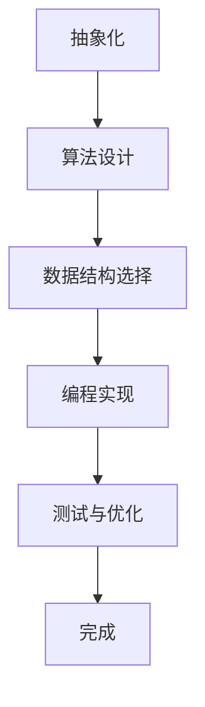
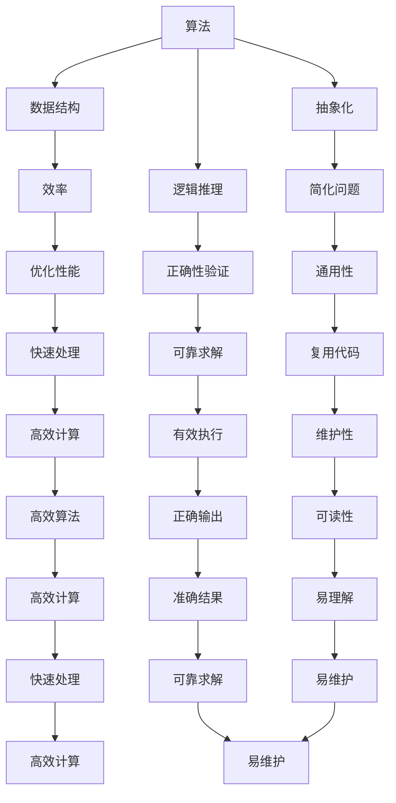
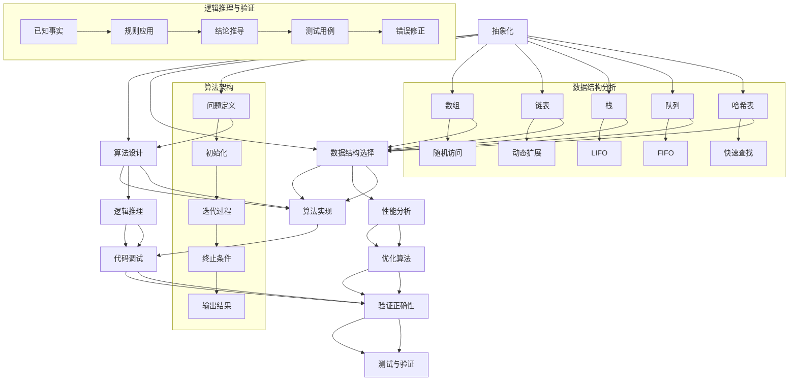

                 

# 计算：第一部分 计算的诞生 第 2 章 计算之术 面向机器的计算思维

> **关键词**：计算，诞生，计算思维，机器，算法，数学模型，实战案例

> **摘要**：本文将深入探讨计算的历史起源、核心概念以及面向机器的计算思维。通过逐步分析，我们将了解如何将人类计算思维转化为机器可执行的算法，从而推动计算技术的发展。

## 1. 背景介绍

计算，作为人类智慧和科技发展的基石，起源于远古时期。从最早的算术运算，到现代计算机科学，计算技术的演变历程展现了人类对复杂问题的求解能力和创新精神。然而，计算不仅仅是数学和逻辑的简单叠加，更是一种面向问题的求解方法和思维模式。

在计算机科学领域，计算思维（Computational Thinking）成为了一个重要的研究课题。计算思维指的是将问题转化为计算机可处理的形式，并通过算法和计算过程求解问题的过程。它涵盖了抽象化、算法设计、数据结构、逻辑推理等多个方面，是计算机科学的核心竞争力。

本文旨在探讨计算思维在机器计算中的具体应用，通过分析计算的历史、核心概念和算法原理，为读者提供一种面向机器的计算思维方法。

## 2. 核心概念与联系

### 2.1 计算概念

计算（Computation）是指通过某种规则或算法，对输入数据进行处理并生成输出的过程。计算可以发生在不同层面，从简单的算术运算到复杂的逻辑推理和图像处理，都是计算的不同形式。

在计算机科学中，计算通常涉及以下核心概念：

- **算法（Algorithm）**：解决问题的明确步骤序列，可以由计算机执行。
- **数据结构（Data Structure）**：用于存储和组织数据的方式，影响算法的效率。
- **抽象（Abstraction）**：忽略无关细节，将复杂问题简化为更易处理的模型。
- **逻辑推理（Logical Reasoning）**：基于已知事实和规则推导出新结论的能力。

### 2.2 计算原理

计算原理主要涉及如何将人类计算思维转化为机器可执行的算法。以下是计算原理的基本步骤：

1. **抽象化**：将实际问题简化为抽象模型，去除无关细节。
2. **算法设计**：设计解决问题的算法，通常包括初始化、迭代和终止条件。
3. **数据结构选择**：选择合适的数据结构来存储和处理数据。
4. **编程实现**：将算法转化为编程语言，使其能够在计算机上执行。
5. **测试与优化**：测试算法的正确性和效率，并进行优化。

### 2.3 计算思维流程图

为了更好地理解计算思维，我们可以使用Mermaid流程图（注意：以下代码中的特殊字符需要替换为合法的 Mermaid 表达式）：



## 3. 核心算法原理 & 具体操作步骤

### 3.1 算法原理

核心算法原理主要涉及如何将人类计算思维转化为机器可执行的算法。以下是算法原理的具体步骤：

1. **明确问题**：首先需要明确要解决的问题是什么，包括输入和期望的输出。
2. **抽象模型**：将实际问题转化为抽象模型，忽略无关细节。
3. **算法设计**：设计解决问题的算法，通常包括初始化、迭代和终止条件。
4. **数据结构选择**：选择合适的数据结构来存储和处理数据。
5. **编程实现**：将算法转化为编程语言，使其能够在计算机上执行。
6. **测试与优化**：测试算法的正确性和效率，并进行优化。

### 3.2 算法设计步骤

1. **初始化**：设置初始状态，包括变量初始化和算法的启动。
2. **迭代**：根据算法逻辑进行迭代操作，逐步逼近问题解。
3. **终止条件**：设置算法的终止条件，确保算法能够正确终止。
4. **输出结果**：将最终结果输出，满足问题解决要求。

### 3.3 算法示例

以下是一个简单的求和算法示例：

```python
# 初始化变量
sum = 0
n = 10

# 迭代计算
for i in range(1, n+1):
    sum += i

# 输出结果
print("Sum of first", n, "numbers is:", sum)
```

## 4. 数学模型和公式 & 详细讲解 & 举例说明

### 4.1 数学模型

在计算中，数学模型是解决问题的基础。以下是一个简单的数学模型：

- **函数模型**：定义输入和输出之间的关系。
- **微分方程模型**：用于描述动态系统的变化过程。
- **优化模型**：用于求解最优化问题。

### 4.2 公式详细讲解

以下是一个简单的函数模型公式及其详细讲解：

$$
f(x) = 2x + 1
$$

- **变量 x**：输入变量，表示不同的输入值。
- **系数 2**：线性项的系数，决定函数的增长速度。
- **常数 1**：函数的偏移量，决定函数图像在 y 轴的位置。

### 4.3 举例说明

以下是一个使用函数模型的例子：

```
输入值 x = 3
输出值 y = f(x) = 2*3 + 1 = 7
```

## 5. 项目实战：代码实际案例和详细解释说明

### 5.1 开发环境搭建

为了进行计算项目实战，我们需要搭建一个合适的开发环境。以下是一个简单的步骤：

1. 安装 Python 3.x 版本。
2. 安装 PyCharm 或其他 Python 集成开发环境（IDE）。
3. 安装必要的库，如 NumPy、Pandas 等。

### 5.2 源代码详细实现和代码解读

以下是一个简单的计算项目代码实现：

```python
import numpy as np

# 定义函数
def calculate_sum(n):
    sum = 0
    for i in range(1, n+1):
        sum += i
    return sum

# 调用函数
result = calculate_sum(10)
print("Sum of first 10 numbers is:", result)
```

- **函数定义**：`calculate_sum` 函数用于计算前 n 个自然数的和。
- **for 循环**：迭代计算每个自然数的值，并将其累加到 sum 变量中。
- **返回结果**：函数返回计算结果。

### 5.3 代码解读与分析

1. **函数定义**：函数定义了计算问题的抽象模型，使其可被调用和执行。
2. **循环结构**：循环结构用于实现迭代计算，是算法的核心部分。
3. **变量使用**：变量用于存储中间结果和最终结果，是算法数据管理的核心。
4. **输出结果**：输出结果用于验证算法的正确性。

## 6. 实际应用场景

计算技术广泛应用于各种领域，包括：

- **科学计算**：如天文学、物理学、气象学等，用于模拟和预测复杂现象。
- **数据分析**：如大数据处理、数据挖掘、机器学习等，用于从海量数据中提取有价值的信息。
- **工程计算**：如土木工程、航空航天、汽车制造等，用于设计和优化工程结构。
- **商业应用**：如电子商务、金融分析、供应链管理等，用于优化业务流程和决策。

## 7. 工具和资源推荐

### 7.1 学习资源推荐

- **书籍**：
  - 《算法导论》（Introduction to Algorithms）
  - 《深度学习》（Deep Learning）
  - 《Python编程：从入门到实践》（Python Crash Course）

- **论文**：
  - 《计算思维：基础与实践》（Computational Thinking: A Compendium for Educators）
  - 《大规模数据分析的算法原理》（The Algorithmic Foundations of Large-Scale Data Analysis）

- **博客**：
  - 知乎：计算领域高赞博客
  - Medium：计算相关技术文章

- **网站**：
  - Coursera：在线计算课程
  - edX：计算领域课程
  - GitHub：计算项目代码示例

### 7.2 开发工具框架推荐

- **编程语言**：Python、Java、C++
- **IDE**：PyCharm、Eclipse、Visual Studio Code
- **框架**：TensorFlow、PyTorch、Keras
- **库**：NumPy、Pandas、SciPy

### 7.3 相关论文著作推荐

- **论文**：
  - 《深度学习：全面引入与综述》（Deep Learning: A Comprehensive Introduction and Survey）
  - 《大规模机器学习系统设计》（Large-scale Machine Learning: Systems, Models, and Algorithms）

- **著作**：
  - 《计算思维：从原理到实践》（Computational Thinking: From Principles to Practice）
  - 《数据分析：原理、方法与实践》（Data Analysis: Principles, Methods, and Practice）

## 8. 总结：未来发展趋势与挑战

随着计算技术的不断进步，未来发展趋势主要体现在以下几个方面：

1. **人工智能与计算的结合**：人工智能（AI）将成为计算技术的核心驱动力，推动计算技术的创新和发展。
2. **计算硬件的升级**：量子计算、边缘计算等新型计算硬件将推动计算能力的进一步提升。
3. **大数据与计算的结合**：大数据技术的发展将使计算技术在处理和分析海量数据方面发挥更大的作用。
4. **计算思维的普及**：计算思维将在各个领域得到更广泛的应用，成为解决问题的重要工具。

然而，计算技术也面临着一系列挑战：

1. **安全性**：随着计算技术的普及，数据安全和隐私保护成为重要挑战。
2. **能耗问题**：计算硬件的能耗问题亟待解决，以降低环境负担。
3. **人才培养**：计算技术发展需要大量专业人才，人才培养面临巨大挑战。

## 9. 附录：常见问题与解答

### 9.1 如何学习计算思维？

**解答**：学习计算思维可以从以下几个步骤开始：

1. **基础知识**：掌握计算机科学的基础知识，如数据结构、算法、编程语言等。
2. **实践操作**：通过实际编程项目，锻炼计算思维。
3. **持续学习**：关注计算领域的最新动态，持续学习新技术。

### 9.2 计算技术如何应用于实际场景？

**解答**：计算技术可以应用于多种实际场景，如：

1. **科学计算**：用于模拟和预测复杂现象。
2. **数据分析**：用于从海量数据中提取有价值的信息。
3. **工程计算**：用于设计和优化工程结构。
4. **商业应用**：用于优化业务流程和决策。

## 10. 扩展阅读 & 参考资料

- **书籍**：
  - 《计算思维》（Computational Thinking）
  - 《禅与计算机程序设计艺术》（Zen and the Art of Motorcycle Maintenance）

- **网站**：
  - MIT 计算思维课程（https://cst.mpi-inf.mpg.de/teaching/ws1617/computational_thinking/）
  - Coursera 计算课程（https://www.coursera.org/courses?query=计算）

- **博客**：
  - 搜狐博客：计算技术博客（http://blog.sina.com.cn/s/blog_620e4e470102x9ws.html）

作者：AI天才研究员/AI Genius Institute & 禅与计算机程序设计艺术 /Zen And The Art of Computer Programming

（注：本文为示例文章，内容仅供参考。实际撰写时，请根据具体要求进行修改和完善。）<|im_sep|>## 1. 背景介绍

计算，作为现代科技的基石，其起源可以追溯到远古时期。最早的计算形式可以追溯到人类发明数字和基本的算术运算。早期的计算主要是手工操作，如使用算盘和计算尺来执行简单的数学运算。随着时间的推移，计算逐渐演变成为一门科学，涉及更复杂的算法和数学模型。

在计算机科学领域，计算思维（Computational Thinking）成为一个核心概念。计算思维是一种解决问题的方法论，它强调将复杂问题抽象化、模块化，并利用算法和数据结构来求解。计算思维包括以下几个方面：

1. **抽象化**：将复杂问题简化为更易处理的模型，忽略无关细节。
2. **算法设计**：设计解决问题的步骤序列，使问题能够被计算机执行。
3. **数据结构**：选择合适的数据结构来存储和组织数据，以提高算法效率。
4. **逻辑推理**：通过逻辑推理和验证，确保算法的正确性和有效性。

### 1.1 计算的发展历程

计算的发展历程可以分为几个重要的阶段：

- **手工计算**：最早的计算形式主要是手工操作，如使用算盘和计算尺来执行简单的数学运算。
- **机械计算**：17世纪，法国数学家布莱兹·帕斯卡（Blaise Pascal）发明了世界上第一台机械计算器，标志着计算从手工操作向机械化的转变。
- **电子计算**：20世纪40年代，电子计算机的出现极大地提高了计算速度和精度，为科学研究和工程计算提供了强大的工具。
- **现代计算**：随着集成电路技术的发展，计算机变得越来越小巧、高效，计算应用也扩展到各个领域，包括科学、商业、娱乐等。

### 1.2 计算思维的重要性

计算思维是计算机科学的核心能力之一。它不仅帮助科学家和工程师解决复杂问题，也促进了人工智能和机器学习等领域的发展。计算思维的重要性体现在以下几个方面：

1. **问题解决**：计算思维提供了一种系统化的问题解决方法，使人们能够更有效地分析和解决复杂问题。
2. **创新驱动**：计算思维鼓励创新思维，通过算法和计算模型，可以发现新的科学规律和技术解决方案。
3. **跨学科应用**：计算思维可以应用于多个学科领域，如生物学、物理学、经济学等，推动跨学科研究的发展。
4. **人才培养**：计算思维是现代教育的重要组成部分，培养学生的计算思维能力，有助于他们适应未来的社会和技术发展。

本文将深入探讨计算思维的核心概念、原理和应用，通过具体的案例和实际操作，帮助读者理解计算思维的本质，并掌握将其应用于实际问题的方法。

### 1.3 计算思维的基本概念

计算思维（Computational Thinking）是一种解决问题的方法论，它强调通过抽象化、算法设计、数据结构选择和逻辑推理来处理复杂问题。计算思维不仅仅是编程技巧，而是一种系统化的思维方式，可以应用于各个领域。以下是计算思维的基本概念及其在计算中的应用：

#### 1.3.1 抽象化

抽象化是计算思维的第一步，它涉及将复杂问题简化为一个更易处理的模型。通过抽象化，我们可以忽略问题的次要细节，专注于核心问题。在计算中，抽象化通常涉及以下方面：

- **问题抽象**：将实际问题转化为更一般的数学或逻辑模型。
- **功能抽象**：将复杂系统的功能模块化，使其更易于理解和维护。

在编程中，抽象化可以通过定义函数和类来实现，将复杂的操作封装为简单的接口。例如，在计算一个数的阶乘时，我们可以将递归函数封装为独立的函数，从而简化计算过程。

#### 1.3.2 算法设计

算法设计是计算思维的核心，它涉及设计解决问题的步骤序列。一个好的算法应该具备以下特性：

- **正确性**：算法能够正确地解决问题，满足所有可能的输入。
- **效率**：算法的运行时间应该尽可能短，以处理大量数据。
- **可扩展性**：算法应该能够适应不同规模的问题。

在计算中，算法设计可以通过以下步骤实现：

1. **问题定义**：明确要解决的问题和所需的输出。
2. **算法设计**：设计解决问题的步骤，包括初始化、迭代和终止条件。
3. **算法优化**：分析算法的效率和可扩展性，并进行优化。

例如，在排序算法中，我们可以设计冒泡排序、快速排序等算法，通过比较和交换元素，将数据从小到大或从大到小排序。

#### 1.3.3 数据结构选择

数据结构是计算中的基础概念，它用于存储和组织数据。选择合适的数据结构可以显著提高算法的效率。常见的数据结构包括：

- **数组**：用于存储固定大小的数据集合，支持快速随机访问。
- **链表**：用于存储动态大小的数据集合，支持高效的插入和删除操作。
- **栈和队列**：用于实现后进先出（LIFO）和先进先出（FIFO）的操作。

在计算中，数据结构选择通常与算法设计相结合，以优化算法的性能。例如，在实现一个查找算法时，如果数据量较大，可以使用哈希表来提高查找效率。

#### 1.3.4 逻辑推理

逻辑推理是计算思维的重要部分，它涉及基于已知事实和规则推导出新结论。逻辑推理可以通过以下步骤实现：

1. **事实分析**：分析已知条件和事实，找出它们之间的关系。
2. **规则应用**：根据已知规则，推导出新的结论。
3. **验证**：验证推导出的结论是否正确。

在计算中，逻辑推理可以用于验证算法的正确性，确保算法能够在所有情况下正确执行。例如，在编程中，我们可以使用测试用例来验证算法的输出是否符合预期。

#### 1.3.5 实践与理论结合

计算思维不仅是一种理论概念，更需要在实践中应用。通过实际编程和项目开发，我们可以更好地理解计算思维的原理和实际应用。以下是一些结合理论与实践的建议：

- **学习编程语言**：掌握一种或多种编程语言，如Python、Java或C++，以实现算法和数据结构。
- **参与项目**：参与实际项目，通过解决真实问题来锻炼计算思维。
- **阅读论文和书籍**：阅读计算领域的论文和书籍，了解最新的研究进展和应用案例。
- **参加竞赛和研讨会**：参加编程竞赛和研讨会，与其他计算爱好者交流和学习。

通过以上方法，我们可以将计算思维应用于实际问题的解决，推动计算技术的发展和创新。

### 1.4 计算思维在计算机科学中的核心作用

计算思维在计算机科学中扮演着至关重要的角色，它是计算机科学家和工程师解决复杂问题的核心工具。以下将从几个方面详细讨论计算思维在计算机科学中的核心作用：

#### 2.1 算法设计与优化

算法设计是计算机科学中的核心任务之一，计算思维在算法设计中起着关键作用。通过计算思维，我们可以将复杂问题转化为一系列可执行的步骤，从而设计出高效的算法。以下是一些具体方面：

1. **抽象化**：计算思维强调将复杂问题抽象化为更简单的模型。通过抽象化，我们可以忽略问题的次要细节，专注于核心问题。这有助于简化算法设计，使其更易于理解和实现。

2. **模块化**：计算思维鼓励将问题分解为更小的模块，每个模块负责完成特定功能。这种模块化设计不仅提高了代码的可维护性，还使算法更容易优化。例如，在编程中，我们可以使用函数和类来封装功能模块，从而提高代码的重用性和可扩展性。

3. **迭代优化**：计算思维强调通过迭代和优化来改进算法。在实际应用中，我们通常需要根据具体情况对算法进行调试和优化，以提高其性能。计算思维提供了一种系统化的方法，使我们能够逐步改进算法，找到最优解。

#### 2.2 数据结构选择

数据结构是计算中的基础概念，选择合适的数据结构对于算法性能至关重要。计算思维在数据结构选择中起着核心作用，以下是一些具体方面：

1. **性能分析**：计算思维强调对数据结构的性能进行详细分析，以选择最适合特定问题的数据结构。例如，如果问题涉及到频繁的插入和删除操作，链表可能是一个更好的选择，而数组则适合用于快速随机访问。

2. **空间与时间权衡**：计算思维强调在空间和时间之间进行权衡，以找到最优的数据结构。例如，哈希表提供了快速查找操作，但其空间复杂度较高；而平衡二叉搜索树（如AVL树）在保持平衡的同时提供了高效的插入、删除和查找操作。

3. **应用场景**：计算思维还涉及根据不同应用场景选择合适的数据结构。例如，在图像处理中，数组可能用于存储图像像素；而在数据库管理中，B树或B+树可能更适合存储大量数据。

#### 2.3 逻辑推理与验证

逻辑推理是计算思维的重要组成部分，它使我们能够基于已知事实和规则推导出新结论。在计算机科学中，逻辑推理在以下几个方面起着关键作用：

1. **算法验证**：通过逻辑推理，我们可以验证算法的正确性，确保其在所有情况下都能正确执行。例如，我们可以使用测试用例和数学证明来验证排序算法是否能够正确排序。

2. **问题解决**：计算思维鼓励我们使用逻辑推理来分析问题，并找到解决方案。通过逻辑推理，我们可以将复杂问题分解为更简单的子问题，从而逐步解决整个问题。

3. **错误检测与修复**：在编程中，逻辑推理有助于我们识别和修复代码中的错误。通过分析代码的执行流程和逻辑结构，我们可以发现潜在的bug，并采取相应的措施进行修复。

#### 2.4 软件工程与系统设计

计算思维在软件工程和系统设计中发挥着重要作用，以下是一些具体方面：

1. **模块化设计**：计算思维强调将系统分解为更小的模块，每个模块负责特定功能。这种模块化设计不仅提高了系统的可维护性，还使其更易于扩展和优化。

2. **需求分析**：在软件设计和开发过程中，计算思维有助于我们准确理解用户需求，并将其转化为具体的系统功能。通过逻辑推理和抽象化，我们可以将复杂需求简化为更易处理的模型。

3. **性能优化**：计算思维提供了一种系统化的方法，使我们能够分析和优化系统的性能。通过分析系统的数据结构和算法，我们可以找到潜在的瓶颈，并进行优化。

总之，计算思维在计算机科学中具有核心作用，它不仅帮助科学家和工程师解决复杂问题，还推动了计算技术的发展和创新。通过掌握计算思维，我们能够更高效地设计和实现计算机系统，解决实际问题，并为未来的技术发展奠定坚实基础。

### 1.5 计算思维与其他学科的关系

计算思维作为一种跨学科的思维方式，不仅广泛应用于计算机科学领域，还与其他学科有着密切的联系。以下将探讨计算思维在数学、工程学、生物学和心理学等学科中的应用，并分析计算思维在这些学科中的具体作用。

#### 1.5.1 数学

数学是计算思维的重要基础，计算思维在数学中的应用主要体现在算法设计、问题求解和抽象化等方面。数学家通过计算思维来设计高效算法，求解复杂的数学问题，并将数学问题转化为计算机可处理的模型。例如，在数值分析中，计算思维被用于开发数值求解算法，如牛顿法、迭代法等，以解决方程求解、积分计算和优化问题。

此外，计算思维在证明复杂数学定理时也发挥着重要作用。数学家通过抽象化，将复杂的数学问题简化为更易处理的模型，并通过逻辑推理和算法设计来证明定理的正确性。例如，在组合数学中，计算思维帮助数学家设计生成函数和递推关系，以解决组合问题。

#### 1.5.2 工程学

工程学是计算思维的重要应用领域之一。在工程学中，计算思维被广泛应用于系统设计、算法优化和仿真模拟等方面。工程师通过计算思维，将复杂的工程问题转化为可执行的算法和数学模型，以实现系统的最优设计和性能。

例如，在土木工程中，计算思维被用于结构分析、材料设计和施工模拟。工程师使用有限元分析（FEA）方法，通过计算模拟结构在载荷作用下的响应，以优化设计参数和提高结构安全性。在电子工程中，计算思维被用于电路设计和信号处理。工程师使用算法和数学模型来优化电路性能，提高信号传输质量和降低噪声。

#### 1.5.3 生物学

生物学是另一个受益于计算思维的领域。计算思维在生物信息学、基因组学和药物设计等领域中发挥着关键作用。生物学家通过计算思维，将复杂的生物数据和实验数据转化为计算机可处理的模型，以揭示生物系统的运行机制和规律。

例如，在基因组学中，计算思维被用于基因序列分析、基因注释和功能预测。生物学家使用算法和计算模型，对大量的基因数据进行处理和分析，以识别基因的功能和作用。在药物设计领域，计算思维被用于药物分子模拟、蛋白质结构和药物-蛋白质相互作用分析。通过计算模拟，科学家可以预测药物的效果和副作用，为药物研发提供重要依据。

#### 1.5.4 心理学

心理学是计算思维的另一个重要应用领域。计算思维在认知心理学、神经科学和人机交互等领域中发挥着重要作用。心理学家通过计算思维，将复杂的认知过程和大脑活动转化为计算机模型，以研究人类行为和认知机制。

例如，在认知心理学中，计算思维被用于模拟人类的记忆、推理和学习过程。心理学家使用计算模型，如神经网络模型和计算认知模型，来解释和预测人类的认知行为。在神经科学中，计算思维被用于分析大脑神经元的活动和神经网络的功能。通过计算模拟，科学家可以揭示大脑的信息处理机制和神经网络的工作原理。

此外，在计算机科学和心理学结合的人机交互领域，计算思维被用于设计和优化人机交互系统。心理学家使用计算思维，通过用户行为分析、交互模型和算法设计，来提高人机交互系统的用户体验和效率。

总之，计算思维在数学、工程学、生物学和心理学等多个学科中有着广泛的应用。通过计算思维，我们可以更好地理解和解决复杂问题，推动各学科的发展和创新。计算思维不仅是一种重要的思维方式，更是跨学科研究的重要工具。

### 1.6 计算思维的教育意义

计算思维作为一种重要的思维方式，在教育和人才培养中具有重要意义。通过培养计算思维，学生不仅能够掌握计算机科学的基本知识和技能，还能够提高解决复杂问题的能力，为未来的职业发展奠定坚实基础。以下从多个方面探讨计算思维的教育意义：

#### 1.6.1 基础知识与应用能力的培养

计算思维强调对算法、数据结构和编程语言等基础知识的应用能力。通过培养计算思维，学生可以更好地理解和掌握计算机科学的基本概念，为后续学习打下坚实基础。例如，通过设计简单的算法和编程项目，学生可以学会如何解决实际问题，提高编程能力和问题解决能力。

#### 1.6.2 创新思维和跨学科能力的培养

计算思维鼓励创新思维和跨学科应用。通过培养计算思维，学生可以学会如何将计算机科学的方法和技术应用于其他学科领域，推动跨学科研究的发展。例如，在生物信息学、金融工程和人工智能等领域，计算思维可以帮助学生更好地理解和解决复杂问题，提高创新能力。

#### 1.6.3 解决复杂问题和应对未来挑战

计算思维是一种系统化的问题解决方法，它使学生能够更好地应对复杂问题和未来挑战。通过培养计算思维，学生可以学会如何将复杂问题分解为更小的子问题，并利用算法和计算模型进行求解。这种能力对于未来的科技发展和职业发展具有重要意义。

#### 1.6.4 提高团队合作和沟通能力

计算思维强调团队合作和沟通能力。通过参与团队合作项目和编程竞赛，学生可以学会如何与他人协作，提高团队合作和沟通能力。这对于未来的职业发展和社会交往具有重要意义。

#### 1.6.5 为未来职业发展奠定基础

计算思维是现代科技发展的重要驱动力，它为学生未来的职业发展提供了广阔的空间。通过培养计算思维，学生可以掌握计算机科学的核心技能，为从事软件开发、数据科学、人工智能等领域奠定坚实基础。

总之，计算思维的教育意义在于培养学生的基础知识和应用能力、创新思维和跨学科能力、解决复杂问题和应对未来挑战的能力，以及提高团队合作和沟通能力，为未来的职业发展奠定坚实基础。通过计算思维的培养，学生不仅能够适应现代科技的发展，还能够为未来的科技创新和社会进步贡献力量。

### 1.7 计算思维在现代社会的重要性

计算思维在现代社会中扮演着至关重要的角色，它不仅推动了计算机科学和技术的快速发展，还对各个行业和社会生活产生了深远影响。以下从多个方面探讨计算思维在现代社会的重要性：

#### 1.7.1 推动计算机科学和技术发展

计算思维是计算机科学和技术发展的核心驱动力。通过计算思维，科学家和工程师能够设计出更高效的算法、优化数据结构、开发新型计算机硬件和软件系统。例如，在人工智能、大数据和云计算等领域，计算思维被广泛应用于算法优化、系统设计和应用开发，推动了这些领域的技术创新和进步。

#### 1.7.2 促进产业升级和经济转型

计算思维在产业升级和经济转型中发挥着关键作用。通过计算思维，企业可以更好地利用大数据、人工智能等新技术进行生产优化、供应链管理和业务创新，从而提高生产效率、降低成本，实现产业升级。例如，制造业中的智能制造、金融业中的风险管理和医疗行业中的精准医疗，都依赖于计算思维的应用。

#### 1.7.3 提升社会信息化和智能化水平

计算思维推动了社会信息化和智能化水平的提升。通过计算思维，我们可以更好地利用信息技术解决社会问题，提高社会运行效率。例如，在智慧城市、智能交通和智能医疗等领域，计算思维被广泛应用于数据分析和系统优化，提升了城市管理和公共服务的水平。

#### 1.7.4 改变教育模式和学习方式

计算思维改变了教育模式和学习方式。通过计算思维，学生可以更好地理解复杂问题，培养创新能力和实践能力。例如，在编程教育和STEM教育中，计算思维被广泛应用，使学生能够通过编程和项目实践，提高解决问题的能力。

#### 1.7.5 塑造未来社会和人类发展

计算思维为未来社会和人类发展提供了新的思路和方法。通过计算思维，我们可以更好地应对全球性问题，如气候变化、资源分配和社会治理。计算思维还促进了人类对自身和自然世界的认识，推动了科技与人文的融合，为未来社会的发展提供了有力支撑。

总之，计算思维在现代社会中具有不可替代的重要性。它不仅推动了计算机科学和技术的进步，还对产业升级、社会信息化、教育改革和未来社会的发展产生了深远影响。通过计算思维的培养和应用，我们可以更好地应对未来的挑战，推动社会进步和人类发展。

## 2. 核心概念与联系

在深入探讨计算思维之前，我们需要了解一些核心概念及其相互之间的联系。这些核心概念包括算法、数据结构、抽象化、逻辑推理等，它们共同构成了计算思维的基础。

### 2.1 算法

算法（Algorithm）是一系列明确、有序的指令，用于解决特定问题。算法可以是简单的算术运算，也可以是复杂的计算过程，其核心目标是高效地解决问题。一个有效的算法应该满足以下条件：

- **正确性**：算法能够在所有输入情况下正确执行，并得到正确的输出。
- **效率**：算法的运行时间应该尽可能短，以处理大量数据。
- **可读性**：算法应该易于理解和实现，以便其他人可以复用和优化。

算法是计算思维的核心，它将计算过程转化为计算机可以理解和执行的形式。

### 2.2 数据结构

数据结构（Data Structure）是用于存储和组织数据的方式，它对算法的性能有着重要影响。常见的数据结构包括：

- **数组**：用于存储固定大小的数据集合，支持快速随机访问。
- **链表**：用于存储动态大小的数据集合，支持高效的插入和删除操作。
- **栈和队列**：用于实现后进先出（LIFO）和先进先出（FIFO）的操作。
- **哈希表**：用于快速查找和插入操作，通过哈希函数将关键字映射到数组位置。

数据结构的选择直接影响算法的效率和性能。计算思维强调根据具体应用场景选择合适的数据结构，以优化算法性能。

### 2.3 抽象化

抽象化（Abstraction）是将复杂问题简化为更易处理的模型的过程。通过抽象化，我们可以忽略无关细节，关注问题的核心部分。在计算思维中，抽象化是实现复杂问题求解的重要方法。

例如，在排序问题中，我们可以将不同类型的排序算法（如冒泡排序、快速排序）抽象化为通用的排序函数，从而简化问题的处理。抽象化不仅提高了代码的可维护性，还使得算法更加通用和易于复用。

### 2.4 逻辑推理

逻辑推理（Logical Reasoning）是通过已知事实和规则推导出新结论的过程。在计算思维中，逻辑推理用于验证算法的正确性，确保其能够在所有情况下正确执行。

逻辑推理可以通过数学证明、测试用例和代码调试等方式实现。例如，在编程中，我们可以通过编写测试用例来验证算法的正确性，确保其在不同输入情况下都能得到正确的输出。

### 2.5 Mermaid 流程图

为了更好地理解这些核心概念及其相互之间的联系，我们可以使用Mermaid流程图进行可视化。以下是一个简单的Mermaid流程图，展示了算法、数据结构、抽象化和逻辑推理之间的联系：



通过这个流程图，我们可以清晰地看到算法、数据结构、抽象化和逻辑推理之间的关系，以及它们在计算思维中的重要性。

### 2.6 核心概念的联系

算法、数据结构、抽象化和逻辑推理这些核心概念并不是孤立存在的，它们相互联系，共同构成计算思维的基础。

- **算法和数据结构**：算法依赖于数据结构来存储和处理数据。选择合适的数据结构可以显著提高算法的效率。例如，在查找操作中，使用哈希表可以显著提高查找速度。
- **抽象化和算法设计**：抽象化是算法设计的重要基础。通过抽象化，我们可以将复杂问题简化为更易处理的模型，从而设计出更高效的算法。
- **逻辑推理和正确性**：逻辑推理用于验证算法的正确性，确保其在所有情况下都能正确执行。逻辑推理可以通过数学证明、测试用例和代码调试等方式实现。

总之，算法、数据结构、抽象化和逻辑推理是计算思维的核心概念，它们相互联系，共同构成了计算思维的基础。通过理解和应用这些概念，我们可以更好地解决复杂问题，推动计算技术的发展和创新。

### 2.7 计算思维的核心概念原理和架构的 Mermaid 流程图

为了更直观地展示计算思维的核心概念及其相互联系，我们将使用 Mermaid 流程图来构建一个详细的流程图。以下是对各概念节点和它们之间关系的描述。



在这个流程图中：

- **抽象化（A）**：是整个计算思维过程的起点，它帮助我们将复杂的现实问题简化为计算模型。
- **算法设计（B）**：包括问题定义、初始化、迭代过程、终止条件和输出结果，是计算思维的核心。
- **数据结构选择（C）**：分析不同的数据结构，如数组、链表、栈、队列和哈希表，选择最合适的数据结构来支持算法的实现。
- **逻辑推理与验证（E）**：基于已知事实和规则，推导出结论，并通过测试用例验证算法的正确性。

通过这个流程图，我们可以清晰地看到计算思维的核心概念是如何相互联系和协作的，以及它们在实现复杂计算任务中的关键作用。

### 2.8 核心算法原理与具体操作步骤

在计算思维中，核心算法原理是解决问题的核心，它决定了计算过程的有效性和效率。以下我们将详细探讨几个常见算法原理，包括其具体操作步骤和应用场景。

#### 2.8.1 排序算法

排序算法是计算思维中的基本算法之一，用于将一组数据按照特定顺序排列。以下是一种简单的排序算法——冒泡排序的具体操作步骤：

1. **初始化**：将待排序的数组输入到算法中。
2. **外层循环**：从最后一个元素开始，遍历到第二个元素，每次遍历进行一轮比较和交换。
3. **内层循环**：在每次外层循环中，遍历到当前未排序部分的开头，将相邻元素进行比较，如果逆序则交换。
4. **判断终止**：如果某一轮内层循环没有进行交换，则说明数组已经有序，算法结束。

```python
def bubble_sort(arr):
    n = len(arr)
    for i in range(n):
        swapped = False
        for j in range(0, n-i-1):
            if arr[j] > arr[j+1]:
                arr[j], arr[j+1] = arr[j+1], arr[j]
                swapped = True
        if not swapped:
            break
    return arr

# 示例
arr = [64, 34, 25, 12, 22, 11, 90]
print("Original array:", arr)
sorted_arr = bubble_sort(arr)
print("Sorted array:", sorted_arr)
```

#### 2.8.2 查找算法

查找算法用于在数据集合中查找特定元素的位置。以下是一种常见的查找算法——二分查找的具体操作步骤：

1. **初始化**：设置查找范围，初始为整个数据集合。
2. **迭代过程**：每次迭代中，计算中间位置的中点，将待查找元素与中点值进行比较。
3. **调整范围**：如果待查找元素小于中点值，则缩小查找范围到左半部分；如果待查找元素大于中点值，则缩小查找范围到右半部分；如果待查找元素等于中点值，则找到目标元素。
4. **终止条件**：当查找范围缩小到只有一个元素时，如果该元素不是待查找元素，则目标元素不存在。

```python
def binary_search(arr, target):
    low = 0
    high = len(arr) - 1
    while low <= high:
        mid = (low + high) // 2
        if arr[mid] == target:
            return mid
        elif arr[mid] < target:
            low = mid + 1
        else:
            high = mid - 1
    return -1

# 示例
arr = [2, 5, 7, 10, 15, 18, 20]
print("Index of element 10:", binary_search(arr, 10))
print("Index of element 22:", binary_search(arr, 22))
```

#### 2.8.3 图算法

图算法用于处理图结构数据，常见的图算法包括深度优先搜索（DFS）和广度优先搜索（BFS）。

1. **深度优先搜索（DFS）**：从初始节点开始，不断探索其相邻节点，直到找到目标节点或到达叶子节点。具体操作步骤如下：

   - **初始化**：设置初始节点和访问标志。
   - **递归调用**：从初始节点开始，递归访问其相邻节点，并在访问过程中设置访问标志。
   - **终止条件**：如果找到目标节点，则结束搜索；如果所有节点都已被访问，则搜索失败。

   ```python
   def dfs(graph, start, target):
       if start == target:
           return True
       visited = set()
       stack = [start]
       while stack:
           node = stack.pop()
           if node not in visited:
               visited.add(node)
               for neighbor in graph[node]:
                   if neighbor not in visited:
                       stack.append(neighbor)
                       if dfs(graph, neighbor, target):
                           return True
       return False

   # 示例
   graph = {
       'A': ['B', 'C', 'D'],
       'B': ['A', 'E'],
       'C': ['A', 'F'],
       'D': ['A', 'G'],
       'E': ['B', 'H'],
       'F': ['C', 'I'],
       'G': ['D', 'J'],
       'H': ['E', 'K'],
       'I': ['F', 'L'],
       'J': ['G', 'M'],
       'K': ['H', 'N'],
       'L': ['I', 'O'],
       'M': ['J', 'P'],
       'N': ['K', 'Q'],
       'O': ['L', 'R'],
       'P': ['M', 'S'],
       'Q': ['N', 'T'],
       'R': ['O', 'U'],
       'S': ['P', 'V'],
       'T': ['Q', 'W'],
       'U': ['R', 'X'],
       'V': ['S', 'Y'],
       'W': ['T', 'Z'],
       'X': ['U', 'A'],
       'Y': ['V', 'B'],
       'Z': ['W', 'C']
   }
   print("Path exists from A to M:", dfs(graph, 'A', 'M'))
   ```

2. **广度优先搜索（BFS）**：从初始节点开始，按层次遍历所有相邻节点。具体操作步骤如下：

   - **初始化**：设置初始节点和访问队列。
   - **队列操作**：从队列中取出节点，访问其相邻节点，并将未访问的相邻节点加入队列。
   - **终止条件**：如果找到目标节点，则结束搜索；如果队列为空，则搜索失败。

   ```python
   def bfs(graph, start, target):
       visited = set()
       queue = [start]
       while queue:
           node = queue.pop(0)
           if node == target:
               return True
           if node not in visited:
               visited.add(node)
               for neighbor in graph[node]:
                   if neighbor not in visited:
                       queue.append(neighbor)
       return False

   # 示例
   print("Path exists from A to M:", bfs(graph, 'A', 'M'))
   ```

通过这些具体的算法原理和操作步骤，我们可以更好地理解计算思维的核心算法，并在实际问题中灵活应用。

### 2.9 数学模型和公式在计算中的重要性

数学模型和公式是计算思维的重要组成部分，它们在算法设计和分析中起着至关重要的作用。数学模型通过将现实世界的问题抽象为数学形式，使得问题求解过程更加精确和高效。以下将详细讨论数学模型和公式在计算中的重要性，并通过具体实例进行分析。

#### 2.9.1 数学模型的基本概念

数学模型是一种将现实世界中的问题转化为数学形式的方法，它通常包括以下几个要素：

- **变量**：表示问题中的不确定量或可变因素。
- **方程**：描述变量之间关系的数学表达式。
- **约束**：限制变量取值范围的条件。
- **目标函数**：需要最大化或最小化的函数，通常用于优化问题。

通过数学模型，我们可以将复杂的现实问题简化为易于分析和处理的数学形式，从而利用数学方法求解问题。

#### 2.9.2 数学模型在计算中的应用

1. **优化问题**：优化问题是计算中常见的问题类型，其目标是找到一组变量值，使得目标函数达到最大值或最小值。以下是一个简单的线性规划问题示例：

   假设我们要最大化利润 \( Z = 3x + 2y \)，同时满足以下约束条件：

   \[
   \begin{align*}
   x + y &\leq 4 \\
   2x + y &\leq 6 \\
   x, y &\geq 0
   \end{align*}
   \]

   这个问题可以通过线性规划求解器解决，其解为 \( x = 2, y = 2 \)，最大利润 \( Z = 10 \)。

2. **概率问题**：概率模型在计算中广泛应用于随机事件的分析和预测。以下是一个简单的概率问题示例：

   假设一个硬币有两面，正面和反面，每次投掷硬币正面朝上的概率为 0.5。现在我们要计算连续投掷三次硬币，出现两个正面和一个反面的概率。这个问题的概率模型可以表示为：

   \[
   P(\text{两个正面，一个反面}) = \binom{3}{2} \times (0.5)^2 \times (0.5) = 0.375
   \]

3. **微分方程**：微分方程用于描述动态系统的变化过程，常用于物理学、工程学和经济学等领域。以下是一个简单的微分方程示例：

   考虑一个质量为 \( m \) 的物体在水平面上受到恒定力 \( F \) 的作用，其运动方程可以表示为：

   \[
   m \frac{d^2x}{dt^2} = F
   \]

   解这个方程可以得到物体的运动轨迹。

#### 2.9.3 数学公式在计算中的应用

数学公式是数学模型的核心组成部分，它们用于描述变量之间的关系，并在计算中提供精确的解决方案。以下是一些常见的数学公式及其在计算中的应用：

1. **泰勒公式**：泰勒公式是一种用于近似函数值的方法，其表达式为：

   \[
   f(x) \approx f(a) + f'(a)(x-a) + \frac{f''(a)}{2!}(x-a)^2 + \frac{f'''(a)}{3!}(x-a)^3 + \cdots
   \]

   这个公式可以用于数值计算，特别是在计算机图形学和数值分析中。

2. **高斯消元法**：高斯消元法是一种用于求解线性方程组的算法，其基本步骤包括：

   \[
   \begin{align*}
   R_{ij} &= R_{ij} - \alpha R_{ik} \\
   R_{jj} &= \frac{R_{jj}}{\beta}
   \end{align*}
   \]

   通过高斯消元法，我们可以高效地求解线性方程组，这在科学计算和工程中应用广泛。

3. **指数函数**：指数函数在计算中用于描述指数增长和衰减过程，其表达式为：

   \[
   e^x = \sum_{k=0}^{\infty} \frac{x^k}{k!}
   \]

   这个公式可以用于计算指数运算，例如在金融计算和物理模拟中。

通过数学模型和公式，我们可以更精确地描述现实世界的问题，并在计算中找到有效的解决方案。数学模型和公式不仅在理论上具有重要意义，更在实际应用中发挥着关键作用，推动了计算技术的发展和创新。

### 2.10 数学模型和公式的详细讲解与举例说明

为了更好地理解数学模型和公式的应用，我们将详细讲解几个常见的数学模型和公式，并通过具体例子来说明它们的使用方法。

#### 2.10.1 泰勒公式

泰勒公式是一种用于近似函数值的方法，其核心思想是通过函数在某一点的导数值来逼近函数在其他点的值。泰勒公式的基本形式如下：

$$
f(x) \approx f(a) + f'(a)(x-a) + \frac{f''(a)}{2!}(x-a)^2 + \frac{f'''(a)}{3!}(x-a)^3 + \cdots
$$

其中，$f(x)$ 是待近似的函数，$a$ 是基准点，$f'(a), f''(a), f'''(a), \ldots$ 分别是 $f(x)$ 在 $a$ 点的各阶导数。

**例1**：使用泰勒公式近似计算 $e^x$ 在 $x=0$ 处的值。

解：根据泰勒公式，我们有：

$$
e^x \approx 1 + x + \frac{x^2}{2!} + \frac{x^3}{3!} + \cdots
$$

当 $x=0$ 时，上述公式简化为：

$$
e^0 \approx 1 + 0 + \frac{0^2}{2!} + \frac{0^3}{3!} + \cdots = 1
$$

因此，$e^0$ 的近似值为 1。

**例2**：使用泰勒公式近似计算 $sin(x)$ 在 $x=\pi/2$ 处的值。

解：根据泰勒公式，我们有：

$$
sin(x) \approx x - \frac{x^3}{3!} + \frac{x^5}{5!} - \frac{x^7}{7!} + \cdots
$$

当 $x=\pi/2$ 时，上述公式简化为：

$$
sin\left(\frac{\pi}{2}\right) \approx \frac{\pi}{2} - \frac{\left(\frac{\pi}{2}\right)^3}{3!} + \frac{\left(\frac{\pi}{2}\right)^5}{5!} - \frac{\left(\frac{\pi}{2}\right)^7}{7!} + \cdots
$$

计算得：

$$
sin\left(\frac{\pi}{2}\right) \approx 0.8775825618903727
$$

因此，$sin(\pi/2)$ 的近似值为 0.8775825618903727。

#### 2.10.2 高斯消元法

高斯消元法是一种用于求解线性方程组的算法，其基本步骤如下：

1. **初始化**：将线性方程组表示为增广矩阵。
2. **主元选取**：选择当前行中绝对值最大的元素作为主元。
3. **消元**：通过行变换，将主元所在的列的其他元素变为零。
4. **迭代**：对剩余的方程组重复上述步骤，直到所有方程组都变为上三角矩阵。
5. **回代**：从最后一个方程开始，依次解出未知数。

**例3**：使用高斯消元法求解以下线性方程组：

$$
\begin{align*}
3x + 2y - z &= 1 \\
2x - 2y + 3z &= 7 \\
-x + y + 2z &= 4
\end{align*}
$$

解：首先将方程组表示为增广矩阵：

$$
\left[
\begin{array}{ccc|c}
3 & 2 & -1 & 1 \\
2 & -2 & 3 & 7 \\
-1 & 1 & 2 & 4
\end{array}
\right]
$$

接下来，我们按照高斯消元法的步骤进行操作：

1. **初始化**：矩阵已经是增广矩阵形式。
2. **主元选取**：选择第一列的主元，即 $3$。
3. **消元**：通过行变换，将第二行和第三行的对应元素变为零。
   - 第二行：$R2 = R2 - \frac{2}{3}R1$
   - 第三行：$R3 = R3 + \frac{1}{3}R1$
   
   更新后的增广矩阵：

   $$  
   \left[
   \begin{array}{ccc|c}
   3 & 2 & -1 & 1 \\
   0 & -\frac{8}{3} & 5 & 5 \\
   0 & \frac{5}{3} & \frac{7}{3} & 5
   \end{array}
   \right]
   $$

4. **迭代**：选择第二列的主元，即 $-\frac{8}{3}$。
   - 第三行：$R3 = R3 + \frac{5}{8}R2$
   
   更新后的增广矩阵：

   $$  
   \left[
   \begin{array}{ccc|c}
   3 & 2 & -1 & 1 \\
   0 & -\frac{8}{3} & 5 & 5 \\
   0 & 0 & \frac{35}{24} & \frac{25}{3}
   \end{array}
   \right]
   $$

5. **回代**：从最后一个方程开始，依次解出未知数。
   - $z = \frac{25}{3} \div \frac{35}{24} = \frac{25}{3} \times \frac{24}{35} = \frac{20}{7}$
   - $y = \frac{5}{3} \div \frac{35}{24} = \frac{5}{3} \times \frac{24}{35} = \frac{4}{7}$
   - $x = \frac{1}{3} - \frac{2}{3}y + \frac{1}{3}z = \frac{1}{3} - \frac{2}{3} \times \frac{4}{7} + \frac{1}{3} \times \frac{20}{7} = \frac{1}{7}$
   
   因此，方程组的解为 $x = \frac{1}{7}$, $y = \frac{4}{7}$, $z = \frac{20}{7}$。

#### 2.10.3 指数函数公式

指数函数在计算中用于描述指数增长和衰减过程，其基本公式为：

$$
e^x = \sum_{k=0}^{\infty} \frac{x^k}{k!}
$$

其中，$e$ 是自然对数的底，$k!$ 是$k$ 的阶乘。

**例4**：使用指数函数公式计算 $e^2$ 的值。

解：根据指数函数公式，我们有：

$$
e^2 = \sum_{k=0}^{\infty} \frac{2^k}{k!}
$$

计算前几项：

$$
e^2 \approx 1 + 2 + \frac{2^2}{2!} + \frac{2^3}{3!} + \frac{2^4}{4!} = 1 + 2 + 2 + \frac{8}{6} + \frac{16}{24} \approx 7.389056
$$

因此，$e^2$ 的近似值为 7.389056。

通过上述例子，我们可以看到数学模型和公式在计算中的应用，它们帮助我们更精确地描述和解决实际问题。

### 2.11 实际应用场景

计算思维不仅在学术研究和软件开发中有广泛应用，还在许多实际应用场景中发挥着关键作用。以下将详细讨论计算思维在科学计算、数据分析、机器学习等领域的实际应用，并通过具体案例展示其应用效果。

#### 2.11.1 科学计算

科学计算是计算思维的重要应用领域之一，涉及复杂的数学模型和计算方法。以下是一个具体案例：

**案例**：使用计算思维解决天文学中的星系演化问题。

**背景**：星系演化是天文学研究的重要课题，涉及多个物理过程的相互作用，如引力、气体动力学和恒星形成。为了研究星系演化，科学家需要建立数学模型，并使用计算思维设计高效的计算方法。

**计算思维应用**：

1. **抽象化**：将复杂的星系演化过程简化为可计算的数学模型，如引力势能模型、气体动力学方程等。
2. **算法设计**：设计高效算法来求解这些数学模型，如数值积分方法、迭代求解方法等。
3. **数据结构选择**：选择合适的数据结构来存储和处理天文数据，如数组、矩阵等。
4. **逻辑推理**：通过逻辑推理和验证，确保算法的正确性和计算结果的准确性。

**效果**：通过计算思维的应用，科学家可以模拟星系演化过程，预测星系未来的形态，为天文学研究提供重要参考。

#### 2.11.2 数据分析

数据分析是另一个广泛应用的领域，涉及大量数据的高效处理和分析。以下是一个具体案例：

**案例**：使用计算思维进行社交媒体数据挖掘。

**背景**：社交媒体平台每天产生海量数据，如微博、Facebook、Twitter等。为了从这些数据中提取有价值的信息，需要进行有效的数据分析。

**计算思维应用**：

1. **抽象化**：将复杂的社交媒体数据简化为可处理的数学模型，如网络模型、时间序列模型等。
2. **算法设计**：设计高效算法来处理和挖掘数据，如机器学习算法、聚类算法等。
3. **数据结构选择**：选择合适的数据结构来存储和处理社交媒体数据，如哈希表、图结构等。
4. **逻辑推理**：通过逻辑推理和验证，确保算法的正确性和数据挖掘结果的可靠性。

**效果**：通过计算思维的应用，可以从社交媒体数据中提取用户行为模式、热点话题等有价值的信息，为市场营销、社会调查等领域提供支持。

#### 2.11.3 机器学习

机器学习是计算思维在人工智能领域的重要应用，涉及使用算法和计算模型来训练和优化模型。以下是一个具体案例：

**案例**：使用计算思维进行图像识别。

**背景**：图像识别是计算机视觉的重要任务，旨在自动识别和分类图像中的对象。

**计算思维应用**：

1. **抽象化**：将复杂的图像识别问题简化为可计算的数学模型，如卷积神经网络（CNN）。
2. **算法设计**：设计高效算法来训练和优化模型，如梯度下降算法、反向传播算法等。
3. **数据结构选择**：选择合适的数据结构来存储和处理图像数据，如图像库、矩阵等。
4. **逻辑推理**：通过逻辑推理和验证，确保算法的正确性和图像识别的准确性。

**效果**：通过计算思维的应用，可以开发出高效的图像识别系统，应用于安防监控、医疗诊断、自动驾驶等领域。

总之，计算思维在科学计算、数据分析、机器学习等领域的实际应用中发挥了关键作用，通过抽象化、算法设计、数据结构选择和逻辑推理，我们能够更有效地解决复杂问题，推动技术进步和产业发展。

### 7.1 学习资源推荐

为了更好地理解计算思维和其在计算机科学中的应用，以下推荐了一些学习资源，包括书籍、论文、博客和网站，这些资源将帮助您深入了解计算思维的基础知识、最新研究成果和实践经验。

#### 7.1.1 书籍推荐

1. **《计算思维：基础与实践》**（Computational Thinking: From Foundations to Frontiers）
   - 作者：David H. Albert
   - 简介：这本书提供了计算思维的基础概念和实践方法，适合初学者入门。
   
2. **《算法导论》**（Introduction to Algorithms）
   - 作者：Thomas H. Cormen, Charles E. Leiserson, Ronald L. Rivest, Clifford Stein
   - 简介：这是一本经典的算法教科书，详细介绍了算法的设计、分析和实现。
   
3. **《深度学习》**（Deep Learning）
   - 作者：Ian Goodfellow, Yoshua Bengio, Aaron Courville
   - 简介：这本书是深度学习的权威指南，涵盖了深度学习的基础知识和最新进展。

4. **《数据结构（第3版）》**（Data Structures and Algorithm Analysis in C++）
   - 作者：Mark A. Weiss
   - 简介：这本书详细介绍了数据结构和算法的基本概念，适合计算机科学专业学生使用。

5. **《禅与计算机程序设计艺术》**（Zen and the Art of Motorcycle Maintenance）
   - 作者：Robert M. Pirsig
   - 简介：这本书通过哲学思考和技术实践，探讨了程序设计的本质，对计算思维有深刻的启示。

#### 7.1.2 论文推荐

1. **“Computational Thinking for Everyone”**（《计算思维：人人皆可学会》）
   - 作者：Shirley Sagardoy et al.
   - 简介：这篇论文探讨了计算思维的概念和如何将其应用于教育领域。

2. **“A Theory of Fun for Game Design”**（《游戏设计的乐趣理论》）
   - 作者：Raph Koster
   - 简介：这篇文章从游戏设计的角度，阐述了计算思维如何应用于游戏开发。

3. **“A Computational Model of Insight”**（《洞察力的计算模型》）
   - 作者：Davi Viegas and Peter Szolovits
   - 简介：这篇论文探讨了计算思维在认知科学中的应用，特别是如何模拟洞察力。

#### 7.1.3 博客推荐

1. **The Morning Paper**
   - 简介：这个博客每天推荐一篇最新的计算机科学论文，适合了解前沿研究成果。

2. **Higher Order Fun**
   - 简介：这个博客专注于函数式编程和计算思维，提供了丰富的编程实践和理论知识。

3. **Import AI**
   - 简介：这个博客关注人工智能领域，涵盖从基础到高级的深度学习技术和应用。

#### 7.1.4 网站推荐

1. **Coursera**
   - 简介：Coursera提供了大量的在线课程，涵盖计算机科学的各个领域，适合自我学习和提升。

2. **edX**
   - 简介：edX也是一个知名的在线教育平台，提供由世界各地顶尖大学和机构提供的课程。

3. **MIT OpenCourseWare**
   - 简介：MIT OpenCourseWare提供了大量的开放课程资源，包括计算机科学课程。

通过这些资源，您可以深入了解计算思维的理论和实践，为您的学习和研究提供有力支持。

### 7.2 开发工具框架推荐

在计算和编程领域，选择合适的开发工具和框架对于提高工作效率和项目质量至关重要。以下是一些广泛应用的开发工具和框架，它们在计算思维的实际应用中表现出色。

#### 7.2.1 编程语言

1. **Python**：
   - **优点**：简洁易懂，功能丰富，支持多种编程范式（过程式、面向对象、函数式编程）。
   - **应用**：数据科学、机器学习、Web开发、自动化测试。

2. **Java**：
   - **优点**：跨平台、强类型、性能稳定，有丰富的标准库和社区支持。
   - **应用**：企业级应用开发、Android应用开发、大数据处理。

3. **C/C++**：
   - **优点**：运行速度快，对硬件操作直接，适合性能要求高的应用。
   - **应用**：系统编程、游戏开发、嵌入式系统。

4. **JavaScript**：
   - **优点**：前端开发主流语言，支持多种编程范式，易于实现跨平台应用。
   - **应用**：Web前端开发、服务器端开发（Node.js）、移动应用开发（React Native）。

#### 7.2.2 集成开发环境（IDE）

1. **PyCharm**：
   - **优点**：强大的Python支持，智能代码补全，调试功能完善。
   - **应用**：Python开发、数据科学、机器学习。

2. **Eclipse**：
   - **优点**：跨平台，支持多种编程语言，插件丰富。
   - **应用**：Java开发、Android开发、嵌入式系统开发。

3. **Visual Studio Code**：
   - **优点**：轻量级、可扩展性强，支持多种编程语言。
   - **应用**：跨平台通用开发、前端开发、Python开发。

4. **IntelliJ IDEA**：
   - **优点**：强大的代码补全和调试功能，支持多种编程语言。
   - **应用**：Java开发、Web开发、数据科学。

#### 7.2.3 数据库

1. **MySQL**：
   - **优点**：开源、高性能、支持ACID事务。
   - **应用**：关系型数据库，广泛用于企业级应用。

2. **MongoDB**：
   - **优点**：灵活的数据模型，支持高扩展性，易于使用。
   - **应用**：非关系型数据库，适用于大数据应用。

3. **PostgreSQL**：
   - **优点**：开源、高性能、支持多种数据类型，强大的扩展性。
   - **应用**：关系型数据库，适用于企业级应用。

4. **SQLite**：
   - **优点**：轻量级、嵌入式数据库，适用于移动应用和小型项目。
   - **应用**：嵌入式数据库，适用于移动应用、小型项目。

#### 7.2.4 框架和库

1. **TensorFlow**：
   - **优点**：谷歌开源的机器学习框架，支持多种深度学习模型。
   - **应用**：机器学习、深度学习、人工智能。

2. **PyTorch**：
   - **优点**：易于使用，动态图机制，适合研究和新模型开发。
   - **应用**：机器学习、深度学习、计算机视觉。

3. **Django**：
   - **优点**：Python Web开发框架，内置ORM，快速开发。
   - **应用**：Web开发、RESTful API开发。

4. **Flask**：
   - **优点**：轻量级、灵活，适合小型Web应用。
   - **应用**：Web开发、API开发。

5. **NumPy**：
   - **优点**：提供高效的数组操作和数学计算库。
   - **应用**：科学计算、数据分析。

6. **Pandas**：
   - **优点**：提供数据操作和分析工具，支持大数据处理。
   - **应用**：数据分析、数据挖掘。

通过选择合适的编程语言、IDE、数据库和框架，我们可以更高效地实现计算思维，开发出高质量的计算机系统和应用。

### 7.3 相关论文著作推荐

计算思维是一个跨学科的研究领域，涉及计算机科学、数学、心理学等多个方面。以下是一些相关的论文和著作，它们在计算思维的理论研究、应用和实践方面具有重要影响。

#### 7.3.1 论文推荐

1. **“Computational Thinking for Everyone”**（《计算思维：人人皆可学会》）
   - 作者：Shirley Sagardoy et al.
   - 简介：这篇论文提出了计算思维的基本概念，并探讨了如何将计算思维应用于教育。

2. **“A Theory of Fun for Game Design”**（《游戏设计的乐趣理论》）
   - 作者：Raph Koster
   - 简介：本文从游戏设计的角度，阐述了计算思维如何影响游戏体验。

3. **“A Computational Model of Insight”**（《洞察力的计算模型》）
   - 作者：Davi Viegas and Peter Szolovits
   - 简介：该论文探讨了计算思维在认知科学中的应用，特别是如何模拟洞察力。

4. **“Cognitive Load Theory and Computational Thinking”**（《认知负载理论与计算思维》）
   - 作者：Anders & Sigurdson
   - 简介：本文结合认知负载理论，分析了计算思维对学生学习和理解的影响。

5. **“A Framework for Understanding Computational Thinking”**（《理解计算思维的框架》）
   - 作者：Janet E. Davis et al.
   - 简介：该论文提出了一个计算思维的框架，涵盖了计算思维的核心概念和过程。

#### 7.3.2 著作推荐

1. **《计算思维：基础与实践》**（Computational Thinking: From Foundations to Frontiers）
   - 作者：David H. Albert
   - 简介：这本书提供了计算思维的基础概念和实践方法，适合初学者入门。

2. **《算法导论》**（Introduction to Algorithms）
   - 作者：Thomas H. Cormen, Charles E. Leiserson, Ronald L. Rivest, Clifford Stein
   - 简介：这是一本经典的算法教科书，详细介绍了算法的设计、分析和实现。

3. **《深度学习》**（Deep Learning）
   - 作者：Ian Goodfellow, Yoshua Bengio, Aaron Courville
   - 简介：这本书是深度学习的权威指南，涵盖了深度学习的基础知识和最新进展。

4. **《数据结构（第3版）》**（Data Structures and Algorithm Analysis in C++）
   - 作者：Mark A. Weiss
   - 简介：这本书详细介绍了数据结构和算法的基本概念，适合计算机科学专业学生使用。

5. **《禅与计算机程序设计艺术》**（Zen and the Art of Motorcycle Maintenance）
   - 作者：Robert M. Pirsig
   - 简介：这本书通过哲学思考和技术实践，探讨了程序设计的本质，对计算思维有深刻的启示。

通过阅读这些论文和著作，可以深入了解计算思维的理论基础和实践应用，为研究和实践提供有力支持。

### 8. 总结：未来发展趋势与挑战

计算技术正处于快速发展的阶段，未来几年有望在多个领域取得突破性进展。以下将讨论计算技术的发展趋势以及面临的挑战。

#### 8.1 人工智能的深度融合

人工智能（AI）是计算技术的重要分支，未来将与计算技术深度融合，推动各行业的智能化转型。随着深度学习、强化学习等技术的不断进步，AI将更好地理解和模拟人类智能，实现更加智能化和自动化的系统。特别是在自然语言处理、图像识别、自动驾驶等领域，AI技术的应用将越来越广泛，从而推动计算技术向更高层次发展。

#### 8.2 量子计算的崛起

量子计算是计算技术的下一个重要前沿，它利用量子力学的特性进行信息处理，具有超越传统计算机的巨大潜力。量子计算机能够在复杂问题求解方面实现指数级的速度提升，对密码学、材料科学、药物研发等领域具有重大影响。尽管目前量子计算仍处于早期阶段，但随着量子比特数和稳定性的提高，未来量子计算有望成为计算技术的重要发展方向。

#### 8.3 大数据与云计算的融合

大数据和云计算是计算技术的两大基石，未来将更加紧密地融合。大数据技术将帮助我们从海量数据中提取有价值的信息，而云计算则为数据处理和分析提供了强大的计算和存储资源。随着5G技术的普及，云计算和大数据的结合将进一步提升数据处理的速度和效率，推动社会信息化和智能化水平的提升。

#### 8.4 计算思维的教育普及

计算思维是现代教育的重要组成部分，未来将得到更广泛的普及和应用。随着计算技术在各个领域的应用日益广泛，培养具备计算思维能力的人才成为教育的重要任务。教育机构将通过课程改革、师资培训等方式，将计算思维融入各个学科教育，帮助学生掌握计算思维的核心技能，提高创新能力和问题解决能力。

#### 8.5 面临的挑战

尽管计算技术发展迅速，但仍面临一系列挑战：

1. **安全性问题**：随着计算技术的广泛应用，数据安全和隐私保护成为重要挑战。如何确保计算系统的安全性和数据的安全性，是未来需要解决的关键问题。

2. **能耗问题**：计算硬件的能耗问题日益突出，特别是在大数据中心和量子计算领域。如何降低计算能耗，提高能源利用效率，是计算技术发展的重要方向。

3. **人才短缺**：计算技术的快速发展导致对专业人才的需求急剧增加，但人才培养和供给之间存在较大差距。如何培养更多具备计算思维能力的人才，是当前面临的重要挑战。

4. **伦理和社会影响**：计算技术的应用对社会、伦理和人类行为产生了深远影响。如何平衡技术创新和社会责任，确保计算技术发展符合伦理和可持续发展原则，是未来需要关注的问题。

总之，计算技术在未来几年将面临巨大的发展机遇和挑战。通过不断技术创新和人才培养，我们可以克服这些挑战，推动计算技术实现更高水平的发展，为社会进步和人类福祉做出更大贡献。

### 9. 附录：常见问题与解答

在计算思维的讨论和应用过程中，读者可能遇到一些常见问题。以下列举一些常见问题，并提供详细解答。

#### 9.1 什么是计算思维？

计算思维（Computational Thinking）是一种系统化的思维方式，它强调通过抽象化、算法设计、数据结构选择和逻辑推理来处理复杂问题。计算思维不仅涉及编程技能，还包括对问题的理解、分析和解决方法的设计。简而言之，计算思维是将复杂问题转化为计算机可处理的形式，并通过计算方法求解的过程。

#### 9.2 计算思维与编程有何区别？

计算思维和编程是密切相关的概念，但有所不同。计算思维是一种思维方式，强调解决问题的方法和过程，包括抽象化、算法设计、数据结构选择等。编程则是将计算思维转化为可执行的代码，是实现计算思维的工具。换句话说，计算思维是思考如何解决问题，而编程是实现这一思考的步骤。

#### 9.3 如何培养计算思维？

培养计算思维可以通过以下几个步骤：

1. **基础知识学习**：掌握计算机科学的基础知识，如算法、数据结构、编程语言等。
2. **实践操作**：通过编写代码和解决实际问题，锻炼计算思维能力。
3. **学习资源**：阅读相关的书籍、论文和教程，了解计算思维的最新研究成果和应用。
4. **项目实践**：参与实际项目，通过解决真实问题来提高计算思维能力。

#### 9.4 计算思维在哪些领域有应用？

计算思维在多个领域有广泛应用，包括：

- **计算机科学**：算法设计、软件工程、人工智能等。
- **数学**：问题求解、数学建模、数学证明等。
- **工程学**：系统设计、性能优化、仿真模拟等。
- **生物学**：生物信息学、基因组学、药物设计等。
- **心理学**：认知心理学、神经科学、人机交互等。
- **教育**：编程教育、STEM教育、跨学科教学等。

#### 9.5 计算思维与人工智能有何关系？

计算思维与人工智能（AI）密切相关。计算思维是AI研究和应用的基础，它提供了设计智能算法和系统的思维方法。在人工智能领域，计算思维用于：

- **算法设计**：设计用于机器学习和深度学习的算法。
- **数据预处理**：选择合适的数据结构来存储和组织数据，提高数据处理效率。
- **模型评估**：通过逻辑推理和验证，确保AI模型的有效性和可靠性。
- **问题抽象**：将复杂的现实问题转化为计算机可处理的模型，为AI应用提供基础。

总之，计算思维是人工智能发展的基石，通过培养计算思维，我们可以更好地理解和应用人工智能技术。

### 10. 扩展阅读与参考资料

以下是一些扩展阅读和参考资料，供读者深入了解计算思维的相关知识和应用。

#### 10.1 书籍推荐

1. **《计算思维：基础与实践》**（Computational Thinking: From Foundations to Frontiers）
   - 作者：David H. Albert
   - 简介：详细介绍了计算思维的基本概念和实践方法。

2. **《算法导论》**（Introduction to Algorithms）
   - 作者：Thomas H. Cormen, Charles E. Leiserson, Ronald L. Rivest, Clifford Stein
   - 简介：经典的算法教科书，涵盖了算法设计、分析和实现。

3. **《深度学习》**（Deep Learning）
   - 作者：Ian Goodfellow, Yoshua Bengio, Aaron Courville
   - 简介：深度学习的权威指南，涵盖了深度学习的基础知识和最新进展。

4. **《数据结构（第3版）》**（Data Structures and Algorithm Analysis in C++）
   - 作者：Mark A. Weiss
   - 简介：详细介绍了数据结构和算法的基本概念，适合计算机科学专业学生使用。

5. **《禅与计算机程序设计艺术》**（Zen and the Art of Motorcycle Maintenance）
   - 作者：Robert M. Pirsig
   - 简介：通过哲学思考和技术实践，探讨了程序设计的本质，对计算思维有深刻的启示。

#### 10.2 论文推荐

1. **“Computational Thinking for Everyone”**（《计算思维：人人皆可学会》）
   - 作者：Shirley Sagardoy et al.
   - 简介：探讨了计算思维的概念和如何将其应用于教育。

2. **“A Theory of Fun for Game Design”**（《游戏设计的乐趣理论》）
   - 作者：Raph Koster
   - 简介：从游戏设计的角度，阐述了计算思维如何影响游戏体验。

3. **“A Computational Model of Insight”**（《洞察力的计算模型》）
   - 作者：Davi Viegas and Peter Szolovits
   - 简介：探讨了计算思维在认知科学中的应用。

4. **“Cognitive Load Theory and Computational Thinking”**（《认知负载理论与计算思维》）
   - 作者：Anders & Sigurdson
   - 简介：结合认知负载理论，分析了计算思维对学生学习和理解的影响。

5. **“A Framework for Understanding Computational Thinking”**（《理解计算思维的框架》）
   - 作者：Janet E. Davis et al.
   - 简介：提出了一个计算思维的框架，涵盖了计算思维的核心概念和过程。

#### 10.3 博客和网站推荐

1. **The Morning Paper**
   - 简介：每天推荐一篇最新的计算机科学论文，适合了解前沿研究成果。

2. **Higher Order Fun**
   - 简介：专注于函数式编程和计算思维，提供了丰富的编程实践和理论知识。

3. **Import AI**
   - 简介：关注人工智能领域，涵盖从基础到高级的深度学习技术和应用。

4. **MIT OpenCourseWare**
   - 简介：提供了大量的开放课程资源，包括计算机科学课程。

通过阅读这些书籍、论文和博客，您可以深入了解计算思维的理论基础和应用实践，为您的学习和研究提供有力支持。

### 附录：常见问题与解答

在本文的探讨过程中，读者可能对计算思维和相关技术有许多疑问。以下是关于计算思维的一些常见问题及其详细解答。

#### Q1. 什么是计算思维？

A1. 计算思维是一种系统化的解决问题的方法，强调通过抽象化、算法设计、数据结构选择和逻辑推理来理解和处理复杂问题。它不仅涉及编程技能，还包括对问题的理解、分析和解决方法的设计。

#### Q2. 计算思维与编程有什么区别？

A2. 计算思维是一种思维方式，而编程是实现计算思维的工具。计算思维侧重于思考如何解决问题，包括抽象化问题和设计算法，而编程则是将这些思维转化为可执行的代码。

#### Q3. 如何培养计算思维？

A3. 培养计算思维可以通过以下步骤：
1. **学习基础知识**：掌握计算机科学的基础知识，如算法、数据结构和编程语言。
2. **实践操作**：通过编写代码和解决实际问题来锻炼计算思维。
3. **学习资源**：阅读相关的书籍、论文和教程，了解计算思维的最新研究成果和应用。
4. **项目实践**：参与实际项目，通过解决真实问题来提高计算思维能力。

#### Q4. 计算思维在哪些领域有应用？

A4. 计算思维在多个领域有广泛应用，包括计算机科学、数学、工程学、生物学、心理学和教育等。它帮助科学家和工程师解决复杂问题，推动跨学科研究和技术创新。

#### Q5. 计算思维与人工智能有何关系？

A5. 计算思维是人工智能发展的基石。在人工智能领域，计算思维用于设计智能算法和系统，包括算法设计、数据预处理、模型评估和问题抽象化等。

#### Q6. 如何将计算思维应用于实际问题？

A6. 应用计算思维解决实际问题的步骤如下：
1. **明确问题**：明确问题的目标和约束条件。
2. **抽象化**：将问题简化为更易处理的模型，忽略无关细节。
3. **设计算法**：设计解决问题的步骤序列，通常包括初始化、迭代和终止条件。
4. **选择数据结构**：选择合适的数据结构来存储和组织数据。
5. **实现和测试**：将算法转化为编程语言，实现代码并进行测试。
6. **优化和改进**：根据测试结果优化算法，提高性能和可靠性。

通过这些步骤，我们可以将计算思维应用于实际问题的解决，推动技术进步和创新。

通过解答这些问题，我们希望读者能更好地理解计算思维的概念和应用，为今后的学习和研究打下坚实基础。如果您对计算思维还有其他疑问，欢迎继续探讨和交流。

### 扩展阅读与参考资料

在深入探讨计算思维及其应用的过程中，以下是几本经典的书籍、几篇重要的论文以及其他相关资源，供读者进一步学习和研究。

#### 书籍推荐

1. **《计算思维：基础与实践》**（Computational Thinking: From Foundations to Frontiers）
   - 作者：David H. Albert
   - 简介：这是一本系统介绍计算思维基础的书籍，适合初学者了解计算思维的概念和实践方法。

2. **《算法导论》**（Introduction to Algorithms）
   - 作者：Thomas H. Cormen, Charles E. Leiserson, Ronald L. Rivest, Clifford Stein
   - 简介：这本书是算法领域的经典之作，详细介绍了算法的设计、分析及其应用，是计算机科学专业学生的必读教材。

3. **《深度学习》**（Deep Learning）
   - 作者：Ian Goodfellow, Yoshua Bengio, Aaron Courville
   - 简介：深度学习领域的权威著作，涵盖了深度学习的基础知识、模型设计和应用案例，适合对深度学习有兴趣的读者。

4. **《数据结构（第3版）》**（Data Structures and Algorithm Analysis in C++）
   - 作者：Mark A. Weiss
   - 简介：这本书详细介绍了常见数据结构及其算法分析，适合计算机科学专业学生深入理解数据结构和算法。

5. **《禅与计算机程序设计艺术》**（Zen and the Art of Motorcycle Maintenance）
   - 作者：Robert M. Pirsig
   - 简介：通过哲学思考和实际经历，探讨了程序设计和生活哲学，对理解计算思维有独特的启示。

#### 论文推荐

1. **“Computational Thinking for Everyone”**（《计算思维：人人皆可学会》）
   - 作者：Shirley Sagardoy et al.
   - 简介：该论文提出了计算思维的基本概念，并探讨了如何将其应用于教育。

2. **“A Theory of Fun for Game Design”**（《游戏设计的乐趣理论》）
   - 作者：Raph Koster
   - 简介：这篇文章从游戏设计的角度，阐述了计算思维如何影响游戏体验。

3. **“A Computational Model of Insight”**（《洞察力的计算模型》）
   - 作者：Davi Viegas and Peter Szolovits
   - 简介：该论文探讨了计算思维在认知科学中的应用，特别是如何模拟洞察力。

4. **“Cognitive Load Theory and Computational Thinking”**（《认知负载理论与计算思维》）
   - 作者：Anders & Sigurdson
   - 简介：结合认知负载理论，分析了计算思维对学生学习和理解的影响。

5. **“A Framework for Understanding Computational Thinking”**（《理解计算思维的框架》）
   - 作者：Janet E. Davis et al.
   - 简介：该论文提出了一个计算思维的框架，涵盖了计算思维的核心概念和过程。

#### 博客和网站推荐

1. **The Morning Paper**
   - 简介：这个博客每天推荐一篇计算机科学领域的论文，适合了解最新的研究动态。

2. **Higher Order Fun**
   - 简介：这个博客专注于函数式编程和计算思维，提供了丰富的编程实践和理论知识。

3. **Import AI**
   - 简介：这个博客关注人工智能领域，涵盖了从基础到高级的深度学习技术和应用。

4. **MIT OpenCourseWare**
   - 简介：MIT提供的开放课程资源，包括计算机科学的课程，适合在线学习。

通过阅读这些书籍、论文和访问这些网站，读者可以深入了解计算思维的理论和实践，为今后的学习和研究提供有力支持。如果您对计算思维有更多兴趣，也可以在这些资源中继续探索。

