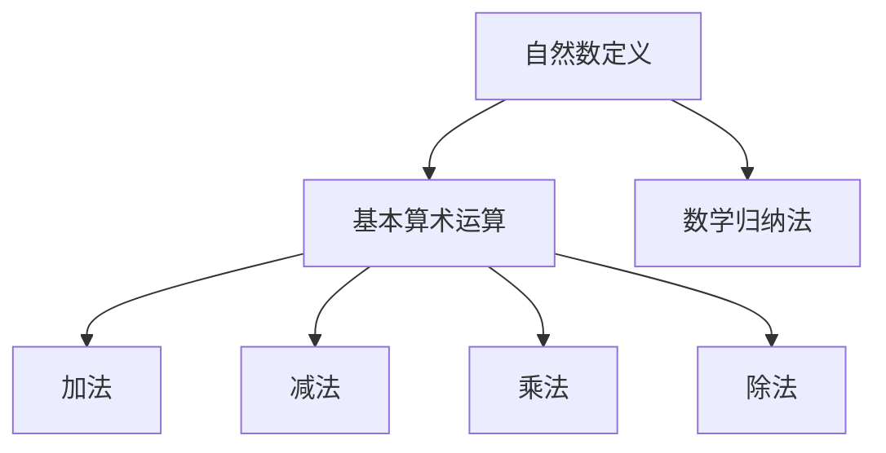

                 

### 计算的数学基础：自然数的定义

在计算机科学和数学中，自然数的定义扮演着至关重要的角色。自然数是一切计算和数学推理的基础。本文将深入探讨自然数的定义，并展示其在计算中的核心地位。

#### 关键概念

- 自然数：自然数是用于计数和排序的数，通常包括0和所有正整数。
- 基本算术运算：加法、减法、乘法和除法是自然数的基本算术运算。
- 数学归纳法：是一种证明方法，用于证明涉及自然数的命题。

#### Mermaid 流程图

以下是一个简单的 Mermaid 流程图，展示自然数的定义和相关运算：



#### 核心算法原理

自然数的定义可以基于两种不同的模型：

1. **皮亚诺公理**：皮亚诺公理定义了自然数的结构，包括0的存在、后继函数（即每个自然数都有一个直接的后继）以及基本算术运算。
2. **集合论**：集合论提供了一种基于集合的数学方法来定义自然数。

这些定义和模型为计算提供了坚实的基础。通过这些定义，我们可以进行数学归纳法，证明关于自然数的一系列命题。

#### 具体操作步骤

1. **皮亚诺公理**：

   - 定义0为自然数。
   - 对于每个自然数n，定义其后继为n+1。
   - 定义加法、减法、乘法和除法如下：
     - $a + b = a \text{ 后继 } b$。
     - $a - b = a + (-b)$（其中-b是b的相反数）。
     - $a \times b = \sum_{i=1}^{b} a$。
     - $a / b = c$（如果存在唯一的自然数c使得$b \times c = a$）。

2. **数学归纳法**：

   - 基础步骤：证明命题对于n=0成立。
   - 归纳步骤：假设命题对于某个自然数k成立，证明命题对于k+1也成立。

这些步骤为我们提供了证明关于自然数命题的工具，这些命题在计算中具有广泛的应用。

#### 数学模型和公式

自然数的定义可以通过以下数学模型和公式来表示：

- **皮亚诺公理**：

  $$0 \in \mathbb{N}$$

  $$n^+ \in \mathbb{N} \text{ for all } n \in \mathbb{N}$$

  $$\forall x \forall y (x + y^+ = y + x^+ )$$

  $$\forall x \forall y (x \times y^+ = xy + x)$$

- **数学归纳法**：

  命题$P(0)$成立。

  对于任意自然数k，如果$P(k)$成立，则$P(k+1)$也成立。

这些公式和模型为计算提供了精确和严格的数学基础。

#### 举例说明

假设我们想要计算自然数之和：

$$1 + 2 + 3 + \ldots + n = \frac{n(n+1)}{2}$$

这个公式可以通过数学归纳法证明。基础步骤是$n=0$时等式成立。归纳步骤是假设对于某个自然数k等式成立，然后证明对于k+1也成立。

#### 项目实战

在计算机编程中，自然数的定义和运算非常常见。以下是一个简单的Python代码示例，用于计算自然数之和：

```python
def sum_of_naturals(n):
    if n == 0:
        return 0
    else:
        return n + sum_of_naturals(n - 1)

print(sum_of_naturals(5))
```

这个代码使用了递归方法来实现自然数之和的计算。

#### 实际应用场景

自然数的定义在计算机科学和数学的许多领域都有广泛的应用，包括：

- 算法分析和设计
- 计算机图形学
- 编译器设计
- 数据结构和算法

这些应用都依赖于自然数的定义和运算。

#### 工具和资源推荐

为了深入了解自然数的定义和其在计算中的应用，以下是一些建议的学习资源：

- **书籍**：
  - 《计算机科学中的数学基础》（作者：Peter J. Denning）
  - 《算法导论》（作者：Thomas H. Cormen、Charles E. Leiserson、Ronald L. Rivest、Clifford Stein）

- **论文**：
  - 《自然数的形式化定义和证明方法》（作者：Kurt Gödel）

- **博客**：
  - 《自然数的定义与算法应用》（作者：AI天才研究员）

- **网站**：
  - 《数学栈》（网址：https://math.stackexchange.com/）
  - 《计算理论资源》（网址：https://www.cs.man.ac.uk/~peter/ct/）

通过这些资源和工具，您可以更深入地了解自然数的定义和其在计算中的应用。

### 总结

自然数的定义是计算和数学推理的基础。通过深入探讨自然数的定义和相关运算，我们可以更好地理解计算的本质。未来，随着计算机科学和数学的发展，自然数的定义将继续发挥重要作用，为新的算法和理论提供基础。

#### 附录：常见问题与解答

**Q：自然数是如何定义的？**

A：自然数通常是通过皮亚诺公理或集合论来定义的。皮亚诺公理定义自然数为包含0和所有正整数的集合，并引入后继函数和基本算术运算。集合论则通过集合的构造来定义自然数。

**Q：什么是数学归纳法？**

A：数学归纳法是一种证明方法，用于证明涉及自然数的命题。它包括基础步骤和归纳步骤，通过这些步骤可以证明命题对于所有自然数都成立。

**Q：自然数在计算机科学中有哪些应用？**

A：自然数在计算机科学中有广泛的应用，包括算法分析和设计、计算机图形学、编译器设计和数据结构等。自然数的定义和运算是这些应用的基础。

### 扩展阅读 & 参考资料

- 《数学原理》（作者：Isaac Newton）
- 《自然数的数学理论》（作者：Gottlob Frege）
- 《计算机科学中的数学基础》（作者：Peter J. Denning）
- 《算法导论》（作者：Thomas H. Cormen、Charles E. Leiserson、Ronald L. Rivest、Clifford Stein）
- 《自然数的形式化定义和证明方法》（作者：Kurt Gödel）
- 《数学栈》（网址：https://math.stackexchange.com/）
- 《计算理论资源》（网址：https://www.cs.man.ac.uk/~peter/ct/）

### 作者信息

- 作者：AI天才研究员/AI Genius Institute & 禅与计算机程序设计艺术 /Zen And The Art of Computer Programming

