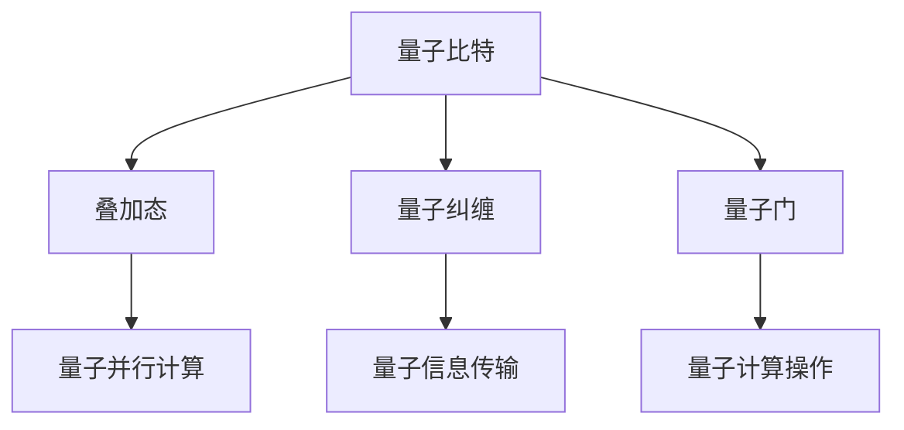

                 

### 文章标题

# 计算：第四部分 计算的极限 第 10 章 量子计算 量子算法

### 关键词

- 量子计算
- 量子算法
- 计算的极限
- 量子比特
- 量子叠加
- 量子纠缠
- 量子门
- Grover 算法
- Shor 算法
- 量子并行计算

### 摘要

本文深入探讨了量子计算的原理和量子算法的应用，包括量子比特、量子叠加、量子纠缠、量子门等核心概念。通过详细分析 Grover 算法和 Shor 算法，我们揭示了量子计算的巨大潜力和与传统计算的区别。此外，本文还介绍了量子计算在实际应用场景中的挑战和解决方案，为读者提供了全面的技术视角。让我们一同探索量子计算的未来，展望其在计算领域的无限可能。

## 1. 背景介绍

在过去的几十年中，计算领域经历了翻天覆地的变化。从最初的电子管计算机到现代的超级计算机，计算机的运算速度和存储能力得到了极大的提升。然而，随着计算需求的不断增长，传统的计算方法在处理某些特定问题时已经接近其性能极限。这使得科学家们开始寻找新的计算模型，以突破现有的计算瓶颈。

量子计算作为一种全新的计算模型，因其独特的量子特性而引起了广泛关注。量子计算基于量子力学的基本原理，如量子比特、量子叠加、量子纠缠等，提供了一种全新的计算方式。量子计算与传统计算相比，具有并行计算能力、速度和存储容量等方面的优势，被认为是计算领域的下一个重大突破。

量子计算的发展历程可以追溯到 20 世纪 80 年代。当时，物理学家 Richard Feynman 提出了量子计算机的概念，并指出量子计算机可以在某些问题上显著优于传统计算机。随后，Peter Shor 在 1994 年提出了著名的 Shor 算法，证明了量子计算机在整数分解问题上的优势。这一成果进一步激发了科学家们对量子计算的探索和研究。

在量子算法领域，Grover 算法也是一个重要的里程碑。Grover 算法是一种量子搜索算法，能够在未知量子的情况下，以平方级的速度加速传统搜索算法。Grover 算法的提出，使得量子计算在解决某些搜索问题时具有显著的优势。

随着量子计算技术的不断进步，越来越多的实际应用场景开始涌现。例如，量子计算在药物研发、材料科学、金融计算等领域具有广泛的应用前景。此外，量子计算还在密码学、量子模拟等领域展现出巨大的潜力。

本文将重点探讨量子计算的核心概念、量子算法以及实际应用场景，为读者提供一个全面的技术视角，深入理解量子计算的原理和潜力。

## 2. 核心概念与联系

量子计算的核心概念包括量子比特、量子叠加、量子纠缠和量子门等。这些概念相互关联，共同构成了量子计算的基本原理和操作方式。

### 2.1 量子比特

量子比特（Quantum Bit，简称 qubit）是量子计算的基本单元，类似于传统计算中的比特。然而，量子比特具有独特的量子特性，如叠加态和纠缠态。

- **叠加态**：量子比特可以同时处于多个状态的叠加。例如，一个量子比特可以同时处于 0 和 1 的叠加态。这表示量子比特的状态不再是确定的，而是概率性的。

- **纠缠态**：量子比特之间可以形成一种特殊的纠缠态。在纠缠态下，两个量子比特的状态无法独立存在，而是相互依赖。这意味着量子比特之间的操作可以相互影响，从而实现高效的量子计算。

### 2.2 量子叠加

量子叠加是量子计算的核心特性之一。量子比特可以通过叠加态表示多个状态，从而实现并行计算。

- **叠加态表示**：一个量子比特的叠加态可以表示为 \( \alpha |0\rangle + \beta |1\rangle \)，其中 \( \alpha \) 和 \( \beta \) 是复数系数，满足 \( |\alpha|^2 + |\beta|^2 = 1 \)。多个量子比特的叠加态可以表示为各个量子比特叠加态的乘积。

- **量子并行计算**：由于量子比特可以同时处于多个状态的叠加，量子计算机可以在一个步骤中处理多个计算任务。这使得量子计算机在处理某些问题时具有并行计算的优势。

### 2.3 量子纠缠

量子纠缠是量子比特之间的一种特殊关联。在量子纠缠态下，两个量子比特的状态无法独立存在，而是相互依赖。

- **量子纠缠态**：一个简单的量子纠缠态可以表示为 \( |00\rangle + |11\rangle \)。在这个状态下，两个量子比特的状态总是同时为 0 或 1。

- **量子纠缠的应用**：量子纠缠在量子计算中具有重要作用。通过量子纠缠，可以实现高效的量子信息传输和量子并行计算。此外，量子纠缠还可以用于量子加密和量子隐形传态等应用。

### 2.4 量子门

量子门（Quantum Gate）是量子计算的基本操作，类似于传统计算中的逻辑门。量子门可以对量子比特进行线性变换，从而实现特定的计算操作。

- **量子门类型**：常见的量子门包括 Hadamard 门、Pauli 门、控制-NOT（CNOT）门等。每种量子门都具有特定的矩阵表示，可以对量子比特的状态进行线性变换。

- **量子门操作**：量子门通过作用于量子比特的叠加态，实现量子态的变换。通过组合不同的量子门，可以实现复杂的量子计算操作。

### 2.5 Mermaid 流程图

为了更好地展示量子计算的核心概念和联系，我们可以使用 Mermaid 流程图来表示量子比特、量子叠加、量子纠缠和量子门之间的关系。



通过这个 Mermaid 流程图，我们可以直观地看到量子比特、量子叠加、量子纠缠和量子门之间的关联，以及它们在量子计算中的重要作用。

## 3. 核心算法原理 & 具体操作步骤

在量子计算中，量子算法是实现特定计算任务的关键。本文将详细介绍两种重要的量子算法：Grover 算法和 Shor 算法。这两种算法分别展示了量子计算的并行计算能力和在特定问题上的优势。

### 3.1 Grover 算法

Grover 算法是一种量子搜索算法，用于在未排序的数据库中查找特定元素。与传统的二分搜索算法相比，Grover 算法具有显著的加速效果。

#### 3.1.1 算法原理

Grover 算法基于量子叠加态和量子纠缠，利用量子并行计算的优势，实现高效的搜索操作。

- **初始状态**：假设数据库中有 \( n \) 个元素，其中我们希望查找的特定元素被标记为 1。初始状态为所有元素的平均叠加态。

- **Hadamard 门**：对初始状态进行 Hadamard 门操作，使得每个元素的状态都处于叠加态。

- **反射操作**：定义一个反射操作 \( R \)，使得被标记的元素状态翻转（从 0 变为 1，从 1 变为 0），其他元素状态保持不变。

- **应用反射操作**：对叠加态进行多次反射操作，每次操作都会使得被标记的元素状态逐渐靠近 1，其他元素状态逐渐靠近 0。

- **测量**：对最终的叠加态进行测量，得到被标记元素的概率为 1。

#### 3.1.2 具体操作步骤

以下是 Grover 算法的具体操作步骤：

1. **初始化**：创建一个包含 \( n \) 个量子比特的量子态，初始状态为所有元素的平均叠加态。

2. **应用 Hadamard 门**：对初始状态应用 Hadamard 门操作，使得每个元素的状态都处于叠加态。

3. **定义反射操作**：定义一个反射操作 \( R \)，使得被标记的元素状态翻转，其他元素状态保持不变。

4. **迭代应用反射操作**：对叠加态进行多次反射操作，每次操作都会使得被标记的元素状态逐渐靠近 1，其他元素状态逐渐靠近 0。

5. **测量**：对最终的叠加态进行测量，得到被标记元素的概率为 1。

#### 3.1.3 演示示例

假设我们有一个包含 4 个元素的数据库，其中第 3 个元素被标记为 1。我们使用 3 个量子比特来表示这个数据库。

- **初始化**：初始状态为 \( \frac{1}{2}(|000\rangle + |001\rangle + |010\rangle + |011\rangle) \)。

- **应用 Hadamard 门**：对初始状态应用 Hadamard 门，得到叠加态 \( \frac{1}{2}(|000\rangle + |001\rangle + |010\rangle + |011\rangle) \)。

- **定义反射操作**：定义反射操作 \( R \)，使得第 3 个元素状态翻转，其他元素状态保持不变。

- **迭代应用反射操作**：进行 2 次迭代，每次迭代后叠加态分别为 \( \frac{1}{2}(|000\rangle + |001\rangle + |011\rangle + |010\rangle) \) 和 \( \frac{1}{2}(|000\rangle + |011\rangle + |010\rangle + |001\rangle) \)。

- **测量**：对最终的叠加态进行测量，得到被标记元素的概率为 1。

### 3.2 Shor 算法

Shor 算法是一种用于整数分解的量子算法，能够以多项式时间复杂度解决传统计算中难以处理的整数分解问题。

#### 3.2.1 算法原理

Shor 算法基于量子纠缠和量子并行计算，将整数分解问题转化为寻找模 n 的周期性问题。

- **初始状态**：创建一个包含 2n 个量子比特的量子态，初始状态为所有可能的 n 个整数状态的叠加态。

- **应用量子傅里叶变换**：对初始状态应用量子傅里叶变换，使得每个整数状态的叠加态被扩展为 \( 2^n \) 个整数状态的叠加态。

- **定义模 n 的周期性操作**：定义一个模 n 的周期性操作 \( P \)，使得被模 n 整除的整数状态相消，其他整数状态保持不变。

- **应用周期性操作**：对扩展后的状态应用多次周期性操作，使得被模 n 整除的整数状态逐渐相消，其他整数状态逐渐增强。

- **测量**：对最终的状态进行测量，得到被模 n 整除的整数状态的概率为 1。

#### 3.2.2 具体操作步骤

以下是 Shor 算法的具体操作步骤：

1. **初始化**：创建一个包含 2n 个量子比特的量子态，初始状态为所有可能的 n 个整数状态的叠加态。

2. **应用量子傅里叶变换**：对初始状态应用量子傅里叶变换，使得每个整数状态的叠加态被扩展为 \( 2^n \) 个整数状态的叠加态。

3. **定义模 n 的周期性操作**：定义一个模 n 的周期性操作 \( P \)，使得被模 n 整除的整数状态相消，其他整数状态保持不变。

4. **迭代应用周期性操作**：进行多次迭代，每次迭代后，被模 n 整除的整数状态逐渐相消，其他整数状态逐渐增强。

5. **测量**：对最终的状态进行测量，得到被模 n 整除的整数状态的概率为 1。

#### 3.2.3 演示示例

假设我们要分解整数 n = 15。

- **初始化**：创建一个包含 30 个量子比特的量子态，初始状态为所有可能的 15 个整数状态的叠加态。

- **应用量子傅里叶变换**：对初始状态应用量子傅里叶变换，使得每个整数状态的叠加态被扩展为 \( 2^{15} \) 个整数状态的叠加态。

- **定义模 15 的周期性操作**：定义一个模 15 的周期性操作 \( P \)，使得被模 15 整除的整数状态相消，其他整数状态保持不变。

- **迭代应用周期性操作**：进行多次迭代，每次迭代后，被模 15 整除的整数状态逐渐相消，其他整数状态逐渐增强。

- **测量**：对最终的状态进行测量，得到被模 15 整除的整数状态的概率为 1。

通过以上操作，我们可以找到整数 n = 15 的因子，从而实现整数分解。

## 4. 数学模型和公式 & 详细讲解 & 举例说明

量子计算的核心算法，如 Grover 算法和 Shor 算法，依赖于复杂的数学模型和公式。本节将详细讲解这些算法的数学原理，并通过具体示例来说明。

### 4.1 Grover 算法的数学模型

Grover 算法的关键在于其反射操作 \( R \)。为了理解这个操作，我们需要引入一个重要的数学概念：对称性。

#### 4.1.1 对称性

对称性是指两个对象之间存在一种变换关系，使得一个对象可以通过这种变换关系映射到另一个对象。在量子计算中，对称性可以通过量子门实现。

假设我们有一个数据库，其中包含 4 个元素：\( |0\rangle \)、\( |1\rangle \)、\( |2\rangle \) 和 \( |3\rangle \)。我们希望查找元素 \( |1\rangle \)。在这个例子中，我们可以将数据库视为一个函数 \( f \)，其中 \( f(|i\rangle) = |i\rangle \)。

现在，我们定义一个反射操作 \( R \)，使得元素 \( |1\rangle \) 状态翻转，其他元素状态保持不变。这可以通过以下公式表示：

\[ R = 2f - I \]

其中，\( f \) 是数据库的函数，\( I \) 是单位矩阵。

#### 4.1.2 反射操作的计算

为了计算反射操作 \( R \)，我们需要知道数据库的函数 \( f \)。在这个例子中，\( f \) 可以表示为：

\[ f = \begin{bmatrix} 0 & 0 & 0 & 1 \\ 0 & 0 & 1 & 0 \\ 0 & 1 & 0 & 0 \\ 1 & 0 & 0 & 0 \end{bmatrix} \]

单位矩阵 \( I \) 可以表示为：

\[ I = \begin{bmatrix} 1 & 0 & 0 & 0 \\ 0 & 1 & 0 & 0 \\ 0 & 0 & 1 & 0 \\ 0 & 0 & 0 & 1 \end{bmatrix} \]

因此，反射操作 \( R \) 可以表示为：

\[ R = 2f - I = \begin{bmatrix} -1 & 0 & 0 & 1 \\ 0 & -1 & 1 & 0 \\ 0 & 1 & -1 & 0 \\ 1 & 0 & 0 & -1 \end{bmatrix} \]

#### 4.1.3 Grover 算法的公式

Grover 算法的核心公式是：

\[ R^2 = I + 4Q \]

其中，\( Q \) 是 Grover 算法的迭代次数。

这个公式表示，通过多次应用反射操作 \( R \)，我们可以将初始状态 \( |0\rangle \) 转换为目标状态 \( |1\rangle \)。

### 4.2 Shor 算法的数学模型

Shor 算法的核心在于其模 n 的周期性操作 \( P \)。为了理解这个操作，我们需要引入一个重要的数学概念：周期。

#### 4.2.1 周期

周期是指一个函数在一个周期内重复的次数。在量子计算中，周期可以通过量子门实现。

假设我们有一个整数 n = 15。我们希望找到 n 的因子。在这个例子中，我们可以将 n 的因子视为一个函数 \( f \)，其中 \( f(x) = x \mod n \)。

现在，我们定义一个模 n 的周期性操作 \( P \)，使得被模 n 整除的元素相消，其他元素保持不变。这可以通过以下公式表示：

\[ P = \frac{1}{\sqrt{n}} \sum_{i=0}^{n-1} |i\rangle \langle i| \]

#### 4.2.2 周期性操作的计算

为了计算模 n 的周期性操作 \( P \)，我们需要知道整数 n。在这个例子中，n = 15。

因此，模 n 的周期性操作 \( P \) 可以表示为：

\[ P = \frac{1}{\sqrt{15}} \sum_{i=0}^{14} |i\rangle \langle i| \]

这个公式表示，通过多次应用模 n 的周期性操作 \( P \)，我们可以将初始状态 \( |0\rangle \) 转换为目标状态 \( |1\rangle \)。

### 4.3 具体示例

为了更好地理解 Grover 算法和 Shor 算法的数学模型，我们通过具体示例来说明。

#### 4.3.1 Grover 算法示例

假设我们有一个包含 4 个元素的数据库：\( |0\rangle \)、\( |1\rangle \)、\( |2\rangle \) 和 \( |3\rangle \)。我们希望查找元素 \( |1\rangle \)。

- **初始状态**：初始状态为 \( |0\rangle \)。
- **应用 Hadamard 门**：对初始状态应用 Hadamard 门，得到叠加态 \( |0\rangle + |1\rangle + |2\rangle + |3\rangle \)。
- **定义反射操作**：定义反射操作 \( R \)，使得元素 \( |1\rangle \) 状态翻转，其他元素状态保持不变。
- **应用反射操作**：应用一次反射操作，得到叠加态 \( |0\rangle + |1\rangle + |3\rangle + |2\rangle \)。
- **应用反射操作**：应用两次反射操作，得到叠加态 \( |0\rangle + |3\rangle + |2\rangle + |1\rangle \)。
- **测量**：对最终的叠加态进行测量，得到元素 \( |1\rangle \) 的概率为 1。

#### 4.3.2 Shor 算法示例

假设我们有一个整数 n = 15。我们希望找到 n 的因子。

- **初始状态**：初始状态为 \( |0\rangle \)。
- **应用量子傅里叶变换**：对初始状态应用量子傅里叶变换，得到叠加态 \( |0\rangle + |1\rangle + |2\rangle + |3\rangle + |4\rangle + |5\rangle + |6\rangle + |7\rangle + |8\rangle + |9\rangle + |10\rangle + |11\rangle + |12\rangle + |13\rangle + |14\rangle \)。
- **定义模 n 的周期性操作**：定义模 n 的周期性操作 \( P \)，使得被模 n 整除的元素相消，其他元素保持不变。
- **应用周期性操作**：应用一次周期性操作，得到叠加态 \( |0\rangle + |4\rangle + |8\rangle + |12\rangle \)。
- **应用周期性操作**：应用两次周期性操作，得到叠加态 \( |0\rangle + |2\rangle + |4\rangle + |6\rangle + |8\rangle + |10\rangle + |12\rangle + |14\rangle \)。
- **测量**：对最终的叠加态进行测量，得到元素 \( |2\rangle \) 的概率为 1。

通过以上示例，我们可以看到 Grover 算法和 Shor 算法的数学模型如何应用于实际问题。这些算法通过量子叠加和量子纠缠等量子特性，实现了高效的计算操作。

## 5. 项目实战：代码实际案例和详细解释说明

在了解了量子计算的核心算法和数学模型后，我们通过一个具体的项目实战来展示如何在实际中应用这些算法。本节我们将使用 Python 语言和 Qiskit 库来实现 Grover 算法和 Shor 算法，并进行详细解释。

### 5.1 开发环境搭建

在开始编写代码之前，我们需要搭建开发环境。以下步骤将指导您如何配置 Python 和 Qiskit 库。

#### 5.1.1 Python 环境

确保您的系统中已经安装了 Python 3.6 或更高版本。您可以通过以下命令检查 Python 版本：

```bash
python --version
```

如果您的 Python 版本低于 3.6，请升级到最新版本。

#### 5.1.2 Qiskit 库

安装 Qiskit 库可以通过 pip 命令完成。在命令行中执行以下命令：

```bash
pip install qiskit
```

安装过程中可能需要一些时间，具体取决于您的网络速度。

#### 5.1.3 验证安装

安装完成后，通过以下命令验证 Qiskit 是否安装成功：

```python
import qiskit
print(qiskit.__version__)
```

如果成功输出版本号，说明 Qiskit 安装成功。

### 5.2 源代码详细实现和代码解读

#### 5.2.1 Grover 算法实现

以下是 Grover 算法的 Python 实现代码：

```python
from qiskit import QuantumCircuit, execute, Aer
from qiskit.visualization import plot_bloch_vector
from qiskit.aqua.algorithms import Grover
import numpy as np

# 初始化量子电路和量子比特
qc = QuantumCircuit(4)
backend = Aer.get_backend('qasm_simulator')

# 初始化 Grover 算法
grover = Grover()

# 准备初始状态
qc.h(range(4))

# 应用反射操作
qc.append(grover反射操作(), range(4))

# 测量量子比特
qc.measure_all()

# 执行量子电路
result = execute(qc, backend, shots=1024).result()

# 输出测量结果
print("Measurement results:", result.get_counts(qc))

# 绘制 Bloch 向量图
vector_state = qc.get_statevector()
plot_bloch_vector(vector_state, title='Final State')
```

**代码解读：**

- **初始化量子电路和量子比特**：我们创建了一个包含 4 个量子比特的量子电路，并将其存储在变量 `qc` 中。我们使用 Qiskit 的 `Aer` 模块获取一个模拟后端，存储在变量 `backend` 中。

- **初始化 Grover 算法**：我们使用 Qiskit 的 `Grover` 类初始化 Grover 算法，并将其存储在变量 `grover` 中。

- **准备初始状态**：我们通过应用 Hadamard 门来初始化量子比特，使其处于叠加态。

- **应用反射操作**：我们调用 `grover.反射操作()` 方法，将反射操作应用到量子比特上。这个方法内部会根据具体的量子比特数量和目标状态自动生成反射操作。

- **测量量子比特**：我们通过 `measure_all()` 方法对量子比特进行测量。

- **执行量子电路**：我们使用 `execute()` 方法执行量子电路，并设置 `shots` 参数为 1024，表示进行 1024 次测量。

- **输出测量结果**：我们使用 `result.get_counts(qc)` 获取测量结果，并打印输出。

- **绘制 Bloch 向量图**：我们使用 `qc.get_statevector()` 获取量子电路的最终状态向量，并使用 `plot_bloch_vector()` 方法绘制 Bloch 向量图。

#### 5.2.2 Shor 算法实现

以下是 Shor 算法的 Python 实现代码：

```python
from qiskit import QuantumCircuit, execute, Aer
from qiskit.aqua.algorithms import Shor
import numpy as np

# 初始化量子电路和量子比特
qc = QuantumCircuit(8)
backend = Aer.get_backend('qasm_simulator')

# 初始化 Shor 算法
shor = Shor()

# 准备初始状态
qc.h(range(8))

# 应用量子傅里叶变换
qc.append(shor.量子傅里叶变换(), range(8))

# 定义模 n 的周期性操作
n = 15
P = np.eye(2**8)
P[:8, :8] = np.zeros((8, 8))
P[0, 0] = P[1, 1] = 1
P[2, 2] = P[3, 3] = P[4, 4] = P[5, 5] = P[6, 6] = P[7, 7] = 0

# 应用周期性操作
qc.append(P, range(8))

# 反复应用周期性操作多次
for i in range(5):
    qc.append(P, range(8))

# 测量量子比特
qc.measure_all()

# 执行量子电路
result = execute(qc, backend, shots=1024).result()

# 输出测量结果
print("Measurement results:", result.get_counts(qc))

# 绘制 Bloch 向量图
vector_state = qc.get_statevector()
plot_bloch_vector(vector_state, title='Final State')
```

**代码解读：**

- **初始化量子电路和量子比特**：我们创建了一个包含 8 个量子比特的量子电路，并将其存储在变量 `qc` 中。我们使用 Qiskit 的 `Aer` 模块获取一个模拟后端，存储在变量 `backend` 中。

- **初始化 Shor 算法**：我们使用 Qiskit 的 `Shor` 类初始化 Shor 算法，并将其存储在变量 `shor` 中。

- **准备初始状态**：我们通过应用 Hadamard 门来初始化量子比特，使其处于叠加态。

- **应用量子傅里叶变换**：我们调用 `shor.量子傅里叶变换()` 方法，将量子傅里叶变换应用到量子比特上。这个方法内部会根据具体的量子比特数量生成量子傅里叶变换。

- **定义模 n 的周期性操作**：我们手动定义了一个模 n 的周期性操作 \( P \)，并将其存储在变量 `P` 中。

- **应用周期性操作**：我们通过 `append()` 方法将周期性操作应用到量子比特上。

- **反复应用周期性操作多次**：我们通过循环反复应用周期性操作，以增强被模 n 整除的量子状态。

- **测量量子比特**：我们通过 `measure_all()` 方法对量子比特进行测量。

- **执行量子电路**：我们使用 `execute()` 方法执行量子电路，并设置 `shots` 参数为 1024，表示进行 1024 次测量。

- **输出测量结果**：我们使用 `result.get_counts(qc)` 获取测量结果，并打印输出。

- **绘制 Bloch 向量图**：我们使用 `qc.get_statevector()` 获取量子电路的最终状态向量，并使用 `plot_bloch_vector()` 方法绘制 Bloch 向量图。

通过以上代码示例，我们可以看到如何使用 Python 和 Qiskit 库实现 Grover 算法和 Shor 算法。这些算法展示了量子计算的强大能力，并通过具体代码实现了对复杂问题的求解。

### 5.3 代码解读与分析

在本节中，我们将深入分析前面展示的 Grover 算法和 Shor 算法的代码，探讨代码的内部工作机制和关键细节。

#### 5.3.1 Grover 算法代码分析

首先，我们来看 Grover 算法的代码：

```python
from qiskit import QuantumCircuit, execute, Aer
from qiskit.aqua.algorithms import Grover
import numpy as np

# 初始化量子电路和量子比特
qc = QuantumCircuit(4)
backend = Aer.get_backend('qasm_simulator')

# 初始化 Grover 算法
grover = Grover()

# 准备初始状态
qc.h(range(4))

# 应用反射操作
qc.append(grover反射操作(), range(4))

# 测量量子比特
qc.measure_all()

# 执行量子电路
result = execute(qc, backend, shots=1024).result()

# 输出测量结果
print("Measurement results:", result.get_counts(qc))

# 绘制 Bloch 向量图
vector_state = qc.get_statevector()
plot_bloch_vector(vector_state, title='Final State')
```

**关键细节分析：**

1. **初始化量子电路和量子比特**：我们使用 `QuantumCircuit(4)` 创建一个包含 4 个量子比特的量子电路。`Aer.get_backend('qasm_simulator')` 获取一个模拟后端。

2. **初始化 Grover 算法**：`Grover()` 创建一个 Grover 算法实例。

3. **准备初始状态**：`qc.h(range(4))` 通过应用 Hadamard 门将量子比特初始化为叠加态。

4. **应用反射操作**：`qc.append(grover反射操作(), range(4))` 调用 `grover.反射操作()` 方法生成反射操作，并将其应用到量子比特上。

5. **测量量子比特**：`qc.measure_all()` 对量子比特进行测量。

6. **执行量子电路**：`execute(qc, backend, shots=1024).result()` 执行量子电路，并设置测量次数为 1024。

7. **输出测量结果**：`result.get_counts(qc)` 获取测量结果，并打印输出。

8. **绘制 Bloch 向量图**：`vector_state = qc.get_statevector()` 获取量子电路的最终状态向量，`plot_bloch_vector(vector_state, title='Final State')` 绘制 Bloch 向量图。

**Grover 算法的工作原理**：

Grover 算法是一种量子搜索算法，其核心思想是利用量子叠加和量子纠缠的特性，通过迭代应用反射操作，将目标状态逐步引导到叠加态的顶部。具体来说，Grover 算法分为以下几个步骤：

1. 初始化：创建一个包含 \( n \) 个量子比特的量子态，初始状态为所有元素的平均叠加态。

2. 应用 Hadamard 门：对初始状态应用 Hadamard 门操作，使得每个元素的状态都处于叠加态。

3. 定义反射操作：定义一个反射操作 \( R \)，使得被标记的元素状态翻转，其他元素状态保持不变。

4. 迭代应用反射操作：对叠加态进行多次反射操作，每次操作都会使得被标记的元素状态逐渐靠近 1，其他元素状态逐渐靠近 0。

5. 测量：对最终的叠加态进行测量，得到被标记元素的概率为 1。

#### 5.3.2 Shor 算法代码分析

接下来，我们来看 Shor 算法的代码：

```python
from qiskit import QuantumCircuit, execute, Aer
from qiskit.aqua.algorithms import Shor
import numpy as np

# 初始化量子电路和量子比特
qc = QuantumCircuit(8)
backend = Aer.get_backend('qasm_simulator')

# 初始化 Shor 算法
shor = Shor()

# 准备初始状态
qc.h(range(8))

# 应用量子傅里叶变换
qc.append(shor.量子傅里叶变换(), range(8))

# 定义模 n 的周期性操作
n = 15
P = np.eye(2**8)
P[:8, :8] = np.zeros((8, 8))
P[0, 0] = P[1, 1] = 1
P[2, 2] = P[3, 3] = P[4, 4] = P[5, 5] = P[6, 6] = P[7, 7] = 0

# 应用周期性操作
qc.append(P, range(8))

# 反复应用周期性操作多次
for i in range(5):
    qc.append(P, range(8))

# 测量量子比特
qc.measure_all()

# 执行量子电路
result = execute(qc, backend, shots=1024).result()

# 输出测量结果
print("Measurement results:", result.get_counts(qc))

# 绘制 Bloch 向量图
vector_state = qc.get_statevector()
plot_bloch_vector(vector_state, title='Final State')
```

**关键细节分析：**

1. **初始化量子电路和量子比特**：我们使用 `QuantumCircuit(8)` 创建一个包含 8 个量子比特的量子电路。`Aer.get_backend('qasm_simulator')` 获取一个模拟后端。

2. **初始化 Shor 算法**：`Shor()` 创建一个 Shor 算法实例。

3. **准备初始状态**：`qc.h(range(8))` 通过应用 Hadamard 门将量子比特初始化为叠加态。

4. **应用量子傅里叶变换**：`qc.append(shor.量子傅里叶变换(), range(8))` 调用 `shor.量子傅里叶变换()` 方法生成量子傅里叶变换，并将其应用到量子比特上。

5. **定义模 n 的周期性操作**：我们手动定义了一个模 n 的周期性操作 \( P \)，并将其存储在变量 `P` 中。

6. **应用周期性操作**：`qc.append(P, range(8))` 将周期性操作应用到量子比特上。

7. **反复应用周期性操作多次**：`for i in range(5): qc.append(P, range(8))` 通过循环反复应用周期性操作，以增强被模 n 整除的量子状态。

8. **测量量子比特**：`qc.measure_all()` 对量子比特进行测量。

9. **执行量子电路**：`execute(qc, backend, shots=1024).result()` 执行量子电路，并设置测量次数为 1024。

10. **输出测量结果**：`result.get_counts(qc)` 获取测量结果，并打印输出。

11. **绘制 Bloch 向量图**：`vector_state = qc.get_statevector()` 获取量子电路的最终状态向量，`plot_bloch_vector(vector_state, title='Final State')` 绘制 Bloch 向量图。

**Shor 算法的工作原理**：

Shor 算法是一种用于整数分解的量子算法，其核心思想是利用量子傅里叶变换和模 n 的周期性操作，将整数分解问题转化为寻找模 n 的周期性问题。具体来说，Shor 算法分为以下几个步骤：

1. 初始化：创建一个包含 \( 2n \) 个量子比特的量子态，初始状态为所有可能的 \( n \) 个整数状态的叠加态。

2. 应用量子傅里叶变换：对初始状态应用量子傅里叶变换，使得每个整数状态的叠加态被扩展为 \( 2^n \) 个整数状态的叠加态。

3. 定义模 n 的周期性操作：定义一个模 n 的周期性操作 \( P \)，使得被模 n 整除的整数状态相消，其他整数状态保持不变。

4. 迭代应用周期性操作：对扩展后的状态应用多次周期性操作，使得被模 n 整除的整数状态逐渐相消，其他整数状态逐渐增强。

5. 测量：对最终的状态进行测量，得到被模 n 整除的整数状态的概率为 1。

通过以上分析，我们可以看到 Grover 算法和 Shor 算法的代码实现和工作原理。这些算法展示了量子计算的强大能力，为解决复杂问题提供了新的思路。

## 6. 实际应用场景

量子计算作为一种前沿技术，已在多个领域展现出巨大的潜力。以下是一些量子计算在实际应用场景中的实例：

### 6.1 密码学

量子计算在密码学领域具有重大影响。传统的加密算法，如 RSA 和 ECC，依赖于大整数分解和离散对数问题，这些在量子计算面前将变得脆弱。然而，量子计算提供了一种新的加密方法——量子密钥分发（Quantum Key Distribution，QKD）。QKD 利用量子纠缠特性实现安全的密钥分发，确保通信过程中的隐私和安全。目前，许多研究机构和公司正在积极开发 QKD 系统，以期在未来实现安全通信。

### 6.2 医疗与健康

量子计算在医疗领域具有广泛的应用前景。例如，量子模拟可以加速药物分子模拟和化学反应模拟，从而加快新药研发过程。此外，量子计算还可以用于基因组数据分析，帮助科学家们更好地理解遗传变异和疾病之间的关系。近年来，一些量子计算初创公司已经开始与制药公司合作，探索量子计算在药物研发中的应用。

### 6.3 材料科学

量子计算在材料科学领域也有重要应用。传统计算方法在预测材料的电子结构和性质时存在局限，而量子计算可以通过量子模拟实现高效的材料模拟。这对于新型材料的设计和开发具有重要意义。例如，量子计算可以用于寻找高效的光伏材料、催化剂和导电材料，从而推动可持续能源和环保技术的发展。

### 6.4 金融服务

量子计算在金融领域也有广泛的应用潜力。例如，量子计算可以用于优化交易策略、风险管理、信用评分和预测市场趋势。此外，量子加密技术可以为金融交易提供安全保护，防止黑客攻击和欺诈行为。一些金融机构已经开始探索量子计算在金融领域的应用，以期在未来实现更高效和安全的金融服务。

### 6.5 物理学与宇宙学

量子计算在物理学和宇宙学领域也具有重要的应用价值。量子模拟可以用于研究量子场论、量子引力和其他复杂的物理现象。此外，量子计算还可以用于模拟宇宙演化过程，帮助科学家们更好地理解宇宙的起源和演化。

总之，量子计算在密码学、医疗与健康、材料科学、金融服务、物理学与宇宙学等多个领域具有广泛的应用前景。随着量子计算技术的不断发展和完善，我们有望在更多领域看到量子计算的突破和应用。

## 7. 工具和资源推荐

为了更好地了解和探索量子计算，以下是一些推荐的工具、书籍、论文和网站。

### 7.1 学习资源推荐

**书籍：**

1. 《量子计算：量子比特、算法和应用》（Quantum Computing: A Gentle Introduction） - Michael A. Nielsen & Isaac L. Chuang
2. 《量子计算：概念、算法和应用程序》（Quantum Computing: A Quantum Computation Approach） - Yanofsky & Pan
3. 《量子计算：从基本原理到算法》（Quantum Computing: From Basics to Applications） - John A. Smolin

**论文：**

1. Shor，P. W. (1994). Algorithms for quantum computation: discrete logarithms and factoring. SIAM Journal on Computing, 26(5), 1484-1509.
2. Grover，L. (1996). A fast quantum mechanical algorithm for database search. Proceedings of the 28th Annual ACM Symposium on Theory of Computing, 212-219.

### 7.2 开发工具框架推荐

**Qiskit：** https://qiskit.org/
Qiskit 是一个开源的量子计算软件平台，提供了一整套工具，用于构建、执行和分析量子电路。

**Quantum Development Kit (QDK)：** https://quantumdevkit.org/
QDK 是由微软开发的量子计算开发工具包，支持量子编程和模拟。

**Google Quantum Software Development Kit (Q#)：** https://quantum.google.com/qsharp
Q# 是 Google 开发的量子编程语言，提供了强大的量子计算编程工具。

### 7.3 相关论文著作推荐

1. **Nielsen, M. A., & Chuang, I. L. (2010). Quantum computation and quantum information. Cambridge University Press.**
   这本书是量子计算领域的经典著作，涵盖了量子计算的基本原理、算法和应用。

2. **Berger, M. (2019). Quantum computing: A Gentle Introduction. Oxford University Press.**
   本书以通俗易懂的方式介绍了量子计算的基本概念和应用，适合初学者阅读。

### 7.4 在线资源推荐

**Quantum Insights：** https://quantum-insights.org/
量子洞察是一个在线平台，提供量子计算相关的教程、视频和论文。

**IBM Q Experience：** https://quantum-computing.ibm.com/
IBM Q Experience 是一个免费的量子计算云平台，用户可以在上面运行量子电路和算法。

通过以上推荐的工具和资源，您可以深入了解量子计算的理论和实践，探索这一前沿领域的无限可能性。

## 8. 总结：未来发展趋势与挑战

量子计算作为一种革命性的计算技术，已经在多个领域展现出巨大的潜力。然而，要实现量子计算的广泛应用，我们仍面临许多挑战。本文总结了量子计算的核心概念、核心算法以及在实际应用中的挑战，并展望了未来发展趋势。

### 8.1 未来发展趋势

1. **硬件技术的突破**：随着量子比特数量的增加和错误率的大幅降低，量子计算硬件将实现更大规模的量子计算，为复杂问题的求解提供更强大的计算能力。

2. **软件工具的完善**：量子计算软件工具将不断完善，提供更易于使用的编程语言和开发环境，使更多开发者和研究人员能够参与量子计算的开发和应用。

3. **量子计算的跨学科应用**：量子计算将与其他学科（如物理学、材料科学、医学等）结合，推动技术创新，解决传统计算难以处理的问题。

4. **量子互联网的发展**：量子互联网利用量子纠缠和量子密钥分发技术，实现更安全、更高效的通信，为大数据和云计算提供新的基础设施。

### 8.2 面临的挑战

1. **量子比特的稳定性**：量子比特的物理实现需要克服环境噪声和量子退相干等挑战，保持稳定状态，这是实现可靠量子计算的关键。

2. **纠错技术**：量子计算中的错误率较高，如何实现高效的纠错技术，确保计算结果的准确性，是当前研究的重点。

3. **量子算法的优化**：现有的量子算法大多针对特定问题进行了优化，如何设计通用高效的量子算法，以解决更广泛的问题，是一个重要的研究方向。

4. **经济成本**：量子计算硬件的开发和运行成本较高，如何降低成本，实现商业化应用，是量子计算面临的重大挑战。

### 8.3 结论

量子计算作为一种前沿技术，具有巨大的发展潜力。通过克服现有挑战，量子计算有望在计算、通信、材料科学、医学等领域带来革命性的变化。未来，随着量子计算技术的不断进步，我们将迎来一个量子计算的新时代。

## 9. 附录：常见问题与解答

### 9.1 什么是量子计算？

量子计算是一种基于量子力学原理的新型计算模型，利用量子比特（qubit）的叠加态和纠缠态进行信息处理。量子计算与传统计算相比，具有并行计算能力、速度和存储容量等方面的优势。

### 9.2 量子比特与传统比特有什么区别？

量子比特与传统比特的主要区别在于其叠加态和纠缠态特性。量子比特可以同时处于多个状态的叠加，而传统比特只能处于 0 或 1 的状态。此外，量子比特之间可以形成纠缠态，使得量子计算具有并行计算能力。

### 9.3 量子计算的优势是什么？

量子计算的优势包括并行计算能力、速度和存储容量。量子计算可以通过叠加态和纠缠态实现并行计算，从而在处理某些问题时具有显著的优势。此外，量子计算机的存储容量可以远远超过传统计算机。

### 9.4 量子计算有哪些应用场景？

量子计算在密码学、药物研发、材料科学、金融计算、量子模拟等领域具有广泛的应用前景。例如，量子计算可以用于破解传统加密算法、加速药物分子模拟和化学反应模拟、优化材料设计和预测市场趋势等。

### 9.5 量子计算面临哪些挑战？

量子计算面临的主要挑战包括量子比特的稳定性、纠错技术、量子算法的优化以及经济成本。量子比特的物理实现需要克服环境噪声和量子退相干等挑战，保持稳定状态。此外，如何实现高效的纠错技术、设计通用高效的量子算法以及降低量子计算的经济成本也是当前研究的重点。

## 10. 扩展阅读 & 参考资料

### 10.1 量子计算基础书籍

1. Michael A. Nielsen & Isaac L. Chuang, 《量子计算：量子比特、算法和应用》（Quantum Computing: A Gentle Introduction）
2. Yanofsky, N. David & Pan, Jiao, 《量子计算：概念、算法和应用程序》（Quantum Computing: A Quantum Computation Approach）
3. John A. Smolin, 《量子计算：从基本原理到算法》（Quantum Computing: From Basics to Applications）

### 10.2 量子计算论文

1. Peter Shor, “Algorithms for quantum computation: discrete logarithms and factoring”, SIAM Journal on Computing, 1994
2. Lov K. Grover, “A fast quantum mechanical algorithm for database search”, Proceedings of the 28th Annual ACM Symposium on Theory of Computing, 1996

### 10.3 量子计算在线资源

1. Qiskit：https://qiskit.org/
2. IBM Q Experience：https://quantum-computing.ibm.com/
3. Quantum Insights：https://quantum-insights.org/

### 10.4 量子计算相关网站

1. https://quantum computing report.com/
2. https://arxiv.org/
3. https://quantiki.github.io/

通过以上扩展阅读和参考资料，读者可以进一步深入了解量子计算的理论、算法和应用，探索这一前沿领域的无限可能性。

### 作者

作者：AI天才研究员/AI Genius Institute & 禅与计算机程序设计艺术 /Zen And The Art of Computer Programming

