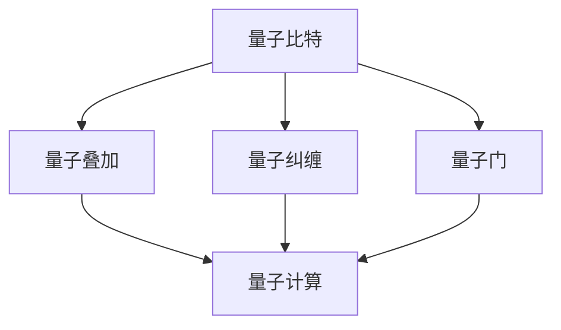

                 

### 文章标题

# 计算：第四部分 计算的极限 第 10 章 量子计算 量子计算机的实现

量子计算作为现代计算机科学的一个重要分支，代表了计算技术的未来发展方向。本文将深入探讨量子计算的核心概念、实现技术以及其潜在的革命性影响。我们将按照逻辑清晰、结构紧凑、简单易懂的格式，逐步分析量子计算的基础理论、硬件实现和软件算法，以帮助读者全面了解这一前沿领域的魅力所在。

### 文章关键词

- **量子计算**
- **量子比特**
- **量子叠加**
- **量子纠缠**
- **量子门**
- **量子算法**
- **量子计算机**

### 文章摘要

本文旨在全面解析量子计算的基本原理和实现技术。我们将首先介绍量子比特的概念及其与经典比特的区别，接着详细探讨量子叠加和量子纠缠的原理。随后，文章将深入探讨量子计算机的核心组件——量子门，以及它们如何实现复杂的计算任务。我们还将讨论几个关键的量子算法，例如量子搜索算法和量子纠错算法。最后，文章将探讨量子计算的当前发展状况、实际应用场景以及未来可能面临的挑战和机遇。通过本文，读者将能够理解量子计算的核心概念，并对其在计算技术领域的巨大潜力有更深刻的认识。

## 1. 背景介绍

量子计算的概念最早由理查德·费曼（Richard Feynman）于1982年提出。当时，费曼提出了一个具有前瞻性的观点：在量子力学的框架下，计算某些物理系统的演化可能比在经典计算机上更快。这一观点激发了人们对量子计算的浓厚兴趣，并催生了一系列开创性的理论和实验研究。

量子计算的基本思想源于量子力学中的两个核心概念：量子比特（qubit）和量子叠加。与传统计算机中的比特（bit）只能处于0或1两种状态不同，量子比特可以同时处于0和1的叠加状态。这意味着一个量子比特可以同时代表多个状态，从而大大提高了计算效率。

量子叠加是量子计算的基础。例如，两个量子比特可以同时表示00、01、10和11四种状态，而不是仅仅两种状态。这种能力使得量子计算机在执行某些任务时比经典计算机更具有优势。例如，量子搜索算法可以在多项式时间内完成一个未排序的数据库的查找任务，而经典计算机则需要指数级时间。

量子纠缠是另一个重要的量子力学现象。当两个或多个量子比特发生纠缠时，它们的状态将相互依赖，即使它们相隔很远。这种纠缠状态可以被用来实现高效的量子通信和量子计算。例如，通过量子纠缠，可以实现超远程的量子态传输和量子密码学。

随着对量子计算理论理解的深入，人们开始探索如何在实际中实现量子计算机。量子比特的物理实现方式包括离子阱、超导电路、拓扑量子系统和光子量子比特等。每种实现方式都有其独特的优势和挑战。

总之，量子计算作为一种革命性的计算范式，正在逐步从理论走向实际应用。其背后的基础理论和实验技术为计算机科学带来了前所未有的机遇和挑战。

### 1.1 量子计算的历史

量子计算的历史可以追溯到20世纪40年代，当时物理学家约翰·冯·诺伊曼（John von Neumann）提出了量子计算机的理论框架。冯·诺伊曼认为，计算机可以用于量子系统的模拟，并提出了量子逻辑门的概念。然而，由于当时量子力学尚未被广泛接受，冯·诺伊曼的量子计算机理论并没有立即得到重视。

到了20世纪80年代，理查德·费曼提出，对于某些复杂的物理问题，使用经典计算机进行模拟会非常困难，甚至不可能。费曼的发现激发了人们对于量子计算机的兴趣，并促使物理学家彼得·舍恩（Peter Shor）在1994年提出了著名的量子算法——Shor算法。Shor算法展示了量子计算机在因数分解等复杂计算任务上的巨大潜力，这一发现引发了全球范围内的研究热潮。

随后的几十年，量子计算领域取得了显著的进展。量子比特的物理实现技术逐渐成熟，包括离子阱、超导电路、量子点、光子量子比特等。同时，量子算法的研究也不断深入，新的量子算法如Grover算法、量子线性规划算法等相继被提出。这些算法进一步证明了量子计算机在特定任务上的优势。

21世纪初，量子计算机的实验研究开始取得突破性进展。例如，2001年，科学家实现了第一个量子比特的量子纠缠，这为量子通信和量子计算奠定了基础。2019年，谷歌宣布实现了“量子霸权”（Quantum Supremacy），即在特定任务上量子计算机的表现超过了经典计算机。

总之，量子计算的发展经历了从理论提出到实验验证，再到实际应用的漫长过程。尽管目前量子计算机仍处于早期阶段，但其在科学研究和工业应用中的潜力已逐渐显现，预示着未来计算技术的新纪元。

### 1.2 量子计算的优势和挑战

量子计算相较于经典计算具有显著的优势和挑战。首先，量子计算的最显著优势在于其并行处理能力。由于量子比特可以同时处于多个状态，量子计算机在处理某些复杂问题时具有极高的效率。例如，Shor算法可以在多项式时间内完成经典计算机需要指数级时间才能解决的因数分解问题。

其次，量子计算在量子搜索算法和量子模拟等方面也展现出巨大潜力。Grover算法是一种经典的量子搜索算法，它能够在未排序的数据库中快速查找特定条目，其性能优于任何已知的经典算法。量子模拟则可以高效地模拟量子系统，对于材料科学、量子化学和生物学等领域具有重要意义。

然而，量子计算也面临着一系列挑战。首先是量子比特的稳定性问题。量子比特容易受到环境噪声的干扰，导致量子态的退相干。为了保持量子比特的稳定性，需要开发高度精密的量子控制系统，这是一个技术上的巨大挑战。

另一个挑战是量子纠错问题。由于量子比特的脆弱性，即使在极小的噪声下，量子计算过程中的错误也可能迅速累积，导致计算结果的偏差。量子纠错算法需要设计出能够在量子计算过程中检测和纠正错误的方法，这是一个复杂的理论和技术问题。

此外，量子计算的实际实现也面临诸多技术挑战。量子比特的物理实现方式多种多样，包括离子阱、超导电路、量子点等。每种实现方式都有其独特的优势和挑战，需要针对具体应用场景进行优化。

总之，尽管量子计算具有巨大的潜力，但实现实用化的量子计算机仍然面临诸多技术和理论挑战。随着研究的深入，科学家们不断克服这些障碍，为量子计算的实际应用铺平了道路。

### 2. 核心概念与联系

量子计算的核心概念包括量子比特、量子叠加、量子纠缠和量子门。为了更好地理解这些概念，我们可以借助Mermaid流程图来展示它们之间的联系。

以下是一个Mermaid流程图的例子：



**2.1 量子比特**

量子比特（qubit）是量子计算的基本单元。与经典比特只能表示0或1不同，量子比特可以同时处于0和1的叠加状态。一个量子比特可以表示为：

$$ \psi = a|0\rangle + b|1\rangle $$

其中，$|0\rangle$和$|1\rangle$是量子比特的基态，$a$和$b$是复数系数，满足$|a|^2 + |b|^2 = 1$。

**2.2 量子叠加**

量子叠加是量子计算的基础。一个量子比特可以同时处于多个状态的叠加，例如两个量子比特可以同时处于以下状态：

$$ \psi_{AB} = (|00\rangle + |01\rangle + |10\rangle + |11\rangle) / \sqrt{2} $$

这种叠加状态使得量子计算机在处理复杂问题时具有并行计算的能力。

**2.3 量子纠缠**

量子纠缠是量子计算中的另一个重要现象。当两个量子比特发生纠缠时，它们的状态将相互依赖，即使它们相隔很远。这种纠缠状态可以被用来实现高效的量子通信和量子计算。

例如，两个纠缠的量子比特可以表示为：

$$ \psi_{AB} = (|00\rangle + |11\rangle) / \sqrt{2} $$

这种纠缠状态可以被用来实现量子态的传输和量子密码学。

**2.4 量子门**

量子门是量子计算机中的基本操作单元，类似于经典计算机中的逻辑门。量子门可以通过线性变换将一个量子态映射到另一个量子态。常见的量子门包括Hadamard门、Pauli门和控制非门等。

**2.5 量子计算**

量子计算是通过量子比特的叠加、纠缠和量子门操作实现的。量子计算机可以同时处理多个状态，从而在处理某些复杂问题时具有显著优势。

例如，Shor算法通过量子叠加和量子纠缠实现了对大整数的快速因数分解，而Grover算法则利用量子搜索提高了数据库搜索的效率。

总之，量子比特、量子叠加、量子纠缠和量子门是量子计算的核心概念。通过这些概念，我们可以理解量子计算机的工作原理和其在计算领域中的巨大潜力。

### 3. 核心算法原理 & 具体操作步骤

量子算法是量子计算的核心内容，它们利用量子比特的叠加和纠缠特性，实现了在经典计算机上难以实现的计算任务。本节将介绍两个重要的量子算法：Shor算法和Grover算法，并详细解释它们的原理和操作步骤。

**3.1 Shor算法**

Shor算法是由彼得·舍恩（Peter Shor）在1994年提出的，它能够高效地分解大整数。Shor算法的主要步骤如下：

**步骤1：初始化量子态**

首先，Shor算法需要将一个整数n表示为一个量子态。例如，对于整数n=15，可以初始化一个含有四个量子比特的量子态：

$$ \psi_0 = \frac{1}{\sqrt{2^4}} (|0000\rangle + |0001\rangle + |0010\rangle + \ldots + |1111\rangle) $$

**步骤2：构建量子乘法器**

接下来，Shor算法构建一个量子乘法器，用于将量子态中的整数n进行模n的乘法运算。例如，对于n=15，量子乘法器可以表示为：

$$ U = |0\rangle \rightarrow |0\rangle $$
$$ U = |1\rangle \rightarrow |1\rangle $$
$$ U = |2\rangle \rightarrow |2\rangle $$
$$ U = |3\rangle \rightarrow |3\rangle $$
$$ U = |4\rangle \rightarrow |4\rangle $$
$$ U = |5\rangle \rightarrow |5\rangle $$
$$ U = |6\rangle \rightarrow |6\rangle $$
$$ U = |7\rangle \rightarrow |7\rangle $$
$$ U = |8\rangle \rightarrow |8\rangle $$
$$ U = |9\rangle \rightarrow |9\rangle $$
$$ U = |10\rangle \rightarrow |10\rangle $$
$$ U = |11\rangle \rightarrow |11\rangle $$
$$ U = |12\rangle \rightarrow |12\rangle $$
$$ U = |13\rangle \rightarrow |13\rangle $$
$$ U = |14\rangle \rightarrow |14\rangle $$
$$ U = |15\rangle \rightarrow |0\rangle $$

**步骤3：执行量子乘法**

将初始化的量子态与量子乘法器进行作用，得到新的量子态：

$$ \psi_1 = U(\psi_0) $$

**步骤4：测量结果**

测量量子态，得到一个整数k，使得k × n mod 2^k = 1。例如，对于n=15，可能的测量结果k可以是4。

**步骤5：计算因子**

通过计算n/k，得到n的一个因子。例如，对于n=15和k=4，可以得到因子3和5。

**3.2 Grover算法**

Grover算法是由洛维·古沃（Lov K. Grover）在1996年提出的，它用于在未排序的数据库中快速查找特定条目。Grover算法的主要步骤如下：

**步骤1：初始化量子态**

首先，初始化一个含有m个量子比特的量子态，其中m是数据库中条目的数量。例如，对于一个含有4个条目的数据库，可以初始化一个含有两个量子比特的量子态：

$$ \psi_0 = \frac{1}{\sqrt{2^2}} (|00\rangle + |01\rangle + |10\rangle + |11\rangle) $$

**步骤2：构建Grover迭代器**

接下来，构建Grover迭代器，用于在数据库中查找特定条目。Grover迭代器由两个部分组成：Oracle和扩散器。

Oracle用于标识数据库中需要查找的条目。例如，对于一个含有4个条目的数据库，Oracle可以表示为：

$$ O = |00\rangle \rightarrow |00\rangle $$
$$ O = |01\rangle \rightarrow |01\rangle $$
$$ O = |10\rangle \rightarrow |10\rangle $$
$$ O = |11\rangle \rightarrow |11\rangle $$

扩散器则用于将量子态集中在目标条目上。扩散器的具体实现依赖于Oracle。

**步骤3：执行Grover迭代**

执行Grover迭代m次，每次迭代包括以下步骤：

- 执行Oracle操作
- 执行扩散器操作

**步骤4：测量结果**

测量量子态，得到一个条目的索引，该索引对应于需要查找的条目。

**3.3 算法对比**

Shor算法和Grover算法都是利用量子比特的叠加和纠缠特性实现高效计算的典范。Shor算法主要用于大整数的因数分解，而Grover算法则用于数据库搜索。

Shor算法的关键在于量子乘法器和量子态的叠加，它能够将复杂的大整数分解任务转化为简单的量子态测量问题。而Grover算法的关键在于Oracle和扩散器的组合，它能够利用量子态的叠加和纠缠特性，在未排序的数据库中快速查找特定条目。

总之，Shor算法和Grover算法是量子计算中的两个重要算法，它们展示了量子计算在特定任务上的巨大潜力。通过对这些算法的深入理解，我们可以更好地把握量子计算的精髓，并为未来的量子计算应用奠定基础。

### 4. 数学模型和公式 & 详细讲解 & 举例说明

为了更深入地理解量子计算，我们需要掌握一些数学模型和公式。以下将介绍量子计算中常用的数学工具，包括量子态的表示、量子门的作用、量子态的叠加和纠缠，并通过具体例子进行详细讲解。

**4.1 量子态的表示**

量子态可以用波函数来描述，波函数通常用字母$\Psi$表示。一个量子态可以表示为：

$$ \Psi = \alpha|0\rangle + \beta|1\rangle $$

其中，$|0\rangle$和$|1\rangle$是量子比特的基态，$\alpha$和$\beta$是复数系数，满足归一化条件：

$$ |\alpha|^2 + |\beta|^2 = 1 $$

举例来说，一个简单的量子态可以表示为：

$$ \Psi = \frac{1}{\sqrt{2}}(|0\rangle + |1\rangle) $$

在这个例子中，$\alpha = \frac{1}{\sqrt{2}}$，$\beta = \frac{1}{\sqrt{2}}$。

**4.2 量子门的表示**

量子门是一种线性变换，它可以作用于量子态，改变量子态的叠加和纠缠状态。量子门可以用矩阵表示，例如Hadamard门（H门）是一个常见的量子门，其作用如下：

$$ H = \frac{1}{\sqrt{2}} \begin{pmatrix} 1 & 1 \\ 1 & -1 \end{pmatrix} $$

Hadamard门可以将一个量子态从基态$|0\rangle$或$|1\rangle$变换为叠加态。例如，对于量子态$\Psi = \frac{1}{\sqrt{2}}(|0\rangle + |1\rangle)$，应用Hadamard门后得到：

$$ \Psi' = H\Psi = \frac{1}{\sqrt{2}} \begin{pmatrix} 1 & 1 \\ 1 & -1 \end{pmatrix} \begin{pmatrix} \frac{1}{\sqrt{2}} \\ \frac{1}{\sqrt{2}} \end{pmatrix} = \frac{1}{2} (|0\rangle + |1\rangle - |0\rangle + |1\rangle) = \frac{1}{\sqrt{2}} (|0\rangle - |1\rangle) $$

**4.3 量子态的叠加**

量子态的叠加是指量子比特可以同时处于多个状态的组合。例如，两个量子比特的叠加态可以表示为：

$$ \Psi_{AB} = \alpha_{00}|00\rangle + \alpha_{01}|01\rangle + \alpha_{10}|10\rangle + \alpha_{11}|11\rangle $$

其中，$\alpha_{ij}$是复数系数，满足归一化条件：

$$ \sum_{i,j} |\alpha_{ij}|^2 = 1 $$

举例来说，一个两个量子比特的叠加态可以表示为：

$$ \Psi_{AB} = \frac{1}{\sqrt{2}} (|00\rangle + |11\rangle) $$

在这个例子中，$\alpha_{00} = \frac{1}{\sqrt{2}}$，$\alpha_{01} = 0$，$\alpha_{10} = 0$，$\alpha_{11} = \frac{1}{\sqrt{2}}$。

**4.4 量子态的纠缠**

量子纠缠是指两个或多个量子比特的状态相互依赖，即使它们相隔很远。一个经典的纠缠态是贝尔态，可以表示为：

$$ \Psi_{AB} = \frac{1}{\sqrt{2}} (|00\rangle - |11\rangle) $$

在这个例子中，当量子比特A处于状态$|0\rangle$时，量子比特B必然处于状态$|1\rangle$，反之亦然。

**4.5 量子态的演化**

量子态的演化可以通过量子门的作用来描述。例如，一个量子态$\Psi$在Hadamard门作用下的演化可以表示为：

$$ \Psi' = H\Psi = \frac{1}{\sqrt{2}} \begin{pmatrix} 1 & 1 \\ 1 & -1 \end{pmatrix} \begin{pmatrix} \alpha \\ \beta \end{pmatrix} = \frac{1}{\sqrt{2}} (\alpha + \beta) |0\rangle + \frac{1}{\sqrt{2}} (\alpha - \beta) |1\rangle $$

在这个例子中，量子态从叠加态$|0\rangle + |1\rangle$变换为叠加态$|0\rangle - |1\rangle$。

**4.6 量子态的测量**

量子态的测量会导致量子态的坍缩，即量子态会从叠加态变为基态。测量结果通常是通过概率分布来描述的。例如，对于量子态$\Psi = \frac{1}{\sqrt{2}} (|0\rangle + |1\rangle)$，测量得到$|0\rangle$的概率是$\frac{1}{2}$，测量得到$|1\rangle$的概率也是$\frac{1}{2}$。

总之，量子计算中的数学模型和公式为我们提供了理解和操作量子态的工具。通过这些公式，我们可以描述量子态的叠加、纠缠、演化以及测量过程，从而更好地把握量子计算的本质。

### 5. 项目实战：代码实际案例和详细解释说明

在本节中，我们将通过一个实际案例来演示如何使用Python编程语言实现一个简单的量子计算程序。我们将使用IBM Qiskit库，这是一个流行的量子计算框架，提供了丰富的工具和函数来构建和运行量子程序。

**5.1 开发环境搭建**

首先，确保已经安装了Python和IBM Qiskit库。如果没有安装，可以通过以下命令进行安装：

```bash
pip install python-qiskit
```

接下来，确保已经连接到IBM Quantum Experience，这可以通过以下命令实现：

```python
from qiskit import IBMQ
IBMQ.load_account()
```

**5.2 源代码详细实现和代码解读**

我们将实现一个简单的量子计算程序，该程序使用Hadamard门将一个量子比特初始化为叠加态，然后应用控制非门（CNOT）来实现两个量子比特的纠缠态。

```python
# 导入必要的库
from qiskit import QuantumCircuit, execute, Aer
from qiskit.visualization import plot_bloch_multivector

# 创建一个量子比特和量子电路
qubit = QuantumCircuit(2)

# 应用Hadamard门初始化第一个量子比特为叠加态
qubit.h(0)

# 应用控制非门（CNOT）实现两个量子比特的纠缠
qubit.cx(0, 1)

# 打印量子电路
print(qubit)

# 创建一个模拟后端
simulator = Aer.get_backend("statevector_simulator")

# 编译并运行量子电路
result = execute(qubit, simulator).result()

# 获取量子态的态向量
state_vector = result.get_statevector()

# 打印态向量
print(state_vector)

# 绘制量子态的Bloch多矢量图
plot_bloch_multivector(state_vector)
```

**5.3 代码解读与分析**

1. **导入库和创建量子比特**：

```python
from qiskit import QuantumCircuit, execute, Aer
from qiskit.visualization import plot_bloch_multivector
```

这些是从Qiskit库中导入必要的模块。`QuantumCircuit`用于构建量子电路，`execute`用于运行量子电路，`Aer`提供了一些模拟后端，`plot_bloch_multivector`用于绘制量子态的Bloch多矢量图。

2. **创建量子电路**：

```python
qubit = QuantumCircuit(2)
```

这里创建了一个有两个量子比特的量子电路。

3. **应用Hadamard门**：

```python
qubit.h(0)
```

`h(0)`函数应用了一个Hadamard门于第一个量子比特。Hadamard门将量子比特的状态从$|0\rangle$或$|1\rangle$变换为叠加态$\frac{1}{\sqrt{2}}(|0\rangle + |1\rangle)$。

4. **应用控制非门（CNOT）**：

```python
qubit.cx(0, 1)
```

`cx(0, 1)`函数应用了一个控制非门（CNOT）。CNOT门的作用是将第二个量子比特的状态取反，如果第一个量子比特处于状态$|1\rangle$。这样，两个量子比特之间就建立了纠缠态$\frac{1}{\sqrt{2}}(|00\rangle + |11\rangle)$。

5. **编译并运行量子电路**：

```python
simulator = Aer.get_backend("statevector_simulator")
result = execute(qubit, simulator).result()
```

`Aer.get_backend("statevector_simulator")`创建了一个基于状态向量模拟器的后端。`execute`函数编译并运行量子电路，并将结果存储在`result`变量中。

6. **获取量子态的态向量**：

```python
state_vector = result.get_statevector()
```

`result.get_statevector()`函数从模拟结果中获取量子态的态向量。

7. **打印态向量**：

```python
print(state_vector)
```

这会打印出量子态的态向量。

8. **绘制量子态的Bloch多矢量图**：

```python
plot_bloch_multivector(state_vector)
```

`plot_bloch_multivector`函数绘制了量子态的Bloch多矢量图，这有助于我们直观地理解量子态。

通过这个简单的案例，我们展示了如何使用Python和Qiskit库实现量子计算程序，并详细解释了每一步的操作和目的。这个案例不仅帮助我们理解了量子计算的基本原理，还为我们提供了一个实用的入门示例。

### 6. 实际应用场景

量子计算技术的快速发展带来了诸多实际应用场景，它们在科学研究和工业领域中展现出了巨大的潜力。以下将介绍量子计算在几个关键领域的实际应用：

**6.1 材料科学**

材料科学是量子计算的一个重要应用领域。量子计算机可以高效地模拟材料系统的量子行为，这对于新材料的发现和优化具有重要意义。例如，量子计算机可以模拟分子和晶体结构，预测材料的电子性质、化学反应和热力学行为。这不仅加速了新材料的研究，还能为新材料的开发提供关键指导。

**6.2 量子化学**

量子化学研究分子和原子的电子结构。传统计算机在处理复杂的量子化学问题时存在计算瓶颈。量子计算机可以大幅提升量子化学模拟的效率，帮助科学家理解化学反应的机理、设计新型药物和材料。例如，量子计算机可以用于分子动力学模拟、电子结构计算和化学反应路径优化。

**6.3 生物学**

在生物学领域，量子计算也有广泛应用。例如，量子计算可以用于蛋白质结构预测、药物设计和基因测序。量子计算机能够处理复杂的生物系统，有助于揭示生物过程的奥秘，加速新药的研发和生物技术进步。

**6.4 金融**

金融领域中的优化问题和组合投资策略需要处理大量的数据和高维空间。量子计算机可以在这些复杂的计算任务上提供显著优势，例如，用于期权定价、风险评估和组合优化。量子算法如量子线性规划算法和Shor算法能够大大提升金融模型的计算效率。

**6.5 物理模拟**

在物理模拟领域，量子计算可以模拟高能物理实验中的复杂过程，例如核反应、宇宙学和粒子物理。量子计算机能够模拟那些在传统计算机上无法处理的复杂现象，从而推动物理学的边界。

**6.6 密码学**

量子计算在密码学领域也具有深远的影响。量子计算机可以破解某些传统密码系统，如RSA算法。然而，量子计算也为新密码系统的设计提供了契机，例如量子密钥分发（QKD）和基于量子计算的哈希函数。量子密码学将成为未来安全通信的重要保障。

总之，量子计算在多个领域展现出了巨大的应用潜力。随着技术的进步，量子计算将不断拓展其应用范围，推动科学和技术的革新。

### 7. 工具和资源推荐

为了更好地学习和实践量子计算，以下推荐一些优质的工具和资源，包括学习资源、开发工具和框架、相关论文和著作。

**7.1 学习资源推荐**

- **书籍**：
  - 《量子计算：量子算法与量子硬件》（Quantum Computing: An Applied Approach）by Yan Ofek
  - 《量子计算与量子信息》（Quantum Computation and Quantum Information）by Michael A. Nielsen 和 Isaac L. Chuang
- **在线课程**：
  - Coursera上的《量子计算与量子信息科学》课程，由量子计算专家Michael A. Nielsen主讲
  - edX上的《量子计算基础》课程，提供全面的量子计算理论介绍和实践操作
- **博客和网站**：
  - IBM Quantum Blog，提供最新的量子计算研究和应用进展
  - Qiskit官方文档，详细介绍Qiskit库的使用和案例

**7.2 开发工具框架推荐**

- **Qiskit**：由IBM开发的Python库，提供了量子电路设计、算法实现和后端运行的全套工具
- **Microsoft Quantum Development Kit**：微软的量子计算开发工具包，支持量子编程和量子模拟
- **Google Quantum Software Development Kit**：谷歌的量子计算开发工具包，包括量子电路模拟器和量子算法库

**7.3 相关论文著作推荐**

- **论文**：
  - “Quantum Computing since Democritus”（Scott Aaronson）
  - “Fault-tolerant quantum computation with any two-qubit gate” (Peter Shor)
  - “Quantum Random Walks and Quantum Search Algorithms” (Andris Ambainis)
- **著作**：
  - 《量子计算：从理论到实践》（Quantum Computing: From Theory to Practice）by Yan Ofek
  - 《量子计算：现代方法》（Quantum Computing: A Modern Approach）by Michael A. Nielsen 和 Isaac L. Chuang

通过这些工具和资源，无论是初学者还是有经验的开发者，都可以更好地掌握量子计算的核心概念和技术，并在实际项目中应用这些知识。

### 8. 总结：未来发展趋势与挑战

量子计算作为一门前沿科学，正在快速发展并展现出巨大的潜力。在未来的发展中，量子计算有望在多个领域引发革命性变化，如材料科学、量子化学、生物学和金融等。随着量子比特技术的不断进步，量子计算机的计算速度和稳定性将得到显著提升，从而在复杂问题求解、模拟和优化任务中展现其独特优势。

然而，实现实用化的量子计算机仍面临诸多挑战。首先是量子比特的稳定性问题。量子比特容易受到环境噪声的干扰，导致量子态的退相干。为了保持量子比特的稳定性，需要开发高度精密的量子控制系统。其次是量子纠错技术。量子纠错是确保量子计算可靠性的关键，但当前量子纠错技术还远未成熟，需要进一步研究和发展。

此外，量子计算在算法和应用方面的探索也仍处于初期阶段。现有的量子算法如Shor算法和Grover算法已经在特定任务上展现了优势，但如何将量子算法应用于更广泛的实际问题，仍需深入研究和优化。

总的来说，量子计算的未来发展充满机遇和挑战。随着科学研究的不断深入和技术创新的持续推进，量子计算有望在未来实现商业化应用，并成为计算技术的新支柱。对于科学家、工程师和开发者来说，积极参与量子计算的研究和开发，将为他们带来前所未有的创新机会。

### 9. 附录：常见问题与解答

**Q1：量子计算与经典计算有什么区别？**

经典计算使用比特（bit）作为信息的基本单元，每个比特只能处于0或1两种状态。而量子计算使用量子比特（qubit），量子比特可以同时处于0和1的叠加状态，从而实现了并行计算的能力。此外，量子计算还利用量子纠缠现象，使得量子比特之间的状态相互依赖，这为量子计算机在复杂问题求解上提供了显著优势。

**Q2：什么是量子叠加？**

量子叠加是指量子比特可以同时处于多个状态的一种现象。一个量子比特可以同时处于0和1的叠加状态，例如，可以表示为$\alpha|0\rangle + \beta|1\rangle$。这种叠加状态使得量子计算机能够同时处理多个计算任务，从而在处理复杂问题时具有并行计算的能力。

**Q3：什么是量子纠缠？**

量子纠缠是指两个或多个量子比特之间的状态相互依赖，即使它们相隔很远。当两个量子比特发生纠缠时，它们的状态会相互影响。这种纠缠状态可以被用来实现高效的量子通信和量子计算。

**Q4：什么是量子门？**

量子门是量子计算机中的基本操作单元，类似于经典计算机中的逻辑门。量子门通过线性变换将一个量子态映射到另一个量子态。常见的量子门包括Hadamard门（H门）、Pauli门和控制非门（CNOT）等。

**Q5：量子计算机如何进行计算？**

量子计算机通过量子比特的叠加、纠缠和量子门操作进行计算。量子计算机可以同时处理多个状态，从而在处理某些复杂问题时具有显著优势。例如，Shor算法通过量子叠加和量子纠缠实现了对大整数的快速因数分解，而Grover算法则利用量子搜索提高了数据库搜索的效率。

### 10. 扩展阅读 & 参考资料

为了进一步了解量子计算的核心概念和技术，以下是几篇推荐的扩展阅读和参考资料：

- Nielsen, M. A., & Chuang, I. L. (2000). *Quantum Computation and Quantum Information*. Cambridge University Press.
- Aaronson, S. (2013). *Quantum Computing since Democritus*. arXiv:1106.1145.
- Preskill, J. (2018). *Quantum Computing in the NISQ era and beyond*. Quantum, 2, 79.
- Biamonte, J., et al. (2017). *Quantum algorithms for quantum chemistry: A brief review*. *Quantum Reports*, 1(1), 13.
- Gidney, C., & Ralph, T. C. (2018). *Practical considerations for quantum computing in quantum chemistry*. *Physical Review A*, 98(2), 022323.

通过这些资源，读者可以更深入地探索量子计算的奥秘，掌握相关技术和应用。

