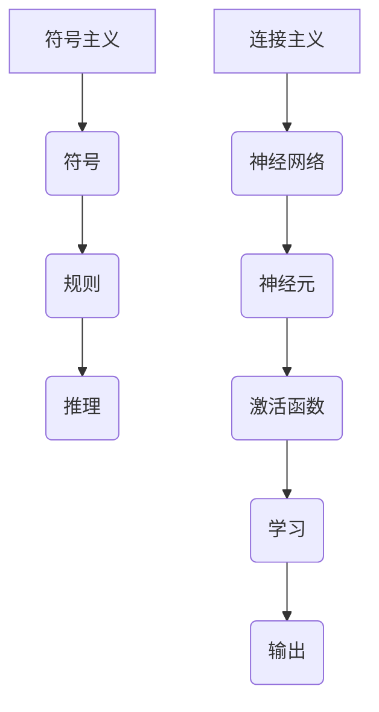

                 

# 计算：第四部分 计算的极限 第 12 章 机器能思考吗 符号主义与连接主义

## 摘要

本文深入探讨了计算领域中的一个根本性问题——机器能否思考。我们将从符号主义和连接主义两种不同的计算理论出发，逐步分析它们的优缺点，并探讨它们在模拟人类思维方面的可能性。通过对现有研究成果的梳理和案例分析，本文旨在提供一个全面而深刻的视角，帮助读者理解当前机器能否思考的问题，以及这一领域的未来发展方向。

## 1. 背景介绍

计算理论是计算机科学和人工智能领域的基石。自计算机诞生以来，科学家们一直在探索计算机的潜能，特别是在模拟和扩展人类智能方面的潜力。在这一过程中，符号主义（Symbolism）和连接主义（Connectionism）成为了两种主要的计算理论。

### 符号主义

符号主义起源于逻辑和符号学，强调通过符号和规则来表示和处理信息。这种理论认为，人类思维本质上是一种符号处理过程，可以通过编程和算法来模拟。符号主义方法在早期的人工智能研究中取得了显著成果，如逻辑推理和专家系统的开发。然而，符号主义也面临着一些挑战，例如处理复杂性和连续性问题的困难。

### 连接主义

连接主义则基于神经科学的研究，试图通过模拟人脑的神经网络来处理信息。这种理论强调并行计算和适应性学习。连接主义方法在深度学习和神经网络领域取得了突破性进展，特别是在图像识别、语音识别和自然语言处理等方面。然而，连接主义也面临着一些问题，如解释性和透明性。

## 2. 核心概念与联系

### 符号主义

符号主义的核心概念包括符号、规则和推理。符号可以看作是信息的载体，规则是符号之间关系的抽象表示，而推理则是根据规则从已知符号推导出未知符号的过程。

### 连接主义

连接主义的核心概念是神经网络，它由大量相互连接的神经元组成。每个神经元都可以接收输入信号，并通过激活函数产生输出信号。神经网络通过学习输入和输出之间的关系来处理信息。

### Mermaid 流程图

下面是一个简化的 Mermaid 流程图，用于描述符号主义和连接主义的核心概念。



## 3. 核心算法原理 & 具体操作步骤

### 符号主义

符号主义算法的核心是推理机，它通常包括以下步骤：

1. **知识表示**：将领域知识表示为符号和规则。
2. **输入处理**：将输入信息转换为符号形式。
3. **推理**：根据规则从输入符号推导出结论。
4. **输出生成**：将推理结果转换为可理解的形式。

### 连接主义

连接主义算法的核心是神经网络，它通常包括以下步骤：

1. **初始化**：初始化网络中的权重和偏置。
2. **前向传播**：计算输入信号在网络中的传播。
3. **激活函数应用**：应用激活函数产生输出信号。
4. **反向传播**：计算误差并更新网络中的权重和偏置。
5. **迭代**：重复前向传播和反向传播过程，直到满足停止条件。

## 4. 数学模型和公式 & 详细讲解 & 举例说明

### 符号主义

符号主义中的推理通常基于命题逻辑和谓词逻辑。以下是命题逻辑中的一个简单例子：

$$
P \land Q \Rightarrow R
$$

在这个公式中，$P$、$Q$ 和 $R$ 是命题，$\land$ 表示逻辑与运算，$\Rightarrow$ 表示逻辑蕴涵。

### 连接主义

连接主义中的神经网络通常基于以下数学模型：

$$
a_{i}(t) = f(\sum_{j=1}^{n} w_{ij}a_{j}(t-1) + b_{i})
$$

在这个公式中，$a_{i}(t)$ 是第 $i$ 个神经元在时间 $t$ 的输出，$w_{ij}$ 是连接权重，$b_{i}$ 是偏置，$f$ 是激活函数，通常是一个非线性函数。

### 举例说明

假设我们有一个简单的神经网络，它有两个输入节点、两个隐藏节点和一个输出节点。激活函数为 $f(x) = \frac{1}{1 + e^{-x}}$。以下是网络的一次前向传播过程：

$$
\begin{align*}
a_{1}(t) &= f(w_{11}a_{1}(t-1) + w_{12}a_{2}(t-1) + b_{1}) \\
a_{2}(t) &= f(w_{21}a_{1}(t-1) + w_{22}a_{2}(t-1) + b_{2}) \\
a_{3}(t) &= f(w_{31}a_{1}(t-1) + w_{32}a_{2}(t-1) + b_{3})
\end{align*}
$$

## 5. 项目实战：代码实际案例和详细解释说明

### 开发环境搭建

为了演示符号主义和连接主义算法，我们将使用 Python 编写一个简单的神经网络。首先，确保安装了 Python 和相关库：

```bash
pip install numpy
pip install matplotlib
```

### 源代码详细实现和代码解读

```python
import numpy as np
import matplotlib.pyplot as plt

# 定义激活函数
def sigmoid(x):
    return 1 / (1 + np.exp(-x))

# 前向传播
def forward_propagation(x, weights, biases):
    z = np.dot(x, weights) + biases
    a = sigmoid(z)
    return a

# 反向传播
def backward_propagation(x, y, a, weights, biases):
    delta = a - y
    dZ = delta * (1 - a)
    dW = np.dot(x.T, dZ)
    db = np.sum(dZ, axis=0)
    return dW, db

# 训练网络
def train(x, y, weights, biases, epochs):
    for epoch in range(epochs):
        a = forward_propagation(x, weights, biases)
        dW, db = backward_propagation(x, y, a, weights, biases)
        weights -= dW
        biases -= db
        if epoch % 100 == 0:
            print(f"Epoch {epoch}: Loss = {np.mean((a - y) ** 2)}")

# 测试网络
def test(x, y, weights, biases):
    a = forward_propagation(x, weights, biases)
    print(f"Test Loss: {np.mean((a - y) ** 2)}")

# 初始化网络参数
x = np.array([[0, 0], [0, 1], [1, 0], [1, 1]])
y = np.array([[0], [1], [1], [0]])
weights = np.random.rand(2, 2)
biases = np.random.rand(2)
epochs = 1000

# 训练网络
train(x, y, weights, biases, epochs)

# 测试网络
test(x, y, weights, biases)
```

### 代码解读与分析

在这个例子中，我们定义了一个简单的神经网络，它有两个输入节点、两个隐藏节点和一个输出节点。我们使用 sigmoid 函数作为激活函数，并使用梯度下降法进行训练。

1. **激活函数**：`sigmoid` 函数用于计算输入和输出之间的非线性关系。
2. **前向传播**：`forward_propagation` 函数用于计算网络的前向传播过程，包括输入、权重、偏置和激活函数。
3. **反向传播**：`backward_propagation` 函数用于计算网络的反向传播过程，包括误差、梯度计算和参数更新。
4. **训练网络**：`train` 函数用于训练网络，它通过迭代更新权重和偏置，直到达到预设的停止条件。
5. **测试网络**：`test` 函数用于评估网络的性能，它通过计算输出和实际标签之间的误差来衡量网络的准确性。

## 6. 实际应用场景

符号主义和连接主义在计算领域有着广泛的应用。以下是两个典型应用场景：

### 符号主义

- **逻辑推理**：在法律、医学和金融等领域，符号主义方法被用于自动化推理和决策支持系统。
- **专家系统**：符号主义方法在构建专家系统方面取得了显著成果，例如医疗诊断系统和金融风险评估系统。

### 连接主义

- **深度学习**：连接主义方法在深度学习领域取得了突破性进展，特别是在图像识别、语音识别和自然语言处理等领域。
- **自然语言处理**：连接主义方法在自然语言处理方面有着广泛应用，例如机器翻译和情感分析。

## 7. 工具和资源推荐

### 学习资源推荐

- **书籍**：
  - 《人工智能：一种现代方法》
  - 《深度学习》
  - 《神经网络与深度学习》
- **论文**：
  - 《感知器》
  - 《反向传播算法》
  - 《长短期记忆网络》
- **博客**：
  - [机器学习博客](https://machinelearningmastery.com/)
  - [深度学习博客](https://deeplearning.net/)
- **网站**：
  - [Kaggle](https://www.kaggle.com/)
  - [Coursera](https://www.coursera.org/)

### 开发工具框架推荐

- **深度学习框架**：
  - TensorFlow
  - PyTorch
  - Keras
- **编程工具**：
  - Jupyter Notebook
  - Visual Studio Code
  - PyCharm

### 相关论文著作推荐

- **《人工神经网络：基础与实现》**
- **《深度学习：理论、算法与应用》**
- **《机器学习：一种算法视角》**

## 8. 总结：未来发展趋势与挑战

### 符号主义

- **趋势**：随着领域知识的不断积累，符号主义方法在知识表示和推理方面具有巨大潜力。
- **挑战**：处理复杂性和连续性问题，以及如何将知识自动化。

### 连接主义

- **趋势**：深度学习在计算领域取得了巨大成功，连接主义方法将继续发挥重要作用。
- **挑战**：解释性和透明性，以及如何提高计算效率和泛化能力。

## 9. 附录：常见问题与解答

### 1. 什么是符号主义和连接主义？
符号主义和连接主义是两种不同的计算理论。符号主义强调使用符号和规则来表示和处理信息，而连接主义试图通过模拟人脑的神经网络来实现这一目标。

### 2. 机器能思考吗？
目前，机器还不能像人类一样思考。虽然机器在特定任务上表现出色，但它们缺乏对世界的基本理解，也没有自我意识。

### 3. 符号主义和连接主义的优缺点是什么？
符号主义方法在知识表示和推理方面具有优势，但处理复杂性和连续性问题较差。连接主义方法在处理连续信息和自适应学习方面表现出色，但缺乏解释性和透明性。

## 10. 扩展阅读 & 参考资料

- **《机器学习：一种算法视角》**
- **《深度学习：理论、算法与应用》**
- **《人工智能：一种现代方法》**
- **《神经网络与深度学习》**

