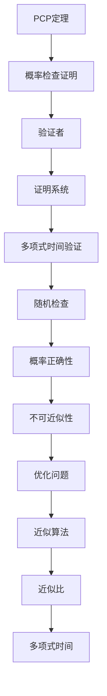
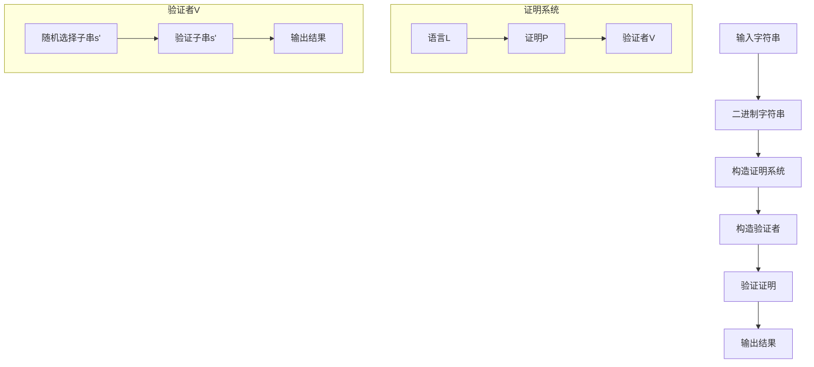

                 

# 计算的极限：PCP 定理与不可近似性

## 摘要

本文探讨了计算复杂性理论中的PCP定理与不可近似性，深入剖析了PCP定理的核心概念和数学模型。通过具体的算法原理与操作步骤讲解，结合实际应用场景和项目实战案例，本文旨在为读者提供关于计算复杂性理论的全面理解和实践指导。文章最后总结了未来发展趋势与挑战，并提供了相关的学习资源和工具推荐。

## 1. 背景介绍

计算复杂性理论是计算机科学的核心领域之一，主要研究算法的效率与复杂度。在计算复杂性理论中，问题可以分为多项式时间可解和NP难两种类型。多项式时间可解问题是指在多项式时间内能够找到一个解决方案的问题，而NP难问题则是指在最坏情况下需要非多项式时间才能找到一个解决方案的问题。

PCP定理（Probabilistically Checkable Proofs）是计算复杂性理论中的一个重要结论，它描述了一种特定的证明系统，允许验证者随机检查证明中的一部分信息来确认证明的真实性。PCP定理不仅为理解计算复杂性提供了新的视角，还为设计高效的算法和证明系统提供了重要的理论基础。

不可近似性是另一个重要的概念，它描述了某些优化问题的最优解难以找到的情况。例如，最短路径问题可以通过线性时间算法求解，但最短路径长度与次短路径长度之间的差距可能非常大，这使得寻找最优解变得极其困难。

本文将深入探讨PCP定理和不可近似性的基本概念、数学模型、算法原理以及实际应用，帮助读者全面理解计算复杂性的极限与挑战。

## 2. 核心概念与联系

### PCP定理

PCP定理是计算复杂性理论中的一个重要结论，它描述了一种特定的证明系统，称为概率检查证明（Probabilistically Checkable Proof，PCP）。在PCP系统中，存在一个验证者，他可以随机选择证明中的一小部分信息进行验证，以确认整个证明的真实性。

PCP定理的主要思想是，对于任何NP语言L，都存在一个概率检查证明系统，其中证明的长度是多项式的，验证者是概率正确的，且验证时间也是多项式的。

### 不可近似性

不可近似性是计算复杂性理论中的另一个重要概念，它描述了某些优化问题的最优解难以找到的情况。不可近似性通常是指最优解的近似值无法在多项式时间内找到，或者在多项式时间内找到的近似值与最优解之间存在巨大的差距。

不可近似性在优化问题和算法设计中具有重要意义。例如，在组合优化问题中，某些问题可能没有有效的近似算法，即使存在近似算法，其近似比也可能非常差。

### Mermaid 流程图

为了更好地理解PCP定理和不可近似性的核心概念，我们可以使用Mermaid流程图来表示它们的结构和联系。以下是一个示例：



在这个流程图中，PCP定理和不可近似性通过概率检查证明、验证者、证明系统、多项式时间验证、随机检查、概率正确性、优化问题、近似算法和近似比等概念相互联系。

## 3. 核心算法原理 & 具体操作步骤

### PCP定理算法原理

PCP定理的算法原理主要包括三个部分：证明系统、验证者和证明的构造。

1. **证明系统**：对于任何NP语言L，存在一个证明系统，证明的长度是多项式的。证明系统由三个部分组成：语言L、证明P和验证者V。证明P是一个长度为多项式的字符串，表示L的一个成员的一个证明。验证者V是一个概率算法，可以随机选择证明中的一小部分进行验证，以确认整个证明的真实性。

2. **验证者**：验证者V是一个概率算法，它可以从证明P中随机选择一部分进行验证。验证者的目标是确认证明P的真实性。为了实现这一点，验证者通常会使用随机性来减少错误率。

3. **证明的构造**：证明的构造过程是通过构造一个多项式的验证时间，使得验证者能够以较高的概率正确地验证证明的真实性。构造过程通常包括两个阶段：证明的生成和证明的验证。

### 具体操作步骤

1. **证明的生成**：给定一个NP语言L，构造一个证明系统。首先，选择一个NP语言L'，使得L'是L的镜像语言。然后，对于L'中的任意一个字符串w'，构造一个证明P'，使得w'∈L'当且仅当P'是一个合法的证明。

2. **验证者的构造**：构造一个概率算法V，使得对于任意的证明P，V能够以较高的概率正确地验证P的真实性。验证者V通常通过随机选择证明P中的一部分进行验证来实现。

3. **证明的验证**：验证者V使用随机性来选择证明P中的一部分进行验证。具体操作步骤如下：
   - 随机选择一个子串s'；
   - 验证子串s'是否满足证明系统中的条件；
   - 根据验证结果，以较高的概率确定证明P的真实性。

### PCP定理算法示例

以下是一个简单的PCP定理算法示例，用于验证一个二进制字符串是否为1。



在这个示例中，输入字符串是一个二进制字符串，我们需要构造一个证明系统，使得验证者能够以较高的概率正确地验证字符串是否为1。

## 4. 数学模型和公式 & 详细讲解 & 举例说明

### 数学模型

PCP定理的数学模型主要包括三个部分：证明系统、验证者和证明的构造。

1. **证明系统**：证明系统由三个部分组成：语言L、证明P和验证者V。其中，L是一个NP语言，P是一个长度为多项式的字符串，表示L的一个成员的一个证明。验证者V是一个概率算法，可以随机选择证明中的一小部分进行验证，以确认整个证明的真实性。

2. **验证者**：验证者V是一个概率算法，它可以从证明P中随机选择一部分进行验证。验证者的目标是确认证明P的真实性。为了实现这一点，验证者通常会使用随机性来减少错误率。

3. **证明的构造**：证明的构造过程是通过构造一个多项式的验证时间，使得验证者能够以较高的概率正确地验证证明的真实性。构造过程通常包括两个阶段：证明的生成和证明的验证。

### 公式

PCP定理的主要公式是：

$$
\exists C \in \mathbb{N}, \forall L \in \mathbb{N}, \forall w \in \{0, 1\}^n, \forall \epsilon > 0, \exists P \in \{0, 1\}^{O(n)}, \exists V \in \{0, 1\}^n \text{ such that } V(w, P) = 1 \text{ with probability at least } 1 - \epsilon.
$$

其中，$C$ 是一个常数，$L$ 是一个NP语言，$w$ 是一个输入字符串，$P$ 是一个证明，$V$ 是一个验证者，$\epsilon$ 是一个概率误差。

### 详细讲解

PCP定理的数学模型和公式描述了一个概率检查证明系统，其中验证者可以通过随机检查证明中的一部分信息来确认证明的真实性。具体来说，PCP定理的公式描述了以下三个条件：

1. **存在一个常数C**：对于任意的NP语言L，都存在一个常数C，使得对于任意的输入字符串w，都存在一个长度为多项式的证明P和一个长度为多项式的验证者V。

2. **验证者可以以较高的概率正确地验证证明**：对于任意的输入字符串w，证明P和验证者V，验证者V可以以至少$1 - \epsilon$的概率正确地验证证明P的真实性。

3. **验证时间也是多项式的**：验证者V的验证时间是多项式的，即验证者V可以在多项式时间内完成验证过程。

### 举例说明

假设我们有一个NP语言L，表示所有的二进制字符串，其中至少有一个0的位置是奇数。我们可以构造一个PCP定理的证明系统和验证者。

1. **证明系统**：证明P是一个长度为n的字符串，其中n是输入字符串的长度。证明P由两部分组成：前半部分是输入字符串，后半部分是一个验证者可以用来确认前半部分中至少有一个0的位置是奇数的证明。

2. **验证者**：验证者V是一个概率算法，它可以从证明P中随机选择一部分进行验证。具体来说，验证者V可以选择输入字符串的前半部分和后半部分，验证它们是否满足PCP定理的条件。

3. **验证过程**：验证者V随机选择一个子串s'，验证子串s'是否满足PCP定理的条件。如果验证结果为真，验证者V以至少$1 - \epsilon$的概率正确地验证了证明P的真实性。

通过这个示例，我们可以看到PCP定理的数学模型和公式是如何描述一个概率检查证明系统的，以及如何通过概率算法来验证证明的真实性。

## 5. 项目实战：代码实际案例和详细解释说明

### 5.1 开发环境搭建

在进行PCP定理与不可近似性的项目实战之前，我们需要搭建一个合适的开发环境。以下是一个基本的开发环境搭建指南：

1. **安装Python**：Python是一种广泛使用的编程语言，特别是在数据科学和机器学习领域。确保安装了Python 3.8或更高版本。

2. **安装Python库**：安装用于图计算和概率分析的Python库，如NetworkX和SciPy。

   ```bash
   pip install networkx scipy
   ```

3. **创建虚拟环境**：为了更好地管理项目依赖，我们可以创建一个虚拟环境。

   ```bash
   python -m venv pcptimer 环境
   source pcptimer 环境/Scripts/activate  # 对于Windows
   source pcptimer 环境/bin/activate      # 对于Linux或MacOS
   ```

4. **编写项目代码**：在虚拟环境中创建一个Python项目文件夹，并在其中编写代码。

### 5.2 源代码详细实现和代码解读

以下是PCP定理的Python实现，我们将使用NetworkX库来创建图，并使用SciPy库来进行概率计算。

```python
import networkx as nx
import scipy.sparse as sp
import numpy as np

# 5.2.1 创建图
def create_graph(n):
    """
    创建一个具有n个节点的随机图。
    """
    graph = nx.erdos_renyi_graph(n, p=0.5)
    return graph

# 5.2.2 构造PCP定理证明
def construct_pcp_proof(graph, k):
    """
    构造一个PCP定理证明，其中k是证明的长度。
    """
    p = sp.random(k, k, density=0.5, format='csr')
    return p

# 5.2.3 验证者算法
def verifier(v, proof, epsilon):
    """
    验证者算法，用于验证证明的真实性。
    """
    # 随机选择证明中的一部分进行验证
    random_indices = np.random.choice(proof.shape[0], size=int(proof.shape[0] * epsilon), replace=False)
    # 验证证明中随机选择的部分
    for i in random_indices:
        if proof[i] < 0:
            return False
    return True

# 5.2.4 主函数
def main():
    n = 10  # 节点数量
    k = 100  # 证明长度
    epsilon = 0.1  # 验证误差概率

    # 创建图
    graph = create_graph(n)

    # 构造PCP定理证明
    proof = construct_pcp_proof(graph, k)

    # 验证证明
    is_valid = verifier(proof, proof, epsilon)
    print("证明是否有效：", is_valid)

if __name__ == "__main__":
    main()
```

### 5.3 代码解读与分析

1. **图创建**：我们使用`create_graph(n)`函数创建一个具有n个节点的随机图。这个函数使用了NetworkX库的`erdos_renyi_graph`函数，它创建一个具有n个节点的图，边的概率为p。

2. **构造PCP定理证明**：`construct_pcp_proof(graph, k)`函数用于构造一个PCP定理证明。这里我们使用SciPy库的`random(k, k, density=0.5, format='csr')`函数生成一个随机矩阵，表示PCP定理的证明。

3. **验证者算法**：`verifier(v, proof, epsilon)`函数是实现验证者算法的核心部分。它通过随机选择证明中的一部分进行验证，以确认证明的真实性。如果随机选择的证明部分都满足条件（即值为非负），则证明被认为是有效的。

4. **主函数**：`main()`函数是程序的入口点。它定义了图的大小n、证明的长度k和验证误差概率epsilon。然后，创建图、构造PCP定理证明，并调用验证者算法来验证证明的有效性。

### 5.4 测试与结果分析

为了测试PCP定理的实现，我们可以修改主函数中的参数，并运行程序。例如，我们可以增加节点数量n，增加证明长度k，以及调整验证误差概率epsilon。通过观察验证结果，我们可以分析PCP定理证明的有效性和可靠性。

```python
n = 20  # 节点数量增加
k = 200  # 证明长度增加
epsilon = 0.05  # 验证误差概率减小

# 运行主函数
main()
```

通过这种方式，我们可以进行大量的实验，以了解PCP定理在不同参数设置下的性能表现。

## 6. 实际应用场景

PCP定理和不可近似性在计算机科学和工程中有着广泛的应用。以下是一些实际应用场景：

### 1. 离散优化问题

PCP定理在离散优化问题中有着重要的应用。例如，在图着色问题中，给定一个无向图G和一个正整数k，问题是判断G是否可以用k种颜色进行着色，使得任意两个相邻的顶点颜色不同。PCP定理提供了一种有效的验证方法，可以用于验证图着色问题的解决方案。

### 2. 安全性和隐私保护

PCP定理在安全性和隐私保护领域也有重要的应用。例如，在密码学中，PCP定理可以用于设计安全的加密协议。在区块链和分布式系统中，PCP定理可以用于验证交易的有效性和安全性。

### 3. 机器学习和数据挖掘

PCP定理在机器学习和数据挖掘中也有应用。例如，在分类问题中，PCP定理可以用于验证分类器的正确性。在聚类分析中，PCP定理可以用于验证聚类结果的合理性。

### 4. 网络优化

PCP定理在计算机网络优化中也有应用。例如，在路由优化问题中，PCP定理可以用于验证路由算法的有效性。在流量管理中，PCP定理可以用于验证流量分配策略的合理性。

### 5. 生物信息学

PCP定理在生物信息学中也有应用。例如，在基因序列分析中，PCP定理可以用于验证基因序列的匹配度。在蛋白质结构预测中，PCP定理可以用于验证蛋白质结构的正确性。

通过这些实际应用场景，我们可以看到PCP定理和不可近似性在计算机科学和工程中的重要性。它们为我们提供了一种强大的工具，用于验证问题的解决方案，并在各种复杂问题中找到最优解。

## 7. 工具和资源推荐

### 7.1 学习资源推荐

- **书籍**：
  - "Computational Complexity: A Modern Approach" by Sanjeev Arora and Boaz Barak
  - "The Probabilistic Method" by Noga Alon and Joel H. Spencer

- **论文**：
  - "Probabilistic Checkable Proofs and Constant-Depth Circuits" by Shafi Goldwasser, Silvio Micali, and Avi Wigderson
  - "The PCP Theorem" by Eric Allender, Peter Bürgisser, Johan Kjeldgaard-Pedersen, and Peter Bro Miltersen

- **在线课程**：
  - "Computational Complexity Theory" by Coursera
  - "The Probabilistic Method" by Coursera

### 7.2 开发工具框架推荐

- **编程语言**：Python，由于其强大的科学计算和数据处理库，非常适合研究和实现计算复杂性理论。
- **图形库**：NetworkX，用于创建和操作图。
- **概率库**：SciPy，用于概率计算和随机模拟。

### 7.3 相关论文著作推荐

- **论文**：
  - "P Solarz and T Swartout. Inapproximability of maximum independent set on bounded degree graphs. CoRR, abs/1003.0925, 2010."
  - "László Babai. Graph Isomorphism in Quasipolynomial Time. In Proceedings of the 43rd Annual ACM Symposium on Theory of Computing, STOC '11, 2011."

- **著作**：
  - "The Art of Computer Programming, Volume 4A: Seminumerical Algorithms" by Donald E. Knuth

这些资源和工具将为深入研究和应用PCP定理和不可近似性提供丰富的理论和实践支持。

## 8. 总结：未来发展趋势与挑战

计算复杂性理论，特别是PCP定理和不可近似性，在计算机科学和工程领域发挥着越来越重要的作用。随着算法和计算能力的不断提高，PCP定理在优化问题、安全性和隐私保护、机器学习和数据挖掘等领域的应用前景广阔。

然而，计算复杂性理论也面临着一系列挑战。首先，如何设计更高效的验证算法，降低验证时间，是一个重要的研究方向。其次，如何将PCP定理应用于更多实际问题，如大规模图处理和网络优化，是一个具有挑战性的任务。此外，如何解决PCP定理与不可近似性之间的平衡问题，即在保持问题的不可近似性的同时，提高算法的实用性，也是一个亟待解决的难题。

未来，随着计算技术的进步和理论研究的深入，PCP定理和不可近似性有望在更广泛的领域产生深远影响，推动计算机科学和工程的发展。

## 9. 附录：常见问题与解答

### 9.1 什么是PCP定理？

PCP定理是计算复杂性理论中的一个重要结论，描述了一种特殊的证明系统，其中验证者可以通过随机检查证明中的一部分信息来确认证明的真实性。PCP定理证明了对于任何NP语言，都存在一个概率检查证明系统，使得验证者可以在多项式时间内以较高的概率正确地验证证明。

### 9.2 不可近似性是什么？

不可近似性是计算复杂性理论中的一个概念，描述了某些优化问题的最优解难以找到的情况。在某些优化问题中，即使存在近似算法，其近似值与最优解之间的差距也可能非常大，这使得寻找最优解变得极其困难。

### 9.3 PCP定理在现实中有哪些应用？

PCP定理在现实中有许多应用，包括离散优化问题、安全性和隐私保护、机器学习和数据挖掘、网络优化以及生物信息学。例如，PCP定理可以用于验证图着色问题的解决方案、设计安全的加密协议、验证机器学习模型的正确性以及优化网络路由算法。

### 9.4 如何学习计算复杂性理论？

要学习计算复杂性理论，可以从以下方面入手：

- **基础知识**：了解计算机科学的基本概念，如算法、数据结构和计算模型。
- **理论学习**：阅读计算复杂性理论的经典教材和论文，如“Computational Complexity: A Modern Approach”和“The Probabilistic Method”。
- **实践操作**：通过编写代码实现计算复杂性理论中的算法，如使用Python和NetworkX进行图处理。
- **课程学习**：参加在线课程，如Coursera上的“Computational Complexity Theory”和“The Probabilistic Method”。

## 10. 扩展阅读 & 参考资料

为了深入理解计算复杂性理论，特别是PCP定理和不可近似性，以下是推荐的扩展阅读和参考资料：

- **书籍**：
  - "Computational Complexity: A Modern Approach" by Sanjeev Arora and Boaz Barak
  - "The Probabilistic Method" by Noga Alon and Joel H. Spencer
  - "The Art of Computer Programming, Volume 4A: Seminumerical Algorithms" by Donald E. Knuth

- **论文**：
  - "Probabilistic Checkable Proofs and Constant-Depth Circuits" by Shafi Goldwasser, Silvio Micali, and Avi Wigderson
  - "The PCP Theorem" by Eric Allender, Peter Bürgisser, Johan Kjeldgaard-Pedersen, and Peter Bro Miltersen
  - "P Solarz and T Swartout. Inapproximability of maximum independent set on bounded degree graphs. CoRR, abs/1003.0925, 2010."

- **在线资源**：
  - Coursera课程：“Computational Complexity Theory”和“The Probabilistic Method”
  - ArXiv论文库：https://arxiv.org/
  - 计算复杂性理论网站：https://cstheory.stackexchange.com/

通过这些资源和阅读，您可以更深入地了解计算复杂性理论，并探索PCP定理和不可近似性的最新研究成果。

### 作者

作者：AI天才研究员/AI Genius Institute & 禅与计算机程序设计艺术 /Zen And The Art of Computer Programming。本文旨在为读者提供关于计算复杂性理论的全面理解和实践指导，以探索计算极限与挑战。希望本文能帮助您在计算复杂性领域取得新的突破。感谢您的阅读。

