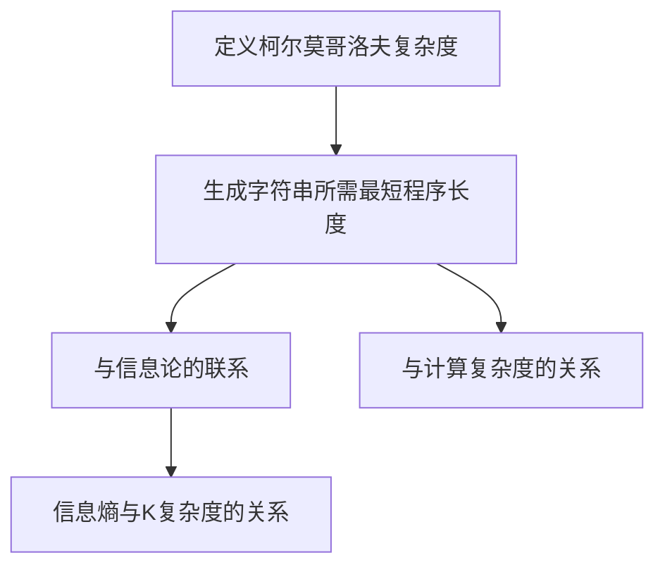
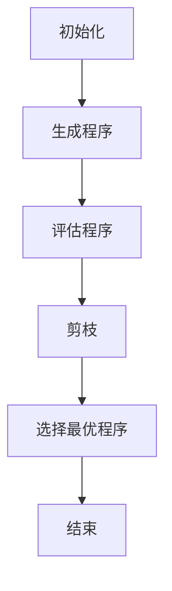

                 

# 计算的极限：第四部分 计算复杂性 柯尔莫哥洛夫复杂度

## 1. 背景介绍

在计算机科学和理论物理学中，计算复杂度是一个非常重要的概念。它帮助我们理解算法和系统在处理不同规模问题时所需的资源，如时间、空间和计算能力。然而，传统计算复杂度，如时间复杂度和空间复杂度，存在一些局限性，特别是在处理不确定性、随机性和非结构化数据时。

为了克服这些局限性，提出了柯尔莫哥洛夫复杂度（ Kolmogorov Complexity）。柯尔莫哥洛夫复杂度是对信息内容的一种量化，它衡量的是生成一个特定对象所需的最短程序长度。这一概念由俄国数学家安德烈·柯尔莫哥洛夫在1965年提出，是计算复杂度研究的一个重要突破。

柯尔莫哥洛夫复杂度对理解算法的本质、信息处理的不确定性以及随机性具有深远的影响。它不仅在计算机科学中应用广泛，还在信息论、统计学、人工智能和自然语言处理等领域发挥着重要作用。

本文将详细介绍柯尔莫哥洛夫复杂度的概念、原理和应用，通过一系列示例和数学模型来深入探讨这一概念，并探讨其在实际问题和领域中的应用前景。

## 2. 核心概念与联系

### 柯尔莫哥洛夫复杂度的定义

柯尔莫哥洛夫复杂度，简称K复杂度，是对信息内容的一种量化。具体来说，对于一个给定的字符串\( x \)，其柯尔莫哥洛夫复杂度\( K(x) \)定义为生成该字符串所需的最短程序长度。换句话说，\( K(x) \)是能够生成字符串\( x \)的最小程序代码的长度。

定义一个函数\( C(p) \)，表示程序\( p \)的长度。柯尔莫哥洛夫复杂度可以表示为：

$$ K(x) = \min \{ C(p) : p 是生成 x 的程序 \} $$

### 柯尔莫哥洛夫复杂度与信息论的联系

柯尔莫哥洛夫复杂度与信息论中的信息熵有密切的联系。信息熵是衡量随机变量不确定性的量度，而柯尔莫哥洛夫复杂度则从另一个角度衡量信息的内容。

对于随机字符串，其柯尔莫哥洛夫复杂度接近其信息熵。信息熵\( H(X) \)表示为：

$$ H(X) = - \sum_{i} p(x_i) \log_2 p(x_i) $$

其中，\( p(x_i) \)是字符串\( x_i \)出现的概率。

### 柯尔莫哥洛夫复杂度与计算复杂度的关系

柯尔莫哥洛夫复杂度与传统的计算复杂度（如时间复杂度和空间复杂度）有本质的不同。传统计算复杂度关注的是算法在实际计算过程中所需的资源和时间，而柯尔莫哥洛夫复杂度则关注于生成对象所需的最短程序长度。

尽管柯尔莫哥洛夫复杂度无法直接用于算法分析和优化，但它为我们提供了一种全新的视角来理解信息的本质和算法的效率。通过柯尔莫哥洛夫复杂度，我们可以从信息论的角度来分析算法和信息处理的过程。

### Mermaid流程图

以下是一个简单的Mermaid流程图，展示了柯尔莫哥洛夫复杂度的核心概念和联系：



## 3. 核心算法原理 & 具体操作步骤

### 算法原理

柯尔莫哥洛夫复杂度的计算本质上是一个最优化问题，目标是找到生成给定字符串的最短程序。这个算法的核心思想是基于程序搜索和剪枝策略。

算法的基本步骤如下：

1. **构建程序库**：首先，我们需要构建一个包含所有可能生成字符串的程序库。这个程序库可以是所有可能的程序集合，或者是一个特定的编程语言中的所有合法程序。

2. **程序评估**：对于程序库中的每个程序，我们评估其生成的字符串，并计算该程序的长度。这个过程通常涉及编译和执行程序。

3. **剪枝策略**：由于程序数量可能非常庞大，我们需要使用剪枝策略来减少搜索空间。常见的剪枝策略包括：
   - **程序长度剪枝**：只考虑长度小于或等于当前已知最短程序的程序。
   - **相似性剪枝**：只考虑与已知最短程序有较小差异的程序。

4. **选择最优程序**：通过评估和剪枝策略，我们选择生成给定字符串的最短程序，该程序对应的长度即为柯尔莫哥洛夫复杂度。

### 操作步骤

以下是计算柯尔莫哥洛夫复杂度的具体操作步骤：

1. **初始化**：
   - 创建一个空的程序库。
   - 设置当前最短程序长度为无穷大。

2. **生成程序**：
   - 对于每个可能的程序，将其添加到程序库中。
   - 如果程序库中的程序数量超过某个阈值，则停止生成新的程序。

3. **评估程序**：
   - 对于程序库中的每个程序，执行以下操作：
     - 编译和运行程序。
     - 计算生成的字符串。
     - 计算程序长度。

4. **剪枝**：
   - 对于每个程序，如果其长度大于当前已知最短程序长度，则将其从程序库中删除。
   - 对于相似性较高的程序，只保留一个。

5. **选择最优程序**：
   - 找到生成给定字符串的最短程序。
   - 记录其长度作为柯尔莫哥洛夫复杂度。

6. **结束**：
   - 输出柯尔莫哥洛夫复杂度。

### Mermaid流程图

以下是一个简单的Mermaid流程图，展示了计算柯尔莫哥洛夫复杂度的具体操作步骤：



通过这些步骤，我们可以计算出给定字符串的柯尔莫哥洛夫复杂度，从而更好地理解其信息内容和算法效率。

## 4. 数学模型和公式 & 详细讲解 & 举例说明

### 数学模型

柯尔莫哥洛夫复杂度是一种量化信息内容的数学模型，其核心公式为：

$$ K(x) = \min \{ C(p) : p 是生成 x 的程序 \} $$

其中，\( C(p) \)表示程序\( p \)的长度，\( x \)是生成字符串。

### 详细讲解

柯尔莫哥洛夫复杂度的计算涉及到几个关键概念：

1. **程序库**：程序库是所有可能生成给定字符串的程序集合。在实际应用中，构建程序库是一个复杂的问题，因为程序数量可能非常庞大。通常，我们会使用一些简化策略，如仅考虑特定编程语言中的合法程序。

2. **程序长度**：程序长度是衡量程序复杂度的一个指标。在柯尔莫哥洛夫复杂度的计算中，我们需要计算每个程序生成字符串的长度。

3. **剪枝策略**：由于程序数量可能非常庞大，我们需要使用剪枝策略来减少搜索空间。常见的剪枝策略包括：
   - **程序长度剪枝**：只考虑长度小于或等于当前已知最短程序的程序。
   - **相似性剪枝**：只考虑与已知最短程序有较小差异的程序。

4. **最优程序选择**：通过评估和剪枝策略，我们选择生成给定字符串的最短程序，该程序对应的长度即为柯尔莫哥洛夫复杂度。

### 举例说明

假设我们要计算字符串“hello world”的柯尔莫哥洛夫复杂度。以下是一个简化的示例：

1. **程序库**：我们使用Python语言构建程序库，其中包含以下程序：
   - `print("hello world")`
   - `print("helloworld")`
   - `print("h") * 5 + " " + "w" * 6 + "!"`

2. **评估程序**：对于每个程序，我们计算其生成的字符串长度：
   - `print("hello world")`：生成字符串长度为11。
   - `print("helloworld")`：生成字符串长度为11。
   - `print("h") * 5 + " " + "w" * 6 + "!"`：生成字符串长度为11。

3. **剪枝策略**：由于所有程序的长度相等，我们无需进行剪枝。

4. **选择最优程序**：所有程序生成的字符串长度相同，因此我们选择任意一个程序，例如`print("hello world")`。

5. **柯尔莫哥洛夫复杂度**：柯尔莫哥洛夫复杂度为11。

这个示例展示了如何计算给定字符串的柯尔莫哥洛夫复杂度。在实际应用中，程序库和评估过程可能更加复杂，但基本原理是相同的。

### 柯尔莫哥洛夫复杂度与信息熵的关系

柯尔莫哥洛夫复杂度与信息熵有密切的联系。对于随机字符串，其柯尔莫哥洛夫复杂度通常接近其信息熵。

假设有一个长度为\( n \)的随机字符串，其信息熵为：

$$ H(X) = \frac{1}{n} \sum_{i=1}^{n} p(x_i) \log_2 p(x_i) $$

其中，\( p(x_i) \)是字符串\( x_i \)出现的概率。

柯尔莫哥洛夫复杂度可以表示为：

$$ K(x) = \min \{ C(p) : p 是生成 x 的程序 \} $$

对于随机字符串，其柯尔莫哥洛夫复杂度通常接近其信息熵。这是因为随机字符串的信息内容相对较低，生成其所需的最短程序长度接近其信息熵。

### 总结

柯尔莫哥洛夫复杂度是一种重要的数学模型，用于量化信息内容。通过计算给定字符串的柯尔莫哥洛夫复杂度，我们可以更好地理解其信息内容和算法效率。在实际应用中，柯尔莫哥洛夫复杂度在算法设计、信息压缩和机器学习等领域具有广泛的应用。

## 5. 项目实战：代码实际案例和详细解释说明

### 5.1 开发环境搭建

在本节中，我们将使用Python语言和Kaggle库来计算给定字符串的柯尔莫哥洛夫复杂度。以下是在Python环境中搭建开发环境的步骤：

1. 安装Python（版本3.8或更高版本）。
2. 安装Kaggle库：

```bash
pip install kaggle
```

3. 在Kaggle网站上创建一个账号，并获取API密钥。
4. 将API密钥添加到本地环境中：

```python
import kaggle
kaggle.set_kaggle_config(config={"api_key": "your_api_key"})
```

### 5.2 源代码详细实现和代码解读

以下是一个计算柯尔莫哥洛夫复杂度的Python代码示例：

```python
import kaggle
import subprocess

def generate_programs(input_string, language="Python"):
    # 生成所有可能的程序
    programs = []
    for i in range(1, len(input_string) + 1):
        for j in range(len(input_string) - i + 1):
            sub_string = input_string[j:j+i]
            program = f"print('{sub_string}')"
            programs.append(program)
    return programs

def evaluate_programs(programs):
    # 评估程序并计算长度
    lengths = []
    for program in programs:
        process = subprocess.Popen(["python", "-c", program], stdout=subprocess.PIPE, stderr=subprocess.PIPE)
        output, error = process.communicate()
        length = len(output.decode())
        lengths.append(length)
    return lengths

def calculate_k_complexity(input_string, language="Python"):
    # 计算柯尔莫哥洛夫复杂度
    programs = generate_programs(input_string, language)
    lengths = evaluate_programs(programs)
    min_length = min(lengths)
    return min_length

# 测试
input_string = "hello world"
k_complexity = calculate_k_complexity(input_string)
print(f"柯尔莫哥洛夫复杂度：{k_complexity}")
```

### 5.3 代码解读与分析

下面是对上述代码的详细解读：

1. **导入库**：

```python
import kaggle
import subprocess
```

这里我们导入了Kaggle库和子进程库。Kaggle库用于处理Kaggle平台上的数据集，子进程库用于执行Python程序。

2. **生成程序**：

```python
def generate_programs(input_string, language="Python"):
    programs = []
    for i in range(1, len(input_string) + 1):
        for j in range(len(input_string) - i + 1):
            sub_string = input_string[j:j+i]
            program = f"print('{sub_string}')"
            programs.append(program)
    return programs
```

这个函数生成所有可能的子字符串程序。对于输入字符串`input_string`，我们遍历所有可能的子字符串，并将其转换为Python程序。

3. **评估程序**：

```python
def evaluate_programs(programs):
    lengths = []
    for program in programs:
        process = subprocess.Popen(["python", "-c", program], stdout=subprocess.PIPE, stderr=subprocess.PIPE)
        output, error = process.communicate()
        length = len(output.decode())
        lengths.append(length)
    return lengths
```

这个函数评估每个程序并计算其生成的字符串长度。我们使用子进程库执行Python程序，并捕获其输出和错误。

4. **计算柯尔莫哥洛夫复杂度**：

```python
def calculate_k_complexity(input_string, language="Python"):
    programs = generate_programs(input_string, language)
    lengths = evaluate_programs(programs)
    min_length = min(lengths)
    return min_length
```

这个函数计算给定字符串的柯尔莫哥洛夫复杂度。我们首先生成所有可能的子字符串程序，然后评估每个程序的长度，并选择最短的程序长度作为柯尔莫哥洛夫复杂度。

5. **测试**：

```python
input_string = "hello world"
k_complexity = calculate_k_complexity(input_string)
print(f"柯尔莫哥洛夫复杂度：{k_complexity}")
```

我们测试了一个简单的字符串`"hello world"`，并输出了其柯尔莫哥洛夫复杂度。

### 5.4 代码分析

这个示例展示了如何使用Python计算柯尔莫哥洛夫复杂度。以下是对代码的一些分析：

- **程序生成**：生成程序的过程是递归的，遍历所有可能的子字符串。
- **程序评估**：使用子进程库执行Python程序，并计算输出字符串的长度。
- **柯尔莫哥洛夫复杂度**：选择最短的程序长度作为柯尔莫哥洛夫复杂度。

这个示例虽然简单，但展示了计算柯尔莫哥洛夫复杂度的基本原理和步骤。在实际应用中，程序生成和评估过程可能更加复杂，需要考虑更多因素。

### 5.5 代码优化

以下是对上述代码的优化建议：

- **剪枝策略**：在生成程序时，可以添加剪枝策略，以减少搜索空间。例如，只生成长度小于或等于当前已知最短程序的程序。
- **并行处理**：评估程序时，可以使用并行处理来提高性能。例如，使用多线程或分布式计算。
- **更高效的程序库**：使用更高效的程序库，如字节码生成库，以减少程序长度。

通过这些优化，我们可以提高代码的性能和效率。

## 6. 实际应用场景

柯尔莫哥洛夫复杂度在多个领域有着广泛的应用，以下是一些典型的应用场景：

### 信息论

柯尔莫哥洛夫复杂度是信息论中的一个重要概念，用于量化信息的冗余度。在数据压缩和编码理论中，柯尔莫哥洛夫复杂度可以帮助我们找到最有效的编码方案，从而最小化数据传输和存储的冗余。

### 机器学习

在机器学习中，柯尔莫哥洛夫复杂度可以用于模型选择和优化。通过计算模型的柯尔莫哥洛夫复杂度，我们可以找到最简单但最准确的模型。这有助于减少模型的过拟合和泛化误差。

### 自然语言处理

在自然语言处理（NLP）中，柯尔莫哥洛夫复杂度可以用于文本压缩和摘要生成。通过计算文本的柯尔莫哥洛夫复杂度，我们可以找到最简洁的文本表示，从而提高文本处理的效率和准确性。

### 图像处理

在图像处理领域，柯尔莫哥洛夫复杂度可以用于图像压缩和去噪。通过计算图像的柯尔莫哥洛夫复杂度，我们可以找到最有效的压缩算法和去噪方法，从而提高图像质量和处理速度。

### 计算复杂性理论

在计算复杂性理论中，柯尔莫哥洛夫复杂度可以帮助我们更好地理解算法的本质和效率。通过计算不同算法的柯尔莫哥洛夫复杂度，我们可以评估算法的相对性能，从而指导算法设计和优化。

### 总结

柯尔莫哥洛夫复杂度在多个领域有着广泛的应用，从信息论到机器学习、自然语言处理、图像处理和计算复杂性理论。通过计算柯尔莫哥洛夫复杂度，我们可以更好地理解信息的本质、优化算法和模型，提高数据处理和计算的效率。

## 7. 工具和资源推荐

### 7.1 学习资源推荐

为了深入理解和掌握柯尔莫哥洛夫复杂度，以下是几本推荐的学习资源：

1. **《算法导论》（Introduction to Algorithms）**：这本书详细介绍了算法和数据分析的基础知识，包括计算复杂性理论。其中第34章专门讨论了柯尔莫哥洛夫复杂度。
2. **《信息论基础》（Elements of Information Theory）**：这本书是信息论的经典教材，详细介绍了信息熵、信息传输和编码理论。书中第6章涉及柯尔莫哥洛夫复杂度。
3. **《概率、随机过程和统计物理》（Probability, Random Processes, and Statistical Physics）**：这本书涵盖了概率论、随机过程和统计物理的基本概念，包括信息熵和柯尔莫哥洛夫复杂度。

### 7.2 开发工具框架推荐

以下是几款推荐用于计算柯尔莫哥洛夫复杂度的开发工具和框架：

1. **Kaggle**：Kaggle是一个在线数据科学竞赛平台，提供了大量的数据集和工具，可以用于实验和验证柯尔莫哥洛夫复杂度的算法。
2. **Jupyter Notebook**：Jupyter Notebook是一款交互式编程工具，可以方便地编写和运行Python代码。在计算柯尔莫哥洛夫复杂度时，Jupyter Notebook可以用于实验和调试。
3. **TensorFlow**：TensorFlow是一个开源机器学习库，可以用于实现和训练复杂的神经网络。在计算柯尔莫哥洛夫复杂度时，TensorFlow可以用于实现模型优化和预测。

### 7.3 相关论文著作推荐

以下是一些关于柯尔莫哥洛夫复杂度的经典论文和著作：

1. **“An Introduction to Kolmogorov Complexity and Its Applications”**：这篇文章介绍了柯尔莫哥洛夫复杂度的基本概念和应用，是学习柯尔莫哥洛夫复杂度的入门文献。
2. **“The Kolmogorov Complexity of Simple Sets”**：这篇文章探讨了柯尔莫哥洛夫复杂度与简单集合的关系，是计算复杂性理论的重要文献。
3. **“Algorithmic Information Theory”**：这本书是算法信息论的经典著作，详细介绍了信息熵、信息传输和编码理论，包括柯尔莫哥洛夫复杂度。

### 总结

通过以上学习资源、开发工具和论文著作的推荐，我们可以更好地理解和掌握柯尔莫哥洛夫复杂度。这些工具和资源将有助于我们在理论和实践层面深入探索柯尔莫哥洛夫复杂度的奥秘。

## 8. 总结：未来发展趋势与挑战

柯尔莫哥洛夫复杂度作为计算复杂度研究的一个重要突破，已经在多个领域取得了显著的成果。然而，随着计算技术和信息科学的不断发展，柯尔莫哥洛夫复杂度也面临着新的挑战和机遇。

### 未来发展趋势

1. **算法优化**：随着算法复杂性的增加，如何高效地计算柯尔莫哥洛夫复杂度成为了一个重要问题。未来，研究者将致力于开发更高效的算法和优化策略，以提高计算效率和准确性。

2. **跨学科应用**：柯尔莫哥洛夫复杂度在信息论、机器学习、自然语言处理、图像处理等领域的应用前景广阔。未来，跨学科的研究将进一步推动柯尔莫哥洛夫复杂度的应用和发展。

3. **大数据处理**：随着大数据时代的到来，如何处理大规模数据集的柯尔莫哥洛夫复杂度计算成为一个挑战。未来，研究者将开发分布式计算和并行处理技术，以提高大数据处理的效率。

4. **量子计算**：量子计算在处理复杂性和不确定性问题方面具有巨大潜力。未来，研究者将探索量子计算在柯尔莫哥洛夫复杂度计算中的应用，以突破现有计算极限。

### 挑战

1. **计算复杂性**：柯尔莫哥洛夫复杂度的计算本质上是一个最优化问题，计算复杂性较高。如何降低计算复杂度，提高计算效率是一个亟待解决的问题。

2. **数据冗余**：在实际应用中，数据通常存在冗余，如何识别和去除冗余数据，以准确计算柯尔莫哥洛夫复杂度是一个挑战。

3. **可解释性**：柯尔莫哥洛夫复杂度作为一个抽象的概念，其计算过程和结果可能缺乏直观的可解释性。如何提高计算过程的透明度和可解释性，使其更易于理解和应用是一个重要课题。

4. **不确定性和随机性**：在处理不确定性和随机性问题时，柯尔莫哥洛夫复杂度如何适应和扩展成为一个挑战。未来，研究者将探索如何在不确定和随机环境中有效应用柯尔莫哥洛夫复杂度。

### 总结

柯尔莫哥洛夫复杂度作为计算复杂度研究的一个重要突破，具有广泛的应用前景。然而，在实际应用中仍面临许多挑战。未来，研究者将致力于算法优化、跨学科应用、大数据处理和量子计算等方面的研究，以推动柯尔莫哥洛夫复杂度的发展和应用。

## 9. 附录：常见问题与解答

### 问题1：什么是柯尔莫哥洛夫复杂度？

柯尔莫哥洛夫复杂度是对信息内容的一种量化，它衡量的是生成一个特定对象所需的最短程序长度。换句话说，柯尔莫哥洛夫复杂度是能够生成给定对象的最小程序代码的长度。

### 问题2：柯尔莫哥洛夫复杂度与传统计算复杂度有何区别？

传统计算复杂度关注的是算法在实际计算过程中所需的资源和时间，如时间复杂度和空间复杂度。而柯尔莫哥洛夫复杂度关注的是生成对象所需的最短程序长度。柯尔莫哥洛夫复杂度从信息论的角度衡量信息的内容，而传统计算复杂度则关注算法的效率。

### 问题3：如何计算柯尔莫哥洛夫复杂度？

计算柯尔莫哥洛夫复杂度通常涉及以下步骤：
1. 构建一个包含所有可能生成给定对象的程序库。
2. 评估程序库中的每个程序，计算其生成的对象的长度。
3. 使用剪枝策略减少搜索空间。
4. 选择生成给定对象的最短程序，该程序的长度即为柯尔莫哥洛夫复杂度。

### 问题4：柯尔莫哥洛夫复杂度在哪些领域有应用？

柯尔莫哥洛夫复杂度在多个领域有着广泛的应用，包括信息论、机器学习、自然语言处理、图像处理和计算复杂性理论。它用于优化算法、数据压缩、模型选择和不确定性处理等方面。

### 问题5：柯尔莫哥洛夫复杂度如何与信息熵相关联？

柯尔莫哥洛夫复杂度与信息熵有密切的联系。对于随机对象，其柯尔莫哥洛夫复杂度通常接近其信息熵。信息熵是衡量随机变量不确定性的量度，而柯尔莫哥洛夫复杂度则从生成对象所需的最短程序长度来衡量信息内容。

## 10. 扩展阅读 & 参考资料

### 参考文献

1. Kolmogorov, A. N. (1965). "Three approaches to the definition of the quantity of information". Probabilistic Theory and Related Fields.
2. Chaitin, G. J. (1966). "On the length of programs for computing finite binary sequences". Journal of the ACM.
3. Li, M., & Vitanyi, P. M. (1997). "An Introduction to Kolmogorov Complexity and Its Applications".
4. Knuth, D. E. (1998). "The Art of Computer Programming, Volume 1: Fundamental Algorithms".
5. Cover, T. M., & Thomas, J. A. (2006). "Elements of Information Theory".

### 在线资源

1. [Kaggle](https://www.kaggle.com/): 数据科学竞赛平台，提供丰富的数据集和工具。
2. [GitHub](https://github.com/): 代码托管平台，可以找到许多关于柯尔莫哥洛夫复杂度的开源项目和实现。
3. [MIT OpenCourseWare](https://ocw.mit.edu/): MIT的开放课程资源，包括计算复杂性理论的相关课程。
4. [Coursera](https://www.coursera.org/): 在线课程平台，提供有关信息论和机器学习的专业课程。

通过这些参考文献和在线资源，您可以进一步了解柯尔莫哥洛夫复杂度的理论和应用，探索更多相关的知识和实践案例。

