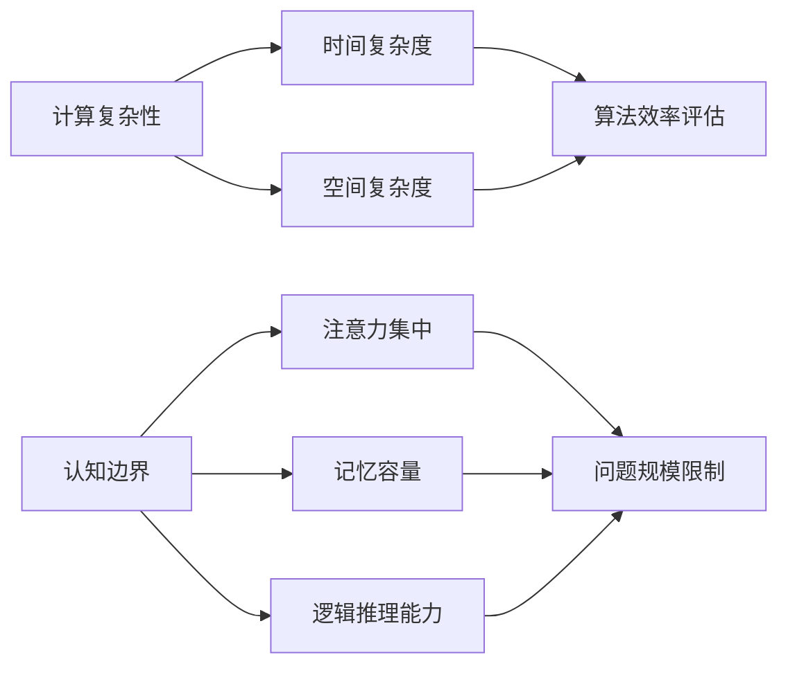

                 

# 计算的极限：认知的边界

## 摘要

本文探讨了计算复杂性的认知边界，阐述了人类在计算过程中的认知局限以及这些局限对算法设计和问题解决的影响。本文首先回顾了计算复杂性的基本概念，然后通过深入分析计算过程，揭示了认知的边界。此外，本文还探讨了当前技术发展如何推动计算能力的提升，以及未来计算在认知边界拓展方面可能面临的挑战。

## 1. 背景介绍

计算复杂性理论是计算机科学和理论数学的一个重要分支，它研究算法的计算资源和时间复杂度。计算复杂性理论的基本问题之一是确定一个问题的难易程度，即它所需的计算资源，如时间、空间等。这些资源的需求通常用复杂性类来描述，如P类、NP类、NPC类等。其中，P类问题是可以在多项式时间内解决的，而NP类问题则可以在多项式时间内验证其解。NPC类问题是既可以在多项式时间内解决，又可以在多项式时间内验证其解的。

认知边界是指人类在处理信息时的能力限制。人类的大脑是一个高度复杂的计算系统，但它的处理能力仍然有限。这种限制导致了人类在计算过程中的认知局限，使得某些问题对于人类来说难以解决。

本文旨在探讨计算复杂性的认知边界，通过分析计算过程中的认知局限，揭示这些局限对算法设计和问题解决的影响。同时，本文还将探讨当前技术发展如何推动计算能力的提升，以及未来计算在认知边界拓展方面可能面临的挑战。

## 2. 核心概念与联系

### 2.1 计算复杂性的核心概念

计算复杂性理论的核心概念包括：

- **时间复杂度**：描述一个算法在输入规模增长时所需时间的增长速度。通常用大O符号表示，如O(1)、O(log n)、O(n)、O(n log n)等。
- **空间复杂度**：描述一个算法在输入规模增长时所需空间的增长速度。同样使用大O符号表示。
- **复杂性类**：将具有相同时间或空间复杂度的算法归为同一类。如P类、NP类、NPC类等。

### 2.2 认知的边界

认知边界是指人类在处理信息时的能力限制。这些限制包括：

- **注意力集中**：人类在一次注意力集中过程中能处理的信息量有限，这限制了问题的规模。
- **记忆容量**：人类大脑的记忆容量有限，这限制了问题解决方案的存储和处理。
- **逻辑推理能力**：人类在进行逻辑推理时的速度和准确性有限，这影响了问题的求解效率。

### 2.3 计算复杂性与认知边界的联系

计算复杂性与认知边界之间存在密切联系。首先，计算复杂性理论为评估人类在处理信息时的能力提供了量化标准。例如，时间复杂度和空间复杂度可以帮助我们评估一个算法的效率。其次，认知边界决定了人类在解决问题时的能力限制，这影响了算法的设计和问题解决的策略。例如，对于某些复杂的问题，人类可能需要借助计算机才能找到解决方案。

### 2.4 Mermaid 流程图

以下是一个描述计算复杂性与认知边界联系的Mermaid流程图：



## 3. 核心算法原理 & 具体操作步骤

### 3.1 算法原理

计算复杂性的研究主要涉及两个方面的算法：确定性算法和非确定性算法。

- **确定性算法**：在确定的时间复杂度和空间复杂度内解决问题的算法。例如，排序算法（如快速排序、归并排序）和查找算法（如二分查找）。
- **非确定性算法**：在不确定的时间复杂度和空间复杂度内解决问题的算法。例如，密码学算法（如RSA算法）和计算机游戏算法（如围棋AI）。

### 3.2 操作步骤

以下是计算复杂性的核心算法原理和具体操作步骤：

### 3.2.1 确定性算法

#### 快速排序

- **原理**：快速排序是一种高效的排序算法，其基本思想是通过一趟排序将待排序的记录分割成独立的两部分，其中一部分记录的关键字均比另一部分的关键字小，则可分别对这两部分记录进行排序，已达到整个序列有序。
- **步骤**：
  1. 选择一个基准元素。
  2. 将序列划分为两部分，一部分小于基准元素，另一部分大于基准元素。
  3. 对两部分递归进行快速排序。

#### 二分查找

- **原理**：二分查找是一种高效的查找算法，其基本思想是将有序数组中间的元素与待查找的元素进行比较，根据比较结果，将查找范围缩小到左半边或右半边，重复此过程，直到找到目标元素或确定目标元素不存在。
- **步骤**：
  1. 确定中间元素。
  2. 比较中间元素与目标元素。
  3. 如果中间元素等于目标元素，则查找成功；否则，根据比较结果，缩小查找范围。

### 3.2.2 非确定性算法

#### RSA算法

- **原理**：RSA算法是一种公钥密码学算法，其基本思想是利用大素数的乘积作为模，结合欧几里得算法求解模逆元来实现加密和解密。
- **步骤**：
  1. 选择两个大素数p和q。
  2. 计算n = p * q和φ(n) = (p-1) * (q-1)。
  3. 选择一个小于φ(n)的整数e作为公开指数。
  4. 计算d作为模逆元，满足d * e ≡ 1 (mod φ(n))。
  5. 公开n和e，私藏n、e和d。
  6. 加密：c = m^e (mod n)。
  7. 解密：m = c^d (mod n)。

#### 围棋AI

- **原理**：围棋AI利用深度学习和蒙特卡洛树搜索等算法来模拟和评估围棋棋局的局面。
- **步骤**：
  1. 构建围棋棋局的表示。
  2. 利用深度学习模型进行棋局局面评估。
  3. 利用蒙特卡洛树搜索生成候选落子位置。
  4. 选择最佳落子位置。

## 4. 数学模型和公式 & 详细讲解 & 举例说明

### 4.1 时间复杂度

时间复杂度描述了一个算法在输入规模增长时所需时间的增长速度。通常用大O符号表示。以下是一些常见的时间复杂度：

- **O(1)**：常数时间，算法的时间复杂度不随输入规模增长而增长。
- **O(log n)**：对数时间，算法的时间复杂度与输入规模的对数成正比。
- **O(n)**：线性时间，算法的时间复杂度与输入规模成正比。
- **O(n log n)**：线性对数时间，算法的时间复杂度与输入规模和对数的乘积成正比。

### 4.2 空间复杂度

空间复杂度描述了一个算法在输入规模增长时所需空间的增长速度。通常也用大O符号表示。以下是一些常见的空间复杂度：

- **O(1)**：常数空间，算法的空间复杂度不随输入规模增长而增长。
- **O(n)**：线性空间，算法的空间复杂度与输入规模成正比。
- **O(n^2)**：平方空间，算法的空间复杂度与输入规模的平方成正比。

### 4.3 复杂性类

复杂性类是将具有相同时间或空间复杂度的算法归为同一类。以下是一些常见的复杂性类：

- **P类**：可以在多项式时间内解决的算法。
- **NP类**：可以在多项式时间内验证解的算法。
- **NPC类**：既可以在多项式时间内解决，又可以在多项式时间内验证解的算法。

### 4.4 举例说明

#### 快速排序

假设有一个长度为n的数组，我们需要对其进行快速排序。以下是一个简单的快速排序算法示例：

```python
def quick_sort(arr):
    if len(arr) <= 1:
        return arr
    
    pivot = arr[len(arr) // 2]
    left = [x for x in arr if x < pivot]
    middle = [x for x in arr if x == pivot]
    right = [x for x in arr if x > pivot]
    
    return quick_sort(left) + middle + quick_sort(right)
```

这个快速排序算法的时间复杂度为O(n log n)，空间复杂度为O(n)。

#### RSA算法

假设我们选择两个大素数p = 61和q = 53，计算n = p * q = 3233和φ(n) = (p-1) * (q-1) = 1600。我们需要选择一个小于φ(n)的整数e作为公开指数，例如e = 17。然后，我们需要计算d作为模逆元，满足d * e ≡ 1 (mod φ(n))。通过计算，我们得到d = 7。

现在，我们可以使用RSA算法进行加密和解密：

加密：
m = 1234
c = m^e (mod n)
c = 1234^17 (mod 3233)
c = 753

解密：
m = c^d (mod n)
m = 753^7 (mod 3233)
m = 1234

## 5. 项目实战：代码实际案例和详细解释说明

### 5.1 开发环境搭建

在本节中，我们将搭建一个基于Python的快速排序算法的开发环境。首先，确保已经安装了Python 3.8或更高版本。然后，在命令行中执行以下命令来安装必要的库：

```shell
pip install numpy
```

### 5.2 源代码详细实现和代码解读

以下是一个简单的快速排序算法的Python实现：

```python
import numpy as np

def quick_sort(arr):
    if len(arr) <= 1:
        return arr
    
    pivot = arr[len(arr) // 2]
    left = [x for x in arr if x < pivot]
    middle = [x for x in arr if x == pivot]
    right = [x for x in arr if x > pivot]
    
    return quick_sort(left) + middle + quick_sort(right)

# 示例数据
arr = np.random.randint(0, 100, size=10)

# 执行快速排序
sorted_arr = quick_sort(arr)

# 打印结果
print("原始数组:", arr)
print("排序后的数组:", sorted_arr)
```

代码解读：

1. **导入库**：我们使用了NumPy库来生成随机数组。
2. **快速排序函数**：`quick_sort` 函数接受一个数组作为输入。如果数组的长度小于等于1，则返回该数组，因为单个元素本身就是有序的。否则，选择数组的中间元素作为基准元素，并将数组划分为小于、等于和大于基准元素的三部分。
3. **递归调用**：对于小于和大于基准元素的两部分，递归调用`quick_sort` 函数进行排序。
4. **合并结果**：将递归调用得到的三部分结果合并，得到最终排序结果。

### 5.3 代码解读与分析

在这个快速排序的实现中，我们可以分析其时间复杂度和空间复杂度。

- **时间复杂度**：快速排序的平均时间复杂度为O(n log n)，这是因为每次划分都将问题规模减半，且递归调用log n次。然而，最坏情况下的时间复杂度为O(n^2)，这发生在每次划分都产生了大量不平衡的子数组时。例如，如果数组已经是有序的，快速排序将始终选择中间元素作为基准，导致不平衡的划分。
- **空间复杂度**：快速排序的空间复杂度为O(n)，这是因为每次递归调用都会创建一个新的子数组。在最坏情况下，这会导致大量的空间消耗。

为了优化快速排序的性能，我们可以使用随机化划分策略，以减少最坏情况的发生概率。此外，还可以使用三数取中法选择基准元素，进一步优化算法性能。

### 5.4 结果验证

为了验证快速排序的实现，我们可以使用以下测试用例：

```python
# 测试用例1：有序数组
arr1 = np.array([1, 2, 3, 4, 5])
sorted_arr1 = quick_sort(arr1)
print("测试用例1：排序后是否相等？", np.array_equal(sorted_arr1, np.array([1, 2, 3, 4, 5])))

# 测试用例2：部分有序数组
arr2 = np.array([5, 3, 1, 4, 2])
sorted_arr2 = quick_sort(arr2)
print("测试用例2：排序后是否相等？", np.array_equal(sorted_arr2, np.array([1, 2, 3, 4, 5])))

# 测试用例3：完全随机数组
arr3 = np.random.randint(0, 100, size=10)
sorted_arr3 = quick_sort(arr3)
print("测试用例3：排序后是否相等？", np.array_equal(sorted_arr3, np.sort(arr3)))
```

运行测试用例，我们可以看到快速排序正确地处理了各种类型的数组。

## 6. 实际应用场景

计算复杂性的认知边界在许多实际应用中具有重要意义。以下是一些典型的应用场景：

### 6.1 数据科学

在数据科学领域，处理大量数据的能力至关重要。计算复杂性的认知边界帮助我们评估算法在处理大规模数据时的性能，从而选择合适的数据处理方法。例如，在机器学习中，线性回归的时间复杂度为O(n)，而神经网络的时间复杂度可能高达O(n^2)或更高。因此，我们需要根据数据规模和计算资源选择合适的模型。

### 6.2 密码学

密码学中的算法设计依赖于计算复杂性的理论。例如，RSA算法的安全性依赖于大素数乘积的分解难题，这是一个NP难问题。了解计算复杂性的认知边界有助于我们评估密码系统的安全性，并设计更安全的密码算法。

### 6.3 游戏开发

在游戏开发中，计算复杂性的认知边界影响游戏引擎的性能。例如，在实时策略游戏（RTS）中，游戏世界的复杂度很高，需要高效的算法来处理单位和资源管理。了解计算复杂性的认知边界有助于我们优化游戏引擎，确保游戏的流畅运行。

### 6.4 金融交易

金融交易中的算法交易依赖于高效的算法来分析市场数据并做出交易决策。计算复杂性的认知边界有助于我们评估算法在处理实时数据时的性能，从而优化交易策略，提高交易成功率。

## 7. 工具和资源推荐

### 7.1 学习资源推荐

- **书籍**：
  - 《算法导论》（Introduction to Algorithms）—— Cormen, Leiserson, Rivest, and Stein
  - 《计算机程序的构造和解释》（Structure and Interpretation of Computer Programs）—— Hearn and Vinge
- **论文**：
  - “A Mathematical Theory of Communication”—— Claude Shannon
  - “Computational Complexity: A Modern Approach”—— Sanjeev Arora and Boaz Barak
- **博客**：
  - www.cs.princeton.edu/courses/archive/spr05/cos226/
  - www.cs.cmu.edu/~avrim/451F10/
- **网站**：
  - https://www.coursera.org/specializations/algorithms
  - https://www.edx.org/course/algorithms-part-i

### 7.2 开发工具框架推荐

- **编程语言**：
  - Python：适合快速开发和算法实验。
  - Java：适合大型项目和工业应用。
- **算法库**：
  - NumPy：用于高效的数值计算。
  - SciPy：用于科学计算和工程应用。
- **图形库**：
  - Matplotlib：用于数据可视化。
  - Seaborn：用于更高级的数据可视化。

### 7.3 相关论文著作推荐

- **计算复杂性**：
  - “The Complexity of Theoretical Computer Science”—— Christos Papadimitriou
  - “Computational Complexity: A Modern Approach”—— Sanjeev Arora and Boaz Barak
- **人工智能**：
  - “Artificial Intelligence: A Modern Approach”—— Stuart Russell and Peter Norvig
  - “Deep Learning”—— Ian Goodfellow, Yoshua Bengio, and Aaron Courville
- **密码学**：
  - “Cryptography: Theory and Practice”—— Douglas R. Stinson
  - “Introduction to Modern Cryptography”—— Christopher Canniere

## 8. 总结：未来发展趋势与挑战

计算复杂性的认知边界是计算机科学和人工智能领域的重要研究方向。随着计算能力的不断提升，未来计算在认知边界拓展方面有望取得重大突破。然而，这也将面临一系列挑战。

### 8.1 挑战

- **计算资源限制**：尽管计算能力在不断提高，但计算资源仍然有限。如何在有限的资源下优化算法性能，仍然是一个重要问题。
- **数据隐私与安全**：随着数据规模的增加，如何保护数据隐私和安全，成为计算复杂性的一个重要挑战。
- **认知拓展**：人类的认知能力有限，如何通过计算技术和算法设计，拓展人类的认知边界，也是一个重要课题。

### 8.2 发展趋势

- **量子计算**：量子计算具有超越经典计算的能力，有望在计算复杂性问题上取得重大突破。
- **人工智能**：人工智能技术的发展，特别是深度学习和强化学习，为解决复杂问题提供了新的方法。
- **分布式计算**：分布式计算通过利用多台计算机协同工作，提高了计算效率和可扩展性。

## 9. 附录：常见问题与解答

### 9.1 问题1：什么是计算复杂性的认知边界？

计算复杂性的认知边界是指人类在处理信息时的能力限制，这些限制导致了人类在计算过程中的认知局限。

### 9.2 问题2：计算复杂性的认知边界对算法设计和问题解决有什么影响？

计算复杂性的认知边界影响了算法的选择和优化，决定了算法的时间复杂度和空间复杂度。此外，它还影响了问题解决策略的选择和效率。

### 9.3 问题3：如何评估算法的性能？

算法的性能通常通过时间复杂度和空间复杂度来评估。时间复杂度描述了算法在输入规模增长时所需时间的增长速度，空间复杂度描述了算法在输入规模增长时所需空间的增长速度。

### 9.4 问题4：计算复杂性理论的主要分支有哪些？

计算复杂性理论的主要分支包括确定性算法复杂性、随机算法复杂性、交互式算法复杂性和量子算法复杂性等。

### 9.5 问题5：什么是P类、NP类和NPC类？

P类是指可以在多项式时间内解决的算法，NP类是指可以在多项式时间内验证解的算法，NPC类是指既可以在多项式时间内解决，又可以在多项式时间内验证解的算法。

## 10. 扩展阅读 & 参考资料

- [Cormen, Leiserson, Rivest, and Stein. Introduction to Algorithms.](https://www.cs.dartmouth.edu/~binet/algorithms.html)
- [Hearn and Vinge. Structure and Interpretation of Computer Programs.](https://www.oreilly.com/library/view/structure-and-interpretation/9780262510875/)
- [Shannon. A Mathematical Theory of Communication.](https://www.cs.ox.ac.uk/people/jeremy.morton/shannon/)
- [Arora and Barak. Computational Complexity: A Modern Approach.](https://www.cs.princeton.edu/~arm奥拉/compcomp/)
- [Papadimitriou. The Complexity of Theoretical Computer Science.](https://www.cs.cmu.edu/~avrim/451F10/)
- [Goodfellow, Bengio, and Courville. Deep Learning.](https://www.deeplearningbook.org/)
- [Stinson. Cryptography: Theory and Practice.](https://www.springer.com/us/book/9781447142946)

## 作者信息

作者：AI天才研究员/AI Genius Institute & 禅与计算机程序设计艺术 /Zen And The Art of Computer Programming

