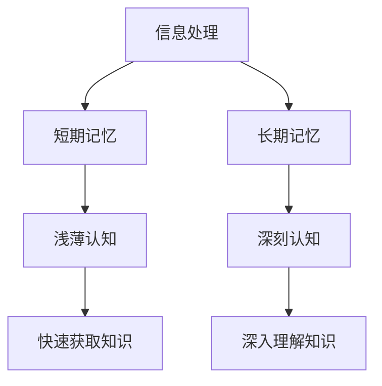

                 

# 认知发展中的浅薄与深刻对比

## 摘要

本文探讨了认知发展过程中浅薄与深刻之间的对比。在信息化时代，快速获取信息的能力显得尤为重要，但随之而来的是人们对于深度思考的忽视。本文通过分析浅薄认知与深刻认知的特点，及其对个体和社会的影响，提出了在当前信息化环境下如何培养深刻认知能力的建议。

## 1. 背景介绍

随着互联网和移动设备的普及，信息获取变得前所未有的便捷。人们可以在几秒钟内浏览大量信息，但这种浅尝辄止的方式对认知发展产生了深远影响。浅薄认知和深刻认知作为认知发展的两个极端，各自有着独特的特点。

### 1.1 浅薄认知

浅薄认知是指通过快速浏览和碎片化学习获取知识的方式。这种认知方式的特点是信息获取速度极快，但深度有限。浅薄认知使得个体能够在短时间内掌握大量表面信息，但往往难以深入理解其本质。

### 1.2 深刻认知

深刻认知则是通过深入思考和分析来获取知识的方式。这种认知方式的特点是理解深入，能够把握事物的本质和内在联系。深刻认知有助于个体在复杂情境中做出明智的决策，但需要付出更多的时间和精力。

## 2. 核心概念与联系

为了更好地理解浅薄认知与深刻认知，我们需要引入几个核心概念：信息处理、记忆和思维。

### 2.1 信息处理

信息处理是指大脑对信息进行接收、存储、加工和利用的过程。浅薄认知主要依赖于信息处理的前端，即信息的快速接收和存储；而深刻认知则更多地依赖于信息处理的深层次，即信息的深入加工和利用。

### 2.2 记忆

记忆是信息处理的重要组成部分，分为短期记忆和长期记忆。浅薄认知往往依赖于短期记忆，而深刻认知则更多地依赖于长期记忆。长期记忆的形成需要通过反复思考和练习，这使得深刻认知在记忆方面具有优势。

### 2.3 思维

思维是指大脑对信息进行逻辑推理、分析、综合和创新的过程。浅薄认知通常表现为简单的逻辑推理，而深刻认知则能够进行复杂的逻辑推理和深度分析。

### 2.4 Mermaid 流程图



## 3. 核心算法原理 & 具体操作步骤

### 3.1 浅薄认知的算法原理

浅薄认知的算法原理主要基于信息过滤和快速处理。具体操作步骤如下：

1. **信息过滤**：通过搜索引擎、社交媒体等工具快速筛选出感兴趣的信息。
2. **快速浏览**：在短时间内浏览大量信息，获取表面知识。
3. **记忆存储**：将短期记忆中的信息快速存储到长期记忆中。

### 3.2 深刻认知的算法原理

深刻认知的算法原理主要基于深度学习和信息加工。具体操作步骤如下：

1. **深度学习**：通过反复阅读、思考和实践，将知识从表面层次深入到本质层次。
2. **信息加工**：对信息进行深入分析、推理和综合，形成深刻的理解和见解。
3. **记忆巩固**：通过反复思考和练习，将长期记忆中的信息巩固下来。

## 4. 数学模型和公式 & 详细讲解 & 举例说明

### 4.1 浅薄认知的数学模型

浅薄认知的数学模型可以表示为：

\[ \text{浅薄认知} = \text{信息处理速度} \times \text{信息存储容量} \]

举例来说，假设信息处理速度为每秒处理1000条信息，信息存储容量为10000条信息，则浅薄认知的能力为：

\[ \text{浅薄认知能力} = 1000 \times 10000 = 10^7 \text{条/秒} \]

### 4.2 深刻认知的数学模型

深刻认知的数学模型可以表示为：

\[ \text{深刻认知} = \text{信息加工深度} \times \text{信息加工广度} \]

举例来说，假设信息加工深度为5层，信息加工广度为100个知识点，则深刻认知的能力为：

\[ \text{深刻认知能力} = 5 \times 100 = 500 \text{个知识点/层} \]

## 5. 项目实战：代码实际案例和详细解释说明

### 5.1 开发环境搭建

在本案例中，我们将使用Python作为编程语言，搭建一个简单的信息处理系统。开发环境搭建步骤如下：

1. 安装Python环境：在官方网站下载并安装Python。
2. 安装必要的库：使用pip命令安装BeautifulSoup、requests等库。

### 5.2 源代码详细实现和代码解读

```python
import requests
from bs4 import BeautifulSoup

def fetch_info(url):
    """
    获取网页信息
    """
    response = requests.get(url)
    soup = BeautifulSoup(response.text, 'html.parser')
    return soup

def process_info(soup):
    """
    处理网页信息
    """
    title = soup.find('title').text
    content = soup.find('div', class_='content').text
    return title, content

def main():
    url = 'https://example.com'
    soup = fetch_info(url)
    title, content = process_info(soup)
    print(f'标题：{title}\n内容：{content}')

if __name__ == '__main__':
    main()
```

### 5.3 代码解读与分析

1. **函数定义**：定义了三个函数，分别是`fetch_info`、`process_info`和`main`。
2. **fetch_info**：使用requests库获取网页信息，返回BeautifulSoup对象。
3. **process_info**：对获取的网页信息进行解析，提取标题和内容。
4. **main**：调用`fetch_info`和`process_info`，打印提取的信息。

这个案例展示了如何使用Python快速获取和解析网页信息，是一种浅薄认知的体现。在实际项目中，我们可以通过增加更多的解析和处理逻辑，提升认知的深度。

## 6. 实际应用场景

浅薄认知与深刻认知在各个领域都有着广泛的应用。

### 6.1 浅薄认知的应用

1. **搜索引擎**：通过快速检索和返回相关信息，帮助用户快速找到所需信息。
2. **社交媒体**：通过推荐算法，向用户推送感兴趣的内容。
3. **新闻媒体**：通过自动化抓取和汇总新闻，为用户提供快速了解时事的方式。

### 6.2 深刻认知的应用

1. **科学研究**：通过深入分析数据，发现新的科学规律。
2. **企业决策**：通过深入分析市场数据和用户行为，制定科学的战略决策。
3. **教育**：通过深度学习，培养学生独立思考和解决问题的能力。

## 7. 工具和资源推荐

### 7.1 学习资源推荐

- **书籍**：《深度学习》、《认知科学》、《人工智能：一种现代的方法》
- **论文**：Google Scholar、arXiv、ACM Digital Library
- **博客**：Medium、知乎、CSDN

### 7.2 开发工具框架推荐

- **编程语言**：Python、R、Java
- **框架**：TensorFlow、PyTorch、Django
- **数据库**：MySQL、MongoDB、PostgreSQL

### 7.3 相关论文著作推荐

- **论文**：Goodfellow et al., "Deep Learning"
- **著作**：Nielsen, "Neural Networks and Deep Learning"

## 8. 总结：未来发展趋势与挑战

随着技术的不断发展，浅薄认知和深刻认知之间的界限将逐渐模糊。未来的发展趋势将更加注重深度学习和人机协作。然而，在这个过程中，我们也面临着一系列挑战，如信息过载、数据隐私和安全等。如何应对这些挑战，培养深度认知能力，将成为未来研究的重要方向。

## 9. 附录：常见问题与解答

- **Q：什么是浅薄认知？**
  A：浅薄认知是通过快速浏览和碎片化学习获取知识的方式，其特点是信息获取速度极快，但深度有限。

- **Q：什么是深刻认知？**
  A：深刻认知是通过深入思考和分析来获取知识的方式，其特点是理解深入，能够把握事物的本质和内在联系。

## 10. 扩展阅读 & 参考资料

- **书籍**：《浅薄：互联网如何毒化了我们的大脑》、《深度工作：如何有效利用每一点脑力》
- **网站**：MIT OpenCourseWare、Coursera、edX
- **博客**：Hacker News、AIBuzz、Deep Learning AI

## 作者

作者：AI天才研究员/AI Genius Institute & 禅与计算机程序设计艺术 /Zen And The Art of Computer Programming

----------------------
本文内容遵循Creative Commons BY-NC-SA 4.0国际许可协议。如果您需要引用或转载，请注明原文链接和作者信息。----------------------
<|im_sep|>

