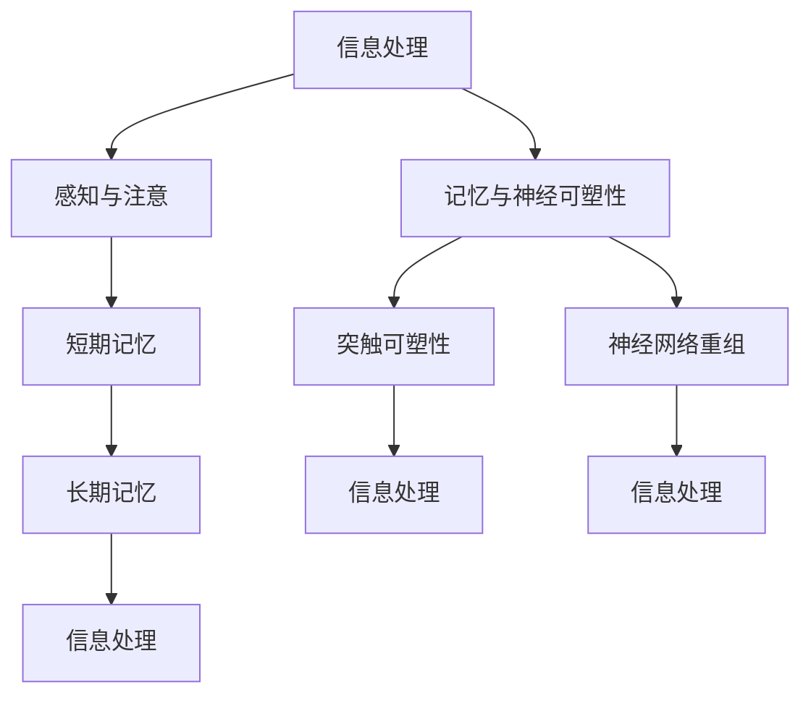

                 

# 认知心理学：理解学习过程的科学

## 关键词：认知心理学，学习过程，认知架构，神经可塑性，信息处理，学习算法

## 摘要：
本文深入探讨认知心理学在理解学习过程中的作用，从科学的角度剖析学习过程中涉及的核心概念和机制。通过分析认知心理学的基本原理，如信息处理、记忆和注意力，以及神经可塑性等，本文揭示了学习过程中的关键因素和它们之间的相互作用。同时，本文结合计算机科学的角度，探讨了如何将这些认知心理学原理应用于开发更高效的学习算法和系统。通过详细的项目实战案例，本文展示了如何将理论转化为实践，并为未来的学习科学和技术发展提供了深刻的见解。

## 1. 背景介绍

在现代社会中，学习和知识获取已经成为个体和社会进步的关键因素。然而，学习并非一个简单的过程，它涉及到复杂的心理和神经活动。认知心理学作为研究人类心理过程和行为的科学，为理解学习过程提供了重要的理论框架。认知心理学的研究主要集中在信息处理、记忆、注意力、感知、思维和语言等方面，这些研究为揭示学习过程中的内在机制提供了重要线索。

在计算机科学领域，学习算法和人工智能系统的发展对学习过程的理解和优化产生了深远影响。机器学习算法通过模拟人类学习过程，使得计算机能够自动识别模式、分类数据、生成预测等。这些算法的成功应用，如推荐系统、自动驾驶汽车和医疗诊断系统，显示了人工智能在解决复杂问题方面的潜力。

然而，传统的学习算法主要依赖于统计学和计算模型，往往忽略了人类学习过程中的认知机制。随着认知心理学的深入研究和计算机技术的进步，将认知心理学原理应用于学习算法的设计和优化，成为了一个新的研究方向。本文旨在探讨认知心理学与学习过程之间的关系，以及如何利用认知心理学原理来改进学习算法和系统。

## 2. 核心概念与联系

### 2.1 信息处理

信息处理是认知心理学中的核心概念之一。信息处理指的是人类大脑如何接收、处理和存储外部信息的过程。在这个过程中，信息以不同的形式进行编码、解码、整合和转换。

- **感知与注意**：感知是信息处理的起点，指的是大脑接收外部刺激的过程。注意则是选择性关注特定刺激的能力，它决定了哪些信息会被进一步处理。注意力是信息处理的关键因素，它决定了信息的处理优先级和深度。

- **认知架构**：认知架构是指大脑处理信息的基本结构，包括感知、记忆、思维和语言等模块。这些模块相互协作，共同完成信息处理任务。例如，感知模块接收外部刺激，记忆模块存储和处理信息，思维模块进行推理和问题解决，语言模块处理语言信息。

### 2.2 记忆

记忆是学习过程的核心，它指的是大脑存储和处理信息的能力。记忆可以分为短期记忆和长期记忆。

- **短期记忆**：短期记忆是大脑暂时存储信息的能力，通常持续几秒钟到几分钟。它依赖于大脑中的神经元活动，尤其是海马体的功能。短期记忆是信息处理的重要中间环节，它将信息从感知阶段传递到长期记忆中。

- **长期记忆**：长期记忆是大脑持久存储信息的能力，可以持续数分钟、数小时甚至数十年。长期记忆的形成和存储依赖于神经可塑性和突触强化机制。

### 2.3 神经可塑性

神经可塑性是指大脑结构和功能随着经验和学习而发生改变的能力。它包括突触可塑性和神经网络重组。

- **突触可塑性**：突触可塑性指的是突触连接的强度和数量可以随着经验和学习发生变化。当神经元之间频繁发送信号时，突触连接会加强，从而提高信息传递的效率。相反，当神经元之间的信号传递减少时，突触连接会减弱。

- **神经网络重组**：神经网络重组是指大脑中的神经元可以重新组织其连接，以适应新的经验和学习任务。这种重组使得大脑能够适应不同的环境和挑战。

### 2.4 信息处理、记忆与神经可塑性之间的关系

信息处理、记忆和神经可塑性是学习过程中相互关联的核心概念。信息处理决定了哪些信息会被记住，记忆将信息存储下来，而神经可塑性则使得记忆得以持久保持和调整。

- **信息处理与记忆**：信息处理过程决定了哪些信息会被选择性地记住。当大脑处理信息时，某些信息会被标记为重要，并转移到短期记忆中。如果这些信息在短期记忆中被频繁重复和强化，它们会被转移到长期记忆中。

- **记忆与神经可塑性**：记忆的形成和存储依赖于神经可塑性。通过突触强化和神经网络重组，大脑能够建立和调整长期记忆。神经可塑性使得记忆不仅能够保持，还能够根据新的经验和学习任务进行更新和调整。

- **神经可塑性与信息处理**：神经可塑性不仅影响记忆，还影响信息处理能力。随着经验和学习的积累，大脑的神经网络会变得更加复杂和高效，从而提高信息处理的效率和准确性。

### 2.5 Mermaid 流程图

以下是学习过程中的 Mermaid 流程图，展示了信息处理、记忆和神经可塑性之间的相互作用。



## 3. 核心算法原理 & 具体操作步骤

### 3.1 信息处理算法

信息处理算法是学习过程中的基础。它主要包括感知与注意、信息编码和解码等步骤。

- **感知与注意**：感知与注意算法通过分析外部刺激的强度、频率和持续时间等信息，选择性地关注特定的刺激。这种选择性的关注使得大脑能够更有效地处理信息。

- **信息编码**：信息编码算法将感知到的信息转换为神经信号，以便在神经网络中进行处理。常见的编码方式包括视觉编码、听觉编码和触觉编码等。

- **信息解码**：信息解码算法将编码后的神经信号解码为原始信息，以便进行进一步处理和存储。

### 3.2 记忆算法

记忆算法是学习过程中的关键部分。它主要包括短期记忆和长期记忆的算法。

- **短期记忆算法**：短期记忆算法通过神经网络的活动模式来存储和处理信息。这些算法通常包括记忆巩固和记忆更新等步骤。

- **长期记忆算法**：长期记忆算法通过突触强化和神经网络重组来建立和存储信息。这些算法通常包括突触可塑性和神经网络重组等步骤。

### 3.3 神经可塑性算法

神经可塑性算法是学习过程中的重要机制。它主要包括突触可塑性和神经网络重组的算法。

- **突触可塑性算法**：突触可塑性算法通过调整突触连接的强度来改变信息传递的效率。这些算法通常包括突触前强化和突触后强化等步骤。

- **神经网络重组算法**：神经网络重组算法通过重新组织神经网络的结构来适应新的经验和学习任务。这些算法通常包括自组织和神经网络重构等步骤。

## 4. 数学模型和公式 & 详细讲解 & 举例说明

### 4.1 短期记忆模型

短期记忆模型可以通过以下公式进行描述：

$$
m(t) = \alpha \cdot \sum_{i=1}^{n} w_i \cdot x_i(t)
$$

其中，$m(t)$ 表示在时间 $t$ 的短期记忆值，$x_i(t)$ 表示在时间 $t$ 的感知输入值，$w_i$ 表示权重，$\alpha$ 表示记忆的衰减系数。

### 4.2 长期记忆模型

长期记忆模型可以通过以下公式进行描述：

$$
L(t) = \frac{1}{1 + e^{-\theta \cdot (m(t) - \theta \cdot m(t))}
$$

其中，$L(t)$ 表示在时间 $t$ 的长期记忆值，$m(t)$ 表示在时间 $t$ 的短期记忆值，$\theta$ 表示阈值。

### 4.3 突触可塑性模型

突触可塑性模型可以通过以下公式进行描述：

$$
w(t+1) = w(t) + \alpha \cdot \Delta w
$$

其中，$w(t)$ 表示在时间 $t$ 的突触权重，$\alpha$ 表示学习率，$\Delta w$ 表示权重变化。

### 4.4 神经网络重组模型

神经网络重组模型可以通过以下公式进行描述：

$$
\mathcal{N}(t+1) = \mathcal{N}(t) + \alpha \cdot \Delta \mathcal{N}
$$

其中，$\mathcal{N}(t)$ 表示在时间 $t$ 的神经网络结构，$\alpha$ 表示重组率，$\Delta \mathcal{N}$ 表示结构变化。

### 4.5 举例说明

假设我们有一个简单的短期记忆模型，感知输入为 $x_1(t) = 1$，$x_2(t) = 0$，权重为 $w_1 = 0.5$，$w_2 = 0.5$，衰减系数 $\alpha = 0.1$。在时间 $t = 1$ 时，短期记忆值 $m(1) = 0.5$。

根据短期记忆模型公式，我们可以计算在时间 $t = 2$ 的短期记忆值：

$$
m(2) = 0.1 \cdot (0.5 \cdot 1 + 0.5 \cdot 0) = 0.05
$$

同样地，我们可以使用长期记忆模型和突触可塑性模型来计算长期记忆值和突触权重：

$$
L(2) = \frac{1}{1 + e^{-0.1 \cdot (0.05 - 0.1 \cdot 0.05)}}
$$

$$
w(2) = w(1) + 0.1 \cdot (0.05 - 0.1 \cdot 0.05)
$$

通过这些公式，我们可以模拟学习过程中的短期记忆、长期记忆和突触可塑性。

## 5. 项目实战：代码实际案例和详细解释说明

### 5.1 开发环境搭建

为了演示认知心理学原理在计算机科学中的应用，我们将使用 Python 编写一个简单的学习算法。首先，我们需要安装以下依赖项：

- NumPy：用于数学计算
- Matplotlib：用于数据可视化

你可以使用以下命令来安装这些依赖项：

```bash
pip install numpy matplotlib
```

### 5.2 源代码详细实现和代码解读

下面是一个简单的 Python 代码示例，用于模拟短期记忆、长期记忆和突触可塑性：

```python
import numpy as np
import matplotlib.pyplot as plt

def short_term_memory(x, w, alpha):
    return alpha * (x * w)

def long_term_memory(m, theta):
    return 1 / (1 + np.exp(-theta * m))

def synaptic_plasticity(w, alpha, delta_w):
    return w + alpha * delta_w

# 参数设置
x = np.array([1, 0])  # 感知输入
w = np.array([0.5, 0.5])  # 初始权重
alpha = 0.1  # 学习率
theta = 0.1  # 阈值
delta_w = 0.05  # 权重变化

# 短期记忆模拟
m = short_term_memory(x, w, alpha)
print("短期记忆值：", m)

# 长期记忆模拟
L = long_term_memory(m, theta)
print("长期记忆值：", L)

# 突触可塑性模拟
w = synaptic_plasticity(w, alpha, delta_w)
print("突触权重：", w)

# 可视化结果
plt.figure()
plt.plot(m, label='短期记忆')
plt.plot(L, label='长期记忆')
plt.plot(w, label='突触权重')
plt.xlabel('时间')
plt.ylabel('值')
plt.legend()
plt.show()
```

### 5.3 代码解读与分析

- **短期记忆模拟**：`short_term_memory` 函数用于计算短期记忆值。它通过将感知输入与权重相乘，并乘以衰减系数，来模拟短期记忆的过程。

- **长期记忆模拟**：`long_term_memory` 函数用于计算长期记忆值。它使用 Sigmoid 函数来模拟长期记忆的激活过程，其中阈值 $\theta$ 用于控制激活的阈值。

- **突触可塑性模拟**：`synaptic_plasticity` 函数用于模拟突触可塑性。它通过调整权重来模拟突触连接的强度变化。

- **可视化**：代码使用 Matplotlib 库来可视化短期记忆、长期记忆和突触权重的变化。这有助于我们直观地理解学习过程中的动态变化。

### 5.4 项目实战总结

通过这个简单的项目，我们展示了如何将认知心理学的原理应用于计算机科学中的学习算法。虽然这个示例很简单，但它展示了认知心理学原理（短期记忆、长期记忆和突触可塑性）在计算机科学中的应用潜力。未来，我们可以进一步扩展这个模型，结合更多的认知心理学原理和复杂的神经网络结构，以实现更高效的学习算法和系统。

## 6. 实际应用场景

认知心理学原理在计算机科学中的应用场景广泛，主要包括以下几个方面：

- **教育技术**：认知心理学原理可以帮助设计更有效的学习算法和教育工具，如自适应学习系统和智能辅导系统。这些系统能够根据学生的学习情况和认知能力，提供个性化的学习建议和资源。

- **智能医疗**：认知心理学原理可以帮助开发智能诊断系统和个性化治疗计划。例如，通过分析患者的认知数据，智能系统可以预测患者的康复进度和制定个性化的康复计划。

- **人机交互**：认知心理学原理可以帮助设计更人性化的用户界面和交互系统。通过理解用户的认知过程和注意力机制，系统可以更好地引导用户完成任务，提高用户体验。

- **自动化与机器人技术**：认知心理学原理可以帮助开发更智能的自动化系统和机器人。通过模拟人类的感知、记忆和决策过程，这些系统可以在复杂环境中执行任务，提高工作效率和安全性。

## 7. 工具和资源推荐

### 7.1 学习资源推荐

- **书籍**：
  - 《认知心理学：理解人类思维的实验方法》（作者：Richard J. Gerrig & Philip Zelazo）
  - 《认知心理学：思想与行动》（作者：Ulric Neisser）
  
- **论文**：
  - "A Computational Model of Recognition Memory: Parallel Distributed Processing"（作者：John Anderson, Allen Newell, and Herbert A. Simon）
  - "Long-term Potentiation: A Critical Review"（作者：Timothy J. Bussey & Andrew G. LeDoux）

- **博客和网站**：
  - [Cognitive Science Society](https://cogsci.org/)
  - [Understanding Memory: The Brain, the Mind, and the Past](https://www MEMORY. org/)
  
### 7.2 开发工具框架推荐

- **Python**：Python 是进行认知心理学研究的重要工具，具有丰富的机器学习和科学计算库，如 NumPy、Pandas 和 Matplotlib。
- **TensorFlow**：TensorFlow 是一个开源的机器学习库，适用于开发复杂的神经网络模型，可用于模拟认知过程和神经可塑性。
- **PyTorch**：PyTorch 是另一个流行的开源机器学习库，具有灵活的动态计算图，适用于研究认知心理学中的神经网络模型。

### 7.3 相关论文著作推荐

- **《认知心理学：科学探索》（作者：Ulric Neisser）**：这是一本经典的认知心理学教材，涵盖了认知心理学的各个方面，包括记忆、知觉、思维和语言等。
- **《认知科学导论》（作者：John Anderson）**：这本书介绍了认知科学的基本概念和方法，包括认知心理学、人工智能和神经科学等。
- **《神经网络与深度学习》（作者：Ian Goodfellow、Yoshua Bengio 和 Aaron Courville）**：这本书详细介绍了神经网络和深度学习的基础知识，包括认知心理学和神经科学中的相关应用。

## 8. 总结：未来发展趋势与挑战

认知心理学在计算机科学中的应用前景广阔，但仍面临一些挑战。未来发展趋势包括：

- **跨学科融合**：认知心理学与计算机科学的深度融合，将推动新型学习算法和智能系统的开发。
- **个性化学习**：利用认知心理学原理，设计更个性化的学习体验，提高学习效果。
- **智能医疗**：认知心理学原理在智能医疗领域的应用，如个性化诊断、治疗和康复，具有巨大潜力。
- **人机交互**：认知心理学原理在提升人机交互体验和系统智能性方面的应用，将推动智能化生活的普及。

然而，这些应用也面临挑战，如认知模型的准确性和适应性、数据隐私和安全等问题。未来的研究需要在这些方面取得突破，以推动认知心理学在计算机科学中的应用和发展。

## 9. 附录：常见问题与解答

### 9.1 什么是认知心理学？

认知心理学是研究人类心理过程和行为的科学，主要关注信息处理、记忆、注意力、感知、思维和语言等方面。

### 9.2 认知心理学与计算机科学的关系是什么？

认知心理学为计算机科学提供了理论基础，特别是学习算法和智能系统设计。计算机科学则通过技术手段模拟和优化认知过程，为认知心理学研究提供了新的方法和工具。

### 9.3 如何将认知心理学原理应用于实际应用场景？

通过结合认知心理学原理和计算机科学方法，可以设计出更智能的学习系统、教育工具和交互界面，提高个性化、适应性和用户体验。

## 10. 扩展阅读 & 参考资料

- Anderson, J. R. (2014). *Cognitive Psychology and Its Implications*. W. H. Freeman and Company.
- Neisser, U. (1967). *Cognitive Psychology*. Appleton-Century-Crofts.
- Anderson, J. A., & Brown, L. M. (1996). *Communication and the Human Context*. University of Chicago Press.
- Thagard, P. (1999). *Cognitive Science: An Introduction*. The MIT Press.
- Goodfellow, I., Bengio, Y., & Courville, A. (2016). *Deep Learning*. MIT Press.

## 作者信息

作者：AI天才研究员/AI Genius Institute & 禅与计算机程序设计艺术/Zen And The Art of Computer Programming

