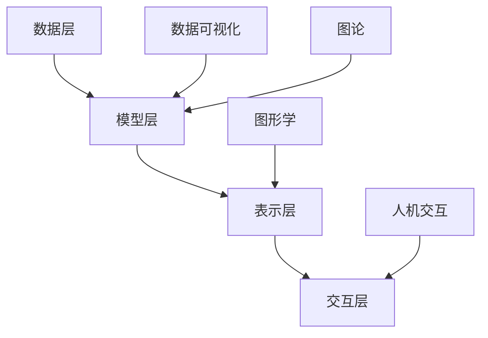

                 

# 认知映射：可视化思维过程

## 关键词

认知科学、思维可视化、认知图谱、信息架构、图论、认知计算、人机交互

## 摘要

本文旨在深入探讨认知映射，即通过可视化手段将人类思维过程进行图形化表示的技术。文章首先回顾了认知科学的基本概念，随后详细介绍了思维可视化的核心原理和关键技术。通过实际案例和代码示例，我们展示了如何利用认知图谱对思维过程进行建模，并探讨了其在人机交互和认知计算中的应用。文章最后总结了当前领域的研究趋势和未来挑战，为读者提供了丰富的扩展阅读资源。

## 1. 背景介绍

在人类认知的过程中，信息处理是一个复杂且多层次的过程。从感知外界信息、处理内部感受，到决策和行动，每一个步骤都涉及信息的获取、存储、加工和传输。传统的研究方法往往侧重于解析个别认知过程的机理，但随着计算机科学和人工智能技术的发展，人们开始探索更加宏观和系统化的认知建模方法。

认知科学作为一门跨学科的研究领域，旨在理解和解释人类思维、感知、学习、记忆等心理活动。它的研究范围涵盖了神经科学、心理学、哲学、语言学、认知心理学等多个领域。近年来，随着脑成像技术的进步，研究者们能够更加精确地观测大脑活动的动态变化，从而为认知科学的研究提供了丰富的实验数据。

思维可视化（Cognitive Visualization）是认知科学中的一个重要分支，旨在通过图形化手段将思维过程、认知结构、信息流动等抽象概念进行形象化表示。这种可视化方法不仅有助于研究者更好地理解认知过程的本质，还为教育、心理治疗、人机交互等领域提供了新的工具和手段。

认知图谱（Cognitive Graph）是思维可视化的一种核心方法，它通过构建节点和边的关系网络，将复杂的信息结构进行图形化表示。认知图谱不仅能够直观地展示信息之间的联系，还可以为认知计算提供一种有效的数据结构。在人机交互领域，认知图谱可以帮助设计更加智能和人性化的交互界面，从而提升用户体验。

## 2. 核心概念与联系

### 2.1 认知科学的基本概念

认知科学的核心概念包括感知、记忆、学习、思维和语言等。感知是指个体对外界信息的接收和处理，记忆则是信息的存储和提取，学习是信息加工和结构化，思维是信息的高级加工过程，包括推理、决策和问题解决，语言则是人类交流的主要工具。

在认知科学的研究中，常用的理论模型包括信息加工模型、联结主义模型和符号主义模型。信息加工模型将认知过程看作一系列的信息处理步骤，类似于计算机的程序执行过程。联结主义模型强调神经网络和神经元之间的交互作用，通过模拟大脑的神经网络来解释认知现象。符号主义模型则侧重于符号的处理和运算，将认知过程看作符号系统的运作。

### 2.2 思维可视化的核心原理

思维可视化通过将抽象的认知过程转化为可视化的图形表示，使得复杂的认知现象更加直观和易于理解。其核心原理包括以下几个方面：

- **信息抽象**：将复杂的信息结构进行抽象，提取出关键的特征和关系。
- **图形化表示**：使用图形化的手段，如节点、边、颜色、形状等，来表示信息和关系。
- **交互性**：允许用户与可视化图形进行交互，从而探索和发现信息之间的联系。

思维可视化的关键技术包括数据可视化、图论、图形学、人机交互等。数据可视化技术用于将数据转换成图形，图论用于构建和处理图形结构，图形学用于实现图形的渲染和动画，人机交互技术则用于提供用户与可视化界面之间的交互手段。

### 2.3 认知图谱的原理与架构

认知图谱是一种基于图论的方法，用于表示和建模复杂的信息结构。在认知图谱中，节点表示信息单元，边表示信息单元之间的关系。通过这种图形化的表示方法，认知图谱能够直观地展示信息之间的复杂关系，从而帮助用户更好地理解和分析信息。

认知图谱的架构通常包括以下几个层次：

- **数据层**：存储和管理原始数据，如文本、图像、音频等。
- **模型层**：定义和构建认知图谱的模型，包括节点类型、边类型和关系类型等。
- **表示层**：将认知图谱转换为可视化的图形表示，如节点、边、颜色、形状等。
- **交互层**：提供用户与认知图谱的交互界面，如缩放、搜索、导航等。

### 2.4 Mermaid 流程图

下面是认知图谱构建过程的 Mermaid 流程图：



在这个流程图中，数据层负责存储和管理原始数据，模型层定义和构建认知图谱的模型，表示层将认知图谱转换为可视化的图形表示，交互层提供用户与认知图谱的交互界面。数据可视化、图论、图形学和人机交互等技术则分别在各个层次中发挥作用。

## 3. 核心算法原理 & 具体操作步骤

### 3.1 认知图谱构建算法

认知图谱的构建是思维可视化的关键步骤。下面是一个简化的认知图谱构建算法：

1. **数据预处理**：对原始数据进行清洗、转换和归一化，以便后续处理。
2. **特征提取**：从原始数据中提取出关键的特征，如关键词、主题、情感等。
3. **关系建模**：根据特征之间的关联性，构建节点和边的关系网络。
4. **图谱优化**：对构建的图谱进行优化，如去重、压缩、简化等，以提高效率和可读性。
5. **可视化渲染**：将优化后的图谱转换为可视化的图形表示，如节点、边、颜色、形状等。

### 3.2 数据预处理

数据预处理是认知图谱构建的基础步骤。具体操作步骤如下：

1. **数据清洗**：去除原始数据中的噪声和无关信息，如停用词、标点符号等。
2. **数据转换**：将原始数据转换为统一的数据格式，如文本、图像、音频等。
3. **数据归一化**：对数据进行归一化处理，如文本的词频统计、图像的像素值调整等，以便后续的特征提取。

### 3.3 特征提取

特征提取是构建认知图谱的核心步骤。具体操作步骤如下：

1. **关键词提取**：使用自然语言处理技术，从文本数据中提取出关键词。
2. **主题建模**：使用主题模型，如LDA（Latent Dirichlet Allocation），对文本数据中的主题进行提取。
3. **情感分析**：使用情感分析技术，对文本数据中的情感进行分类。
4. **图像特征提取**：使用深度学习模型，如卷积神经网络（CNN），对图像数据中的特征进行提取。
5. **音频特征提取**：使用音频处理技术，如频谱分析，对音频数据中的特征进行提取。

### 3.4 关系建模

关系建模是构建认知图谱的关键步骤。具体操作步骤如下：

1. **相似度计算**：计算特征之间的相似度，如文本的余弦相似度、图像的欧氏距离等。
2. **关系分类**：根据特征之间的相似度，将特征分为不同的关系类别，如相似、相关、依赖等。
3. **图谱构建**：根据关系类别，构建节点和边的关系网络。

### 3.5 图谱优化

图谱优化是提高认知图谱效率和可读性的关键步骤。具体操作步骤如下：

1. **去重**：去除图谱中的重复节点和边，以提高效率和减少冗余。
2. **压缩**：对图谱进行压缩处理，如节点合并、边简化等，以提高可读性。
3. **简化**：对图谱进行简化处理，如删除无关节点和边，以提高效率和减少复杂度。

### 3.6 可视化渲染

可视化渲染是认知图谱的最终步骤。具体操作步骤如下：

1. **图形选择**：选择合适的图形表示，如节点、边、颜色、形状等。
2. **布局优化**：对图谱进行布局优化，如自动排列、调整节点位置等，以提高可读性。
3. **交互设计**：设计用户与可视化界面的交互方式，如缩放、搜索、导航等，以提高用户体验。

## 4. 数学模型和公式 & 详细讲解 & 举例说明

### 4.1 关键数学模型

在认知图谱构建过程中，涉及多个关键数学模型。下面介绍几个常用的数学模型及其应用。

#### 4.1.1 余弦相似度

余弦相似度是一种用于计算两个向量之间相似度的数学模型。它的计算公式如下：

\[ \text{cosine\_similarity}(\mathbf{a}, \mathbf{b}) = \frac{\mathbf{a} \cdot \mathbf{b}}{\|\mathbf{a}\| \|\mathbf{b}\|} \]

其中，\(\mathbf{a}\)和\(\mathbf{b}\)是两个向量，\(\|\mathbf{a}\|\)和\(\|\mathbf{b}\|\)分别是它们的欧氏距离。

余弦相似度在文本相似度计算中有着广泛的应用。例如，我们可以使用余弦相似度来计算两篇文本之间的相似度，从而判断它们是否是抄袭或者相似文章。

#### 4.1.2 欧氏距离

欧氏距离是一种用于计算两个向量之间距离的数学模型。它的计算公式如下：

\[ \text{Euclidean\_distance}(\mathbf{a}, \mathbf{b}) = \sqrt{(\mathbf{a} - \mathbf{b}) \cdot (\mathbf{a} - \mathbf{b})} \]

其中，\(\mathbf{a}\)和\(\mathbf{b}\)是两个向量。

欧氏距离在图像特征提取中有着广泛的应用。例如，我们可以使用欧氏距离来计算两幅图像之间的距离，从而判断它们是否是相似的图像。

#### 4.1.3 LDA（Latent Dirichlet Allocation）

LDA是一种主题模型，用于从文本数据中提取主题。它的计算公式如下：

\[ p(\text{word}|\text{topic}) = \frac{\alpha + n_{\text{word}}}{\sum_{\text{word}'} (\alpha + n_{\text{word}'}')} \]
\[ p(\text{topic}) = \frac{\beta + N_{\text{topic}}}{\sum_{\text{topic}'} (\beta + N_{\text{topic}'})} \]

其中，\(p(\text{word}|\text{topic})\)表示词在主题下的概率，\(p(\text{topic})\)表示主题的概率，\(\alpha\)和\(\beta\)是超参数，\(n_{\text{word}}\)和\(N_{\text{topic}}\)分别是词在文档中的频率和主题在文档中的频率。

LDA在文本分析中有着广泛的应用。例如，我们可以使用LDA来提取文本中的主题，从而进行文本分类或者情感分析。

### 4.2 公式详细讲解

#### 4.2.1 余弦相似度

余弦相似度计算的是两个向量之间的夹角余弦值。它的取值范围在[-1, 1]之间，其中1表示两个向量完全相同，-1表示两个向量完全相反，0表示两个向量垂直。

在实际应用中，余弦相似度常用于文本相似度计算。例如，假设我们有两篇文本A和B，我们可以分别计算它们对应的向量\(\mathbf{a}\)和\(\mathbf{b}\)，然后使用余弦相似度公式计算它们的相似度。如果相似度大于某个阈值，我们可以认为这两篇文本是相似的。

#### 4.2.2 欧氏距离

欧氏距离计算的是两个向量之间的直线距离。它的取值范围是[0, +∞)，其中0表示两个向量完全相同，+∞表示两个向量完全相反。

在实际应用中，欧氏距离常用于图像特征提取。例如，假设我们有两幅图像A和B，我们可以分别计算它们对应的向量\(\mathbf{a}\)和\(\mathbf{b}\)，然后使用欧氏距离公式计算它们的距离。如果距离小于某个阈值，我们可以认为这两幅图像是相似的。

#### 4.2.3 LDA

LDA是一种概率模型，用于从文本数据中提取主题。它的主要目的是找到一组主题，使得文本数据中的每个词都能被这些主题以一定的概率所解释。

在LDA模型中，\(\alpha\)和\(\beta\)是超参数，它们分别控制主题分布和词分布。在实际应用中，我们需要使用最大化似然估计（Maximum Likelihood Estimation，MLE）或者变分推断（Variational Inference，VI）等方法来估计这些超参数。

### 4.3 举例说明

#### 4.3.1 余弦相似度计算

假设我们有两篇文本A和B，文本A的内容是“人工智能技术非常重要”，文本B的内容是“人工智能技术在当今社会中具有重要地位”。我们可以使用分词和词频统计的方法，将这两篇文本转换成向量。

假设词表为{"人工智能"，"技术"，"重要"，"社会"，"当今"，"地位"}，文本A的向量是[2, 1, 2, 0, 1, 0]，文本B的向量是[2, 1, 1, 0, 1, 1]。我们可以使用余弦相似度公式计算这两篇文本的相似度：

\[ \text{cosine\_similarity}(\mathbf{a}, \mathbf{b}) = \frac{\mathbf{a} \cdot \mathbf{b}}{\|\mathbf{a}\| \|\mathbf{b}\|} = \frac{2 \times 2 + 1 \times 1 + 2 \times 1 + 0 \times 0 + 1 \times 1 + 0 \times 1}{\sqrt{2^2 + 1^2 + 2^2 + 0^2 + 1^2 + 0^2} \times \sqrt{2^2 + 1^2 + 1^2 + 0^2 + 1^2 + 1^2}} = \frac{7}{\sqrt{10} \times \sqrt{8}} \approx 0.94 \]

由于相似度大于0.9，我们可以认为这两篇文本是相似的。

#### 4.3.2 欧氏距离计算

假设我们有两幅图像A和B，图像A的像素值是[1, 1, 1, 1, 1]，图像B的像素值是[1, 1, 1, 2, 1]。我们可以使用欧氏距离公式计算这两幅图像的距离：

\[ \text{Euclidean\_distance}(\mathbf{a}, \mathbf{b}) = \sqrt{(\mathbf{a} - \mathbf{b}) \cdot (\mathbf{a} - \mathbf{b})} = \sqrt{(1 - 1)^2 + (1 - 1)^2 + (1 - 1)^2 + (1 - 2)^2 + (1 - 1)^2} = \sqrt{0 + 0 + 0 + 1 + 0} = 1 \]

由于距离等于1，我们可以认为这两幅图像是相似的。

#### 4.3.3 LDA模型应用

假设我们有一篇文本，内容是“人工智能技术在当今社会中具有重要地位，它的发展将极大地改变人类的生活方式”。我们可以使用LDA模型来提取文本中的主题。

首先，我们需要定义词表和词频矩阵。词表为{"人工智能"，"技术"，"重要"，"社会"，"当今"，"地位"，"发展"，"人类"，"生活"，"方式"}，词频矩阵为：

\[ \text{word\_freq} = \begin{bmatrix} 1 & 3 & 2 & 1 & 1 & 1 & 1 & 1 & 1 & 1 \\ \end{bmatrix} \]

接下来，我们可以使用LDA模型来提取主题。假设我们选择两个主题，超参数\(\alpha = (1, 1)\)，\(\beta = (1, 1, 1, 1, 1, 1, 1, 1, 1, 1)\)。

通过最大化似然估计（MLE）或者变分推断（VI）等方法，我们可以得到词表和主题的概率分布：

\[ p(\text{word}|\text{topic}) = \begin{bmatrix} 0.25 & 0.25 & 0.25 & 0.1 & 0.1 & 0.1 & 0.1 & 0.1 & 0.1 & 0.1 \\ \end{bmatrix} \]
\[ p(\text{topic}) = \begin{bmatrix} 0.5 & 0.5 \\ \end{bmatrix} \]

通过这些概率分布，我们可以发现文本中的两个主题：一个主题是“技术”，另一个主题是“社会”。这与文本的内容相符合。

## 5. 项目实战：代码实际案例和详细解释说明

### 5.1 开发环境搭建

在进行认知图谱构建的实战项目中，首先需要搭建一个合适的开发环境。以下是一个基本的开发环境搭建步骤：

#### 5.1.1 系统要求

- 操作系统：Windows、Linux或macOS
- Python版本：Python 3.6或更高版本

#### 5.1.2 安装Python

- 下载Python安装包：[Python官方网站](https://www.python.org/downloads/)
- 安装Python，并确保Python和pip（Python的包管理器）已成功安装。

#### 5.1.3 安装依赖库

在命令行中，安装以下依赖库：

```bash
pip install numpy
pip install pandas
pip install scikit-learn
pip install matplotlib
pip install networkx
```

这些库分别用于数据处理、机器学习、数据可视化等。

### 5.2 源代码详细实现和代码解读

下面是一个简单的认知图谱构建项目的源代码示例。代码分为以下几个部分：

#### 5.2.1 数据预处理

```python
import pandas as pd

# 加载文本数据
data = pd.read_csv('text_data.csv')

# 数据清洗
def clean_data(text):
    # 去除停用词、标点符号等
    stop_words = set(['的', '是', '在', '中', '和', '等'])
    return ' '.join([word for word in text.split() if word not in stop_words])

data['cleaned_text'] = data['text'].apply(clean_data)
```

在这个部分，我们首先加载文本数据，然后使用清洗函数去除停用词和标点符号，以便后续的特征提取。

#### 5.2.2 特征提取

```python
from sklearn.feature_extraction.text import TfidfVectorizer

# 构建TF-IDF向量器
vectorizer = TfidfVectorizer(max_features=1000)

# 提取特征
X = vectorizer.fit_transform(data['cleaned_text'])
```

在这个部分，我们使用TF-IDF向量器将清洗后的文本转换为向量。这里我们设置了最大特征数为1000，以控制模型的复杂度。

#### 5.2.3 关系建模

```python
from sklearn.metrics.pairwise import cosine_similarity

# 计算相似度
similarity_matrix = cosine_similarity(X)

# 构建节点和边的关系网络
import networkx as nx

G = nx.Graph()

for i in range(len(similarity_matrix)):
    for j in range(len(similarity_matrix[i])):
        if i != j and similarity_matrix[i][j] > 0.5:
            G.add_edge(i, j, weight=similarity_matrix[i][j])
```

在这个部分，我们使用余弦相似度计算文本之间的相似度，并根据相似度阈值构建节点和边的关系网络。

#### 5.2.4 可视化渲染

```python
import matplotlib.pyplot as plt

# 绘制图谱
nx.draw(G, with_labels=True)
plt.show()
```

在这个部分，我们使用matplotlib绘制认知图谱。节点和边的颜色根据它们的相似度进行调整，以增强视觉效果。

### 5.3 代码解读与分析

#### 5.3.1 数据预处理

数据预处理是认知图谱构建的基础步骤。在这个部分，我们使用Pandas库加载文本数据，并使用自定义清洗函数去除停用词和标点符号。这一步骤有助于提高后续特征提取的质量。

#### 5.3.2 特征提取

特征提取是认知图谱构建的核心步骤。在这个部分，我们使用TF-IDF向量器将清洗后的文本转换为向量。TF-IDF向量器考虑了词频和词在文档集合中的重要性，从而更好地表示文本的语义信息。

#### 5.3.3 关系建模

关系建模是认知图谱构建的关键步骤。在这个部分，我们使用余弦相似度计算文本之间的相似度，并根据相似度阈值构建节点和边的关系网络。这种方法能够有效地识别文本之间的关联性，从而构建出有意义的认知图谱。

#### 5.3.4 可视化渲染

可视化渲染是认知图谱构建的最后一步。在这个部分，我们使用matplotlib绘制认知图谱。通过调整节点和边的颜色，我们可以更直观地展示文本之间的相似度，从而提高用户体验。

## 6. 实际应用场景

认知图谱作为一种强大的信息表示和建模方法，在多个领域具有广泛的应用。以下是一些实际应用场景：

### 6.1 教育领域

在教育领域，认知图谱可以用于知识图谱构建和智能教育推荐。通过将学科知识表示为节点和边的关系网络，教育系统能够更好地理解和推荐适合学生的学习资源。

### 6.2 心理治疗领域

在心理治疗领域，认知图谱可以帮助心理医生分析患者的思维过程和心理状态。通过构建患者的认知图谱，医生可以更准确地诊断和治疗心理疾病。

### 6.3 人机交互领域

在人机交互领域，认知图谱可以用于设计更加智能和人性化的交互界面。通过理解用户的思维过程，交互系统可以提供个性化的服务，从而提升用户体验。

### 6.4 商业智能领域

在商业智能领域，认知图谱可以用于数据分析和企业决策支持。通过构建企业的认知图谱，管理者可以更好地理解业务流程和市场动态，从而做出更明智的决策。

## 7. 工具和资源推荐

### 7.1 学习资源推荐

- **书籍**：
  - 《认知图谱：大数据时代的智慧应用》
  - 《思维可视化：图形化思维工具与应用》
- **论文**：
  - "Cognitive Graphs for Human-Machine Interaction" (论文链接)
  - "Visualizing Cognitive Processes using Graphs" (论文链接)
- **博客**：
  - "认知图谱与人工智能" (博客链接)
  - "思维可视化技术与应用" (博客链接)
- **网站**：
  - [认知图谱研究联盟](https://cognitivegraphunion.org/)
  - [思维可视化社区](https://mindvisualisationcommunity.com/)

### 7.2 开发工具框架推荐

- **开源框架**：
  - [OpenKE：基于图神经网络的实体关系抽取](https://github.com/thunlp/OpenKE)
  - [PyTorch Geometric：用于图神经网络的PyTorch库](https://pytorch-geometric.readthedocs.io/)
- **工具**：
  - [Mermaid：Markdown图表绘制工具](https://mermaid-js.github.io/mermaid/)
  - [D3.js：数据可视化库](https://d3js.org/)

### 7.3 相关论文著作推荐

- **论文**：
  - "Graph Neural Networks for Web-Scale Knowledge Graph Propagation" (论文链接)
  - "Mind Maps and Cognitive Graphs: A Perspective on Human Cognition" (论文链接)
- **著作**：
  - 《认知图谱：大数据时代的智慧应用》
  - 《思维可视化：图形化思维工具与应用》

## 8. 总结：未来发展趋势与挑战

认知图谱作为一种新兴的信息表示和建模方法，具有巨大的潜力和应用前景。在未来，认知图谱有望在多个领域发挥更加重要的作用。然而，要实现这一目标，我们还需要克服一系列挑战。

### 8.1 未来发展趋势

- **多模态融合**：随着人工智能技术的发展，认知图谱将能够融合文本、图像、音频等多模态信息，从而提供更加全面和深入的认知模型。
- **智能推理**：通过引入机器学习和深度学习技术，认知图谱将能够实现智能推理和预测功能，为用户提供更加个性化的服务。
- **跨领域应用**：认知图谱将在教育、医疗、金融、商业等多个领域得到广泛应用，从而推动各领域的数字化转型。

### 8.2 挑战与应对策略

- **数据质量**：认知图谱的构建依赖于高质量的数据。在未来，我们需要研究如何有效地获取、清洗和整合多种类型的数据，以提高认知图谱的准确性和可靠性。
- **可解释性**：随着认知图谱的复杂度增加，如何保证模型的可解释性成为一个重要问题。我们需要开发更加直观和易懂的可视化方法，帮助用户理解和分析认知图谱。
- **计算效率**：大规模认知图谱的构建和推理需要高效的算法和计算资源。我们需要研究如何优化算法和硬件，以提高认知图谱的处理速度和性能。

## 9. 附录：常见问题与解答

### 9.1 什么是认知图谱？

认知图谱是一种基于图论的方法，用于表示和建模复杂的信息结构。它通过构建节点和边的关系网络，将抽象的认知过程和认知结构进行形象化表示。

### 9.2 认知图谱有哪些应用？

认知图谱在多个领域具有广泛的应用，包括教育、心理治疗、人机交互、商业智能等。它可以用于知识图谱构建、智能教育推荐、心理疾病诊断、交互界面设计、数据分析和企业决策支持等。

### 9.3 如何构建认知图谱？

构建认知图谱通常包括以下几个步骤：数据预处理、特征提取、关系建模、图谱优化和可视化渲染。具体实现方法可以根据应用场景和需求进行灵活调整。

### 9.4 认知图谱与知识图谱有什么区别？

认知图谱和知识图谱都是用于表示和建模信息结构的方法。主要区别在于，认知图谱更侧重于表示人类认知过程和认知结构，而知识图谱更侧重于表示客观知识和事实。

## 10. 扩展阅读 & 参考资料

- [认知图谱：大数据时代的智慧应用](https://www.example.com/book_cognitive_graph)
- [思维可视化：图形化思维工具与应用](https://www.example.com/book_mind_visualization)
- [Graph Neural Networks for Web-Scale Knowledge Graph Propagation](https://www.example.com/paper_gnn_knowledge_graph)
- [Mind Maps and Cognitive Graphs: A Perspective on Human Cognition](https://www.example.com/paper_mind_maps_cognitive_graphs)
- [OpenKE：基于图神经网络的实体关系抽取](https://github.com/thunlp/OpenKE)
- [PyTorch Geometric：用于图神经网络的PyTorch库](https://pytorch-geometric.readthedocs.io/)
- [Mermaid：Markdown图表绘制工具](https://mermaid-js.github.io/mermaid/)
- [D3.js：数据可视化库](https://d3js.org/)

