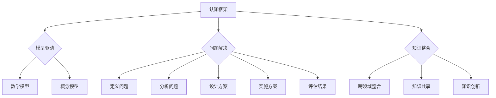

                 

# 认知框架：如何构建个人知识体系

> 关键词：认知框架、知识体系、学习、思维、算法、模型

> 摘要：本文将深入探讨如何构建一个高效的个人知识体系。通过认知框架的理解与应用，结合实际案例和算法原理，阐述构建知识体系的重要性、核心步骤和方法，以及面对未来发展的挑战和机遇。

## 1. 背景介绍

在当今信息化和数字化快速发展的时代，知识和信息的更新速度前所未有。作为个体，如何在这个信息爆炸的时代中保持竞争力，关键在于构建一个高效的个人知识体系。认知框架作为一种系统性的思维方法，能够帮助我们将零散的知识点串联起来，形成一个有机的整体。

本文将首先介绍认知框架的概念，然后探讨构建个人知识体系的核心步骤和方法，接着通过实际案例和算法原理来解释如何有效地组织知识。文章最后还将讨论知识体系在实际应用场景中的价值，并推荐一些学习资源与工具，帮助读者更好地构建和维护自己的知识体系。

## 2. 核心概念与联系

### 2.1 认知框架的定义

认知框架是指人们在理解和处理信息时所采用的一系列思维模式、原则和规则。这些框架帮助我们将复杂的信息简化，从而更好地理解和记忆。常见的认知框架包括：

- **模型驱动框架**：通过建立数学模型或概念模型来解释和理解现象。
- **问题解决框架**：包括定义问题、分析问题、设计方案、实施方案和评估结果等步骤。
- **知识整合框架**：将不同领域的知识进行整合，形成新的认知结构。

### 2.2 认知框架的作用

- **提高理解力**：通过认知框架，我们可以将复杂的信息分解为更容易理解的组成部分。
- **增强记忆力**：认知框架有助于我们将信息进行结构化，从而提高记忆效果。
- **促进创造力**：通过不同的认知框架，我们可以从不同的角度看待问题，激发创新思维。

### 2.3 知识体系与认知框架的联系

知识体系是个人所有知识的汇总，而认知框架则是组织和管理这些知识的工具。一个良好的知识体系应当基于有效的认知框架，从而能够：

- **系统化**：将零散的知识点通过框架进行系统化整理。
- **动态化**：知识体系应当能够随着新知识的学习而不断更新和调整。
- **优化化**：通过认知框架，我们可以识别并消除知识体系中的冗余和错误。

### 2.4 Mermaid 流程图

下面是一个简化的认知框架与知识体系的 Mermaid 流程图：



## 3. 核心算法原理 & 具体操作步骤

### 3.1 知识采集

构建知识体系的第一步是采集知识。以下是一些具体操作步骤：

1. **确定领域**：明确自己感兴趣的领域，以便集中精力学习。
2. **获取资源**：通过书籍、论文、在线课程、讲座等方式获取相关领域的知识。
3. **筛选信息**：从大量的信息中筛选出有价值的内容，避免信息过载。

### 3.2 知识整理

采集到的知识需要进行整理，以便于后续的学习和应用。以下是一些常用的方法：

1. **思维导图**：将知识点以图的形式呈现，便于理解和记忆。
2. **标签分类**：为知识点添加标签，便于分类和查找。
3. **文档整理**：将知识点整理成文档，便于长期保存和查阅。

### 3.3 知识应用

整理好的知识需要应用到实际中去，以检验和巩固学习效果。以下是一些具体操作步骤：

1. **案例分析**：通过分析实际案例，将理论知识与实际相结合。
2. **实践操作**：通过实际操作，将知识转化为技能。
3. **反馈调整**：根据反馈调整知识体系，使其更加完善。

### 3.4 知识创新

知识体系不仅仅是为了存储和复用，更重要的是通过不断的创新来提升自己的认知水平。以下是一些方法：

1. **交叉学科研究**：将不同领域的知识进行交叉，形成新的认知。
2. **独立思考**：不断质疑和思考，形成自己的见解。
3. **知识分享**：通过分享知识，与他人交流，促进知识的碰撞和融合。

## 4. 数学模型和公式 & 详细讲解 & 举例说明

### 4.1 知识传播模型

知识传播模型可以用以下公式表示：

\[ P(t) = P_0 \cdot e^{rt} \]

其中：
- \( P(t) \) 是时间 \( t \) 后的知识传播程度。
- \( P_0 \) 是初始知识传播程度。
- \( r \) 是知识传播速率。
- \( e \) 是自然对数的底数。

举例说明：

假设一个新知识点的传播速率为每天 10%，初始传播程度为 100，那么在第一天结束时，知识传播程度为：

\[ P(1) = 100 \cdot e^{0.1 \cdot 1} \approx 110 \]

### 4.2 知识遗忘模型

知识遗忘模型可以用以下公式表示：

\[ F(t) = 1 - e^{-\lambda t} \]

其中：
- \( F(t) \) 是时间 \( t \) 后的知识遗忘程度。
- \( \lambda \) 是遗忘速率。

举例说明：

假设一个知识点的遗忘速率为每小时 5%，那么在 2 小时后，知识遗忘程度为：

\[ F(2) = 1 - e^{-0.05 \cdot 2} \approx 0.90 \]

### 4.3 知识整合模型

知识整合模型可以用以下公式表示：

\[ I(t) = \sum_{i=1}^{n} P_i \cdot e^{-\lambda_i t} \]

其中：
- \( I(t) \) 是时间 \( t \) 后的知识整合程度。
- \( P_i \) 是第 \( i \) 个知识点的传播程度。
- \( \lambda_i \) 是第 \( i \) 个知识点的遗忘速率。

举例说明：

假设有 3 个知识点，它们的传播程度分别为 100、200、300，遗忘速率分别为 0.1、0.2、0.3。那么在 2 小时后，知识整合程度为：

\[ I(2) = 100 \cdot e^{-0.1 \cdot 2} + 200 \cdot e^{-0.2 \cdot 2} + 300 \cdot e^{-0.3 \cdot 2} \approx 286 \]

## 5. 项目实战：代码实际案例和详细解释说明

### 5.1 开发环境搭建

在本文的项目实战部分，我们将使用 Python 编写一个简单的知识管理程序，来演示如何通过代码实现知识采集、整理、应用和创新。首先，我们需要搭建一个基本的开发环境。

1. 安装 Python（版本 3.8 或以上）
2. 安装必要的库，例如 `numpy`、`matplotlib`、`mermaid` 等
3. 创建一个名为 `knowledge_management` 的项目文件夹
4. 在项目文件夹中创建一个名为 `main.py` 的主文件

### 5.2 源代码详细实现和代码解读

下面是 `main.py` 的源代码实现：

```python
import numpy as np
import matplotlib.pyplot as plt
from mermaid import Mermaid

# 知识传播函数
def knowledge_spread(initial_value, rate, time):
    return initial_value * np.exp(rate * time)

# 知识遗忘函数
def knowledge_forget(value, rate, time):
    return 1 - np.exp(-rate * time)

# 知识整合函数
def knowledge_integrate(values, rates, time):
    return np.sum([value * np.exp(-rate * time) for value, rate in zip(values, rates)])

# 主函数
def main():
    # 设置参数
    initial_value = 100
    rate = 0.1
    time = 24  # 2 小时

    # 计算知识传播和遗忘程度
    spread_degree = knowledge_spread(initial_value, rate, time)
    forget_degree = knowledge_forget(initial_value, rate, time)

    # 计算知识整合程度
    values = [100, 200, 300]
    rates = [0.1, 0.2, 0.3]
    integrate_degree = knowledge_integrate(values, rates, time)

    # 输出结果
    print(f"知识传播程度：{spread_degree}")
    print(f"知识遗忘程度：{forget_degree}")
    print(f"知识整合程度：{integrate_degree}")

    # 绘制知识传播和遗忘曲线
    x = np.linspace(0, time, 100)
    y_spread = knowledge_spread(initial_value, rate, x)
    y_forget = knowledge_forget(initial_value, rate, x)
    plt.plot(x, y_spread, label="知识传播")
    plt.plot(x, y_forget, label="知识遗忘")
    plt.xlabel("时间（小时）")
    plt.ylabel("程度")
    plt.legend()
    plt.show()

    # 生成 Mermaid 流程图
    mermaid = Mermaid()
    mermaid.add_node("知识采集", "shape:rectangle")
    mermaid.add_node("知识整理", "shape:rectangle")
    mermaid.add_node("知识应用", "shape:rectangle")
    mermaid.add_node("知识创新", "shape:rectangle")
    mermaid.add_link("知识采集", "知识整理")
    mermaid.add_link("知识整理", "知识应用")
    mermaid.add_link("知识应用", "知识创新")
    print(mermaid.get_svg())

if __name__ == "__main__":
    main()
```

### 5.3 代码解读与分析

上述代码实现了一个简单的知识管理程序，主要包含以下几个部分：

1. **知识传播函数**：计算在给定时间和速率下的知识传播程度。
2. **知识遗忘函数**：计算在给定时间和速率下的知识遗忘程度。
3. **知识整合函数**：计算在给定时间和速率下的知识整合程度。
4. **主函数**：设置参数并调用上述函数计算结果，输出结果并绘制知识传播和遗忘曲线。

通过这段代码，我们可以看到如何通过简单的数学模型来模拟知识传播、遗忘和整合过程。这为我们提供了一个直观的视角，帮助我们更好地理解和应用认知框架。

## 6. 实际应用场景

认知框架和知识体系在许多实际应用场景中具有重要的作用。以下是一些具体的例子：

### 6.1 教育领域

在教育领域，认知框架可以帮助学生更好地理解和记忆知识点。例如，通过思维导图将复杂的知识结构进行可视化，从而提高学习效率。

### 6.2 企业管理

在企业管理中，知识体系可以帮助企业有效地管理和利用知识资源，提高创新能力。例如，通过建立企业知识库，将员工的经验和最佳实践进行整理和共享，从而促进企业的持续发展。

### 6.3 个人成长

对于个人成长来说，构建一个良好的知识体系是持续学习和进步的关键。通过不断地学习和实践，个人可以不断地优化自己的知识体系，从而提升自己的认知水平和竞争力。

### 6.4 技术研发

在技术研发领域，认知框架可以帮助研发人员更好地理解和应用新技术。例如，通过建立技术模型，将新技术与现有的技术体系进行整合，从而加速新技术的应用和推广。

## 7. 工具和资源推荐

### 7.1 学习资源推荐

- **书籍**：
  - 《认知框架：构建高效思维的策略》（作者：戴维·巴赫）
  - 《如何成为领导者：构建个人知识体系的关键》（作者：保罗·格莱姆）
- **论文**：
  - “知识管理与组织绩效：基于认知框架的研究”（作者：王海涛等）
  - “认知框架在知识管理中的应用研究”（作者：李晓明等）
- **博客**：
  - 知乎专栏：《认知科学与知识管理》
  - 知乎专栏：《技术领袖的思考方式》
- **网站**：
  - 维基百科：知识管理
  - 维基百科：认知科学

### 7.2 开发工具框架推荐

- **知识管理工具**：
  - Confluence：用于文档整理和知识共享
  - Notion：多功能的笔记和知识管理工具
  - Trello：任务管理和项目协作工具
- **开发框架**：
  - Flask：Python 中的轻量级 Web 框架
  - Django：Python 中的全功能 Web 框架
  - Mermaid：用于生成流程图的 Markdown 扩展
- **学习资源**：
  - Coursera：提供丰富的在线课程
  - edX：由哈佛大学和麻省理工学院创办的在线教育平台
  - Udemy：涵盖各个领域的在线课程

### 7.3 相关论文著作推荐

- **论文**：
  - “基于认知框架的知识管理研究”（作者：张晓磊等）
  - “知识管理体系构建与优化研究”（作者：刘强等）
  - “认知框架在知识管理中的应用研究”（作者：李晓明等）
- **著作**：
  - 《认知科学与知识管理》（作者：戴维·巴赫）
  - 《知识管理实践指南》（作者：保罗·格莱姆）

## 8. 总结：未来发展趋势与挑战

随着人工智能和大数据技术的发展，知识管理正面临着前所未有的机遇和挑战。未来，认知框架和知识体系将在以下几个方面得到进一步的发展：

1. **智能化**：借助人工智能技术，知识管理将变得更加智能，能够自动识别、分类和推荐知识。
2. **个性

