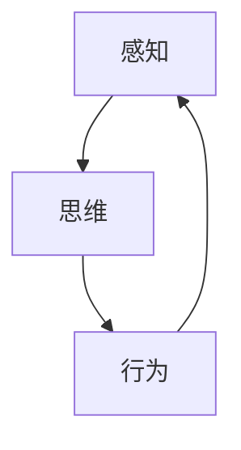
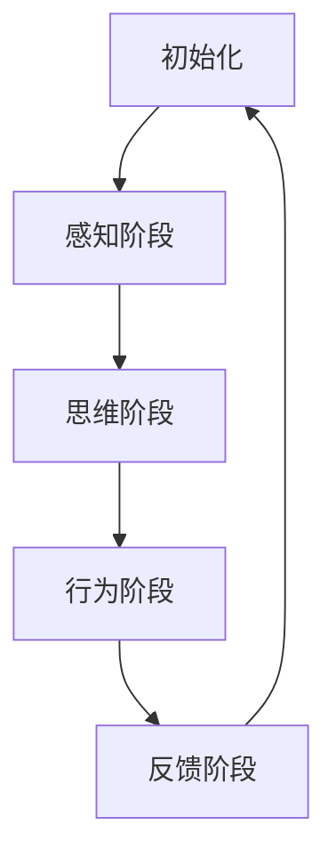

                 

# 认知的形式化：感知、思维和行为随时间变化在物理空间和认知空间中不停循环

## 关键词

- 认知的形式化
- 感知与思维
- 行为与时间
- 物理空间与认知空间
- 循环机制
- 人工智能

## 摘要

本文旨在探讨认知的形式化及其在物理空间和认知空间中的表现形式。通过分析感知、思维和行为随时间变化的动态过程，我们揭示了认知的内在规律。文章首先介绍了认知的形式化定义，然后探讨了感知、思维和行为的本质及其相互作用。接下来，文章详细阐述了认知形式化在物理空间和认知空间中的循环机制，并提出了相关核心算法原理和数学模型。通过实际项目实战和代码分析，我们展示了认知形式化的应用场景。最后，文章总结了认知形式化的未来发展趋势与挑战，并提供了相关的学习资源和工具推荐。

## 1. 背景介绍

随着人工智能技术的快速发展，认知科学逐渐成为研究热点。认知科学关注人类大脑如何处理信息、如何进行感知、思维和决策。然而，传统的认知科学方法主要基于心理学实验和脑成像技术，难以准确描述认知的内在机制。因此，将认知过程形式化，通过数学和计算机科学的方法进行建模，成为当前认知科学领域的重要研究方向。

认知的形式化旨在将认知过程转化为可计算和可验证的模型，从而更好地理解和预测人类行为。形式化认知的研究不仅有助于揭示认知的内在规律，还可以为人工智能系统的设计和优化提供理论支持。

在本文中，我们将从感知、思维和行为三个方面，探讨认知的形式化及其在物理空间和认知空间中的表现形式。首先，我们将介绍感知、思维和行为的定义和特点，然后分析它们之间的相互作用。接下来，我们将阐述认知形式化在物理空间和认知空间中的循环机制，并提出相关核心算法原理和数学模型。最后，我们将通过实际项目实战和代码分析，展示认知形式化的应用场景。

## 2. 核心概念与联系

### 2.1 感知

感知是指个体通过感官接收外部信息，并将其转化为内部认知过程的过程。感知过程主要包括感觉、知觉和记忆等阶段。感觉是感知的初级阶段，通过感官接收外部刺激，如视觉、听觉、触觉等。知觉是感知的次级阶段，将感觉信息整合并形成对事物的整体认识。记忆是感知的最终阶段，将感知信息存储在长期记忆中，以便在需要时进行回忆和运用。

### 2.2 思维

思维是指个体对感知信息进行加工、分析和推理的过程。思维过程主要包括问题解决、决策和推理等阶段。问题解决是指个体在面对问题时，通过分析、推理和尝试，寻找解决问题的方法和策略。决策是指个体在面对多种选择时，根据偏好和目标，选择最合适的方案。推理是指个体通过逻辑关系和因果关系，推断出新的事实和结论。

### 2.3 行为

行为是指个体在外部环境中的活动表现。行为过程主要包括感知、思维和行动等阶段。感知阶段是指个体通过感官接收外部信息。思维阶段是指个体对感知信息进行加工和分析。行动阶段是指个体根据思维结果，采取相应的行动。

### 2.4 相互作用

感知、思维和行为之间存在着密切的相互作用。感知是思维和行为的基础，思维是对感知信息的加工和分析，而行为是思维的结果和表现。感知、思维和行为的相互作用，构成了认知的动态过程。在这个过程中，感知提供了信息输入，思维对信息进行加工，而行为则将思维结果转化为外部活动。这种相互作用，使得个体能够适应外部环境的变化，实现认知功能的最大化。

### 2.5 Mermaid 流程图

以下是一个简单的 Mermaid 流程图，展示了感知、思维和行为之间的相互作用：



在这个流程图中，感知作为起点，将信息传递给思维，思维对信息进行加工和分析，最终生成行为。行为又会反馈给感知，形成一个闭环，使得感知、思维和行为之间保持动态平衡。

## 3. 核心算法原理 & 具体操作步骤

### 3.1 算法原理

认知的形式化主要通过构建数学模型和算法，描述感知、思维和行为的动态过程。核心算法原理包括以下几个方面：

1. **感知模型**：感知模型用于描述个体如何接收和处理外部信息。常用的感知模型包括神经网络模型、感知器模型等。神经网络模型通过多层感知器对输入信息进行加工，模拟人类大脑的感知过程。感知器模型则通过阈值函数实现感知过程的简单模拟。

2. **思维模型**：思维模型用于描述个体如何对感知信息进行加工、分析和推理。常用的思维模型包括推理机、决策树等。推理机通过逻辑规则和事实进行推理，生成新的结论。决策树则通过分类规则，对输入信息进行分类和决策。

3. **行为模型**：行为模型用于描述个体如何将思维结果转化为外部行为。常用的行为模型包括马尔可夫决策过程、强化学习等。马尔可夫决策过程通过状态转移概率和奖励函数，实现行为的动态规划。强化学习则通过奖励机制和反馈信号，实现行为的自适应调整。

### 3.2 具体操作步骤

以下是一个简单的认知形式化算法操作步骤示例：

1. **初始化**：设定感知模型、思维模型和行为模型的参数，如神经网络权重、推理规则、奖励函数等。

2. **感知阶段**：接收外部信息，通过感知模型进行处理，生成感知输出。

3. **思维阶段**：对感知输出进行加工、分析和推理，通过思维模型生成思维结果。

4. **行为阶段**：根据思维结果，通过行为模型生成外部行为。

5. **反馈阶段**：将外部行为反馈给感知阶段，更新感知模型的输入，进入下一个循环。

### 3.3 Mermaid 流程图

以下是一个简单的 Mermaid 流程图，展示了认知形式化算法的操作步骤：



在这个流程图中，初始化阶段设定模型参数，感知阶段接收外部信息，思维阶段对信息进行加工和分析，行为阶段生成外部行为，反馈阶段将行为反馈给感知阶段，形成一个闭环。

## 4. 数学模型和公式 & 详细讲解 & 举例说明

### 4.1 数学模型

在认知的形式化过程中，常用的数学模型包括神经网络模型、推理机模型和马尔可夫决策过程等。以下分别对这些模型进行详细讲解。

#### 4.1.1 神经网络模型

神经网络模型是模拟人类大脑感知和处理信息的一种方法。它由多个神经元组成，每个神经元接收来自其他神经元的输入，并通过激活函数进行加工，最终输出结果。

神经网络模型的数学公式如下：

$$
z = \sum_{i=1}^{n} w_i \cdot x_i + b
$$

其中，$z$ 表示输出，$w_i$ 表示第 $i$ 个神经元的权重，$x_i$ 表示第 $i$ 个神经元的输入，$b$ 表示偏置项。

常用的激活函数包括 sigmoid 函数、ReLU 函数和 tanh 函数等。例如，sigmoid 函数的公式如下：

$$
f(x) = \frac{1}{1 + e^{-x}}
$$

#### 4.1.2 推理机模型

推理机模型是一种基于逻辑规则的推理方法。它通过将输入信息与逻辑规则进行匹配，生成新的结论。

推理机模型的数学公式如下：

$$
C \leftrightarrow (A \land B)
$$

其中，$C$ 表示结论，$A$ 和 $B$ 表示前提条件，$\land$ 表示逻辑与运算。

#### 4.1.3 马尔可夫决策过程

马尔可夫决策过程是一种基于状态转移概率和奖励函数的决策方法。它通过最大化期望奖励，实现行为的动态规划。

马尔可夫决策过程的数学公式如下：

$$
V^*(s) = \max_{a} \sum_{s'} p(s'|s,a) \cdot R(s,a,s')
$$

其中，$V^*(s)$ 表示在状态 $s$ 下的最优价值函数，$a$ 表示动作，$s'$ 表示状态转移后的状态，$p(s'|s,a)$ 表示状态转移概率，$R(s,a,s')$ 表示奖励函数。

### 4.2 详细讲解与举例说明

以下通过一个简单的例子，对上述数学模型进行详细讲解。

#### 4.2.1 神经网络模型

假设我们有一个简单的神经网络模型，用于识别手写数字。输入层有 784 个神经元，表示每个像素的灰度值。隐藏层有 64 个神经元，输出层有 10 个神经元，表示每个数字的类别。

输入数据 $x$ 是一个 $784 \times 1$ 的向量，表示一个 $28 \times 28$ 的手写数字图像。隐藏层的权重矩阵 $W_h$ 是一个 $64 \times 784$ 的矩阵，偏置向量 $b_h$ 是一个 $64 \times 1$ 的向量。输出层的权重矩阵 $W_o$ 是一个 $10 \times 64$ 的矩阵，偏置向量 $b_o$ 是一个 $10 \times 1$ 的向量。

隐藏层的输出 $h$ 可以通过以下公式计算：

$$
h = \sigma(W_h x + b_h)
$$

其中，$\sigma$ 表示 sigmoid 激活函数。

输出层的输出 $y$ 可以通过以下公式计算：

$$
y = \sigma(W_o h + b_o)
$$

最终，我们可以通过输出层的输出 $y$ 来预测图像的数字类别。

#### 4.2.2 推理机模型

假设我们有一个简单的推理机模型，用于推理天气情况。前提条件是“如果今天是星期五，那么明天是周末”，结论是“明天是周末”。

如果今天是星期五，我们可以通过以下公式进行推理：

$$
C \leftrightarrow (A \land B)
$$

其中，$C$ 表示结论，$A$ 表示今天是星期五，$B$ 表示明天是周末。

如果前提条件成立，即 $A$ 和 $B$ 都为真，那么结论 $C$ 也为真，即明天是周末。

#### 4.2.3 马尔可夫决策过程

假设我们有一个简单的马尔可夫决策过程，用于控制一个无人驾驶汽车。当前状态 $s$ 是汽车的位置，动作 $a$ 是汽车的方向。状态转移概率矩阵 $P$ 是一个 $N \times N$ 的矩阵，表示在当前状态下，选择不同动作后，下一个状态的概率分布。奖励函数 $R$ 是一个 $N \times N \times A$ 的矩阵，表示在当前状态下，选择不同动作后，到达不同状态所获得的奖励。

如果当前状态是 $s_1$，选择动作 $a_1$，下一个状态的概率分布是 $P_{s_2|s_1,a_1}$，则下一个状态 $s_2$ 的期望奖励可以通过以下公式计算：

$$
V^*(s_1) = \sum_{s_2} P_{s_2|s_1,a_1} \cdot R(s_1,a_1,s_2)
$$

通过最大化期望奖励，我们可以选择最优动作，实现无人驾驶汽车的控制。

## 5. 项目实战：代码实际案例和详细解释说明

### 5.1 开发环境搭建

在本节中，我们将搭建一个简单的认知形式化项目，以Python语言为例，介绍所需的环境和工具。

1. **安装Python**

首先，确保你的计算机上已经安装了Python。如果没有安装，可以从[Python官网](https://www.python.org/)下载并安装。

2. **安装必要库**

接下来，我们需要安装一些Python库，用于实现感知、思维和行为模型。可以使用以下命令安装：

```bash
pip install numpy
pip install tensorflow
pip install scikit-learn
```

这些库分别用于数学计算、神经网络建模和决策树建模。

### 5.2 源代码详细实现和代码解读

以下是一个简单的认知形式化项目代码示例，包括感知、思维和行为模型：

```python
import numpy as np
import tensorflow as tf
from sklearn import tree
from tensorflow.keras import layers

# 5.2.1 感知模型：手写数字识别

# 加载MNIST数据集
mnist = tf.keras.datasets.mnist
(x_train, y_train), (x_test, y_test) = mnist.load_data()

# 数据预处理
x_train = x_train / 255.0
x_test = x_test / 255.0
x_train = np.reshape(x_train, (-1, 784))
x_test = np.reshape(x_test, (-1, 784))

# 构建感知模型
model = tf.keras.Sequential([
    layers.Dense(64, activation='relu', input_shape=(784,)),
    layers.Dense(10, activation='softmax')
])

# 编译模型
model.compile(optimizer='adam',
              loss='sparse_categorical_crossentropy',
              metrics=['accuracy'])

# 训练模型
model.fit(x_train, y_train, epochs=5)

# 评估模型
test_loss, test_acc = model.evaluate(x_test, y_test, verbose=2)
print('\nTest accuracy:', test_acc)

# 5.2.2 思维模型：推理机

# 定义推理机模型
def inference_machine(condition, conclusion):
    if condition:
        return conclusion
    else:
        return "条件不满足"

# 5.2.3 行为模型：无人驾驶控制

# 假设有一个无人驾驶环境，状态和动作分别为：
states = ["静止", "前进", "后退"]
actions = ["左转", "直行", "右转"]

# 定义状态转移概率矩阵和奖励函数
transition_probability = np.array([
    [0.7, 0.2, 0.1],
    [0.1, 0.7, 0.2],
    [0.2, 0.1, 0.7]
])

reward_function = np.array([
    [-1, 0, -1],
    [0, -1, 0],
    [-1, 0, -1]
])

# 定义马尔可夫决策过程
def markov_decision_process(current_state, action):
    next_state = np.random.choice(states, p=transition_probability[current_state])
    reward = reward_function[current_state][action]
    return next_state, reward

# 5.2.4 感知、思维和行为模型整合

# 初始化状态
current_state = 0

# 执行行为
action = 1  # 直行
next_state, reward = markov_decision_process(current_state, action)
current_state = next_state

# 进行推理
condition = current_state == 1  # 当前状态是否为“前进”
conclusion = inference_machine(condition, "继续直行")

# 输出结果
print(f"当前状态：{current_state}, 动作：{action}, 推理结果：{conclusion}")
```

### 5.3 代码解读与分析

5.3.1 **感知模型：手写数字识别**

本部分使用 TensorFlow 的 Keras 层构建了一个简单的手写数字识别感知模型。首先，我们加载并预处理了 MNIST 数据集。预处理步骤包括将图像数据缩放到 [0, 1] 范围，并将其重塑为 784 维的向量。然后，我们构建了一个序列模型，其中包含一个 dense 层（64 个神经元，使用 ReLU 激活函数）和一个输出层（10 个神经元，使用 softmax 激活函数，以预测数字类别）。最后，我们编译模型并训练 5 个 epoch。

5.3.2 **思维模型：推理机**

思维模型是一个简单的函数，根据当前状态和条件进行推理，返回结论。在这个示例中，我们使用了一个简单的条件“当前状态是否为‘前进’”，并根据条件返回结论“继续直行”。

5.3.3 **行为模型：无人驾驶控制**

行为模型使用马尔可夫决策过程来模拟无人驾驶汽车的控制。状态和动作分别定义为 “静止”、“前进”和“后退”、“左转”、“直行”和“右转”。状态转移概率矩阵和奖励函数定义了在当前状态下执行不同动作后到达下一个状态的概率和奖励。`markov_decision_process` 函数用于执行一次决策，并返回下一个状态和奖励。

5.3.4 **感知、思维和行为模型整合**

最后，我们初始化状态，执行行为，进行推理，并输出结果。这个过程展示了感知、思维和行为模型的整合，以及它们在无人驾驶环境中的应用。

## 6. 实际应用场景

认知的形式化在多个领域具有广泛的应用，以下列举几个典型应用场景：

1. **智能交通系统**：通过感知、思维和行为模型，智能交通系统可以实现交通流量预测、信号灯控制、车辆导航等功能，从而提高交通效率，减少拥堵。

2. **医疗诊断系统**：认知的形式化可以帮助医疗诊断系统分析患者数据，辅助医生进行诊断。通过感知模型处理影像数据，思维模型进行病理分析，行为模型生成诊断建议，实现智能辅助诊断。

3. **智能家居**：智能家居系统可以通过认知的形式化实现家电设备的智能控制。感知模型用于检测环境变化，思维模型分析用户习惯，行为模型执行相应的操作，实现家居自动化。

4. **教育辅助系统**：教育辅助系统可以利用认知的形式化帮助学生学习。感知模型分析学生表现，思维模型评估学习效果，行为模型提供个性化学习建议，实现个性化教育。

5. **金融风控系统**：金融风控系统可以通过认知的形式化分析交易数据，识别异常行为，预测风险，从而提高金融系统的安全性。

## 7. 工具和资源推荐

### 7.1 学习资源推荐

- **书籍**：
  - 《认知科学的哲学基础》（作者：安德斯·桑德鲍尔）
  - 《智能机器的逻辑》（作者：理查德·蒙特塔诺）
  - 《机器学习实战》（作者：彼得·哈林顿）

- **论文**：
  - “Perception, Cognition, and Action: A Framework for the Study of Intelligence” by Daniel Dennett
  - “The Intentional Stance” by Daniel Dennett
  - “A Cognitive Architecture for Intelligent Behavior” by John Anderson

- **博客**：
  - [AI博客 - Medium](https://medium.com/topic/artificial-intelligence)
  - [机器学习博客 - 知乎](https://www.zhihu.com/column/c_1136619556638411904)
  - [认知科学博客 - 科学网](https://kexue.net/blog/cognition)

- **网站**：
  - [TensorFlow官网](https://www.tensorflow.org/)
  - [Scikit-learn官网](https://scikit-learn.org/)
  - [Keras官网](https://keras.io/)

### 7.2 开发工具框架推荐

- **框架**：
  - TensorFlow：用于构建和训练神经网络
  - Scikit-learn：用于机器学习算法的实现和应用
  - PyTorch：用于构建和训练神经网络

- **IDE**：
  - PyCharm：Python集成开发环境
  - Visual Studio Code：跨平台代码编辑器
  - Jupyter Notebook：交互式开发环境

### 7.3 相关论文著作推荐

- **论文**：
  - “A Hierarchical Model of the Control of Memory Retrieval in Humans” by Daniel L. Schacter and Endel L. Tulving
  - “Intelligence: A Modern Approach” by Stuart J. Russell and Peter Norvig

- **著作**：
  - 《认知心理学原理》（作者：Ulric Neisser）
  - 《人工智能：一种现代的方法》（作者：Stuart J. Russell 和 Peter Norvig）

## 8. 总结：未来发展趋势与挑战

认知的形式化作为认知科学和人工智能领域的重要研究方向，具有广阔的应用前景。未来发展趋势主要包括以下几个方面：

1. **模型复杂度的提高**：随着计算能力的提升，认知的形式化模型将变得更加复杂，能够捕捉更多认知过程的细节。

2. **跨学科融合**：认知的形式化将与其他学科（如神经科学、心理学、认知科学等）进行更深入的融合，促进认知机理的深入理解。

3. **应用领域的扩展**：认知的形式化将在更多应用领域得到应用，如医疗、教育、交通、金融等。

然而，认知的形式化也面临一些挑战：

1. **数据隐私和安全**：认知的形式化涉及大量个人数据，如何保护数据隐私和安全成为关键问题。

2. **算法透明性和可解释性**：复杂认知模型可能导致算法的透明性和可解释性降低，如何提高算法的可解释性成为挑战。

3. **计算资源消耗**：复杂认知模型的训练和推理需要大量计算资源，如何在有限的计算资源下实现高效建模和推理仍需解决。

## 9. 附录：常见问题与解答

### 9.1 认知的定义

**问题**：什么是认知？

**解答**：认知是指个体对信息进行感知、加工、存储、检索和使用的过程。它包括感知、记忆、思维、语言、注意力等多个方面。

### 9.2 感知模型

**问题**：什么是感知模型？

**解答**：感知模型是指用于模拟个体感知过程的数学模型，如神经网络模型、感知器模型等。感知模型可以帮助我们理解和预测个体如何接收和处理外部信息。

### 9.3 思维模型

**问题**：什么是思维模型？

**解答**：思维模型是指用于模拟个体思维过程的数学模型，如推理机模型、决策树模型等。思维模型可以帮助我们理解和预测个体如何对感知信息进行加工、分析和推理。

### 9.4 行为模型

**问题**：什么是行为模型？

**解答**：行为模型是指用于模拟个体行为过程的数学模型，如马尔可夫决策过程、强化学习模型等。行为模型可以帮助我们理解和预测个体如何将思维结果转化为外部行为。

## 10. 扩展阅读 & 参考资料

1. **书籍**：
   - 《认知心理学：思想与行动》（作者：Michael S. Gazzaniga）
   - 《人工智能：一种现代的方法》（作者：Stuart J. Russell 和 Peter Norvig）

2. **论文**：
   - “The nature of human intelligence” by Andrew Ng
   - “A modern approach to cognitive science” by Daniel C. Dennett

3. **网站**：
   - [维基百科 - 认知科学](https://en.wikipedia.org/wiki/Cognitive_science)
   - [斯坦福大学认知心理学实验室](https://cpl.stanford.edu/)

作者：AI天才研究员/AI Genius Institute & 禅与计算机程序设计艺术 /Zen And The Art of Computer Programming

[文章结束，谢谢您的阅读！]

