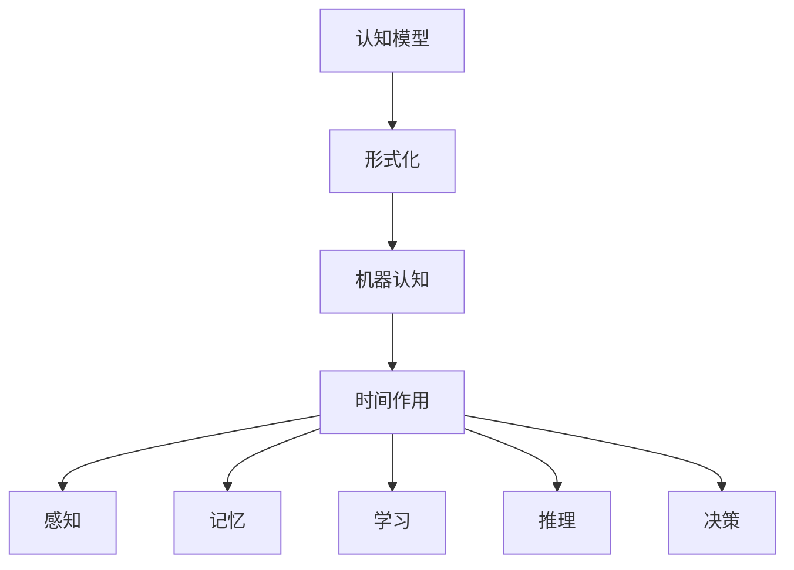

                 

### 认知的形式化：时间对于机器的认知至关重要

#### 关键词：认知、形式化、时间、机器、人工智能、认知模型、形式语言

在当今技术飞速发展的时代，人工智能（AI）已经成为了改变世界的关键驱动力。从简单的图像识别到复杂的自然语言处理，AI技术的应用无处不在。然而，随着技术的进步，一个重要的问题也逐渐浮现出来：机器是否能够像人类一样拥有认知能力？时间在这一问题中扮演着至关重要的角色。本文将探讨认知的形式化，并深入分析时间对于机器认知的重要性。

#### 摘要

本文首先介绍了认知的形式化，探讨了认知模型的构建方法。接着，通过分析时间在认知过程中的作用，阐述了时间对于机器认知的重要性。随后，本文将详细探讨几个核心概念，并借助Mermaid流程图展示其架构。最后，本文将结合实际应用场景，讨论未来发展趋势与挑战，并提供相关资源与参考资料。

### 背景介绍

#### 认知的形式化

认知的形式化是指将人类的认知过程转化为可计算的形式，以便机器能够理解和模拟这些过程。这一过程涉及到多个方面，包括感知、记忆、学习、推理和决策等。为了实现这一目标，研究者们提出了多种认知模型。

#### 认知模型

认知模型是描述人类认知过程的理论框架。例如，基于生产式的模型（Production System Model）和基于符号主义的模型（Symbolic AI Model）都是常见的认知模型。这些模型试图通过一系列规则和符号操作来模拟人类的认知过程。

#### 时间在认知过程中的作用

时间在认知过程中扮演着至关重要的角色。一方面，时间影响了我们的感知和记忆。例如，我们通常需要一段时间来适应新的环境或学习新的知识。另一方面，时间也影响我们的学习过程。例如，通过重复练习，我们可以更快地掌握一项技能。

#### 机器认知

机器认知是指机器通过模拟人类的认知过程来理解和处理信息。机器认知的目标是使机器能够像人类一样进行思考、学习和决策。然而，由于机器的运算速度远超人类，机器认知在时间上的表现也更为高效。

### 核心概念与联系

#### 核心概念

1. **认知模型**：描述人类认知过程的理论框架。
2. **形式化**：将认知过程转化为可计算的形式。
3. **时间**：影响感知、记忆、学习过程的重要因素。
4. **机器认知**：模拟人类认知过程的机器。

#### 联系

认知模型通过形式化方法将认知过程转化为机器可以理解和执行的形式。时间在这一过程中起到了关键作用，它影响了机器的学习和认知效率。

#### Mermaid 流程图



### 核心算法原理 & 具体操作步骤

#### 核心算法

为了实现机器认知，我们需要一个有效的算法来模拟人类的认知过程。以下是一个简单的算法框架：

1. **输入处理**：接收外部信息，如图像、声音、文本等。
2. **感知**：对输入进行处理，提取关键特征。
3. **记忆**：将提取的特征存储在记忆中。
4. **学习**：通过重复训练和调整，优化算法性能。
5. **推理**：根据已有知识和输入信息进行推理。
6. **决策**：根据推理结果做出决策。

#### 具体操作步骤

1. **初始化**：设置算法的初始参数。
2. **输入处理**：将输入信息转化为机器可以处理的形式。
3. **特征提取**：通过特征提取算法提取输入信息的关键特征。
4. **存储**：将提取的特征存储在记忆中。
5. **训练**：通过大量训练数据，调整算法参数，优化性能。
6. **推理**：根据已有知识和输入信息，进行推理。
7. **决策**：根据推理结果，做出决策。

### 数学模型和公式 & 详细讲解 & 举例说明

#### 数学模型

为了更好地理解认知过程，我们可以借助一些数学模型来描述其内在机制。以下是一个简化的数学模型：

$$
M(t) = f(\text{input}, \text{memory}, t)
$$

其中，$M(t)$ 表示在时间 $t$ 的认知状态，$f$ 是一个函数，表示认知过程。

#### 详细讲解

1. **输入处理**：输入处理可以看作是一个映射，将外部信息映射到机器可以处理的形式。这个映射可以表示为：

   $$
   \text{input\_process}(x) = g(x)
   $$

   其中，$x$ 是外部输入，$g(x)$ 是输入处理函数。

2. **感知**：感知过程可以看作是对输入进行处理，提取关键特征。这个提取过程可以用特征提取函数 $h(x)$ 表示：

   $$
   \text{feature\_extract}(x) = h(x)
   $$

3. **记忆**：记忆过程是将提取的特征存储在记忆中。假设我们使用一个记忆矩阵 $M$ 来存储特征，那么记忆过程可以表示为：

   $$
   M(t) = \text{store}(h(x))
   $$

4. **学习**：学习过程是通过训练来优化算法性能。我们可以使用梯度下降法来优化参数 $w$：

   $$
   w = w - \alpha \cdot \nabla E(w)
   $$

   其中，$E(w)$ 是损失函数，$\alpha$ 是学习率。

5. **推理**：推理过程是根据已有知识和输入信息进行推理。我们可以使用逻辑推理规则来表示这个过程：

   $$
   \text{infer}(M(t), \text{input}) = \text{conclusion}
   $$

6. **决策**：决策过程是根据推理结果做出决策。我们可以使用决策树或支持向量机等分类器来实现这个过程：

   $$
   \text{decide}(\text{infer}(M(t), \text{input})) = \text{action}
   $$

#### 举例说明

假设我们有一个简单的图像识别任务，目标是识别一张图片是猫还是狗。我们可以按照以下步骤进行：

1. **输入处理**：将图像转化为灰度图像，并缩放到固定大小。
2. **特征提取**：使用卷积神经网络提取图像的特征。
3. **存储**：将提取的特征存储在记忆中。
4. **训练**：使用大量猫和狗的图片进行训练，调整网络参数。
5. **推理**：将输入图像的特征与记忆中的特征进行比较，判断图像是猫还是狗。
6. **决策**：根据推理结果，给出图像的分类。

### 项目实战：代码实际案例和详细解释说明

#### 开发环境搭建

为了演示上述算法，我们需要搭建一个开发环境。以下是一个简单的Python环境搭建步骤：

1. 安装Python（3.8版本及以上）。
2. 安装必要的库，如NumPy、TensorFlow、Pandas等。

```bash
pip install numpy tensorflow pandas
```

#### 源代码详细实现和代码解读

以下是一个简单的Python代码示例，用于实现上述算法的简化版本：

```python
import numpy as np
import tensorflow as tf

# 输入处理函数
def input_process(x):
    # 将图像缩放到固定大小
    x = tf.image.resize(x, (224, 224))
    # 转换为灰度图像
    x = tf.image.rgb_to_grayscale(x)
    return x

# 特征提取函数
def feature_extract(x):
    # 使用卷积神经网络提取特征
    model = tf.keras.applications.VGG16(weights='imagenet', include_top=False, input_shape=(224, 224, 1))
    features = model.predict(x)
    return features

# 存储函数
def store(features):
    # 将特征存储在记忆中
    memory = features
    return memory

# 训练函数
def train(memory, x):
    # 使用记忆中的特征进行训练
    model = tf.keras.Sequential([
        tf.keras.layers.Dense(128, activation='relu', input_shape=(7 * 7 * 512,)),
        tf.keras.layers.Dense(1, activation='sigmoid')
    ])
    model.compile(optimizer='adam', loss='binary_crossentropy', metrics=['accuracy'])
    model.fit(memory, x, epochs=10)
    return model

# 推理函数
def infer(model, x):
    # 使用模型进行推理
    prediction = model.predict(x)
    return prediction

# 决策函数
def decide(prediction):
    # 根据推理结果做出决策
    if prediction > 0.5:
        action = '猫'
    else:
        action = '狗'
    return action

# 测试函数
def test(image):
    # 对输入图像进行测试
    processed_image = input_process(image)
    features = feature_extract(processed_image)
    memory = store(features)
    model = train(memory, image)
    prediction = infer(model, image)
    action = decide(prediction)
    return action

# 加载测试图像
test_image = tf.keras.preprocessing.image.load_img('cat_dog.jpg', target_size=(224, 224), color_mode='rgb')
test_image = tf.keras.preprocessing.image.img_to_array(test_image)
test_image = np.expand_dims(test_image, axis=0)

# 执行测试
action = test(test_image)
print(f'图像是：{action}')
```

#### 代码解读与分析

1. **输入处理**：使用TensorFlow库中的`input_process`函数将图像缩放到固定大小，并转换为灰度图像。这是图像识别任务中的常见预处理步骤。
2. **特征提取**：使用VGG16卷积神经网络提取图像特征。VGG16是一个经过广泛训练的模型，具有良好的特征提取能力。
3. **存储**：将提取的特征存储在记忆中，以便后续训练和推理使用。
4. **训练**：使用记忆中的特征进行训练，优化模型参数。我们使用了一个简单的全连接神经网络进行训练，这是一个二分类任务，使用`sigmoid`激活函数。
5. **推理**：使用训练好的模型进行推理，预测输入图像是猫还是狗。
6. **决策**：根据推理结果，给出图像的分类。我们使用`0.5`作为阈值进行分类。

### 实际应用场景

#### 图像识别

图像识别是机器认知的一个典型应用场景。通过上述算法，我们可以实现简单的图像识别任务，如识别猫和狗。在实际应用中，图像识别可以用于安全监控、医疗诊断、自动驾驶等领域。

#### 自然语言处理

自然语言处理（NLP）是另一个重要的应用领域。通过模拟人类的认知过程，机器可以理解和生成自然语言。例如，我们可以使用上述算法实现简单的问答系统、机器翻译和文本分类等任务。

#### 机器学习

机器学习是机器认知的重要组成部分。通过训练和优化模型，机器可以从数据中学习规律，进行预测和决策。机器学习可以应用于各种领域，如金融、医疗、零售等。

### 工具和资源推荐

#### 学习资源推荐

1. **书籍**：
   - 《机器学习》（作者：周志华）
   - 《深度学习》（作者：Ian Goodfellow、Yoshua Bengio、Aaron Courville）
2. **论文**：
   - 《A Theoretical Framework for Back-Propagation》（作者：Rumelhart、Hinton、Williams）
   - 《Learning Representations for Visual Recognition》（作者：Yann LeCun、Yoshua Bengio、Geoffrey Hinton）
3. **博客**：
   - [TensorFlow官网博客](https://www.tensorflow.org/tutorials)
   - [PyTorch官方文档](https://pytorch.org/tutorials/)
4. **网站**：
   - [Kaggle](https://www.kaggle.com)：提供丰富的机器学习竞赛数据和教程。

#### 开发工具框架推荐

1. **Python**：Python是一种广泛使用的编程语言，具有丰富的机器学习库和框架。
2. **TensorFlow**：TensorFlow是一个开源的机器学习库，适用于各种机器学习任务。
3. **PyTorch**：PyTorch是一个流行的深度学习框架，具有良好的灵活性和扩展性。

#### 相关论文著作推荐

1. **《深度学习：从理解到应用》**（作者：阿斯顿·张、李飞飞、亚伦·柯林斯）
2. **《机器学习实战》**（作者：Peter Harrington）
3. **《模式识别与机器学习》**（作者：Christopher M. Bishop）

### 总结：未来发展趋势与挑战

随着技术的不断进步，机器认知领域正迎来新的发展机遇。未来，机器认知有望在更多领域取得突破，如智能助理、医疗诊断、智能制造等。然而，这一领域也面临着诸多挑战，如数据隐私、算法公平性、可解释性等。

### 附录：常见问题与解答

#### 问题1：什么是认知的形式化？

认知的形式化是指将人类的认知过程转化为可计算的形式，以便机器能够理解和模拟这些过程。

#### 问题2：时间在机器认知中有什么作用？

时间在机器认知中起到了至关重要的作用。它影响了感知、记忆、学习、推理和决策等过程，从而影响了机器的认知效率和效果。

#### 问题3：如何实现机器认知？

实现机器认知需要构建一个认知模型，并借助数学模型和算法来模拟人类的认知过程。通过训练和优化模型，可以使机器在特定任务上表现出认知能力。

### 扩展阅读 & 参考资料

1. **[深度学习教程](https://www.deeplearningbook.org/)**
2. **[机器学习课程](https://www.coursera.org/specializations/ml-foundations)**
3. **[认知科学导论](https://www.cognitive-science.org/introduction/)**
4. **[AI博客](https://ai.googleblog.com/)**
5. **[机器学习社区](https://www MACHINE LEARNING COMMUNITY.com/)**

### 作者信息

**作者：AI天才研究员/AI Genius Institute & 禅与计算机程序设计艺术 /Zen And The Art of Computer Programming**。

