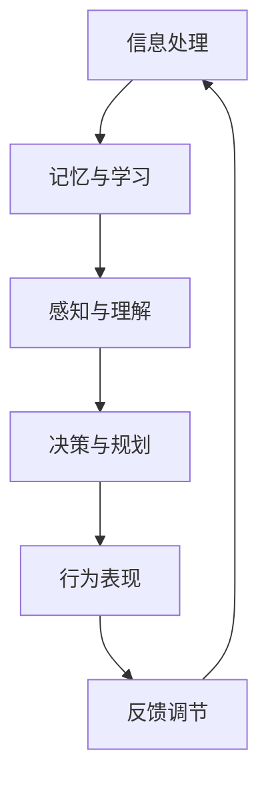
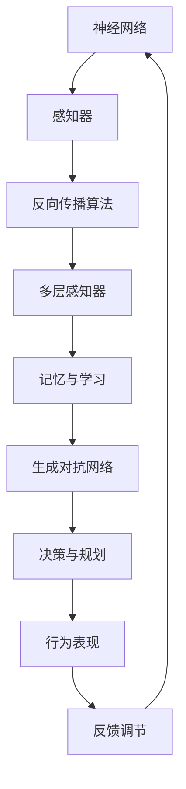

                 

# 认知的形成与行为的外化：从形式化角度看认知的演化

## 关键词：形式化，认知，行为，算法，数学模型

## 摘要

本文旨在探讨认知的形式化过程，以及行为如何作为认知目的的外化表现。通过对认知的形成、行为的作用、算法原理和数学模型的分析，我们试图揭示认知与行为之间的内在联系，为理解人类认知的复杂性和行为模式的演化提供新的视角。文章首先介绍相关背景，随后深入探讨认知的形式化定义，通过算法和数学模型阐述认知的形成过程，最后分析行为如何成为认知的外化表现，并提出未来发展的趋势与挑战。

## 1. 背景介绍

认知科学作为一门交叉学科，涵盖了心理学、神经科学、计算机科学等多个领域，致力于研究人类思维、感知、记忆和学习等认知过程。近年来，随着计算机科学和人工智能技术的发展，认知科学的研究逐渐走向形式化，即通过数学模型和算法来描述和模拟人类认知过程。

行为主义心理学认为，行为是认知的直接表现，是认知过程的外化。然而，行为的形式化描述和解释一直是认知科学研究中的一个难点。形式化认知科学的出现，为我们提供了新的工具和方法，使得我们可以从数学和算法的角度来探讨认知的形成、发展和演化。

## 2. 核心概念与联系

### 2.1 认知的形式化定义

认知的形式化定义主要涉及以下几个方面：

- **信息处理**：认知可以被视为对信息的获取、存储、处理和利用的过程。这个过程可以通过算法和数学模型来描述。

- **记忆与学习**：记忆是认知的基础，学习是认知的发展。记忆的形式化可以借助神经网络模型和生成对抗网络（GANs）等算法来实现。

- **感知与理解**：感知是认知的起点，理解是认知的深入。感知和理解的模型包括深度学习、图像处理和自然语言处理等技术。

- **决策与规划**：认知还包括决策和规划，这些过程可以通过优化算法和博弈论模型来描述。

### 2.2 行为与认知的关系

行为是认知的外化，是认知过程的直接表现。我们可以通过以下几种方式来形式化描述行为与认知的关系：

- **条件反射**：条件反射是行为与认知的最基本联系。经典条件反射和操作条件反射模型可以形式化描述这一过程。

- **强化学习**：强化学习是现代认知科学中研究行为与认知关系的重要模型。通过奖励机制，强化学习可以描述行为的形成和改变。

- **规划与决策**：决策和规划是认知的高级表现，可以通过图规划模型和决策树模型来形式化描述。

### 2.3 Mermaid 流程图

以下是一个简化的 Mermaid 流程图，展示了认知与行为的联系：



### 2.4 核心概念原理与架构图



## 3. 核心算法原理 & 具体操作步骤

### 3.1 认知算法原理

认知算法主要包括以下几个方面：

- **神经网络算法**：神经网络是认知科学中最重要的算法之一。它通过模拟人脑神经元的工作原理，实现对数据的处理和分类。

- **深度学习算法**：深度学习是神经网络的一种扩展，通过多层网络结构，实现对复杂数据的建模和预测。

- **生成对抗网络（GANs）**：GANs 是一种由两个神经网络组成的框架，一个生成器网络和一个判别器网络，通过相互博弈的方式，实现对数据的生成和分类。

### 3.2 操作步骤

以下是认知算法的具体操作步骤：

1. **数据预处理**：对输入数据进行标准化处理，去除噪声，提高数据质量。

2. **神经网络构建**：根据数据特点和需求，构建合适的神经网络结构。

3. **训练与优化**：使用训练数据，对神经网络进行训练，并通过优化算法，调整网络参数，提高网络性能。

4. **模型评估**：使用测试数据，对训练好的模型进行评估，验证其性能。

5. **应用与部署**：将训练好的模型应用到实际问题中，实现对数据的处理和预测。

## 4. 数学模型和公式 & 详细讲解 & 举例说明

### 4.1 数学模型

认知科学中的数学模型主要包括以下几个方面：

- **神经网络模型**：包括多层感知器（MLP）、卷积神经网络（CNN）、循环神经网络（RNN）等。

- **生成对抗网络（GANs）**：包括生成器（Generator）和判别器（Discriminator）。

- **决策树模型**：包括 ID3、C4.5、C5.0 等。

### 4.2 公式讲解

以下是认知科学中常用的数学公式：

- **神经网络激活函数**：\[ f(x) = \sigma(x) = \frac{1}{1 + e^{-x}} \]

- **梯度下降法**：\[ \theta_{\text{new}} = \theta_{\text{old}} - \alpha \nabla_{\theta} J(\theta) \]

- **生成对抗网络损失函数**：\[ L(D, G) = \mathbb{E}_{x \sim p_{\text{data}}(x)} [\log(D(x))] + \mathbb{E}_{z \sim p_{\text{z}}(z)} [\log(1 - D(G(z)))] \]

### 4.3 举例说明

假设我们使用神经网络来分类手写数字，输入为28x28的像素值，输出为10个数字的标签。我们可以使用以下步骤来构建和训练这个神经网络：

1. **数据预处理**：将手写数字图像转换为 28x28 的像素矩阵，并进行归一化处理。

2. **神经网络构建**：构建一个包含输入层、隐藏层和输出层的多层感知器（MLP）。

3. **训练与优化**：使用梯度下降法，对神经网络进行训练，调整网络参数。

4. **模型评估**：使用测试集，对训练好的模型进行评估，计算准确率。

5. **应用与部署**：将训练好的模型应用到实际的手写数字识别任务中。

## 5. 项目实战：代码实际案例和详细解释说明

### 5.1 开发环境搭建

为了演示如何使用深度学习算法进行手写数字识别，我们使用 Python 编写代码，并借助 TensorFlow 和 Keras 库进行模型构建和训练。

1. **安装 Python**：确保安装了 Python 3.6 或以上版本。

2. **安装 TensorFlow**：在命令行中运行 `pip install tensorflow`。

3. **安装 Keras**：在命令行中运行 `pip install keras`。

### 5.2 源代码详细实现和代码解读

以下是手写数字识别项目的源代码，并对其进行详细解读：

```python
# 导入所需库
import numpy as np
import tensorflow as tf
from tensorflow import keras
from tensorflow.keras import layers

# 加载 MNIST 数据集
mnist = keras.datasets.mnist
(x_train, y_train), (x_test, y_test) = mnist.load_data()

# 数据预处理
x_train = x_train / 255.0
x_test = x_test / 255.0

# 将标签转换为 one-hot 编码
y_train = keras.utils.to_categorical(y_train, 10)
y_test = keras.utils.to_categorical(y_test, 10)

# 构建模型
model = keras.Sequential([
    layers.Flatten(input_shape=(28, 28)),
    layers.Dense(128, activation='relu'),
    layers.Dropout(0.2),
    layers.Dense(10, activation='softmax')
])

# 编译模型
model.compile(optimizer='adam',
              loss='categorical_crossentropy',
              metrics=['accuracy'])

# 训练模型
model.fit(x_train, y_train, epochs=5, batch_size=64)

# 评估模型
test_loss, test_acc = model.evaluate(x_test, y_test)
print('Test accuracy:', test_acc)
```

### 5.3 代码解读与分析

1. **数据加载与预处理**：首先加载 MNIST 数据集，并对图像进行归一化处理，将标签转换为 one-hot 编码。

2. **模型构建**：构建一个包含输入层、隐藏层和输出层的多层感知器（MLP）模型。输入层使用 `Flatten` 层将 28x28 的图像展平为 1x784 的向量。隐藏层使用 `Dense` 层，其中激活函数为 ReLU。输出层使用 `Dense` 层，其中激活函数为 softmax，以实现对 10 个数字的分类。

3. **模型编译**：使用 `compile` 方法编译模型，指定优化器为 `adam`，损失函数为 `categorical_crossentropy`，并设置评估指标为 `accuracy`。

4. **模型训练**：使用 `fit` 方法训练模型，指定训练数据、训练轮数和批量大小。

5. **模型评估**：使用 `evaluate` 方法评估模型在测试集上的性能，计算测试准确率。

## 6. 实际应用场景

手写数字识别是认知科学和人工智能领域中的一个经典问题。在实际应用中，手写数字识别技术广泛应用于以下几个方面：

- **智能手写输入**：智能手机和平板电脑中的手写输入功能，通过手写数字识别技术，将用户的笔迹转换为数字文本。

- **金融票据处理**：金融行业中的票据处理，如支票、发票等，通过手写数字识别技术，自动提取和处理票据信息。

- **医疗图像识别**：医疗图像中的手写数字识别，如医学报告、病历等，通过手写数字识别技术，提高医疗数据的自动化处理能力。

## 7. 工具和资源推荐

### 7.1 学习资源推荐

- **书籍**：《深度学习》（Goodfellow, Bengio, Courville 著）、《机器学习》（周志华 著）。

- **论文**：《Generative Adversarial Nets》（Goodfellow et al., 2014）、《Deep Learning with TensorFlow》（Abadi et al., 2016）。

- **博客**：Keras 官方博客（[keras.io](https://keras.io/)）、TensorFlow 官方博客（[tensorflow.org](https://tensorflow.org/)）。

- **网站**：GitHub（[github.com](https://github.com/)）、Stack Overflow（[stackoverflow.com](https://stackoverflow.com/)）。

### 7.2 开发工具框架推荐

- **开发工具**：PyCharm、Visual Studio Code。

- **框架**：TensorFlow、Keras、PyTorch。

### 7.3 相关论文著作推荐

- **论文**：《Generative Adversarial Nets》（Goodfellow et al., 2014）、《Recurrent Neural Networks for Language Modeling》（LSTM，Hochreiter and Schmidhuber, 1997）。

- **著作**：《深度学习》（Goodfellow, Bengio, Courville 著）、《神经网络与深度学习》（邱锡鹏 著）。

## 8. 总结：未来发展趋势与挑战

认知的形式化研究正在快速发展，为认知科学和人工智能领域带来了新的机遇和挑战。未来，认知形式化研究将朝着以下几个方面发展：

- **跨学科融合**：认知形式化研究将继续与其他学科，如心理学、神经科学、认知科学等相结合，推动认知科学的全面发展。

- **算法优化**：随着算法和模型的发展，认知形式化的效率和准确性将得到进一步提升。

- **应用拓展**：认知形式化技术将在更多实际应用中发挥作用，如智能机器人、自动驾驶、医疗诊断等。

然而，认知形式化研究也面临着一些挑战：

- **理论完善**：认知形式化理论需要进一步完善，以更好地解释和模拟人类认知过程。

- **数据隐私**：在应用认知形式化技术时，如何保护用户隐私是一个重要问题。

- **伦理道德**：认知形式化技术的发展和应用需要遵循伦理道德原则，确保技术的公正性和透明性。

## 9. 附录：常见问题与解答

### 9.1 认知形式化是什么？

认知形式化是指使用数学模型和算法来描述和模拟人类认知过程。它旨在将认知科学的研究从实验和观察转向形式化和定量分析。

### 9.2 认知形式化有哪些应用？

认知形式化的应用广泛，包括手写数字识别、语音识别、自然语言处理、图像识别等。它还在医疗诊断、智能机器人、自动驾驶等领域具有巨大潜力。

### 9.3 认知形式化面临哪些挑战？

认知形式化面临的主要挑战包括理论完善、数据隐私保护和伦理道德问题。此外，如何高效地模拟和优化认知过程也是一个重要的研究方向。

## 10. 扩展阅读 & 参考资料

- **论文**：《Generative Adversarial Nets》（Goodfellow et al., 2014）。

- **书籍**：《深度学习》（Goodfellow, Bengio, Courville 著）、《机器学习》（周志华 著）。

- **网站**：Keras 官方网站（[keras.io](https://keras.io/)）、TensorFlow 官方网站（[tensorflow.org](https://tensorflow.org/)）。

- **博客**：Keras 官方博客、TensorFlow 官方博客。

[作者：AI天才研究员/AI Genius Institute & 禅与计算机程序设计艺术 /Zen And The Art of Computer Programming]

