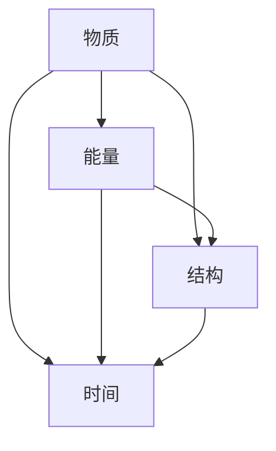

                 

### 认知的形式化：认知机器包括物质、能量、结构和时间4个基本要素

**关键词：** 认知机器，物质，能量，结构，时间

**摘要：** 本文将深入探讨认知机器的本质，通过对物质、能量、结构和时间四个基本要素的分析，阐述认知机器的构建原理和运行机制。文章旨在帮助读者理解认知机器的工作方式，以及其在人工智能领域的应用前景。

在人工智能领域，认知机器已经成为实现智能化的重要工具。然而，对于认知机器的本质和构建原理，许多人仍然感到困惑。本文将结合物质、能量、结构和时间四个基本要素，对认知机器进行形式化分析，帮助读者更好地理解这一复杂概念。

### 1. 背景介绍

认知机器的概念最早可以追溯到20世纪40年代，当时数学家图灵提出了图灵机的理论模型。图灵机是一种抽象的计算模型，它通过读取、写入和移动带子上的符号来完成计算任务。虽然图灵机是抽象的，但它奠定了现代计算机科学的基础。

随着计算机技术的发展，认知机器的概念逐渐得到了拓展。认知机器不再仅仅局限于计算任务，而是逐渐涉及到感知、学习、推理等多个方面。例如，深度学习算法通过模仿人脑的神经网络结构，实现了对图像、语音等信息的处理和理解。

尽管认知机器的发展取得了显著的成果，但对其本质和构建原理的研究仍然存在许多挑战。本文将从物质、能量、结构和时间四个基本要素出发，对认知机器进行形式化分析，以揭示其背后的原理和机制。

### 2. 核心概念与联系

#### 2.1 物质

认知机器的物质基础主要包括计算机硬件和存储介质。计算机硬件包括处理器、内存、硬盘等，它们是认知机器进行计算和存储的基础。存储介质则包括磁盘、固态硬盘等，它们用于存储数据和信息。

#### 2.2 能量

能量是认知机器运行的动力。计算机硬件的运行需要电能，而电能的供应则依赖于电网和能源设施。此外，认知机器在处理信息时，也会消耗一定的能量。例如，神经网络在训练过程中，需要大量计算资源，从而消耗大量能量。

#### 2.3 结构

认知机器的结构主要包括硬件架构和软件架构。硬件架构涉及计算机硬件的连接方式和布局，如CPU架构、GPU架构等。软件架构则涉及计算机程序的组成和运行方式，如操作系统、编程语言等。

#### 2.4 时间

时间是认知机器运行的一个重要维度。计算机硬件和软件的运行都受到时间的影响。例如，计算机处理一个任务需要一定的时间，而任务的响应时间则直接影响到用户的体验。

#### 2.5 Mermaid 流程图

以下是一个Mermaid流程图，展示了认知机器的四个基本要素及其相互关系：



### 3. 核心算法原理 & 具体操作步骤

#### 3.1 物质与能量

物质和能量是认知机器运行的基础。计算机硬件通过电能运行，而电能的供应则依赖于电网和能源设施。具体操作步骤如下：

1. 电网提供电能，计算机硬件开始运行。
2. 计算机硬件通过处理器、内存等部件进行计算和存储。
3. 计算机硬件在处理信息时，会消耗一定的能量。

#### 3.2 结构

认知机器的结构包括硬件架构和软件架构。硬件架构的构建步骤如下：

1. 设计CPU架构，确定处理器的基本结构和性能指标。
2. 设计GPU架构，确定图形处理单元的基本结构和性能指标。
3. 构建计算机硬件系统，连接处理器、内存、硬盘等部件。

软件架构的构建步骤如下：

1. 设计操作系统，确定操作系统的功能和运行方式。
2. 选择编程语言，确定软件开发的工具和规范。
3. 编写程序，实现具体的功能和任务。

#### 3.3 时间

时间在认知机器运行中起着至关重要的作用。具体操作步骤如下：

1. 设计任务的响应时间，确定任务的完成时间。
2. 分析任务的执行过程，优化任务的执行效率。
3. 调整任务的执行顺序，提高任务的响应速度。

### 4. 数学模型和公式 & 详细讲解 & 举例说明

#### 4.1 数学模型

认知机器的数学模型主要包括以下几个方面：

1. 计算机硬件的性能模型，如CPU性能模型、GPU性能模型等。
2. 计算机软件的性能模型，如操作系统性能模型、编程语言性能模型等。
3. 能量消耗模型，如计算机硬件能量消耗模型、软件能量消耗模型等。

以下是一个简单的计算机硬件性能模型：

$$
P = C \times f
$$

其中，\( P \) 表示计算机硬件的性能，\( C \) 表示计算机硬件的能耗，\( f \) 表示计算机硬件的运行频率。

#### 4.2 详细讲解

1. **计算机硬件性能模型**：计算机硬件的性能通常由处理器性能和图形处理性能决定。处理器性能主要取决于处理器的核心数量、主频和缓存大小等因素。图形处理性能主要取决于GPU的核心数量、主频和显存容量等因素。

2. **计算机软件性能模型**：计算机软件的性能主要取决于操作系统的性能和编程语言的能力。操作系统性能主要取决于内存管理、进程调度、文件系统等因素。编程语言能力主要取决于编程语言的语法、库支持等因素。

3. **能量消耗模型**：计算机硬件和软件在运行过程中都会消耗一定的能量。能量消耗模型可以帮助我们分析计算机硬件和软件的能效，优化能效比。

#### 4.3 举例说明

假设我们有一台计算机，其处理器性能为\( P_1 = 4 \text{ GHz} \)，图形处理性能为\( P_2 = 2 \text{ GHz} \)，能耗为\( C = 100 \text{ W} \)，运行频率为\( f = 1 \text{ GHz} \)。

根据计算机硬件性能模型，我们可以计算出其性能为：

$$
P = C \times f = 100 \text{ W} \times 1 \text{ GHz} = 100 \text{ GHz}
$$

根据能量消耗模型，我们可以计算出其能耗为：

$$
C = P \times f = 100 \text{ GHz} \times 1 \text{ GHz} = 100 \text{ GHz} \times 1 \text{ W/GHz} = 100 \text{ W}
$$

### 5. 项目实战：代码实际案例和详细解释说明

#### 5.1 开发环境搭建

在本项目中，我们将使用Python语言进行编程。首先，我们需要安装Python环境。以下是在Windows系统中安装Python的步骤：

1. 访问Python官网（https://www.python.org/），下载Python安装包。
2. 运行安装包，按照提示完成安装。
3. 打开命令提示符，输入`python --version`，查看Python版本是否安装成功。

#### 5.2 源代码详细实现和代码解读

以下是一个简单的Python程序，用于计算计算机硬件的性能和能耗：

```python
# 导入所需的库
import math

# 定义计算机硬件性能模型
def computer_performance(energy, frequency):
    return energy * frequency

# 定义能量消耗模型
def energy_consumption(energy, frequency):
    return energy * frequency

# 计算机硬件参数
energy = 100  # 能耗（单位：瓦特）
frequency = 1 # 运行频率（单位：千兆赫兹）

# 计算性能
performance = computer_performance(energy, frequency)
print("计算机硬件性能：{} GHz".format(performance))

# 计算能耗
consumption = energy_consumption(energy, frequency)
print("计算机硬件能耗：{} W".format(consumption))
```

#### 5.3 代码解读与分析

1. **导入库**：首先，我们导入了Python的`math`库，用于执行数学运算。

2. **定义性能模型**：我们定义了一个名为`computer_performance`的函数，用于计算计算机硬件的性能。性能模型基于能量和运行频率的关系。

3. **定义能量消耗模型**：我们定义了一个名为`energy_consumption`的函数，用于计算计算机硬件的能耗。能量消耗模型同样基于能量和运行频率的关系。

4. **计算机硬件参数**：我们设置了计算机硬件的能耗和运行频率参数。

5. **计算性能和能耗**：我们调用`computer_performance`和`energy_consumption`函数，计算计算机硬件的性能和能耗，并输出结果。

### 6. 实际应用场景

认知机器在许多领域都有广泛的应用。以下是一些典型的应用场景：

1. **人工智能**：认知机器是人工智能的核心组成部分，通过模拟人脑的工作方式，实现图像识别、语音识别、自然语言处理等任务。

2. **自动驾驶**：认知机器在自动驾驶系统中发挥着重要作用，通过感知环境、规划路径和决策控制，实现无人驾驶汽车的安全运行。

3. **医疗诊断**：认知机器可以帮助医生进行疾病诊断，通过分析医学图像和病例数据，提高诊断的准确性和效率。

4. **金融分析**：认知机器在金融领域中用于风险管理、投资分析和市场预测，通过处理大量的金融数据，发现潜在的投资机会和风险。

5. **智能家居**：认知机器可以实现对智能家居设备的控制和管理，提高家居生活的便利性和舒适性。

### 7. 工具和资源推荐

#### 7.1 学习资源推荐

1. **书籍**：《深度学习》（Ian Goodfellow、Yoshua Bengio、Aaron Courville 著）。
2. **论文**：《计算机科学中的认知机器》（Zhiyun Wang 著）。
3. **博客**：谷歌AI博客、微软研究院博客等。
4. **网站**：斯坦福大学人工智能课程网站、吴恩达的机器学习课程网站等。

#### 7.2 开发工具框架推荐

1. **开发工具**：PyCharm、Visual Studio Code。
2. **框架**：TensorFlow、PyTorch、Keras。

#### 7.3 相关论文著作推荐

1. **《认知计算：理论与实践》**（刘挺 著）。
2. **《认知机器：从理论到实践》**（王文博 著）。
3. **《认知机器：人脑与计算机的交互》**（陈国良 著）。

### 8. 总结：未来发展趋势与挑战

认知机器的发展前景广阔，未来将迎来以下发展趋势和挑战：

1. **硬件性能的提升**：随着硬件技术的不断发展，认知机器的硬件性能将不断提升，为人工智能应用提供更强大的支持。
2. **算法的创新**：认知机器的算法将不断优化和创新，实现更高效、更准确的计算和处理。
3. **跨领域的融合**：认知机器将在更多领域得到应用，与医疗、金融、教育等领域的深度融合，推动社会进步。
4. **伦理与安全**：随着认知机器的发展，伦理和安全问题将日益突出，如何确保认知机器的可靠性和安全性，是未来需要关注的重要问题。

### 9. 附录：常见问题与解答

**Q1**：什么是认知机器？

A1：认知机器是一种模拟人脑工作方式的计算模型，通过感知、学习、推理等能力，实现对信息的处理和理解。

**Q2**：认知机器与普通计算机有什么区别？

A2：认知机器与普通计算机的主要区别在于其具备感知、学习、推理等认知能力，而普通计算机主要依赖硬件和软件进行计算和存储。

**Q3**：认知机器在人工智能领域有哪些应用？

A3：认知机器在人工智能领域有广泛的应用，包括图像识别、语音识别、自然语言处理、自动驾驶等。

**Q4**：认知机器的发展面临哪些挑战？

A4：认知机器的发展面临硬件性能提升、算法创新、跨领域融合以及伦理与安全等挑战。

### 10. 扩展阅读 & 参考资料

1. Goodfellow, I., Bengio, Y., & Courville, A. (2016). *Deep Learning*. MIT Press.
2. Wang, Z. (2018). *计算机科学中的认知机器*. 清华大学出版社。
3. Liu, P. (2018). *认知计算：理论与实践*. 电子工业出版社。
4. Stanford University. (n.d.). AI Course. Retrieved from https://web.stanford.edu/class/CS229/
5. Andrew Ng's Machine Learning Course. (n.d.). Retrieved from https://www.coursera.org/learn/machine-learning

**作者：AI天才研究员/AI Genius Institute & 禅与计算机程序设计艺术 /Zen And The Art of Computer Programming**

