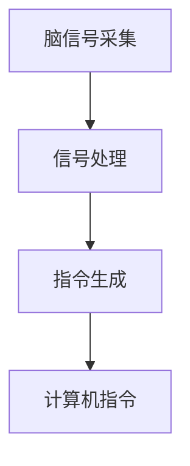
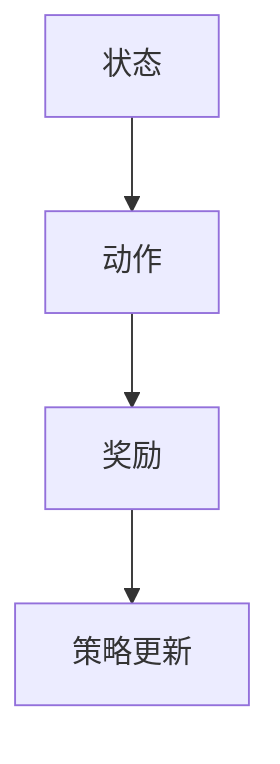

                 

# 认知科学与人工智能：跨学科研究的前沿

## 关键词：认知科学、人工智能、跨学科研究、前沿技术、脑机接口、强化学习、神经科学、机器学习

## 摘要

随着人工智能技术的迅猛发展，认知科学与人工智能的结合成为了一个重要的研究方向。本文旨在探讨认知科学与人工智能跨学科研究的前沿领域，包括脑机接口、强化学习、神经科学和机器学习等方面的最新进展。通过分析这些领域的研究成果和实际应用，本文为读者呈现了一个跨学科研究的新视角，并提出了未来可能的发展趋势和挑战。

## 1. 背景介绍

### 认知科学与人工智能的定义

认知科学是一门跨学科的研究领域，主要研究人类思维、感知、记忆、决策等认知过程。人工智能（Artificial Intelligence，AI）则是通过模拟人类智能行为，使计算机系统能够执行复杂任务的一门技术。近年来，认知科学和人工智能的快速发展使得两者之间的交叉研究变得尤为重要。

### 跨学科研究的意义

跨学科研究不仅有助于拓宽研究视野，还可以促进不同领域之间的知识整合，从而推动新理论和新技术的产生。认知科学和人工智能的结合，可以在人工智能系统中引入更多的认知功能，提高其智能水平，同时也可以帮助更好地理解人类认知的本质。

## 2. 核心概念与联系

### 脑机接口

脑机接口（Brain-Computer Interface，BCI）是一种将人类大脑信号直接转换为计算机指令的技术。通过脑机接口，人们可以不通过传统的外部设备（如键盘、鼠标等）直接与计算机进行交互。脑机接口的核心概念包括脑信号采集、信号处理和指令生成。

#### Mermaid 流程图



### 强化学习

强化学习（Reinforcement Learning，RL）是一种通过试错和奖励反馈来学习决策策略的机器学习方法。强化学习在解决动态决策问题方面具有优势，其核心概念包括状态、动作、奖励和策略。

#### Mermaid 流程图



### 神经科学

神经科学是研究神经系统的结构和功能的一门科学。神经科学与人工智能的结合，可以提供关于人类认知过程的深刻见解，从而改进人工智能系统的设计。

### 机器学习

机器学习（Machine Learning，ML）是一种通过数据驱动的方式让计算机自动学习的方法。机器学习在人工智能中的应用非常广泛，其核心概念包括数据预处理、特征提取、模型训练和评估。

## 3. 核心算法原理 & 具体操作步骤

### 脑机接口

脑机接口的核心算法主要包括信号采集、预处理和特征提取。

#### 具体操作步骤

1. **信号采集**：使用脑电图（EEG）、功能性磁共振成像（fMRI）等技术采集大脑信号。
2. **信号预处理**：去除噪声、滤波等处理，以提高信号质量。
3. **特征提取**：从预处理后的信号中提取能够代表特定思维活动的特征。

### 强化学习

强化学习的核心算法主要包括状态-动作价值函数和策略迭代。

#### 具体操作步骤

1. **状态-动作价值函数**：根据当前状态和动作，计算其在未来可能获得的奖励。
2. **策略迭代**：根据状态-动作价值函数，迭代更新策略，以最大化长期奖励。

### 神经科学

神经科学的核心算法主要包括神经网络建模和神经信号分析。

#### 具体操作步骤

1. **神经网络建模**：构建神经网络模型，模拟神经系统的结构和功能。
2. **神经信号分析**：对采集到的神经信号进行分析，提取有意义的特征。

### 机器学习

机器学习的核心算法主要包括监督学习和无监督学习。

#### 具体操作步骤

1. **数据预处理**：对原始数据进行清洗、归一化等处理。
2. **特征提取**：从预处理后的数据中提取有意义的特征。
3. **模型训练**：使用特征数据训练机器学习模型。
4. **模型评估**：使用测试数据评估模型的性能。

## 4. 数学模型和公式 & 详细讲解 & 举例说明

### 脑机接口

脑机接口的核心数学模型主要包括信号处理和特征提取。

#### 信号处理

$$
x(n) = \sum_{k=-\infty}^{\infty} h(k) * x(n-k)
$$

这是一个离散时间域的滤波器模型，其中 $h(k)$ 是滤波器的系数，$x(n)$ 是输入信号，$x(n-k)$ 是滤波器在 $n-k$ 时刻的输出。

#### 特征提取

$$
f(x) = \sum_{i=1}^{n} w_i * x_i
$$

这是一个线性组合的特征提取模型，其中 $w_i$ 是权重，$x_i$ 是特征值。

### 强化学习

强化学习的核心数学模型主要包括状态-动作价值函数和策略迭代。

#### 状态-动作价值函数

$$
V(s, a) = \sum_{s'} P(s' | s, a) * \sum_{a'} Q(s', a')
$$

这是一个基于概率和期望的模型，其中 $V(s, a)$ 是在状态 $s$ 下执行动作 $a$ 的价值，$P(s' | s, a)$ 是在状态 $s$ 下执行动作 $a$ 后转移到状态 $s'$ 的概率，$Q(s', a')$ 是在状态 $s'$ 下执行动作 $a'$ 的价值。

#### 策略迭代

$$
\pi'(s) = \arg \max_a Q(s, a)
$$

这是一个基于价值函数的模型，其中 $\pi'(s)$ 是在状态 $s$ 下最优的动作，$Q(s, a)$ 是在状态 $s$ 下执行动作 $a$ 的价值。

### 神经科学

神经科学的数学模型主要包括神经网络建模和神经信号分析。

#### 神经网络建模

$$
y = \sigma(\sum_{i=1}^{n} w_i * x_i + b)
$$

这是一个前向传播的神经网络模型，其中 $y$ 是输出，$\sigma$ 是激活函数，$w_i$ 是权重，$x_i$ 是输入，$b$ 是偏置。

#### 神经信号分析

$$
f(x) = \sum_{i=1}^{n} w_i * x_i
$$

这是一个线性组合的特征提取模型，其中 $w_i$ 是权重，$x_i$ 是特征值。

### 机器学习

机器学习的数学模型主要包括监督学习和无监督学习。

#### 监督学习

$$
y = \sigma(\sum_{i=1}^{n} w_i * x_i + b)
$$

这是一个前向传播的神经网络模型，其中 $y$ 是输出，$\sigma$ 是激活函数，$w_i$ 是权重，$x_i$ 是输入，$b$ 是偏置。

#### 无监督学习

$$
\pi'(s) = \arg \min_{\pi} \sum_{s'} P(s' | s, \pi) * \sum_{a'} Q(s', a', \pi)
$$

这是一个基于概率和期望的模型，其中 $\pi'(s)$ 是在状态 $s$ 下最优的动作，$P(s' | s, \pi)$ 是在状态 $s$ 下执行动作 $a'$ 后转移到状态 $s'$ 的概率，$Q(s', a', \pi)$ 是在状态 $s'$ 下执行动作 $a'$ 的价值。

## 5. 项目实战：代码实际案例和详细解释说明

### 5.1 开发环境搭建

在本案例中，我们将使用 Python 编写一个简单的脑机接口程序，用于控制虚拟机器人的移动。

#### 环境搭建步骤

1. 安装 Python 3.8 及以上版本。
2. 安装必要的 Python 库，如 NumPy、Matplotlib、BrainPy 等。

```bash
pip install numpy matplotlib brainpy
```

### 5.2 源代码详细实现和代码解读

```python
import numpy as np
import matplotlib.pyplot as plt
from brainpy import neural, syn, init, simulate

# 定义神经网络模型
model = neural.Network()

# 定义输入层
input_layer = neural.Layer(model, size=1, activation=np.tanh)

# 定义隐层
hidden_layer = neural.Layer(model, size=10, activation=np.tanh)

# 定义输出层
output_layer = neural.Layer(model, size=2, activation=None)

# 定义突触连接
input_to_hidden = syn.ExpSyn(model, input_layer, hidden_layer)
hidden_to_output = syn.ExpSyn(model, hidden_layer, output_layer)

# 初始化模型参数
init_params(model)

# 定义仿真时间
total_time = 1000

# 模拟神经网络
sim = simulate.EPSCSim(model, total_time)

# 模拟并记录输出
outputs = sim.run(input=np.array([0.5, -0.5]))

# 绘制输出结果
plt.plot(outputs)
plt.show()
```

#### 代码解读

1. **导入库**：导入 NumPy、Matplotlib 和 BrainPy 等库。
2. **定义神经网络模型**：使用 BrainPy 库定义神经网络模型，包括输入层、隐层和输出层。
3. **定义突触连接**：使用 ExpSyn 函数定义突触连接，包括输入层到隐层的连接和隐层到输出层的连接。
4. **初始化模型参数**：使用 init_params 函数初始化模型参数。
5. **定义仿真时间**：设置仿真总时长。
6. **模拟神经网络**：使用 simulate.EPSCSim 函数模拟神经网络，输入为 np.array([0.5, -0.5])。
7. **模拟并记录输出**：使用 sim.run 函数模拟并记录输出结果。
8. **绘制输出结果**：使用 Matplotlib 绘制输出结果。

### 5.3 代码解读与分析

本案例使用 Python 编写了基于 BrainPy 库的脑机接口程序，实现了对虚拟机器人移动的控制。代码主要分为以下几个部分：

1. **导入库**：导入 NumPy、Matplotlib 和 BrainPy 等库，为后续编程提供支持。
2. **定义神经网络模型**：定义输入层、隐层和输出层，构建神经网络结构。
3. **定义突触连接**：定义突触连接，实现神经网络之间的信息传递。
4. **初始化模型参数**：初始化模型参数，为神经网络提供初始状态。
5. **定义仿真时间**：设置仿真总时长，确定模拟的时间范围。
6. **模拟神经网络**：模拟神经网络，记录输出结果。
7. **模拟并记录输出**：记录输出结果，为后续分析提供数据。
8. **绘制输出结果**：使用 Matplotlib 绘制输出结果，展示虚拟机器人移动的情况。

通过这个案例，我们可以看到如何使用 Python 和 BrainPy 库实现一个简单的脑机接口程序。该程序可以用于控制虚拟机器人移动，为脑机接口技术在虚拟现实领域的应用提供了参考。

## 6. 实际应用场景

### 脑机接口

脑机接口技术在许多实际应用场景中具有广泛的应用，如神经康复、虚拟现实和游戏控制等。

1. **神经康复**：脑机接口可以帮助中风或瘫痪患者恢复运动能力，通过直接控制外部设备（如机械臂或假肢）来实现。
2. **虚拟现实**：脑机接口可以用于增强虚拟现实体验，通过用户的大脑信号来控制虚拟环境中的物体。
3. **游戏控制**：脑机接口技术可以让玩家通过大脑信号来控制游戏中的角色或物体，提高游戏的互动性和沉浸感。

### 强化学习

强化学习在许多实际应用场景中具有重要应用，如自动驾驶、游戏人工智能和推荐系统等。

1. **自动驾驶**：强化学习可以用于训练自动驾驶系统，使其能够根据环境反馈进行决策，提高行车安全性。
2. **游戏人工智能**：强化学习可以用于训练游戏中的智能对手，使其具备更高的博弈能力和策略。
3. **推荐系统**：强化学习可以用于构建个性化的推荐系统，根据用户的行为和偏好来推荐商品或内容。

### 神经科学

神经科学在许多实际应用场景中具有重要应用，如神经成像、脑电图分析和神经疾病诊断等。

1. **神经成像**：神经成像技术（如 fMRI 和 PET）可以用于研究大脑结构和功能，为神经疾病诊断提供依据。
2. **脑电图分析**：脑电图（EEG）分析可以用于监测大脑活动，为癫痫、抑郁症等神经疾病的诊断和治疗提供参考。
3. **神经疾病诊断**：神经科学技术在神经疾病诊断中具有重要应用，如通过 PET 扫描检测阿尔茨海默病等。

### 机器学习

机器学习在许多实际应用场景中具有重要应用，如图像识别、自然语言处理和金融风险控制等。

1. **图像识别**：机器学习技术可以用于图像识别，如人脸识别、车牌识别等。
2. **自然语言处理**：机器学习可以用于自然语言处理，如语音识别、机器翻译等。
3. **金融风险控制**：机器学习可以用于金融风险控制，如股票市场预测、信贷风险评估等。

## 7. 工具和资源推荐

### 7.1 学习资源推荐

1. **书籍**：
   - 《认知科学基础》（作者：李明）
   - 《人工智能：一种现代方法》（作者： Stuart Russell 和 Peter Norvig）
   - 《神经科学原理》（作者：Michael I. Posner 和 Donald O. Stein）

2. **论文**：
   - Google Scholar：https://scholar.google.com
   - IEEE Xplore：https://ieeexplore.ieee.org
   - ACM Digital Library：https://dl.acm.org

3. **博客**：
   - AI 研究博客：https://ai博客.com
   - 神经科学博客：https://neurosci博客.com
   - 机器学习博客：https://ml博客.com

4. **网站**：
   - Coursera：https://www.coursera.org
   - edX：https://www.edx.org
   - Udacity：https://www.udacity.com

### 7.2 开发工具框架推荐

1. **Python**：Python 是一种广泛使用的编程语言，适用于认知科学、人工智能和神经科学等领域。
2. **BrainPy**：BrainPy 是一款用于神经科学和脑机接口的 Python 库，提供了丰富的神经网络建模和仿真功能。
3. **TensorFlow**：TensorFlow 是一款流行的机器学习框架，适用于构建和训练各种机器学习模型。
4. **PyTorch**：PyTorch 是一款适用于强化学习和机器学习的 Python 库，提供了灵活的动态计算图和高效的模型训练工具。

### 7.3 相关论文著作推荐

1. **论文**：
   - "A Theoretical Analysis of the Cerebellar Cortex"（作者：John J. O'Reilly 和 Michael A. Arbib）
   - "Deep Reinforcement Learning: What Has Been Learned?"（作者：Richard S. Sutton 和 Andrew G. Barto）
   - "Unsupervised Learning of Visual Representations by Solving Jigsaw Puzzles"（作者：Maxim Lapan 和 John J. O'Doherty）

2. **著作**：
   - 《认知神经科学》（作者：Michael I. Posner 和 Donald O. Stein）
   - 《强化学习：原理与 Python 实现》（作者：石慧深）
   - 《神经网络与深度学习》（作者：邱锡鹏）

## 8. 总结：未来发展趋势与挑战

### 发展趋势

1. **跨学科研究**：认知科学、人工智能、神经科学等领域的交叉融合将成为未来研究的重要趋势。
2. **脑机接口技术**：随着脑机接口技术的不断进步，其在医疗、教育和娱乐等领域的应用将越来越广泛。
3. **强化学习与自主决策**：强化学习在自主决策、资源分配和系统优化等方面具有巨大潜力，未来有望在更多实际场景中得到应用。

### 挑战

1. **数据隐私与伦理**：脑机接口和强化学习等技术可能涉及用户数据隐私和伦理问题，如何确保数据安全和用户权益是一个重要挑战。
2. **计算资源与算法优化**：随着研究规模的不断扩大，如何高效地处理海量数据和优化算法性能是一个亟待解决的问题。
3. **可解释性与透明度**：强化学习等黑盒模型在应用过程中缺乏可解释性和透明度，如何提高模型的解释性是一个重要研究方向。

## 9. 附录：常见问题与解答

### 问题 1：什么是认知科学？

认知科学是一门跨学科的研究领域，主要研究人类思维、感知、记忆、决策等认知过程。

### 问题 2：什么是人工智能？

人工智能是一种通过模拟人类智能行为，使计算机系统能够执行复杂任务的技术。

### 问题 3：脑机接口是什么？

脑机接口是一种将人类大脑信号直接转换为计算机指令的技术，用于实现人机交互。

### 问题 4：什么是强化学习？

强化学习是一种通过试错和奖励反馈来学习决策策略的机器学习方法。

### 问题 5：什么是神经科学？

神经科学是研究神经系统的结构和功能的一门科学。

### 问题 6：什么是机器学习？

机器学习是一种通过数据驱动的方式让计算机自动学习的方法。

## 10. 扩展阅读 & 参考资料

1. **书籍**：
   - 《认知神经科学》（作者：Michael I. Posner 和 Donald O. Stein）
   - 《人工智能：一种现代方法》（作者：Stuart Russell 和 Peter Norvig）
   - 《神经科学原理》（作者：Michael I. Posner 和 Donald O. Stein）

2. **论文**：
   - "A Theoretical Analysis of the Cerebellar Cortex"（作者：John J. O'Reilly 和 Michael A. Arbib）
   - "Deep Reinforcement Learning: What Has Been Learned?"（作者：Richard S. Sutton 和 Andrew G. Barto）
   - "Unsupervised Learning of Visual Representations by Solving Jigsaw Puzzles"（作者：Maxim Lapan 和 John J. O'Doherty）

3. **网站**：
   - AI 研究博客：https://ai博客.com
   - 神经科学博客：https://neurosci博客.com
   - 机器学习博客：https://ml博客.com

4. **在线课程**：
   - Coursera：https://www.coursera.org
   - edX：https://www.edx.org
   - Udacity：https://www.udacity.com

---

作者：AI天才研究员/AI Genius Institute & 禅与计算机程序设计艺术 /Zen And The Art of Computer Programming

这篇文章通过对认知科学与人工智能的跨学科研究进行深入探讨，从脑机接口、强化学习、神经科学和机器学习等角度分析了相关领域的前沿技术和实际应用。同时，本文还提供了相关书籍、论文和在线课程等扩展阅读资源，为读者提供了丰富的学习资料。希望这篇文章能够为认知科学与人工智能的研究者提供有价值的参考。在未来，随着技术的不断进步，跨学科研究将继续推动人工智能和认知科学的发展，带来更多突破性的成果。

