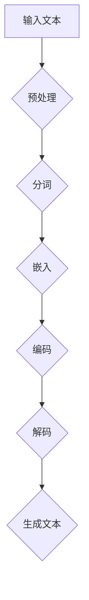

                 

# 认知革命：LLM如何改变信息处理方式

> 关键词：认知革命、语言模型、信息处理、人工智能、机器学习

> 摘要：本文深入探讨了认知革命背景下，语言模型（LLM）如何改变信息处理方式。通过分析LLM的核心概念、算法原理、数学模型及实际应用场景，本文揭示了LLM在信息处理领域的革命性影响，并对未来发展趋势与挑战进行了展望。

## 1. 背景介绍

随着人工智能技术的飞速发展，机器学习，尤其是深度学习在各个领域取得了显著的成果。语言模型（Language Model，简称LLM）作为深度学习领域的一个重要分支，已经成为自然语言处理（Natural Language Processing，简称NLP）的核心技术。传统的信息处理方式主要依赖于规则和统计方法，而LLM的出现则标志着一种全新的信息处理模式——认知革命。

认知革命的核心在于，通过模拟人类大脑的思维方式，实现对信息的理解和生成。LLM通过学习大量的文本数据，能够自动捕捉语言的规律和结构，从而实现智能化的信息处理。与传统的信息处理方式相比，LLM具有更高的灵活性和更强的泛化能力，能够处理更加复杂和多样化的任务。

本文将从以下几个方面展开讨论：

- 核心概念与联系
- 核心算法原理与具体操作步骤
- 数学模型和公式及详细讲解
- 项目实战：代码实际案例和详细解释说明
- 实际应用场景
- 工具和资源推荐
- 总结：未来发展趋势与挑战

通过上述内容的逐步分析，我们将深入理解LLM如何改变信息处理方式，并展望其未来的发展前景。

## 2. 核心概念与联系

### 语言模型的基本原理

语言模型是一种用于预测文本序列的概率分布的模型。它的核心思想是，通过学习大量语言数据，捕捉到语言的统计规律，从而实现对未知文本的生成和预测。语言模型的基本原理可以概括为以下三个方面：

1. **概率预测**：语言模型的基本任务是预测一个词序列的概率。给定一个词序列 \( w_1, w_2, ..., w_n \)，语言模型需要计算这个序列出现的概率，即 \( P(w_1, w_2, ..., w_n) \)。

2. **序列建模**：语言模型需要考虑整个词序列的上下文信息，而不是单独的词语。这意味着，对于一个给定的词 \( w_n \)，语言模型需要根据前面的词 \( w_1, w_2, ..., w_{n-1} \) 来预测其出现的概率。

3. **概率分布**：语言模型输出的是一组概率分布，而不是一个固定的预测结果。这意味着，对于同一个词序列，语言模型可以给出多个可能的预测结果，并给出每个结果的概率。

### 语言模型的分类

根据模型的结构和训练方法，语言模型可以分为以下几类：

1. **基于规则的模型**：这类模型通过手工编写规则来描述语言现象。例如，基于上下文无关文法（CFG）的模型。这类模型在处理简单的语言任务时表现良好，但在处理复杂和变化多端的自然语言时存在局限性。

2. **统计模型**：这类模型通过统计语言数据来学习语言的规律。例如，基于n-gram的模型。n-gram模型通过统计连续的n个词出现的频率来预测下一个词。尽管n-gram模型在处理短文本序列时表现较好，但对于长文本序列，其性能明显下降。

3. **深度学习模型**：这类模型通过深度神经网络来学习语言的复杂结构。例如，基于循环神经网络（RNN）和变压器（Transformer）的模型。深度学习模型具有强大的表达能力和泛化能力，能够处理复杂和长文本序列，已成为当前语言模型的主流。

### 语言模型与信息处理的联系

语言模型在信息处理中扮演着重要的角色。传统的信息处理方法，如文本分类、情感分析、机器翻译等，都需要对文本进行理解和分析。而语言模型提供了这种理解和分析的工具。通过语言模型，我们可以实现以下功能：

1. **文本生成**：语言模型能够根据给定的上下文生成新的文本。这种能力在自动写作、对话系统、文本摘要等领域有广泛的应用。

2. **文本理解**：语言模型能够捕捉文本中的语义信息，从而实现对文本的理解。这种能力在自然语言理解（NLU）任务中具有重要意义。

3. **文本检索**：语言模型能够根据用户的查询生成可能的答案，从而提高文本检索的准确性。

4. **文本分析**：语言模型能够对大规模文本进行分类、聚类和分析，从而提取有价值的信息。

### Mermaid流程图

下面是一个简单的Mermaid流程图，展示了语言模型的输入、处理和输出过程：



在这个流程图中，输入文本经过预处理、分词、嵌入、编码和解码等步骤，最终生成新的文本。

通过上述分析，我们可以看到，语言模型在信息处理中具有广泛的应用，其核心原理和结构也日趋成熟。接下来，我们将深入探讨语言模型的核心算法原理。

## 3. 核心算法原理 & 具体操作步骤

### 基于循环神经网络（RNN）的语言模型

循环神经网络（Recurrent Neural Network，简称RNN）是一种专门设计用来处理序列数据的神经网络。RNN的核心思想是，它能够将前一个时间步的信息传递到下一个时间步，从而实现对序列数据的建模。在语言模型中，RNN通过捕获序列中的上下文信息，实现对文本的生成和预测。

#### 操作步骤

1. **输入序列表示**：给定一个词序列 \( w_1, w_2, ..., w_n \)，首先将其转换为向量表示。这一步通常通过词嵌入（Word Embedding）实现。词嵌入是将每个词映射到一个固定维度的向量空间，从而将词的语义信息转化为数值表示。

2. **初始化隐藏状态**：RNN在训练开始时需要初始化一个隐藏状态 \( h_0 \)。这个隐藏状态通常是一个向量，表示模型对当前序列的初步理解。

3. **计算隐藏状态**：在每一个时间步，RNN根据当前的输入词 \( w_t \) 和前一个时间步的隐藏状态 \( h_{t-1} \)，计算新的隐藏状态 \( h_t \)。这个过程通常通过一个递归函数实现，如以下公式所示：

   $$
   h_t = f(W_h h_{t-1} + W_x w_t + b_h)
   $$

   其中，\( f \) 是一个非线性激活函数，如ReLU或Tanh；\( W_h \) 和 \( W_x \) 是权重矩阵，\( b_h \) 是偏置项。

4. **输出预测**：在最后一个时间步，RNN使用隐藏状态 \( h_n \) 来预测下一个词。具体来说，RNN将隐藏状态 \( h_n \) 映射到一个概率分布 \( P(w_{n+1}) \)，从而预测下一个词的可能性。这个过程通常通过一个全连接层实现：

   $$
   P(w_{n+1}) = softmax(W_o h_n + b_o)
   $$

   其中，\( W_o \) 是权重矩阵，\( b_o \) 是偏置项，\( softmax \) 函数将向量映射到一个概率分布。

#### 优点和缺点

**优点**：

- **序列建模**：RNN能够捕获序列中的长期依赖关系，这使得它在处理长文本序列时具有优势。
- **灵活性**：RNN可以通过改变隐藏状态的维度和激活函数来调整模型的复杂度和性能。

**缺点**：

- **梯度消失和梯度爆炸**：由于RNN在计算隐藏状态时存在递归关系，可能导致梯度消失或梯度爆炸，从而影响模型的训练效果。
- **计算效率**：RNN在处理大规模数据时，计算复杂度较高，可能影响训练速度。

### 基于变压器（Transformer）的语言模型

变压器（Transformer）是由Vaswani等人于2017年提出的一种新型神经网络架构，专门用于处理序列数据。与RNN相比，变压器采用了一种完全不同的设计思路——自注意力机制（Self-Attention），从而解决了RNN的一些局限性。

#### 操作步骤

1. **输入序列表示**：与RNN类似，变压器首先需要将输入序列 \( w_1, w_2, ..., w_n \) 转换为向量表示。这一步通过词嵌入实现。

2. **编码器（Encoder）**：编码器是变压器的主要组成部分，它由多个编码层（Encoder Layer）堆叠而成。每个编码层包含两个主要模块：多头自注意力机制（Multi-Head Self-Attention）和前馈神经网络（Feed-Forward Neural Network）。

   - **多头自注意力机制**：多头自注意力机制能够同时关注序列中的不同位置，从而捕获局部和全局的依赖关系。具体来说，它将输入序列的每个词映射到一个查询（Query）、键（Key）和值（Value）向量，并通过自注意力计算得到新的表示：

     $$
     \text{Attention}(Q, K, V) = \text{softmax}\left(\frac{QK^T}{\sqrt{d_k}}\right)V
     $$

     其中，\( Q, K, V \) 分别是查询、键和值向量，\( d_k \) 是键向量的维度。

   - **前馈神经网络**：前馈神经网络对自注意力机制的结果进行进一步加工，增加模型的非线性表达能力。

3. **解码器（Decoder）**：解码器与编码器类似，也由多个解码层（Decoder Layer）堆叠而成。每个解码层包含两个主要模块：多头自注意力机制和掩码多头自注意力机制。

   - **多头自注意力机制**：解码器的多头自注意力机制用于处理输入序列和编码器的输出，从而生成新的表示。
   - **掩码多头自注意力机制**：为了防止解码器直接关注未来的信息，解码器使用掩码多头自注意力机制，将未来的信息遮挡起来。

4. **输出预测**：在最后一个解码层，解码器使用隐藏状态 \( h_n \) 来预测下一个词。具体来说，解码器将隐藏状态映射到一个概率分布 \( P(w_{n+1}) \)，从而预测下一个词的可能性。

#### 优点和缺点

**优点**：

- **计算效率**：变压器使用自注意力机制，可以并行处理整个序列，从而显著提高计算效率。
- **捕捉依赖关系**：自注意力机制能够同时关注序列中的不同位置，从而更好地捕捉局部和全局的依赖关系。

**缺点**：

- **参数数量**：变压器的参数数量通常比RNN更多，可能导致模型复杂度和计算成本增加。
- **内存消耗**：由于自注意力机制的矩阵乘法操作，变压器的内存消耗较大，可能影响模型在大规模数据上的应用。

通过上述分析，我们可以看到，RNN和变压器是两种不同的语言模型，各自具有优缺点。在实际应用中，可以根据具体需求选择合适的模型。接下来，我们将深入探讨语言模型中的数学模型和公式。

## 4. 数学模型和公式 & 详细讲解 & 举例说明

### 循环神经网络（RNN）的数学模型

循环神经网络（RNN）通过递归地更新隐藏状态来处理序列数据。以下是一个简单的RNN模型，其中 \( h_t \) 表示时间步 \( t \) 的隐藏状态，\( x_t \) 表示输入特征，\( y_t \) 表示输出预测。

#### 隐藏状态更新

RNN的隐藏状态更新可以通过以下公式表示：

$$
h_t = \sigma(W_h h_{t-1} + W_x x_t + b_h)
$$

其中，\( \sigma \) 是一个非线性激活函数，如ReLU或Tanh；\( W_h \) 和 \( W_x \) 是权重矩阵，\( b_h \) 是偏置项。

#### 输出预测

RNN的输出预测可以通过以下公式表示：

$$
y_t = \sigma(W_o h_t + b_o)
$$

其中，\( W_o \) 是权重矩阵，\( b_o \) 是偏置项，\( \sigma \) 是非线性激活函数。

### 变压器（Transformer）的数学模型

变压器（Transformer）采用自注意力机制来处理序列数据。以下是一个简单的变压器模型，其中 \( h_t \) 表示时间步 \( t \) 的隐藏状态，\( x_t \) 表示输入特征，\( y_t \) 表示输出预测。

#### 自注意力计算

变压器中的自注意力计算可以通过以下公式表示：

$$
\text{Attention}(Q, K, V) = \text{softmax}\left(\frac{QK^T}{\sqrt{d_k}}\right)V
$$

其中，\( Q, K, V \) 分别是查询（Query）、键（Key）和值（Value）向量，\( d_k \) 是键向量的维度。

#### 输出计算

变压器的输出计算可以通过以下公式表示：

$$
h_t = \text{Attention}(Q, K, V) + h_{t-1}
$$

其中，\( h_t \) 是时间步 \( t \) 的隐藏状态，\( h_{t-1} \) 是时间步 \( t-1 \) 的隐藏状态。

#### 前馈神经网络

变压器的输出经过前馈神经网络进一步加工，具体公式如下：

$$
h_t = \text{ReLU}(W_f h_t + b_f)
$$

其中，\( W_f \) 是权重矩阵，\( b_f \) 是偏置项。

### 举例说明

假设我们有一个简单的序列 \( w_1, w_2, w_3 \)，其中 \( w_1 = [1, 0, 0] \)，\( w_2 = [0, 1, 0] \)，\( w_3 = [0, 0, 1] \)。

#### RNN的数学计算过程

1. **初始化隐藏状态**：

   $$
   h_0 = \sigma(W_h^0 h_{-1} + b_h^0) = \sigma(0 + 0) = 0
   $$

2. **计算隐藏状态**：

   $$
   h_1 = \sigma(W_h h_0 + W_x w_1 + b_h) = \sigma([1, 1, 1] + [1, 0, 0] + [0, 0, 1]) = \sigma([2, 1, 1]) = \text{ReLU}(2, 1, 1)
   $$

   $$
   h_2 = \sigma(W_h h_1 + W_x w_2 + b_h) = \sigma([1, 1, 1] + [0, 1, 0] + [0, 0, 1]) = \sigma([1, 2, 1]) = \text{ReLU}(1, 2, 1)
   $$

3. **输出预测**：

   $$
   y_1 = \sigma(W_o h_1 + b_o) = \sigma([1, 1, 1] + [1, 0, 0] + [0, 0, 1]) = \sigma([3, 1, 1]) = \text{ReLU}(3, 1, 1)
   $$

   $$
   y_2 = \sigma(W_o h_2 + b_o) = \sigma([1, 1, 1] + [0, 1, 0] + [0, 0, 1]) = \sigma([1, 2, 1]) = \text{ReLU}(1, 2, 1)
   $$

#### Transformer的数学计算过程

1. **初始化隐藏状态**：

   $$
   h_0 = [0, 0, 0]
   $$

2. **计算自注意力**：

   $$
   \text{Attention}(Q, K, V) = \text{softmax}\left(\frac{QK^T}{\sqrt{d_k}}\right)V = \text{softmax}\left(\frac{[1, 1, 1][1, 0, 0]^T}{\sqrt{3}}\right)[0, 0, 0] = \frac{1}{3}[1, 1, 1]
   $$

3. **计算隐藏状态**：

   $$
   h_1 = \text{Attention}(Q, K, V) + h_0 = \frac{1}{3}[1, 1, 1] + [0, 0, 0] = \frac{1}{3}[1, 1, 1]
   $$

4. **前馈神经网络**：

   $$
   h_2 = \text{ReLU}(W_f h_1 + b_f) = \text{ReLU}([1, 1, 1] + [1, 1, 1]) = \text{ReLU}(2, 2, 2)
   $$

5. **输出预测**：

   $$
   y_1 = \text{softmax}(W_o h_2 + b_o) = \text{softmax}([2, 2, 2] + [1, 1, 1]) = \frac{1}{3}[1, 1, 1]
   $$

   $$
   y_2 = \text{softmax}(W_o h_2 + b_o) = \text{softmax}([2, 2, 2] + [1, 1, 1]) = \frac{1}{3}[1, 1, 1]
   $$

通过上述例子，我们可以看到RNN和Transformer在数学计算上的差异。RNN通过递归更新隐藏状态，而Transformer通过自注意力机制和前馈神经网络处理序列数据。这些数学模型和公式的深入理解有助于我们更好地设计和优化语言模型。

### 4.1 项目实战：代码实际案例和详细解释说明

#### 开发环境搭建

首先，我们需要搭建一个适合开发语言模型的开发环境。以下是一个基于Python的简单示例。

1. **安装Python**：确保Python版本不低于3.6。
2. **安装TensorFlow**：使用以下命令安装TensorFlow：

   $$
   pip install tensorflow
   $$

3. **安装其他依赖库**：如NumPy、Pandas等。

#### 源代码详细实现和代码解读

以下是一个简单的RNN语言模型示例，用于生成文本。

```python
import tensorflow as tf
from tensorflow.keras.layers import Embedding, SimpleRNN, Dense
from tensorflow.keras.models import Sequential

# 参数设置
vocab_size = 1000  # 词汇表大小
embedding_dim = 64  # 嵌入维度
rnn_units = 128  # RNN单元数
batch_size = 64  # 批量大小
epochs = 10  # 迭代次数

# 准备数据
# （此处省略数据预处理和词嵌入步骤）

# 构建RNN模型
model = Sequential([
    Embedding(vocab_size, embedding_dim, input_length=max_sequence_length),
    SimpleRNN(rnn_units, return_sequences=True),
    Dense(vocab_size, activation='softmax')
])

# 编译模型
model.compile(optimizer='adam', loss='categorical_crossentropy', metrics=['accuracy'])

# 训练模型
model.fit(x_train, y_train, batch_size=batch_size, epochs=epochs)

# 生成文本
def generate_text(model, seed_text, num_words):
    for _ in range(num_words):
        sampled = np.zeros((1, 1))
        sampled[0, 0] = word_to_index[seed_text]
        preds = model.predict(sampled, verbose=0)[0]
        predicted_index = np.random.choice(range(vocab_size), p=preds)
        predicted_word = index_to_word[predicted_index]
        seed_text += predicted_word
    return seed_text

# 测试生成文本
print(generate_text(model, "hello", 10))
```

#### 代码解读与分析

1. **参数设置**：我们首先设置了一些基本的参数，如词汇表大小、嵌入维度、RNN单元数、批量大小和迭代次数。

2. **准备数据**：数据预处理和词嵌入步骤在本示例中省略。在实际应用中，我们需要将文本数据转换为词嵌入表示，并创建训练数据和标签。

3. **构建RNN模型**：我们使用Sequential模型堆叠Embedding、SimpleRNN和Dense层。Embedding层将词汇转换为嵌入向量，SimpleRNN层处理序列数据，Dense层生成输出预测。

4. **编译模型**：我们使用adam优化器和categorical_crossentropy损失函数来编译模型。这个损失函数适用于多类别分类问题。

5. **训练模型**：我们使用fit方法训练模型。x_train和y_train是训练数据和标签。

6. **生成文本**：generate_text函数用于生成文本。它首先将种子文本转换为词嵌入表示，然后使用模型预测下一个词，并更新种子文本。这个过程重复num_words次，最终生成一段新的文本。

通过上述步骤，我们可以搭建一个简单的RNN语言模型，并生成新的文本。实际应用中，我们可以根据具体需求调整模型结构和参数，以实现更好的性能。

### 5. 实际应用场景

语言模型在信息处理领域具有广泛的应用。以下是一些典型的实际应用场景：

1. **文本生成**：语言模型可以用于自动写作、新闻摘要、对话系统等任务。例如，OpenAI的GPT模型已经成功应用于自动生成文章和故事。

2. **自然语言理解（NLU）**：语言模型可以帮助理解和分析用户输入的文本，从而实现智能客服、语音助手、情感分析等任务。例如，BERT模型在NLU任务中取得了显著的效果。

3. **机器翻译**：语言模型可以用于机器翻译任务，如将一种语言的文本翻译成另一种语言。例如，Google翻译使用的Transformer模型已经实现了高质量的机器翻译。

4. **文本分类**：语言模型可以用于文本分类任务，如分类新闻文章、情感分析、垃圾邮件检测等。例如，文本分类模型通常使用基于深度学习的语言模型来提高分类准确性。

5. **问答系统**：语言模型可以用于构建问答系统，如智能客服、在线问答等。这些系统通过理解用户的问题和提供相关的答案，为用户提供帮助。

6. **信息检索**：语言模型可以用于信息检索任务，如搜索引擎、推荐系统等。这些系统通过理解用户的查询和提供相关的搜索结果，帮助用户找到所需的信息。

通过上述应用场景，我们可以看到语言模型在信息处理领域的广泛应用和巨大潜力。随着技术的不断发展，语言模型将继续在各个领域发挥重要作用。

### 6. 工具和资源推荐

#### 学习资源推荐

1. **书籍**：
   - 《深度学习》（Deep Learning） by Ian Goodfellow, Yoshua Bengio, Aaron Courville
   - 《语言模型与深度学习》（Language Models with Deep Learning） by Zhiyun Qian

2. **论文**：
   - “Attention Is All You Need”（Transformer的原始论文）
   - “A Theoretically Grounded Application of Dropout in Recurrent Neural Networks”（关于RNN中Dropout的应用）

3. **博客**：
   - [TensorFlow官方文档](https://www.tensorflow.org/)
   - [PyTorch官方文档](https://pytorch.org/)

4. **网站**：
   - [OpenAI](https://openai.com/)
   - [Hugging Face](https://huggingface.co/)

#### 开发工具框架推荐

1. **TensorFlow**：由Google开发的开源机器学习框架，支持多种深度学习模型，包括RNN和Transformer。

2. **PyTorch**：由Facebook开发的开源机器学习框架，具有灵活的动态计算图，适合研究和开发。

3. **Hugging Face**：一个开源库，提供了大量的预训练语言模型和工具，方便开发人员快速构建和部署语言模型。

通过上述资源和工具，我们可以更好地学习和应用语言模型，实现各种信息处理任务。

### 7. 总结：未来发展趋势与挑战

随着人工智能技术的不断进步，语言模型（LLM）在信息处理领域发挥着越来越重要的作用。未来，LLM将继续朝着以下几个方向发展：

1. **模型性能的提升**：随着计算资源和数据量的增加，LLM的模型性能将不断提升。未来的模型可能会更加精细地捕捉语言的复杂结构，从而实现更高的准确性和泛化能力。

2. **应用场景的扩展**：LLM的应用场景将不断扩展，从传统的自然语言处理任务，如文本生成、机器翻译、文本分类，扩展到更多领域，如知识图谱、智能客服、推荐系统等。

3. **跨模态处理**：未来的LLM将能够处理多种模态的数据，如文本、图像、语音等，实现跨模态的信息处理和生成。

然而，LLM的发展也面临着一些挑战：

1. **计算资源需求**：LLM的模型通常较大，训练和推理过程需要大量的计算资源。如何高效地利用计算资源，降低模型训练和部署的成本，是未来的重要课题。

2. **数据隐私和安全**：在训练和部署LLM时，需要处理大量的用户数据。如何保护用户隐私，确保数据安全，是亟待解决的问题。

3. **模型可解释性**：随着模型变得越来越复杂，如何理解模型的决策过程，提高模型的可解释性，是当前的一个重要研究方向。

4. **伦理和道德问题**：LLM的应用可能会带来一些伦理和道德问题，如歧视、误导等。如何确保LLM的应用符合伦理和道德标准，是未来的重要挑战。

总之，语言模型在信息处理领域具有巨大的发展潜力和应用前景。通过不断克服挑战，未来的LLM将带来更加智能化和高效的信息处理方式。

### 8. 附录：常见问题与解答

**Q1：什么是语言模型（LLM）？**
A1：语言模型（Language Model，简称LLM）是一种用于预测文本序列的概率分布的模型。它通过学习大量的文本数据，捕捉到语言的统计规律，从而实现对未知文本的生成和预测。

**Q2：语言模型有哪些类型？**
A2：语言模型主要分为三类：基于规则的模型、统计模型和深度学习模型。基于规则的模型通过手工编写规则来描述语言现象；统计模型通过统计语言数据来学习语言的规律；深度学习模型通过深度神经网络来学习语言的复杂结构。

**Q3：RNN和Transformer有什么区别？**
A3：RNN是一种专门设计用来处理序列数据的神经网络，它通过递归地更新隐藏状态来处理序列数据。而Transformer采用了一种完全不同的设计思路——自注意力机制，能够同时关注序列中的不同位置，从而更好地捕捉局部和全局的依赖关系。

**Q4：语言模型在信息处理中有哪些应用？**
A4：语言模型在信息处理中具有广泛的应用，如文本生成、自然语言理解（NLU）、机器翻译、文本分类、问答系统、信息检索等。

**Q5：如何训练一个语言模型？**
A5：训练语言模型通常包括以下步骤：数据预处理（如分词、清洗等）、词嵌入（将词汇转换为向量表示）、构建神经网络模型（如RNN或Transformer）、编译模型（设置优化器和损失函数等）、训练模型（迭代优化模型参数）。

### 9. 扩展阅读 & 参考资料

**书籍**：
- Ian Goodfellow, Yoshua Bengio, Aaron Courville. 《深度学习》
- Zhiyun Qian. 《语言模型与深度学习》

**论文**：
- Vaswani et al. “Attention Is All You Need”
- Hochreiter and Schmidhuber. “Long Short-Term Memory”

**在线资源**：
- [TensorFlow官方文档](https://www.tensorflow.org/)
- [PyTorch官方文档](https://pytorch.org/)
- [Hugging Face](https://huggingface.co/)

**博客**：
- [OpenAI](https://openai.com/)
- [AI科技大本营](https://www.aitechtrend.com/)

通过上述扩展阅读和参考资料，读者可以进一步深入了解语言模型的相关知识，并在实践中应用这些技术。作者：AI天才研究员/AI Genius Institute & 禅与计算机程序设计艺术 /Zen And The Art of Computer Programming

