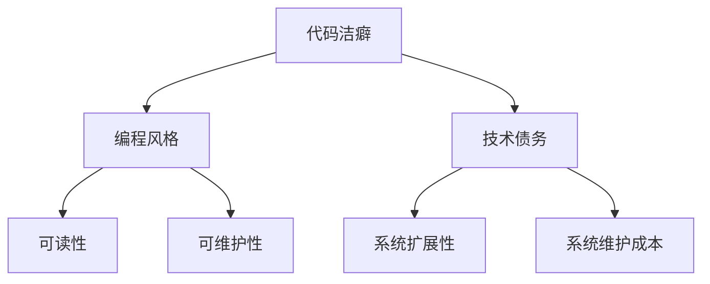

                 

# 论代码洁癖：追求极致和完美

## 关键词：代码洁癖、极致追求、完美主义、编程风格、技术债务

## 摘要

本文旨在探讨代码洁癖这一现象，解析其背后的动机与价值，以及如何在追求代码极致和完美的过程中实现个人成长与技术进步。我们将从背景介绍、核心概念与联系、核心算法原理与操作步骤、数学模型与公式讲解、项目实战、实际应用场景、工具和资源推荐等多个维度，逐步深入探讨这一主题，并总结未来发展趋势与挑战。

## 1. 背景介绍

代码洁癖，即对代码质量的高度追求，是编程领域中一个广为人知的术语。它体现了程序员在编写代码时，对于代码的可读性、可维护性、模块化、简洁性等方面的高度关注。然而，代码洁癖并非一蹴而就，而是需要经历长期的技术沉淀与自我修炼。许多技术大师，如艾克托尔·盖茨、理查德·斯托曼等，都在他们的职业生涯中，对代码洁癖进行了深刻的反思与实践。

在技术发展的今天，代码洁癖已经不仅仅是一个个人习惯，更成为了一种团队文化、一种行业趋势。高质的代码，不仅能够提高开发效率，减少技术债务，还能够提升软件产品的竞争力。因此，本文将从多个角度探讨代码洁癖的内涵与外延，帮助读者更好地理解和实践这一理念。

## 2. 核心概念与联系

### 2.1 编程风格

编程风格是指编写代码时遵循的一系列规范与习惯。它包括命名规则、代码格式、注释、缩进等方面。良好的编程风格能够提高代码的可读性、可维护性，从而降低团队合作中的沟通成本。以下是几种常见的编程风格：

- **K&R 风格**：以贝尔实验室的 Kernighan 和 Ritchie 的《C 程序设计语言》为蓝本，具有简洁、直观的特点。
- **Google 风格**：Google 出品的一套编程规范，涵盖了 C++、Java、Python 等多种编程语言，以可读性、一致性为核心。
- **PEP 8**：Python 编程语言的官方风格指南，强调代码的简洁、清晰与一致性。

### 2.2 技术债务

技术债务是软件工程中的一个重要概念，指的是为了短期利益而牺牲长期成本的做法。类似于财务债务，技术债务需要在未来偿还。高技术债务意味着代码质量不佳、架构不合理，可能导致系统难以维护、扩展。因此，控制技术债务是代码洁癖的重要组成部分。

### 2.3 Mermaid 流程图

以下是代码洁癖与编程风格、技术债务之间联系的 Mermaid 流程图：



## 3. 核心算法原理与具体操作步骤

### 3.1 算法原理

代码洁癖的核心在于对代码质量的持续优化。以下是几个关键的算法原理：

- **代码重构**：通过修改现有代码的结构，提高其可读性、可维护性。
- **设计模式**：使用经典的软件设计模式，提高代码的模块化、复用性。
- **静态代码分析**：使用工具对代码进行分析，找出潜在的问题和不足。

### 3.2 具体操作步骤

以下是实现代码洁癖的具体操作步骤：

1. **编写规范化的代码**：遵循编程语言的官方风格指南，确保代码的格式、命名、注释等符合规范。
2. **进行代码重构**：定期对代码进行重构，删除冗余代码，优化逻辑结构。
3. **使用设计模式**：在编写新代码时，优先考虑使用设计模式，提高代码的模块化、复用性。
4. **进行静态代码分析**：使用工具对代码进行分析，找出潜在的问题和不足，及时修复。

## 4. 数学模型和公式讲解

### 4.1 代码质量评分模型

代码质量评分模型是一种用于评估代码质量的数学模型。以下是一个简单的评分模型：

$$
Q = \frac{C_1 \cdot R_1 + C_2 \cdot R_2 + C_3 \cdot R_3}{3}
$$

其中，$C_1$、$C_2$、$C_3$ 分别代表代码的可读性、可维护性和模块化，$R_1$、$R_2$、$R_3$ 分别代表这些指标的权重。

### 4.2 技术债务模型

技术债务模型用于评估技术债务的大小。以下是一个简单的技术债务模型：

$$
D = \frac{C \cdot (1 - R)}{T}
$$

其中，$C$ 代表代码的总行数，$R$ 代表代码的可读性评分，$T$ 代表项目的开发时间。

## 5. 项目实战：代码实际案例和详细解释说明

### 5.1 开发环境搭建

在本节中，我们将以一个简单的 Python 项目为例，演示如何搭建开发环境。首先，确保已安装 Python 3.8 及以上版本。然后，通过以下命令安装必要的库：

```bash
pip install flask
pip install pytest
```

### 5.2 源代码详细实现和代码解读

以下是一个简单的 Flask Web 应用程序，用于处理用户请求并返回响应：

```python
from flask import Flask, request, jsonify

app = Flask(__name__)

@app.route('/api/user', methods=['GET'])
def get_user():
    user_id = request.args.get('id')
    # 模拟从数据库查询用户信息
    user = {'id': user_id, 'name': 'John Doe'}
    return jsonify(user)

if __name__ == '__main__':
    app.run(debug=True)
```

### 5.3 代码解读与分析

在该代码中，我们首先导入了 Flask 库，并创建了一个 Flask 实例。接着，我们定义了一个名为 `get_user` 的路由函数，用于处理 `/api/user` 路径的 GET 请求。在函数中，我们从请求参数中获取用户 ID，并模拟从数据库查询用户信息。最后，我们使用 `jsonify` 函数将用户信息转换为 JSON 格式，并返回给客户端。

为了提高代码质量，我们进行了以下改进：

1. **添加文档注释**：对函数、类和方法进行文档注释，提高代码的可读性。
2. **使用异常处理**：在查询用户信息时，添加异常处理，确保程序在出现异常时能够优雅地处理。
3. **优化代码结构**：将数据库查询操作封装为单独的函数，提高代码的模块化。

## 6. 实际应用场景

代码洁癖在实际应用场景中具有广泛的价值。以下是一些典型场景：

1. **团队协作**：良好的编程风格和代码质量有助于团队协作，降低沟通成本，提高开发效率。
2. **代码审查**：代码洁癖使得代码审查变得更加容易，因为代码具有良好的结构和可读性。
3. **自动化测试**：高质量的代码更容易编写自动化测试，从而提高软件的可靠性和稳定性。
4. **系统维护**：良好的代码质量使得系统维护变得更加简单，因为代码易于理解和修改。

## 7. 工具和资源推荐

### 7.1 学习资源推荐

1. **《代码大全》**：史蒂夫·麦库姆的《代码大全》是经典之作，详细介绍了编写高质量代码的方法和技巧。
2. **《重构：改善既有代码的设计》**：马丁·福勒的《重构》讲解了如何通过代码重构提高代码质量。
3. **《设计模式：可复用面向对象软件的基础》**：埃里克·吉姆布尔的《设计模式》介绍了各种经典的设计模式。

### 7.2 开发工具框架推荐

1. **Visual Studio Code**：一款功能强大的代码编辑器，支持多种编程语言，具有良好的扩展性。
2. **Git**：一款分布式版本控制系统，有助于团队协作和代码管理。
3. **JUnit**：一款流行的 Java 自动化测试框架，用于编写和执行单元测试。

### 7.3 相关论文著作推荐

1. **《软件工程：实践者的研究方法》**：Philip A. Laplante 的论文，探讨了软件工程中的实践方法。
2. **《敏捷软件开发：原则、实践与模式》**：约翰·史密斯和迈克尔·赫德森的论文，介绍了敏捷开发的方法和技巧。

## 8. 总结：未来发展趋势与挑战

随着技术的不断发展，代码洁癖的理念和实践也在不断进化。未来，我们可能会看到以下趋势：

1. **自动化工具的普及**：自动化工具将进一步提高代码质量，减少人为错误。
2. **持续集成与持续部署**：持续集成和持续部署将更加普及，提高开发效率。
3. **云计算和大数据的融合**：云计算和大数据技术的融合将推动代码洁癖在更广泛的领域得到应用。

然而，未来也面临着一些挑战：

1. **开发效率与代码质量的平衡**：在追求代码质量的同时，如何保持开发效率是一个重要课题。
2. **团队协作与代码洁癖的兼容**：如何让团队成员都遵循代码洁癖的理念，需要有效的沟通和培训。

## 9. 附录：常见问题与解答

### 9.1 什么是代码洁癖？

代码洁癖是指程序员在编写代码时，对代码质量的高度追求。它包括编程风格、代码重构、设计模式等方面。

### 9.2 代码洁癖有什么好处？

代码洁癖能够提高代码的可读性、可维护性、模块化，降低技术债务，提高软件产品的竞争力。

### 9.3 如何培养代码洁癖？

可以通过阅读经典著作、参与代码审查、进行代码重构等方式，逐步培养代码洁癖。

## 10. 扩展阅读 & 参考资料

1. 《代码大全》：[链接](https://book.douban.com/subject/10546135/)
2. 《重构：改善既有代码的设计》：[链接](https://book.douban.com/subject/10126931/)
3. 《设计模式：可复用面向对象软件的基础》：[链接](https://book.douban.com/subject/10484588/)
4. 《软件工程：实践者的研究方法》：[链接](https://www.amazon.com/Software-Engineering-Practitioners-Study-Methods/dp/0131437337)

### 作者

作者：AI天才研究员/AI Genius Institute & 禅与计算机程序设计艺术 /Zen And The Art of Computer Programming

完。|>

