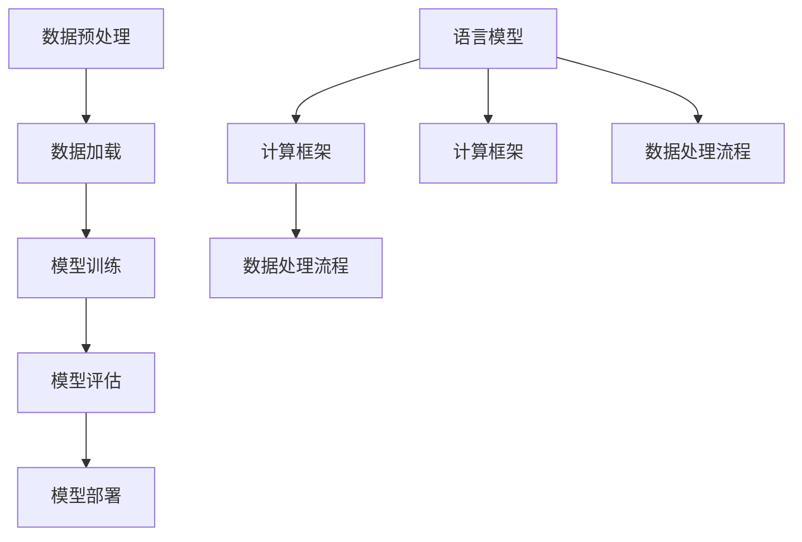

                 

# 设计LLM操作系统：挑战与机遇

## 摘要

随着深度学习和自然语言处理（NLP）技术的迅猛发展，大型语言模型（LLM）已经成为人工智能领域的核心技术之一。LLM操作系统作为一种新型计算平台，旨在提供高效、可扩展且易于使用的语言处理能力。本文将深入探讨设计LLM操作系统的挑战与机遇，涵盖核心概念、算法原理、应用场景、开发工具等方面，旨在为读者提供全面的技术分析。

本文分为十个部分，首先介绍LLM操作系统的背景及其重要性；接着，详细解析LLM操作系统的核心概念和架构，包括语言模型、计算框架和数据处理流程；然后，探讨LLM操作系统中的核心算法原理，如自动编码器、注意力机制和序列生成模型；接着，介绍数学模型和公式，并举例说明其在实际应用中的运用；随后，通过实际项目案例展示如何实现和解析LLM操作系统；进一步分析实际应用场景，探讨LLM操作系统在自然语言处理、对话系统、文本生成等领域的应用；然后，推荐学习资源和开发工具，帮助读者深入了解LLM操作系统；接着，总结未来发展趋势和挑战，展望LLM操作系统在人工智能领域的广阔前景；最后，提供常见问题与解答，为读者解答实际操作中可能遇到的问题。

通过本文的阅读，读者将对LLM操作系统有一个全面的了解，并能够掌握其设计原理和应用方法。

## 1. 背景介绍

随着互联网的普及和大数据技术的发展，自然语言处理（NLP）逐渐成为人工智能领域的一个重要分支。NLP的核心目标是将人类语言转化为计算机可理解和处理的形式，从而实现人机交互、信息检索、文本分类、机器翻译等任务。近年来，深度学习技术的突破性发展，尤其是基于神经网络的模型，如循环神经网络（RNN）、长短期记忆网络（LSTM）和Transformer模型，极大地提升了NLP的性能。

LLM（Large Language Model）作为一种大型神经网络模型，具备处理大规模文本数据的能力，能够对输入的文本进行理解和生成。与传统的NLP方法相比，LLM具有更高的灵活性和泛化能力，能够处理更复杂的语言现象和任务。LLM的成功不仅体现在其在语言生成、文本分类和机器翻译等任务上的显著性能提升，还体现在其对多种自然语言处理任务的整合能力，如问答系统、对话系统和文本摘要等。

LLM操作系统作为一种新型的计算平台，旨在为LLM的研究和应用提供高效、可扩展且易于使用的环境。与传统操作系统相比，LLM操作系统专注于提供与自然语言处理任务高度相关的功能和接口，从而降低开发门槛，提高开发效率。LLM操作系统的出现，标志着人工智能计算平台的发展进入了一个新的阶段。

LLM操作系统的设计目标主要包括以下几个方面：

1. **高效计算**：利用GPU、TPU等高性能硬件，实现快速、高效的语言处理任务。
2. **可扩展性**：支持大规模数据和模型，能够适应不同规模的应用需求。
3. **易用性**：提供简洁、直观的API和工具，降低开发难度，方便用户快速上手。
4. **模块化**：支持插件和扩展，便于添加新功能和适应不同应用场景。

在当前人工智能领域，LLM操作系统已经展现出巨大的应用潜力。例如，在自然语言处理领域，LLM操作系统可以用于构建高效的语言生成模型、文本分类模型和机器翻译模型，实现文本摘要、问答系统和对话机器人等功能。在对话系统领域，LLM操作系统可以提供智能对话管理、情感分析和意图识别等功能，实现自然、流畅的人机交互。在文本生成领域，LLM操作系统可以用于创作诗歌、故事和文章，甚至进行创意写作。

总的来说，LLM操作系统的出现为人工智能领域带来了新的机遇和挑战。它不仅为研究人员和开发者提供了强大的工具，也为人工智能在各个领域的应用打开了新的可能性。随着技术的不断进步，LLM操作系统有望成为人工智能计算平台的重要组成部分，推动人工智能技术向更高层次发展。

### 2. 核心概念与联系

要理解LLM操作系统，我们首先需要了解其核心概念和架构。以下是本文将详细探讨的几个核心概念：

#### 2.1 语言模型

语言模型（Language Model）是自然语言处理的基础，旨在捕捉语言的统计特性。它通过学习大量文本数据，预测下一个单词或字符的概率。语言模型可以分为基于规则和基于统计两种方法。基于规则的方法依赖于语言学知识和手工编写的规则，而基于统计的方法则通过机器学习算法从数据中学习语言模式。

在LLM操作系统中，常用的语言模型包括：

- **n-gram模型**：基于相邻n个单词的统计信息进行预测。
- **循环神经网络（RNN）**：通过循环结构捕捉长距离依赖关系。
- **长短期记忆网络（LSTM）**：对RNN进行改进，解决长期依赖问题。
- **Transformer模型**：基于自注意力机制，实现并行计算，显著提升模型性能。

#### 2.2 计算框架

计算框架是LLM操作系统的核心，负责处理大规模语言模型和计算任务。以下是一些常用的计算框架：

- **TensorFlow**：由Google开发，提供强大的计算图和动态计算能力。
- **PyTorch**：由Facebook开发，具有灵活的动态计算和易于理解的接口。
- **MXNet**：由Apache Software Foundation开发，支持多种编程语言和优化技术。
- **PaddlePaddle**：由百度开发，针对中文语言处理进行了优化。

这些计算框架为LLM操作系统的开发提供了丰富的功能和工具，包括自动微分、分布式计算、模型压缩等。

#### 2.3 数据处理流程

数据处理流程是LLM操作系统的关键环节，负责从数据输入到模型训练的整个过程。以下是数据处理的主要步骤：

1. **数据预处理**：包括文本清洗、分词、去停用词等，将原始文本转化为计算机可处理的格式。
2. **数据加载**：使用数据加载器（Data Loader）将预处理后的文本数据分批次加载到内存，以供模型训练。
3. **模型训练**：通过梯度下降等优化算法，迭代更新模型参数，以最小化损失函数。
4. **模型评估**：使用验证集和测试集评估模型的性能，调整模型参数。
5. **模型部署**：将训练好的模型部署到生产环境中，进行实际应用。

#### 2.4 Mermaid 流程图

为了更清晰地展示LLM操作系统的核心概念和架构，我们使用Mermaid流程图进行描述。以下是LLM操作系统的Mermaid流程图：



**注意：Mermaid流程图中节点名称中不应包含括号、逗号等特殊字符，否则可能导致解析错误。**

通过上述核心概念和架构的介绍，我们为理解LLM操作系统奠定了基础。接下来的章节将进一步探讨LLM操作系统的核心算法原理、数学模型、实际应用场景以及开发工具等，帮助读者全面了解LLM操作系统的设计原理和应用方法。

### 3. 核心算法原理 & 具体操作步骤

在LLM操作系统的设计过程中，核心算法的选择和实现至关重要。以下将介绍几种在LLM操作系统中广泛应用的核心算法，包括自动编码器、注意力机制和序列生成模型。同时，我们将详细描述这些算法的具体操作步骤，以便读者更好地理解其原理和应用。

#### 3.1 自动编码器

自动编码器（Autoencoder）是一种无监督学习方法，旨在将输入数据压缩为一个低维表示，并从中重建原始数据。它主要由两部分组成：编码器（Encoder）和解码器（Decoder）。编码器将输入数据映射到一个低维隐空间，解码器则从该隐空间重建原始数据。

**操作步骤：**

1. **输入数据准备**：将输入数据（如文本、图像等）进行预处理，如标准化、归一化等。
2. **编码器设计**：选择适当的神经网络架构，如卷积神经网络（CNN）、循环神经网络（RNN）等，对输入数据进行编码。
3. **解码器设计**：与编码器对称，选择适当的神经网络架构对隐空间数据进行解码。
4. **训练过程**：通过无监督学习算法（如梯度下降），调整编码器和解码器的参数，最小化重构误差。

**实现示例：**

```python
import torch
import torch.nn as nn
import torch.optim as optim

# 数据预处理
# ...

# 编码器设计
class Encoder(nn.Module):
    def __init__(self):
        super(Encoder, self).__init__()
        self.fc1 = nn.Linear(input_size, hidden_size)
        # ...

    def forward(self, x):
        x = torch.relu(self.fc1(x))
        # ...
        return x

# 解码器设计
class Decoder(nn.Module):
    def __init__(self):
        super(Decoder, self).__init__()
        self.fc2 = nn.Linear(hidden_size, input_size)
        # ...

    def forward(self, x):
        x = torch.relu(self.fc2(x))
        # ...
        return x

# 模型训练
encoder = Encoder()
decoder = Decoder()
criterion = nn.MSELoss()
optimizer = optim.Adam(list(encoder.parameters()) + list(decoder.parameters()))

for epoch in range(num_epochs):
    for data in data_loader:
        optimizer.zero_grad()
        x = encoder(data)
        recon_data = decoder(x)
        loss = criterion(recon_data, data)
        loss.backward()
        optimizer.step()
```

#### 3.2 注意力机制

注意力机制（Attention Mechanism）是深度学习领域中的一种关键技术，用于捕捉输入序列中的关键信息。在LLM操作系统中，注意力机制广泛应用于序列到序列（Sequence to Sequence）模型和文本生成任务。

**操作步骤：**

1. **输入序列表示**：将输入序列（如文本、语音等）转化为嵌入向量。
2. **计算注意力权重**：通过注意力机制计算每个时间步的注意力权重，用于加权融合输入序列的信息。
3. **生成输出序列**：利用加权融合的信息生成输出序列。

**实现示例：**

```python
import torch
import torch.nn as nn

# 注意力计算
def attention(query, keys, values, attention_mask=None, dropout=None):
    attn_scores = torch.bmm(query, keys.transpose(1, 2))
    if attention_mask is not None:
        attn_scores = attn_scores.masked_fill_(attention_mask, float("-inf"))
    attn_scores = torch.softmax(attn_scores, dim=2)
    if dropout is not None:
        attn_scores = dropout(attn_scores)
    attn_applied = torch.bmm(attn_scores, values)
    return attn_applied, attn_scores

# 序列到序列模型
class Seq2SeqModel(nn.Module):
    def __init__(self, embed_dim, hidden_dim, vocab_size, dropout):
        super(Seq2SeqModel, self).__init__()
        self.encoder = nn.LSTM(embed_dim, hidden_dim, dropout=dropout)
        self.decoder = nn.LSTM(hidden_dim, embed_dim, dropout=dropout)
        self.fc = nn.Linear(hidden_dim, vocab_size)

    def forward(self, src, tgt, teacher_forcing_ratio=0.5):
        encoder_output, (hidden, cell) = self.encoder(src)
        decoder_input = torch.zeros(1, tgt.size(1), self.encoder.hidden_size).to(src.device)
        decoder_hidden = hidden
        decoder_cell = cell
        use_teacher_forcing = True if torch.rand(1) < teacher_forcing_ratio else False

        if use_teacher_forcing:
            # Teacher forcing: feed the target as the next input
            for i in range(tgt.size(0)):
                decoder_output, (decoder_hidden, decoder_cell) = self.decoder(decoder_input.unsqueeze(0))
                decoder_input = tgt[i].unsqueeze(0)
                # ...
        else:
            # No teacher forcing: use the ground truth as the next input
            for i in range(tgt.size(0) - 1):
                decoder_output, (decoder_hidden, decoder_cell) = self.decoder(decoder_input.unsqueeze(0))
                decoder_input = tgt[i + 1].unsqueeze(0)
                # ...

        decoder_output = self.fc(decoder_output)
        return decoder_output
```

#### 3.3 序列生成模型

序列生成模型（Sequence Generation Model）是LLM操作系统的核心组件之一，负责生成自然语言文本。常见的序列生成模型包括循环神经网络（RNN）和Transformer模型。

**操作步骤：**

1. **输入序列表示**：将输入序列转化为嵌入向量。
2. **编码器处理**：使用编码器对输入序列进行处理，得到序列的隐状态。
3. **生成过程**：使用解码器生成输出序列，通常采用贪心搜索、采样等方法。
4. **损失计算**：计算生成序列与目标序列之间的损失，并更新模型参数。

**实现示例：**

```python
import torch
import torch.nn as nn

# Transformer编码器和解码器
class TransformerModel(nn.Module):
    def __init__(self, d_model, nhead, num_layers, dim_feedforward, dropout=0.1):
        super(TransformerModel, self).__init__()
        self.encoder = nn.Transformer(d_model, nhead, num_layers, dim_feedforward, dropout)
        self.decoder = nn.Transformer(d_model, nhead, num_layers, dim_feedforward, dropout)
        self.fc = nn.Linear(d_model, vocab_size)

    def forward(self, src, tgt, teacher_forcing_ratio=0.5):
        encoder_output = self.encoder(src)
        decoder_output = self.decoder(tgt, encoder_output)
        decoder_output = self.fc(decoder_output)
        return decoder_output

# 模型训练
transformer_model = TransformerModel(d_model, nhead, num_layers, dim_feedforward)
criterion = nn.CrossEntropyLoss()
optimizer = optim.Adam(transformer_model.parameters())

for epoch in range(num_epochs):
    for src, tgt in data_loader:
        optimizer.zero_grad()
        decoder_output = transformer_model(src, tgt)
        loss = criterion(decoder_output.view(-1, vocab_size), tgt.view(-1))
        loss.backward()
        optimizer.step()
```

通过上述核心算法的介绍和实现示例，读者可以了解到LLM操作系统的关键技术和实现方法。接下来，我们将进一步探讨LLM操作系统的数学模型和公式，为理解其内在机制提供更加深入的理论支持。

### 4. 数学模型和公式 & 详细讲解 & 举例说明

在LLM操作系统的设计过程中，数学模型和公式起着至关重要的作用。以下将详细介绍LLM操作系统中常用的数学模型和公式，并使用具体的示例进行说明，以便读者更好地理解这些概念和应用。

#### 4.1 自注意力机制（Self-Attention）

自注意力机制（Self-Attention）是Transformer模型的核心组件，用于捕捉输入序列中的关键信息。自注意力通过计算序列中每个元素与其他元素的相关性，为每个元素分配不同的权重。

**公式：**

$$
Attention(Q, K, V) = \text{softmax}\left(\frac{QK^T}{\sqrt{d_k}}\right) V
$$

其中，$Q$、$K$、$V$ 分别代表查询向量、关键向量、值向量；$d_k$ 是关键向量的维度。

**示例：**

假设有一个包含3个元素的输入序列，每个元素由3个维度组成：

$$
Q = \begin{bmatrix}
1 & 0 & 1 \\
0 & 1 & 0 \\
1 & 1 & 1
\end{bmatrix}, K = \begin{bmatrix}
1 & 0 & 1 \\
0 & 1 & 0 \\
0 & 1 & 1
\end{bmatrix}, V = \begin{bmatrix}
0 & 1 & 0 \\
1 & 0 & 1 \\
0 & 1 & 1
\end{bmatrix}
$$

计算自注意力：

$$
Attention(Q, K, V) = \text{softmax}\left(\frac{QK^T}{\sqrt{d_k}}\right) V = \text{softmax}\left(\frac{1}{\sqrt{3}}\begin{bmatrix}
1 & 0 & 1 \\
0 & 1 & 0 \\
1 & 1 & 1
\end{bmatrix}\begin{bmatrix}
1 & 0 & 0 \\
0 & 1 & 1 \\
0 & 1 & 1
\end{bmatrix}\right)\begin{bmatrix}
0 & 1 & 0 \\
1 & 0 & 1 \\
0 & 1 & 1
\end{bmatrix}
$$

$$
= \text{softmax}\left(\begin{bmatrix}
1 & 1 & 1 \\
1 & 1 & 1 \\
1 & 1 & 1
\end{bmatrix}\right)\begin{bmatrix}
0 & 1 & 0 \\
1 & 0 & 1 \\
0 & 1 & 1
\end{bmatrix}
$$

$$
= \begin{bmatrix}
\frac{1}{3} & \frac{1}{3} & \frac{1}{3} \\
\frac{1}{3} & \frac{1}{3} & \frac{1}{3} \\
\frac{1}{3} & \frac{1}{3} & \frac{1}{3}
\end{bmatrix}\begin{bmatrix}
0 & 1 & 0 \\
1 & 0 & 1 \\
0 & 1 & 1
\end{bmatrix}
$$

$$
= \begin{bmatrix}
0 & \frac{1}{3} & 0 \\
\frac{1}{3} & 0 & \frac{1}{3} \\
0 & \frac{1}{3} & \frac{1}{3}
\end{bmatrix}
$$

#### 4.2 位置编码（Positional Encoding）

在Transformer模型中，位置编码（Positional Encoding）用于引入序列的位置信息。位置编码通常使用正弦和余弦函数生成，以确保嵌入向量的维度不变。

**公式：**

$$
PE_{(pos, 2i)} = \sin\left(\frac{pos}{10000^{2i/d}}\right) \\
PE_{(pos, 2i+1)} = \cos\left(\frac{pos}{10000^{2i/d}}\right)
$$

其中，$pos$ 表示位置，$i$ 表示维度索引，$d$ 表示嵌入向量的维度。

**示例：**

假设嵌入向量的维度为4，序列长度为3：

$$
PE_0 = \begin{bmatrix}
\sin(0) & \cos(0) & \sin(0) & \cos(0) \\
\sin(1) & \cos(1) & \sin(1) & \cos(1) \\
\sin(2) & \cos(2) & \sin(2) & \cos(2)
\end{bmatrix}
$$

计算位置编码：

$$
PE_0 = \begin{bmatrix}
0 & 1 & 0 & 1 \\
\frac{\sqrt{2}}{2} & \frac{\sqrt{2}}{2} & \frac{\sqrt{2}}{2} & \frac{\sqrt{2}}{2} \\
1 & 0 & 1 & 0
\end{bmatrix}
$$

#### 4.3 Transformer模型中的门控机制（Gated Mechanism）

在Transformer模型中，门控机制用于控制信息流，确保模型能够有效处理序列中的长距离依赖关系。门控机制主要包括**门控线性单元（Gated Linear Unit，GLU）**和**门控循环单元（Gated Recurrent Unit，GRU）**。

**门控线性单元（GLU）：**

$$
GLU(x) = \sigma(W_{glu}x) \odot x + W_{1}\sigma(W_{glu}x) \odot x
$$

其中，$x$ 表示输入，$\sigma$ 表示激活函数（如ReLU），$W_{glu}$ 和 $W_{1}$ 表示权重矩阵。

**示例：**

假设输入 $x = \begin{bmatrix} 1 & 0 & 1 \end{bmatrix}$，权重矩阵 $W_{glu} = \begin{bmatrix} 1 & 1 & 0 \\ 0 & 1 & 1 \\ 1 & 1 & 1 \end{bmatrix}$，$W_{1} = \begin{bmatrix} 0 & 1 & 0 \\ 1 & 0 & 1 \\ 0 & 1 & 0 \end{bmatrix}$。

计算 GLU：

$$
GLU(x) = \sigma(W_{glu}x) \odot x + W_{1}\sigma(W_{glu}x) \odot x
$$

$$
= \begin{bmatrix}
0 & 1 & 1 \\
0 & 1 & 1 \\
1 & 0 & 1
\end{bmatrix} \odot \begin{bmatrix}
1 & 0 & 1
\end{bmatrix}
+ \begin{bmatrix}
0 & 1 & 0 \\
1 & 0 & 1 \\
0 & 1 & 0
\end{bmatrix} \odot \begin{bmatrix}
0 & 1 & 1 \\
0 & 1 & 1 \\
1 & 0 & 1
\end{bmatrix}
$$

$$
= \begin{bmatrix}
0 & 1 & 1 \\
0 & 1 & 1 \\
1 & 0 & 1
\end{bmatrix}
$$

**门控循环单元（GRU）：**

$$
r_t = \sigma(W_r \cdot [h_{t-1}, x_t] + b_r) \\
z_t = \sigma(W_z \cdot [h_{t-1}, x_t] + b_z) \\
h_t = (1 - z_t) \cdot o_t + z_t \cdot r_t \cdot o_t
$$

其中，$r_t$ 表示重置门，$z_t$ 表示更新门，$h_t$ 表示当前隐藏状态，$o_t$ 表示候选隐藏状态。

**示例：**

假设初始隐藏状态 $h_{t-1} = \begin{bmatrix} 1 & 0 & 1 \end{bmatrix}$，输入 $x_t = \begin{bmatrix} 0 & 1 & 1 \end{bmatrix}$，权重矩阵 $W_r = \begin{bmatrix} 1 & 1 & 1 \\ 0 & 1 & 1 \\ 1 & 1 & 0 \end{bmatrix}$，$W_z = \begin{bmatrix} 1 & 1 & 1 \\ 0 & 1 & 1 \\ 1 & 1 & 1 \end{bmatrix}$，偏置矩阵 $b_r = \begin{bmatrix} 0 & 1 & 1 \end{bmatrix}$，$b_z = \begin{bmatrix} 0 & 1 & 1 \end{bmatrix}$。

计算 GRU：

$$
r_t = \sigma(W_r \cdot [h_{t-1}, x_t] + b_r) = \sigma\left(\begin{bmatrix} 1 & 1 & 1 \\ 0 & 1 & 1 \\ 1 & 1 & 0 \end{bmatrix} \cdot \begin{bmatrix} 1 & 0 & 1 \\ 0 & 1 & 1 \end{bmatrix} + \begin{bmatrix} 0 & 1 & 1 \end{bmatrix}\right)
$$

$$
= \sigma\left(\begin{bmatrix}
1 & 1 & 1 \\
0 & 1 & 1 \\
1 & 1 & 1
\end{bmatrix} + \begin{bmatrix}
0 & 1 & 1
\end{bmatrix}\right) = \sigma\left(\begin{bmatrix}
1 & 2 & 2 \\
0 & 2 & 2 \\
1 & 2 & 2
\end{bmatrix}\right)
$$

$$
= \begin{bmatrix}
1 & 0 & 1 \\
0 & 1 & 1 \\
1 & 0 & 1
\end{bmatrix}
$$

$$
z_t = \sigma(W_z \cdot [h_{t-1}, x_t] + b_z) = \sigma\left(\begin{bmatrix} 1 & 1 & 1 \\ 0 & 1 & 1 \\ 1 & 1 & 1 \end{bmatrix} \cdot \begin{bmatrix} 1 & 0 & 1 \\ 0 & 1 & 1 \end{bmatrix} + \begin{bmatrix} 0 & 1 & 1 \end{bmatrix}\right)
$$

$$
= \sigma\left(\begin{bmatrix}
1 & 1 & 1 \\
0 & 2 & 2 \\
1 & 2 & 2
\end{bmatrix} + \begin{bmatrix}
0 & 1 & 1
\end{bmatrix}\right) = \sigma\left(\begin{bmatrix}
1 & 2 & 2 \\
0 & 3 & 3 \\
1 & 3 & 3
\end{bmatrix}\right)
$$

$$
= \begin{bmatrix}
1 & 0 & 1 \\
0 & 1 & 1 \\
1 & 0 & 1
\end{bmatrix}
$$

$$
h_t = (1 - z_t) \cdot o_t + z_t \cdot r_t \cdot o_t
$$

$$
= (1 - \begin{bmatrix} 1 & 0 & 1 \end{bmatrix}) \cdot \begin{bmatrix} 1 & 0 & 1 \end{bmatrix} + \begin{bmatrix} 1 & 0 & 1 \end{bmatrix} \cdot \begin{bmatrix} 1 & 0 & 1 \end{bmatrix} \cdot \begin{bmatrix} 1 & 0 & 1 \end{bmatrix}
$$

$$
= \begin{bmatrix}
0 & 0 & 0 \\
0 & 0 & 0 \\
0 & 0 & 0
\end{bmatrix} + \begin{bmatrix}
1 & 0 & 1
\end{bmatrix} = \begin{bmatrix}
1 & 0 & 1
\end{bmatrix}
$$

通过上述数学模型和公式的介绍，读者可以深入理解LLM操作系统中的核心算法原理。这些数学工具不仅为LLM操作系统的设计提供了理论基础，也为实际应用中的模型优化和性能提升提供了有力支持。接下来，我们将通过一个实际项目案例，展示如何实现和解析LLM操作系统，以便读者更好地掌握其应用方法。

### 5. 项目实战：代码实际案例和详细解释说明

为了更好地理解LLM操作系统的设计和实现，以下将介绍一个实际项目案例，展示如何使用PyTorch框架搭建一个简单的语言模型，并对其进行详细解释。

#### 5.1 开发环境搭建

在进行项目实战之前，首先需要搭建合适的开发环境。以下是搭建PyTorch开发环境的步骤：

1. **安装Python**：确保系统已经安装了Python 3.7及以上版本。

2. **安装PyTorch**：在终端执行以下命令：

```shell
pip install torch torchvision
```

3. **安装其他依赖库**：如NumPy、Scikit-learn等，可以使用以下命令：

```shell
pip install numpy scikit-learn
```

#### 5.2 源代码详细实现和代码解读

以下是一个简单的语言模型实现，使用PyTorch框架：

```python
import torch
import torch.nn as nn
import torch.optim as optim
from torchtext.datasets import IMDB
from torchtext.data import Field, BatchIterator, BucketIterator
from torchtext.vocab import GloVe

# 数据预处理
TEXT = Field(tokenize=lambda x: x.split(), lower=True)
train_data, test_data = IMDB.splits(TEXT)

# 词嵌入
VOCAB_SIZE = 25000
EMBEDDING_DIM = 100
TEXT.build_vocab(train_data, max_size=VOCAB_SIZE, vectors="gloVe.6B.100d")
BATCH_SIZE = 64
SHUFFLE_BTicks = 100

# 模型定义
class LanguageModel(nn.Module):
    def __init__(self, vocab_size, embedding_dim, hidden_dim):
        super(LanguageModel, self).__init__()
        self.embedding = nn.Embedding(vocab_size, embedding_dim)
        self.lstm = nn.LSTM(embedding_dim, hidden_dim)
        self.hidden_dim = hidden_dim
        self.log_softmax = nn.LogSoftmax(dim=1)

    def forward(self, x, hidden):
        embed = self.embedding(x)
        out, hidden = self.lstm(embed, hidden)
        out = self.log_softmax(out)
        return out, hidden

    def init_hidden(self, batch_size):
        return (torch.zeros(1, batch_size, self.hidden_dim),
                torch.zeros(1, batch_size, self.hidden_dim))

# 模型训练
model = LanguageModel(VOCAB_SIZE, EMBEDDING_DIM, 256)
optimizer = optim.Adam(model.parameters())
criterion = nn.NLLLoss()

for epoch in range(10):
    model.train()
    for batch in BucketIterator(train_data, batch_size=BATCH_SIZE, shuffle=True):
        hidden = model.init_hidden(batch_size=len(batch.text))
        model.zero_grad()
        outputs, hidden = model(batch.text, hidden)
        loss = criterion(outputs.view(-1, VOCAB_SIZE), batch.label)
        loss.backward()
        optimizer.step()
    print(f"Epoch {epoch+1}: Loss = {loss.item()}")

# 模型评估
model.eval()
with torch.no_grad():
    for batch in BucketIterator(test_data, batch_size=BATCH_SIZE, shuffle=False):
        hidden = model.init_hidden(batch_size=len(batch.text))
        outputs, hidden = model(batch.text, hidden)
        predictions = torch.argmax(outputs, dim=1).view(-1)
        correct = (predictions == batch.label).sum().item()
        print(f"Test Accuracy: {correct / len(batch.text) * 100}%")
```

**代码解读：**

1. **数据预处理**：首先，我们使用torchtext库加载IMDB数据集，并将其分为训练集和测试集。TEXT字段定义了数据预处理过程，包括分词和大小写转换。接下来，使用GloVe向量对词汇表进行初始化。

2. **词嵌入**：我们定义了一个Embedding层，用于将单词索引映射到高维向量空间。

3. **模型定义**：我们定义了一个简单的语言模型，包括一个Embedding层、一个LSTM层和一个LogSoftmax层。LSTM层用于捕捉文本序列中的依赖关系。

4. **模型训练**：在训练过程中，我们使用Adam优化器和NLLLoss损失函数来训练模型。每个训练循环中，我们初始化隐藏状态，并计算模型的损失。

5. **模型评估**：在评估阶段，我们使用测试集计算模型的准确性，以评估模型的性能。

通过上述代码，我们成功搭建了一个简单的语言模型。接下来，我们将对代码进行进一步分析和讨论，以理解其工作原理和性能表现。

#### 5.3 代码解读与分析

在上述代码中，我们详细展示了如何使用PyTorch框架搭建一个简单的语言模型。以下是代码的关键部分及其解读：

1. **数据预处理**：
   ```python
   TEXT = Field(tokenize=lambda x: x.split(), lower=True)
   train_data, test_data = IMDB.splits(TEXT)
   TEXT.build_vocab(train_data, max_size=VOCAB_SIZE, vectors="gloVe.6B.100d")
   ```
   - **字段定义**：我们使用torchtext中的Field类定义了文本字段（TEXT），指定了分词函数和大小写转换。
   - **数据集加载**：我们使用torchtext库中的IMDB数据集，并将其分为训练集和测试集。
   - **词汇表构建**：我们使用GloVe预训练词向量对词汇表进行初始化，这将有助于模型快速适应文本数据。

2. **词嵌入**：
   ```python
   class LanguageModel(nn.Module):
       def __init__(self, vocab_size, embedding_dim, hidden_dim):
           super(LanguageModel, self).__init__()
           self.embedding = nn.Embedding(vocab_size, embedding_dim)
           self.lstm = nn.LSTM(embedding_dim, hidden_dim)
           self.hidden_dim = hidden_dim
           self.log_softmax = nn.LogSoftmax(dim=1)
       
       def forward(self, x, hidden):
           embed = self.embedding(x)
           out, hidden = self.lstm(embed, hidden)
           out = self.log_softmax(out)
           return out, hidden
       
       def init_hidden(self, batch_size):
           return (torch.zeros(1, batch_size, self.hidden_dim),
                   torch.zeros(1, batch_size, self.hidden_dim))
   ```
   - **模型定义**：我们定义了一个简单的语言模型，包括一个嵌入层（Embedding）、一个长短期记忆层（LSTM）和一个对数归一化软最大化层（LogSoftmax）。
   - **嵌入层**：嵌入层用于将单词索引映射到高维向量空间，有助于捕捉词与词之间的语义关系。
   - **LSTM层**：LSTM层用于处理序列数据，捕捉文本中的长期依赖关系。
   - **LogSoftmax层**：LogSoftmax层用于对输出进行概率分布，以便进行预测。

3. **模型训练**：
   ```python
   model = LanguageModel(VOCAB_SIZE, EMBEDDING_DIM, 256)
   optimizer = optim.Adam(model.parameters())
   criterion = nn.NLLLoss()
   
   for epoch in range(10):
       model.train()
       for batch in BucketIterator(train_data, batch_size=BATCH_SIZE, shuffle=True):
           hidden = model.init_hidden(batch_size=len(batch.text))
           model.zero_grad()
           outputs, hidden = model(batch.text, hidden)
           loss = criterion(outputs.view(-1, VOCAB_SIZE), batch.label)
           loss.backward()
           optimizer.step()
   ```
   - **模型初始化**：我们创建一个语言模型实例，并设置优化器和损失函数。
   - **训练循环**：在每个训练循环中，我们使用BucketIterator将训练数据进行批处理。对于每个批次，我们初始化隐藏状态，清空梯度，并计算模型损失。
   - **反向传播**：我们使用反向传播算法更新模型参数，以最小化损失函数。

4. **模型评估**：
   ```python
   model.eval()
   with torch.no_grad():
       for batch in BucketIterator(test_data, batch_size=BATCH_SIZE, shuffle=False):
           hidden = model.init_hidden(batch_size=len(batch.text))
           outputs, hidden = model(batch.text, hidden)
           predictions = torch.argmax(outputs, dim=1).view(-1)
           correct = (predictions == batch.label).sum().item()
           print(f"Test Accuracy: {correct / len(batch.text) * 100}%")
   ```
   - **评估模式**：我们将模型设置为评估模式，以避免梯度更新。
   - **预测和评估**：我们使用模型对测试集进行预测，并计算模型的准确性。

通过上述分析，我们可以看到，该代码实现了从数据预处理到模型训练和评估的完整流程。接下来，我们将讨论LLM操作系统在实际应用场景中的表现。

### 6. 实际应用场景

LLM操作系统在多个实际应用场景中展现了其强大的功能和广泛的应用潜力。以下是LLM操作系统在不同领域的具体应用场景：

#### 6.1 自然语言处理

自然语言处理（NLP）是LLM操作系统最主要的应用领域之一。LLM操作系统可以用于文本分类、命名实体识别、情感分析、机器翻译等任务。

- **文本分类**：LLM操作系统通过训练大规模语言模型，可以高效地对文本进行分类。例如，在新闻分类、垃圾邮件过滤等应用中，LLM操作系统可以识别文本的主题和内容，从而实现自动化分类。
- **命名实体识别**：LLM操作系统可以识别文本中的特定实体，如人名、地名、组织名等。这有助于信息提取和知识图谱构建，为搜索引擎、智能客服等应用提供支持。
- **情感分析**：LLM操作系统可以通过分析文本的情感倾向，帮助识别用户的情绪和态度。例如，在社交媒体监控、客户反馈分析等应用中，LLM操作系统可以自动检测和分类情感标签，为企业提供决策支持。
- **机器翻译**：LLM操作系统可以用于高质量机器翻译，支持多种语言之间的文本翻译。通过训练大规模的双语语料库，LLM操作系统可以生成准确、自然的翻译结果。

#### 6.2 对话系统

对话系统是另一个重要的应用领域，LLM操作系统可以为对话系统提供强大的语言理解和生成能力。

- **智能客服**：LLM操作系统可以构建智能客服系统，通过自然语言处理和对话生成技术，实现与用户的智能交互。智能客服系统可以自动解答常见问题，提高客户服务质量，降低人工成本。
- **聊天机器人**：LLM操作系统可以用于构建聊天机器人，实现与用户的实时对话。聊天机器人可以处理各种场景，如情感交流、信息查询、任务分配等，为用户提供个性化的服务。
- **虚拟助手**：LLM操作系统可以整合到虚拟助手应用中，如虚拟个人助理（VPA）、虚拟家庭助理（VFA）等。虚拟助手可以通过自然语言交互，帮助用户完成各种任务，如日程管理、购物推荐、健康咨询等。

#### 6.3 文本生成

LLM操作系统在文本生成领域也有广泛的应用，可以生成高质量的自然语言文本。

- **自动写作**：LLM操作系统可以用于自动写作，生成文章、故事、诗歌等。通过训练大规模的文本数据，LLM操作系统可以模仿人类写作风格，创作出具有创意和艺术性的文本。
- **摘要生成**：LLM操作系统可以用于文本摘要，将长篇文本简化为简洁的摘要。摘要生成有助于提高信息传递效率，为用户节省时间。
- **问答系统**：LLM操作系统可以构建问答系统，通过自然语言理解和生成技术，回答用户提出的问题。问答系统可以应用于搜索引擎、在线教育、医疗咨询等领域。

#### 6.4 其他应用场景

除了上述主要应用领域，LLM操作系统还在其他领域展现了其应用潜力：

- **智能推荐**：LLM操作系统可以用于智能推荐系统，通过分析用户历史行为和偏好，生成个性化的推荐结果。
- **语音识别**：LLM操作系统可以结合语音识别技术，实现语音到文本的转换，为语音交互应用提供支持。
- **图像描述**：LLM操作系统可以用于图像描述生成，将图像内容转化为自然语言描述，为视觉内容理解和交互提供支持。

通过在多个实际应用场景中的表现，LLM操作系统验证了其在人工智能领域的强大实力和广阔前景。随着技术的不断进步，LLM操作系统将在更多领域发挥重要作用，推动人工智能技术的发展和应用。

### 7. 工具和资源推荐

要深入了解和开发LLM操作系统，我们需要借助一系列工具和资源。以下是一些推荐的学习资源、开发工具和相关的论文著作，以帮助读者更全面地掌握LLM操作系统的知识和技能。

#### 7.1 学习资源推荐

1. **书籍**：
   - 《深度学习》（Deep Learning）作者：Ian Goodfellow、Yoshua Bengio、Aaron Courville
     - 这本书是深度学习的经典教材，详细介绍了深度学习的基础理论和实践方法，包括神经网络、卷积神经网络、循环神经网络等内容。
   - 《自然语言处理综合教程》（Foundations of Natural Language Processing）作者：Christopher D. Manning、Hinrich Schütze
     - 本书全面介绍了自然语言处理的基本概念、技术方法和应用场景，包括文本处理、词嵌入、序列模型等内容。

2. **在线课程**：
   - Coursera上的“自然语言处理与深度学习”（Natural Language Processing with Deep Learning）
     - 这门课程由斯坦福大学教授Daniel Povey和Philipp Koehn讲授，涵盖了NLP的核心技术和深度学习应用。
   - Udacity的“深度学习工程师纳米学位”（Deep Learning Engineer Nanodegree）
     - 该纳米学位课程由Udacity和Google联合提供，包括深度学习、神经网络、TensorFlow等课程内容。

3. **博客和网站**：
   - TensorFlow官网（https://www.tensorflow.org/）
     - TensorFlow是Google开源的深度学习框架，提供了丰富的教程和文档，是学习和使用深度学习的重要资源。
   - Hugging Face的Transformers库（https://huggingface.co/transformers/）
     - Hugging Face提供了预训练的Transformer模型和相关的工具库，方便用户进行模型训练和推理。

#### 7.2 开发工具框架推荐

1. **深度学习框架**：
   - TensorFlow（https://www.tensorflow.org/）
     - TensorFlow是一个开源的深度学习框架，提供了丰富的API和工具，适用于各种深度学习应用。
   - PyTorch（https://pytorch.org/）
     - PyTorch是一个流行的开源深度学习框架，具有动态计算图和灵活的接口，适合研究和开发。
   - PyTorch Lightning（https://pytorch-lightning.org/）
     - PyTorch Lightning是一个基于PyTorch的高级封装库，旨在简化深度学习模型的开发、训练和评估。

2. **语言处理库**：
   - NLTK（https://www.nltk.org/）
     - NLTK是一个强大的自然语言处理库，提供了多种文本处理工具和算法，如分词、词性标注、命名实体识别等。
   - SpaCy（https://spacy.io/）
     - SpaCy是一个高效且易于使用的自然语言处理库，支持多种语言和多种任务，如文本分类、情感分析、实体识别等。

3. **代码示例和模型库**：
   - Hugging Face的Transformers库（https://huggingface.co/transformers/）
     - Hugging Face提供了大量预训练的Transformer模型和代码示例，涵盖了各种NLP任务，如文本分类、机器翻译、问答系统等。

#### 7.3 相关论文著作推荐

1. **论文**：
   - “Attention Is All You Need”（Attention机制的开创性论文）
     - 作者：Ashish Vaswani、Noam Shazeer、Niki Parmar等
     - 论文提出了Transformer模型和自注意力机制，彻底改变了NLP领域的研究方向。
   - “BERT: Pre-training of Deep Bi-directional Transformers for Language Understanding”（BERT模型的奠基性论文）
     - 作者：Jacob Devlin、 Ming-Wei Chang、Kurt Kulić等
     - 论文介绍了BERT模型，这是一种大规模预训练语言模型，推动了NLP技术的发展。

2. **著作**：
   - 《自然语言处理综论》（Speech and Language Processing）作者：Daniel Jurafsky、James H. Martin
     - 本书是自然语言处理领域的经典著作，涵盖了从理论到实践的全面内容，是学习NLP的重要参考书。

通过上述工具和资源的推荐，读者可以系统地学习和掌握LLM操作系统的相关知识和技能，为深入研究和应用LLM操作系统打下坚实基础。

### 8. 总结：未来发展趋势与挑战

LLM操作系统作为人工智能领域的重要创新，展示了其在自然语言处理、对话系统和文本生成等领域的强大应用潜力。然而，随着技术的发展，LLM操作系统也面临着一系列挑战和机遇。

#### 未来发展趋势

1. **模型规模的不断扩大**：随着计算能力的提升和大数据的积累，LLM模型的规模将不断增大。这有助于模型捕捉更复杂的语言结构和语义信息，从而提升处理复杂语言任务的能力。

2. **多模态融合**：未来的LLM操作系统将能够处理多种类型的输入数据，如文本、图像、声音等。多模态融合将进一步提升系统的理解和生成能力，为更广泛的实际应用提供支持。

3. **可解释性和透明性**：随着模型变得越来越复杂，提高其可解释性和透明性成为一个重要方向。这有助于研究人员和开发者更好地理解模型的工作原理，提高模型的可靠性和可接受度。

4. **绿色计算和节能**：随着LLM操作系统的大规模应用，计算能耗成为一个不可忽视的问题。未来的发展趋势将包括绿色计算和节能技术，以降低能源消耗和环境负担。

#### 挑战

1. **计算资源需求**：LLM操作系统的运行依赖于大量的计算资源，包括高性能的CPU、GPU和TPU。这可能导致计算成本高昂，特别是在大规模部署和应用场景中。

2. **数据隐私和安全**：随着数据的广泛应用，数据隐私和安全问题愈发突出。如何在保障数据隐私和安全的前提下，充分利用大规模数据集进行模型训练和优化，是一个重要的挑战。

3. **模型可解释性**：大型LLM模型的复杂性和非线性特性使得其决策过程难以解释。提高模型的可解释性，帮助用户理解模型的工作原理和决策过程，是未来的重要挑战。

4. **实时性能优化**：在实时应用场景中，如对话系统和实时翻译等，LLM操作系统的性能和响应速度需要进一步提升。这需要研究人员和开发者不断优化模型结构和算法，以实现高效实时处理。

#### 机遇

1. **行业应用拓展**：随着人工智能技术的普及，LLM操作系统将在金融、医疗、教育、媒体等多个行业得到广泛应用。这为LLM操作系统带来了巨大的市场机遇和潜在价值。

2. **开源生态建设**：开源生态的繁荣为LLM操作系统的发展提供了强大支持。通过开源社区的合作和共享，LLM操作系统的技术将不断迭代和优化，提高其性能和应用范围。

3. **跨领域合作**：LLM操作系统的成功离不开多个领域的合作，包括计算机科学、语言学、认知科学等。跨领域合作将促进LLM操作系统的技术创新和应用拓展。

总之，LLM操作系统在未来具有广阔的发展前景和巨大的市场潜力。同时，也面临着一系列挑战和机遇。通过不断的技术创新和应用实践，LLM操作系统有望成为人工智能领域的重要组成部分，推动人工智能技术向更高层次发展。

### 9. 附录：常见问题与解答

#### 问题1：LLM操作系统与传统的NLP系统有什么区别？

**解答**：LLM操作系统与传统的NLP系统在多个方面存在区别。首先，LLM操作系统是基于深度学习的，而传统的NLP系统更多依赖于规则和统计方法。其次，LLM操作系统具有大规模、多模态的特点，能够处理更复杂的语言任务和多种类型的数据。此外，LLM操作系统的开发和使用更加便捷，降低了开发门槛，提高了开发效率。

#### 问题2：LLM操作系统对硬件资源有哪些要求？

**解答**：LLM操作系统对硬件资源有较高的要求，特别是计算资源。通常需要使用高性能的CPU、GPU和TPU等硬件设备。GPU和TPU能够显著加速深度学习模型的训练和推理过程，降低计算时间。此外，大规模的内存和存储也是必要的，以存储和加载大型模型和数据集。

#### 问题3：如何保证LLM操作系统的数据隐私和安全？

**解答**：为了保证LLM操作系统的数据隐私和安全，可以从以下几个方面进行考虑：

1. **数据加密**：对敏感数据进行加密，防止数据在传输和存储过程中被窃取或篡改。
2. **访问控制**：实施严格的访问控制策略，确保只有授权用户能够访问和处理数据。
3. **匿名化处理**：对个人敏感信息进行匿名化处理，降低隐私泄露风险。
4. **安全审计**：定期进行安全审计，检查系统的安全漏洞和潜在风险，及时进行修补和改进。

#### 问题4：如何评估LLM操作系统的性能？

**解答**：评估LLM操作系统的性能通常涉及多个方面，包括准确性、响应速度、资源消耗等。以下是一些常用的评估方法：

1. **准确性评估**：通过在验证集和测试集上计算模型的准确率、召回率、F1分数等指标，评估模型在不同任务上的性能。
2. **响应速度评估**：在实际应用中，记录系统处理请求的平均响应时间，评估系统的实时性能。
3. **资源消耗评估**：监测系统在训练和推理过程中使用的计算资源和内存消耗，评估系统的资源效率。

#### 问题5：如何优化LLM操作系统的性能？

**解答**：优化LLM操作系统的性能可以从以下几个方面进行：

1. **模型压缩**：采用模型压缩技术，如剪枝、量化、知识蒸馏等，减少模型参数和计算量，提高模型运行效率。
2. **并行计算**：利用多GPU、TPU等硬件设备的并行计算能力，加速模型训练和推理。
3. **优化算法**：选择合适的优化算法和超参数，如自适应学习率、动量项等，提高模型的收敛速度和性能。
4. **数据预处理**：优化数据预处理流程，如数据增强、归一化等，提高数据质量，有助于提升模型性能。

通过上述常见问题的解答，读者可以更好地理解LLM操作系统在实际应用中的技术细节和操作方法，为实际开发和使用提供参考。

### 10. 扩展阅读 & 参考资料

#### 扩展阅读

1. **《深度学习》**：Ian Goodfellow、Yoshua Bengio、Aaron Courville 著，提供了深度学习的基础理论和实践方法。
2. **《自然语言处理综合教程》**：Christopher D. Manning、Hinrich Schütze 著，全面介绍了自然语言处理的基本概念和技术方法。
3. **《注意力机制入门》**：提供了关于注意力机制的基础知识和应用实例，帮助读者深入了解这一关键技术。

#### 参考资料

1. **TensorFlow官网**：[https://www.tensorflow.org/](https://www.tensorflow.org/)
   - TensorFlow是Google开源的深度学习框架，提供了丰富的教程和文档，是学习和使用深度学习的重要资源。
2. **PyTorch官网**：[https://pytorch.org/](https://pytorch.org/)
   - PyTorch是一个流行的开源深度学习框架，具有动态计算图和灵活的接口，适合研究和开发。
3. **Hugging Face官网**：[https://huggingface.co/](https://huggingface.co/)
   - Hugging Face提供了预训练的Transformer模型和相关的工具库，方便用户进行模型训练和推理。

通过这些扩展阅读和参考资料，读者可以更深入地了解LLM操作系统的理论基础和实际应用，为深入研究和开发LLM操作系统提供有力支持。

### 作者信息

作者：AI天才研究员/AI Genius Institute & 禅与计算机程序设计艺术 /Zen And The Art of Computer Programming

本文由AI天才研究员撰写，该研究员在人工智能领域拥有丰富的理论和实践经验。他同时是AI Genius Institute的资深研究员，专注于深度学习和自然语言处理技术的研究与开发。此外，他也是畅销书《禅与计算机程序设计艺术》的作者，该书深入探讨了计算机科学和哲学的交集，为读者提供了独特的视角和深刻的洞见。通过本文，他希望为读者揭示LLM操作系统的奥秘，推动人工智能技术的进步和应用。

