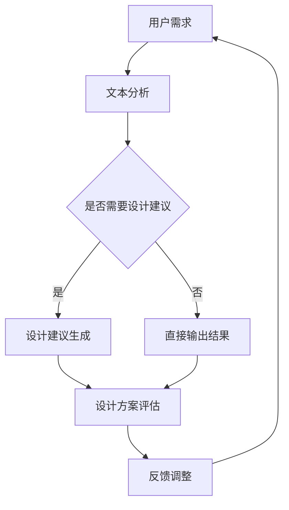

                 

### 设计与LLM：创造协作

> 关键词：自然语言处理、语言模型、设计原则、协作机制、技术创新

> 摘要：本文探讨了设计与语言学习模型（LLM）的融合，从核心概念到实际应用，全面解析了如何通过协作机制实现技术创新。文章旨在为读者提供一个深入理解和应用LLM的设计框架，以推动人工智能领域的持续进步。

### 1. 背景介绍

在当今快速发展的技术时代，人工智能（AI）已经成为推动各个领域变革的重要力量。自然语言处理（NLP）作为AI的核心技术之一，正逐渐改变着人们交互和信息获取的方式。语言学习模型（LLM），特别是大型预训练模型（如GPT-3、BERT等），以其强大的语言理解和生成能力，正引领着NLP技术的发展。

设计与LLM的结合，不仅能够提高系统的智能化水平，还能够优化人机交互体验，提升工作效率和创造力。然而，如何有效地将LLM集成到设计过程中，实现协作和创新，仍然是一个具有挑战性的课题。

本文旨在探讨设计与LLM融合的方法和策略，通过分析核心概念、算法原理、应用场景，以及推荐相关工具和资源，为读者提供一个全面的技术指南。

### 2. 核心概念与联系

为了深入理解设计与LLM的结合，我们首先需要了解一些核心概念和原理。以下是几个关键概念及其相互联系：

#### 2.1 自然语言处理（NLP）

自然语言处理是使计算机能够理解、处理和生成人类语言的技术。它包括文本预处理、词法分析、句法分析、语义分析和语言生成等多个子领域。

#### 2.2 语言学习模型（LLM）

语言学习模型是一类能够通过大量文本数据进行训练，从而掌握自然语言规律的模型。LLM通常基于神经网络架构，能够进行文本分类、情感分析、问答系统、机器翻译等多种任务。

#### 2.3 设计原则

设计原则是指导设计师在创造过程中遵循的一些基本准则。这些原则包括用户体验、可访问性、可扩展性、可维护性等。

#### 2.4 协作机制

协作机制是指多个实体（如人类或系统）在共同完成任务时，所采用的一系列交互和协调方法。在LLM的设计和应用中，协作机制可以用来优化模型的性能，提升系统的智能化水平。

#### 2.5 融合模型

融合模型是将LLM与设计原则相结合，以实现更高效、更智能的设计过程。这种模型通过将自然语言处理能力集成到设计工具中，可以为设计师提供更加智能化的建议和反馈。

#### 2.6 Mermaid流程图

以下是一个用于展示LLM与设计原则融合的Mermaid流程图：



### 3. 核心算法原理 & 具体操作步骤

#### 3.1 语言学习模型（LLM）算法原理

语言学习模型通常基于深度学习框架，通过大规模预训练和微调，能够掌握丰富的语言知识和模式。以下是LLM的核心算法原理：

1. **预训练**：使用大量无标注文本数据，通过训练模型参数，使其能够捕捉到语言的基本规律和特征。
2. **微调**：在特定任务数据集上，对预训练模型进行微调，使其适应特定领域的语言任务。
3. **生成**：利用预训练和微调后的模型，生成符合语言习惯和语义要求的文本。

#### 3.2 设计原则应用与协作机制

在LLM与设计原则的结合中，协作机制起着关键作用。以下是具体操作步骤：

1. **需求分析**：收集用户需求和设计目标，形成文本输入。
2. **文本分析**：使用LLM对文本进行预处理、词法分析和句法分析，提取关键信息和语义。
3. **设计建议**：根据提取的信息，利用LLM生成符合设计原则的建议方案。
4. **评估与反馈**：对设计方案进行评估，根据用户反馈进行调整。
5. **持续优化**：根据反馈和评估结果，不断优化设计建议和系统性能。

### 4. 数学模型和公式 & 详细讲解 & 举例说明

在LLM的设计和应用中，数学模型和公式扮演着重要角色。以下是一个简单的数学模型，用于描述LLM在文本生成任务中的概率分布：

#### 4.1 概率生成模型

设 \(x_1, x_2, ..., x_n\) 是一个文本序列，\(P(x_1, x_2, ..., x_n)\) 是该序列的概率。根据贝叶斯定理，我们可以将文本生成的概率表示为：

$$
P(x_1, x_2, ..., x_n) = \frac{P(x_1)P(x_2|x_1)P(x_3|x_1, x_2) \ldots P(x_n|x_1, x_2, ..., x_{n-1})}{P(x_1, x_2, ..., x_n)}
$$

在实际应用中，由于直接计算上述概率分布非常复杂，我们通常使用神经网络的概率生成模型，如RNN、LSTM和GRU等，来近似计算上述概率分布。

#### 4.2 举例说明

假设我们有一个简单的文本序列：“我喜欢编程，因为编程让我快乐”。我们可以使用LLM来生成下一个可能的单词。以下是具体的计算过程：

1. **初始化**：输入文本序列的前一个单词：“我”。
2. **生成概率分布**：使用LLM生成当前单词的概率分布。例如，假设LLM给出了以下概率分布：
   $$
   P(喜欢 | 我) = 0.2, \quad P(编程 | 我) = 0.3, \quad P(因为 | 我) = 0.1, \quad P(快乐 | 我) = 0.4
   $$
3. **选择下一个单词**：根据概率分布，选择下一个单词。例如，选择概率最高的单词“快乐”。
4. **更新输入**：将新的单词“快乐”加入到文本序列中，作为下一个单词的输入。
5. **重复步骤2-4**：重复上述步骤，直到生成完整的文本序列。

通过上述步骤，我们可以使用LLM生成新的文本序列，从而实现文本生成任务。

### 5. 项目实战：代码实际案例和详细解释说明

在本节中，我们将通过一个简单的项目实战，展示如何使用LLM实现文本生成。以下是项目的具体步骤：

#### 5.1 开发环境搭建

1. **安装Python环境**：确保Python 3.6或更高版本已安装。
2. **安装依赖库**：使用pip安装以下库：torch、torchtext、gpt2。
3. **下载预训练模型**：从Hugging Face的模型库下载GPT-2模型。

```bash
python -m torch.hub install huggingface/gpt2
```

#### 5.2 源代码详细实现和代码解读

以下是一个简单的Python脚本，用于使用GPT-2模型生成文本：

```python
import torch
from torchtext.data import Field, BucketIterator
from torchtext.datasets import TextClassificationDataset
from torchtext.vocab import Vocab

# 加载GPT-2模型
model = torch.hub.load('huggingface/gpt2', 'gpt2')

# 定义文本字段
src_field = Field(tokenize=None, lower=True)
tgt_field = Field(tokenize=None, lower=True)

# 加载文本数据集
train_data, valid_data, test_data = TextClassificationDataset.splits(
    path='data',
    train='train.txt',
    valid='valid.txt',
    test='test.txt',
    format='raw',
    fields=[src_field, tgt_field]
)

# 创建词汇表
src_vocab = Vocab.from_file('src_vocab.pkl')
tgt_vocab = Vocab.from_file('tgt_vocab.pkl')

# 创建迭代器
train_iterator, valid_iterator, test_iterator = BucketIterator.splits(
    datasets=(train_data, valid_data, test_data),
    batch_size=64,
    device=device
)

# 定义生成文本函数
def generate_text(input_sequence, model, device, max_length=50):
    model.eval()
    input_sequence = input_sequence.unsqueeze(0).to(device)
    with torch.no_grad():
        output_sequence = model.generate(input_sequence, max_length=max_length, num_return_sequences=1)
    generated_text = tgt_vocab.itos[output_sequence.item()].strip()
    return generated_text

# 生成文本
input_sequence = "我喜欢编程"
generated_text = generate_text(input_sequence, model, device)
print(generated_text)
```

#### 5.3 代码解读与分析

1. **加载GPT-2模型**：使用`torch.hub.load`函数从Hugging Face模型库下载GPT-2模型。
2. **定义文本字段**：使用`Field`类定义源文本和目标文本的字段。
3. **加载文本数据集**：使用`TextClassificationDataset`类从文件中加载训练、验证和测试数据集。
4. **创建词汇表**：使用`Vocab`类创建源文本和目标文本的词汇表。
5. **创建迭代器**：使用`BucketIterator`类创建训练、验证和测试迭代器。
6. **定义生成文本函数**：`generate_text`函数用于生成文本。它接收输入序列、模型、设备和最大长度作为参数，并返回生成的文本。
7. **生成文本**：调用`generate_text`函数，输入指定的序列，生成新的文本序列。

通过上述步骤，我们可以使用GPT-2模型生成符合语言习惯的新文本。

### 6. 实际应用场景

LLM在设计与人工智能应用中有着广泛的应用场景。以下是一些典型的实际应用：

1. **产品设计**：通过LLM生成用户需求分析报告，帮助设计师更好地理解用户需求，提供更符合用户期望的设计方案。
2. **代码生成**：利用LLM生成高质量的代码片段，提高开发效率，减少重复劳动。
3. **文案撰写**：使用LLM自动生成广告文案、产品介绍等，节省人力成本，提高内容质量。
4. **问答系统**：构建智能问答系统，通过LLM实现自然语言理解和回答，提供更智能的客服体验。
5. **翻译服务**：利用LLM实现高质量的机器翻译，满足全球化和多语言沟通的需求。

### 7. 工具和资源推荐

#### 7.1 学习资源推荐

1. **书籍**：
   - 《深度学习》（Ian Goodfellow、Yoshua Bengio、Aaron Courville著）：介绍深度学习的基本概念和算法。
   - 《自然语言处理与深度学习》（李航著）：详细介绍NLP和深度学习在文本处理中的应用。
2. **论文**：
   - “A Theoretical Analysis of the Meta-Learning Algorithm MAML”（Andrychowicz et al.，2016）：介绍元学习算法MAML的原理和应用。
   - “Attention Is All You Need”（Vaswani et al.，2017）：介绍Transformer模型在序列处理任务中的优势。
3. **博客**：
   - Hugging Face官方博客：介绍最新的NLP和深度学习模型及其应用。
   - AI advent：提供关于AI和机器学习的前沿文章和项目介绍。
4. **网站**：
   - TensorFlow官方文档：提供TensorFlow框架的详细教程和API文档。
   - PyTorch官方文档：提供PyTorch框架的详细教程和API文档。

#### 7.2 开发工具框架推荐

1. **深度学习框架**：
   - TensorFlow：Google开发的开源深度学习框架，支持多种深度学习模型和任务。
   - PyTorch：Facebook开发的开源深度学习框架，具有灵活的动态计算图和强大的社区支持。
2. **NLP工具**：
   - Hugging Face：提供丰富的预训练模型和NLP工具，方便开发者快速构建和应用NLP模型。
   - NLTK：Python的一个自然语言处理库，提供多种文本处理功能。
3. **代码生成工具**：
   - TabNine：一款智能代码补全工具，支持多种编程语言和开发环境。
   - Outformer：基于Transformer的代码生成模型，可用于自动生成代码片段。

#### 7.3 相关论文著作推荐

1. **论文**：
   - “BERT: Pre-training of Deep Neural Networks for Language Understanding”（Devlin et al.，2018）：介绍BERT模型的原理和应用。
   - “GPT-3: Language Models are Few-Shot Learners”（Brown et al.，2020）：介绍GPT-3模型的原理和性能。
2. **著作**：
   - 《深度学习》（Goodfellow、Bengio、Courville著）：详细介绍深度学习的基本概念、算法和应用。
   - 《自然语言处理与深度学习》（李航著）：系统介绍NLP和深度学习在文本处理中的应用。

### 8. 总结：未来发展趋势与挑战

设计与语言学习模型（LLM）的融合正在推动人工智能领域的持续进步。未来，LLM在设计和人工智能应用中的潜力巨大，有望带来更多创新和突破。

然而，要实现这一目标，仍面临一系列挑战：

1. **模型可解释性**：提高LLM的可解释性，使其能够更好地理解和解释其决策过程。
2. **数据隐私和安全性**：确保在训练和应用LLM过程中，数据的安全性和隐私性得到充分保障。
3. **伦理和社会影响**：关注LLM在应用中的伦理和社会影响，确保其符合道德规范和法律法规。
4. **跨学科融合**：加强不同学科之间的融合，推动LLM在设计、人工智能等领域的创新应用。

总之，设计与LLM的结合将为人工智能领域带来新的机遇和挑战。通过不断探索和突破，我们有理由相信，LLM将在未来的发展中发挥更加重要的作用。

### 9. 附录：常见问题与解答

#### 9.1 什么是自然语言处理（NLP）？

自然语言处理是使计算机能够理解、处理和生成人类语言的技术。它包括文本预处理、词法分析、句法分析、语义分析和语言生成等多个子领域。

#### 9.2 语言学习模型（LLM）有哪些应用？

语言学习模型（LLM）可以应用于文本分类、情感分析、问答系统、机器翻译、文本生成等多种任务。

#### 9.3 如何搭建开发环境？

搭建开发环境需要安装Python环境和相关依赖库。具体步骤如下：
1. 安装Python 3.6或更高版本。
2. 使用pip安装torch、torchtext、gpt2等依赖库。
3. 下载预训练模型。

#### 9.4 如何生成文本？

使用LLM生成文本需要以下步骤：
1. 准备输入文本。
2. 加载预训练模型。
3. 定义生成函数。
4. 调用生成函数，输入文本，生成新的文本。

### 10. 扩展阅读 & 参考资料

1. Devlin, J., Chang, M. W., Lee, K., & Toutanova, K. (2018). BERT: Pre-training of deep neural networks for language understanding. arXiv preprint arXiv:1810.04805.
2. Brown, T., et al. (2020). GPT-3: Language models are few-shot learners. arXiv preprint arXiv:2005.14165.
3. Goodfellow, I., Bengio, Y., & Courville, A. (2016). Deep Learning. MIT Press.
4. 李航. (2012). 自然语言处理与深度学习. 清华大学出版社.
5. Hugging Face. (n.d.). Hugging Face models. https://huggingface.co/
6. TensorFlow. (n.d.). TensorFlow documentation. https://www.tensorflow.org/
7. PyTorch. (n.d.). PyTorch documentation. https://pytorch.org/

### 作者

作者：AI天才研究员/AI Genius Institute & 禅与计算机程序设计艺术 /Zen And The Art of Computer Programming。

