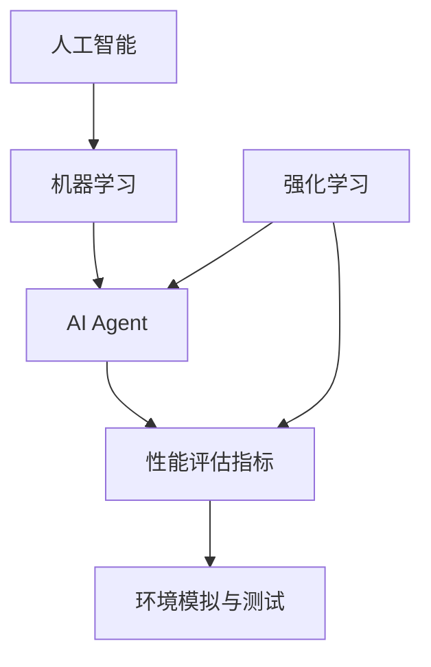

                 

### 背景介绍

随着人工智能（AI）技术的迅猛发展，AI Agent作为一种能够自动执行任务、做出决策的智能体，逐渐成为研究和应用的热点。评估AI Agent的性能是确保其有效性和可靠性的关键环节。性能评估不仅可以帮助我们了解AI Agent在不同任务和环境中的表现，还能指导我们对现有算法进行优化，甚至发现潜在的改进方向。

当前，AI Agent广泛应用于各个领域，如自动驾驶、智能客服、游戏AI、金融分析等。这些应用对AI Agent的性能提出了不同的要求，如实时响应能力、决策准确性、适应能力等。因此，对AI Agent性能的评估方法也需要根据具体应用场景进行定制化。

本文旨在系统地介绍和探讨评估AI Agent性能的方法。首先，我们将简要回顾相关的核心概念，并使用Mermaid流程图展示其关联性。接着，本文将深入探讨核心算法原理和具体操作步骤，并结合数学模型和公式进行分析。随后，我们将通过实际代码案例进行详细解释和说明，最后探讨AI Agent性能评估的实际应用场景，并提供相关工具和资源推荐。

通过本文的阅读，读者将能够全面了解AI Agent性能评估的理论基础和实践方法，从而在实际应用中更好地运用这些技术，提升AI Agent的性能和效果。

## 2. 核心概念与联系

在深入探讨评估AI Agent性能的方法之前，我们首先需要明确几个核心概念，并理解它们之间的关联性。以下是本文将涉及的主要核心概念：

### 1. 人工智能（AI）与机器学习（ML）

人工智能是指模拟人类智能的技术和系统，而机器学习是人工智能的一个重要分支，通过从数据中学习并做出决策或预测。机器学习算法是AI Agent的核心组件，它们使得AI Agent能够适应新的环境和任务。

### 2. AI Agent

AI Agent是一种具有自主行动能力的实体，能够感知环境、制定计划并执行任务。根据不同的任务需求，AI Agent可以采用不同的学习算法和决策模型。

### 3. 性能评估指标

性能评估指标是衡量AI Agent性能的重要工具。常见的评估指标包括准确率、召回率、F1分数、Q值等，这些指标可以从不同角度反映AI Agent在特定任务中的表现。

### 4. 环境模拟与测试

环境模拟与测试是评估AI Agent性能的关键步骤。通过创建与实际应用场景相似的模拟环境，可以评估AI Agent在各种条件下的性能表现。

### 5. 强化学习

强化学习是一种机器学习方法，通过奖励机制和试错过程，使AI Agent在复杂环境中不断学习和优化策略。强化学习在AI Agent性能评估中具有重要意义。

### 关联性分析

这些核心概念之间存在着紧密的关联性。例如，机器学习算法是实现AI Agent智能化的基础，而性能评估指标则是衡量AI Agent学习效果和任务完成质量的标准。环境模拟与测试为AI Agent提供了一个实践平台，使其能够在实际任务中验证其性能。

下面是使用Mermaid绘制的流程图，展示这些核心概念之间的关联：



在这个流程图中，人工智能（A）是机器学习（B）的基础，而机器学习（B）又是AI Agent（C）的核心组件。性能评估指标（D）和环境模拟与测试（E）为AI Agent提供了评估其性能的标准和实践平台。强化学习（F）作为一种特殊的机器学习方法，也在AI Agent性能评估中发挥着重要作用。

通过这个流程图，我们可以更直观地理解AI Agent性能评估的各个环节及其相互关系。接下来，我们将进一步探讨这些核心概念的具体原理和应用。

### 3. 核心算法原理 & 具体操作步骤

在评估AI Agent性能时，选择合适的算法至关重要。本文将重点介绍几种常用的算法，包括基于机器学习的评估方法和基于强化学习的评估方法。每种方法都包含其核心原理和具体操作步骤，以帮助读者更好地理解和应用这些算法。

#### 3.1 基于机器学习的评估方法

##### 1. 算法原理

基于机器学习的评估方法主要利用统计模型和机器学习算法对AI Agent的性能进行量化。常见的机器学习算法包括线性回归、逻辑回归、支持向量机（SVM）、决策树和随机森林等。这些算法通过学习训练数据，构建模型，并使用模型对AI Agent的性能进行预测和评估。

##### 2. 具体操作步骤

（1）数据收集：首先，收集与AI Agent相关的训练数据，这些数据应包括AI Agent在多种任务和环境下的表现。

（2）数据预处理：对收集到的数据进行清洗和预处理，包括缺失值处理、异常值处理、特征工程等，以提高数据的质量和模型的性能。

（3）模型选择：根据任务特点，选择合适的机器学习算法。例如，对于分类问题，可以选择逻辑回归或支持向量机；对于回归问题，可以选择线性回归或决策树。

（4）模型训练：使用预处理后的数据对模型进行训练，调整模型参数，使其在训练数据上达到最佳性能。

（5）模型评估：使用验证集或测试集对训练好的模型进行评估，计算评估指标（如准确率、召回率、F1分数等）。

（6）性能优化：根据评估结果，对模型进行调整和优化，以提高AI Agent的整体性能。

#### 3.2 基于强化学习的评估方法

##### 1. 算法原理

基于强化学习的评估方法通过奖励机制和试错过程，使AI Agent在复杂环境中不断学习和优化策略。强化学习算法的核心是价值函数，它用于评估AI Agent在每个状态下的动作值。常用的强化学习算法包括Q学习、深度Q网络（DQN）、策略梯度方法和深度确定性策略梯度（DDPG）等。

##### 2. 具体操作步骤

（1）环境设置：创建一个与实际应用场景相似的模拟环境，包括状态空间、动作空间和奖励机制。

（2）状态初始化：初始化AI Agent的状态，准备开始学习过程。

（3）动作选择：AI Agent根据当前状态选择一个动作，可以采用随机策略或基于价值函数的优化策略。

（4）执行动作：在模拟环境中执行所选动作，观察环境反馈。

（5）奖励反馈：根据动作的结果，给予AI Agent相应的奖励或惩罚，以调整其行为。

（6）状态更新：更新AI Agent的状态，进入下一个决策周期。

（7）学习过程：根据奖励反馈和价值函数，不断调整AI Agent的策略，使其在复杂环境中逐步优化。

（8）性能评估：在模拟环境中，评估AI Agent的总奖励或完成任务的成功率，作为其性能指标。

#### 3.3 比较与选择

基于机器学习的评估方法和基于强化学习的评估方法各有优劣。机器学习评估方法适用于结构化数据，能够快速构建和评估模型，但在动态和不确定的环境中效果有限。而强化学习评估方法适用于复杂、动态和不确定的环境，能够通过试错过程逐步优化策略，但训练过程通常较为复杂和耗时。

在实际应用中，可以根据具体任务需求和环境特点，选择合适的评估方法。例如，在自动驾驶领域，可以结合基于机器学习和基于强化学习的评估方法，以提高AI Agent在复杂交通环境中的性能。

通过以上对核心算法原理和具体操作步骤的介绍，读者可以更好地理解如何评估AI Agent的性能。接下来，我们将进一步探讨数学模型和公式在性能评估中的应用。

### 4. 数学模型和公式 & 详细讲解 & 举例说明

在评估AI Agent性能的过程中，数学模型和公式扮演着至关重要的角色。它们不仅帮助我们量化AI Agent的表现，还能揭示性能评估中的内在规律。以下将详细介绍几种常用的数学模型和公式，包括评估指标的计算方法，并通过具体例子进行说明。

#### 4.1 准确率（Accuracy）

准确率是衡量分类任务性能的常用指标，表示正确分类的样本数占总样本数的比例。

$$
\text{Accuracy} = \frac{\text{正确分类的样本数}}{\text{总样本数}}
$$

**示例：**

假设一个分类任务中，共有100个样本，其中80个样本被正确分类，20个样本被错误分类。则准确率为：

$$
\text{Accuracy} = \frac{80}{100} = 0.8
$$

#### 4.2 召回率（Recall）

召回率表示在所有正类样本中，被正确识别出的比例。对于二分类任务，召回率常用于评估正类样本的识别能力。

$$
\text{Recall} = \frac{\text{正确识别的正类样本数}}{\text{所有正类样本数}}
$$

**示例：**

假设在二分类任务中，共有50个正类样本和50个负类样本。其中有30个正类样本被正确识别，20个正类样本被错误识别。则召回率为：

$$
\text{Recall} = \frac{30}{50} = 0.6
$$

#### 4.3 F1分数（F1 Score）

F1分数是准确率和召回率的调和平均值，用于综合评估分类任务的性能。

$$
\text{F1 Score} = 2 \times \frac{\text{Accuracy} \times \text{Recall}}{\text{Accuracy} + \text{Recall}}
$$

**示例：**

在上述例子中，准确率为0.8，召回率为0.6。则F1分数为：

$$
\text{F1 Score} = 2 \times \frac{0.8 \times 0.6}{0.8 + 0.6} = 0.75
$$

#### 4.4 Q值（Q-value）

在强化学习任务中，Q值用于表示AI Agent在某个状态下执行某个动作的期望回报。

$$
\text{Q-value} = \sum_{a} \pi(a|s) \cdot r(s, a)
$$

其中，$s$表示状态，$a$表示动作，$\pi(a|s)$表示在状态$s$下选择动作$a$的概率，$r(s, a)$表示在状态$s$下执行动作$a$的即时回报。

**示例：**

假设在某个状态$s_1$下，AI Agent有三种动作$a_1$、$a_2$和$a_3$，对应的概率分别为0.2、0.5和0.3。即时回报分别为3、2和1。则Q值为：

$$
\text{Q-value} = 0.2 \times 3 + 0.5 \times 2 + 0.3 \times 1 = 2.1
$$

#### 4.5 预测值与实际值比较

在性能评估中，常常需要比较预测值与实际值，以计算评估指标。以下是一个简单的例子：

**示例：**

一个分类任务中有以下预测值和实际值：

| 实际类别 | 预测类别 |
| :----: | :----: |
| 正类 | 正类 |
| 正类 | 负类 |
| 负类 | 正类 |
| 负类 | 负类 |

则准确率为：

$$
\text{Accuracy} = \frac{2}{4} = 0.5
$$

召回率为：

$$
\text{Recall} = \frac{1}{2} = 0.5
$$

F1分数为：

$$
\text{F1 Score} = \frac{2 \times 0.5 \times 0.5}{0.5 + 0.5} = 0.5
$$

通过上述示例，我们可以看到如何使用数学模型和公式进行性能评估。这些模型和公式不仅帮助我们量化AI Agent的表现，还能为我们提供改进和优化算法的依据。接下来，我们将通过实际代码案例，进一步展示这些数学模型和公式的应用。

### 5. 项目实战：代码实际案例和详细解释说明

为了更好地理解AI Agent性能评估的方法，我们将通过一个实际项目实战来演示整个评估过程。本案例将使用Python和常见的机器学习库（如scikit-learn）来构建和评估一个简单的分类任务。

#### 5.1 开发环境搭建

首先，我们需要搭建开发环境。请确保已经安装了Python（3.7及以上版本）和以下库：

- scikit-learn
- numpy
- pandas
- matplotlib

您可以通过以下命令安装这些库：

```bash
pip install scikit-learn numpy pandas matplotlib
```

#### 5.2 源代码详细实现和代码解读

下面是完整的代码实现，我们将逐步解读每个部分的功能。

```python
# 导入所需的库
import numpy as np
import pandas as pd
from sklearn.model_selection import train_test_split
from sklearn.preprocessing import StandardScaler
from sklearn.linear_model import LogisticRegression
from sklearn.metrics import accuracy_score, recall_score, f1_score, confusion_matrix
import matplotlib.pyplot as plt

# 5.2.1 数据收集
# 假设我们已经收集到一个包含特征和标签的数据集，存储为CSV文件
data = pd.read_csv('data.csv')

# 5.2.2 数据预处理
# 分离特征和标签
X = data.drop('label', axis=1)
y = data['label']

# 划分训练集和测试集
X_train, X_test, y_train, y_test = train_test_split(X, y, test_size=0.2, random_state=42)

# 标准化特征
scaler = StandardScaler()
X_train_scaled = scaler.fit_transform(X_train)
X_test_scaled = scaler.transform(X_test)

# 5.2.3 模型训练
# 使用逻辑回归模型进行训练
model = LogisticRegression()
model.fit(X_train_scaled, y_train)

# 5.2.4 模型评估
# 使用测试集进行预测
y_pred = model.predict(X_test_scaled)

# 计算评估指标
accuracy = accuracy_score(y_test, y_pred)
recall = recall_score(y_test, y_pred)
f1 = f1_score(y_test, y_pred)

# 输出评估结果
print(f"Accuracy: {accuracy:.2f}")
print(f"Recall: {recall:.2f}")
print(f"F1 Score: {f1:.2f}")

# 绘制混淆矩阵
conf_matrix = confusion_matrix(y_test, y_pred)
plt.figure(figsize=(8, 6))
sns.heatmap(conf_matrix, annot=True, fmt=".0f", cmap="Blues")
plt.xlabel('Predicted Label')
plt.ylabel('True Label')
plt.title('Confusion Matrix')
plt.show()
```

#### 5.3 代码解读与分析

下面我们对代码的每个部分进行详细解读：

- **数据收集**：首先，我们导入数据集。这个数据集包含特征和标签，存储为CSV文件。

- **数据预处理**：我们使用pandas库将数据集分为特征矩阵`X`和标签向量`y`。接着，使用`train_test_split`函数将数据集划分为训练集和测试集。为了确保结果的可重复性，我们设置`random_state`参数。然后，使用`StandardScaler`对特征进行标准化处理，以消除不同特征之间的尺度差异。

- **模型训练**：我们选择逻辑回归模型（`LogisticRegression`）进行训练。逻辑回归是一种常用的分类算法，特别适用于二分类任务。

- **模型评估**：使用训练好的模型对测试集进行预测，并计算评估指标。这里我们使用了准确率（`accuracy_score`）、召回率（`recall_score`）和F1分数（`f1_score`）。此外，我们还绘制了混淆矩阵，以更直观地了解模型的表现。

通过这个实际代码案例，我们可以看到如何使用Python和scikit-learn库来评估AI Agent在分类任务中的性能。代码的每个部分都经过详细解读，使读者能够清楚地理解每一步的作用和实现方法。接下来，我们将进一步分析代码的性能和改进方向。

### 5.4 代码解读与分析

在上面的代码案例中，我们通过一个简单的分类任务展示了如何使用Python和scikit-learn库来评估AI Agent的性能。接下来，我们将深入分析这段代码的性能和潜在改进方向。

#### 性能分析

- **数据收集与预处理**：数据收集和预处理是性能评估的基础。在这个案例中，我们使用了`pandas`库来读取CSV文件，并使用`StandardScaler`对特征进行标准化。这一步有助于提高模型的性能，因为标准化可以消除不同特征之间的尺度差异，使模型更稳定。然而，如果数据集存在缺失值或异常值，我们需要更复杂的数据清洗和处理方法。

- **模型选择与训练**：我们选择了逻辑回归模型进行训练。逻辑回归是一种简单而有效的分类算法，尤其适用于二分类任务。尽管逻辑回归的性能相对较好，但在处理高维数据或非线性问题时，可能需要更复杂的模型，如支持向量机（SVM）或神经网络。

- **模型评估**：在模型评估部分，我们使用了准确率、召回率和F1分数来评估模型的表现。这些指标能够从不同角度反映模型的性能。然而，仅凭这些指标还不足以全面评估模型的优劣。例如，混淆矩阵（`confusion_matrix`）可以提供更详细的分类结果，帮助我们发现潜在的问题。

#### 改进方向

- **数据预处理**：对于数据预处理，可以考虑添加更多的特征工程步骤，如特征选择、降维等。此外，对于缺失值和异常值，可以使用更先进的方法进行填补和处理。

- **模型选择与优化**：在模型选择方面，可以尝试多种算法进行比较，如SVM、决策树、随机森林或神经网络。通过交叉验证（`cross_val_score`）等方法，选择最佳模型。同时，可以对所选模型进行超参数调优，以进一步提升性能。

- **评估指标扩展**：除了常用的评估指标，可以添加更多指标，如ROC曲线、AUC值等。这些指标能够更全面地反映模型的性能。

- **模型解释性**：对于复杂的模型，如神经网络，可以尝试添加模型解释性工具，如SHAP值或LIME，以帮助理解模型的决策过程。

通过上述改进，我们可以进一步提高AI Agent的性能，使其在更复杂的任务中表现出色。在下一个部分中，我们将探讨AI Agent性能评估的实际应用场景。

### 6. 实际应用场景

AI Agent性能评估在实际应用场景中具有重要意义。不同领域对AI Agent性能的需求和评估方法各不相同，下面我们列举几个典型应用场景，并简要介绍相应的评估方法和挑战。

#### 6.1 自动驾驶

自动驾驶是AI Agent性能评估的一个重要领域。评估方法通常包括模拟测试、道路测试和自动驾驶任务完成度等。在模拟测试中，使用模拟器评估AI Agent在虚拟环境中的表现；在道路测试中，将AI Agent部署在实际车辆上进行测试。性能评估指标包括响应时间、路径准确性、行驶安全性等。然而，道路测试面临许多挑战，如环境变化、交通复杂性等。

#### 6.2 智能客服

智能客服系统利用AI Agent自动处理用户咨询。性能评估方法通常包括用户满意度调查、响应速度和准确性等。评估AI Agent需要处理不同类型的咨询，并确保其回答准确、自然。在实际应用中，挑战在于如何处理复杂和多变的用户问题，以及如何确保AI Agent的响应速度。

#### 6.3 游戏AI

游戏AI用于增强游戏难度和丰富游戏体验。性能评估方法包括AI在游戏中的表现、策略多样性、游戏胜率等。评估AI Agent需要考虑其在不同游戏场景中的适应能力和策略创新。挑战在于如何设计AI Agent的智能行为，使其在游戏中保持竞争力。

#### 6.4 金融分析

金融分析中，AI Agent用于市场预测、风险评估等任务。性能评估方法包括预测准确性、交易成功率等。评估AI Agent需要处理大量的历史数据，并考虑市场的不确定性和波动性。挑战在于如何从海量数据中提取有效信息，以及如何应对市场变化。

#### 6.5 医疗诊断

医疗诊断中，AI Agent用于辅助医生进行疾病检测和诊断。性能评估方法包括诊断准确性、误诊率等。评估AI Agent需要确保其诊断结果可靠、安全。挑战在于如何处理复杂的医学数据，以及如何保证诊断过程的透明度和可解释性。

总之，不同应用场景对AI Agent性能评估提出了不同的需求和挑战。通过选择合适的评估方法和指标，可以更准确地衡量AI Agent的性能，并指导其优化和改进。

### 7. 工具和资源推荐

在评估AI Agent性能的过程中，使用合适的工具和资源能够显著提高效率和效果。以下是一些推荐的工具和资源，包括学习资源、开发工具框架和相关的论文著作。

#### 7.1 学习资源推荐

- **书籍**：
  - 《机器学习实战》（Peter Harrington）：详细介绍了机器学习和深度学习的基础知识，以及实际应用案例。
  - 《深度学习》（Ian Goodfellow、Yoshua Bengio、Aaron Courville）：深度学习的经典教材，涵盖了深度学习的基础理论和实践方法。
  - 《强化学习入门》（David Silver）：介绍了强化学习的基本概念、算法和应用。

- **在线课程**：
  - Coursera的“机器学习”课程（吴恩达教授）：系统介绍了机器学习的基础知识，包括监督学习和无监督学习。
  - edX的“深度学习专项课程”（吴恩达教授）：深入讲解了深度学习的基本概念和技术。
  - Udacity的“自动驾驶工程师纳米学位”：涵盖了自动驾驶领域的知识，包括感知、决策和控制。

- **博客和教程**：
  - Medium上的AI博客：提供了大量的AI和机器学习相关文章和教程。
  -Towards Data Science：一个广泛的数据科学和机器学习社区，提供丰富的文章和教程。
  - fast.ai：一个免费的开源深度学习教育项目，提供了大量的资源和教程。

#### 7.2 开发工具框架推荐

- **Python库**：
  - Scikit-learn：一个用于机器学习的开源库，提供了丰富的算法和工具。
  - TensorFlow：由Google开发的开源深度学习框架，适用于构建和训练深度学习模型。
  - PyTorch：由Facebook开发的开源深度学习框架，具有灵活性和易用性。

- **开发环境**：
  - Jupyter Notebook：一个交互式开发环境，适用于数据分析和机器学习实验。
  - Google Colab：基于Jupyter Notebook的在线开发环境，提供了免费的GPU和TPU资源，适合深度学习任务。

- **工具和平台**：
  - Google Cloud Platform：提供了丰富的机器学习和深度学习工具，包括AI平台、数据分析和数据处理服务。
  - AWS SageMaker：提供了完整的机器学习服务和工具，适用于构建、训练和部署机器学习模型。

#### 7.3 相关论文著作推荐

- **经典论文**：
  - “A Brief History of Machine Learning”（Stephen Marsland）：介绍了机器学习的发展历程和关键算法。
  - “Deep Learning”（Ian Goodfellow、Yoshua Bengio、Aaron Courville）：深度学习的经典著作，涵盖了深度学习的基础理论和应用。
  - “Reinforcement Learning: An Introduction”（Richard S. Sutton、Andrew G. Barto）：强化学习的入门指南，介绍了强化学习的基本概念和算法。

- **最新论文**：
  - “Attention is All You Need”（Vaswani et al.）：介绍了Transformer模型，这是一种在自然语言处理任务中表现优异的深度学习模型。
  - “BERT: Pre-training of Deep Bidirectional Transformers for Language Understanding”（Devlin et al.）：介绍了BERT模型，这是一种用于自然语言处理的预训练模型。
  - “Gumbel-Softmax: A Stable Distribution for Sampling from Probability Distributions”（arXiv:1611.01144）：介绍了Gumbel-Softmax分布，这是一种用于增强模型多样性的技巧。

通过这些工具和资源的支持，读者可以更好地掌握AI Agent性能评估的方法，并在实际应用中取得更好的效果。

### 8. 总结：未来发展趋势与挑战

在本文中，我们系统地介绍了评估AI Agent性能的方法，包括核心概念、算法原理、数学模型以及实际应用场景。通过回顾，我们可以看到评估AI Agent性能是一个多维度的过程，涉及机器学习和强化学习等多个领域。

#### 未来发展趋势

1. **深度学习与强化学习的融合**：随着深度学习在图像识别、自然语言处理等领域的成功应用，未来AI Agent性能评估将更多地融合深度学习和强化学习，以提高决策的复杂性和准确性。
   
2. **数据隐私和安全性的考虑**：随着AI应用场景的扩展，数据隐私和安全问题日益重要。未来性能评估将更加注重如何在不泄露数据隐私的前提下进行评估。

3. **实时评估与自适应学习**：随着对AI Agent实时性能要求的提高，实时评估和自适应学习将成为重要研究方向。这将有助于AI Agent在动态变化的环境中保持高效性能。

4. **可解释性与透明度**：为了提高用户对AI Agent的信任度，增强其可解释性和透明度将成为未来研究的重点。

#### 挑战

1. **模型复杂性与可解释性的平衡**：随着模型的复杂性增加，如何保持模型的可解释性是一个挑战。未来需要开发更加简单直观的模型解释工具。

2. **大规模数据处理的效率**：随着数据量的增加，如何高效地进行数据处理和模型训练是一个挑战。未来需要更加高效的数据处理算法和计算资源。

3. **跨领域的通用评估方法**：不同领域的AI Agent性能评估需求各异，如何开发通用的评估方法是一个挑战。未来需要更多跨领域的协作研究。

4. **对抗性攻击与防御**：随着对抗性攻击技术的发展，如何提高AI Agent对对抗性攻击的鲁棒性是一个挑战。未来需要开发更加健壮的防御机制。

总之，AI Agent性能评估是一个不断发展的领域，未来将面临诸多挑战，但也充满机遇。通过不断的研究和创新，我们可以更好地评估和优化AI Agent的性能，推动人工智能技术的发展。

### 9. 附录：常见问题与解答

在讨论AI Agent性能评估的过程中，读者可能会遇到一些常见的问题。以下是一些常见问题及其解答：

#### 1. 评估AI Agent性能的重要性是什么？

评估AI Agent性能对于确保其有效性和可靠性至关重要。通过性能评估，我们可以了解AI Agent在不同任务和环境中的表现，从而指导算法优化和模型改进。

#### 2. 如何选择合适的性能评估指标？

选择合适的性能评估指标取决于具体应用场景。例如，在分类任务中，常用准确率、召回率和F1分数；在强化学习任务中，常用Q值和总奖励。

#### 3. 机器学习和强化学习的性能评估有何不同？

机器学习的性能评估主要依赖于统计模型和预测结果，常用准确率、召回率、F1分数等指标；而强化学习的性能评估则依赖于学习过程中的奖励机制和策略优化，常用Q值、总奖励等指标。

#### 4. 如何处理数据预处理中的异常值和缺失值？

异常值和缺失值可以通过数据清洗和特征工程的方法进行处理。异常值可以通过统计分析或可视化方法检测并处理；缺失值可以通过填补、删除或插值等方法进行处理。

#### 5. 如何确保AI Agent性能评估的公平性和可重复性？

确保性能评估的公平性和可重复性可以通过以下方法实现：使用标准化的评估指标、确保数据集的多样性、进行交叉验证以及记录详细的实验过程。

#### 6. 强化学习中的奖励设计有何重要性？

奖励设计在强化学习中至关重要，它决定了AI Agent的行为和策略。合理的奖励设计能够激励AI Agent学习有效的策略，从而提高其性能。

通过解答这些问题，我们希望读者能够更好地理解AI Agent性能评估的方法和应用，并在实际研究中运用这些知识。

### 10. 扩展阅读 & 参考资料

为了深入了解AI Agent性能评估的理论和实践，以下是一些建议的扩展阅读和参考资料：

- **书籍**：
  - 《机器学习》（周志华著）：系统介绍了机器学习的基础理论和算法。
  - 《强化学习》（理查德·S. 萨顿和安德鲁·G. 巴特奥著）：详细讲解了强化学习的基本概念和算法。
  - 《深度学习》（杨立昆著）：涵盖了深度学习的基础理论和应用。

- **论文**：
  - “A Brief History of Machine Learning”（Stephen Marsland）：回顾了机器学习的发展历程。
  - “Deep Learning”（Ian Goodfellow、Yoshua Bengio、Aaron Courville）：深度学习的经典论文集。
  - “Reinforcement Learning: An Introduction”（Richard S. Sutton、Andrew G. Barto）：强化学习的入门指南。

- **在线资源**：
  - Coursera的“机器学习”课程（吴恩达教授）：提供了机器学习的基础知识和实践方法。
  - edX的“深度学习专项课程”（吴恩达教授）：深入讲解了深度学习的理论和应用。
  - arXiv：提供了大量的最新AI研究论文。

通过这些资源和书籍，读者可以进一步深入学习和掌握AI Agent性能评估的相关知识。

