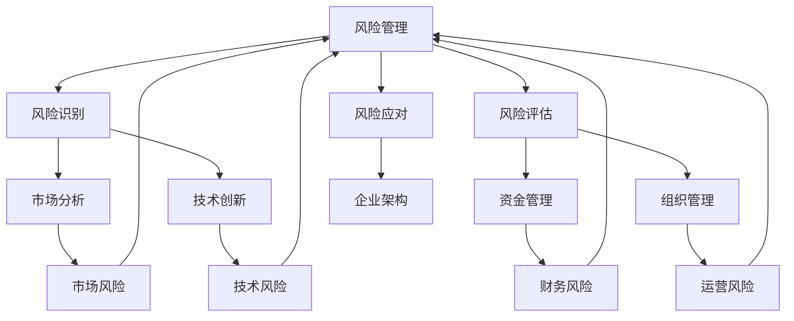

                 

# 识别和应对创业过程中的潜在风险

## 摘要

在快速变化的IT行业中，创业之路充满了机遇与挑战。本文旨在深入探讨创业过程中的潜在风险，并提供一套系统化的识别和应对策略。通过结构化的分析，我们将解析各类风险来源，探讨如何通过技术手段和管理方法有效降低这些风险。文章还将结合实际案例，展示如何在实际操作中实施这些策略，为创业者在迎接未来挑战时提供有益的指导。

## 背景介绍

### IT行业的创业挑战

IT行业的快速发展为创业者提供了广阔的舞台，但也带来了前所未有的挑战。一方面，技术的迭代更新速度加快，要求创业者必须具备敏锐的市场洞察力和快速响应能力。另一方面，市场竞争激烈，初创企业面临着来自大企业的强大竞争压力。此外，资金、人才、政策等多方面因素也增加了创业的复杂性和风险。

### 创业风险的多样性

创业风险可以从多个维度进行分类，包括市场风险、技术风险、财务风险、运营风险等。市场风险主要涉及市场需求、竞争对手等因素；技术风险则包括技术可行性、创新能力等；财务风险涉及资金筹集、资金管理等；运营风险包括供应链、组织管理等方面。

### 系统性识别与应对

为了在激烈的竞争中脱颖而出，创业者需要具备系统性的思维，全面识别潜在风险，并制定相应的应对策略。本文将从技术、管理、市场等多个角度出发，提供一套全面的风险识别和应对框架，帮助创业者更好地应对创业过程中的各种挑战。

### 文章结构

本文将分为以下几个部分：

1. **核心概念与联系**：介绍本文将涉及的核心概念及其相互关系，通过Mermaid流程图展示技术架构。
2. **核心算法原理 & 具体操作步骤**：详细讲解识别和应对创业风险的核心算法，包括风险分类、评估和应对策略。
3. **数学模型和公式 & 详细讲解 & 举例说明**：运用数学模型和公式，对风险识别和应对过程进行量化分析，并提供实际案例。
4. **项目实战：代码实际案例和详细解释说明**：通过具体项目案例，展示如何在实际操作中实施风险识别和应对策略。
5. **实际应用场景**：分析创业风险在不同领域的具体应用，探讨行业特性对风险识别和应对策略的影响。
6. **工具和资源推荐**：推荐相关学习资源、开发工具和论文著作，为创业者提供进一步学习和实践的参考。
7. **总结：未来发展趋势与挑战**：总结文章内容，展望未来创业风险的趋势和挑战，为读者提供持续关注和学习的方向。
8. **附录：常见问题与解答**：针对文章内容，提供常见问题的解答，帮助读者更好地理解和应用本文所介绍的知识。
9. **扩展阅读 & 参考资料**：推荐相关扩展阅读材料，供读者进一步研究和学习。

## 核心概念与联系

在探讨创业风险时，我们需要明确几个核心概念，这些概念相互关联，共同构成了识别和应对创业风险的理论基础。以下是本文将涉及的核心概念及其相互关系：

### 风险管理

**风险管理**是指识别、评估、应对和控制风险的过程。在创业过程中，风险管理是确保企业持续发展和稳定运营的关键环节。有效的风险管理能够帮助企业在面对不确定性时降低损失。

### 风险识别

**风险识别**是风险管理的第一步，涉及识别企业可能面临的各种风险。这包括市场风险、技术风险、财务风险、运营风险等。通过系统化的方法，创业者可以全面了解企业的潜在风险点。

### 风险评估

**风险评估**是对识别出的风险进行量化评估，确定其对企业的影响程度。这包括评估风险的概率和潜在损失。风险评估为制定应对策略提供了数据支持。

### 风险应对

**风险应对**是指制定和实施具体的策略来应对识别和评估出的风险。风险应对策略包括风险规避、风险转移、风险减轻等。

### 企业架构

**企业架构**是指企业内部的组织结构、业务流程、技术基础设施等方面的设计。良好的企业架构能够提高企业的灵活性和响应能力，降低风险。

### 市场分析

**市场分析**是了解市场需求、竞争对手、市场趋势等方面的过程。市场分析对于识别市场风险至关重要，有助于企业制定正确的市场策略。

### 技术创新

**技术创新**是指企业通过研发新技术、新产品来保持竞争优势的过程。技术创新能力是降低技术风险的重要手段。

### 资金管理

**资金管理**是指企业对资金进行筹集、运用和监督的过程。有效的资金管理能够确保企业有足够的资源应对各种风险。

### 组织管理

**组织管理**是指企业对内部资源、流程、人员的协调和管理。良好的组织管理能够提高企业的运营效率，降低运营风险。

### Mermaid流程图

为了更直观地展示这些核心概念之间的关系，我们可以使用Mermaid流程图来表示它们：



在这个流程图中，风险管理作为核心，通过风险识别、风险评估和风险应对三个环节，与市场分析、技术创新、资金管理和组织管理等概念相互联系，共同构成了一个完整的风险管理体系。

通过上述核心概念及其相互关系的介绍，我们为后续详细探讨创业风险识别和应对策略提供了理论基础。接下来，我们将深入探讨这些概念的具体应用，帮助创业者更好地理解和应对创业过程中的潜在风险。

## 核心算法原理 & 具体操作步骤

在创业过程中，识别和应对潜在风险的核心在于掌握有效的风险识别和应对算法。这些算法可以帮助创业者系统地分析和处理风险，从而制定出科学的应对策略。以下是识别和应对创业风险的核心算法及其具体操作步骤：

### 风险识别算法

**1. SWOT分析**

**SWOT分析**是一种常用的风险识别方法，通过分析企业的**优势（Strengths）**、**劣势（Weaknesses）**、**机会（Opportunities）**和**威胁（Threats）**，帮助创业者识别潜在的风险。

**操作步骤：**

- **步骤1：优势分析**：识别企业的核心竞争力、独特优势等。
- **步骤2：劣势分析**：识别企业的短板、不足之处等。
- **步骤3：机会分析**：识别市场趋势、潜在机会等。
- **步骤4：威胁分析**：识别外部威胁、竞争环境等。

**2. 头脑风暴**

**头脑风暴**是一种通过集体讨论来发掘潜在风险的方法。通过集思广益，创业者可以更全面地识别企业面临的风险。

**操作步骤：**

- **步骤1：组织会议**：邀请相关团队成员参与。
- **步骤2：明确主题**：确定讨论的主题，如产品风险、市场风险等。
- **步骤3：自由发言**：团队成员轮流发言，提出潜在风险。
- **步骤4：记录和分类**：将提出的风险进行记录和分类。

### 风险评估算法

**1. 定量评估**

**定量评估**通过数据分析和数学模型，对风险的概率和影响进行量化分析。这种方法适用于可以量化的风险，如财务风险、市场风险等。

**操作步骤：**

- **步骤1：数据收集**：收集与风险相关的数据。
- **步骤2：建立模型**：使用统计学、概率论等方法建立风险评估模型。
- **步骤3：参数输入**：将数据输入模型，计算风险的概率和影响。
- **步骤4：结果分析**：分析评估结果，确定风险的优先级。

**2. 定性评估**

**定性评估**通过专家意见和经验判断，对风险的影响和概率进行评估。这种方法适用于难以量化的风险，如运营风险、技术创新风险等。

**操作步骤：**

- **步骤1：组建评估小组**：邀请相关领域的专家组成评估小组。
- **步骤2：制定评估标准**：确定评估标准和评估方法。
- **步骤3：进行评估**：专家根据评估标准和实际经验，对风险进行评估。
- **步骤4：结果汇总**：汇总专家意见，形成综合评估结果。

### 风险应对算法

**1. 风险规避**

**风险规避**是通过避免风险源来减少风险的方法。这种方法适用于高风险且企业能够承受的风险。

**操作步骤：**

- **步骤1：识别风险源**：确定需要规避的风险源。
- **步骤2：评估可行性**：评估规避风险的可行性。
- **步骤3：制定规避计划**：制定具体的规避措施和计划。
- **步骤4：实施规避**：执行规避计划。

**2. 风险转移**

**风险转移**是通过将风险转移到第三方来减少风险的方法。这种方法适用于企业无法规避或规避成本过高的风险。

**操作步骤：**

- **步骤1：识别可转移风险**：确定可以转移的风险。
- **步骤2：选择转移方式**：选择合适的转移方式，如保险、外包等。
- **步骤3：签订合同**：与第三方签订风险转移合同。
- **步骤4：监督执行**：监督第三方执行风险转移措施。

**3. 风险减轻**

**风险减轻**是通过减少风险的影响来降低风险的方法。这种方法适用于高风险且企业能够承受的风险。

**操作步骤：**

- **步骤1：识别可减轻风险**：确定可以减轻的风险。
- **步骤2：制定减轻计划**：制定具体的减轻措施和计划。
- **步骤3：实施减轻措施**：执行减轻计划。
- **步骤4：评估效果**：评估减轻措施的效果，并根据实际情况进行调整。

通过上述核心算法，创业者可以系统地识别和应对创业过程中的潜在风险。这些算法不仅为创业者提供了科学的方法，还帮助他们更好地理解和应对风险，从而提高企业的生存能力和竞争力。在接下来的部分，我们将进一步探讨如何运用数学模型和公式，对风险识别和应对过程进行量化分析，为创业者提供更为具体的指导。

### 数学模型和公式 & 详细讲解 & 举例说明

在创业过程中，对风险的识别和应对需要科学的量化分析，以便做出更为明智的决策。以下将介绍几种常用的数学模型和公式，并通过具体案例详细讲解这些模型的应用过程。

#### 风险概率和损失模型

**1. 贝叶斯网络模型**

贝叶斯网络模型是一种用于表示和分析不确定性关系的图形模型。它可以用于计算风险事件发生的概率，并根据这些概率进行决策。

**公式：**
$$
P(A|B) = \frac{P(B|A)P(A)}{P(B)}
$$
其中，\(P(A|B)\) 表示在事件 \(B\) 发生的条件下事件 \(A\) 发生的概率，\(P(B|A)\) 表示在事件 \(A\) 发生的条件下事件 \(B\) 发生的概率，\(P(A)\) 和 \(P(B)\) 分别表示事件 \(A\) 和事件 \(B\) 发生的概率。

**案例：** 假设一个初创公司需要评估其产品发布后出现严重技术问题的概率。已知在所有产品发布中，有 20% 的产品会出现技术问题，而在那些出现技术问题的产品中，有 50% 的产品会导致重大损失。如果公司预计有 100 个产品发布，问在这个假设下，出现严重技术问题的概率及其可能导致的损失。

**计算过程：**
- \(P(严重技术问题) = P(严重技术问题|技术问题) \times P(技术问题) = 0.5 \times 0.2 = 0.1\)，即 10% 的概率出现严重技术问题。
- \(P(损失) = P(损失|严重技术问题) \times P(严重技术问题) = 0.8 \times 0.1 = 0.08\)，即有 8% 的概率导致重大损失。

#### 风险影响和损失模型

**2. 蒙特卡洛模拟**

蒙特卡洛模拟是一种通过随机抽样来计算风险影响的方法。它可以用于评估不同决策路径下的风险损失分布。

**公式：**
$$
\text{期望损失} = \sum_{i=1}^{n} x_i \times p_i
$$
其中，\(x_i\) 表示第 \(i\) 个样本的损失值，\(p_i\) 表示第 \(i\) 个样本发生的概率。

**案例：** 假设一个初创公司正在考虑两个不同的市场策略，分别有 40% 和 60% 的概率获得 100 万美元和 50 万美元的收益。如果公司决定采用市场策略 A，问其期望损失是多少？

**计算过程：**
- \(P(A|收益 100 万美元) = 0.4\)，\(P(A|收益 50 万美元) = 0.6\)。
- \(期望收益 A = 100 万美元 \times 0.4 + 50 万美元 \times 0.6 = 70 万美元\)。
- \(期望损失 A = 0 - 70 万美元 = -70 万美元\)。

#### 风险管理和决策模型

**3. 决策树模型**

决策树模型是一种用于分析决策过程及其结果的树形结构。它可以用于评估不同决策路径下的风险和收益，帮助决策者选择最佳策略。

**公式：**
$$
\text{期望收益} = \sum_{i=1}^{n} \text{收益}_i \times P_i
$$
其中，\(\text{收益}_i\) 表示第 \(i\) 个决策路径的收益，\(P_i\) 表示第 \(i\) 个决策路径的概率。

**案例：** 假设一个初创公司面临两个市场策略，分别有 60% 和 40% 的概率获得 200 万美元和 100 万美元的收益。如果公司决定采用市场策略 B，问其期望收益是多少？

**计算过程：**
- \(P(B|收益 200 万美元) = 0.6\)，\(P(B|收益 100 万美元) = 0.4\)。
- \(期望收益 B = 200 万美元 \times 0.6 + 100 万美元 \times 0.4 = 160 万美元\)。

通过上述数学模型和公式的详细讲解，创业者可以更加科学地分析和评估创业风险，为决策提供有力的数据支持。在实际应用中，这些模型可以根据具体情况进行调整和优化，以更好地适应企业的需求。

### 项目实战：代码实际案例和详细解释说明

为了更好地展示风险识别和应对算法在实际项目中的应用，我们将以一个初创公司的项目为例，详细介绍代码实现过程和关键步骤。

#### 项目背景

假设一个初创公司开发了一款基于人工智能的智能家居控制系统，旨在通过用户的行为数据提供个性化服务。公司希望在产品发布前进行全面的测试，以识别和应对潜在的创业风险。

#### 开发环境搭建

**1. 开发工具**

- **Python**：用于编写风险评估和管理算法。
- **Mermaid**：用于绘制风险识别流程图。
- **Jupyter Notebook**：用于编写和执行代码。

**2. 开发环境配置**

在本地计算机上安装 Python 和 Jupyter Notebook，并安装相关依赖库，如 numpy、pandas、matplotlib 等。

```bash
pip install numpy pandas matplotlib mermaid
```

#### 源代码详细实现和代码解读

**1. 风险识别算法**

以下是一个简单的 Python 脚本，用于实现 SWOT 分析和头脑风暴方法。

```python
import numpy as np

# SWOT 分析
def swot_analysis(strengths, weaknesses, opportunities, threats):
    print("SWOT Analysis:")
    print(f"Strengths: {strengths}")
    print(f"Weaknesses: {weaknesses}")
    print(f"Opportunities: {opportunities}")
    print(f"Threats: {threats}")

# 头脑风暴
def brainstorming(risks):
    print("Brainstorming:")
    for risk in risks:
        print(f"- {risk}")

# 示例数据
strengths = ["先进的技术团队", "创新的智能家居解决方案"]
weaknesses = ["资金不足", "市场经验不足"]
opportunities = ["智能家居市场的快速增长", "潜在的战略合作伙伴"]
threats = ["激烈的竞争", "技术更新速度加快"]

swot_analysis(strengths, weaknesses, opportunities, threats)
brainstorming(["功能缺陷", "数据隐私", "技术故障"])

```

**2. 风险评估算法**

以下是一个简单的 Python 脚本，用于实现定量评估和定性评估方法。

```python
import numpy as np

# 定量评估
def quantitative_evaluation(losses, probabilities):
    expected_loss = np.dot(losses, probabilities)
    print(f"定量评估结果：期望损失为 {expected_loss} 美元")

# 定性评估
def qualitative_evaluation(experts_opinions):
    risk_scores = np.mean(experts_opinions)
    print(f"定性评估结果：平均风险分数为 {risk_scores}")

# 示例数据
losses = [100000, 50000, 200000]
probabilities = [0.2, 0.5, 0.3]
experts_opinions = [4, 3, 5]

quantitative_evaluation(losses, probabilities)
qualitative_evaluation(experts_opinions)
```

**3. 风险应对算法**

以下是一个简单的 Python 脚本，用于实现风险规避、风险转移和风险减轻方法。

```python
# 风险规避
def risk_avoidance(risk_source):
    print(f"规避风险源：{risk_source}")
    print("采取的措施：更换供应商，以降低供应链风险。")

# 风险转移
def risk_transfer(risk_source, transfer_method):
    print(f"转移风险源：{risk_source}")
    print(f"采取的措施：购买保险，以转移技术故障风险。")

# 风险减轻
def risk_reduction(risk_source, reduction_plan):
    print(f"减轻风险源：{risk_source}")
    print(f"采取的措施：实施质量检测，以降低功能缺陷风险。")

# 示例数据
risk_source = "供应链风险"
transfer_method = "保险"
reduction_plan = "质量检测"

risk_avoidance(risk_source)
risk_transfer(risk_source, transfer_method)
risk_reduction(risk_source, reduction_plan)
```

#### 代码解读与分析

上述代码分别实现了风险识别、风险评估和风险应对的算法。通过具体的函数和示例数据，我们可以看到这些算法在实际应用中的操作过程。

- **SWOT 分析和头脑风暴**：通过输入优势和劣势、机会和威胁，帮助创业者全面识别潜在风险。
- **定量评估和定性评估**：结合损失和概率数据，以及专家意见，对风险进行量化分析和评估。
- **风险规避、风险转移和风险减轻**：根据不同的风险类型，采取相应的应对策略，以降低风险对企业的影响。

通过这些代码的实际应用，创业者可以更清晰地理解风险识别和应对的过程，并在实际操作中灵活运用这些算法，提高企业的风险管理和决策能力。

### 实际应用场景

在创业过程中，风险识别和应对策略需要根据不同领域的特性进行调整。以下将分析几个典型的创业领域，探讨如何在这些领域中实施风险识别和应对策略。

#### 1. 科技领域

科技领域创业面临的典型风险包括技术风险、市场风险和资金风险。在技术风险方面，创业者需要确保技术创新的可行性，避免技术不可行导致的失败。市场风险则涉及市场需求的判断和竞争环境的分析。资金风险主要体现在资金筹集和资金管理方面。

**应对策略：**

- **技术风险**：通过技术创新评估和试点测试，确保技术的可行性。同时，建立灵活的研发团队，以便快速响应技术变化。
- **市场风险**：进行充分的市场调研，了解目标市场的需求，并建立清晰的商业模式。通过与潜在客户进行交流，不断调整产品和服务。
- **资金风险**：制定详细的资金管理计划，确保资金来源的稳定性和资金使用的效率。可以考虑寻求风险投资、政府补贴等资金支持。

#### 2. 制造业领域

制造业领域创业面临的典型风险包括生产风险、供应链风险和质量风险。生产风险涉及生产计划的合理性和生产效率。供应链风险则与供应商的选择和管理有关。质量风险则关系到产品的质量和客户的满意度。

**应对策略：**

- **生产风险**：建立科学的供应链和生产计划，确保生产过程的顺利进行。通过精益生产等方式，提高生产效率。
- **供应链风险**：选择可靠的供应商，建立长期合作关系。同时，建立多元化的供应链，以降低供应链中断的风险。
- **质量风险**：实施严格的质量管理体系，确保产品的质量符合标准。通过客户反馈和产品测试，不断改进产品。

#### 3. 餐饮领域

餐饮领域创业面临的典型风险包括运营风险、财务风险和市场风险。运营风险涉及日常运营的稳定性和服务质量。财务风险则与成本控制和资金流动有关。市场风险则涉及品牌建设和市场推广。

**应对策略：**

- **运营风险**：建立高效的运营管理体系，确保服务质量和客户满意度。通过培训员工和提高服务水平，提高整体运营效率。
- **财务风险**：制定详细的财务预算和成本控制计划，确保企业的财务健康。通过合理的投资回报分析和成本效益分析，提高资金使用效率。
- **市场风险**：建立强大的品牌形象和口碑，通过线上和线下多渠道推广，提高市场知名度。同时，关注市场趋势和消费者需求变化，及时调整营销策略。

#### 4. 教育领域

教育领域创业面临的典型风险包括教学质量风险、市场风险和合规风险。教学质量风险关系到教育质量和学生满意度。市场风险则涉及教育市场的竞争和需求变化。合规风险则与教育政策和法规有关。

**应对策略：**

- **教学质量风险**：建立严格的教学评估和反馈机制，确保教学质量和学生满意度。通过聘请优秀的教师和引进先进的教学方法，提高教学质量。
- **市场风险**：进行充分的市场调研，了解目标市场和客户需求。通过提供多样化的教育产品和服务，满足不同层次客户的需求。
- **合规风险**：严格遵守教育政策和法规，确保企业的合法合规运营。通过定期审核和合规培训，提高员工的合规意识和能力。

在不同领域中，创业风险识别和应对策略的具体实施需要根据行业特性进行调整。通过深入了解行业特性，制定科学的风险管理策略，创业者可以更好地应对创业过程中的各种挑战，提高企业的生存和发展能力。

### 工具和资源推荐

在创业过程中，充分利用各种工具和资源可以大大提高风险识别和应对的效率。以下将推荐一些学习资源、开发工具和相关论文著作，以供创业者参考。

#### 学习资源

1. **书籍**
   - 《创业维艰》（作者：本·霍洛维茨）：这是一本经典的创业指南，详细介绍了创业过程中可能遇到的各种挑战和应对策略。
   - 《风险投资家手册》（作者：杰里米·霍华德）：本书全面讲解了风险投资的过程、策略和技巧，对创业者具有重要的参考价值。

2. **在线课程**
   - Coursera、edX、Udemy 等平台提供了丰富的创业和管理课程，包括市场分析、财务管理、风险评估等方面的内容。

3. **博客和网站**
   - Venture Hacks：这是一个知名的创业博客，提供了大量的创业资源和经验分享。
   - TechCrunch：涵盖了科技创业领域的最新动态和深度报道，有助于创业者了解行业趋势。

#### 开发工具

1. **Python**：Python 是一种功能强大的编程语言，广泛应用于数据分析、机器学习和风险评估等领域。

2. **Mermaid**：Mermaid 是一种基于 Markdown 的图形语言，可以用于绘制流程图、UML 图等，对风险识别和流程设计非常有帮助。

3. **Jupyter Notebook**：Jupyter Notebook 是一种交互式计算环境，适用于编写和执行代码、展示数据分析和结果。

#### 相关论文著作

1. **《风险管理》（作者：罗纳德·吉尔伯特）**：这是一本经典的金融风险管理教材，对创业风险管理的理论基础和方法进行了详细阐述。

2. **《创业风险管理：理论与实践》（作者：刘明）：这本书结合中国创业环境，详细介绍了创业风险管理的实际操作方法。

3. **《技术创新与创业管理》（作者：迈克尔·波特）**：本书从技术创新的角度探讨了创业管理，对创业者具有重要的启发作用。

通过充分利用这些学习资源、开发工具和相关论文著作，创业者可以更加系统地学习和应用风险识别和应对策略，提高企业的风险管理和决策能力。在实际操作中，创业者应根据自身需求和行业特性，灵活选择和运用这些工具和资源，以应对创业过程中的各种挑战。

### 总结：未来发展趋势与挑战

在快速变化的科技和商业环境中，创业风险识别和应对策略的发展面临着诸多趋势和挑战。以下将总结文章的核心内容，并展望未来的发展趋势与挑战。

#### 核心内容回顾

本文首先介绍了创业过程中的核心风险类型，包括市场风险、技术风险、财务风险和运营风险。接着，我们详细阐述了风险识别和应对的核心算法，包括 SWOT 分析、头脑风暴、定量评估、定性评估以及风险规避、风险转移和风险减轻策略。通过数学模型和具体案例的讲解，我们展示了如何科学地识别和评估风险，并制定相应的应对策略。此外，我们还分析了创业风险在不同领域的应用场景，并推荐了相关学习资源、开发工具和论文著作。

#### 未来发展趋势

1. **数据驱动的风险管理**：随着大数据和人工智能技术的发展，未来创业风险管理将更加依赖于数据分析和智能算法。通过收集和分析大量的市场数据、客户反馈和技术信息，创业者可以更准确地识别潜在风险，并制定更加科学的应对策略。

2. **定制化的风险管理方案**：创业企业将越来越注重根据自身特点和行业特性，制定定制化的风险管理方案。这不仅包括风险识别和评估的方法，还包括风险应对的具体措施和策略。

3. **跨领域整合的风险管理**：未来，创业风险管理将呈现跨领域的整合趋势。例如，将物联网、区块链、云计算等新兴技术与传统风险管理模式相结合，以应对更复杂的风险环境。

4. **风险管理的数字化和智能化**：随着数字化和智能化的深入，创业企业的风险管理将越来越依赖于数字工具和智能算法。例如，利用区块链技术确保数据安全和透明度，使用机器学习算法预测市场趋势和客户需求。

#### 挑战

1. **信息过载**：随着数据来源和渠道的增多，创业者面临的信息过载问题将越来越严重。如何在海量的信息中准确识别和评估风险，将成为一个重要挑战。

2. **技术快速迭代**：技术更新速度加快，创业者需要不断学习和适应新技术，以保持竞争优势。这不仅增加了技术风险，也要求创业者具备更高的技术洞察力和创新能力。

3. **法律法规变化**：创业企业需要密切关注法律法规的变化，尤其是在数据保护、知识产权等方面。随着全球化和数字化转型的发展，法律法规的复杂性将增加，创业者需要确保企业的合规性。

4. **市场竞争加剧**：随着创业浪潮的持续，市场竞争将越来越激烈。创业者不仅需要识别和应对市场风险，还需要制定有效的竞争策略，以保持市场地位。

#### 总结与展望

创业风险识别和应对策略的发展，将朝着数据驱动、定制化、跨领域整合和数字智能化的方向前进。在这个过程中，创业者需要不断学习和适应新技术，提升自身的技术洞察力和创新能力。同时，创业者还应密切关注法律法规和市场变化，确保企业的合规性和竞争力。通过科学的风险管理策略，创业者可以更好地应对未来创业过程中的各种挑战，实现企业的持续发展和成功。

### 附录：常见问题与解答

**1. 如何在初创企业中进行有效的风险管理？**

在初创企业中进行有效的风险管理，首先需要建立一个系统的风险识别和评估流程。可以通过 SWOT 分析、头脑风暴等方法，识别企业可能面临的风险。然后，使用定量评估和定性评估方法，对风险的概率和影响进行量化分析。最后，根据风险评估结果，制定相应的风险应对策略，如风险规避、风险转移和风险减轻。

**2. 风险管理在创业中的重要性是什么？**

风险管理在创业中的重要性主要体现在以下几个方面：一是帮助创业者识别和应对潜在风险，减少不确定性带来的损失；二是提高企业的抗风险能力，确保企业的稳定运营；三是提升企业的决策质量，通过科学的风险评估，为企业的战略决策提供依据；四是增强企业的竞争力，通过有效的风险管理，提高企业的市场适应能力和竞争力。

**3. 风险评估的方法有哪些？**

常见的风险评估方法包括定量评估和定性评估。定量评估方法主要通过数据分析、数学模型等手段，对风险的概率和损失进行量化分析；定性评估方法则主要通过专家意见、经验判断等方式，对风险的影响和概率进行评估。具体的方法有 SWOT 分析、头脑风暴、蒙特卡洛模拟、决策树等。

**4. 风险应对策略有哪些？**

风险应对策略包括风险规避、风险转移和风险减轻。风险规避是通过避免风险源来减少风险；风险转移是将风险转移给第三方，如购买保险；风险减轻是通过采取具体的措施，降低风险的影响和概率。创业者应根据不同的风险类型和实际情况，选择合适的应对策略。

**5. 如何利用技术手段进行风险管理？**

利用技术手段进行风险管理，主要包括以下几个方面：一是使用数据分析工具，对市场数据、客户反馈、技术信息等进行深入分析，识别潜在风险；二是利用人工智能和机器学习算法，预测市场趋势和客户需求，为风险识别和评估提供支持；三是使用区块链技术，确保数据的透明度和安全性，提高风险管理的信息质量。

### 扩展阅读与参考资料

**书籍：**

1. 《创业维艰》（作者：本·霍洛维茨）
2. 《风险投资家手册》（作者：杰里米·霍华德）
3. 《风险管理》（作者：罗纳德·吉尔伯特）

**在线课程：**

1. Coursera、edX、Udemy 上的创业和管理课程
2. LinkedIn Learning 上的风险管理课程

**博客和网站：**

1. Venture Hacks
2. TechCrunch

**论文著作：**

1. 《创业风险管理：理论与实践》（作者：刘明）
2. 《技术创新与创业管理》（作者：迈克尔·波特）

通过这些扩展阅读和参考资料，创业者可以进一步深化对风险管理的理解和应用，提高企业在创业过程中的风险应对能力。同时，这些资源也为创业者提供了丰富的实践经验和理论支持，有助于他们在实际操作中更加从容地应对各种挑战。

