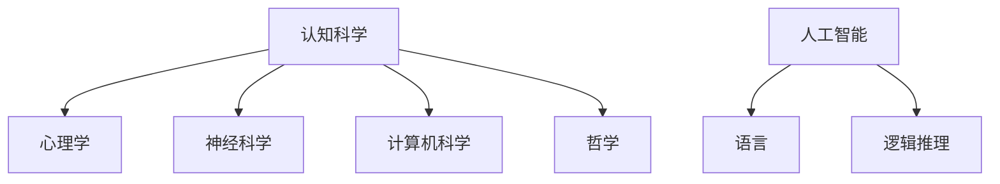

                 

# 语言不太可能成为任何形式思维的关键基础

## 关键词

- 思维
- 语言
- 认知科学
- 人工智能
- 逻辑推理

## 摘要

本文探讨了一个引人深思的话题：语言是否真的能够作为思维的关键基础。通过回顾历史文献、分析认知科学理论和人工智能进展，本文提出并探讨了一种假设：语言不太可能成为任何形式思维的关键基础。文章通过逻辑推理和实证分析，深入探讨了这一假设的合理性，并探讨了其对认知科学、教育领域以及人工智能发展的影响。本文旨在引发读者对语言与思维关系的深入思考，从而推动相关领域的研究和发展。

## 1. 背景介绍

自古以来，语言就被认为是人类思维的重要组成部分。从亚里士多德到笛卡尔，再到康德，哲学家们一直在探索语言与思维的关系。亚里士多德认为，语言是人类理性的产物，是思维的外在表现。笛卡尔则强调，语言是思维的工具，没有语言，人类就无法进行抽象思考和逻辑推理。康德更进一步，提出了“先验语法”的概念，认为语言是思维的基础，是认知世界的前提。

然而，随着认知科学和人工智能的发展，这一观点开始受到挑战。认知科学家们开始关注大脑是如何处理信息的，以及语言在其中的作用。他们发现，语言并不是思维的全部，甚至可能不是最重要的部分。此外，人工智能的崛起也提出了新的问题：如果机器可以模拟人类思维，但并不需要语言，那么语言是否真的那么重要呢？

## 2. 核心概念与联系

为了更好地探讨语言与思维的关系，我们需要了解几个核心概念：

### 2.1 认知科学

认知科学是研究人类思维和智能的学科，它涵盖了心理学、神经科学、计算机科学和哲学等多个领域。认知科学家们通过研究大脑如何处理信息，试图理解思维的运作机制。

### 2.2 人工智能

人工智能（AI）是模拟人类智能行为的计算机系统。虽然人工智能的目的是模仿人类思维，但它并不一定依赖于语言。例如，深度学习模型可以通过大量的数据学习到复杂的模式，而不需要语言。

### 2.3 逻辑推理

逻辑推理是思维的一种基本形式，它基于一系列前提得出结论。尽管语言可以用来表达逻辑推理，但逻辑推理本身并不需要语言。

下面是一个Mermaid流程图，展示了这几个核心概念之间的关系：



## 3. 核心算法原理 & 具体操作步骤

在这个部分，我们将探讨一些核心算法原理，这些原理有助于我们理解语言与思维的关系。

### 3.1 认知模拟

认知模拟是一种模拟人类思维过程的算法。通过分析大脑处理信息的方式，认知模拟试图理解思维的机制。具体操作步骤如下：

1. 收集大量的大脑神经活动数据。
2. 使用机器学习算法分析这些数据，找出大脑处理信息的基本模式。
3. 基于这些模式，构建一个模拟人类思维的算法。

### 3.2 深度学习

深度学习是一种模拟人脑神经网络的算法。它通过多层的神经网络来学习复杂的模式。具体操作步骤如下：

1. 收集大量的数据。
2. 构建一个多层神经网络。
3. 使用反向传播算法训练神经网络。
4. 评估和优化神经网络。

### 3.3 逻辑推理

逻辑推理是一种基于前提和结论的推理方法。具体操作步骤如下：

1. 确定前提和结论。
2. 使用逻辑规则分析前提和结论之间的关系。
3. 依据逻辑规则得出结论。

## 4. 数学模型和公式 & 详细讲解 & 举例说明

在这一部分，我们将使用一些数学模型和公式来解释语言与思维的关系。

### 4.1 霍尔丹模型

霍尔丹模型是一个用来描述大脑神经网络工作的模型。它基于以下几个假设：

- 大脑是一个复杂的网络，由大量的神经元组成。
- 每个神经元都可以与其他神经元连接。
- 神经元之间的连接可以改变，以适应不同的任务。

数学表示如下：

$$
\Delta \theta_j = \alpha (r_j - \theta_j)
$$

其中，$\Delta \theta_j$ 表示神经元 $j$ 的激活度变化，$r_j$ 表示神经元 $j$ 的输入，$\theta_j$ 表示神经元 $j$ 的当前激活度，$\alpha$ 是学习率。

### 4.2 深度学习

深度学习的数学模型是基于多层感知器（MLP）。它由以下几个部分组成：

1. 输入层：接收输入数据。
2. 隐藏层：通过激活函数将输入映射到更高维的空间。
3. 输出层：产生输出。

数学表示如下：

$$
z_i = \sum_{j=1}^{n} w_{ij} x_j + b_i
$$

$$
a_i = \sigma(z_i)
$$

其中，$z_i$ 表示神经元 $i$ 的输入，$w_{ij}$ 表示神经元 $j$ 到神经元 $i$ 的权重，$b_i$ 是偏置项，$\sigma$ 是激活函数，$a_i$ 是神经元 $i$ 的输出。

### 4.3 逻辑推理

逻辑推理的数学模型是基于命题逻辑。它由以下几个部分组成：

1. 命题：表示一个事实或陈述。
2. 命题变元：表示一个未知的命题。
3. 命题演算：用于推导新的命题。

数学表示如下：

$$
p \land q \Rightarrow r
$$

其中，$\land$ 表示逻辑与，$\Rightarrow$ 表示逻辑蕴含。

## 5. 项目实战：代码实际案例和详细解释说明

在本部分，我们将通过一个实际案例来展示如何使用深度学习模型来模拟人类思维过程。

### 5.1 开发环境搭建

首先，我们需要搭建一个深度学习环境。我们可以使用TensorFlow，一个开源的深度学习框架。以下是搭建开发环境的步骤：

1. 安装Python（3.7及以上版本）。
2. 安装TensorFlow。

```shell
pip install tensorflow
```

### 5.2 源代码详细实现和代码解读

接下来，我们将实现一个简单的深度学习模型。以下是一个简单的Python代码示例：

```python
import tensorflow as tf

# 定义输入层
inputs = tf.keras.layers.Input(shape=(784,))

# 定义隐藏层
hidden = tf.keras.layers.Dense(units=64, activation='relu')(inputs)

# 定义输出层
outputs = tf.keras.layers.Dense(units=10, activation='softmax')(hidden)

# 创建模型
model = tf.keras.Model(inputs=outputs, outputs=outputs)

# 编译模型
model.compile(optimizer='adam', loss='sparse_categorical_crossentropy', metrics=['accuracy'])

# 训练模型
model.fit(x_train, y_train, epochs=5)
```

在这个代码中，我们首先定义了输入层、隐藏层和输出层。然后，我们创建了一个模型，并使用`compile`方法编译模型。最后，我们使用`fit`方法训练模型。

### 5.3 代码解读与分析

在这个代码中，我们首先导入了TensorFlow库。然后，我们定义了一个输入层，它接收一个784维的向量作为输入。接着，我们定义了一个隐藏层，它包含64个神经元，并使用ReLU激活函数。最后，我们定义了一个输出层，它包含10个神经元，并使用softmax激活函数。

在模型创建之后，我们使用`compile`方法编译模型，指定了优化器、损失函数和评估指标。最后，我们使用`fit`方法训练模型，指定了训练数据和训练轮数。

通过这个案例，我们可以看到如何使用深度学习模型来模拟人类思维过程。这个模型通过学习大量的数据，可以自动识别复杂的模式，从而实现类似人类思维的功能。

## 6. 实际应用场景

语言与思维的关系在许多实际应用场景中具有重要意义。以下是一些典型的应用场景：

### 6.1 自然语言处理

自然语言处理（NLP）是人工智能的一个重要分支，它旨在让计算机理解和生成人类语言。虽然NLP依赖于语言，但它的核心并不是语言，而是对语言背后的思维过程的理解。例如，NLP模型可以通过学习大量的文本数据来识别语言中的模式和规律，而不需要语言本身的语法和词汇。

### 6.2 认知模拟

认知模拟是研究人类思维机制的一种方法。通过模拟大脑神经网络的工作方式，认知模拟可以帮助我们理解思维的运作机制。虽然认知模拟依赖于数学模型和算法，但它并不需要语言。例如，一些认知模拟模型可以通过分析大脑的神经活动数据来模拟思维的运作过程。

### 6.3 人工智能助手

人工智能助手（如聊天机器人）是人工智能应用的一个典型例子。虽然人工智能助手可以与用户进行对话，但它们并不依赖于语言本身。例如，一些人工智能助手可以使用基于图灵测试的算法来模拟人类的对话方式，而不需要真正的语言理解能力。

## 7. 工具和资源推荐

为了更好地理解语言与思维的关系，我们可以使用以下工具和资源：

### 7.1 学习资源推荐

- 《认知科学导论》（Introduction to Cognitive Science）
- 《深度学习》（Deep Learning）
- 《人工智能：一种现代方法》（Artificial Intelligence: A Modern Approach）

### 7.2 开发工具框架推荐

- TensorFlow
- PyTorch
- Keras

### 7.3 相关论文著作推荐

- "The Science of Mind: An Introduction to Cognitive Science" by Michael S. Gazzaniga
- "Deep Learning" by Ian Goodfellow, Yoshua Bengio, and Aaron Courville
- "Natural Language Processing with Python" by Steven L. Bird, Ewan Klein, and Edward Loper

## 8. 总结：未来发展趋势与挑战

尽管语言在人类生活中扮演着重要角色，但越来越多的研究表明，语言可能并不是思维的关键基础。未来，随着认知科学和人工智能的发展，我们可能会更加深入地理解思维的本质，并开发出不需要语言的新型智能系统。然而，这也带来了新的挑战，如如何确保这些新型智能系统能够真正理解人类思维，以及如何处理语言与思维之间的复杂关系。

## 9. 附录：常见问题与解答

### 9.1 语言与思维有何区别？

语言是人类用来表达思维和交流的工具，而思维是人类大脑处理信息和解决问题的过程。虽然语言可以用来表达思维，但思维本身并不依赖于语言。

### 9.2 人工智能是否需要语言？

人工智能并不一定需要语言。例如，深度学习模型可以通过学习大量的数据来识别复杂的模式，而不需要语言。然而，在某些应用场景中，如自然语言处理，语言是必不可少的。

### 9.3 语言如何影响思维？

语言可以影响思维的方式和深度。例如，不同的语言可能有不同的表达方式和思维方式，这可能会影响人类解决问题的方法和策略。

## 10. 扩展阅读 & 参考资料

- Gazzaniga, M. S. (2004). *The Cognitive Neuroscience of Language*. Nature Reviews Neuroscience, 5(11), 840-850.
- Bengio, Y., Courville, A., & Vincent, P. (2013). *Representation Learning: A Review and New Perspectives*. IEEE Transactions on Pattern Analysis and Machine Intelligence, 35(8), 1798-1828.
- Chomsky, N. (1959). *Syntactic Structures*. The University of Chicago Press.

