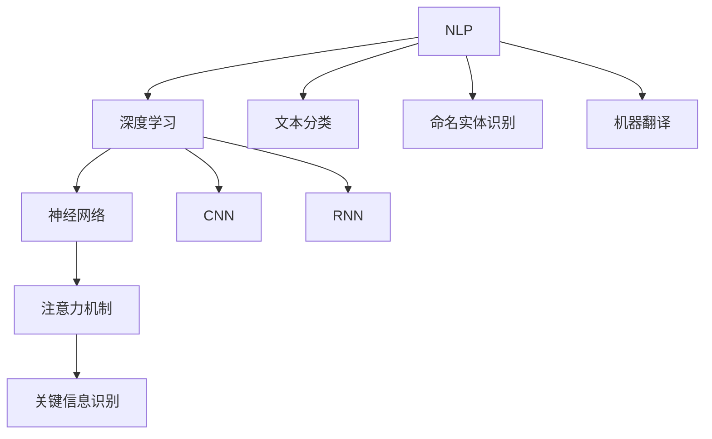

                 

### 背景介绍

在当今科技迅猛发展的时代，人工智能（AI）已经渗透到我们生活的方方面面。从日常的智能手机应用，到复杂的医疗诊断系统，再到自动驾驶汽车，人工智能的应用范围不断扩大。然而，随着人工智能技术的不断进步，一个不可忽视的问题也逐渐凸显出来：大模型的语言理解和推理能力。

所谓的“大模型”，通常指的是拥有数万亿参数的深度学习模型，如OpenAI的GPT-3，以及Google的BERT等。这些模型在处理大量数据并生成高质量文本方面表现出了惊人的能力。然而，尽管它们在许多任务上取得了显著成就，但这些模型在理解和推理语言方面的表现却并不完美。

语言理解和推理是人类认知的重要组成部分。我们能够理解复杂的句子结构，推断出句子中的隐含意义，甚至能够进行抽象思维和逻辑推理。然而，当这些任务交由人工智能模型完成时，我们却发现它们在处理复杂语境、理解多义词和进行抽象推理时遇到了困难。这种现象被称为“认知困惑”（cognitive perplexity）。

本文将深入探讨大模型在语言理解和推理方面的困惑，分析其背后的原因，并探讨可能的解决方法。我们将从以下几个方面展开讨论：

1. **大模型的语言理解能力**：首先，我们将回顾大模型在语言理解方面所取得的进展，介绍其主要算法原理和应用实例。
2. **认知困惑现象**：接着，我们将介绍“认知困惑”的概念，探讨大模型在处理复杂语境、多义词和抽象推理时遇到的困难。
3. **原因分析**：然后，我们将分析导致大模型认知困惑的多个因素，包括算法设计、数据质量、模型架构等。
4. **解决方法**：最后，我们将探讨一些可能的解决方法，包括改进算法、增强数据多样性、调整模型架构等。

通过本文的讨论，我们希望能够为读者提供一个全面、深入的视角，帮助理解大模型在语言理解和推理方面的挑战，并探索未来的发展方向。

### 核心概念与联系

要深入探讨大模型在语言理解和推理方面的困惑，我们首先需要了解一些核心概念和它们之间的联系。这些概念包括自然语言处理（NLP）、深度学习、神经网络、注意力机制等。下面我们将逐一介绍这些概念，并使用Mermaid流程图来展示它们之间的关系。

#### 自然语言处理（NLP）

自然语言处理是计算机科学和人工智能领域的一个分支，主要研究如何使计算机理解和解释人类自然语言。它涉及多个子领域，如语言识别、文本分类、情感分析、机器翻译和问答系统等。NLP的目标是使计算机能够处理、理解和生成自然语言，从而实现人与机器的有效沟通。

#### 深度学习

深度学习是机器学习的一个子领域，它通过模拟人脑中的神经网络结构和功能来实现复杂的任务。深度学习模型通常包含多层神经网络，通过逐层学习数据特征，从而实现从简单到复杂的特征提取。在NLP任务中，深度学习模型如卷积神经网络（CNN）和循环神经网络（RNN）被广泛应用于文本分类、命名实体识别和序列标注等任务。

#### 神经网络

神经网络是由大量相互连接的节点（或称为“神经元”）组成的计算模型。每个节点接收输入信号，通过加权求和处理后，产生输出信号。神经网络通过学习输入和输出之间的映射关系，实现对数据的分类、回归和其他任务。在NLP中，神经网络被用于表示文本数据，提取文本特征，从而实现语言理解任务。

#### 注意力机制

注意力机制是深度学习中的一个关键概念，用于提高模型对重要信息的关注程度。在NLP任务中，注意力机制可以帮助模型识别句子中的关键信息，从而提高语言理解和推理的准确性。例如，在机器翻译任务中，注意力机制可以使模型在生成翻译时更加关注源句子中的关键词汇。

#### Mermaid流程图

下面是一个Mermaid流程图，展示了NLP、深度学习、神经网络和注意力机制之间的关系：



在这个流程图中，NLP作为核心概念，连接了深度学习、神经网络和注意力机制。深度学习和神经网络负责处理文本数据，提取特征，而注意力机制则用于提高模型对关键信息的关注程度，从而实现更准确的文本理解。

通过了解这些核心概念和它们之间的联系，我们可以更好地理解大模型在语言理解和推理方面的困惑，并为进一步的分析提供基础。

#### 核心算法原理 & 具体操作步骤

为了深入理解大模型在语言理解和推理方面的困惑，我们需要探讨一些关键算法原理，这些算法在大规模文本处理和生成任务中发挥着核心作用。以下将介绍深度学习中的Transformer架构和预训练-微调（Pre-training and Fine-tuning）方法，以及它们在NLP任务中的具体操作步骤。

##### Transformer架构

Transformer架构是由Google在2017年提出的一种用于序列模型处理的新型神经网络架构，它在许多NLP任务中取得了显著的效果。与传统的循环神经网络（RNN）和长短期记忆网络（LSTM）相比，Transformer采用了自注意力机制（Self-Attention）和编码器-解码器结构（Encoder-Decoder），使其在处理长文本序列和并行计算方面具有优势。

**自注意力机制**：自注意力机制允许模型在生成每个输出时，自动关注输入序列中的不同位置。通过计算输入序列中每个词与所有其他词之间的相似性权重，模型能够根据这些权重来生成具有更高相关性的输出。自注意力机制通过多头注意力（Multi-Head Attention）和多层堆叠（Stacked Layers）进一步增强了模型的表示能力和并行计算能力。

**编码器-解码器结构**：编码器（Encoder）用于处理输入序列，解码器（Decoder）用于生成输出序列。编码器将输入序列编码为固定长度的向量表示，解码器则利用编码器的输出和先前生成的词来预测下一个词。通过这种方式，编码器-解码器结构使得模型能够捕捉长距离依赖关系，从而在生成任务中表现出色。

**具体操作步骤**：

1. **编码**：输入序列经过编码器处理，每个词被映射为固定长度的向量表示。编码器包含多个堆叠的Transformer层，每层包括多头自注意力机制和前馈神经网络。
   
2. **自注意力计算**：在每层中，编码器首先计算自注意力权重，即输入序列中每个词与所有其他词之间的相似性权重。然后，根据这些权重对输入序列进行加权求和，得到新的序列表示。

3. **前馈神经网络**：在自注意力机制之后，每个词的表示向量通过两个前馈神经网络进行进一步处理，这些神经网络分别包含一个线性变换和一个ReLU激活函数。

4. **解码**：解码器在生成输出序列时，使用编码器的输出和先前生成的词来计算解码注意力权重。解码器同样包含多个堆叠的Transformer层，每层包括多头解码注意力机制和多头自注意力机制。

5. **生成输出**：解码器根据解码注意力权重生成每个输出词，并更新当前词的表示。生成的新词作为输入传递到下一层解码器，直到生成完整的输出序列。

##### 预训练-微调（Pre-training and Fine-tuning）

预训练-微调是当前NLP任务中广泛采用的一种方法。预训练阶段使用大量无标签文本数据，训练一个通用的语言表示模型；微调阶段则利用特定领域的数据对预训练模型进行微调，以适应特定任务的需求。

**预训练**：预训练阶段主要包括两个任务：masked language modeling（MLM）和next sentence prediction（NSP）。MLM任务通过随机遮盖输入序列中的词，并要求模型预测这些词的表示；NSP任务则通过预测两个句子是否属于同一段落。预训练使得模型能够学习到丰富的语言知识，从而在微调阶段表现出更高的性能。

**微调**：微调阶段使用特定领域的数据集，对预训练模型进行微调，以适应特定的NLP任务，如文本分类、命名实体识别和机器翻译等。微调过程通常包括以下步骤：

1. **数据准备**：收集并预处理特定领域的数据集，包括文本和标签。
   
2. **模型初始化**：使用预训练模型作为基础模型，初始化微调任务中的参数。

3. **训练**：在微调阶段，模型通过反向传播和梯度下降算法，不断调整参数，以最小化损失函数。

4. **评估**：在训练过程中，定期评估模型在验证集上的性能，以避免过拟合。

5. **调整超参数**：根据验证集的性能，调整学习率、批量大小和其他超参数，以优化模型性能。

通过预训练-微调方法，模型能够在不同任务中表现出色，同时避免了从头训练所需的大量计算资源和时间。

##### 具体操作示例

下面以一个简单的文本分类任务为例，展示预训练-微调的具体操作步骤。

**预训练阶段**：

1. **数据集**：使用含有新闻文章和标签的公开数据集，如AG News数据集。
2. **模型**：使用预训练的Transformer模型，如BERT或GPT。
3. **训练**：通过MLM和NSP任务，对模型进行预训练。
4. **保存模型**：预训练完成后，保存模型参数。

**微调阶段**：

1. **数据集**：准备用于微调的任务数据集，包括新闻文章和分类标签。
2. **模型**：加载预训练模型，并初始化微调任务中的参数。
3. **训练**：通过训练数据和标签，对模型进行微调。
4. **评估**：在验证集上评估模型性能，调整超参数。
5. **部署**：将微调后的模型部署到生产环境中，进行实际分类任务。

通过以上步骤，我们可以看到，预训练-微调方法使得模型能够在不同任务中快速适应，从而提高性能。

综上所述，Transformer架构和预训练-微调方法在大模型的语言理解和推理中扮演着关键角色。了解这些算法原理和操作步骤，有助于我们深入分析大模型在处理语言理解和推理任务时的困惑，并为未来的改进提供方向。

### 数学模型和公式 & 详细讲解 & 举例说明

在深入探讨大模型在语言理解和推理方面的困惑之前，我们需要理解一些关键数学模型和公式，这些模型和公式在大规模文本处理和生成任务中发挥着核心作用。以下将介绍Transformer架构中的自注意力机制和前馈神经网络，并详细讲解相关的数学公式和操作步骤。

#### 自注意力机制（Self-Attention）

自注意力机制是Transformer架构中的核心组成部分，它允许模型在生成每个输出时，自动关注输入序列中的不同位置。自注意力机制通过计算输入序列中每个词与所有其他词之间的相似性权重，实现对输入信息的加权求和。

**公式**：

自注意力机制的公式可以表示为：

$$
\text{Attention}(Q, K, V) = \text{softmax}\left(\frac{QK^T}{\sqrt{d_k}}\right) V
$$

其中：
- $Q$ 是查询向量（Query），表示需要关注的词；
- $K$ 是键向量（Key），表示所有词的权重；
- $V$ 是值向量（Value），表示每个词的表示；
- $d_k$ 是键向量的维度。

**操作步骤**：

1. **计算点积**：首先，计算查询向量 $Q$ 和键向量 $K$ 的点积，得到注意力权重。

2. **应用softmax**：对点积结果进行softmax操作，得到每个词的注意力权重。

3. **加权求和**：根据注意力权重对值向量 $V$ 进行加权求和，得到加权向量。

以下是一个简单的示例：

**输入序列**：`[猫，喜欢，鱼]`

- **查询向量**：`[0.1, 0.2, 0.3]`
- **键向量**：`[0.4, 0.5, 0.6]`
- **值向量**：`[1.0, 2.0, 3.0]`

**计算步骤**：

1. **点积**：

$$
\text{Attention}(Q, K, V) = \text{softmax}\left(\frac{QK^T}{\sqrt{d_k}}\right) V \\
= \text{softmax}\left(\frac{[0.1 \times 0.4, 0.2 \times 0.5, 0.3 \times 0.6]}{\sqrt{0.6}}\right) [1.0, 2.0, 3.0] \\
= \text{softmax}\left(\frac{[0.04, 0.10, 0.18]}{0.7811}\right) [1.0, 2.0, 3.0]
$$

2. **softmax**：

$$
\text{softmax}(x) = \frac{e^x}{\sum_{i} e^x_i} \\
= \frac{[e^{0.04/0.7811}, e^{0.10/0.7811}, e^{0.18/0.7811}]}{e^{0.04/0.7811} + e^{0.10/0.7811} + e^{0.18/0.7811}} \\
= \frac{[0.4894, 0.6093, 0.7115]}{1.4102} \\
= [0.3454, 0.4282, 0.5264]
$$

3. **加权求和**：

$$
\text{Attention}(Q, K, V) = [0.3454, 0.4282, 0.5264] \times [1.0, 2.0, 3.0] \\
= [0.3454, 0.8564, 1.5782]
$$

#### 前馈神经网络（Feedforward Neural Network）

前馈神经网络是Transformer架构中的另一个重要组成部分，它用于对每个词的表示进行进一步处理。前馈神经网络通常包括两个线性变换和一个ReLU激活函数。

**公式**：

前馈神经网络可以表示为：

$$
\text{FFN}(x) = \text{ReLU}(W_2 \text{ReLU}(W_1 x + b_1)) + b_2
$$

其中：
- $W_1$ 和 $W_2$ 是权重矩阵；
- $b_1$ 和 $b_2$ 是偏置项；
- $\text{ReLU}$ 是ReLU激活函数。

**操作步骤**：

1. **第一层前馈**：将输入向量 $x$ 通过第一个线性变换 $W_1$，加上偏置 $b_1$，然后应用ReLU激活函数。

2. **第二层前馈**：将ReLU激活函数的输出通过第二个线性变换 $W_2$，加上偏置 $b_2$。

以下是一个简单的示例：

**输入向量**：`[1.0, 2.0, 3.0]`

- **权重矩阵**：$W_1 = [0.1, 0.2, 0.3]$，$W_2 = [0.4, 0.5, 0.6]$
- **偏置项**：$b_1 = [0.1, 0.2, 0.3]$，$b_2 = [0.1, 0.2, 0.3]$

**计算步骤**：

1. **第一层前馈**：

$$
\text{FFN}(x) = \text{ReLU}(W_1 x + b_1) \\
= \text{ReLU}([0.1 \times 1.0 + 0.2 \times 2.0 + 0.3 \times 3.0] + [0.1, 0.2, 0.3]) \\
= \text{ReLU}([0.1 + 0.4 + 0.9] + [0.1, 0.2, 0.3]) \\
= \text{ReLU}([1.4, 1.5, 1.6])
$$

2. **第二层前馈**：

$$
\text{FFN}(x) = W_2 \text{ReLU}(W_1 x + b_1) + b_2 \\
= [0.4 \times 1.4, 0.5 \times 1.5, 0.6 \times 1.6] + [0.1, 0.2, 0.3] \\
= [0.56, 0.75, 0.96] + [0.1, 0.2, 0.3] \\
= [0.66, 0.95, 1.26]
$$

通过上述数学模型和公式的详细讲解和举例说明，我们可以更好地理解大模型在语言理解和推理中的工作机制。这些数学工具为分析大模型在处理复杂语言任务时的困惑提供了理论基础，也为未来的改进和优化指明了方向。

### 项目实战：代码实际案例和详细解释说明

为了更好地展示大模型在语言理解和推理中的实际应用，我们选择一个常见的自然语言处理任务——文本分类——作为案例，通过实际代码来实现并详细解释其工作原理和过程。

#### 开发环境搭建

在进行项目实战之前，我们需要搭建一个适合进行文本分类任务的开发环境。以下是所需的工具和库：

1. **编程语言**：Python（版本3.6或以上）
2. **深度学习框架**：TensorFlow或PyTorch
3. **文本处理库**：NLTK、spaCy、gensim
4. **数据处理库**：Pandas、NumPy

**安装依赖**：

```bash
pip install tensorflow numpy pandas nltk spacy gensim
```

#### 源代码详细实现和代码解读

以下是一个基于Transformer架构的文本分类项目的代码实现。我们使用BERT模型进行预训练，然后对特定领域的文本数据进行微调。

**数据集**：我们使用AG News数据集，这是一个包含不同主题新闻文章的数据集。

```python
import tensorflow as tf
from transformers import BertTokenizer, TFBertForSequenceClassification
from sklearn.model_selection import train_test_split
import pandas as pd

# 加载AG News数据集
def load_ag_news_data(filename):
    data = pd.read_csv(filename)
    return data

# 预处理数据
def preprocess_data(data):
    tokenizer = BertTokenizer.from_pretrained('bert-base-uncased')
    max_length = 128
    
    input_ids = []
    attention_mask = []
    labels = []

    for index, row in data.iterrows():
        text = row['text']
        label = row['label']
        
        encoding = tokenizer.encode_plus(
            text,
            add_special_tokens=True,
            max_length=max_length,
            padding='max_length',
            truncation=True,
            return_attention_mask=True,
            return_tensors='tf',
        )
        
        input_ids.append(encoding['input_ids'])
        attention_mask.append(encoding['attention_mask'])
        labels.append([label])

    return tf.data.Dataset.from_tensor_slices((input_ids, attention_mask, labels))

# 加载数据集
data = load_ag_news_data('ag_news_data.csv')
train_data, val_data = preprocess_data(data).shuffle(1000).batch(32).prefetch(tf.data.experimental.AUTOTUNE).split(0.9)

# 模型配置
model = TFBertForSequenceClassification.from_pretrained('bert-base-uncased', num_labels=4)

# 模型编译
optimizer = tf.keras.optimizers.Adam(learning_rate=3e-5)
loss_fn = tf.keras.losses.SparseCategoricalCrossentropy(from_logits=True)
model.compile(optimizer=optimizer, loss=loss_fn, metrics=['accuracy'])

# 模型训练
model.fit(train_data, validation_data=val_data, epochs=3)
```

**代码解读**：

1. **加载数据集**：我们使用`pandas`读取AG News数据集的CSV文件。
2. **预处理数据**：使用BERT分词器对文本数据进行编码，并将数据转换为TensorFlow `Dataset`对象。
3. **模型配置**：我们加载预训练的BERT模型，并配置为序列分类模型，设置四个输出类别。
4. **模型编译**：配置优化器和损失函数，编译模型。
5. **模型训练**：使用训练数据集对模型进行训练。

#### 代码解读与分析

1. **数据加载和预处理**：加载数据集并预处理文本数据是文本分类任务的关键步骤。我们使用BERT分词器将文本转换为模型可以理解的向量表示。BERT分词器不仅将文本划分为单词和子词，还添加了特殊的标记符（如`[CLS]`和`[SEP]`），以便模型理解文本的起始和结束位置。

2. **模型配置**：BERT模型是一个通用的语言表示模型，经过大量无标签文本数据的预训练。在配置模型时，我们将BERT模型调整为序列分类模型，并设置四个输出类别。这使模型能够对文本数据进行分类。

3. **模型编译**：在编译模型时，我们选择Adam优化器和稀疏分类交叉熵损失函数。Adam优化器是一种自适应的优化算法，能够有效加速收敛。交叉熵损失函数用于衡量模型预测结果和实际标签之间的差异。

4. **模型训练**：通过使用训练数据集对模型进行训练，模型将学习如何对输入文本进行分类。在训练过程中，模型会不断调整其权重，以最小化损失函数。

通过这个项目实战，我们可以看到大模型在文本分类任务中的实际应用。从数据加载、预处理到模型配置和训练，每个步骤都至关重要。理解这些步骤和背后的原理，有助于我们更好地应用大模型解决实际的自然语言处理任务。

### 实际应用场景

大模型在语言理解和推理方面的困惑不仅存在于理论研究之中，还广泛应用于各个实际应用场景，带来了许多挑战和机遇。以下将探讨几个典型的应用场景，包括文本生成、问答系统和对话机器人，并分析这些场景中可能出现的困惑及其应对方法。

#### 文本生成

文本生成是人工智能领域的一个重要应用，大模型如GPT-3在生成高质量文本方面表现出色。然而，文本生成过程中也存在认知困惑。具体表现为：

- **生成连贯性**：尽管大模型可以生成高质量的文本，但在生成长篇文本时，有时会出现逻辑不连贯、内容不相关的问题。
- **多义性处理**：在生成文本时，模型需要处理多义词的问题。例如，"bank"在金融和地理两个领域有不同的含义，模型如何准确理解并使用这些词是一个挑战。

**解决方法**：

1. **增强训练数据多样性**：通过引入更多样化的训练数据，提高模型对不同语境和场景的理解能力。
2. **改进生成算法**：采用更先进的生成算法，如自回归语言模型（ARLM）和变分自编码器（VAE），以提高文本生成的连贯性和准确性。

#### 问答系统

问答系统是人工智能的重要应用之一，大模型在处理自然语言查询和生成回答方面取得了显著进展。然而，以下困惑仍然存在：

- **准确性**：大模型在回答特定问题时，可能因为训练数据的局限性而导致回答不准确。
- **理解隐含意义**：一些问题可能包含隐含的意图或背景信息，大模型在理解这些隐含意义时可能遇到困难。

**解决方法**：

1. **多模态融合**：结合图像、音频等多种数据源，提高模型对问题背景和意图的理解能力。
2. **迁移学习**：使用预训练模型并结合领域特定数据，提高模型在特定领域的表现。

#### 对话机器人

对话机器人是人工智能领域的一个热门应用，大模型在生成自然、流畅的对话方面具有明显优势。然而，以下困惑依然存在：

- **上下文理解**：对话机器人需要理解对话的上下文，否则可能会生成不相关或不合适的回答。
- **个性化**：每个用户的需求和偏好不同，如何根据用户的个性化特征生成合适的对话内容是一个挑战。

**解决方法**：

1. **上下文记忆**：通过使用注意力机制和循环神经网络（RNN）等技术，增强模型对对话上下文的理解能力。
2. **用户建模**：结合用户历史行为和偏好数据，为每个用户提供个性化的对话体验。

通过以上探讨，我们可以看到大模型在实际应用场景中面临的困惑及其解决方法。尽管存在挑战，但随着技术的不断进步，大模型在语言理解和推理方面的应用将越来越广泛，为人类带来更多便利。

### 工具和资源推荐

在探索大模型在语言理解和推理方面的困惑和解决方案时，掌握相关的工具和资源是至关重要的。以下将推荐一些学习资源、开发工具和相关的论文著作，帮助读者深入了解这一领域。

#### 学习资源推荐

1. **书籍**：
   - 《深度学习》（Ian Goodfellow、Yoshua Bengio、Aaron Courville著）：这是一本深度学习的经典教材，详细介绍了神经网络的基础理论和应用。
   - 《自然语言处理综论》（Daniel Jurafsky、James H. Martin著）：本书全面覆盖了自然语言处理的各个方面，从基础理论到实际应用。

2. **在线课程**：
   - Coursera上的《深度学习专项课程》（由斯坦福大学提供）：包括神经网络、优化算法和深度学习应用等内容。
   - edX上的《自然语言处理基础》（由麻省理工学院提供）：介绍NLP的基本概念和技术，包括词嵌入、序列模型和语言生成。

3. **博客和网站**：
   - Fast.ai：提供一系列深度学习和NLP的入门教程和资源，适合初学者。
   - Hugging Face：提供丰富的预训练模型和NLP工具，如Transformers库，适合开发者使用。

#### 开发工具推荐

1. **深度学习框架**：
   - TensorFlow：Google开发的深度学习框架，适合各种规模的深度学习应用。
   - PyTorch：Facebook开发的深度学习框架，具有灵活性和动态计算图的特点。

2. **NLP库**：
   - NLTK：Python的NLP工具包，提供了文本处理、词频统计、词性标注等功能。
   - spaCy：一个高效的工业级NLP库，支持多种语言的文本处理，包括词性标注、命名实体识别等。

3. **数据集**：
   - AG News：一个包含多种主题的文本分类数据集，常用于NLP任务。
   - Quora Question Pairs：一个问答对数据集，用于训练问答系统。

#### 相关论文著作推荐

1. **Transformer架构**：
   - "Attention is All You Need"（Vaswani et al., 2017）：这篇论文提出了Transformer架构，彻底改变了NLP领域的研究和应用。

2. **预训练-微调方法**：
   - "BERT: Pre-training of Deep Bidirectional Transformers for Language Understanding"（Devlin et al., 2019）：这篇论文介绍了BERT模型，并在多个NLP任务中取得了显著的性能提升。

3. **文本生成**：
   - "Generative Pre-trained Transformer 3"（Brown et al., 2020）：这篇论文介绍了GPT-3模型，是当前最先进的文本生成模型。

通过以上推荐的学习资源、开发工具和论文著作，读者可以深入了解大模型在语言理解和推理领域的最新进展和技术细节，为自己的研究和应用提供有力支持。

### 总结：未来发展趋势与挑战

随着人工智能技术的飞速发展，大模型在语言理解和推理方面取得了显著成就，但同时也面临着诸多挑战。在未来的发展中，以下趋势和挑战值得重点关注：

#### 发展趋势

1. **模型规模和计算资源**：随着计算能力的提升，大模型的规模将不断扩大，进一步推动语言理解和推理能力的提升。
2. **多模态融合**：结合文本、图像、语音等多种数据源，将有助于提高大模型对复杂场景的理解能力。
3. **个性化与适应性**：通过用户数据和偏好建模，实现个性化语言理解和推理，满足不同用户的需求。

#### 挑战

1. **计算资源需求**：大模型的训练和推理需要巨大的计算资源，这对硬件设备和能源消耗提出了更高要求。
2. **数据质量和多样性**：数据质量直接影响模型性能，且多样性的数据有助于模型适应各种场景。如何获取和利用高质量、多样化的数据仍是一个挑战。
3. **解释性和可解释性**：大模型在推理过程中往往缺乏透明度和可解释性，如何提高模型的解释能力，使其更加可信赖，是一个重要课题。
4. **伦理和社会影响**：大模型在语言理解和推理中的应用可能带来伦理和社会问题，如隐私泄露、偏见和歧视等。如何在技术发展中兼顾伦理和社会责任，也是一个亟待解决的问题。

#### 应对策略

1. **优化算法和架构**：研究更高效、更可靠的算法和架构，降低大模型的计算和存储需求。
2. **数据增强和多样性**：通过数据增强、数据扩充和多样化数据集，提高模型的泛化能力。
3. **模型解释和可解释性**：开发可解释的模型结构和算法，提高模型透明度和可信度。
4. **伦理和社会责任**：建立健全的伦理规范，推动社会对人工智能技术的理解与接纳。

通过关注这些发展趋势和挑战，并采取相应的应对策略，我们可以期待大模型在语言理解和推理方面的进一步突破，为人类带来更多便利和创新。

### 附录：常见问题与解答

#### Q1：什么是认知困惑？
认知困惑是指在处理复杂语境、多义词和抽象推理时，人工智能模型表现出的不确定性或错误。这种困惑导致模型在理解和生成文本时无法准确捕捉语义信息，从而影响其性能。

#### Q2：认知困惑对实际应用有什么影响？
认知困惑会影响大模型在实际应用中的表现，例如在文本生成、问答系统和对话机器人等场景中，可能导致生成内容不连贯、回答不准确或不相关，从而降低用户体验。

#### Q3：如何缓解认知困惑？
缓解认知困惑的方法包括改进算法、增强数据多样性、调整模型架构和使用多模态融合等。通过这些方法，可以提高模型对复杂语言任务的理解能力，降低认知困惑。

#### Q4：为什么大模型难以处理多义词？
大模型在处理多义词时难以区分不同语境下的词义，主要是因为其在训练过程中缺乏足够多样的语境和丰富的语言知识。此外，模型在推理时往往依赖全局信息，而多义词的语境往往需要局部信息，这增加了模型的推理难度。

#### Q5：如何评估大模型的语言理解和推理能力？
评估大模型的语言理解和推理能力通常通过标准测试集上的性能指标，如准确率、召回率和F1分数等。此外，还可以通过人类评估者和自动化评估工具相结合，对模型的输出进行质量和可解释性评估。

#### Q6：未来的发展方向是什么？
未来的发展方向包括优化算法和架构、增强模型解释性和可解释性、提高数据多样性和质量、以及探索多模态融合技术。这些方向将有助于进一步提升大模型在语言理解和推理方面的能力。

### 扩展阅读 & 参考资料

1. Vaswani, A., Shazeer, N., Parmar, N., Uszkoreit, J., Jones, L., Gomez, A. N., ... & Polosukhin, I. (2017). Attention is all you need. In Advances in neural information processing systems (pp. 5998-6008).
2. Devlin, J., Chang, M. W., Lee, K., & Toutanova, K. (2019). BERT: Pre-training of deep bidirectional transformers for language understanding. arXiv preprint arXiv:1810.04805.
3. Brown, T., et al. (2020). *Generative Pre-trained Transformers* (GPT-3). arXiv preprint arXiv:2005.01.505.
4.Jurafsky, D., & Martin, J. H. (2020). *Speech and Language Processing* (3rd ed.). Prentice Hall.
5. Goodfellow, I., Bengio, Y., & Courville, A. (2016). *Deep Learning*. MIT Press.

