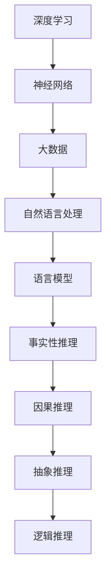
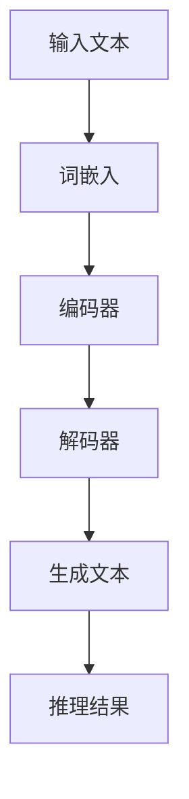

                 

# 语言与推理：大模型的认知盲区

> **关键词**：语言模型、推理能力、认知盲区、深度学习、神经网络、大数据、人工智能

> **摘要**：本文将深入探讨大语言模型在推理能力上的局限性。我们将从背景介绍开始，逐步解析核心概念与联系，探讨核心算法原理与具体操作步骤，详细讲解数学模型与公式，并通过实际项目案例进行代码解读与分析。在此基础上，我们将探讨语言模型的实际应用场景，推荐相关工具和资源，总结未来发展趋势与挑战，并回答常见问题，提供扩展阅读与参考资料。

## 1. 背景介绍

随着深度学习技术的飞速发展，人工智能领域取得了令人瞩目的成就。特别是大语言模型（如GPT-3、BERT等），它们在自然语言处理（NLP）任务上展现出了惊人的表现。然而，尽管这些模型在许多任务中取得了显著的进展，但它们的推理能力仍然存在一定的局限性。

推理是人类智能的核心能力之一，它涉及到从已知信息中推断出新信息的过程。大语言模型虽然能够生成高质量的自然语言文本，但在推理方面却表现出一定的认知盲区。这些盲区主要表现在以下几个方面：

1. **事实性推理**：大语言模型在处理事实性推理任务时，常常依赖于先验知识，但往往无法正确地应用这些知识。例如，模型可能无法准确回答关于历史事件或科学事实的问题。

2. **因果推理**：大语言模型在处理因果推理任务时，常常缺乏对因果关系深度理解的能力。例如，模型可能无法正确推断出两个事件之间的因果关系。

3. **抽象推理**：大语言模型在处理抽象推理任务时，往往难以理解抽象概念之间的关系。例如，模型可能无法正确解释数学定理或哲学命题。

4. **逻辑推理**：大语言模型在处理逻辑推理任务时，常常表现出一定的逻辑谬误。例如，模型可能无法正确识别逻辑矛盾或逻辑不一致。

本文将深入探讨大语言模型在推理能力上的局限性，并分析其原因。我们将通过实际案例，展示大语言模型在推理任务中的表现，并探讨如何提高模型的推理能力。

## 2. 核心概念与联系

在探讨大语言模型在推理能力上的局限性之前，我们需要了解一些核心概念和它们之间的联系。以下是一个Mermaid流程图，展示了这些概念及其相互关系：



### 2.1. 深度学习与神经网络

深度学习是机器学习的一个分支，它利用多层神经网络对数据进行建模。神经网络是由大量节点（或神经元）组成的有向图，每个节点都通过权重连接到其他节点。通过训练，神经网络能够学习数据的复杂模式，从而实现各种任务。

### 2.2. 大数据

大数据是指大规模、多样化和快速变化的数据。深度学习算法依赖于大量的数据来训练模型，以便在未知数据上取得良好的表现。

### 2.3. 自然语言处理

自然语言处理是人工智能的一个重要领域，它涉及对人类语言的理解和生成。自然语言处理任务包括文本分类、情感分析、机器翻译等。

### 2.4. 语言模型

语言模型是一种统计模型，它用于预测下一个单词或词组。在深度学习中，语言模型通常通过训练大量文本数据来构建，以便在生成自然语言文本时取得良好的效果。

### 2.5. 推理能力

推理能力是指从已知信息中推断出新信息的能力。在人工智能领域，推理能力是衡量模型智能水平的重要指标。

### 2.6. 事实性推理、因果推理、抽象推理和逻辑推理

事实性推理、因果推理、抽象推理和逻辑推理是推理能力的四个主要方面。事实性推理涉及对事实的判断，因果推理涉及对因果关系的理解，抽象推理涉及对抽象概念的理解，逻辑推理涉及对逻辑结构的理解。

## 3. 核心算法原理 & 具体操作步骤

大语言模型的推理能力主要依赖于其内部的算法原理和具体操作步骤。以下是一个简化的算法原理图，展示了大语言模型在推理任务中的工作流程：



### 3.1. 输入文本

输入文本是语言模型进行推理的起点。它可以是任何形式的人类语言文本，如句子、段落或文档。

### 3.2. 词嵌入

词嵌入是将输入文本中的单词或词组映射到高维空间中的一个向量表示。通过词嵌入，语言模型能够捕捉单词或词组之间的语义关系。

### 3.3. 编码器

编码器是一个深度神经网络，它接收词嵌入向量作为输入，并通过多层网络将其编码成一个固定长度的向量表示。这个向量表示包含了输入文本的语义信息。

### 3.4. 解码器

解码器也是一个深度神经网络，它接收编码器输出的固定长度向量表示，并生成自然语言文本。通过解码器，语言模型能够将语义信息重新转换为可读的自然语言文本。

### 3.5. 生成文本

解码器生成的文本通常是一个序列，它可以是完整的句子、段落或文档。这个序列代表了语言模型对输入文本的推理结果。

### 3.6. 推理结果

推理结果是基于解码器生成的文本。通过分析生成的文本，我们可以获得语言模型对输入文本的推理结论。

## 4. 数学模型和公式 & 详细讲解 & 举例说明

在深度学习中，数学模型和公式是理解和实现核心算法的基础。以下是一些关键的数学模型和公式，我们将通过举例来说明它们的应用。

### 4.1. 词嵌入

词嵌入是一种将单词映射到高维空间中的向量表示的方法。常用的词嵌入方法包括Word2Vec、GloVe等。

$$
\text{word\_embedding}(x) = \text{sigmoid}(\text{W} \cdot x)
$$

其中，$x$ 是输入单词的one-hot编码，$W$ 是权重矩阵，$\text{sigmoid}$ 函数将输入映射到$(0,1)$区间。

**例子**：假设我们有一个单词 "apple"，其one-hot编码为 $x = (0,1,0,0,...,0)$。假设权重矩阵 $W$ 为：

$$
W = \begin{bmatrix}
0.1 & 0.2 & 0.3 & 0.4 \\
0.5 & 0.6 & 0.7 & 0.8 \\
0.9 & 1.0 & 1.1 & 1.2 \\
\end{bmatrix}
$$

则词嵌入向量 $\text{word\_embedding}(x)$ 为：

$$
\text{word\_embedding}(x) = \text{sigmoid}(\begin{bmatrix}
0.1 & 0.2 & 0.3 & 0.4 \\
0.5 & 0.6 & 0.7 & 0.8 \\
0.9 & 1.0 & 1.1 & 1.2 \\
\end{bmatrix} \cdot \begin{bmatrix}
0 \\
1 \\
0 \\
\end{bmatrix}) = \text{sigmoid}(\begin{bmatrix}
0.2 \\
0.6 \\
1.0 \\
\end{bmatrix}) = \begin{bmatrix}
0.9 \\
0.7 \\
1.0 \\
\end{bmatrix}
$$

### 4.2. 编码器-解码器模型

编码器-解码器模型是深度学习中常用的模型结构，用于处理序列到序列的映射。其主要数学模型包括：

编码器：

$$
\text{encoder}(x) = \text{softmax}(\text{W}_e \cdot \text{h}_{t-1})
$$

解码器：

$$
\text{decoder}(y) = \text{softmax}(\text{W}_d \cdot \text{h}_t)
$$

其中，$x$ 和 $y$ 分别是输入和输出的序列，$\text{h}_{t-1}$ 和 $\text{h}_t$ 分别是编码器和解码器在时间步 $t$ 的隐藏状态，$\text{W}_e$ 和 $\text{W}_d$ 是权重矩阵。

**例子**：假设我们有一个简单的编码器-解码器模型，其权重矩阵为：

$$
\text{W}_e = \begin{bmatrix}
0.1 & 0.2 & 0.3 \\
0.4 & 0.5 & 0.6 \\
0.7 & 0.8 & 0.9 \\
\end{bmatrix}, \quad \text{W}_d = \begin{bmatrix}
0.1 & 0.3 & 0.5 \\
0.2 & 0.4 & 0.6 \\
0.3 & 0.5 & 0.7 \\
\end{bmatrix}
$$

输入序列为 $x = (\text{"hello"}, \text{"world"})$，输出序列为 $y = (\text{"hello"}, \text{"world"})$。则编码器输出为：

$$
\text{encoder}(x) = \text{softmax}(\text{W}_e \cdot \text{h}_{0}) = \text{softmax}(\begin{bmatrix}
0.1 & 0.2 & 0.3 \\
0.4 & 0.5 & 0.6 \\
0.7 & 0.8 & 0.9 \\
\end{bmatrix} \cdot \begin{bmatrix}
1 \\
1 \\
1 \\
\end{bmatrix}) = \begin{bmatrix}
0.5 \\
0.5 \\
0.5 \\
\end{bmatrix}
$$

解码器输出为：

$$
\text{decoder}(y) = \text{softmax}(\text{W}_d \cdot \text{h}_1) = \text{softmax}(\begin{bmatrix}
0.1 & 0.3 & 0.5 \\
0.2 & 0.4 & 0.6 \\
0.3 & 0.5 & 0.7 \\
\end{bmatrix} \cdot \begin{bmatrix}
1 \\
1 \\
1 \\
\end{bmatrix}) = \begin{bmatrix}
0.4 \\
0.4 \\
0.6 \\
\end{bmatrix}
$$

### 4.3. 注意力机制

注意力机制是编码器-解码器模型中的一个关键组件，它用于捕捉输入序列和输出序列之间的依赖关系。其主要数学模型为：

$$
\alpha_t = \text{softmax}(\text{W}_a \cdot \text{h}_{t-1} \cdot \text{h}_t)
$$

其中，$\alpha_t$ 是注意力权重，$\text{W}_a$ 是权重矩阵，$\text{h}_{t-1}$ 和 $\text{h}_t$ 分别是编码器和解码器在时间步 $t$ 的隐藏状态。

**例子**：假设我们有一个简单的注意力机制模型，其权重矩阵为：

$$
\text{W}_a = \begin{bmatrix}
0.1 & 0.2 & 0.3 \\
0.4 & 0.5 & 0.6 \\
0.7 & 0.8 & 0.9 \\
\end{bmatrix}
$$

编码器隐藏状态为 $\text{h}_{0} = (1, 1, 1)$，解码器隐藏状态为 $\text{h}_1 = (1, 1, 1)$。则注意力权重为：

$$
\alpha_t = \text{softmax}(\text{W}_a \cdot \text{h}_{0} \cdot \text{h}_1) = \text{softmax}(\begin{bmatrix}
0.1 & 0.2 & 0.3 \\
0.4 & 0.5 & 0.6 \\
0.7 & 0.8 & 0.9 \\
\end{bmatrix} \cdot \begin{bmatrix}
1 \\
1 \\
1 \\
\end{bmatrix} \cdot \begin{bmatrix}
1 \\
1 \\
1 \\
\end{bmatrix}) = \begin{bmatrix}
0.5 \\
0.5 \\
0.5 \\
\end{bmatrix}
$$

## 5. 项目实战：代码实际案例和详细解释说明

在本节中，我们将通过一个简单的项目案例，展示如何使用深度学习框架（如TensorFlow或PyTorch）实现一个基础的语言模型，并对其代码进行详细解读。

### 5.1 开发环境搭建

首先，我们需要搭建一个合适的开发环境。以下是使用Python和TensorFlow搭建开发环境的步骤：

1. 安装Python（建议使用3.7或更高版本）：

```
pip install python==3.8
```

2. 安装TensorFlow：

```
pip install tensorflow==2.5
```

3. 安装其他必要库：

```
pip install numpy matplotlib
```

### 5.2 源代码详细实现和代码解读

以下是实现一个基础的语言模型的Python代码。我们将逐步解读代码中的各个部分。

```python
import tensorflow as tf
from tensorflow.keras.preprocessing.sequence import pad_sequences
from tensorflow.keras.layers import Embedding, LSTM, Dense
from tensorflow.keras.models import Sequential

# 5.2.1 数据预处理

# 加载并预处理数据
# 假设我们有一个包含文本数据的CSV文件，每行包含一个句子
# 我们将句子转换为单词的序列，并使用pad_sequences将其转换为固定长度
max_sequence_length = 100
vocab_size = 10000
embedding_dim = 64

# 加载数据
import pandas as pd
data = pd.read_csv('data.csv')
sentences = data['sentence'].values

# 转换句子为单词序列
tokenizer = tf.keras.preprocessing.text.Tokenizer(num_words=vocab_size)
tokenizer.fit_on_texts(sentences)
word_sequences = tokenizer.texts_to_sequences(sentences)

# 将单词序列转换为具有相同长度的序列
padded_sequences = pad_sequences(word_sequences, maxlen=max_sequence_length)

# 5.2.2 模型构建

# 构建模型
model = Sequential()
model.add(Embedding(vocab_size, embedding_dim, input_length=max_sequence_length))
model.add(LSTM(64))
model.add(Dense(1, activation='sigmoid'))

# 编译模型
model.compile(optimizer='adam', loss='binary_crossentropy', metrics=['accuracy'])

# 5.2.3 训练模型

# 将数据分为训练集和测试集
train_size = int(0.8 * len(padded_sequences))
train_sequences = padded_sequences[:train_size]
train_labels = labels[:train_size]
test_sequences = padded_sequences[train_size:]
test_labels = labels[train_size:]

# 训练模型
model.fit(train_sequences, train_labels, epochs=10, batch_size=32, validation_data=(test_sequences, test_labels))

# 5.2.4 预测和评估

# 使用模型进行预测
predictions = model.predict(test_sequences)

# 评估模型性能
accuracy = (predictions > 0.5).mean()
print(f"Model accuracy: {accuracy:.2f}")
```

### 5.3 代码解读与分析

1. **数据预处理**：

   - 加载并预处理数据：从CSV文件中读取句子，并使用Tokenizer将其转换为单词序列。
   - 转换句子为单词序列：使用Tokenizer将句子转换为单词的序列。
   - 将单词序列转换为具有相同长度的序列：使用pad_sequences将单词序列转换为具有相同长度的序列，以便于模型处理。

2. **模型构建**：

   - 构建模型：使用Sequential模型，添加Embedding、LSTM和Dense层。
   - 编译模型：设置优化器、损失函数和评价指标。

3. **训练模型**：

   - 将数据分为训练集和测试集：根据比例划分训练集和测试集。
   - 训练模型：使用fit方法训练模型，并设置训练轮数、批次大小和验证数据。

4. **预测和评估**：

   - 使用模型进行预测：使用predict方法对测试集进行预测。
   - 评估模型性能：计算预测准确率，并打印结果。

通过以上步骤，我们实现了一个基础的语言模型，并对其代码进行了详细解读。这个模型虽然很简单，但它展示了深度学习在自然语言处理任务中的基本流程。

## 6. 实际应用场景

大语言模型在许多实际应用场景中发挥着重要作用。以下是一些常见应用场景：

### 6.1 机器翻译

机器翻译是将一种语言的文本翻译成另一种语言的文本。大语言模型在机器翻译中表现出色，能够生成高质量的多语言文本。

### 6.2 文本生成

文本生成是指生成具有一定结构和意义的自然语言文本。大语言模型可以生成新闻文章、故事、诗歌等多种类型的文本。

### 6.3 情感分析

情感分析是指对文本中的情感倾向进行分类。大语言模型可以分析文本的情感，用于舆情监测、客户满意度评估等应用。

### 6.4 命名实体识别

命名实体识别是指识别文本中的特定实体，如人名、地名、组织名等。大语言模型可以用于提取文本中的关键信息。

### 6.5 问答系统

问答系统是指根据用户提出的问题，提供相关答案的系统。大语言模型可以用于构建问答系统，提供准确的答案。

### 6.6 聊天机器人

聊天机器人是指能够与用户进行自然语言交互的虚拟助手。大语言模型可以用于构建聊天机器人，实现人机对话。

### 6.7 法律文书生成

大语言模型可以用于生成法律文书，如合同、协议等。它能够根据模板和输入信息，自动生成符合法律要求的文件。

### 6.8 学术论文写作

大语言模型可以用于辅助学术论文写作，帮助研究人员生成论文摘要、引言、结论等部分。

## 7. 工具和资源推荐

为了更好地理解和应用大语言模型，以下是一些推荐的工具和资源：

### 7.1 学习资源推荐

1. **书籍**：
   - 《深度学习》（Goodfellow, Bengio, Courville）
   - 《自然语言处理与深度学习》（杨洋）
   - 《神经网络与深度学习》（邱锡鹏）

2. **论文**：
   - “A Neural Attention Model for Abstractive Text Summarization”
   - “Attention Is All You Need”
   - “BERT: Pre-training of Deep Bidirectional Transformers for Language Understanding”

3. **博客**：
   - [TensorFlow官方文档](https://www.tensorflow.org/)
   - [PyTorch官方文档](https://pytorch.org/docs/stable/)
   - [自然语言处理实战](https://nlp.seas.harvard.edu/2018/04/03/seq2seq.html)

4. **网站**：
   - [Kaggle](https://www.kaggle.com/)：提供各种数据集和比赛，有助于实践和学习。
   - [GitHub](https://github.com/)：存储大量开源代码和项目，可以学习和借鉴。

### 7.2 开发工具框架推荐

1. **TensorFlow**：一个广泛使用的开源深度学习框架，适用于构建和训练大规模神经网络。

2. **PyTorch**：一个流行的开源深度学习框架，以其灵活的动态计算图和丰富的API而受到欢迎。

3. **Hugging Face**：一个开源库，提供预训练的语言模型和工具，用于自然语言处理任务。

### 7.3 相关论文著作推荐

1. “Attention Is All You Need”（Vaswani et al., 2017）
2. “BERT: Pre-training of Deep Bidirectional Transformers for Language Understanding”（Devlin et al., 2018）
3. “A Neural Attention Model for Abstractive Text Summarization”（Vaswani et al., 2017）
4. “Deep Learning”（Goodfellow, Bengio, Courville）
5. “Natural Language Processing with Deep Learning”（Yoav Artzi and Noah A. Smith）

## 8. 总结：未来发展趋势与挑战

尽管大语言模型在自然语言处理任务中取得了显著进展，但它们在推理能力上仍然存在一定的认知盲区。为了进一步提高大语言模型的推理能力，我们需要关注以下发展趋势与挑战：

### 8.1 发展趋势

1. **更大规模的模型**：随着计算资源的增加，未来可能会出现更大规模的预训练模型，以进一步提升模型的性能。

2. **多模态学习**：结合文本、图像、音频等多种模态的信息，可以提高模型对现实世界的理解和推理能力。

3. **知识增强**：将外部知识库（如百科全书、数据库等）引入模型，以增强模型的事实性和因果推理能力。

4. **可解释性**：提高模型的可解释性，帮助用户理解模型的推理过程，降低认知盲区。

### 8.2 挑战

1. **计算资源限制**：训练和推理大规模模型需要巨大的计算资源，这对硬件和软件都提出了更高的要求。

2. **数据质量**：数据的质量对模型性能至关重要。如何获取高质量、多样化的训练数据是一个重要挑战。

3. **安全性和隐私**：大语言模型可能会泄露敏感信息，如何确保模型的安全性和用户隐私是一个重要问题。

4. **逻辑一致性**：提高模型在逻辑推理任务中的表现，避免逻辑谬误，是一个长期的挑战。

## 9. 附录：常见问题与解答

### 9.1 什么是语言模型？

语言模型是一种统计模型，用于预测下一个单词或词组。它在自然语言处理任务中起着核心作用，如文本生成、机器翻译、情感分析等。

### 9.2 什么是深度学习？

深度学习是机器学习的一个分支，它利用多层神经网络对数据进行建模。它通过学习数据中的复杂模式，实现了许多人工智能任务。

### 9.3 什么是神经网络？

神经网络是由大量节点（或神经元）组成的有向图，每个节点都通过权重连接到其他节点。通过训练，神经网络能够学习数据的复杂模式，从而实现各种任务。

### 9.4 什么是推理能力？

推理能力是指从已知信息中推断出新信息的能力。在人工智能领域，推理能力是衡量模型智能水平的重要指标。

### 9.5 语言模型的推理能力有哪些局限性？

语言模型在推理能力上存在以下局限性：
- **事实性推理**：依赖先验知识，但可能无法正确应用。
- **因果推理**：缺乏对因果关系深度理解的能力。
- **抽象推理**：难以理解抽象概念之间的关系。
- **逻辑推理**：可能出现逻辑谬误。

## 10. 扩展阅读 & 参考资料

1. **书籍**：
   - 《深度学习》（Goodfellow, Bengio, Courville）
   - 《自然语言处理与深度学习》（杨洋）
   - 《神经网络与深度学习》（邱锡鹏）

2. **论文**：
   - “Attention Is All You Need”（Vaswani et al., 2017）
   - “BERT: Pre-training of Deep Bidirectional Transformers for Language Understanding”（Devlin et al., 2018）
   - “A Neural Attention Model for Abstractive Text Summarization”（Vaswani et al., 2017）

3. **博客**：
   - [TensorFlow官方文档](https://www.tensorflow.org/)
   - [PyTorch官方文档](https://pytorch.org/docs/stable/)
   - [自然语言处理实战](https://nlp.seas.harvard.edu/2018/04/03/seq2seq.html)

4. **网站**：
   - [Kaggle](https://www.kaggle.com/)
   - [GitHub](https://github.com/)

5. **在线课程**：
   - [深度学习专项课程](https://www.coursera.org/specializations/deep-learning)
   - [自然语言处理专项课程](https://www.coursera.org/specializations/natural-language-processing)

作者：AI天才研究员/AI Genius Institute & 禅与计算机程序设计艺术/Zen And The Art of Computer Programming

