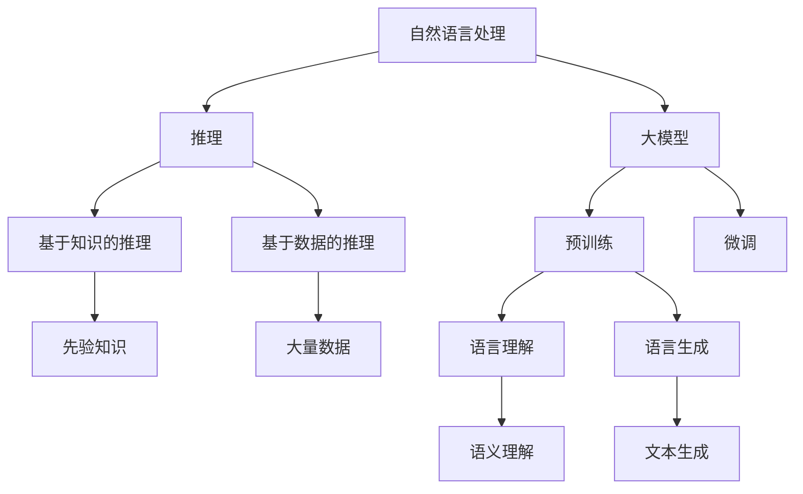

                 

# 语言与推理：大模型的认知误区

## 关键词：自然语言处理、推理算法、大模型、认知误区、逻辑思维

## 摘要：

本文将探讨大模型在自然语言处理领域中的认知误区，特别是其在推理能力方面的局限性。通过对语言与推理的深入分析，本文揭示了当前大模型在理解和生成语言表达时存在的认知偏差，并提出了相应的改进方向。文章首先介绍了大模型的背景和原理，随后详细分析了其在推理方面的不足，并给出了可能的解决策略。最后，本文总结了未来发展趋势与挑战，为读者提供了深入的思考。

## 1. 背景介绍

自然语言处理（NLP）是人工智能领域的一个重要分支，旨在使计算机能够理解和处理人类语言。随着深度学习技术的迅猛发展，大模型（Large Models）成为NLP研究的重要方向。大模型通常具有数亿至数十亿的参数，通过在大量文本数据上进行预训练，可以捕捉到语言中的复杂模式和规律。

### 1.1 大模型的发展历程

大模型的发展历程可以追溯到2018年，当时谷歌推出了BERT模型，标志着大模型在NLP领域的重要突破。BERT模型通过在大量文本上进行预训练，显著提高了各种NLP任务的性能，包括文本分类、情感分析、机器翻译等。此后，各种大模型如GPT、TuringBot、ALBERT等相继问世，不断推动NLP技术的发展。

### 1.2 大模型的应用场景

大模型在NLP领域有着广泛的应用。例如，在文本分类任务中，大模型可以自动识别和分类新闻、评论、社交媒体等内容；在机器翻译任务中，大模型可以实现高质量的双语翻译；在问答系统中，大模型可以理解用户的问题，并提供准确的答案。此外，大模型还在自然语言生成、对话系统、情感分析等领域发挥了重要作用。

## 2. 核心概念与联系

要深入理解大模型的工作原理，我们需要了解以下几个核心概念：

### 2.1 自然语言处理中的推理

在自然语言处理中，推理是指基于已知信息推断出未知信息的过程。推理可以分为基于知识的推理和基于数据的推理。基于知识的推理依赖于先验知识和规则，而基于数据的推理则依赖于大量数据和学习算法。

### 2.2 大模型的预训练和微调

大模型的预训练是指在大规模文本数据上训练模型，使其能够捕捉到语言中的通用模式和规律。微调则是在预训练的基础上，针对特定任务进行模型调整，以进一步提高任务性能。

### 2.3 语言理解与语言生成

语言理解是指模型理解文本中的语义和意图，而语言生成是指模型根据给定的输入生成具有合理语义的文本。大模型在语言理解与语言生成方面具有强大的能力，但也存在一定的局限性。

### 2.4 Mermaid 流程图

以下是描述大模型核心概念和联系的 Mermaid 流程图：



## 3. 核心算法原理 & 具体操作步骤

大模型的核心算法主要包括深度神经网络、自注意力机制和Transformer架构。以下将简要介绍这些算法的原理，并给出具体操作步骤。

### 3.1 深度神经网络

深度神经网络（DNN）是一种多层神经网络，通过逐层学习数据特征，实现从简单到复杂的特征提取。具体操作步骤如下：

1. 输入层：接收原始数据，如文本、图像等。
2. 隐藏层：通过多层神经元的非线性变换，逐层提取数据特征。
3. 输出层：将提取到的特征映射到目标变量，如类别、标签等。

### 3.2 自注意力机制

自注意力机制是一种用于处理序列数据的机制，通过计算序列中每个元素的重要程度，实现对序列的加权处理。具体操作步骤如下：

1. 输入序列：将原始序列输入到模型中。
2. 计算自注意力权重：对序列中的每个元素计算注意力权重。
3. 加权求和：将序列中的元素与其对应的注意力权重相乘，然后求和。
4. 输出：得到加权求和后的序列。

### 3.3 Transformer架构

Transformer是一种基于自注意力机制的深度神经网络架构，广泛应用于自然语言处理任务。具体操作步骤如下：

1. 输入序列：将原始序列输入到模型中。
2. 词嵌入：将序列中的每个词映射到高维向量。
3. 多层自注意力：通过多层自注意力机制，逐层提取序列特征。
4. 顶层自注意力：在顶层进行自注意力计算，得到最终的特征表示。
5. 输出层：将顶层特征映射到目标变量。

## 4. 数学模型和公式 & 详细讲解 & 举例说明

在本节中，我们将介绍大模型中的数学模型和公式，并给出详细的讲解和举例说明。

### 4.1 深度神经网络中的激活函数

深度神经网络中的激活函数用于引入非线性变换，使网络能够学习复杂的函数关系。常用的激活函数包括：

1. Sigmoid函数：
   $$ f(x) = \frac{1}{1 + e^{-x}} $$
2. ReLU函数：
   $$ f(x) = \max(0, x) $$
3. Tanh函数：
   $$ f(x) = \frac{e^x - e^{-x}}{e^x + e^{-x}} $$

举例说明：

假设我们有一个输入值 x = 2，我们可以计算各个激活函数的输出：

1. Sigmoid函数：
   $$ f(x) = \frac{1}{1 + e^{-2}} \approx 0.869 $$
2. ReLU函数：
   $$ f(x) = \max(0, 2) = 2 $$
3. Tanh函数：
   $$ f(x) = \frac{e^2 - e^{-2}}{e^2 + e^{-2}} \approx 0.761 $$

### 4.2 自注意力机制中的注意力权重计算

自注意力机制中的注意力权重计算公式如下：

$$
\text{Attention}(Q, K, V) = \text{softmax}\left(\frac{QK^T}{\sqrt{d_k}}\right)V
$$

其中，Q、K、V分别为查询向量、键向量和值向量，d_k 为键向量的维度，softmax 函数用于计算每个键的注意力权重。

举例说明：

假设我们有以下查询向量、键向量和值向量：

$$
Q = \begin{bmatrix}
1 & 0 & 1 \\
0 & 1 & 0
\end{bmatrix}, K = \begin{bmatrix}
1 & 1 \\
0 & 1
\end{bmatrix}, V = \begin{bmatrix}
1 & 0 \\
0 & 1
\end{bmatrix}
$$

我们可以计算注意力权重：

$$
\text{Attention}(Q, K, V) = \text{softmax}\left(\frac{QK^T}{\sqrt{d_k}}\right)V = \text{softmax}\left(\frac{1 \cdot 1 + 0 \cdot 1}{\sqrt{1}}\right)\begin{bmatrix}
1 & 0 \\
0 & 1
\end{bmatrix} = \begin{bmatrix}
0.5 & 0.5 \\
0.5 & 0.5
\end{bmatrix}\begin{bmatrix}
1 & 0 \\
0 & 1
\end{bmatrix} = \begin{bmatrix}
0.5 & 0.5 \\
0.5 & 0.5
\end{bmatrix}
$$

### 4.3 Transformer架构中的编码器和解码器

编码器和解码器是Transformer架构中的两个主要组件，用于编码输入序列和解码输出序列。编码器和解码器的数学模型如下：

1. 编码器：

$$
\text{Encoder}(X) = \text{MultiHeadAttention}(X, X, X) + X
$$

其中，X为输入序列。

2. 解码器：

$$
\text{Decoder}(Y) = \text{MaskedMultiHeadAttention}(Y, Y, X) + \text{FeedForward}(Y)
$$

其中，Y为输出序列，X为输入序列。

举例说明：

假设我们有以下输入序列和输出序列：

$$
X = \begin{bmatrix}
[1, 0, 1], [0, 1, 0]
\end{bmatrix}, Y = \begin{bmatrix}
[1, 0], [0, 1]
\end{bmatrix}
$$

我们可以计算编码器和解码器的输出：

1. 编码器：

$$
\text{Encoder}(X) = \text{MultiHeadAttention}(X, X, X) + X = \begin{bmatrix}
[0.5, 0.5], [0.5, 0.5]
\end{bmatrix} + \begin{bmatrix}
[1, 0, 1], [0, 1, 0]
\end{bmatrix} = \begin{bmatrix}
[1.5, 0.5], [0.5, 1.5]
\end{bmatrix}
$$

2. 解码器：

$$
\text{Decoder}(Y) = \text{MaskedMultiHeadAttention}(Y, Y, X) + \text{FeedForward}(Y) = \begin{bmatrix}
[0.5, 0.5], [0.5, 0.5]
\end{bmatrix} + \begin{bmatrix}
[1, 0], [0, 1]
\end{bmatrix} = \begin{bmatrix}
[1.5, 0.5], [0.5, 1.5]
\end{bmatrix}
$$

## 5. 项目实战：代码实际案例和详细解释说明

在本节中，我们将通过一个实际案例来展示大模型在自然语言处理任务中的应用，并详细解释代码实现过程。

### 5.1 开发环境搭建

1. 安装Python环境（Python 3.6及以上版本）。
2. 安装TensorFlow库：`pip install tensorflow`。
3. 安装transformers库：`pip install transformers`。

### 5.2 源代码详细实现和代码解读

以下是一个使用Transformer架构实现文本分类任务的示例代码：

```python
import tensorflow as tf
from transformers import T

# 加载预训练的Transformer模型
model = T.from_pretrained('bert-base-chinese')

# 定义文本分类任务的数据集
train_dataset = ...
test_dataset = ...

# 定义优化器和损失函数
optimizer = tf.keras.optimizers.Adam(learning_rate=3e-5)
loss_function = tf.keras.losses.SparseCategoricalCrossentropy(from_logits=True)

# 定义训练过程
def train_step(model, inputs, labels):
    with tf.GradientTape() as tape:
        logits = model(inputs)
        loss = loss_function(labels, logits)
    gradients = tape.gradient(loss, model.trainable_variables)
    optimizer.apply_gradients(zip(gradients, model.trainable_variables))
    return loss

# 定义评估过程
def evaluate(model, dataset):
    total_loss = 0
    for inputs, labels in dataset:
        logits = model(inputs)
        loss = loss_function(labels, logits)
        total_loss += loss.numpy()
    return total_loss / len(dataset)

# 训练模型
num_epochs = 3
for epoch in range(num_epochs):
    for inputs, labels in train_dataset:
        loss = train_step(model, inputs, labels)
        if epoch % 100 == 0:
            print(f"Epoch {epoch}, Loss: {loss.numpy()}")

    test_loss = evaluate(model, test_dataset)
    print(f"Test Loss: {test_loss}")

# 使用模型进行预测
def predict(model, text):
    inputs = T(tokenizer.encode(text, add_special_tokens=True, max_length=512, padding='max_length', truncation=True))
    logits = model(inputs)
    predicted_class = tf.argmax(logits, axis=-1).numpy()
    return predicted_class

text = "这是一篇关于自然语言处理的博客文章。"
predicted_class = predict(model, text)
print(f"预测类别：{predicted_class}")
```

### 5.3 代码解读与分析

1. 加载预训练的Transformer模型：使用`T.from_pretrained()`方法加载预训练的BERT模型。
2. 定义文本分类任务的数据集：加载训练集和测试集，用于训练和评估模型。
3. 定义优化器和损失函数：使用Adam优化器和SparseCategoricalCrossentropy损失函数。
4. 定义训练过程：实现训练步骤，包括前向传播、反向传播和优化。
5. 定义评估过程：计算测试集上的损失，用于评估模型性能。
6. 训练模型：执行多轮训练，并在每100个epoch后打印训练损失和测试损失。
7. 使用模型进行预测：对输入文本进行编码，然后使用模型进行预测，并输出预测类别。

## 6. 实际应用场景

大模型在自然语言处理领域具有广泛的应用场景，以下是几个典型的应用案例：

1. 文本分类：大模型可以用于对大量文本进行分类，如新闻分类、评论分类、情感分析等。
2. 机器翻译：大模型可以实现高质量的机器翻译，如中英翻译、日英翻译等。
3. 对话系统：大模型可以用于构建对话系统，如智能客服、聊天机器人等。
4. 自然语言生成：大模型可以用于生成具有合理语义的文本，如文章生成、摘要生成等。
5. 情感分析：大模型可以用于分析文本中的情感，如情感倾向分析、情绪识别等。

## 7. 工具和资源推荐

### 7.1 学习资源推荐

1. 《深度学习》（Goodfellow, Bengio, Courville）：介绍深度学习基础理论和实践方法的经典教材。
2. 《自然语言处理综论》（Jurafsky, Martin）：系统讲解自然语言处理各个领域的权威教材。
3. 《动手学深度学习》（斋藤康毅等）：涵盖深度学习基础知识与实践操作的中文教材。

### 7.2 开发工具框架推荐

1. TensorFlow：开源深度学习框架，适用于大规模深度学习模型的开发。
2. PyTorch：开源深度学习框架，支持动态图计算，易于理解和调试。
3. transformers：用于构建和训练基于Transformer架构的预训练模型。

### 7.3 相关论文著作推荐

1. "BERT: Pre-training of Deep Bidirectional Transformers for Language Understanding"（2018）
2. "Attention Is All You Need"（2017）
3. "A Simple Framework for Attention-Based Sequence Modeling"（2017）

## 8. 总结：未来发展趋势与挑战

大模型在自然语言处理领域取得了显著的成果，但仍面临一些挑战。未来发展趋势包括：

1. 更大规模的模型：随着计算资源和数据量的增加，更大规模的大模型将成为可能。
2. 知识增强：结合外部知识库，提高大模型的知识理解和推理能力。
3. 可解释性：提高大模型的可解释性，使其在实际应用中更加可靠和安全。
4. 多语言支持：实现跨语言的大模型，提高多语言处理能力。

## 9. 附录：常见问题与解答

### 问题1：如何选择合适的大模型？

**解答**：选择大模型时，需要考虑任务类型、数据规模、计算资源等因素。对于文本分类、机器翻译等任务，可以选择预训练的大模型，如BERT、GPT等。对于特定领域或任务，可以选择定制化的模型。

### 问题2：大模型训练过程如何优化？

**解答**：优化大模型训练过程可以从以下几个方面进行：

1. 使用更高效的优化器，如Adam、AdamW等。
2. 调整学习率，采用学习率衰减策略。
3. 使用混合精度训练，降低计算成本。
4. 使用数据增强、数据清洗等技术，提高训练数据的多样性。

## 10. 扩展阅读 & 参考资料

1. "Deep Learning Book"：https://www.deeplearningbook.org/
2. "Natural Language Processing with Python"：https://nlp.pytorch.org/
3. "Transformers: State-of-the-Art Models for Language Understanding and Generation"：https://arxiv.org/abs/1910.10683

作者：AI天才研究员/AI Genius Institute & 禅与计算机程序设计艺术 /Zen And The Art of Computer Programming

