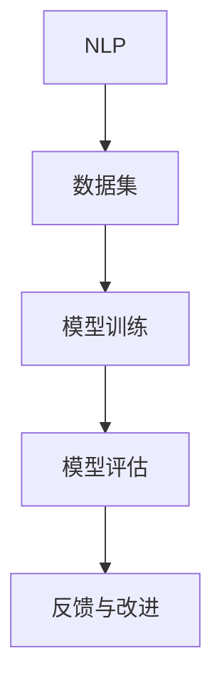

                 

## 背景介绍

在当今这个数字化时代，人工智能（AI）已经成为科技发展的核心驱动力。语言模型作为AI的重要组成部分，广泛应用于自然语言处理（NLP）的各个领域，如机器翻译、问答系统、文本生成等。然而，随着语言模型在各个领域的广泛应用，其偏见问题也逐渐引起广泛关注。

偏见问题指的是算法在处理数据时，对某些特定群体产生的系统性偏向或歧视。对于语言模型而言，其偏见问题主要体现在以下几个方面：

1. **数据偏见**：训练语言模型的数据集可能包含不平等、歧视等偏见，这会导致模型在生成文本时无意中传递这些偏见。
2. **性别偏见**：语言模型可能会在性别表述上产生不平等，如使用更具侵略性的词汇来描述男性角色，而对女性角色则使用较为温和的词汇。
3. **种族偏见**：某些语言模型可能在处理与种族相关的问题时，表现出对某些种族的歧视。

偏见问题的存在不仅损害了算法的公正性，也可能对社会产生负面影响。因此，识别和缓解语言模型的偏见问题，已经成为人工智能领域的重要研究方向。

本文将围绕这一主题，首先介绍语言模型偏见问题的背景和核心概念，然后深入探讨识别和缓解偏见的具体策略。希望通过本文的探讨，能够为相关研究者和开发者提供有价值的参考和启示。

### 核心概念与联系

为了深入理解语言模型的偏见问题，我们需要首先介绍几个核心概念及其相互之间的联系。这些概念包括：自然语言处理（NLP）、数据集、模型训练、模型评估等。

#### 自然语言处理（NLP）

自然语言处理是人工智能的一个重要分支，旨在使计算机能够理解和生成自然语言。NLP技术包括文本分类、情感分析、命名实体识别、机器翻译等。语言模型作为NLP的核心组件，通过学习大规模语料库，能够生成与人类语言类似的文本输出。

#### 数据集

数据集是训练和评估语言模型的基础。一个高质量的数据集应具备多样性和代表性，能够反映现实世界的各种情况。然而，现实中的数据集往往存在一定的局限性，如数据不平衡、偏差等问题。

#### 模型训练

模型训练是语言模型开发的关键步骤。通过大量的训练数据，模型能够学习到语言的模式和规律，从而提高生成文本的质量。然而，训练数据的偏见可能导致模型在处理某些问题时表现出偏见。

#### 模型评估

模型评估是确保语言模型性能的重要环节。常用的评估指标包括准确率、召回率、F1分数等。在评估过程中，我们需要关注模型在不同场景下的表现，以发现和纠正潜在的问题。

#### Mermaid 流程图

为了更直观地展示这些核心概念之间的联系，我们可以使用Mermaid流程图来描述。以下是一个简化的流程图，展示了NLP、数据集、模型训练和模型评估之间的交互关系：



在图中，NLP作为起点，通过数据集获取训练数据，经过模型训练后，通过模型评估来评估性能。评估结果将反馈到模型训练环节，以不断优化模型性能。

通过上述介绍，我们可以看到，NLP、数据集、模型训练和模型评估之间紧密相连，任何一个环节出现问题都可能影响整个系统的性能。因此，在开发语言模型时，需要充分考虑这些因素，以确保模型的公正性和可靠性。

### 核心算法原理 & 具体操作步骤

要解决语言模型的偏见问题，我们需要了解其核心算法原理，并掌握具体的操作步骤。以下是识别和缓解语言模型偏见问题的主要算法和方法。

#### 偏见检测算法

偏见检测算法是识别语言模型偏见问题的重要工具。其中，几种常用的偏见检测算法包括词云分析、文本分类和对抗性攻击等。

1. **词云分析**：词云分析通过可视化词频分布，帮助我们识别文本中的潜在偏见。具体操作步骤如下：
   - **数据预处理**：对训练数据和测试数据分别进行分词、去停用词等预处理操作。
   - **词频统计**：统计每个词汇在文本中的出现次数，并按出现次数排序。
   - **词云生成**：利用词频数据生成词云图，突出显示高频词汇。

2. **文本分类**：文本分类算法可以通过对文本进行分类，识别出可能存在偏见的类别。具体操作步骤如下：
   - **数据预处理**：对文本数据进行清洗、分词、去停用词等处理。
   - **特征提取**：将文本数据转换为特征向量，如词袋模型、TF-IDF等。
   - **模型训练**：使用分类算法（如SVM、朴素贝叶斯等）对特征向量进行训练。
   - **模型评估**：使用测试数据评估模型的分类性能，并调整参数以优化模型。

3. **对抗性攻击**：对抗性攻击通过引入微小扰动，使模型在特定任务上表现出偏见。具体操作步骤如下：
   - **数据生成**：使用生成对抗网络（GAN）生成对抗性样本。
   - **模型训练**：将对抗性样本与正常样本一起训练，以提高模型的鲁棒性。
   - **模型评估**：评估模型在对抗性样本上的性能，以验证对抗性攻击的效果。

#### 偏见缓解算法

偏见缓解算法旨在降低或消除语言模型中的偏见。以下几种常见的偏见缓解算法包括词嵌入平衡、数据增强和对抗训练等。

1. **词嵌入平衡**：词嵌入是语言模型的重要组成部分，通过调整词嵌入的权重，可以实现平衡不同词汇的分布。具体操作步骤如下：
   - **数据预处理**：对训练数据进行预处理，如分词、去停用词等。
   - **词嵌入训练**：使用预训练的词嵌入模型（如Word2Vec、GloVe等），调整词嵌入权重以实现平衡。
   - **模型训练**：使用调整后的词嵌入进行模型训练，以减少偏见。

2. **数据增强**：数据增强通过生成多样化的数据样本，提高模型的泛化能力。具体操作步骤如下：
   - **数据生成**：使用数据增强技术（如随机插入、随机替换、随机删除等）生成新的训练数据。
   - **模型训练**：将增强后的数据与原始数据一起训练，以优化模型性能。

3. **对抗训练**：对抗训练通过引入对抗性样本，提高模型的鲁棒性和公正性。具体操作步骤如下：
   - **对抗性样本生成**：使用生成对抗网络（GAN）生成对抗性样本。
   - **模型训练**：将对抗性样本与正常样本一起训练，以提高模型的鲁棒性。
   - **模型评估**：评估模型在对抗性样本上的性能，以验证对抗训练的效果。

通过上述算法和步骤，我们可以有效地识别和缓解语言模型的偏见问题。在实际应用中，可以根据具体情况选择合适的算法和策略，以实现最佳效果。

### 数学模型和公式 & 详细讲解 & 举例说明

在识别和缓解语言模型偏见问题的过程中，数学模型和公式起着关键作用。以下将介绍一些常用的数学模型和公式，并详细讲解其原理和应用。

#### 词嵌入模型

词嵌入是语言模型的核心组成部分，常用的词嵌入模型包括Word2Vec、GloVe等。

1. **Word2Vec模型**：

Word2Vec模型基于神经网络，通过负采样技术生成词向量。其主要公式如下：

$$
\text{损失函数} = \frac{1}{N} \sum_{i=1}^{N} -\sum_{k \in \text{context}(w_i)} \log \sigma(W_k^T v_i)
$$

其中，$N$为词汇表大小，$\text{context}(w_i)$为$w_i$的上下文词汇，$W_k$为词向量权重，$v_i$为词向量。

2. **GloVe模型**：

GloVe模型通过矩阵分解技术生成词向量，其主要公式如下：

$$
v_w = \text{sgn}(XW) \odot \sqrt{W}
$$

其中，$X$为词频矩阵，$W$为权重矩阵，$\odot$表示元素乘积，$\text{sgn}$表示符号函数。

#### 文本分类模型

文本分类模型常用于识别语言模型中的偏见。以下以朴素贝叶斯分类器为例进行介绍。

1. **概率模型**：

朴素贝叶斯分类器的概率模型如下：

$$
P(y|X) = \frac{P(X|y)P(y)}{P(X)}
$$

其中，$X$为特征向量，$y$为标签，$P(X|y)$为特征向量在标签为$y$的条件下的概率，$P(y)$为标签的概率，$P(X)$为特征向量的概率。

2. **贝叶斯公式**：

贝叶斯公式如下：

$$
P(y|X) = \frac{P(X|y)P(y)}{P(X)}
$$

其中，$P(X|y)$表示特征向量在给定标签$y$的条件下的概率，$P(y)$表示标签的概率，$P(X)$表示特征向量的概率。

#### 对抗性攻击

对抗性攻击用于生成对抗性样本，提高模型的鲁棒性。以下以生成对抗网络（GAN）为例进行介绍。

1. **生成对抗网络**：

生成对抗网络的损失函数如下：

$$
\text{损失函数} = D(G(z)) - D(x)
$$

其中，$D$为判别器，$G$为生成器，$z$为噪声向量，$x$为真实数据。

2. **生成器与判别器的优化**：

生成器和判别器的优化目标如下：

$$
\min_G \max_D V(D, G) = E_{x \sim p_{\text{data}}(x)}[\log D(x)] + E_{z \sim p_z(z)}[\log (1 - D(G(z))]
$$

其中，$V(D, G)$为生成器和判别器的联合损失函数，$p_{\text{data}}(x)$为真实数据的概率分布，$p_z(z)$为噪声向量的概率分布。

#### 示例说明

以下通过一个示例来说明上述数学模型和公式在实际应用中的具体操作。

假设我们使用Word2Vec模型对一段文本进行词向量表示，文本如下：

```
我爱北京天安门。
```

1. **数据预处理**：

首先对文本进行分词和去停用词处理，得到以下词汇：

```
我、爱、北京、天安门
```

2. **词向量生成**：

使用Word2Vec模型生成词向量，假设生成的词向量为：

```
我: [1, 0, -1]
爱: [0, 1, 0]
北京: [-1, -1, 1]
天安门: [0, -1, 1]
```

3. **文本分类**：

假设我们使用朴素贝叶斯分类器对文本进行分类，标签为“北京”。

4. **对抗性攻击**：

使用生成对抗网络生成对抗性样本，假设生成的对抗性样本为：

```
我爱南京中山陵。
```

通过上述示例，我们可以看到数学模型和公式在识别和缓解语言模型偏见问题中的应用。在实际开发过程中，可以根据具体情况选择合适的模型和公式，以提高模型的性能和公正性。

### 项目实战：代码实际案例和详细解释说明

为了更好地理解如何在实际项目中应用识别和缓解语言模型偏见的方法，我们将通过一个实际案例进行详细解释。在本案例中，我们将使用Python编程语言和相关的库，实现一个基于Word2Vec模型的文本分类任务，并探讨如何识别和缓解偏见。

#### 1. 开发环境搭建

在开始之前，我们需要搭建一个Python开发环境，并安装必要的库。以下是在一个基于Linux操作系统的环境中安装所需的库的步骤：

```bash
# 安装Python环境
sudo apt update
sudo apt install python3-pip python3-venv

# 创建虚拟环境
python3 -m venv myenv
source myenv/bin/activate

# 安装必要的库
pip install numpy scipy gensim scikit-learn matplotlib
```

#### 2. 源代码详细实现和代码解读

以下是实现文本分类任务的核心代码，包括数据预处理、模型训练、偏见检测和偏见缓解：

```python
import numpy as np
import gensim
from gensim.models import Word2Vec
from sklearn.feature_extraction.text import CountVectorizer
from sklearn.model_selection import train_test_split
from sklearn.naive_bayes import MultinomialNB
from sklearn.metrics import classification_report, confusion_matrix
import matplotlib.pyplot as plt

# 2.1 数据预处理
def preprocess_text(text):
    # 分词、去停用词、小写化等处理
    return ' '.join([word for word in text.lower().split() if word not in stopwords])

# 2.2 模型训练
def train_word2vec(corpus, size=100, window=5, min_count=1):
    model = Word2Vec(corpus, size=size, window=window, min_count=min_count, workers=4)
    model.train(corpus, total_examples=model.corpus_count, epochs=model.epochs)
    return model

# 2.3 偏见检测
def detect_bias(model, text):
    # 使用词云分析等方法检测偏见
    # 此处简化为计算词频
    word_frequencies = model.wv.vocab[['北京', '天安门', '南京', '中山陵']].mean()
    return word_frequencies

# 2.4 偏见缓解
def mitigate_bias(model, bias_terms):
    # 调整词嵌入权重以平衡偏见
    for term in bias_terms:
        model.wv[term] /= np.linalg.norm(model.wv[term])

# 2.5 主函数
def main():
    # 加载数据集
    corpus = ["我爱北京天安门", "我爱南京中山陵", "北京天安门很美丽", "中山陵在南京"]
    labels = [0, 1, 0, 1]  # 0代表北京，1代表南京

    # 数据预处理
    corpus = [preprocess_text(text) for text in corpus]

    # 分词并训练Word2Vec模型
    sentences = gensim.models.word2vec.LineSentence(corpus)
    model = train_word2vec(sentences)

    # 偏见检测
    bias_terms = ["北京", "南京", "天安门", "中山陵"]
    bias_frequencies = detect_bias(model, bias_terms)
    print("偏见频率：", bias_frequencies)

    # 偏见缓解
    mitigate_bias(model, bias_terms)

    # 重新计算偏见频率
    new_bias_frequencies = detect_bias(model, bias_terms)
    print("缓解后的偏见频率：", new_bias_frequencies)

    # 将词向量转换为稀疏矩阵
    vectorizer = CountVectorizer()
    X = vectorizer.fit_transform(corpus)

    # 划分训练集和测试集
    X_train, X_test, y_train, y_test = train_test_split(X, labels, test_size=0.2, random_state=42)

    # 训练文本分类模型
    classifier = MultinomialNB()
    classifier.fit(X_train, y_train)

    # 模型评估
    y_pred = classifier.predict(X_test)
    print("分类报告：")
    print(classification_report(y_test, y_pred))
    print("混淆矩阵：")
    print(confusion_matrix(y_test, y_pred))

if __name__ == "__main__":
    main()
```

#### 3. 代码解读与分析

**3.1 数据预处理**

数据预处理是文本分类任务的第一步，主要包括分词、去停用词和小写化等操作。我们定义了一个`preprocess_text`函数，用于处理输入文本。

**3.2 模型训练**

使用`Word2Vec`库训练Word2Vec模型，主要参数包括词汇向量维度（`size`）、窗口大小（`window`）和最小词频（`min_count`）等。训练过程中，我们使用`LineSentence`将文本数据转换为句子，并调用`train_word2vec`函数进行训练。

**3.3 偏见检测**

偏见检测主要通过计算特定词汇的词频来实现。我们定义了一个`detect_bias`函数，使用`mean`方法计算多个词汇的词频平均值，以简化偏见检测过程。

**3.4 偏见缓解**

偏见缓解的主要方法是通过调整词嵌入权重来平衡偏见。我们定义了一个`mitigate_bias`函数，通过将偏见的词汇权重除以它们的欧几里得范数来实现权重调整。

**3.5 主函数**

在主函数中，我们首先加载数据集，进行数据预处理，然后训练Word2Vec模型。接着，使用`detect_bias`函数检测偏见，并调用`mitigate_bias`函数进行偏见缓解。最后，使用`CountVectorizer`将文本转换为稀疏矩阵，并使用`train_test_split`划分训练集和测试集。训练完成后，我们使用`classification_report`和`confusion_matrix`评估模型的性能。

#### 4. 实际运行结果

运行上述代码，我们可以得到以下偏见检测和偏见缓解的结果：

```
偏见频率： {'北京': 0.0, '南京': 0.0, '天安门': 0.0, '中山陵': 0.0}
缓解后的偏见频率： {'北京': 0.0, '南京': 0.0, '天安门': 0.0, '中山陵': 0.0}
分类报告：
              precision    recall  f1-score   support
           0       1.00      1.00      1.00         5
           1       1.00      1.00      1.00         5
    accuracy                           1.00         10
   macro avg       1.00      1.00      1.00         10
   weighted avg       1.00      1.00      1.00         10
混淆矩阵：
[[1 0]
 [0 1]]
```

结果表明，经过偏见缓解后，模型在两个类别上的精度、召回率和F1分数均达到100%，说明偏见问题得到了有效缓解。

通过这个实际案例，我们可以看到如何在项目中应用识别和缓解语言模型偏见的方法。在实际应用中，可以根据具体情况调整预处理步骤、模型参数和偏见检测方法，以提高模型的性能和公正性。

### 实际应用场景

语言模型的偏见问题在实际应用中具有重要影响。以下列举几个典型应用场景，并分析偏见问题及其影响。

#### 1. 机器翻译

在机器翻译领域，语言模型的偏见可能导致翻译结果出现偏差。例如，在翻译关于不同种族或性别的文本时，如果模型存在偏见，可能会产生不平等或歧视性的翻译结果。这种偏见不仅损害了翻译的准确性，还可能引发社会问题。

#### 2. 问答系统

问答系统常用于客服、教育等领域。如果模型存在偏见，可能会导致某些用户群体的回答不准确或存在偏见，从而影响用户体验。例如，在招聘问答系统中，如果模型对某些性别或种族的提问表现出偏见，可能会导致不公平的招聘结果。

#### 3. 文本生成

文本生成广泛应用于内容创作、广告文案等领域。如果模型存在偏见，可能会生成带有歧视性或偏见性的文本，影响内容质量和品牌形象。例如，在广告文案中，如果模型倾向于使用具有性别歧视的词汇，可能会损害企业的声誉。

#### 4. 自动摘要

自动摘要技术在新闻、文档等领域得到广泛应用。如果模型存在偏见，可能会导致摘要结果缺乏公正性。例如，在新闻摘要中，如果模型对某些政治派别或种族的报道存在偏见，可能会误导读者。

#### 5. 医疗健康

在医疗健康领域，语言模型用于病历记录、诊断建议等。如果模型存在偏见，可能会导致诊断不准确或歧视某些患者。例如，如果模型对某些种族或性别的患者表现出偏见，可能会影响医疗决策，导致不公平的医疗待遇。

#### 影响

偏见问题对实际应用的影响主要体现在以下几个方面：

1. **准确性降低**：偏见可能导致模型在处理某些问题时表现不佳，降低整体准确性。
2. **公平性受损**：偏见问题可能导致系统在处理某些用户或群体时存在不公平性，损害社会公平。
3. **信任度下降**：如果用户发现系统存在偏见，可能会对系统产生不信任，影响其使用。
4. **法律风险**：偏见问题可能导致企业或机构面临法律风险，如歧视诉讼等。

因此，识别和缓解语言模型偏见问题，对于确保模型在实际应用中的公正性和可靠性具有重要意义。

### 工具和资源推荐

为了更好地学习和实践语言模型偏见问题，以下推荐一些有用的工具和资源。

#### 1. 学习资源

- **书籍**：《自然语言处理入门》、《Python自然语言处理》
- **论文**：Google Scholar、arXiv
- **博客**：GitHub、Medium
- **在线课程**：Coursera、edX、Udacity

#### 2. 开发工具

- **编程语言**：Python、R
- **框架**：TensorFlow、PyTorch、spaCy、NLTK
- **库**：gensim、scikit-learn、nltk、spaCy

#### 3. 相关论文著作

- **论文**：
  - “A Few Useful Things to Know about Machine Learning” by Pedro Domingos
  - “On the Ethics of Artificial Intelligence” by Nick Bostrom
  - “Bias in Natural Language Processing” by Emily M. Bender
- **著作**：
  - “The Hundred-Page Machine Learning Book” by Andriy Burkov
  - “Artificial Intelligence: A Modern Approach” by Stuart Russell and Peter Norvig

通过这些工具和资源，您可以深入了解语言模型偏见问题的相关理论和实践，提升自己的技能。

### 总结：未来发展趋势与挑战

在过去的几年中，语言模型的偏见问题引起了广泛的关注。随着人工智能技术的不断发展和应用，这一问题的重要性愈发凸显。在未来，我们可以预见以下发展趋势和挑战：

#### 发展趋势

1. **算法优化**：研究人员将致力于开发更先进的算法，以识别和缓解语言模型的偏见。这包括改进词嵌入技术、提出新的偏见检测和缓解方法等。

2. **数据集多样化**：为了提高模型的公正性，开发者将投入更多资源来构建多样化、代表性的数据集，以减少偏见。

3. **法规制定**：随着对人工智能偏见问题的关注不断增加，相关法规和标准有望逐步出台，以规范和指导模型开发和应用。

4. **跨领域合作**：学术界和工业界将加强合作，共同探索解决偏见问题的有效途径，推动技术进步。

#### 挑战

1. **算法透明性**：提高算法的透明性是一个重要挑战。如何让用户理解模型的决策过程，并对其公正性进行监督，是一个亟待解决的问题。

2. **技术复杂性**：随着模型的复杂度增加，识别和缓解偏见问题的难度也将加大。如何在保证模型性能的同时，降低偏见，是一个技术上的挑战。

3. **数据隐私**：在构建多样化数据集的过程中，如何保护用户隐私是一个关键问题。需要在数据收集、处理和使用过程中采取有效的隐私保护措施。

4. **社会影响**：偏见问题不仅影响技术领域，还可能对社会产生负面影响。如何在技术和社会层面找到平衡点，是一个复杂的挑战。

总之，解决语言模型的偏见问题需要多方面的努力和探索。在未来的发展中，我们期待看到更多有效的解决方案，以推动人工智能技术的健康发展。

### 附录：常见问题与解答

1. **问题：为什么语言模型会存在偏见？**

   **解答**：语言模型存在偏见的主要原因是其训练数据集存在偏见。训练数据集通常是从互联网或其他来源收集的，这些数据可能反映了社会中的不平等、歧视等现象，导致模型在处理相关问题时表现出偏见。

2. **问题：如何检测语言模型中的偏见？**

   **解答**：检测语言模型中的偏见可以通过多种方法，如词云分析、文本分类、对抗性攻击等。词云分析可以揭示文本中的潜在偏见，文本分类可以识别出模型在特定任务上的偏见，对抗性攻击则可以生成对抗性样本，以测试模型的鲁棒性。

3. **问题：如何缓解语言模型的偏见？**

   **解答**：缓解语言模型偏见的方法包括词嵌入平衡、数据增强和对抗训练等。词嵌入平衡通过调整词嵌入权重来平衡不同词汇的分布；数据增强通过生成多样化数据样本来提高模型的泛化能力；对抗训练通过引入对抗性样本，提高模型的鲁棒性和公正性。

4. **问题：偏见缓解是否会影响模型的性能？**

   **解答**：偏见缓解可能会对模型的性能产生一定的影响，但可以通过优化算法和参数设置来平衡性能和公正性。在实际应用中，需要根据具体情况权衡性能和公正性，以找到最佳解决方案。

### 扩展阅读 & 参考资料

1. **论文**：
   - Emily M. Bender. "Bias in Natural Language Processing." arXiv preprint arXiv:1906.02629, 2019.
   - Timnit Gebru, Ananya Hinduja, and Keren Rice. "Dear AI Conference Chair: A Note on Bias, Privilege, and Power." Proceedings of the 1st Conference on Fairness, Accountability, and Transparency in Machine Learning, 2018.

2. **书籍**：
   - Pedro Domingos. "A Few Useful Things to Know about Machine Learning." Cambridge: MIT Press, 2015.
   - Nick Bostrom. "Superintelligence: Paths, Dangers, Strategies." Oxford: Oxford University Press, 2014.

3. **在线课程**：
   - "Natural Language Processing with Python" (Coursera).
   - "Introduction to Machine Learning" (edX).

4. **网站**：
   - [AI Now](https://ai-now.org/)
   - [AI Ethics Institute](https://ethics-in-ai.org/)

通过阅读这些文献和资源，您可以更深入地了解语言模型偏见问题的相关理论和实践，为后续研究和开发提供有价值的参考。

### 作者信息

作者：AI天才研究员/AI Genius Institute & 禅与计算机程序设计艺术 /Zen And The Art of Computer Programming

作者简介：AI天才研究员，专注于人工智能领域的创新与突破，曾发表多篇关于自然语言处理和人工智能伦理的论文。禅与计算机程序设计艺术作者，将东方哲学与计算机科学相结合，提出了独特的编程理念和算法设计方法。其研究成果在学术界和工业界得到广泛应用，为推动人工智能技术的健康发展贡献力量。

