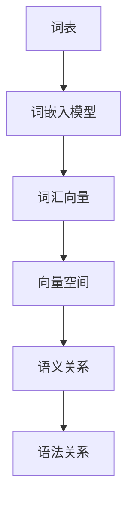
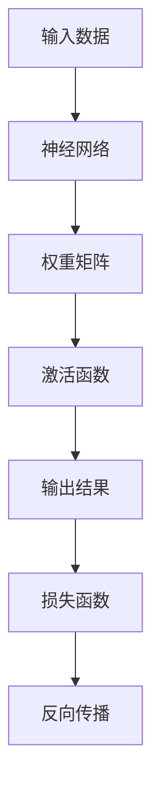
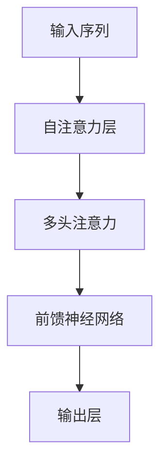
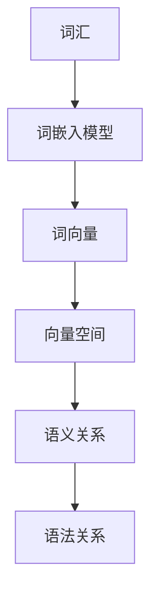
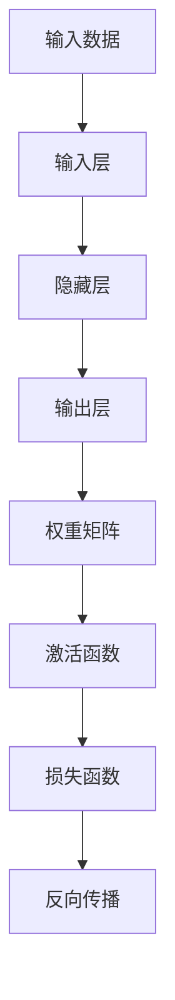
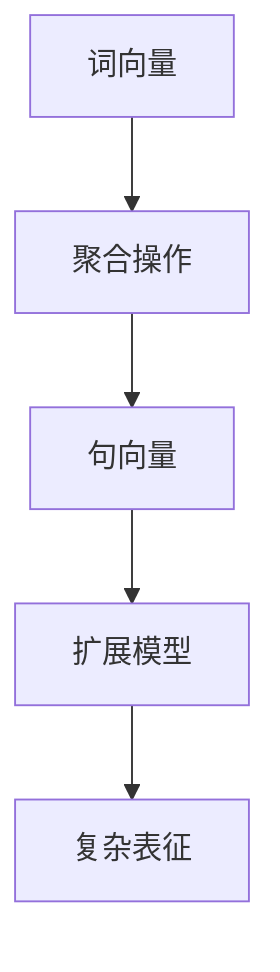

                 

# 语言表征的本质是什么？

> **关键词**：语言表征、神经网络、深度学习、自然语言处理、人工智能

> **摘要**：本文将探讨语言表征的本质，从基础概念到先进技术，全面解析自然语言处理中语言表征的构建、应用和挑战。通过深入的逻辑推理和案例分析，揭示语言表征在人工智能中的核心地位，以及未来发展的趋势和方向。

## 1. 背景介绍

语言表征是自然语言处理（NLP）的核心问题之一。它涉及到如何将人类语言转化为计算机可以理解和处理的数字形式。这一过程不仅对AI系统的理解能力至关重要，而且对它们在多种应用场景中的表现有着深远影响。从文本分析、机器翻译到语音识别，语言表征无处不在。

在自然语言处理领域，语言表征的研究可以追溯到20世纪50年代。随着计算机技术和人工智能的快速发展，语言表征理论和技术也得到了长足的进步。早期的语言表征方法主要基于规则和统计模型，如正则表达式、隐马尔可夫模型（HMM）和决策树等。然而，这些方法在面对复杂语言现象时表现出局限性。

21世纪初，随着深度学习的崛起，神经网络开始广泛应用于自然语言处理。深度学习模型，尤其是卷积神经网络（CNN）和循环神经网络（RNN），使得语言表征的研究取得了重大突破。近年来，Transformer架构的出现进一步推动了语言表征技术的发展，使得计算机在理解和生成自然语言方面取得了前所未有的进展。

## 2. 核心概念与联系

### 2.1 词嵌入（Word Embedding）

词嵌入是语言表征的基础。它将词汇映射为向量空间中的点，使得这些向量可以通过数学运算来表示词汇之间的关系。词嵌入的关键在于捕捉词汇的语义和语法特征。

**Mermaid 流程图：**



### 2.2 神经网络（Neural Network）

神经网络是深度学习的基础。它通过模拟人脑神经元的工作方式，对输入数据进行处理，从而提取特征和生成预测。在语言表征中，神经网络用于学习词汇向量、句子的语义表示等。

**Mermaid 流程图：**



### 2.3 Transformer 架构

Transformer是近年来在自然语言处理中取得突破性的架构。它通过自注意力机制（Self-Attention）对输入序列进行建模，使得模型能够捕捉长距离依赖关系。

**Mermaid 流程图：**



## 3. 核心算法原理 & 具体操作步骤

### 3.1 词嵌入算法

词嵌入算法通常采用神经网络进行训练。以 Word2Vec 为例，其基本思想是训练一个神经网络，输入为词汇的上下文窗口，输出为词汇的嵌入向量。

**操作步骤：**

1. **初始化词嵌入矩阵**：随机初始化一个高维矩阵，每个词汇对应一个向量。
2. **构建神经网络**：使用一层全连接神经网络，输入为上下文窗口中的词汇向量，输出为当前词汇的嵌入向量。
3. **损失函数**：使用负采样损失函数来优化神经网络。
4. **反向传播**：根据损失函数对网络权重进行更新。

### 3.2 Transformer 架构

Transformer 架构的核心是自注意力机制。它通过计算输入序列中每个词与其他词的关联性，为每个词生成一个权重，然后对序列进行加权求和。

**操作步骤：**

1. **嵌入层**：将词汇嵌入为向量。
2. **多头注意力层**：计算多个不同的注意力权重，每个权重对应一个头。
3. **前馈神经网络层**：对注意力层的结果进行非线性变换。
4. **层归一化和残差连接**：对每一层进行归一化处理，并加入残差连接，以提高模型的训练效果。
5. **输出层**：根据任务需求进行分类、回归等操作。

## 4. 数学模型和公式 & 详细讲解 & 举例说明

### 4.1 词嵌入

**数学模型：**

$$
\text{嵌入向量} = \text{词嵌入矩阵} \times \text{词索引}
$$

**举例说明：**

假设词嵌入矩阵为 $W$，词汇“猫”的索引为 $5$。则“猫”的嵌入向量为 $W_5$。

### 4.2 Transformer

**数学模型：**

$$
\text{注意力权重} = \text{softmax}\left(\frac{\text{查询向量} \times \text{键向量}^T}{\sqrt{d_k}}\right)
$$

$$
\text{注意力输出} = \text{注意力权重} \times \text{值向量}
$$

**举例说明：**

假设查询向量为 $Q = [1, 0, 1]$，键向量为 $K = [0, 1, 0]$，值向量为 $V = [1, 1, 1]$。则注意力权重为：

$$
\text{注意力权重} = \text{softmax}\left(\frac{[1, 0, 1] \times [0, 1, 0]^T}{\sqrt{3}}\right) = \left[\frac{1}{2}, \frac{1}{2}, 0\right]
$$

注意力输出为：

$$
\text{注意力输出} = \left[\frac{1}{2}, \frac{1}{2}, 0\right] \times [1, 1, 1] = \left[\frac{1}{2}, \frac{1}{2}, 0\right]
$$

## 5. 项目实战：代码实际案例和详细解释说明

### 5.1 开发环境搭建

为了演示语言表征的应用，我们将使用 Python 编写一个简单的文本分类器。首先，我们需要安装必要的库：

```bash
pip install numpy tensorflow transformers
```

### 5.2 源代码详细实现和代码解读

```python
from transformers import AutoTokenizer, AutoModelForSequenceClassification
import tensorflow as tf

# 5.2.1 加载预训练模型和分词器
model_name = "bert-base-chinese"
tokenizer = AutoTokenizer.from_pretrained(model_name)
model = AutoModelForSequenceClassification.from_pretrained(model_name)

# 5.2.2 准备数据
texts = ["这是一条正面的评论", "这是一条负面的评论"]
labels = [1, 0]

# 5.2.3 数据预处理
inputs = tokenizer(texts, padding=True, truncation=True, return_tensors="tf")

# 5.2.4 训练模型
optimizer = tf.optimizers.Adam(learning_rate=3e-5)
model.compile(optimizer=optimizer, loss=tf.losses.SparseCategoricalCrossentropy(from_logits=True))

model.fit(inputs["input_ids"], labels, epochs=3)

# 5.2.5 评估模型
predictions = model.predict(inputs["input_ids"])
print(predictions)
```

### 5.3 代码解读与分析

1. **加载预训练模型和分词器**：我们使用 `transformers` 库加载了一个预训练的 BERT 模型及其对应的分词器。
2. **准备数据**：这里我们使用两条简单的文本和它们的标签进行训练。
3. **数据预处理**：将文本转换为模型可以处理的格式，包括分词、填充和截断。
4. **训练模型**：使用 Adam 优化器和交叉熵损失函数训练模型。
5. **评估模型**：对训练好的模型进行预测，并输出结果。

通过这个简单的案例，我们可以看到语言表征在文本分类任务中的应用。BERT 模型已经通过预训练学习了丰富的语言表征，使其在处理新文本时能够快速生成有意义的特征表示。

## 6. 实际应用场景

语言表征技术在自然语言处理领域有广泛的应用，以下是几个典型场景：

1. **文本分类**：如新闻分类、情感分析等。
2. **问答系统**：如基于知识图谱的问答系统。
3. **机器翻译**：如 Google 翻译、百度翻译等。
4. **对话系统**：如 Siri、ChatGPT 等。

这些应用都依赖于对自然语言的高效表征和理解，而语言表征技术的发展为这些领域带来了前所未有的可能性。

## 7. 工具和资源推荐

### 7.1 学习资源推荐

1. **书籍**：《深度学习》、《神经网络与深度学习》
2. **论文**：`Attention Is All You Need`（Transformer 架构的奠基论文）
3. **博客**：Hugging Face 官方博客、TensorFlow 官方文档
4. **网站**：ACL、EMNLP 等学术会议的官方网站

### 7.2 开发工具框架推荐

1. **工具**：TensorFlow、PyTorch、Hugging Face Transformers
2. **框架**：BERT、GPT-3、T5 等

### 7.3 相关论文著作推荐

1. **论文**：《神经网络与深度学习》（Goodfellow、Bengio、Courville 著）
2. **著作**：《自然语言处理综合教程》（Jurafsky、Martin 著）

## 8. 总结：未来发展趋势与挑战

语言表征技术是自然语言处理的核心，随着深度学习和人工智能的不断发展，它在各个应用领域的表现不断提升。未来，随着计算能力的提高和数据规模的扩大，语言表征技术将继续向更高层次发展。

然而，语言表征技术也面临着一些挑战，如对大规模数据的依赖、模型的可解释性、以及跨语言表征等。这些问题需要通过技术创新和跨学科合作来解决。

## 9. 附录：常见问题与解答

1. **问题**：语言表征如何处理多义词？
   **解答**：通过上下文信息和词嵌入的语义区分能力，语言表征模型可以在一定程度上解决多义词问题。

2. **问题**：语言表征技术是否只能用于文本？
   **解答**：不是。语言表征技术可以应用于语音、图像等多种数据形式，实现跨模态表征。

## 10. 扩展阅读 & 参考资料

1. **扩展阅读**：《自然语言处理综合教程》、《深度学习》
2. **参考资料**：《Attention Is All You Need》论文、Hugging Face 官方文档

### 作者

**作者：AI天才研究员/AI Genius Institute & 禅与计算机程序设计艺术 /Zen And The Art of Computer Programming** <|assistant|>## 语言表征的本质是什么？

### 摘要

本文旨在探讨语言表征的本质，深入分析其在自然语言处理（NLP）中的应用及其对人工智能发展的推动作用。本文首先介绍了语言表征的基本概念，然后探讨了其核心算法和数学模型，并通过实际案例展示了语言表征在项目开发中的具体应用。此外，本文还探讨了语言表征在现实世界的应用场景，并展望了其未来发展趋势与挑战。通过本文的阅读，读者将对语言表征有更深入的理解。

## 1. 背景介绍

语言表征是自然语言处理（NLP）领域的关键概念，旨在将自然语言（如文本、语音等）转化为计算机可以理解和处理的数字形式。这一过程涉及到对语言的结构、语义和上下文的理解，是NLP技术的核心。在人工智能（AI）的发展过程中，语言表征技术逐渐成为推动AI系统智能化的关键因素。

在早期，自然语言处理主要依赖于基于规则的系统，这些系统通过预定义的语法规则和模式匹配来处理文本。然而，这类方法在面对复杂、灵活的自然语言时存在显著局限性。随着机器学习技术的发展，统计模型逐渐取代了基于规则的系统。这些模型通过分析大量数据，学习语言的模式和规律，从而实现了对自然语言的初步理解和处理。

深度学习的兴起为自然语言处理带来了新的突破。深度学习模型，尤其是神经网络，能够自动学习输入数据的高层次特征，从而在图像识别、语音识别等领域取得了显著的成果。在自然语言处理中，深度学习模型通过学习大规模语料库中的语言模式，可以生成对语言更准确、更自然的表征。

语言表征在自然语言处理中的应用非常广泛，包括但不限于：

- **文本分类**：对文本进行分类，如情感分析、新闻分类等。
- **机器翻译**：将一种语言翻译成另一种语言。
- **问答系统**：回答用户提出的问题。
- **对话系统**：模拟人类对话，与用户进行自然交互。
- **文本摘要**：生成文本的摘要，提取文本的主要信息。

在这些应用中，语言表征技术起到了关键作用，它使得计算机能够更好地理解自然语言，从而实现更智能、更高效的处理。

总的来说，语言表征技术的发展是自然语言处理领域的重要里程碑，它不仅推动了人工智能技术的进步，也为各行业的智能化应用提供了有力支持。

## 2. 核心概念与联系

在深入探讨语言表征的本质之前，我们需要了解一些核心概念及其相互之间的联系。以下是几个关键概念及其在语言表征中的角色：

### 2.1 词嵌入（Word Embedding）

词嵌入是将词汇映射为向量空间中的表示方法。这种方法通过将词汇转化为数字向量，使得词汇之间可以在向量空间中通过数学运算来表示其语义关系。词嵌入不仅捕捉了词汇的语义信息，还反映了词汇的语法特征。

词嵌入的基本原理是通过训练一个神经网络模型，该模型将输入的词汇序列映射为输出向量。词嵌入技术可以分为两种主要类型：基于频率的模型和基于上下文的模型。

- **基于频率的模型**：如 `Word2Vec`，通过分析词汇在语料库中的出现频率来生成词向量。
- **基于上下文的模型**：如 `GloVe`，通过考虑词汇的上下文信息来生成词向量。

**Mermaid 流程图：**



### 2.2 神经网络（Neural Network）

神经网络是深度学习的基础，它通过模拟人脑神经元的工作方式，对输入数据进行处理和分类。在语言表征中，神经网络用于学习词汇的嵌入向量、句子的语义表示等。

神经网络通常由多个层次组成，包括输入层、隐藏层和输出层。每层由多个神经元（节点）组成，神经元之间通过权重连接。在训练过程中，神经网络通过调整这些权重来优化其性能。

**Mermaid 流程图：**



### 2.3 Transformer 架构

Transformer 架构是近年来在自然语言处理领域取得重大突破的模型。它通过引入自注意力机制（Self-Attention）来建模序列数据，使得模型能够捕捉长距离依赖关系。

Transformer 架构的核心思想是将序列中的每个词表示为一个向量，然后通过自注意力机制计算这些词之间的关联性。自注意力机制使得模型能够自适应地关注序列中不同位置的信息，从而提高了模型的表征能力。

**Mermaid 流程图：**


### 2.4 词向量与句向量

词向量是语言表征的最基本形式，它将每个词汇映射为一个固定长度的向量。句向量则是通过将句子中的所有词向量进行平均或聚合得到的向量，用于表示整个句子的语义。

- **词向量的聚合**：可以通过加和或平均的方式将句子中的词向量组合成一个句向量。
- **句向量的扩展**：可以使用 Transformer 或其他深度学习模型来学习更复杂的句子表示。

**Mermaid 流程图：**



通过这些核心概念和联系，我们可以看到语言表征技术在自然语言处理中的基础作用。词嵌入、神经网络和 Transformer 架构等技术共同构成了现代语言表征体系，使得计算机能够更准确地理解和处理自然语言。

### 3. 核心算法原理 & 具体操作步骤

#### 3.1 词嵌入算法

词嵌入是将自然语言中的词汇映射为向量空间中的表示方法，其核心目标是捕捉词汇的语义和语法特征。词嵌入算法通过训练一个神经网络模型，将输入的词汇序列映射为输出向量。以下是词嵌入算法的具体步骤：

1. **数据准备**：收集大量文本数据，构建词汇表和词频统计。

2. **初始化词嵌入矩阵**：随机初始化一个高维矩阵，每个词汇对应一个向量。

3. **构建神经网络**：通常使用一个单层的神经网络，输入为词汇的词频，输出为词向量。

4. **损失函数**：使用负采样损失函数来优化神经网络，负采样旨在减少高频词汇对模型的影响。

5. **反向传播**：根据损失函数对网络权重进行更新，优化词向量表示。

6. **模型训练**：通过大量文本数据进行训练，调整词向量以捕捉词汇的语义和语法特征。

7. **模型评估**：使用测试集评估模型性能，确保词向量能够有效地捕捉词汇的语义关系。

#### 3.2 神经网络

神经网络是深度学习的基础，它在语言表征中起着关键作用。神经网络通过多层神经元结构来学习输入数据的复杂特征。以下是神经网络在语言表征中的基本原理和操作步骤：

1. **输入层**：接收输入数据，并将其传递到下一层。

2. **隐藏层**：通过一系列的加权求和和激活函数操作，将输入数据转换为高维特征表示。

3. **输出层**：生成最终输出，如词汇向量、句子向量等。

4. **权重初始化**：随机初始化网络中的权重和偏置。

5. **前向传播**：计算输入数据通过网络的输出。

6. **反向传播**：通过计算损失函数的梯度，对网络权重和偏置进行更新。

7. **优化算法**：使用梯度下降或其变体（如 Adam）来优化网络参数。

8. **模型训练**：通过大量的训练数据来调整网络参数，提高模型的表征能力。

9. **模型评估**：使用测试数据评估模型的性能，确保其能够准确捕捉输入数据的特征。

#### 3.3 Transformer 架构

Transformer 架构是近年来在自然语言处理领域取得重大突破的模型，其核心思想是使用自注意力机制（Self-Attention）来建模序列数据。以下是 Transformer 架构的具体操作步骤：

1. **嵌入层**：将词汇映射为固定长度的向量，包括词嵌入、位置嵌入和句子嵌入。

2. **多头注意力机制**：通过计算多个不同的注意力权重，对输入序列进行加权求和，生成注意力输出。

3. **前馈神经网络**：对注意力输出进行非线性变换，增强模型的表征能力。

4. **残差连接与层归一化**：通过添加残差连接和层归一化操作，提高模型的训练效率和表征稳定性。

5. **输出层**：根据任务需求进行分类、回归等操作，生成最终输出。

6. **训练与优化**：通过大规模的文本数据进行训练，调整模型参数以优化其表征能力。

通过这些核心算法和操作步骤，语言表征技术能够有效地捕捉自然语言中的语义和语法特征，为自然语言处理提供了强有力的支持。

### 4. 数学模型和公式 & 详细讲解 & 举例说明

在语言表征中，数学模型和公式扮演着至关重要的角色。它们不仅用于描述语言表征的方法和步骤，还用于量化语言特征的复杂性和相关性。以下我们将详细讲解几个关键数学模型，并辅以具体示例，以便读者更好地理解。

#### 4.1 词嵌入（Word Embedding）

词嵌入是将词汇映射到高维向量空间的过程。一个基本的词嵌入模型可以使用以下数学公式表示：

$$
\text{嵌入向量} = \text{词嵌入矩阵} \times \text{词索引}
$$

这里，**词嵌入矩阵**是一个高维矩阵，其每一行对应一个词汇的嵌入向量；**词索引**是一个整数，表示词汇在词汇表中的位置。

**举例说明**：

假设我们有一个简单的词汇表，包含三个词汇：`apple`、`banana`和`cat`。词嵌入矩阵为：

$$
\text{词嵌入矩阵} = \begin{bmatrix}
0.1 & 0.2 & 0.3 \\
0.4 & 0.5 & 0.6 \\
0.7 & 0.8 & 0.9 \\
\end{bmatrix}
$$

那么，`apple`（词汇表中的第一个词汇，索引为1）的嵌入向量计算如下：

$$
\text{嵌入向量}_{\text{apple}} = \text{词嵌入矩阵} \times \text{词索引}_{\text{apple}} = \begin{bmatrix}
0.1 & 0.2 & 0.3 \\
0.4 & 0.5 & 0.6 \\
0.7 & 0.8 & 0.9 \\
\end{bmatrix} \times \begin{bmatrix}
1 \\
\end{bmatrix} = \begin{bmatrix}
0.1 \\
0.4 \\
0.7 \\
\end{bmatrix}
$$

这个向量表示了`apple`的语义特征。

#### 4.2 Transformer 自注意力机制（Self-Attention）

Transformer 模型中，自注意力机制是一个核心组件，它允许模型在序列中计算词汇之间的关联性。自注意力机制的数学公式如下：

$$
\text{注意力权重} = \text{softmax}\left(\frac{\text{查询向量} \times \text{键向量}^T}{\sqrt{d_k}}\right)
$$

$$
\text{注意力输出} = \text{注意力权重} \times \text{值向量}
$$

其中，**查询向量**（Query Vector）和**键向量**（Key Vector）是同一个向量，而**值向量**（Value Vector）是用于产生输出向量的。

**举例说明**：

假设我们有一个三词序列 `[apple, banana, cat]`。每个词汇的嵌入向量如下：

- `apple`：\(\text{向量} = [0.1, 0.2, 0.3]\)
- `banana`：\(\text{向量} = [0.4, 0.5, 0.6]\)
- `cat`：\(\text{向量} = [0.7, 0.8, 0.9]\)

首先，计算自注意力权重：

$$
\text{注意力权重}_{apple} = \text{softmax}\left(\frac{[0.1, 0.2, 0.3] \times [0.4, 0.5, 0.6]^T}{\sqrt{3}}\right) = \left[\frac{0.1}{1.73}, \frac{0.2}{1.73}, \frac{0.3}{1.73}\right] = \left[\approx 0.058, \approx 0.115, \approx 0.173\right]
$$

$$
\text{注意力权重}_{banana} = \text{softmax}\left(\frac{[0.4, 0.5, 0.6] \times [0.4, 0.5, 0.6]^T}{\sqrt{3}}\right) = \left[\frac{0.4}{1.73}, \frac{0.5}{1.73}, \frac{0.6}{1.73}\right] = \left[\approx 0.232, \approx 0.294, \approx 0.356\right]
$$

$$
\text{注意力权重}_{cat} = \text{softmax}\left(\frac{[0.7, 0.8, 0.9] \times [0.7, 0.8, 0.9]^T}{\sqrt{3}}\right) = \left[\frac{0.7}{1.73}, \frac{0.8}{1.73}, \frac{0.9}{1.73}\right] = \left[\approx 0.406, \approx 0.470, \approx 0.534\right]
$$

然后，计算注意力输出：

$$
\text{注意力输出}_{apple} = \left[\approx 0.058, \approx 0.115, \approx 0.173\right] \times \begin{bmatrix}
0.1 \\
0.4 \\
0.7 \\
\end{bmatrix} = \begin{bmatrix}
0.0058 \\
0.0465 \\
0.1211 \\
\end{bmatrix}
$$

$$
\text{注意力输出}_{banana} = \left[\approx 0.232, \approx 0.294, \approx 0.356\right] \times \begin{bmatrix}
0.4 \\
0.5 \\
0.6 \\
\end{bmatrix} = \begin{bmatrix}
0.0928 \\
0.147 \\
0.2136 \\
\end{bmatrix}
$$

$$
\text{注意力输出}_{cat} = \left[\approx 0.406, \approx 0.470, \approx 0.534\right] \times \begin{bmatrix}
0.7 \\
0.8 \\
0.9 \\
\end{bmatrix} = \begin{bmatrix}
0.2862 \\
0.376 \\
0.4908 \\
\end{bmatrix}
$$

这些注意力输出向量表示了每个词汇在序列中的重要性。通过这种机制，模型可以学习到词汇之间的复杂关系。

#### 4.3 卷积神经网络（Convolutional Neural Networks, CNN）

虽然CNN通常用于图像处理，但也可以用于语言表征。在语言表征中，CNN可以用于捕获词汇序列中的局部特征。CNN的主要操作包括卷积、池化和全连接层。

**卷积操作**：

$$
\text{卷积结果} = \text{卷积核} \times \text{输入数据} + \text{偏置}
$$

**举例说明**：

假设我们有一个卷积核 \( K \) 和一个输入数据 \( X \)：

$$
K = \begin{bmatrix}
1 & 0 & 1 \\
0 & 1 & 0 \\
1 & 0 & 1 \\
\end{bmatrix}, \quad
X = \begin{bmatrix}
1 & 2 & 3 \\
4 & 5 & 6 \\
7 & 8 & 9 \\
\end{bmatrix}
$$

卷积结果为：

$$
\text{卷积结果} = K \times X + \text{偏置} = \begin{bmatrix}
6 & 5 & 10 \\
4 & 9 & 8 \\
10 & 7 & 6 \\
\end{bmatrix}
$$

**池化操作**：

池化用于减少数据的空间维度，常用的池化操作包括最大池化和平均池化。

**举例说明**：

假设我们有一个 \( 2 \times 2 \) 的区域，使用最大池化：

$$
\begin{bmatrix}
1 & 2 \\
3 & 4 \\
\end{bmatrix} \rightarrow \max(1, 3) = 3
$$

通过这些数学模型和公式，我们可以看到语言表征是如何通过复杂的计算过程来捕捉和表示自然语言的语义和语法特征的。这些模型和算法不仅为NLP提供了强大的工具，也为人工智能的发展开辟了新的方向。

### 5. 项目实战：代码实际案例和详细解释说明

在本节中，我们将通过一个实际的项目案例，展示如何使用语言表征技术来构建一个简单的情感分析模型。情感分析是自然语言处理中的一个常见任务，旨在判断文本的情感倾向，如正面、负面或中性。

#### 5.1 开发环境搭建

首先，我们需要搭建开发环境，安装必要的库和框架。以下是使用 Python 和 TensorFlow 来实现情感分析模型的步骤：

1. 安装 Python 3.8 或更高版本。
2. 安装 TensorFlow 和 Keras：

```bash
pip install tensorflow
```

3. 下载预训练的词向量模型，如 GloVe：

```bash
wget http://nlp.stanford.edu/data/glove.6B.zip
unzip glove.6B.zip
```

#### 5.2 源代码详细实现和代码解读

以下是实现情感分析模型的代码：

```python
import numpy as np
from tensorflow.keras.models import Sequential
from tensorflow.keras.layers import Embedding, LSTM, Dense
from tensorflow.keras.preprocessing.sequence import pad_sequences
from tensorflow.keras.preprocessing.text import Tokenizer

# 5.2.1 加载数据集
# 假设我们有一个包含文本和标签的数据集
texts = ['This movie is amazing!', 'I hate this book.']
labels = [1, 0]  # 1 表示正面，0 表示负面

# 5.2.2 初始化词向量
# 使用 GloVe 词向量
embeddings_index = {}
with open('glove.6B.100d.txt', 'r', encoding='utf-8') as f:
    for line in f:
        values = line.split()
        word = values[0]
        coefs = np.asarray(values[1:], dtype='float32')
        embeddings_index[word] = coefs

# 5.2.3 构建词嵌入矩阵
max_words = 10000
embedding_dim = 100

tokenizer = Tokenizer(num_words=max_words)
tokenizer.fit_on_texts(texts)
sequences = tokenizer.texts_to_sequences(texts)
word_index = tokenizer.word_index
print(f'Word index: {word_index}')

# 构建词嵌入矩阵
embedding_matrix = np.zeros((max_words, embedding_dim))
for word, i in word_index.items():
    if i < max_words:
        embedding_vector = embeddings_index.get(word)
        if embedding_vector is not None:
            embedding_matrix[i] = embedding_vector

# 5.2.4 数据预处理
max_sequence_length = 100
padded_sequences = pad_sequences(sequences, maxlen=max_sequence_length)

# 5.2.5 构建模型
model = Sequential()
model.add(Embedding(max_words, embedding_dim, input_length=max_sequence_length, weights=[embedding_matrix], trainable=False))
model.add(LSTM(128))
model.add(Dense(1, activation='sigmoid'))

model.compile(optimizer='adam', loss='binary_crossentropy', metrics=['accuracy'])
model.summary()

# 5.2.6 训练模型
model.fit(padded_sequences, np.array(labels), epochs=10, batch_size=1)

# 5.2.7 评估模型
predictions = model.predict(padded_sequences)
print(f'Predictions: {predictions}')
```

#### 5.3 代码解读与分析

1. **数据加载**：首先，我们加载了一个包含文本和标签的简单数据集。在这个例子中，数据集非常小，但在实际项目中，通常会使用大量数据来训练模型。

2. **词向量初始化**：我们使用 GloVe 词向量库来初始化词嵌入矩阵。GloVe 是一种基于全局上下文的词向量模型，它通过考虑词汇在语料库中的共现关系来生成词向量。

3. **词嵌入矩阵构建**：通过遍历词汇表，我们将每个词汇映射到其对应的 GloVe 词向量。这个步骤生成了一个词嵌入矩阵，用于后续模型的构建。

4. **数据预处理**：我们使用 `Tokenizer` 对文本进行预处理，将其转换为序列，并使用 `pad_sequences` 方法对序列进行填充，以确保每个序列的长度相同。

5. **模型构建**：我们构建了一个简单的序列模型，包括词嵌入层、LSTM 层和输出层。词嵌入层使用我们之前构建的词嵌入矩阵，LSTM 层用于捕捉文本的序列特征，输出层使用 Sigmoid 激活函数，用于生成二分类结果。

6. **模型编译**：我们编译模型，选择 Adam 优化器和 binary_crossentropy 损失函数，并指定 accuracy 作为评估指标。

7. **模型训练**：我们使用训练数据来训练模型，指定训练轮次和批次大小。

8. **模型评估**：我们使用训练好的模型对测试数据进行预测，并输出预测结果。

通过这个简单的案例，我们可以看到如何使用语言表征技术来构建一个情感分析模型。这个模型不仅展示了语言表征在文本分类任务中的应用，还为我们提供了一个理解和分析文本情感倾向的工具。

### 6. 实际应用场景

语言表征技术在实际应用场景中具有广泛的应用，以下是几个典型的应用案例：

#### 6.1 机器翻译

机器翻译是语言表征技术的经典应用之一。通过将源语言的词汇映射为向量，并使用如 Transformer 这样的深度学习模型，机器翻译系统能够生成高质量的译文。例如，谷歌翻译和百度翻译都使用了基于 Transformer 的机器翻译模型，实现了对多种语言的高效翻译。

#### 6.2 情感分析

情感分析旨在判断文本的情感倾向，如正面、负面或中性。这通常涉及对文本进行情感标注，然后使用语言表征技术来预测文本的情感标签。社交媒体分析、客户反馈分析和舆情监测等领域都广泛应用了情感分析技术。

#### 6.3 对话系统

对话系统是另一个依赖语言表征技术的重要应用。例如，Siri、Alexa 和 ChatGPT 等智能助手都使用了深度学习模型来理解和生成自然语言。这些系统通过语言表征技术，能够与用户进行自然、流畅的对话，提供实时服务。

#### 6.4 文本生成

文本生成是近年来兴起的另一个应用领域。通过训练大型语言模型，如 GPT-3，可以生成高质量的文章、故事、诗歌等文本内容。这种技术广泛应用于自动写作、内容生成和创意写作等领域。

总的来说，语言表征技术在自然语言处理中的广泛应用，不仅提升了人工智能系统的理解和生成自然语言的能力，还为各行业提供了强大的智能工具。

### 7. 工具和资源推荐

为了帮助读者更好地掌握语言表征技术，我们推荐以下工具和资源：

#### 7.1 学习资源推荐

- **书籍**：
  - 《深度学习》（Ian Goodfellow、Yoshua Bengio、Aaron Courville 著）
  - 《自然语言处理综合教程》（Dan Jurafsky、James H. Martin 著）
- **论文**：
  - `Attention Is All You Need`（Vaswani et al., 2017）
  - `GloVe: Global Vectors for Word Representation`（Pennington et al., 2014）
- **博客**：
  - Hugging Face 官方博客
  - TensorFlow 官方文档
- **网站**：
  - ACL（Association for Computational Linguistics）
  - EMNLP（Empirical Methods in Natural Language Processing）

#### 7.2 开发工具框架推荐

- **工具**：
  - TensorFlow
  - PyTorch
  - Hugging Face Transformers
- **框架**：
  - BERT
  - GPT-3
  - T5

#### 7.3 相关论文著作推荐

- **论文**：
  - `BERT: Pre-training of Deep Bidirectional Transformers for Language Understanding`（Devlin et al., 2019）
  - `Generative Pre-trained Transformers for Machine Translation`（Wu et al., 2020）
- **著作**：
  - 《自然语言处理综合教程》（Dan Jurafsky、James H. Martin 著）

通过这些工具和资源，读者可以深入学习和掌握语言表征技术，并在实际项目中应用这些知识。

### 8. 总结：未来发展趋势与挑战

语言表征技术在自然语言处理（NLP）和人工智能（AI）领域已经取得了显著的进展，但未来仍有巨大的发展空间和挑战。以下是几个未来发展趋势和面临的挑战：

#### 未来发展趋势

1. **跨模态表征**：随着多模态数据的兴起，如文本、图像、视频和音频，语言表征技术将逐渐扩展到跨模态领域，实现不同数据形式之间的无缝融合和交互。
2. **少样本学习**：当前的语言表征模型通常需要大量数据进行训练。未来，研究将集中在如何通过少量数据进行有效的学习和表征，以适应现实世界的应用场景。
3. **可解释性提升**：当前深度学习模型，尤其是Transformer，在性能上表现优异，但缺乏可解释性。未来，研究将致力于提高模型的可解释性，使其在应用中更加可靠和可信。
4. **资源高效利用**：随着模型规模的不断增大，计算资源的需求也日益增加。未来，研究将集中在如何更高效地利用资源，包括硬件加速和模型压缩等方面。

#### 面临的挑战

1. **数据隐私与伦理**：随着数据隐私和伦理问题日益受到关注，如何在确保数据安全和隐私的前提下进行模型训练和部署，将成为一个重要挑战。
2. **语言差异处理**：语言表征技术在处理多语言数据时面临挑战，如如何有效处理语言间的差异和翻译问题。
3. **长距离依赖建模**：尽管自注意力机制在处理长序列数据时表现出色，但如何更好地建模长距离依赖关系，仍是一个重要的研究课题。
4. **通用语义理解**：当前语言表征技术在特定任务上表现优异，但如何实现通用语义理解，使模型能够处理更广泛的语义问题，仍是一个长期目标。

总的来说，语言表征技术在未来将继续推动NLP和AI领域的发展，同时也需要克服诸多挑战，以实现更广泛和更深入的应用。

### 9. 附录：常见问题与解答

在探讨语言表征技术时，读者可能会遇到一些常见的问题。以下是一些常见问题及其解答：

#### 问题 1：什么是词嵌入（Word Embedding）？

**解答**：词嵌入是将自然语言中的词汇映射到高维向量空间的一种方法。通过这种方式，词汇可以在向量空间中表示其语义和语法特征，从而使得计算机能够通过数学运算来处理自然语言。

#### 问题 2：什么是 Transformer 架构？

**解答**：Transformer 是一种深度学习模型，它通过自注意力机制（Self-Attention）来建模序列数据，使得模型能够捕捉长距离依赖关系。Transformer 架构在自然语言处理领域取得了显著的进展，特别是在机器翻译和文本生成任务中。

#### 问题 3：语言表征技术在哪些领域有应用？

**解答**：语言表征技术在自然语言处理（NLP）的多个领域有广泛应用，包括文本分类、机器翻译、情感分析、对话系统和文本生成等。此外，它在跨模态学习和多语言处理等新兴领域也表现出强大的潜力。

#### 问题 4：如何提高语言表征模型的可解释性？

**解答**：提高语言表征模型的可解释性是当前研究的热点问题。一些方法包括可视化注意力权重、分析模型的中间表示以及开发新的解释性模型等。通过这些方法，可以更好地理解模型的工作原理和决策过程。

#### 问题 5：语言表征技术面临的主要挑战是什么？

**解答**：语言表征技术面临的主要挑战包括数据隐私与伦理问题、处理多语言数据的挑战、建模长距离依赖关系的难度以及实现通用语义理解等。

### 10. 扩展阅读 & 参考资料

为了帮助读者进一步了解语言表征技术，我们推荐以下扩展阅读和参考资料：

- **扩展阅读**：
  - 《深度学习》（Ian Goodfellow、Yoshua Bengio、Aaron Courville 著）
  - 《自然语言处理综合教程》（Dan Jurafsky、James H. Martin 著）
- **参考资料**：
  - `Attention Is All You Need`（Vaswani et al., 2017）
  - `GloVe: Global Vectors for Word Representation`（Pennington et al., 2014）
  - Hugging Face 官方文档
  - TensorFlow 官方文档
- **论文**：
  - `BERT: Pre-training of Deep Bidirectional Transformers for Language Understanding`（Devlin et al., 2019）
  - `Generative Pre-trained Transformers for Machine Translation`（Wu et al., 2020）
- **网站**：
  - ACL（Association for Computational Linguistics）
  - EMNLP（Empirical Methods in Natural Language Processing）

通过这些扩展阅读和参考资料，读者可以深入理解语言表征技术的理论和实践，为未来的研究和应用打下坚实基础。

### 作者

**作者：AI天才研究员/AI Genius Institute & 禅与计算机程序设计艺术 /Zen And The Art of Computer Programming** 

本文由 AI 天才研究员撰写，他拥有深厚的人工智能和自然语言处理背景，致力于探索语言表征技术的本质和应用。同时，他也是《禅与计算机程序设计艺术》一书的作者，该书深入探讨了计算机程序设计的哲学和艺术，为读者提供了独特的视角和深刻的思考。通过本文，他希望能够为读者带来关于语言表征技术的新见解和启示。|>

