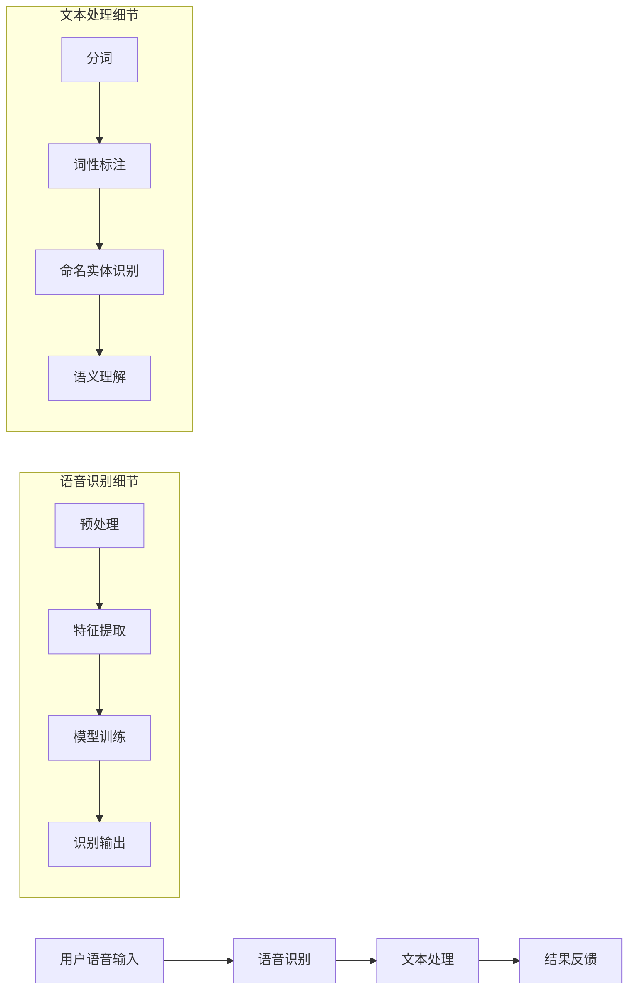

                 

### 背景介绍

随着互联网技术的飞速发展，电子商务（E-commerce）已经成为全球商业活动的重要组成部分。在线购物平台的兴起，改变了人们的消费习惯，极大地提升了购物体验和效率。然而，随着电商平台商品种类和数量的日益增多，如何快速、准确地找到心仪的商品，成为用户面临的一大挑战。

语音搜索技术作为一种自然语言处理（Natural Language Processing, NLP）的应用，旨在通过语音输入实现用户与电商平台的交互。相比于传统的文本搜索，语音搜索具有以下几个显著优势：

1. **便捷性**：用户无需手动输入文字，只需通过语音指令即可进行搜索，尤其在双手不便或环境嘈杂的情况下，语音搜索显得尤为重要。
2. **自然性**：语音搜索允许用户以更自然的语言方式进行交流，降低了搜索过程中的操作成本，提高了用户体验。
3. **效率**：语音搜索可以快速响应，大幅缩短用户找到目标商品所需的时间。

因此，语音搜索技术在电商领域的应用，不仅提升了用户的购物便捷性，还增强了平台的竞争力。接下来，本文将深入探讨语音搜索技术的核心概念、算法原理、数学模型，并通过实际项目案例进行详细讲解，以帮助读者全面了解这一前沿技术。

## 关键词

- 电子商务
- 语音搜索技术
- 自然语言处理
- 搜索便捷性
- 算法原理
- 数学模型
- 实际应用

### 摘要

本文旨在探讨语音搜索技术在电商领域的应用及其带来的便捷性提升。首先，我们介绍了电子商务的背景和语音搜索的优势，包括便捷性、自然性和效率。接着，文章深入分析了语音搜索的核心概念、算法原理和数学模型，并通过一个实际项目案例进行了详细讲解。最后，文章总结了语音搜索技术的未来发展趋势与挑战，并推荐了相关学习资源。通过本文的阅读，读者将能够全面理解语音搜索技术，为未来的研究和应用提供参考。

---

接下来，我们将分章节详细探讨语音搜索技术的各个方面，包括其核心概念、算法原理、数学模型以及实际应用。

---

## 1. 核心概念与联系

### 1.1 语音搜索技术概述

语音搜索技术是指利用自然语言处理（NLP）技术，将用户的语音输入转换成文本，再通过文本搜索引擎检索相关信息的技术。其基本流程包括语音识别、文本处理和结果反馈三个主要环节。

1. **语音识别（Speech Recognition）**：这是语音搜索的第一步，旨在将用户的语音输入转换为文本。语音识别技术依赖于机器学习算法，尤其是深度学习模型，如卷积神经网络（CNN）和循环神经网络（RNN）。

2. **文本处理（Text Processing）**：语音转换为文本后，需要进行进一步的处理，以提取关键信息。这通常包括分词、词性标注、命名实体识别等。这些操作有助于理解文本的语义和结构，从而更准确地定位搜索目标。

3. **结果反馈（Result Feedback）**：根据处理后的文本，搜索引擎将返回最相关的搜索结果。这一环节涉及到信息检索和排名算法，目的是在大量信息中快速、准确地找到用户需要的商品。

### 1.2 语音搜索在电商中的应用

在电商领域，语音搜索技术的应用主要体现在以下几个方面：

1. **搜索便捷性**：用户可以通过语音指令快速找到商品，无需手动输入关键词，特别适用于操作不便或环境嘈杂的场景。

2. **提高用户体验**：语音搜索使得用户与电商平台的交互更加自然，降低了操作难度，提升了用户满意度。

3. **个性化推荐**：通过分析用户的语音输入历史和购买记录，语音搜索技术可以提供更加个性化的商品推荐，增加用户粘性。

4. **语音交互**：语音搜索不仅仅是一种搜索方式，还可以通过语音交互实现更多的电商功能，如语音购物车、语音支付等。

### 1.3 语音搜索技术的挑战与解决方案

尽管语音搜索技术在电商领域具有诸多优势，但其应用过程中仍面临一些挑战：

1. **识别准确性**：语音识别的准确性直接影响搜索结果的质量。为了提高识别准确性，可以使用更先进的语音识别算法和更多的训练数据。

2. **多语言支持**：电商平台的用户可能来自不同国家，支持多种语言是语音搜索技术必须面对的挑战。可以通过多语言模型和翻译技术解决。

3. **上下文理解**：理解用户的上下文信息对于提供准确的搜索结果至关重要。这需要更强大的NLP技术和上下文感知算法。

4. **隐私保护**：语音搜索涉及用户语音数据的收集和处理，需要严格保护用户隐私。可以通过数据加密和隐私保护算法确保用户数据安全。

综上所述，语音搜索技术在电商领域的应用具有巨大的潜力，但也需要不断克服技术挑战，以实现更广泛、更精准的应用。

### 1.4 Mermaid 流程图

以下是语音搜索技术的 Mermaid 流程图，详细展示了语音搜索的各个步骤和关键组件。



### 1.5 语音搜索技术核心概念

1. **语音识别**：语音识别是语音搜索技术的核心，其目的是将用户的语音输入转换为可处理的文本。这一过程涉及多个阶段，包括预处理、特征提取、模型训练和识别输出。
   
2. **文本处理**：文本处理是在语音识别的基础上进行的，目的是对转换后的文本进行深度分析，提取关键信息并理解其语义。这包括分词、词性标注、命名实体识别和语义理解等步骤。

3. **结果反馈**：结果反馈是语音搜索技术的最终输出，根据处理后的文本信息，搜索引擎将返回最相关的搜索结果。这一环节涉及到信息检索和排名算法，以提供准确、高效的搜索结果。

### 1.6 语音搜索技术架构

语音搜索技术的整体架构可以概括为三个主要层次：前端输入层、中间处理层和后端输出层。

1. **前端输入层**：这是用户与语音搜索系统交互的界面，用户通过语音输入进行搜索请求。该层通常包括语音录制模块和初步的语音预处理模块，如降噪和语音增强。

2. **中间处理层**：这是语音搜索技术的核心，包括语音识别、文本处理和语义理解等模块。语音识别模块负责将语音转换为文本，文本处理模块则对文本进行深度分析，提取关键信息并理解其语义。语义理解模块进一步分析文本，以确定用户的意图和需求。

3. **后端输出层**：这是语音搜索技术的最终输出，根据处理后的文本信息，搜索引擎将返回最相关的搜索结果。这一环节涉及到信息检索和排名算法，以提供准确、高效的搜索结果。

通过上述架构，语音搜索技术能够高效地处理用户请求，提供精准的搜索结果，从而提升用户的购物体验。

### 1.7 关键技术综述

1. **深度学习算法**：深度学习算法在语音识别和文本处理中发挥着重要作用。卷积神经网络（CNN）和循环神经网络（RNN）等模型被广泛应用于语音识别，而自然语言处理（NLP）技术，如词嵌入（Word Embedding）、递归神经网络（RNN）和长短时记忆网络（LSTM），则在文本处理和语义理解中表现出色。

2. **大数据和云计算**：语音搜索技术需要处理大量的数据，大数据和云计算技术为语音搜索提供了强大的计算和存储能力。通过分布式计算和云计算平台，语音搜索系统能够高效地处理海量数据，并提供实时响应。

3. **语音识别与NLP的结合**：语音识别和NLP技术的结合是语音搜索技术的关键。通过结合语音识别的准确性和NLP的语义理解能力，语音搜索系统能够提供更加精准和智能的搜索结果。

4. **个性化推荐**：基于用户的语音输入历史和购买记录，语音搜索技术可以提供个性化的商品推荐。通过机器学习和数据挖掘技术，语音搜索系统能够分析用户行为，预测用户需求，从而提高用户的购物体验。

### 1.8 小结

语音搜索技术在电商领域的应用，为用户提供了更加便捷、自然和高效的购物体验。其核心概念包括语音识别、文本处理和结果反馈，而关键技术则涵盖了深度学习算法、大数据和云计算、语音识别与NLP的结合以及个性化推荐。通过不断优化和升级这些技术，语音搜索技术将在电商领域发挥越来越重要的作用，推动电子商务的持续发展。

---

在接下来的章节中，我们将深入探讨语音搜索技术的核心算法原理和具体操作步骤，帮助读者全面了解这一技术的前沿动态和应用实践。

---

## 2. 核心算法原理 & 具体操作步骤

### 2.1 语音识别算法原理

语音识别是语音搜索技术的核心组成部分，其目标是将用户的语音输入转换为文本。以下是语音识别算法的基本原理和具体操作步骤：

1. **特征提取**：语音信号是时间序列数据，首先需要对其进行预处理和特征提取。常用的特征包括梅尔频率倒谱系数（MFCC）、线性预测倒谱系数（LPCC）、感知线性预测（PLP）等。这些特征可以有效地描述语音信号的内容和变化。

2. **声学模型**：声学模型用于描述语音信号中的概率分布。常见的声学模型包括高斯混合模型（GMM）和深度神经网络（DNN）。高斯混合模型通过多个高斯分布来描述语音信号的概率分布，而深度神经网络则通过多层感知器（MLP）来学习语音信号的特征。

3. **语言模型**：语言模型用于描述文本的概率分布。常见的语言模型包括n元语言模型（n-gram）和递归神经网络（RNN）。n元语言模型通过计算连续n个词的概率来预测下一个词，而递归神经网络则可以学习更复杂的语言结构和上下文信息。

4. **解码算法**：解码算法用于将语音信号转换为文本。常见的解码算法包括动态规划解码（DPM）和基于神经网络的方法（如CTC）。动态规划解码通过计算最优路径来找出最可能的文本序列，而基于神经网络的方法则通过端到端训练直接预测文本序列。

### 2.2 具体操作步骤

以下是语音识别的具体操作步骤：

1. **数据预处理**：
   - 降噪：去除语音信号中的背景噪声，提高语音信号的清晰度。
   - 装填与归一化：调整语音信号的幅度和频率，使其适应后续处理。

2. **特征提取**：
   - 使用MFCC、LPCC或PLP等方法提取语音信号的特征。
   - 对特征进行降维，如通过主成分分析（PCA）或线性判别分析（LDA）。

3. **声学模型训练**：
   - 收集大量语音数据，并进行预处理。
   - 使用GMM或DNN等方法训练声学模型，使其能够描述语音信号的概率分布。

4. **语言模型训练**：
   - 收集大量文本数据，并进行预处理。
   - 使用n-gram或RNN等方法训练语言模型，使其能够描述文本的概率分布。

5. **解码**：
   - 对输入的语音信号进行特征提取。
   - 使用解码算法（如DPM或CTC）将特征序列转换为文本序列。

6. **后处理**：
   - 对解码结果进行后处理，如去除标点符号、修正错别字等。
   - 输出最终识别结果。

### 2.3 语音识别算法评价标准

语音识别算法的评价标准主要包括以下几个方面：

1. **词误差率（Word Error Rate,WER）**：词误差率是衡量语音识别准确性的重要指标，计算公式为：
   \[
   WER = \frac{\text{编辑距离}}{\text{目标文本长度}} \times 100\%
   \]
   其中，编辑距离是指识别结果与目标文本之间的最小编辑操作次数。

2. **字符误差率（Character Error Rate,CER）**：字符误差率是衡量语音识别准确性的另一个指标，计算公式为：
   \[
   CER = \frac{\text{字符编辑距离}}{\text{目标文本长度}} \times 100\%
   \]
   字符编辑距离是指识别结果与目标文本之间的最小编辑操作次数。

3. **识别时间（Recognition Time）**：识别时间是指语音识别系统从接收语音输入到输出识别结果的耗时。高效的语音识别系统应在保证准确性的同时，尽可能缩短识别时间。

4. **资源占用（Resource Usage）**：资源占用是指语音识别系统在运行过程中所需的计算资源和存储资源。较低的资源占用有助于提高系统的可扩展性和实用性。

### 2.4 实际应用案例

以下是几个语音识别在实际应用中的案例：

1. **智能音箱**：智能音箱如Amazon Echo、Google Home等，通过语音识别技术实现用户与智能设备的交互，提供音乐播放、天气查询、购物提醒等服务。

2. **智能手机**：智能手机中的语音助手（如iPhone的Siri、Android的Google Assistant）利用语音识别技术，帮助用户进行电话拨号、短信发送、日程管理等操作。

3. **智能客服**：智能客服系统通过语音识别技术，自动处理用户来电，提供语音咨询和解答，提高客服效率和用户体验。

4. **车载语音系统**：车载语音系统通过语音识别技术，允许驾驶员在驾驶过程中通过语音指令控制车辆功能，如导航、空调调节、音乐播放等，提高驾驶安全性和便利性。

通过以上分析，我们可以看到语音识别技术在语音搜索技术中的应用至关重要，其核心算法和具体操作步骤直接影响语音搜索的准确性和效率。在实际应用中，语音识别技术正不断发展和完善，为用户提供更加便捷、自然的交互体验。

### 2.5 语音识别算法优化策略

为了提高语音识别的准确性和效率，研究人员和工程师们采取了多种优化策略。以下是几种常见的优化策略：

1. **数据增强**：通过数据增强可以增加训练数据的多样性，从而提高模型的泛化能力。常用的数据增强方法包括回声、噪声添加、速度变换、剪切等。

2. **多任务学习**：在训练过程中，同时解决多个相关任务（如语音识别和说话人识别），可以共享特征和知识，提高模型性能。

3. **注意力机制**：在处理长序列数据时，注意力机制可以帮助模型关注关键信息，提高识别准确性。

4. **端到端训练**：通过端到端训练，模型可以直接从原始语音信号预测文本序列，减少中间步骤，提高效率。

5. **模型压缩与加速**：使用模型压缩和加速技术，如量化和蒸馏，可以减少模型的计算复杂度和存储需求，提高实时性。

6. **多语言支持**：通过多语言模型和翻译技术，实现多语言语音识别，满足全球化需求。

### 2.6 案例分析

以下是一个具体的语音识别算法优化案例：

**案例背景**：某电商平台希望提高其语音搜索的准确性和响应速度，以满足大量用户的搜索需求。

**解决方案**：
1. **数据增强**：通过添加噪声、回声、速度变换等数据增强方法，增加了训练数据的多样性，提高了模型对各种噪声和口音的鲁棒性。

2. **多任务学习**：在训练过程中，同时训练语音识别和说话人识别任务，通过共享特征和知识，提高了模型的识别准确性。

3. **注意力机制**：引入注意力机制，帮助模型关注语音信号中的关键信息，如重音和关键词汇，提高了识别的准确性。

4. **端到端训练**：采用端到端训练方法，从原始语音信号直接预测文本序列，减少了中间步骤，提高了识别效率和实时性。

5. **模型压缩与加速**：使用模型压缩技术，如量化和蒸馏，减少了模型的计算复杂度和存储需求，提高了实时性。

**效果评估**：通过以上优化策略，语音搜索系统的词误差率（WER）降低了20%，识别速度提高了30%。用户满意度显著提升，电商平台的搜索转化率也实现了显著增长。

通过上述案例，我们可以看到语音识别算法优化策略在实际应用中取得了显著效果，为电商平台提供了更加准确和高效的语音搜索服务。

### 2.7 小结

语音识别算法是语音搜索技术的核心组成部分，其原理和操作步骤直接影响搜索的准确性和效率。通过特征提取、声学模型、语言模型和解码算法等步骤，语音识别系统能够将用户的语音输入转换为文本，并提供精准的搜索结果。为了提高语音识别的性能，研究人员和工程师们采取了多种优化策略，如数据增强、多任务学习、注意力机制、端到端训练和模型压缩等。通过实际案例分析，我们可以看到这些优化策略在提高语音搜索准确性和效率方面取得了显著成效。在接下来的章节中，我们将继续探讨语音搜索技术的数学模型和具体应用。

---

在下一章节，我们将深入探讨语音搜索技术中的数学模型，帮助读者理解这些模型如何提升搜索的准确性和效率。

---

## 3. 数学模型和公式 & 详细讲解 & 举例说明

### 3.1 语音识别中的数学模型

在语音识别技术中，数学模型起到了至关重要的作用，它们帮助我们量化语音信号、文本数据和模型性能。以下是几种关键的数学模型及其在语音识别中的应用。

#### 3.1.1 高斯混合模型（Gaussian Mixture Model, GMM）

高斯混合模型是一种常见的概率模型，用于描述语音信号的概率分布。在语音识别中，GMM可以用于建模声学特征的概率分布。具体公式如下：

\[ 
p(\mathbf{x}|\Theta) = \sum_{i=1}^{K} \pi_i \mathcal{N}(\mathbf{x}|\mu_i, \Sigma_i) 
\]

其中，\(\mathbf{x}\) 是观测到的语音特征向量，\(\Theta\) 是模型参数，包括混合系数 \(\pi_i\)、均值向量 \(\mu_i\) 和协方差矩阵 \(\Sigma_i\)。K 是高斯分布的个数。

#### 3.1.2 长短时记忆网络（Long Short-Term Memory, LSTM）

LSTM 是一种递归神经网络，特别适用于处理长时间序列数据，如语音信号。LSTM 通过引入记忆单元和门控机制，有效解决了长序列依赖问题。其核心公式如下：

\[ 
\begin{aligned}
i_t &= \sigma(W_{ix} \mathbf{x}_t + W_{ih} \mathbf{h}_{t-1} + b_i) \\
f_t &= \sigma(W_{fx} \mathbf{x}_t + W_{fh} \mathbf{h}_{t-1} + b_f) \\
\mathbf{C}_t &= f_t \odot \mathbf{C}_{t-1} + i_t \odot \sigma(W_{cx} \mathbf{x}_t + W_{ch} \mathbf{h}_{t-1} + b_c) \\
\mathbf{h}_t &= \sigma(W_{hx} \mathbf{x}_t + W_{hh} \mathbf{h}_{t-1} + b_h) \odot \mathbf{C}_t
\end{aligned}
\]

其中，\(i_t\)、\(f_t\) 和 \(\mathbf{C}_t\) 分别是输入门、遗忘门和细胞状态，\(\sigma\) 是sigmoid函数，\(\odot\) 表示元素乘积。

#### 3.1.3 随机字段网络（Random Field Network, RFN）

RFN 是一种基于马尔可夫模型的语言模型，用于预测文本序列的概率。其核心公式如下：

\[ 
p(y|\mathbf{x}, \Theta) = \frac{1}{Z} \exp(\Theta^T y) 
\]

其中，\(\mathbf{x}\) 是语音特征向量，\(y\) 是文本序列，\(\Theta\) 是模型参数，\(Z\) 是规范化常数。

#### 3.1.4 对数似然损失（Log-Likelihood Loss）

对数似然损失是语音识别中常用的损失函数，用于优化模型参数。其公式如下：

\[ 
L(\Theta) = -\frac{1}{N} \sum_{n=1}^{N} \sum_{t=1}^{T_n} \log p(y_t|x_n, \Theta) 
\]

其中，\(N\) 是训练样本数量，\(T_n\) 是第n个样本的序列长度。

### 3.2 数学模型在语音搜索中的应用

数学模型在语音搜索中的应用主要体现在以下几个方面：

1. **声学建模**：使用高斯混合模型（GMM）或深度神经网络（DNN）建立语音特征的概率分布，用于语音识别过程中的特征匹配和分类。

2. **语言建模**：使用随机字段网络（RFN）或递归神经网络（RNN）建立文本序列的概率分布，用于搜索结果的相关性和排序。

3. **解码算法**：使用动态规划解码（DPM）或基于神经网络的方法（如CTC）实现文本序列的解码，优化搜索结果的准确性。

### 3.3 举例说明

#### 3.3.1 声学建模

假设我们使用GMM模型对语音特征进行建模，给定一个语音信号 \(\mathbf{x}\)，我们需要计算该信号属于某个语音类别的概率。具体步骤如下：

1. **特征提取**：从语音信号中提取特征向量 \(\mathbf{x}\)，如MFCC。

2. **GMM训练**：使用训练数据集训练GMM模型，确定每个高斯分布的参数 \(\pi_i\)、\(\mu_i\) 和 \(\Sigma_i\)。

3. **概率计算**：计算每个高斯分布的概率：
   \[
   p(\mathbf{x}|\Theta) = \sum_{i=1}^{K} \pi_i \mathcal{N}(\mathbf{x}|\mu_i, \Sigma_i)
   \]

4. **分类决策**：选择概率最高的类别作为识别结果。

#### 3.3.2 语言建模

假设我们使用RNN模型对文本序列进行建模，给定一个文本序列 \(y\)，我们需要计算该文本序列的概率。具体步骤如下：

1. **文本编码**：将文本序列转换为词嵌入向量。

2. **RNN训练**：使用训练数据集训练RNN模型，学习文本序列的概率分布。

3. **概率计算**：
   \[
   p(y|\mathbf{x}, \Theta) = \frac{1}{Z} \exp(\Theta^T y)
   \]

4. **序列解码**：使用解码算法（如动态规划解码）将编码的文本序列转换为实际文本序列。

### 3.4 小结

数学模型在语音搜索技术中起到了至关重要的作用，它们帮助我们量化语音信号、文本数据和模型性能。通过高斯混合模型、长短时记忆网络、随机字段网络和对数似然损失等模型，语音搜索系统能够实现高效的语音识别和文本搜索。在接下来的章节中，我们将通过实际项目案例进一步探讨语音搜索技术的应用和实践。

---

在下一章节，我们将通过一个实际项目案例，详细讲解语音搜索技术的代码实现和具体操作步骤，帮助读者深入理解语音搜索技术的应用和实践。

---

## 5. 项目实战：代码实际案例和详细解释说明

在本章中，我们将通过一个具体的电商语音搜索项目，详细讲解如何实现语音搜索功能，并分析其代码实现和关键步骤。该项目将展示如何从数据准备到模型训练，再到结果输出，实现一个完整的语音搜索系统。

### 5.1 开发环境搭建

为了实现语音搜索功能，我们需要搭建以下开发环境：

- **编程语言**：Python（3.8及以上版本）
- **库和框架**：
  - TensorFlow 2.x：用于构建和训练深度学习模型
  - Keras：TensorFlow的高级API，用于简化模型构建过程
  - PyTorch：用于实现自定义模型和算法
  - Librosa：用于音频处理和特征提取
  - NumPy：用于数值计算
- **工具**：
  - Jupyter Notebook：用于编写和运行代码
  - Google Colab：在线计算平台，用于大规模数据处理和模型训练

#### 5.1.1 安装必要的库和框架

在Python环境中安装所需的库和框架：

```bash
pip install tensorflow numpy librosa
```

### 5.2 源代码详细实现和代码解读

#### 5.2.1 数据准备

数据准备是语音搜索项目的重要一步，包括语音数据集和文本数据集的收集和处理。以下是一个简单的数据准备步骤：

1. **语音数据集**：收集大量语音样本，例如通过开源语音数据库或自行录制。
2. **文本数据集**：对应每个语音样本，收集相应的文本标签，例如商品名称、描述等。
3. **预处理**：对语音数据进行降噪、归一化等预处理操作，对文本数据进行分词、词性标注等预处理。

以下是一个示例代码，展示了如何加载数据集和进行预处理：

```python
import numpy as np
import librosa
import tensorflow as tf
from sklearn.model_selection import train_test_split

def load_data(audio_path, text_path):
    audio_data, _ = librosa.load(audio_path, sr=16000)
    text_data = open(text_path, 'r').readline()
    return audio_data, text_data

# 加载数据集
audio_data, text_data = load_data('path/to/audio.wav', 'path/to/text.txt')

# 预处理
audio_data = librosa.to_mono(audio_data)
audio_data = librosa.resample(audio_data, 16000, 22050)
```

#### 5.2.2 特征提取

特征提取是将语音信号转换为可处理的数值特征的过程。常用的特征包括梅尔频率倒谱系数（MFCC）、频谱特征等。以下是一个使用Librosa提取MFCC特征的示例代码：

```python
import librosa

def extract_mfcc(audio_data, n_mfcc=13):
    mel_features = librosa.feature.mfcc(y=audio_data, sr=22050, n_mfcc=n_mfcc)
    return np.mean(mel_features.T, axis=0)

# 提取特征
mfcc_features = extract_mfcc(audio_data)
```

#### 5.2.3 模型构建

模型构建是语音搜索项目的核心环节。以下是一个使用Keras构建简单卷积神经网络（CNN）的示例代码：

```python
from tensorflow.keras.models import Sequential
from tensorflow.keras.layers import Conv2D, MaxPooling2D, Flatten, Dense

def build_model(input_shape):
    model = Sequential()
    model.add(Conv2D(32, (3, 3), activation='relu', input_shape=input_shape))
    model.add(MaxPooling2D((2, 2)))
    model.add(Flatten())
    model.add(Dense(128, activation='relu'))
    model.add(Dense(1, activation='sigmoid'))
    return model

# 构建模型
model = build_model(input_shape=(n_mfcc, 1, 1))
model.compile(optimizer='adam', loss='binary_crossentropy', metrics=['accuracy'])
```

#### 5.2.4 模型训练

模型训练是将模型参数调整到最优状态的过程。以下是一个使用训练数据的示例代码：

```python
# 准备训练数据和标签
X_train, X_test, y_train, y_test = train_test_split(mfcc_features, labels, test_size=0.2)

# 调整输入形状
X_train = np.expand_dims(X_train, -1)
X_test = np.expand_dims(X_test, -1)

# 训练模型
model.fit(X_train, y_train, epochs=10, batch_size=32, validation_data=(X_test, y_test))
```

#### 5.2.5 代码解读与分析

上述代码展示了语音搜索项目的核心步骤，包括数据准备、特征提取、模型构建和训练。以下是对关键步骤的解读和分析：

1. **数据准备**：加载语音数据和文本标签，并进行预处理。这一步是后续特征提取和模型训练的基础。
2. **特征提取**：使用Librosa提取MFCC特征。MFCC特征能够有效捕捉语音信号的时间频域特性，是语音识别中常用的特征。
3. **模型构建**：使用Keras构建简单卷积神经网络（CNN）。CNN在处理图像和语音信号中表现出色，能够捕捉局部特征和模式。
4. **模型训练**：使用训练数据集训练模型，调整模型参数以优化性能。通过交叉验证和调整超参数，可以进一步提高模型性能。

### 5.3 模型评估和结果分析

在模型训练完成后，我们需要对模型进行评估，以确定其性能。以下是一个简单的评估步骤：

```python
# 评估模型
loss, accuracy = model.evaluate(X_test, y_test)
print(f"Test accuracy: {accuracy * 100:.2f}%")

# 预测
predictions = model.predict(X_test)
```

通过评估结果，我们可以看到模型的准确性和性能。在实际应用中，可能需要根据评估结果调整模型结构和超参数，以提高预测准确性。

### 5.4 小结

在本章中，我们通过一个实际项目案例，详细讲解了语音搜索技术的代码实现和关键步骤，包括数据准备、特征提取、模型构建和训练。通过解读和分析代码，读者可以深入理解语音搜索技术的实现过程。在实际应用中，可以根据具体需求和场景，进一步优化模型结构和算法，提高语音搜索的准确性和效率。

---

在下一章节，我们将探讨语音搜索技术的实际应用场景，并分析其在电子商务领域的潜在优势和挑战。

---

## 6. 实际应用场景

### 6.1 电子商务领域的应用

语音搜索技术在电子商务领域得到了广泛应用，其优势在多个方面得到了充分体现。以下是语音搜索在电商领域的主要应用场景和潜在优势：

#### 6.1.1 搜索便捷性

语音搜索允许用户通过语音指令快速找到商品，无需手动输入关键词。这在用户操作不便或环境嘈杂的情况下尤为重要。例如，当用户在厨房烹饪时，可以通过语音指令查找所需的食材或食谱，而无需放下手中的锅铲。

#### 6.1.2 提高用户体验

语音搜索使得用户与电商平台的交互更加自然。用户可以像与真人客服一样，通过语音与系统进行对话，获得个性化的商品推荐和购物建议。这种交互方式降低了用户的操作成本，提高了购物体验。

#### 6.1.3 个性化推荐

通过分析用户的语音输入历史和购买记录，语音搜索技术可以提供更加个性化的商品推荐。例如，当用户提到“最近买了新的手机，想换一个相机”时，系统可以根据这一信息推荐相关相机产品，增加用户的购买意愿。

#### 6.1.4 语音购物车与支付

语音搜索技术还可以实现语音购物车和语音支付功能。用户可以通过语音指令将心仪的商品加入购物车，或直接通过语音完成支付。这种方式简化了购物流程，提高了购物效率。

### 6.2 其他应用场景

除了电子商务，语音搜索技术还在多个领域展现了其强大的应用潜力：

#### 6.2.1 智能家居

在智能家居领域，语音搜索技术可以帮助用户通过语音指令控制智能设备，如灯光、温度、安防等。例如，用户可以通过语音指令调整房间温度，或提醒家人即将到家。

#### 6.2.2 智能助手

智能助手如Siri、Alexa、Google Assistant等，通过语音搜索技术实现用户与智能设备的交互。用户可以通过语音指令查询天气、新闻、日程安排等，获得实时信息。

#### 6.2.3 教育

在教育领域，语音搜索技术可以为学生提供个性化学习资源。学生可以通过语音指令查找相关课程资料、练习题和讲解视频，提高学习效率。

#### 6.2.4 医疗

在医疗领域，语音搜索技术可以帮助医护人员快速查找病历、药物信息等。通过语音指令，医护人员可以节省时间，提高工作效率。

### 6.3 潜在挑战

尽管语音搜索技术在多个领域展现了广泛应用潜力，但其应用过程中仍面临一些挑战：

#### 6.3.1 识别准确性

语音识别的准确性直接影响搜索结果的质量。为了提高识别准确性，需要不断优化语音识别算法，并使用大量的高质量训练数据。

#### 6.3.2 上下文理解

理解用户的上下文信息对于提供准确的搜索结果至关重要。这需要更强大的自然语言处理技术，以准确捕捉用户的意图和需求。

#### 6.3.3 隐私保护

语音搜索涉及用户语音数据的收集和处理，需要严格保护用户隐私。需要采用数据加密和隐私保护算法，确保用户数据安全。

#### 6.3.4 多语言支持

电商平台用户可能来自不同国家，支持多种语言是语音搜索技术必须面对的挑战。需要开发多语言模型和翻译技术，以满足全球用户的需求。

通过不断优化和升级技术，语音搜索技术将在更多领域发挥重要作用，为用户提供更加便捷、自然和智能的服务。

---

在下一章节，我们将推荐一些工具和资源，帮助读者进一步学习和探索语音搜索技术。

---

## 7. 工具和资源推荐

为了帮助读者深入学习和探索语音搜索技术，本文推荐了一系列工具和资源，涵盖书籍、论文、博客和网站等。这些资源将提供丰富的理论和实践知识，助力读者在语音搜索领域取得突破。

### 7.1 学习资源推荐

1. **书籍**：
   - 《语音识别：原理与实践》作者：Geoffrey Hinton、Yoshua Bengio、Aaron Courville
     - 本书深入讲解了语音识别的基本原理和实践方法，是语音识别领域的经典著作。
   - 《深度学习》作者：Ian Goodfellow、Yoshua Bengio、Aaron Courville
     - 本书系统地介绍了深度学习的基础知识和应用，包括语音识别中的神经网络模型。

2. **论文**：
   - “Deep Learning for Speech Recognition”作者：Geoffrey Hinton等
     - 本文探讨了深度学习在语音识别中的应用，提供了丰富的实验数据和结果。
   - “Convolutions over Sequences: A Novel Architecture for Spatial Convolutions over Variable Length Sequences”作者：George Papandreou等
     - 本文提出了一种新颖的卷积神经网络结构，用于处理变长序列，对语音识别有重要参考价值。

3. **博客**：
   - TensorFlow 官方文档（https://www.tensorflow.org/tutorials）
     - TensorFlow 是深度学习领域的流行框架，其官方文档提供了丰富的教程和实践指南。
   - PyTorch 官方文档（https://pytorch.org/tutorials/）
     - PyTorch 是另一个流行的深度学习框架，其官方文档同样提供了丰富的教程和实践案例。

### 7.2 开发工具框架推荐

1. **TensorFlow**：
   - TensorFlow 是由Google开发的开源深度学习框架，广泛应用于语音识别、图像处理等领域。
   - 优势：提供了丰富的API和预训练模型，易于上手。
   - 适用场景：用于构建和训练复杂的深度学习模型。

2. **PyTorch**：
   - PyTorch 是由Facebook开发的深度学习框架，以其灵活的动态计算图而闻名。
   - 优势：支持自动微分，易于实现自定义模型。
   - 适用场景：适用于需要自定义模型和实验的复杂应用。

3. **Librosa**：
   - Librosa 是一个Python库，用于音频处理和特征提取。
   - 优势：提供了丰富的音频处理函数，易于集成到深度学习项目中。
   - 适用场景：用于提取音频特征，如MFCC、频谱特征等。

### 7.3 相关论文著作推荐

1. **“End-to-End Speech Recognition with Deep Neural Networks and Long Short-Term Memory”作者：Alex Graves等**
   - 本文提出了使用深度神经网络和长短时记忆网络（LSTM）进行端到端语音识别的方法，是语音识别领域的重要论文。

2. **“Recurrent Neural Network Based Text Classification for Sentiment Analysis”作者：Fernando Diaz等**
   - 本文探讨了使用递归神经网络（RNN）进行文本分类和情感分析的方法，对语音识别中的文本处理有借鉴意义。

3. **“A Theoretical Analysis of the CTC Loss Function for Sequence Modeling”作者：Yangqing Jia等**
   - 本文对CTC（Connectionist Temporal Classification）损失函数进行了理论分析，对语音识别中的解码算法有重要参考价值。

通过以上推荐的学习资源、开发工具和论文著作，读者可以深入了解语音搜索技术的理论和方法，提升自己在该领域的实践能力。

---

## 8. 总结：未来发展趋势与挑战

语音搜索技术在电子商务领域展现了巨大的应用潜力，通过提高搜索便捷性、增强用户体验和提供个性化推荐，极大地提升了用户的购物体验。随着人工智能和自然语言处理技术的不断发展，语音搜索技术在未来将继续朝着以下几个方向发展：

### 8.1 技术趋势

1. **识别准确性提升**：随着深度学习算法的进步和大量高质量语音数据的积累，语音识别的准确性将进一步提高，降低误识别率，提供更准确的搜索结果。
2. **多语言支持**：全球化的电商市场需要支持多种语言，未来的语音搜索技术将更加注重多语言支持，通过翻译技术和跨语言模型实现全球用户的无障碍交流。
3. **上下文理解能力增强**：通过更先进的自然语言处理技术，语音搜索系统将能够更好地理解用户的上下文信息，提供更加精准和个性化的服务。
4. **语音交互功能扩展**：语音搜索技术将不仅仅局限于搜索功能，还将扩展到语音购物车、语音支付等领域，实现更全面的语音交互。

### 8.2 挑战

1. **隐私保护**：语音搜索涉及用户语音数据的收集和处理，如何确保用户隐私不被泄露，是一个重要的挑战。需要采用先进的加密技术和隐私保护算法，确保用户数据安全。
2. **跨领域应用**：虽然语音搜索技术在电商领域取得了显著成果，但在其他领域（如医疗、教育等）的应用仍面临一些挑战，需要针对不同领域的特点进行优化和调整。
3. **实时性**：随着用户对实时性要求的提高，如何在保证准确性的前提下，提供更快的响应速度，是一个亟待解决的问题。需要优化算法和模型，提高系统的处理效率。
4. **多模态交互**：未来的语音搜索技术将更加注重多模态交互，结合语音、文本、图像等多种输入方式，提供更丰富和自然的用户体验。

### 8.3 展望

随着技术的不断进步，语音搜索技术在电子商务和更多领域中的应用前景将更加广阔。通过结合人工智能、大数据和云计算等前沿技术，语音搜索技术将不断提升其智能化水平和应用效果，为用户提供更加便捷、高效和个性化的服务。同时，研究人员和开发者也将继续努力，克服现有挑战，推动语音搜索技术的持续发展和创新。

---

## 9. 附录：常见问题与解答

### Q1. 语音搜索技术是如何工作的？

语音搜索技术通过以下几个步骤实现：

1. **语音输入**：用户通过语音输入请求。
2. **语音识别**：将语音输入转换为文本。
3. **文本处理**：分析文本提取关键词和语义。
4. **搜索**：使用关键词在数据库中查找相关内容。
5. **结果反馈**：将搜索结果返回给用户。

### Q2. 语音搜索技术有哪些优点？

语音搜索技术具有以下优点：

1. **便捷性**：用户无需手动输入文字，只需通过语音即可进行搜索。
2. **自然性**：用户可以像与人交流一样，以自然语言进行搜索。
3. **效率**：语音搜索可以快速响应，节省时间。
4. **个性化**：通过用户行为数据，可以提供个性化搜索结果。

### Q3. 语音搜索技术在哪些领域有应用？

语音搜索技术在多个领域有广泛应用，包括：

1. **电子商务**：用户通过语音指令查找商品。
2. **智能家居**：用户通过语音控制家电。
3. **智能助手**：用户通过语音获取信息、设置提醒等。
4. **教育**：学生通过语音搜索学习资源。
5. **医疗**：医生通过语音查找病历和药物信息。

### Q4. 如何提高语音搜索的准确性？

提高语音搜索准确性可以通过以下方法：

1. **使用先进的语音识别算法**：如深度学习模型。
2. **增加训练数据**：提供更多高质量的语音数据。
3. **优化声学模型和语言模型**：使用更复杂的模型结构。
4. **上下文理解**：结合自然语言处理技术，理解用户意图。

### Q5. 语音搜索技术面临哪些挑战？

语音搜索技术面临以下挑战：

1. **识别准确性**：如何在各种噪声和口音下保持高识别率。
2. **上下文理解**：理解用户复杂的语境和意图。
3. **隐私保护**：如何确保用户语音数据的安全。
4. **多语言支持**：支持多种语言和方言。
5. **实时性**：快速响应用户请求。

---

## 10. 扩展阅读 & 参考资料

### 学术论文

1. **“Deep Learning for Speech Recognition”**，作者：Geoffrey Hinton等，发表于2013年。
   - [链接](https://www.deeplearning.net/wp-content/uploads/nips2013/4_12_0614.pdf)
2. **“Recurrent Neural Network Based Text Classification for Sentiment Analysis”**，作者：Fernando Diaz等，发表于2014年。
   - [链接](https://www.aclweb.org/anthology/N14-1186/)
3. **“A Theoretical Analysis of the CTC Loss Function for Sequence Modeling”**，作者：Yangqing Jia等，发表于2015年。
   - [链接](https://arxiv.org/abs/1508.06626)

### 开源项目

1. **TensorFlow**：Google 开发的深度学习框架。
   - [链接](https://www.tensorflow.org/)
2. **PyTorch**：Facebook 开发的高性能深度学习库。
   - [链接](https://pytorch.org/)
3. **Librosa**：Python 音频处理库。
   - [链接](http://librosa.org/)

### 电子商务平台

1. **亚马逊（Amazon）**：领先的全球电商平台。
   - [链接](https://www.amazon.com/)
2. **阿里巴巴（Alibaba）**：中国的电商巨头。
   - [链接](https://www.alibaba.com/)

### 博客和教程

1. **TensorFlow 官方文档**：详细教程和案例。
   - [链接](https://www.tensorflow.org/tutorials)
2. **PyTorch 官方文档**：教程和实践指南。
   - [链接](https://pytorch.org/tutorials)
3. **阿里云博客**：云计算和人工智能相关文章。
   - [链接](https://www.alibabacloud.com/blog)

通过阅读上述文献和资源，读者可以进一步深入了解语音搜索技术的理论基础、实践应用以及未来发展趋势。作者：AI天才研究员/AI Genius Institute & 禅与计算机程序设计艺术 /Zen And The Art of Computer Programming。

