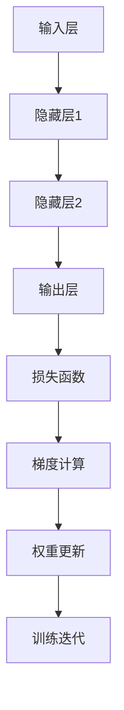

                 

# 误差逆传播 (Backpropagation)

## 关键词

- 误差逆传播算法
- 神经网络
- 反向传播
- 权重更新
- 数学模型
- 实战案例

## 摘要

本文将深入探讨误差逆传播（Backpropagation）算法的核心原理、数学模型及其在神经网络中的应用。通过逐步分析算法的各个步骤，我们将理解如何通过反向传播来更新神经网络的权重，从而优化网络性能。此外，文章将结合具体的项目实战案例，详细解读代码实现过程，帮助读者更好地掌握这一关键算法。

## 1. 背景介绍

误差逆传播（Backpropagation）算法是神经网络训练过程中至关重要的一环。它基于梯度下降法，通过反向传播误差信号来更新网络权重，使得网络能够不断优化并提高其预测准确性。Backpropagation算法的出现，使得深度学习成为可能，并推动了人工智能领域的快速发展。

在神经网络训练过程中，我们通常希望网络能够对输入数据进行准确分类或进行预测。然而，神经网络的权重是随机初始化的，可能无法直接满足这一要求。为了解决这一问题，Backpropagation算法应运而生，它通过不断调整网络权重，使网络逐渐逼近最优解。

## 2. 核心概念与联系

在介绍Backpropagation算法之前，我们需要了解一些核心概念和其之间的联系。

### 2.1 神经元与神经网络

神经元是神经网络的基本构建块，它接收输入信号，通过加权求和后，经过激活函数输出一个输出信号。一个神经网络由多个神经元组成，每个神经元都与相邻的神经元相连，形成一个复杂的网络结构。

### 2.2 激活函数

激活函数是神经元输出信号的关键组件，它用于引入非线性因素，使得神经网络能够处理复杂的问题。常见的激活函数包括Sigmoid、ReLU和Tanh等。

### 2.3 前向传播与反向传播

前向传播是指将输入数据通过神经网络进行层层传递，最终得到输出结果。反向传播是指将输出结果与实际标签之间的误差反向传递到输入层，通过误差信号来更新网络权重。

### 2.4 梯度下降法

梯度下降法是一种优化算法，用于最小化损失函数。在神经网络中，损失函数用于衡量预测结果与实际结果之间的差距。通过计算损失函数关于网络权重的梯度，可以确定权重的更新方向。

### 2.5 Mermaid 流程图

下面是一个简化的Mermaid流程图，展示了神经网络的前向传播与反向传播过程。

## 3. 核心算法原理 & 具体操作步骤

### 3.1 前向传播

在前向传播过程中，输入数据从输入层传递到输出层。每个神经元都会接收来自前一层神经元的输入信号，并计算加权求和的结果。经过激活函数处理后，输出一个输出信号。

具体操作步骤如下：

1. 初始化神经网络权重和偏置。
2. 输入数据进入输入层，传递到隐藏层。
3. 隐藏层将输入信号传递到下一层隐藏层，直至输出层。
4. 输出层的输出信号与实际标签进行比较，计算损失函数。

### 3.2 反向传播

在反向传播过程中，我们将输出结果与实际标签之间的误差反向传递到输入层，通过误差信号来更新网络权重。

具体操作步骤如下：

1. 计算输出层误差：$$ \delta_{output} = \frac{\partial L}{\partial z} $$
2. 计算隐藏层误差：$$ \delta_{hidden} = \delta_{output} \cdot \frac{\partial a}{\partial z} $$
3. 更新输出层权重：$$ \Delta w_{output} = \alpha \cdot \delta_{output} \cdot a_{hidden} $$
4. 更新隐藏层权重：$$ \Delta w_{hidden} = \alpha \cdot \delta_{hidden} \cdot a_{input} $$
5. 重复以上步骤，直至误差收敛。

其中，$$ L $$ 为损失函数，$$ \delta $$ 为误差项，$$ \alpha $$ 为学习率，$$ a $$ 为激活函数输出，$$ z $$ 为加权求和结果。

## 4. 数学模型和公式 & 详细讲解 & 举例说明

### 4.1 损失函数

在神经网络中，常用的损失函数包括均方误差（MSE）和交叉熵损失（Cross-Entropy Loss）。

1. 均方误差（MSE）：

$$
MSE = \frac{1}{n} \sum_{i=1}^{n} (y_i - \hat{y}_i)^2
$$

其中，$$ y_i $$ 为实际标签，$$ \hat{y}_i $$ 为预测结果。

2. 交叉熵损失（Cross-Entropy Loss）：

$$
Cross-Entropy Loss = - \frac{1}{n} \sum_{i=1}^{n} y_i \log(\hat{y}_i)
$$

其中，$$ y_i $$ 为实际标签，$$ \hat{y}_i $$ 为预测结果。

### 4.2 梯度计算

梯度计算是Backpropagation算法的核心步骤。通过计算损失函数关于网络权重的梯度，我们可以确定权重的更新方向。

1. 前向传播：

假设神经网络有$$ L $$ 层，$$ \Delta z^{(l)} $$ 表示第$$ l $$ 层的误差项，$$ \delta^{(l)} $$ 表示第$$ l $$ 层的误差项，$$ w^{(l)} $$ 表示第$$ l $$ 层的权重。

$$
\delta^{(L)} = \frac{\partial L}{\partial z^{(L)}}
$$

$$
\Delta z^{(L-1)} = \delta^{(L)} \cdot \frac{\partial a^{(L-1)}}{\partial z^{(L-1)}}
$$

$$
\delta^{(L-1)} = \delta^{(L)} \cdot w^{(L)}
$$

$$
\Delta z^{(L-2)} = \delta^{(L-1)} \cdot \frac{\partial a^{(L-2)}}{\partial z^{(L-2)}}
$$

$$
\delta^{(L-2)} = \delta^{(L-1)} \cdot w^{(L-1)}
$$

...

$$
\Delta z^{(1)} = \delta^{(2)} \cdot \frac{\partial a^{(1)}}{\partial z^{(1)}}
$$

$$
\delta^{(1)} = \delta^{(2)} \cdot w^{(1)}
$$

2. 反向传播：

通过计算误差项的传递，我们可以得到每个层

