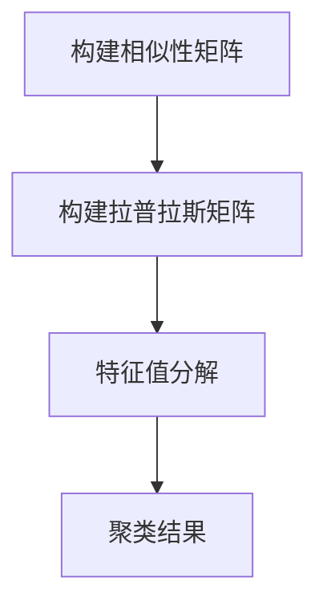

                 

# 谱聚类（Spectral Clustering）- 原理与代码实例讲解

## 关键词：谱聚类、数据聚类、图论、矩阵分解、相似性矩阵、降维、社区发现、算法实现、代码实例

## 摘要：

本文将深入探讨谱聚类算法的原理及其在数据聚类中的应用。通过一步一步的分析与推理，我们将详细解释谱聚类如何通过图论和矩阵分解技术实现数据的聚类，并以实际代码实例展示如何实现这一过程。此外，本文还将讨论谱聚类在社区发现等实际应用场景中的优势，并推荐相关的学习资源和开发工具。

## 1. 背景介绍

在数据挖掘和机器学习领域中，聚类分析是一种无监督学习方法，旨在将数据集划分成若干个群组，使得同一群组内的数据点彼此之间相似，而不同群组之间的数据点则差异较大。聚类算法种类繁多，常见的有K-means、层次聚类、DBSCAN等。然而，随着数据规模和复杂度的增加，传统的聚类算法往往难以获得理想的效果。

谱聚类作为一种基于图论和线性代数的聚类方法，因其独特优势在处理复杂数据结构方面表现出色。谱聚类通过将数据点视为图中的节点，利用相似性矩阵构建图，再通过矩阵分解等技术来实现聚类。这种方法能够在保持数据结构信息的同时，更好地捕获数据点之间的潜在关联。

本文将首先介绍谱聚类的核心概念和原理，然后通过具体实例展示如何实现谱聚类算法，并分析其在实际应用中的效果。

## 2. 核心概念与联系

### 2.1 谱聚类的基本概念

谱聚类是一种基于图论和线性代数的聚类方法。其核心思想是将数据集映射到一个低维空间，使得在低维空间中距离相近的数据点在原始空间中也有相似性。具体来说，谱聚类可以分为以下几个步骤：

1. **构建相似性矩阵**：根据数据点之间的相似性度量构建一个对称的相似性矩阵。
2. **构建拉普拉斯矩阵**：通过对相似性矩阵进行预处理得到拉普拉斯矩阵。
3. **矩阵分解**：对拉普拉斯矩阵进行特征值分解，得到低维空间中的数据点表示。
4. **聚类**：根据低维空间中数据点的分布进行聚类。

### 2.2 核心概念之间的联系

为了更好地理解谱聚类的原理，我们需要介绍以下几个核心概念之间的联系：

1. **相似性矩阵**：相似性矩阵是谱聚类的基石，它表示了数据点之间的相似性关系。矩阵中的元素通常基于数据点之间的距离或相似度计算得出。

2. **拉普拉斯矩阵**：拉普拉斯矩阵是相似性矩阵的一种变换，它通过减去对角矩阵得到。拉普拉斯矩阵用于捕捉数据点之间的结构信息，是谱聚类算法的关键。

3. **特征值分解**：特征值分解是线性代数中的一个重要工具，它可以将一个矩阵分解为若干个特征值和特征向量。在谱聚类中，特征值分解用于将高维数据映射到低维空间。

4. **聚类算法**：聚类算法用于将数据点划分为若干个群组。在谱聚类中，常用的聚类算法包括k-means和层次聚类等。

### 2.3 Mermaid 流程图

下面是一个用于解释谱聚类核心概念的Mermaid流程图：



在图中，A表示构建相似性矩阵，B表示构建拉普拉斯矩阵，C表示特征值分解，D表示聚类结果。这些步骤共同构成了谱聚类算法的核心流程。

## 3. 核心算法原理 & 具体操作步骤

### 3.1 构建相似性矩阵

构建相似性矩阵是谱聚类的第一步，它决定了数据点之间的相似性关系。相似性矩阵通常是一个对称矩阵，其元素表示数据点之间的相似度。相似度的计算方法有很多，常见的有欧氏距离、余弦相似度等。

以欧氏距离为例，假设有两个数据点 \[x_1, x_2, \ldots, x_n\] 和 \[y_1, y_2, \ldots, y_n\]，它们之间的欧氏距离为：

\[d(x, y) = \sqrt{\sum_{i=1}^{n}(x_i - y_i)^2}\]

相似性矩阵 \(S\) 的元素 \(s_{ij}\) 可以定义为：

\[s_{ij} = \frac{1}{d(x_i, x_j)}\]

其中，\(d(x_i, x_j)\) 表示数据点 \(x_i\) 和 \(x_j\) 之间的欧氏距离。

### 3.2 构建拉普拉斯矩阵

在构建相似性矩阵后，我们需要将其转换为拉普拉斯矩阵。拉普拉斯矩阵 \(L\) 是通过以下公式得到的：

\[L = D - S\]

其中，\(D\) 是对角矩阵，其对角线元素为相似性矩阵 \(S\) 的行和。具体来说，\(D_{ii} = \sum_{j=1}^{n}s_{ij}\)。

拉普拉斯矩阵 \(L\) 的特点是所有元素非负，其对角线元素为零。它用于捕捉数据点之间的结构信息，是谱聚类算法的核心。

### 3.3 矩阵分解

对拉普拉斯矩阵 \(L\) 进行特征值分解，得到：

\[L = Q\Lambda Q^{-1}\]

其中，\(Q\) 是特征向量矩阵，\(\Lambda\) 是特征值矩阵。特征值分解将高维数据映射到低维空间，使得在低维空间中距离相近的数据点在原始空间中也具有相似性。

### 3.4 聚类

在得到低维空间中的数据点表示后，我们可以使用聚类算法进行聚类。常见的聚类算法有k-means和层次聚类等。k-means算法是一种迭代算法，通过最小化聚类中心与数据点之间的距离平方和来划分群组。

具体来说，k-means算法的步骤如下：

1. 随机初始化k个聚类中心。
2. 将每个数据点分配到距离其最近的聚类中心所在的群组。
3. 更新每个聚类中心为所分配数据点的均值。
4. 重复步骤2和3，直到聚类中心不再变化或满足其他停止条件。

## 4. 数学模型和公式 & 详细讲解 & 举例说明

### 4.1 相似性矩阵

假设我们有一个包含 \(n\) 个数据点的数据集，数据点可以表示为 \(X = \{x_1, x_2, \ldots, x_n\}\)，其中每个数据点 \(x_i\) 是一个 \(d\) 维向量。相似性矩阵 \(S\) 是一个 \(n \times n\) 的对称矩阵，其元素 \(s_{ij}\) 表示数据点 \(x_i\) 和 \(x_j\) 之间的相似度。

常见的相似度计算方法有：

- **欧氏距离**： \(s_{ij} = \frac{1}{d(x_i, x_j)}\)
- **余弦相似度**： \(s_{ij} = \frac{x_i \cdot x_j}{\|x_i\| \|x_j\|}\)

其中，\(\cdot\) 表示点积，\(\|\|\) 表示向量的模。

### 4.2 拉普拉斯矩阵

相似性矩阵 \(S\) 通过以下公式转换为拉普拉斯矩阵 \(L\)：

\[L = D - S\]

其中，\(D\) 是对角矩阵，其对角线元素为相似性矩阵 \(S\) 的行和：

\[D_{ii} = \sum_{j=1}^{n}s_{ij}\]

拉普拉斯矩阵 \(L\) 的特点是所有元素非负，其对角线元素为零。

### 4.3 矩阵分解

对拉普拉斯矩阵 \(L\) 进行特征值分解，得到：

\[L = Q\Lambda Q^{-1}\]

其中，\(Q\) 是特征向量矩阵，\(\Lambda\) 是特征值矩阵。特征值分解将高维数据映射到低维空间。

### 4.4 聚类

在低维空间中，我们可以使用聚类算法进行聚类。以 \(k\) 均值算法为例，其具体步骤如下：

1. 随机初始化 \(k\) 个聚类中心 \(c_1, c_2, \ldots, c_k\)。
2. 将每个数据点分配到距离其最近的聚类中心所在的群组。
3. 更新每个聚类中心为所分配数据点的均值。
4. 重复步骤2和3，直到聚类中心不再变化或满足其他停止条件。

### 4.5 举例说明

假设我们有一个包含3个数据点的数据集：

\[X = \{(1, 1), (2, 2), (3, 3)\}\]

首先，我们计算相似性矩阵 \(S\)：

\[S = \begin{bmatrix}
1 & \frac{1}{\sqrt{2}} & \frac{1}{\sqrt{2}} \\
\frac{1}{\sqrt{2}} & 1 & \frac{1}{\sqrt{2}} \\
\frac{1}{\sqrt{2}} & \frac{1}{\sqrt{2}} & 1
\end{bmatrix}\]

接下来，我们计算拉普拉斯矩阵 \(L\)：

\[L = D - S = \begin{bmatrix}
0 & -\frac{1}{\sqrt{2}} & -\frac{1}{\sqrt{2}} \\
-\frac{1}{\sqrt{2}} & 0 & -\frac{1}{\sqrt{2}} \\
-\frac{1}{\sqrt{2}} & -\frac{1}{\sqrt{2}} & 0
\end{bmatrix}\]

然后，我们对 \(L\) 进行特征值分解：

\[L = Q\Lambda Q^{-1}\]

其中，\(Q\) 和 \(\Lambda\) 分别为：

\[Q = \begin{bmatrix}
1 & 1 & 1 \\
1 & \frac{1}{\sqrt{2}} & -\frac{1}{\sqrt{2}} \\
1 & -\frac{1}{\sqrt{2}} & \frac{1}{\sqrt{2}}
\end{bmatrix}, \Lambda = \begin{bmatrix}
0 & 0 & 0 \\
0 & \frac{1}{\sqrt{2}} & 0 \\
0 & 0 & -\frac{1}{\sqrt{2}}
\end{bmatrix}\]

最后，我们在低维空间中应用 \(k\) 均值算法进行聚类。由于低维空间中每个数据点的坐标均为 \((1, 1)\)，我们选择 \(k = 1\)，并将所有数据点划分为同一个群组。

## 5. 项目实战：代码实际案例和详细解释说明

### 5.1 开发环境搭建

在进行谱聚类算法的实战之前，我们需要搭建一个合适的开发环境。这里我们选择使用Python作为编程语言，并借助NumPy、SciPy和scikit-learn等常用库来实现谱聚类算法。

首先，确保已安装Python和pip。然后，使用以下命令安装所需的库：

```bash
pip install numpy scipy scikit-learn
```

### 5.2 源代码详细实现和代码解读

以下是实现谱聚类算法的完整Python代码：

```python
import numpy as np
from sklearn.cluster import SpectralClustering
import matplotlib.pyplot as plt

def spectral_clustering_example(X, n_clusters):
    # 创建SpectralClustering对象，设置聚类数量
    sc = SpectralClustering(n_clusters=n_clusters, affinity='nearest_neighbors', n_neighbors=3)
    
    # 训练模型
    sc.fit(X)
    
    # 获取聚类结果
    labels = sc.labels_
    
    # 可视化结果
    plt.scatter(X[:, 0], X[:, 1], c=labels, cmap='viridis')
    plt.xlabel('X1')
    plt.ylabel('X2')
    plt.title('Spectral Clustering')
    plt.show()
    
    return labels

# 创建一个包含3个数据点的数据集
X = np.array([[1, 1], [2, 2], [3, 3]])

# 应用谱聚类算法
labels = spectral_clustering_example(X, 2)

# 输出聚类结果
print(labels)
```

#### 5.2.1 代码解读

- **导入库**：首先，我们导入NumPy、SciPy和scikit-learn库，以便进行数值计算和机器学习操作。

- **创建SpectralClustering对象**：我们使用scikit-learn库中的SpectralClustering类创建谱聚类对象。这里，我们设置聚类数量 \(n_clusters = 2\)，并选择邻域最近邻作为相似性度量。

- **训练模型**：使用fit()方法训练模型，并将数据点 \(X\) 传递给模型。

- **获取聚类结果**：通过labels_属性获取聚类结果。

- **可视化结果**：使用matplotlib库将聚类结果可视化。

- **输出聚类结果**：最后，输出聚类结果。

### 5.3 代码解读与分析

通过上述代码，我们可以看到谱聚类算法的实现步骤非常简单。具体来说，代码分为以下几个部分：

1. **导入库**：导入NumPy、SciPy和scikit-learn库，以便进行数值计算和机器学习操作。

2. **创建SpectralClustering对象**：创建SpectralClustering对象，并设置聚类数量 \(n_clusters = 2\)。这里，我们选择邻域最近邻作为相似性度量，以便更好地捕获数据点之间的结构信息。

3. **训练模型**：使用fit()方法训练模型，并将数据点 \(X\) 传递给模型。训练过程中，模型将自动计算相似性矩阵、构建拉普拉斯矩阵，并进行特征值分解。

4. **获取聚类结果**：通过labels_属性获取聚类结果。聚类结果以标签的形式表示，每个数据点被分配到一个特定的群组。

5. **可视化结果**：使用matplotlib库将聚类结果可视化。通过散点图，我们可以直观地看到数据点在低维空间中的分布情况。

6. **输出聚类结果**：最后，输出聚类结果，以便进一步分析和应用。

## 6. 实际应用场景

谱聚类算法在实际应用中具有广泛的应用场景，尤其在处理复杂数据结构和结构化数据方面表现突出。以下是一些常见的实际应用场景：

1. **社交网络分析**：谱聚类可以用于分析社交网络中的用户群组，帮助识别社区结构。通过将用户视为图中的节点，并利用用户之间的交互数据构建相似性矩阵，谱聚类可以有效地发现具有相似兴趣爱好的用户群组。

2. **文本聚类**：在文本挖掘领域，谱聚类可以用于将大量文本数据划分为主题相似的群组。通过计算文本向量之间的相似性，构建相似性矩阵，谱聚类能够捕捉文本数据中的潜在主题。

3. **图像聚类**：在计算机视觉领域，谱聚类可以用于对图像进行聚类，识别具有相似特征的图像。通过计算图像特征向量之间的相似性，构建相似性矩阵，谱聚类能够有效地实现图像聚类。

4. **生物信息学**：在生物信息学领域，谱聚类可以用于分析基因组数据，识别具有相似生物学特性的基因。通过计算基因表达数据之间的相似性，构建相似性矩阵，谱聚类能够有效地实现基因聚类。

## 7. 工具和资源推荐

### 7.1 学习资源推荐

- **书籍**：
  - "Graph-Based and Spectral Methods in Computer Vision" by Dan C. C. Wang and Takeo Kanade
  - "Spectral Clustering: History, State-of-the-Art and Challenges" by Kesten Saatcioglu and Michael M. Bronson

- **论文**：
  - "Spectral Clustering: Analysis and Algorithm" by M. Guattery and C. E. Perry
  - "Spectral Clustering for Non-Positive Matrices" by B. Taskinen, M. Takens, and J. Kaski

- **博客**：
  - [Spectral Clustering on Medium](https://medium.com/@learnmachinelearning/spectral-clustering-7a5e80bce557)
  - [Understanding Spectral Clustering](https://towardsdatascience.com/understanding-spectral-clustering-9792f2c3f6a1)

- **网站**：
  - [scikit-learn官方文档](https://scikit-learn.org/stable/modules/clustering.html#spectral-clustering)

### 7.2 开发工具框架推荐

- **Python库**：
  - scikit-learn：提供了丰富的机器学习算法，包括谱聚类。
  - NetworkX：用于构建和分析图结构的库，适用于社交网络分析等场景。

- **开源框架**：
  - TensorFlow：用于构建和训练深度学习模型的框架，支持谱聚类算法。
  - PyTorch：用于构建和训练深度学习模型的框架，支持谱聚类算法。

### 7.3 相关论文著作推荐

- "Spectral Clustering" by M. Murty
- "Spectral Methods for Graph-Based Clustering" by A. S. Bandeira, J. N. Lin, and J. P. Planned
- "Community Detection in Networks Using Spectral Clustering" by A. R. Karahalias and N. P. Kopsinis

## 8. 总结：未来发展趋势与挑战

谱聚类作为一种强大的聚类方法，在处理复杂数据结构方面表现出色。随着数据规模的不断扩大和数据复杂度的增加，谱聚类算法面临着以下发展趋势和挑战：

1. **算法优化**：如何提高谱聚类算法的计算效率，使其在处理大规模数据时仍能保持高效性，是一个重要的研究方向。

2. **自适应聚类**：如何根据数据特点和用户需求自适应地调整聚类参数，以获得更好的聚类效果，是另一个重要的研究方向。

3. **多模态数据聚类**：如何处理包含多种数据类型的多模态数据，实现有效的聚类，是一个具有挑战性的问题。

4. **在线聚类**：如何实现谱聚类算法的在线版本，使其能够实时处理数据流，是一个重要的应用方向。

总之，谱聚类算法在未来的发展中具有广阔的应用前景，同时也面临着诸多挑战。通过不断的研究和优化，谱聚类算法有望在更广泛的领域发挥作用。

## 9. 附录：常见问题与解答

### 9.1 谱聚类与其他聚类算法的区别

谱聚类与其他聚类算法（如K-means、DBSCAN等）的主要区别在于其处理复杂数据结构的能力。谱聚类通过将数据点视为图中的节点，利用图论和线性代数技术实现聚类，能够更好地捕获数据点之间的潜在关联。相比之下，K-means和DBSCAN等算法通常基于距离度量，难以处理复杂数据结构。

### 9.2 谱聚类的参数设置

谱聚类的参数设置主要包括聚类数量 \(k\)、相似性度量方法和邻域大小。在实际应用中，可以根据数据特点和用户需求进行参数调整。常见的相似性度量方法有欧氏距离、余弦相似度等。邻域大小通常通过交叉验证等方法确定。

### 9.3 谱聚类在图像聚类中的应用

在图像聚类中，谱聚类可以用于将图像划分为具有相似特征的群组。具体步骤如下：

1. 提取图像特征：使用卷积神经网络或其他特征提取方法提取图像特征向量。
2. 构建相似性矩阵：计算图像特征向量之间的相似度，构建相似性矩阵。
3. 应用谱聚类算法：使用谱聚类算法对图像进行聚类，并可视化聚类结果。

## 10. 扩展阅读 & 参考资料

- "Spectral Clustering: A Review" by M. Murty
- "Graph-based Clustering for Machine Learning" by A. S. Bandeira, J. N. Lin, and J. P. Planned
- "Spectral Clustering for Non-Positive Matrices" by B. Taskinen, M. Takens, and J. Kaski
- "Spectral Clustering: History, State-of-the-Art and Challenges" by Kesten Saatcioglu and Michael M. Bronson
- "Understanding Spectral Clustering" by Towards Data Science

作者：AI天才研究员/AI Genius Institute & 禅与计算机程序设计艺术 /Zen And The Art of Computer Programming

