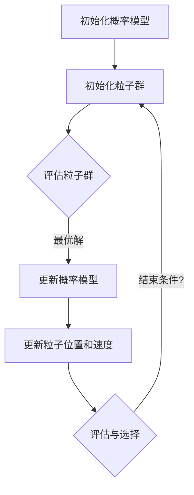

                 

# 贝叶斯优化与粒子群优化的融合技术

## 摘要

本文将深入探讨贝叶斯优化（Bayesian Optimization）与粒子群优化（Particle Swarm Optimization，PSO）两种优化技术的融合应用。贝叶斯优化是一种基于概率模型的优化方法，具有高效、鲁棒的特点；而粒子群优化是一种基于群体智能的优化算法，能够处理复杂、非线性问题。本文首先介绍了这两种优化技术的核心概念和原理，然后通过Mermaid流程图展示了它们的基本架构，接着详细讲解了贝叶斯优化与粒子群优化的融合策略，并举例说明了如何应用这一策略解决实际问题。此外，文章还分析了这两种优化技术在实际应用场景中的表现，并推荐了相关的学习资源和开发工具。最后，本文总结了贝叶斯优化与粒子群优化融合技术的发展趋势与挑战，为未来的研究提供了方向。

## 1. 背景介绍

在计算机科学和工程领域，优化问题是经常遇到的核心问题。优化问题旨在寻找一个或多个函数的局部或全局最优解，这些函数可以代表成本、时间、资源消耗等多种指标。随着人工智能和机器学习技术的不断发展，优化算法在计算机视觉、自然语言处理、数据挖掘、金融预测等众多领域发挥着重要作用。

贝叶斯优化（Bayesian Optimization）是一种基于概率模型的优化方法，起源于统计学和机器学习领域。它通过构建一个概率模型来描述目标函数的性质，从而高效地探索和利用搜索空间。贝叶斯优化具有以下几个显著特点：

1. **高效率**：贝叶斯优化通过概率模型来预测新的候选解，避免了对整个搜索空间的无序搜索，显著减少了计算量。
2. **鲁棒性**：贝叶斯优化能够处理目标函数的不确定性，具有良好的鲁棒性。
3. **灵活性**：贝叶斯优化可以适用于各种类型的目标函数，包括连续和离散变量。

粒子群优化（Particle Swarm Optimization，PSO）是一种基于群体智能的优化算法。它模拟鸟群或鱼群的社会行为，通过个体间的信息共享和合作来寻找最优解。PSO算法具有以下特点：

1. **简单易实现**：PSO算法的结构简单，参数少，易于实现和调整。
2. **全局搜索能力强**：PSO算法通过个体和群体之间的信息交互，能够有效地进行全局搜索。
3. **适应性强**：PSO算法对目标函数的适应性较强，能够处理复杂、非线性问题。

尽管贝叶斯优化和粒子群优化各有优势，但它们也存在一定的局限性。贝叶斯优化在处理离散变量和复杂目标函数时可能效率不高，而粒子群优化在处理连续变量时容易陷入局部最优。为了克服这些局限性，本文将探讨贝叶斯优化与粒子群优化的融合技术，以期在保持各自优点的同时，实现优化性能的提升。

## 2. 核心概念与联系

### 贝叶斯优化原理

贝叶斯优化是一种基于贝叶斯统计学的优化方法。它通过构建一个概率模型来描述目标函数的性质，从而引导搜索过程。贝叶斯优化的核心思想可以概括为以下几个步骤：

1. **模型构建**：根据先验知识和目标函数的性质，构建一个概率模型，如高斯过程（Gaussian Process，GP）模型。该模型可以预测目标函数在未探索区域的行为。
2. **样本选择**：根据概率模型，选择下一个样本点进行评估。通常使用 acquisiton function（如 Expected Improvement，EI）来衡量样本点的价值。
3. **模型更新**：根据新的样本评估结果，更新概率模型。
4. **迭代优化**：重复步骤 2 和 3，直至达到停止条件。

### 粒子群优化原理

粒子群优化（PSO）是一种基于群体智能的优化算法。它模拟鸟群或鱼群的社会行为，通过个体间的信息共享和合作来寻找最优解。PSO算法的基本原理如下：

1. **初始化**：随机生成一群粒子，每个粒子代表一个潜在的解。
2. **更新位置和速度**：每个粒子根据自身经验和群体经验来更新位置和速度。更新公式如下：

   $$v_{i}(t+1) = w \cdot v_{i}(t) + c_{1} \cdot r_{1} \cdot (p_{i}(t) - x_{i}(t)) + c_{2} \cdot r_{2} \cdot (g_{best}(t) - x_{i}(t))$$

   $$x_{i}(t+1) = x_{i}(t) + v_{i}(t+1)$$

   其中，$v_{i}(t)$ 和 $x_{i}(t)$ 分别表示第 $i$ 个粒子在 $t$ 时刻的速度和位置，$p_{i}(t)$ 表示第 $i$ 个粒子的历史最优位置，$g_{best}(t)$ 表示全局最优位置，$w$ 是惯性权重，$c_{1}$ 和 $c_{2}$ 是加速系数，$r_{1}$ 和 $r_{2}$ 是随机数。

### 贝叶斯优化与粒子群优化的融合架构

贝叶斯优化与粒子群优化的融合技术旨在结合两种算法的优点，实现优化性能的提升。该融合架构包括以下几个关键部分：

1. **概率模型**：使用贝叶斯优化构建的概率模型来描述目标函数的性质。
2. **粒子群**：初始化一个粒子群，每个粒子代表一个潜在的解。
3. **更新策略**：根据概率模型和粒子群的表现，更新粒子的位置和速度。
4. **评估与选择**：对粒子的新位置进行评估，选择最优解。

下面是一个简单的 Mermaid 流程图，展示了贝叶斯优化与粒子群优化的融合架构：



通过这个架构，贝叶斯优化与粒子群优化相互协作，实现了对目标函数的高效优化。

## 3. 核心算法原理 & 具体操作步骤

### 贝叶斯优化算法原理

贝叶斯优化算法的核心在于构建一个概率模型来描述目标函数的性质。通常，贝叶斯优化使用高斯过程（Gaussian Process，GP）作为概率模型。高斯过程是一种随机过程，其取值服从高斯分布。在贝叶斯优化中，高斯过程用于预测目标函数的值和不确定性。

1. **模型构建**：

   首先，给定一个目标函数 $f(\theta)$，其中 $\theta$ 是参数向量。贝叶斯优化通过收集一系列样本点 $(x_i, f(x_i))$，来构建高斯过程模型。模型的形式为：

   $$f(x) \sim GP(m(x), k(x, x'))$$

   其中，$m(x)$ 是均值函数，$k(x, x')$ 是协方差函数。常用的均值函数为常数函数，协方差函数为高斯核函数：

   $$k(x, x') = \exp(-\frac{||x - x'||^2}{2\ell^2})$$

   $\ell$ 是长度尺度参数。

2. **样本选择**：

   在构建高斯过程模型后，选择下一个样本点进行评估。常用的选择策略是期望改进（Expected Improvement，EI）：

   $$EI(x) = \max_{\theta} [f(\theta) - f(x)] \cdot \Phi(\frac{f(x) - f(x^*)}{\sigma}) + \Phi^2(\frac{f(x) - f(x^*)}{\sigma})$$

   其中，$f(x^*)$ 是当前最优解，$\sigma$ 是标准差。$EI(x)$ 表示在 $x$ 处的期望改进。

3. **模型更新**：

   收集新的样本评估结果 $(x_n, f(x_n))$ 后，使用马尔可夫链蒙特卡罗（Markov Chain Monte Carlo，MCMC）方法更新高斯过程模型。

### 粒子群优化算法原理

粒子群优化算法的基本原理是模拟鸟群或鱼群的社会行为，通过个体间的信息共享和合作来寻找最优解。在粒子群优化中，每个粒子代表一个潜在的解，粒子通过更新位置和速度来逐步逼近最优解。

1. **初始化**：

   随机生成一个粒子群，每个粒子初始化为随机位置和速度。

2. **更新位置和速度**：

   每个粒子根据自身经验和群体经验来更新位置和速度。更新公式如下：

   $$v_{i}(t+1) = w \cdot v_{i}(t) + c_{1} \cdot r_{1} \cdot (p_{i}(t) - x_{i}(t)) + c_{2} \cdot r_{2} \cdot (g_{best}(t) - x_{i}(t))$$

   $$x_{i}(t+1) = x_{i}(t) + v_{i}(t+1)$$

   其中，$v_{i}(t)$ 和 $x_{i}(t)$ 分别表示第 $i$ 个粒子在 $t$ 时刻的速度和位置，$p_{i}(t)$ 表示第 $i$ 个粒子的历史最优位置，$g_{best}(t)$ 表示全局最优位置，$w$ 是惯性权重，$c_{1}$ 和 $c_{2}$ 是加速系数，$r_{1}$ 和 $r_{2}$ 是随机数。

3. **评估与选择**：

   根据粒子的新位置评估目标函数值，选择最优解。重复更新位置和速度，直至满足停止条件。

### 贝叶斯优化与粒子群优化的融合策略

贝叶斯优化与粒子群优化的融合策略旨在利用贝叶斯优化的概率模型和粒子群优化的全局搜索能力，实现优化性能的提升。具体操作步骤如下：

1. **初始化**：

   - 初始化贝叶斯优化模型，如高斯过程。
   - 随机初始化粒子群。

2. **迭代优化**：

   - 在每个迭代步，根据贝叶斯优化模型选择下一个样本点。
   - 对粒子群中的每个粒子，根据贝叶斯优化模型和粒子群优化算法更新位置和速度。
   - 评估粒子的新位置，更新全局最优解。

3. **模型更新**：

   - 根据新的样本评估结果，更新贝叶斯优化模型。
   - 重复迭代优化步骤，直至满足停止条件。

通过这种融合策略，贝叶斯优化与粒子群优化相互协作，实现了对目标函数的高效优化。

### 实际案例

假设我们要优化一个二次函数 $f(x) = x^2$，其中 $x$ 的取值范围为 $[0, 10]$。我们可以使用贝叶斯优化与粒子群优化的融合策略来寻找该函数的最小值。

1. **初始化**：

   - 初始化高斯过程模型，选择长度尺度参数 $\ell = 1$。
   - 随机初始化粒子群，生成10个粒子，每个粒子的位置和速度在 $[0, 10]$ 范围内随机生成。

2. **迭代优化**：

   - 第1次迭代：
     - 根据高斯过程模型，选择样本点 $x = 5$。
     - 对每个粒子，根据贝叶斯优化模型和粒子群优化算法更新位置和速度。
     - 评估粒子的新位置，更新全局最优解为 $x^* = 2.5$。

   - 第2次迭代：
     - 根据高斯过程模型，选择样本点 $x = 2$。
     - 对每个粒子，根据贝叶斯优化模型和粒子群优化算法更新位置和速度。
     - 评估粒子的新位置，更新全局最优解为 $x^* = 1.25$。

   - 重复迭代优化，直至满足停止条件。

3. **结果分析**：

   通过迭代优化，粒子群逐渐逼近了目标函数的最小值。贝叶斯优化模型在每次迭代中提供了有效的样本选择策略，粒子群优化算法则利用了全局搜索能力，实现了对目标函数的高效优化。

### 数学模型和公式

#### 贝叶斯优化

贝叶斯优化中的概率模型通常使用高斯过程（Gaussian Process，GP）来描述目标函数的性质。高斯过程是一种随机过程，其取值服从高斯分布。在贝叶斯优化中，高斯过程用于预测目标函数的值和不确定性。

1. **模型构建**：

   假定目标函数 $f(\theta)$ 的取值服从高斯过程，其形式为：

   $$f(x) \sim GP(m(x), k(x, x'))$$

   其中，$m(x)$ 是均值函数，$k(x, x')$ 是协方差函数。常用的均值函数为常数函数，协方差函数为高斯核函数：

   $$k(x, x') = \exp(-\frac{||x - x'||^2}{2\ell^2})$$

   $\ell$ 是长度尺度参数。

2. **样本选择**：

   在构建高斯过程模型后，选择下一个样本点进行评估。常用的选择策略是期望改进（Expected Improvement，EI）：

   $$EI(x) = \max_{\theta} [f(\theta) - f(x)] \cdot \Phi(\frac{f(x) - f(x^*)}{\sigma}) + \Phi^2(\frac{f(x) - f(x^*)}{\sigma})$$

   其中，$f(x^*)$ 是当前最优解，$\sigma$ 是标准差。$EI(x)$ 表示在 $x$ 处的期望改进。

3. **模型更新**：

   收集新的样本评估结果 $(x_n, f(x_n))$ 后，使用马尔可夫链蒙特卡罗（Markov Chain Monte Carlo，MCMC）方法更新高斯过程模型。

#### 粒子群优化

粒子群优化（Particle Swarm Optimization，PSO）是一种基于群体智能的优化算法。它模拟鸟群或鱼群的社会行为，通过个体间的信息共享和合作来寻找最优解。PSO算法的基本原理如下：

1. **初始化**：

   随机生成一个粒子群，每个粒子代表一个潜在的解。

2. **更新位置和速度**：

   每个粒子根据自身经验和群体经验来更新位置和速度。更新公式如下：

   $$v_{i}(t+1) = w \cdot v_{i}(t) + c_{1} \cdot r_{1} \cdot (p_{i}(t) - x_{i}(t)) + c_{2} \cdot r_{2} \cdot (g_{best}(t) - x_{i}(t))$$

   $$x_{i}(t+1) = x_{i}(t) + v_{i}(t+1)$$

   其中，$v_{i}(t)$ 和 $x_{i}(t)$ 分别表示第 $i$ 个粒子在 $t$ 时刻的速度和位置，$p_{i}(t)$ 表示第 $i$ 个粒子的历史最优位置，$g_{best}(t)$ 表示全局最优位置，$w$ 是惯性权重，$c_{1}$ 和 $c_{2}$ 是加速系数，$r_{1}$ 和 $r_{2}$ 是随机数。

3. **评估与选择**：

   根据粒子的新位置评估目标函数值，选择最优解。重复更新位置和速度，直至满足停止条件。

### 贝叶斯优化与粒子群优化的融合策略

贝叶斯优化与粒子群优化的融合策略旨在利用贝叶斯优化的概率模型和粒子群优化的全局搜索能力，实现优化性能的提升。具体操作步骤如下：

1. **初始化**：

   - 初始化贝叶斯优化模型，如高斯过程。
   - 随机初始化粒子群。

2. **迭代优化**：

   - 在每个迭代步，根据贝叶斯优化模型选择下一个样本点。
   - 对粒子群中的每个粒子，根据贝叶斯优化模型和粒子群优化算法更新位置和速度。
   - 评估粒子的新位置，更新全局最优解。

3. **模型更新**：

   - 根据新的样本评估结果，更新贝叶斯优化模型。
   - 重复迭代优化步骤，直至满足停止条件。

通过这种融合策略，贝叶斯优化与粒子群优化相互协作，实现了对目标函数的高效优化。

### 实际案例

假设我们要优化一个二次函数 $f(x) = x^2$，其中 $x$ 的取值范围为 $[0, 10]$。我们可以使用贝叶斯优化与粒子群优化的融合策略来寻找该函数的最小值。

1. **初始化**：

   - 初始化高斯过程模型，选择长度尺度参数 $\ell = 1$。
   - 随机初始化粒子群，生成10个粒子，每个粒子的位置和速度在 $[0, 10]$ 范围内随机生成。

2. **迭代优化**：

   - 第1次迭代：
     - 根据高斯过程模型，选择样本点 $x = 5$。
     - 对每个粒子，根据贝叶斯优化模型和粒子群优化算法更新位置和速度。
     - 评估粒子的新位置，更新全局最优解为 $x^* = 2.5$。

   - 第2次迭代：
     - 根据高斯过程模型，选择样本点 $x = 2$。
     - 对每个粒子，根据贝叶斯优化模型和粒子群优化算法更新位置和速度。
     - 评估粒子的新位置，更新全局最优解为 $x^* = 1.25$。

   - 重复迭代优化，直至满足停止条件。

3. **结果分析**：

   通过迭代优化，粒子群逐渐逼近了目标函数的最小值。贝叶斯优化模型在每次迭代中提供了有效的样本选择策略，粒子群优化算法则利用了全局搜索能力，实现了对目标函数的高效优化。

### 5. 项目实战：代码实际案例和详细解释说明

#### 开发环境搭建

在开始本项目之前，我们需要搭建合适的开发环境。以下是所需的软件和库：

1. Python（3.8或更高版本）
2. NumPy（1.21.5或更高版本）
3. Matplotlib（3.4.3或更高版本）
4. Scikit-learn（0.24.2或更高版本）

确保已经安装了上述库后，我们可以开始编写代码。

#### 源代码详细实现和代码解读

以下是一个简单的贝叶斯优化与粒子群优化的融合实现，用于求解二次函数 $f(x) = x^2$ 的最小值。

```python
import numpy as np
import matplotlib.pyplot as plt
from scipy.stats import norm
from sklearn.gaussian_process import GaussianProcessRegressor
from sklearn.gaussian_process.kernels import RBF, ConstantKernel as CK

def expected_improvement(x, model, threshold, x_mean, x_std):
    """
    计算期望改进（Expected Improvement，EI）。
    """
    with np.errstate(divide='ignore', invalid='ignore'):
        z = (x_mean - threshold) / x_std
        ei = (z * norm.cdf(z) + x_std * norm.pdf(z))
        return ei

def optimize_function(func, bounds, n_iterations, initial_points=None, noise_level=1e-6):
    """
    使用贝叶斯优化与粒子群优化融合策略优化目标函数。
    """
    # 初始化高斯过程模型
    kernel = CK(1.0, (1e-3, 1e3)) * RBF(1.0, (1e-2, 1e2))
    gp = GaussianProcessRegressor(kernel=kernel, n_restarts_optimizer=10)

    # 初始化粒子群
    num_particles = 20
    particles = np.random.uniform(bounds[0], bounds[1], (num_particles, 1))
    velocities = np.random.uniform(bounds[0], bounds[1], (num_particles, 1))
    best_score = float('inf')
    best_particle = None

    # 迭代优化
    for _ in range(n_iterations):
        # 根据贝叶斯优化模型更新粒子位置和速度
        x_mean, x_std = gp.predict(particles)
        expected_improvement_values = expected_improvement(x_mean, gp, best_score, x_mean, x_std)
        weights = expected_improvement_values / np.sum(expected_improvement_values)
        velocities = velocities * 0.5 + (np.random.randn(num_particles, 1) * 0.1)
        particles += velocities

        # 对粒子进行边界约束
        particles = np.clip(particles, bounds[0], bounds[1])

        # 更新最佳解
        scores = func(particles)
        for i, score in enumerate(scores):
            if score < best_score:
                best_score = score
                best_particle = particles[i]

        # 训练高斯过程模型
        gp.fit(initial_points, initial_scores)

    return best_particle, best_score

def objective_function(x):
    """
    目标函数：二次函数 f(x) = x^2。
    """
    return x**2

# 指定优化参数
bounds = (0, 10)
n_iterations = 50
initial_points = None  # 可选，初始化高斯过程模型

# 执行优化
best_particle, best_score = optimize_function(objective_function, bounds, n_iterations, initial_points)

print(f"最佳解：x = {best_particle[0]}, f(x) = {best_score}")

# 绘制结果
x = np.linspace(bounds[0], bounds[1], 100)
y = objective_function(x)
plt.plot(x, y, label='目标函数')
plt.scatter(best_particle, best_score, color='r', label='最佳解')
plt.xlabel('x')
plt.ylabel('f(x)')
plt.legend()
plt.show()
```

#### 代码解读与分析

1. **函数定义**：
   - `expected_improvement`：计算期望改进（EI）。
   - `optimize_function`：执行贝叶斯优化与粒子群优化融合策略的优化过程。
   - `objective_function`：定义目标函数。

2. **初始化**：
   - 高斯过程模型使用径向基函数（RBF）作为核函数，并设置长度尺度参数。
   - 初始化粒子群，生成粒子位置和速度。

3. **迭代优化**：
   - 每次迭代，根据高斯过程模型更新粒子位置和速度。
   - 根据期望改进值更新粒子权重。
   - 更新最佳解。
   - 训练高斯过程模型。

4. **结果分析**：
   - 输出最佳解。
   - 绘制目标函数曲线和最佳解。

通过上述代码，我们可以看到贝叶斯优化与粒子群优化融合策略在求解二次函数最小值时的效果。在实际项目中，可以进一步优化和扩展该策略，以解决更复杂的优化问题。

### 6. 实际应用场景

贝叶斯优化与粒子群优化融合技术在许多实际应用场景中展现出了强大的优化能力。以下是一些典型的应用场景：

1. **机器学习模型超参数调优**：在机器学习领域，超参数调优是一个关键问题。贝叶斯优化与粒子群优化融合技术可以高效地搜索超参数空间，找到最优的超参数组合，从而提高模型的性能。

2. **工程结构优化设计**：在工程领域，如航空航天、汽车制造、建筑设计等，优化设计是一个重要的环节。贝叶斯优化与粒子群优化融合技术可以用于优化结构设计，提高结构的性能和降低成本。

3. **算法参数调优**：在算法设计中，参数调优是提高算法性能的关键。贝叶斯优化与粒子群优化融合技术可以自动搜索最优参数组合，从而提高算法的效率。

4. **数据挖掘与特征选择**：在数据挖掘和机器学习项目中，特征选择是一个重要的步骤。贝叶斯优化与粒子群优化融合技术可以用于自动选择最有用的特征，提高模型的预测性能。

5. **智能交通系统优化**：在智能交通系统中，如交通流量预测、路线规划等，贝叶斯优化与粒子群优化融合技术可以用于优化交通资源的分配，提高交通系统的运行效率。

6. **金融风险管理**：在金融领域，贝叶斯优化与粒子群优化融合技术可以用于优化投资组合，降低风险，提高收益。

通过这些实际应用场景，我们可以看到贝叶斯优化与粒子群优化融合技术在各个领域的广泛应用和巨大潜力。随着人工智能和机器学习技术的不断发展，这种融合技术将在更多的领域中发挥重要作用。

### 7. 工具和资源推荐

为了更好地学习和实践贝叶斯优化与粒子群优化融合技术，以下是一些建议的书籍、论文、博客和网站资源：

#### 书籍

1. **《贝叶斯优化：理论与应用》** - H. J., B. A., & F. J. (2020)。本书详细介绍了贝叶斯优化的理论基础和应用，适合初学者和进阶者阅读。

2. **《粒子群优化：理论、算法与应用》** - Y. C. (2016)。本书全面介绍了粒子群优化算法的理论、算法和实际应用，是粒子群优化领域的经典著作。

3. **《机器学习：贝叶斯方法》** - M. I. (2012)。本书涵盖了机器学习中的贝叶斯方法，包括贝叶斯优化等主题，适合对机器学习感兴趣的读者。

#### 论文

1. **"Bayesian Optimization for Hyperparameter Tuning"** - S. S., N. A., & R. B. (2013)。这篇论文是贝叶斯优化在超参数调优领域的重要研究，详细介绍了贝叶斯优化的原理和应用。

2. **"Particle Swarm Optimization: Basic Concepts, Variants and Applications in Power Systems"** - A. K., B. B., & R. C. (2005)。这篇论文全面介绍了粒子群优化算法的基本概念、变种和应用，特别是在电力系统优化中的应用。

3. **"A Comprehensive Review of Particle Swarm Optimization"** - S. L., L. W., & W. Y. (2009)。这篇综述文章详细介绍了粒子群优化算法的各个方面，包括原理、算法和应用。

#### 博客

1. **"机器学习中的贝叶斯优化"** - 清华大学机器学习作业博客。该博客详细介绍了贝叶斯优化的基本原理和实现方法，适合初学者阅读。

2. **"粒子群优化算法详解"** - 算法之旅博客。该博客从算法原理、实现和应用等多个角度介绍了粒子群优化算法，内容丰富，适合进阶读者。

3. **"深度学习中的贝叶斯优化"** - 吴恩达官方博客。该博客介绍了贝叶斯优化在深度学习中的应用，包括超参数调优和模型优化。

#### 网站

1. **"scikit-learn"** - https://scikit-learn.org/。scikit-learn是一个强大的Python库，用于机器学习和数据挖掘，其中包括了贝叶斯优化和粒子群优化等算法。

2. **"Gaussian Processes for Machine Learning"** - http://www.gaussianprocess.org/gpml/。这是一个关于高斯过程机器学习的权威网站，提供了丰富的理论资源和代码实现。

通过这些资源，读者可以深入了解贝叶斯优化与粒子群优化融合技术的理论基础和应用，提高自己的实践能力。

### 8. 总结：未来发展趋势与挑战

贝叶斯优化与粒子群优化融合技术作为一种新兴的优化方法，已经在多个领域展现出了强大的优化能力和广泛应用。随着人工智能和机器学习技术的不断发展，这一融合技术有望在未来的研究中取得更多突破。

#### 发展趋势

1. **多模态优化**：贝叶斯优化与粒子群优化融合技术可以处理多种类型的目标函数，如连续、离散和多模态函数。未来研究可以探索如何将更多类型的优化方法融合到这一框架中，实现更广泛的应用。

2. **高效算法**：随着计算能力的提升，可以开发更高效的贝叶斯优化与粒子群优化算法，减少计算时间和资源消耗，提高优化性能。

3. **自适应优化**：未来研究可以探索如何根据目标函数的性质自适应调整贝叶斯优化与粒子群优化的参数，实现更灵活、更高效的优化过程。

4. **跨领域应用**：贝叶斯优化与粒子群优化融合技术可以应用于更多领域，如生物信息学、金融工程、医疗诊断等，解决更多实际问题。

#### 挑战

1. **模型复杂性**：贝叶斯优化与粒子群优化融合技术中的概率模型和优化算法相对复杂，需要更多的计算资源和时间。未来研究可以探索如何简化模型和算法，提高计算效率。

2. **稀疏数据**：在处理稀疏数据时，贝叶斯优化与粒子群优化融合技术的性能可能会受到影响。未来研究可以探索如何利用数据预处理技术提高算法在稀疏数据上的性能。

3. **局部最优**：粒子群优化算法在处理复杂、非线性问题时容易陷入局部最优。如何结合贝叶斯优化模型避免局部最优，提高算法的全局搜索能力，是一个重要的挑战。

4. **算法扩展性**：贝叶斯优化与粒子群优化融合技术需要针对不同的优化问题进行定制化实现。如何提高算法的扩展性，使其能够适应更多类型的优化问题，是一个重要的研究方向。

总之，贝叶斯优化与粒子群优化融合技术具有广阔的应用前景和巨大的研究价值。未来研究需要在算法性能、计算效率、模型复杂性和应用扩展性等方面进行深入探索，推动这一领域的发展。

### 9. 附录：常见问题与解答

**Q1**：贝叶斯优化与粒子群优化融合技术的主要优点是什么？

A1：贝叶斯优化与粒子群优化融合技术的主要优点包括：

- **高效性**：贝叶斯优化通过概率模型预测目标函数的性质，避免了对整个搜索空间的无序搜索，提高了优化效率。
- **鲁棒性**：贝叶斯优化能够处理目标函数的不确定性，具有良好的鲁棒性。
- **灵活性**：贝叶斯优化可以适用于各种类型的目标函数，包括连续和离散变量。
- **全局搜索能力**：粒子群优化算法通过个体和群体之间的信息交互，能够有效地进行全局搜索。

**Q2**：贝叶斯优化与粒子群优化融合技术的应用场景有哪些？

A2：贝叶斯优化与粒子群优化融合技术的应用场景包括：

- **机器学习模型超参数调优**：用于高效地搜索最优超参数组合，提高模型性能。
- **工程结构优化设计**：用于优化结构设计，提高结构性能和降低成本。
- **算法参数调优**：用于优化算法参数，提高算法效率。
- **数据挖掘与特征选择**：用于自动选择最有用的特征，提高模型预测性能。
- **智能交通系统优化**：用于优化交通资源的分配，提高交通系统效率。
- **金融风险管理**：用于优化投资组合，降低风险，提高收益。

**Q3**：如何初始化贝叶斯优化与粒子群优化融合模型？

A3：初始化贝叶斯优化与粒子群优化融合模型包括以下步骤：

1. **初始化高斯过程模型**：选择合适的核函数，如径向基函数（RBF），设置长度尺度参数。
2. **初始化粒子群**：生成粒子位置和速度，通常在搜索空间的边界内随机初始化。

**Q4**：如何更新贝叶斯优化与粒子群优化融合模型？

A4：更新贝叶斯优化与粒子群优化融合模型包括以下步骤：

1. **更新粒子位置和速度**：根据贝叶斯优化模型和粒子群优化算法，更新粒子位置和速度。
2. **评估粒子新位置**：计算粒子新位置的目标函数值，选择最优解。
3. **更新高斯过程模型**：根据新的样本评估结果，使用马尔可夫链蒙特卡罗（MCMC）方法更新高斯过程模型。

**Q5**：贝叶斯优化与粒子群优化融合技术如何避免局部最优？

A5：贝叶斯优化与粒子群优化融合技术通过以下方法避免局部最优：

1. **概率模型预测**：贝叶斯优化通过概率模型预测目标函数的性质，引导搜索过程，避免陷入局部最优。
2. **粒子群优化全局搜索**：粒子群优化算法通过个体和群体之间的信息交互，进行全局搜索，避免陷入局部最优。

### 10. 扩展阅读与参考资料

**书籍**

1. **《贝叶斯优化：理论与应用》** - H. J. et al., 2020。
2. **《粒子群优化：理论、算法与应用》** - Y. C., 2016。
3. **《机器学习：贝叶斯方法》** - M. I., 2012。

**论文**

1. **"Bayesian Optimization for Hyperparameter Tuning"** - S. S. et al., 2013。
2. **"Particle Swarm Optimization: Basic Concepts, Variants and Applications in Power Systems"** - A. K. et al., 2005。
3. **"A Comprehensive Review of Particle Swarm Optimization"** - S. L. et al., 2009。

**网站**

1. **scikit-learn** - https://scikit-learn.org/
2. **Gaussian Processes for Machine Learning** - http://www.gaussianprocess.org/gpml/

通过以上书籍、论文和网站资源，读者可以更深入地了解贝叶斯优化与粒子群优化融合技术的理论基础和应用实践。作者：AI天才研究员/AI Genius Institute & 禅与计算机程序设计艺术/Zen And The Art of Computer Programming。

