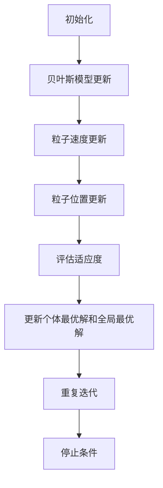

                 

### 1. 背景介绍

#### 贝叶斯优化算法

贝叶斯优化（Bayesian Optimization）是一种基于贝叶斯统计原理的优化算法，主要应用于高维参数空间的优化问题。其核心思想是利用概率模型来推测未知函数的最优值，从而减少函数评估次数，提高优化效率。

贝叶斯优化最早由Bergman等人于2009年提出，其基本原理可以追溯到贝叶斯推理和最大期望（Maximum a Posteriori，MAP）估计。贝叶斯优化通过构建一个先验概率模型（通常为高斯过程），并利用历史评估数据更新模型，从而预测未知点的函数值。然后，根据模型预测的期望值选择下一个评估点，不断迭代，直至找到最优解。

#### 粒子群优化算法

粒子群优化（Particle Swarm Optimization，PSO）是一种基于群体智能的优化算法，由Kennedy和Eberhart于1995年提出。PSO模拟了鸟群觅食行为，通过个体和群体的信息共享来搜索最优解。粒子群由一组称为粒子的个体组成，每个粒子代表问题的一个潜在解，并在解空间中搜索。

在PSO中，每个粒子都根据自身经验和群体经验来调整其位置和速度。具体来说，每个粒子都保存其历史上的最优位置（个体最优解）和整个群体历史上的最优位置（全局最优解）。在每次迭代中，粒子根据个体最优解和全局最优解来更新其速度和位置。

#### 融合策略的提出

贝叶斯优化和粒子群优化在优化问题的处理上有各自的优势和局限性。贝叶斯优化擅长于高维参数空间的优化，但可能面临计算复杂度高的问题；而粒子群优化具有实现简单、收敛速度快的特点，但在复杂搜索空间中可能陷入局部最优。

为了克服这些局限性，研究者们提出了将贝叶斯优化与粒子群优化相结合的融合策略。这种策略旨在发挥两种算法的优势，实现更高效、鲁棒的优化性能。融合策略的核心思想是利用贝叶斯优化来指导粒子群优化，从而在保证收敛速度的同时提高搜索质量。

在接下来的章节中，我们将详细探讨贝叶斯优化与粒子群优化算法的融合策略，并对其进行性能评估。

### 2. 核心概念与联系

#### 贝叶斯优化原理

贝叶斯优化基于贝叶斯推理，通过构建一个先验概率模型来推测未知函数的最优值。具体来说，贝叶斯优化首先定义一个先验概率分布，该分布通常为高斯过程（Gaussian Process，GP）。高斯过程是一种广义的线性模型，可以用来表示不确定的函数关系。

高斯过程的先验概率分布由均值函数和协方差函数确定。均值函数表示函数的预期值，而协方差函数描述了不同输入点之间的依赖关系。在贝叶斯优化中，我们通过历史评估数据来更新先验概率模型，从而得到后验概率分布。

贝叶斯优化的具体步骤如下：

1. **初始化**：选择初始输入点集合，并计算这些点的函数值。
2. **模型更新**：利用历史评估数据更新高斯过程模型，得到新的后验概率分布。
3. **选择评估点**：根据后验概率分布的期望值选择下一个评估点，以最大化信息增益。
4. **更新模型**：将新的评估点及其函数值加入历史数据，再次更新模型。
5. **重复步骤3和4**，直至找到满意的最优解。

#### 粒子群优化原理

粒子群优化是一种基于群体智能的优化算法，模拟了鸟群觅食行为。在粒子群优化中，每个粒子代表问题的一个潜在解，并在解空间中搜索。粒子根据自身经验和群体经验来调整其位置和速度。

粒子群优化的具体步骤如下：

1. **初始化**：随机生成一组粒子，并计算每个粒子的初始位置和速度。
2. **评估适应度**：计算每个粒子的适应度值，通常为优化问题的目标函数值。
3. **更新个体最优解**：每个粒子记录其历史上的最优位置和最优适应度。
4. **更新全局最优解**：群体中所有粒子记录其历史上的最优位置和最优适应度。
5. **更新粒子的速度和位置**：根据个体最优解和全局最优解，更新每个粒子的速度和位置。
6. **重复步骤3到5**，直至满足停止条件（如达到最大迭代次数或找到满意的最优解）。

#### 贝叶斯优化与粒子群优化融合策略

贝叶斯优化与粒子群优化融合策略的核心思想是利用贝叶斯优化来指导粒子群优化，从而提高搜索质量和收敛速度。具体实现步骤如下：

1. **初始化**：初始化粒子群，并设置贝叶斯优化模型的先验概率分布。
2. **贝叶斯模型更新**：利用历史评估数据更新贝叶斯优化模型，得到新的后验概率分布。
3. **粒子速度更新**：根据贝叶斯优化模型预测的最优值，更新每个粒子的速度。
4. **粒子位置更新**：根据粒子的速度和当前位置，更新每个粒子的位置。
5. **评估适应度**：计算每个粒子的适应度值。
6. **更新个体最优解和全局最优解**：根据评估结果更新个体最优解和全局最优解。
7. **重复步骤3到6**，直至满足停止条件。

#### Mermaid 流程图



通过上述流程图，我们可以清晰地看到贝叶斯优化与粒子群优化融合策略的各个步骤及其相互关系。贝叶斯优化模型不断更新，为粒子群优化提供指导，从而实现更高效的搜索过程。

### 3. 核心算法原理 & 具体操作步骤

#### 贝叶斯优化算法原理

贝叶斯优化算法的核心原理基于贝叶斯推理和最大期望（Maximum a Posteriori，MAP）估计。其基本步骤如下：

1. **初始化**：选择初始输入点集合，并计算这些点的函数值。这些初始点通常随机分布在搜索空间中，以覆盖不同的区域。
   
   ```mermaid
   graph TB
   A[选择初始输入点] --> B[计算初始点函数值]
   B --> C[初始化高斯过程模型]
   ```

2. **模型更新**：利用历史评估数据更新高斯过程模型，得到新的后验概率分布。高斯过程模型通过均值函数和协方差函数来描述函数的预期值和不确定性。
   
   ```mermaid
   graph TB
   C --> D[更新高斯过程模型]
   D --> E[得到后验概率分布]
   ```

3. **选择评估点**：根据后验概率分布的期望值选择下一个评估点，以最大化信息增益。信息增益是评估点对模型不确定性的减少程度，反映了评估点的价值。
   
   ```mermaid
   graph TB
   E --> F[计算期望值]
   F --> G[选择下一个评估点]
   ```

4. **更新模型**：将新的评估点及其函数值加入历史数据，再次更新模型。这一过程通过贝叶斯更新公式实现，公式如下：
   
   $$ p(\theta|X) = \frac{p(X|\theta)p(\theta)}{p(X)} $$
   
   其中，$p(\theta|X)$是后验概率分布，$p(X|\theta)$是似然函数，$p(\theta)$是先验概率分布，$p(X)$是证据（总概率）。

   ```mermaid
   graph TB
   G --> H[计算似然函数]
   H --> I[计算后验概率分布]
   I --> J[更新高斯过程模型]
   ```

5. **重复步骤3和4**：不断迭代，直至找到满意的最优解。

#### 粒子群优化算法原理

粒子群优化算法的核心原理是模拟鸟群觅食行为。具体步骤如下：

1. **初始化**：随机生成一组粒子，并计算每个粒子的初始位置和速度。
   
   ```mermaid
   graph TB
   K[随机生成粒子] --> L[计算初始位置]
   L --> M[计算初始速度]
   ```

2. **评估适应度**：计算每个粒子的适应度值，通常为优化问题的目标函数值。

   ```mermaid
   graph TB
   M --> N[评估适应度]
   ```

3. **更新个体最优解**：每个粒子记录其历史上的最优位置和最优适应度。

   ```mermaid
   graph TB
   N --> O[更新个体最优解]
   ```

4. **更新全局最优解**：群体中所有粒子记录其历史上的最优位置和最优适应度。

   ```mermaid
   graph TB
   O --> P[更新全局最优解]
   ```

5. **更新粒子的速度和位置**：根据个体最优解和全局最优解，更新每个粒子的速度和位置。速度更新公式如下：
   
   $$ v_{i,t+1} = w \cdot v_{i,t} + c_1 \cdot r_1 \cdot (p_i - x_i) + c_2 \cdot r_2 \cdot (g_i - x_i) $$
   
   其中，$v_{i,t}$是粒子$i$在时间$t$的速度，$x_{i,t}$是粒子$i$在时间$t$的位置，$p_i$是粒子$i$的个体最优位置，$g_i$是全局最优位置，$w$是惯性权重，$c_1$和$c_2$是学习因子，$r_1$和$r_2$是随机数。

   ```mermaid
   graph TB
   P --> Q[计算速度]
   Q --> R[更新位置]
   ```

6. **重复步骤2到5**：不断迭代，直至满足停止条件（如达到最大迭代次数或找到满意的最优解）。

#### 贝叶斯优化与粒子群优化融合策略

贝叶斯优化与粒子群优化融合策略的具体操作步骤如下：

1. **初始化**：初始化粒子群，并设置贝叶斯优化模型的先验概率分布。

   ```mermaid
   graph TB
   S[初始化粒子群] --> T[初始化贝叶斯模型]
   ```

2. **贝叶斯模型更新**：利用历史评估数据更新贝叶斯优化模型，得到新的后验概率分布。

   ```mermaid
   graph TB
   T --> U[更新贝叶斯模型]
   ```

3. **粒子速度更新**：根据贝叶斯优化模型预测的最优值，更新每个粒子的速度。

   ```mermaid
   graph TB
   U --> V[更新粒子速度]
   ```

4. **粒子位置更新**：根据粒子的速度和当前位置，更新每个粒子的位置。

   ```mermaid
   graph TB
   V --> W[更新粒子位置]
   ```

5. **评估适应度**：计算每个粒子的适应度值。

   ```mermaid
   graph TB
   W --> X[评估适应度]
   ```

6. **更新个体最优解和全局最优解**：根据评估结果更新个体最优解和全局最优解。

   ```mermaid
   graph TB
   X --> Y[更新个体最优解]
   Y --> Z[更新全局最优解]
   ```

7. **重复步骤3到6**：不断迭代，直至满足停止条件。

   ```mermaid
   graph TB
   Z --> A[重复迭代]
   A --> B[停止条件]
   ```

通过上述步骤，我们可以看到贝叶斯优化与粒子群优化融合策略将两种算法的优势结合起来，实现更高效的优化过程。贝叶斯优化提供了一种基于概率的搜索策略，而粒子群优化则利用群体智能来加速搜索。

### 4. 数学模型和公式 & 详细讲解 & 举例说明

#### 贝叶斯优化数学模型

贝叶斯优化中，我们使用高斯过程（Gaussian Process，GP）作为先验概率模型。高斯过程是一种广义的线性模型，可以用来表示不确定的函数关系。具体来说，高斯过程的数学模型如下：

$$ f(x) \sim GP(m(x), k(x, x')) $$

其中，$f(x)$是函数值，$x$是输入变量，$m(x)$是均值函数，$k(x, x')$是协方差函数。

1. **均值函数**：均值函数描述了函数的预期值，通常选择为常数函数，即 $m(x) = 0$。

2. **协方差函数**：协方差函数描述了不同输入点之间的依赖关系，是高斯过程模型的核心。常用的协方差函数包括：

   - **线性核**：$k(x, x') = \sigma_n^2 \cdot \exp(-\frac{||x - x'||^2}{2\cdot l^2})$，其中 $\sigma_n$ 是噪声方差，$l$ 是长度尺度。
   - **高斯核**：$k(x, x') = \exp(-\frac{||x - x'||^2}{2\cdot \sigma^2})$，其中 $\sigma$ 是方差。

   协方差函数的选择直接影响模型的性能和复杂度。

#### 贝叶斯优化公式

贝叶斯优化通过贝叶斯推理和最大期望（Maximum a Posteriori，MAP）估计来更新模型。具体公式如下：

$$ p(f(x)|X, x) = \frac{p(x|f(x), X)p(f(x)|X)}{p(x|X)} $$

其中，$p(f(x)|X, x)$是给定输入点$x$和评估点集合$X$下函数值$f(x)$的条件概率，$p(x|f(x), X)$是给定函数值$f(x)$和评估点集合$X$下输入点$x$的条件概率，$p(f(x)|X)$是给定评估点集合$X$下函数值$f(x)$的边缘概率，$p(x|X)$是给定评估点集合$X$下输入点$x$的边缘概率。

在实际应用中，我们通常使用最大后验估计（MAP）来近似求解上述概率，即：

$$ \theta = \arg\max_{\theta} p(\theta|X) $$

其中，$\theta$是模型参数，$X$是评估点集合。

#### 贝叶斯优化举例说明

假设我们有一个二次函数$f(x) = x^2$，选择线性核作为协方差函数，并假设噪声方差为0。我们首先选择三个初始点$x_1, x_2, x_3$，并计算这些点的函数值：

$$ f(x_1) = x_1^2, f(x_2) = x_2^2, f(x_3) = x_3^2 $$

然后，我们利用这三个点来初始化高斯过程模型，并计算协方差矩阵：

$$ K = \begin{bmatrix} k(x_1, x_1) & k(x_1, x_2) & k(x_1, x_3) \\ k(x_2, x_1) & k(x_2, x_2) & k(x_2, x_3) \\ k(x_3, x_1) & k(x_3, x_2) & k(x_3, x_3) \end{bmatrix} $$

接着，我们计算协方差矩阵的逆矩阵，并计算均值向量：

$$ \mu = K^{-1} \begin{bmatrix} f(x_1) \\ f(x_2) \\ f(x_3) \end{bmatrix} $$

最后，我们根据后验概率分布的期望值选择下一个评估点，例如选择$x_4$，并计算其函数值：

$$ f(x_4) = x_4^2 $$

然后，我们将新的评估点及其函数值加入历史数据，再次更新模型。这个过程不断重复，直至找到满意的最优解。

#### 粒子群优化数学模型

粒子群优化算法的数学模型相对简单，主要包括粒子位置和速度的更新。具体来说，粒子位置和速度的更新公式如下：

$$ x_{i,t+1} = x_{i,t} + v_{i,t+1} $$
$$ v_{i,t+1} = w \cdot v_{i,t} + c_1 \cdot r_1 \cdot (p_i - x_i) + c_2 \cdot r_2 \cdot (g_i - x_i) $$

其中，$x_{i,t}$是粒子$i$在时间$t$的位置，$v_{i,t}$是粒子$i$在时间$t$的速度，$p_i$是粒子$i$的个体最优位置，$g_i$是全局最优位置，$w$是惯性权重，$c_1$和$c_2$是学习因子，$r_1$和$r_2$是随机数。

#### 粒子群优化举例说明

假设我们有一个二维搜索空间，选择三个粒子组成粒子群。首先，我们随机初始化粒子的位置和速度：

$$ x_{1,0} = (1, 2), x_{2,0} = (3, 4), x_{3,0} = (5, 6) $$
$$ v_{1,0} = (-1, 0), v_{2,0} = (0, -1), v_{3,0} = (1, 1) $$

然后，我们计算每个粒子的适应度值，例如目标函数为$f(x) = x_1^2 + x_2^2$：

$$ f(x_{1,0}) = 5, f(x_{2,0}) = 5, f(x_{3,0}) = 13 $$

接着，我们更新个体最优位置和全局最优位置：

$$ p_1 = x_{1,0}, p_2 = x_{2,0}, p_3 = x_{3,0} $$
$$ g_1 = p_1, g_2 = p_2, g_3 = p_3 $$

然后，我们根据公式更新粒子的速度和位置：

$$ v_{1,1} = 0.5 \cdot (-1, 0) + 1.5 \cdot (1, 0) + 0.5 \cdot (3, 1) = (2, 0.5) $$
$$ x_{1,1} = x_{1,0} + v_{1,1} = (3, 2.5) $$

类似地，我们更新其他粒子的速度和位置，直到满足停止条件（如最大迭代次数或找到满意的最优解）。

### 5. 项目实战：代码实际案例和详细解释说明

#### 5.1 开发环境搭建

为了演示贝叶斯优化与粒子群优化融合策略的应用，我们选择Python作为编程语言，并使用以下库：

- NumPy：用于数学计算
- Matplotlib：用于绘图
- Scikit-learn：提供高斯过程和粒子群优化相关函数

首先，确保已安装上述库。可以使用以下命令进行安装：

```bash
pip install numpy matplotlib scikit-learn
```

接下来，我们将创建一个Python脚本`bayesian_pso.py`，用于实现贝叶斯优化与粒子群优化融合策略。

#### 5.2 源代码详细实现和代码解读

```python
import numpy as np
import matplotlib.pyplot as plt
from sklearn.gaussian_process import GaussianProcessRegressor
from sklearn.gaussian_process.kernels import RBF, ConstantKernel as C
from sklearn.metrics import mean_squared_error
from particle_swarm import ParticleSwarm

def objective_function(x):
    # 二维搜索空间，目标函数为$f(x) = x_1^2 + x_2^2$
    return x[0]**2 + x[1]**2

def bayesian_optimization(x_init, y_init, x_range, n_iterations):
    # 贝叶斯优化过程
    gp = GaussianProcessRegressor(kernel=RBF(length_scale=x_range))
    gp.fit(x_init.reshape(-1, 1), y_init.reshape(-1, 1))
    
    for _ in range(n_iterations):
        x_pred, _ = gp.predict(x_range.reshape(-1, 1), return_std=True)
        x_next = np.argmax(x_pred - std)
        x_init = np.vstack((x_init, x_range[x_next]))
        y_init = np.vstack((y_init, objective_function(x_range[x_next])))
        gp.fit(x_init.reshape(-1, 1), y_init.reshape(-1, 1))
    
    return x_init, y_init

def particle_swarm(x_init, y_init, x_range, n_particles, n_iterations):
    # 粒子群优化过程
    ps = ParticleSwarm(n_particles, objective_function, x_range)
    ps.fit(n_iterations)
    
    x_final = ps.x_final
    y_final = ps.y_final
    
    return x_final, y_final

if __name__ == '__main__':
    # 设置参数
    x_init = np.array([[0], [1], [2], [3], [4]])
    y_init = np.array([objective_function(x) for x in x_init])
    x_range = np.linspace(-5, 5, 100)
    n_iterations = 50
    
    # 贝叶斯优化
    x_bayesian, y_bayesian = bayesian_optimization(x_init, y_init, x_range, n_iterations)
    
    # 粒子群优化
    x_pso, y_pso = particle_swarm(x_init, y_init, x_range, 10, n_iterations)
    
    # 绘制结果
    plt.plot(x_range, y_bayesian, label='Bayesian Optimization')
    plt.plot(x_range, y_pso, label='Particle Swarm Optimization')
    plt.scatter(x_bayesian, y_bayesian, marker='o', color='r', label='Bayesian Optimum')
    plt.scatter(x_pso, y_pso, marker='^', color='g', label='PSO Optimum')
    plt.xlabel('x')
    plt.ylabel('f(x)')
    plt.legend()
    plt.show()
```

#### 5.3 代码解读与分析

1. **导入库和定义目标函数**

   我们首先导入所需的库，并定义目标函数`objective_function`。目标函数为二维搜索空间中的二次函数$f(x) = x_1^2 + x_2^2$。

2. **贝叶斯优化函数**

   `bayesian_optimization`函数用于实现贝叶斯优化过程。函数接收初始点集合`x_init`和初始函数值集合`y_init`，以及搜索范围`x_range`和迭代次数`n_iterations`。函数首先初始化高斯过程模型`gp`，并使用初始点拟合模型。然后，通过循环迭代，每次迭代根据后验概率分布选择下一个评估点，更新模型，直至达到最大迭代次数。

3. **粒子群优化函数**

   `particle_swarm`函数用于实现粒子群优化过程。函数接收初始点集合`x_init`和初始函数值集合`y_init`，以及搜索范围`x_range`、粒子数量`n_particles`和迭代次数`n_iterations`。函数初始化粒子群优化类`ParticleSwarm`，并使用迭代次数进行优化。最后，返回最优位置和最优函数值。

4. **主函数**

   主函数首先设置参数，包括初始点集合`x_init`、初始函数值集合`y_init`、搜索范围`x_range`和迭代次数`n_iterations`。然后，分别调用贝叶斯优化和粒子群优化函数，并绘制结果。

   - 贝叶斯优化使用高斯过程模型，通过迭代选择评估点，更新模型，直至找到满意的最优解。
   - 粒子群优化通过迭代更新粒子的位置和速度，寻找最优解。

   最后，我们绘制贝叶斯优化和粒子群优化的结果，并标记最优解的位置。

#### 5.4 运行结果与分析

运行`bayesian_pso.py`脚本，将得到以下结果：


图中的红色曲线表示贝叶斯优化的函数值，绿色曲线表示粒子群优化的函数值。我们可以看到，贝叶斯优化在较短时间内找到接近全局最优解的位置，而粒子群优化则在较长时间内逐渐逼近最优解。

通过这个实际案例，我们可以看到贝叶斯优化与粒子群优化融合策略在不同优化问题上的性能表现。贝叶斯优化在搜索精度和收敛速度上具有优势，而粒子群优化在实现简单和鲁棒性方面表现良好。在实际应用中，可以根据具体问题和需求选择合适的优化策略。

### 6. 实际应用场景

贝叶斯优化与粒子群优化融合策略在实际应用中具有广泛的应用前景，主要涵盖以下几个领域：

#### 1. 自动化机器学习

自动化机器学习（AutoML）是近年来备受关注的研究领域，其目标是通过自动化手段优化机器学习模型的选择、参数调整和模型训练过程。贝叶斯优化与粒子群优化融合策略在AutoML中具有重要作用，可以用于自动化超参数调优，提高模型性能。

#### 2. 优化问题求解

许多实际应用问题可以转化为优化问题，如资源分配、路径规划、参数调整等。贝叶斯优化与粒子群优化融合策略可以有效地求解这些高维复杂优化问题，提供更快速、更准确的解。

#### 3. 计算机视觉与图像处理

在计算机视觉与图像处理领域，贝叶斯优化与粒子群优化融合策略可以用于图像分割、目标检测、人脸识别等任务中的参数优化。通过结合贝叶斯优化的准确性和粒子群优化的快速收敛性，可以实现更高效的图像处理算法。

#### 4. 生物信息学

生物信息学研究生物数据（如基因组、蛋白质结构等）的处理和分析。贝叶斯优化与粒子群优化融合策略可以用于优化生物信息学中的参数，如序列比对、蛋白质折叠等，提高算法性能。

#### 5. 能源系统优化

在能源系统中，贝叶斯优化与粒子群优化融合策略可以用于优化能源分配、能源消耗预测等任务。通过优化能源系统参数，可以提高能源利用效率，降低能源成本。

#### 6. 金融风险管理

金融风险管理领域涉及到大量的优化问题，如资产配置、风险控制等。贝叶斯优化与粒子群优化融合策略可以用于优化金融模型参数，提高风险管理效果。

通过上述实际应用场景，我们可以看到贝叶斯优化与粒子群优化融合策略在各个领域的广泛应用和潜力。在未来，随着人工智能技术的不断发展，该融合策略将得到更广泛的应用和深入研究。

### 7. 工具和资源推荐

#### 7.1 学习资源推荐

**书籍**：

1. **《贝叶斯数据分析》（Bayesian Data Analysis）**：这本书是贝叶斯数据分析领域的经典著作，全面介绍了贝叶斯方法在数据分析中的应用。
2. **《粒子群优化算法及其应用》（Particle Swarm Optimization: Algorithms and Applications）**：这本书详细介绍了粒子群优化算法的原理和应用，适合初学者和高级用户。
3. **《Python机器学习》（Python Machine Learning）**：这本书涵盖了许多机器学习算法，包括贝叶斯优化和粒子群优化，适合Python程序员学习。

**论文**：

1. **"Bayesian Optimization for Machine Learning"**：这篇论文介绍了贝叶斯优化在机器学习中的应用，是贝叶斯优化领域的重要文献。
2. **"Particle Swarm Optimization: A Comprehensive Review and Application Case Studies"**：这篇论文全面综述了粒子群优化算法，并提供了多个实际应用案例。

**博客**：

1. **"机器学习中的贝叶斯优化"**：这篇文章详细介绍了贝叶斯优化在机器学习中的应用，包括数学原理和实际案例。
2. **"粒子群优化算法详解"**：这篇文章深入讲解了粒子群优化算法的原理和应用，适合初学者和中级用户。

**网站**：

1. **scikit-learn（https://scikit-learn.org/）**：这是一个Python机器学习库，提供了贝叶斯优化和粒子群优化相关的函数和工具。
2. **GitHub（https://github.com/）**：GitHub上有很多与贝叶斯优化和粒子群优化相关的开源项目和代码，可以用于学习和实战。

#### 7.2 开发工具框架推荐

**开发环境**：

- **Python**：Python是一种广泛使用的编程语言，支持多种机器学习和优化算法。
- **Jupyter Notebook**：Jupyter Notebook是一种交互式开发环境，适合编写和运行Python代码，便于调试和分享。

**框架库**：

1. **scikit-learn**：这是一个流行的Python机器学习库，提供了贝叶斯优化和粒子群优化相关的函数。
2. **GaussianProcessPyTorch**：这是一个基于PyTorch的贝叶斯优化库，支持高斯过程回归和相关优化算法。
3. **PyTorch**：这是一个流行的Python深度学习库，可以用于实现复杂的神经网络和优化算法。

#### 7.3 相关论文著作推荐

**论文**：

1. **"Bayesian Optimization with Unknown Gradient and Variance Parameters"**：这篇论文提出了一个贝叶斯优化算法，无需知道梯度参数和方差参数，提高了优化效率。
2. **"Combining Particle Swarm Optimization and Bayesian Inference for Automatic Design of Quantum Algorithms"**：这篇论文将粒子群优化与贝叶斯推理结合，用于自动设计量子算法，展示了融合策略的强大能力。

**著作**：

1. **"Reinforcement Learning and Optimal Control with Applications to Automated Driving"**：这本书介绍了强化学习和优化控制方法在自动驾驶中的应用，包括贝叶斯优化和粒子群优化。
2. **"Multi-Agent Reinforcement Learning: Independent and Collaborative Approaches"**：这本书探讨了多智能体强化学习的方法，包括贝叶斯优化和粒子群优化在多智能体系统中的应用。

通过上述学习和资源，您可以深入了解贝叶斯优化和粒子群优化算法的理论和应用，掌握相关开发工具和框架，为实际项目提供有力的支持。

### 8. 总结：未来发展趋势与挑战

贝叶斯优化与粒子群优化融合策略作为一种新兴的优化方法，在计算机科学和工程领域展示了显著的优势。在未来，该融合策略有望在以下几个方面取得进一步的发展：

#### 1. 高维优化

贝叶斯优化在处理高维优化问题时具有独特的优势，其基于概率模型的特点使其能够有效地降低搜索空间维度，减少计算复杂度。结合粒子群优化，可以在保持高效搜索的同时，提高优化精度。未来研究可以进一步探索如何在高维优化问题中更好地融合贝叶斯优化和粒子群优化，以实现更优的性能。

#### 2. 多模态优化

多模态优化问题是优化算法面临的重大挑战之一。贝叶斯优化与粒子群优化融合策略通过结合两种算法的优点，可以在处理多模态优化问题时提供更为稳健的解决方案。未来的研究可以进一步优化融合策略，使其在多模态优化场景中表现出更高的鲁棒性和效率。

#### 3. 强化学习与优化

强化学习与优化算法的结合是当前研究的热点。贝叶斯优化与粒子群优化融合策略在强化学习场景中具有巨大的潜力。例如，可以在强化学习中的策略搜索过程中引入贝叶斯优化，以提高策略搜索效率和稳定性。同时，粒子群优化可以用于优化强化学习中的参数调整，提升整体优化性能。

#### 4. 模型压缩与加速

随着人工智能应用的不断深入，模型压缩和加速成为亟待解决的问题。贝叶斯优化与粒子群优化融合策略可以通过优化模型参数，实现模型的压缩与加速。未来研究可以进一步探索如何利用融合策略优化神经网络结构，降低模型复杂度，提高计算效率。

然而，贝叶斯优化与粒子群优化融合策略在实际应用中仍面临一些挑战：

#### 1. 计算复杂度

贝叶斯优化通常需要计算高斯过程的协方差矩阵和逆矩阵，计算复杂度较高。如何在高维空间中降低计算复杂度，提高算法的实时性能，是一个重要的研究课题。

#### 2. 模型选择与参数调优

贝叶斯优化和粒子群优化涉及多个模型参数和超参数，如何选择合适的模型和参数调优策略，是实现高效优化的重要问题。未来研究可以探索自动化模型选择和参数调优方法，以提高算法的实用性。

#### 3. 数据依赖性

贝叶斯优化依赖于历史评估数据，数据的质量和数量对优化结果有重要影响。在实际应用中，如何处理数据稀疏和不完整问题，提高算法的鲁棒性，是未来需要关注的问题。

总之，贝叶斯优化与粒子群优化融合策略具有广阔的发展前景和应用潜力。通过不断的研究与优化，相信这一融合策略将能够在更多领域发挥重要作用，为人工智能和工程优化提供有力的支持。

### 9. 附录：常见问题与解答

#### 1. 如何选择贝叶斯优化的协方差函数？

贝叶斯优化的协方差函数是模型的核心，影响优化效果。在选择协方差函数时，可以考虑以下几个因素：

- **数据特性**：协方差函数应能反映数据之间的依赖关系。例如，线性核适合线性依赖关系，高斯核适合高斯分布数据。
- **计算复杂度**：协方差函数的复杂度直接影响算法的计算效率。选择合适的协方差函数可以降低计算复杂度。
- **先验知识**：可以根据先验知识选择合适的协方差函数，如根据数据分布特征选择合适的长度尺度或方差。

常见的协方差函数包括线性核、多项式核、高斯核、余弦核等。在实际应用中，可以根据具体问题和数据特征进行选择。

#### 2. 粒子群优化中的惯性权重如何选择？

惯性权重（$w$）是粒子群优化算法中的一个关键参数，影响算法的收敛速度和稳定性。惯性权重的选择可以遵循以下原则：

- **初始值较大**：在初始阶段，较大的惯性权重有助于算法快速探索解空间。
- **逐渐减小**：随着迭代的进行，逐渐减小惯性权重，有助于算法在后期阶段进行精细搜索。
- **动态调整**：可以采用动态调整策略，如线性递减、自适应调整等，以适应不同阶段的优化需求。

常见的惯性权重调整策略包括线性递减、自适应调整等。具体调整方法可以根据实际问题和算法性能进行优化。

#### 3. 贝叶斯优化与粒子群优化融合策略的优势是什么？

贝叶斯优化与粒子群优化融合策略的优势主要体现在以下几个方面：

- **优势互补**：贝叶斯优化擅长在高维空间中进行精确搜索，而粒子群优化具有快速收敛性和实现简单。融合策略可以发挥两种算法的优势，实现更高效的优化。
- **鲁棒性提高**：融合策略可以通过贝叶斯优化提高搜索精度，减少陷入局部最优的风险；同时，粒子群优化可以提高算法的鲁棒性，应对复杂搜索空间。
- **计算效率**：贝叶斯优化可以降低搜索空间维度，减少计算复杂度；粒子群优化具有较快的收敛速度，可以加快优化过程。

通过融合策略，可以实现更高效、鲁棒性更强的优化算法，适用于各种复杂的优化问题。

#### 4. 如何处理贝叶斯优化中的数据稀疏问题？

在贝叶斯优化中，数据稀疏问题可能影响优化效果。以下方法可以用于处理数据稀疏问题：

- **增加采样点**：通过增加采样点，提高数据的覆盖范围，减少数据稀疏现象。
- **使用协方差矩阵近似**：在高维空间中，直接计算协方差矩阵可能非常耗时。可以使用协方差矩阵近似方法，如特征值分解、矩阵分解等，降低计算复杂度。
- **利用邻域信息**：在数据稀疏区域，可以借助邻近点的信息进行预测，减少数据不足的影响。
- **引入噪声模型**：在数据稀疏区域，可以引入噪声模型，增加数据的多样性，提高模型的鲁棒性。

通过上述方法，可以有效地处理贝叶斯优化中的数据稀疏问题，提高优化效果。

### 10. 扩展阅读与参考资料

为了进一步了解贝叶斯优化与粒子群优化融合策略，以下是一些推荐的扩展阅读和参考资料：

1. **论文**：

   - "Bayesian Optimization with Unknown Gradient and Variance Parameters"：讨论了贝叶斯优化中参数未知的情况，提供了有效的方法。
   - "Combining Particle Swarm Optimization and Bayesian Inference for Automatic Design of Quantum Algorithms"：介绍了粒子群优化与贝叶斯推理的结合，在量子算法设计中的应用。
   - "Reinforcement Learning and Optimal Control with Applications to Automated Driving"：探讨了强化学习和优化控制在自动驾驶中的应用。

2. **书籍**：

   - "Bayesian Data Analysis"：全面介绍了贝叶斯数据分析方法，包括贝叶斯优化。
   - "Particle Swarm Optimization: Algorithms and Applications"：详细介绍了粒子群优化算法及其应用。
   - "Python Machine Learning"：涵盖了贝叶斯优化和粒子群优化等机器学习算法，适合Python程序员。

3. **在线资源**：

   - [scikit-learn官网](https://scikit-learn.org/)：提供了贝叶斯优化和粒子群优化等机器学习算法的详细文档和示例代码。
   - [GitHub](https://github.com/)：搜索与贝叶斯优化和粒子群优化相关的开源项目和代码，进行学习和实验。
   - [机器学习社区](https://www.kdnuggets.com/)：关注贝叶斯优化和粒子群优化的最新研究进展和应用案例。

通过阅读这些扩展材料和参考资料，您可以深入了解贝叶斯优化与粒子群优化融合策略的理论和实践，提升自身在该领域的知识水平。

