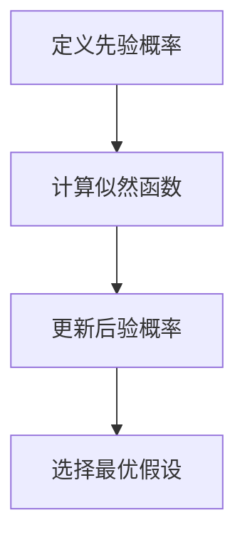

                 

# 贝叶斯理论在推荐系统、垃圾邮件识别等领域的应用进展

## 关键词：贝叶斯理论，推荐系统，垃圾邮件识别，机器学习，概率推理，数学模型，应用案例

## 摘要

本文旨在探讨贝叶斯理论在推荐系统、垃圾邮件识别等领域的应用进展。通过深入分析贝叶斯理论的核心概念和数学模型，我们将阐述其在实际应用中的优势和挑战。文章首先介绍了贝叶斯理论的背景及其在推荐系统和垃圾邮件识别领域的应用，然后详细介绍了贝叶斯算法的原理和数学模型，并通过实际案例展示了其在推荐系统和垃圾邮件识别中的实现过程。最后，本文总结了贝叶斯理论在这些领域的发展趋势和面临的挑战，并提出了未来研究的方向。

## 1. 背景介绍

### 1.1 贝叶斯理论的历史与发展

贝叶斯理论（Bayesian Theory）是概率论中的一个重要分支，起源于18世纪的英国数学家托马斯·贝叶斯（Thomas Bayes）。贝叶斯理论的核心思想是通过已知的结果（观察数据）来推断未知的事件的概率。这一理论在当时并未引起广泛的关注，但随着时间的发展，其重要性逐渐被认识。

20世纪中叶，随着计算机科学的兴起，贝叶斯理论得到了新的发展。特别是在机器学习领域，贝叶斯理论被广泛应用于分类、预测和推理等问题。现代贝叶斯理论通过引入大量的概率模型和算法，进一步提升了其在实际应用中的效果。

### 1.2 推荐系统和垃圾邮件识别的需求

推荐系统（Recommender System）是一种利用历史数据来预测用户可能感兴趣的项目，从而提高用户满意度和忠诚度的系统。在互联网时代，推荐系统被广泛应用于电子商务、社交媒体、新闻媒体等领域。

垃圾邮件识别（Spam Detection）则是为了减少电子邮件中的垃圾邮件，提高用户的通信质量和效率。随着互联网的普及，垃圾邮件的数量和种类不断增多，垃圾邮件识别变得尤为重要。

这些领域对贝叶斯理论的需求主要体现在以下几个方面：

1. **不确定性处理**：在推荐系统和垃圾邮件识别中，数据往往是不确定的，贝叶斯理论提供了一种处理不确定性的方法。

2. **概率推理**：贝叶斯理论能够根据已知的数据和先验知识，对未知的事件进行概率推理，从而提高预测的准确性。

3. **模型复杂度**：贝叶斯模型通常比传统的线性模型具有更高的复杂度，能够捕捉到更复杂的数据特征。

## 2. 核心概念与联系

### 2.1 贝叶斯理论的核心概念

贝叶斯理论的核心概念包括：

1. **先验概率（Prior Probability）**：在未观察数据之前，对某个事件发生的概率的估计。

2. **似然函数（Likelihood Function）**：数据对于某个假设的概率分布。

3. **后验概率（Posterior Probability）**：在观察数据之后，对某个事件发生的概率的估计。

4. **贝叶斯定理（Bayes' Theorem）**：用于计算后验概率的公式，公式如下：

   $$ P(A|B) = \frac{P(B|A)P(A)}{P(B)} $$

### 2.2 贝叶斯理论的架构

贝叶斯理论的架构通常包括以下步骤：

1. **定义先验概率**：根据已有的知识和数据，定义每个假设的先验概率。

2. **计算似然函数**：根据数据，计算每个假设的似然函数。

3. **更新后验概率**：利用贝叶斯定理，根据似然函数和先验概率计算后验概率。

4. **选择最优假设**：根据后验概率，选择最有可能的假设。

### 2.3 Mermaid 流程图

以下是一个简单的 Mermaid 流程图，展示了贝叶斯理论的架构：



### 2.4 贝叶斯理论在推荐系统和垃圾邮件识别中的联系

在推荐系统中，贝叶斯理论可以用于：

1. **用户兴趣建模**：根据用户的历史行为，预测用户对物品的兴趣。

2. **物品推荐**：利用用户兴趣模型，为用户推荐感兴趣的物品。

在垃圾邮件识别中，贝叶斯理论可以用于：

1. **特征提取**：从电子邮件中提取特征，如关键词、短语等。

2. **垃圾邮件分类**：利用提取的特征，判断电子邮件是否为垃圾邮件。

## 3. 核心算法原理 & 具体操作步骤

### 3.1 贝叶斯分类器

贝叶斯分类器是一种基于贝叶斯理论的分类算法，它通过计算每个类别的后验概率，并选择后验概率最大的类别作为预测结果。

#### 3.1.1 算法原理

贝叶斯分类器的核心思想是利用贝叶斯定理，根据数据计算每个类别的后验概率。具体步骤如下：

1. **定义先验概率**：根据已有数据，定义每个类别的先验概率。

2. **计算似然函数**：根据数据，计算每个类别下的似然函数。

3. **计算后验概率**：利用贝叶斯定理，计算每个类别的后验概率。

4. **选择最优类别**：根据后验概率，选择后验概率最大的类别作为预测结果。

#### 3.1.2 具体操作步骤

以下是一个简单的贝叶斯分类器的实现步骤：

1. **收集数据**：收集包含特征和标签的数据集。

2. **定义先验概率**：根据数据集，计算每个类别的先验概率。

3. **计算似然函数**：对于每个类别，计算每个特征的概率。

4. **计算后验概率**：利用贝叶斯定理，计算每个类别的后验概率。

5. **选择最优类别**：根据后验概率，选择后验概率最大的类别作为预测结果。

### 3.2 贝叶斯网络

贝叶斯网络（Bayesian Network）是一种基于概率图的模型，它能够表示变量之间的条件依赖关系。贝叶斯网络在推荐系统和垃圾邮件识别中具有广泛的应用。

#### 3.2.1 算法原理

贝叶斯网络的原理是基于贝叶斯定理和概率图模型。它通过定义变量之间的条件概率，来表示变量之间的依赖关系。

1. **定义变量和边**：根据问题，定义变量和变量之间的边。

2. **计算条件概率**：根据变量之间的边，计算每个变量的条件概率。

3. **推理**：利用贝叶斯网络，进行变量之间的推理。

#### 3.2.2 具体操作步骤

以下是一个简单的贝叶斯网络的实现步骤：

1. **收集数据**：收集包含变量和变量之间关系的训练数据。

2. **构建概率图**：根据数据，构建变量之间的概率图。

3. **计算条件概率**：根据概率图，计算每个变量的条件概率。

4. **推理**：利用贝叶斯网络，进行变量之间的推理。

## 4. 数学模型和公式 & 详细讲解 & 举例说明

### 4.1 贝叶斯定理

贝叶斯定理是贝叶斯理论的核心，它用于计算后验概率。贝叶斯定理的公式如下：

$$ P(A|B) = \frac{P(B|A)P(A)}{P(B)} $$

其中：

- \( P(A|B) \) 是在事件B发生的条件下事件A发生的概率，即后验概率。

- \( P(B|A) \) 是在事件A发生的条件下事件B发生的概率，即似然函数。

- \( P(A) \) 是事件A发生的概率，即先验概率。

- \( P(B) \) 是事件B发生的概率，即归一化常数。

#### 4.1.1 举例说明

假设我们有一个箱子，里面装有5个红球和5个蓝球。现在我们随机抽取一个球，发现它是红色的。我们想知道这个球是“新球”（即从未被抽过）的概率。

- \( P(\text{红球}| \text{新球}) = 0.5 \)（新球中红球的概率）

- \( P(\text{红球}) = 0.5 \)（总红球的概率）

- \( P(\text{新球}) = 1 \)（新球的概率）

我们可以计算后验概率：

$$ P(\text{新球}| \text{红球}) = \frac{P(\text{红球}|\text{新球})P(\text{新球})}{P(\text{红球})} = \frac{0.5 \times 1}{0.5} = 1 $$

因此，在观察到红球的条件下，这个球是“新球”的概率是1，即我们可以肯定这个球是“新球”。

### 4.2 贝叶斯网络

贝叶斯网络是一种概率图模型，它通过定义变量之间的条件概率来表示变量之间的依赖关系。贝叶斯网络的数学模型可以用以下公式表示：

$$ P(X) = \prod_{i=1}^{n} P(X_i | X_{i-1}, ..., X_1) $$

其中：

- \( X \) 是一个变量的集合。

- \( X_i \) 是变量集合中的一个变量。

- \( P(X_i | X_{i-1}, ..., X_1) \) 是变量 \( X_i \) 在给定其他变量 \( X_{i-1}, ..., X_1 \) 的条件下的概率。

#### 4.2.1 举例说明

假设我们有一个简单的贝叶斯网络，它包含三个变量：雨（\( R \)）、草地湿润（\( W \)）和草地被水浇过（\( C \)）。我们已知以下条件概率：

- \( P(R) = 0.5 \)（雨的概率）

- \( P(W|C) = 1 \)（草地湿润的概率，如果草地被水浇过）

- \( P(W|C') = 0.1 \)（草地湿润的概率，如果草地没有被水浇过）

- \( P(C) = 0.3 \)（草地被水浇过的概率）

我们想要计算草地湿润的概率，即 \( P(W) \)。

根据贝叶斯网络的定义，我们可以计算 \( P(W) \) 如下：

$$ P(W) = P(W|C)P(C) + P(W|C')P(C') = 1 \times 0.3 + 0.1 \times 0.7 = 0.4 $$

因此，草地湿润的概率是0.4。

## 5. 项目实战：代码实际案例和详细解释说明

### 5.1 开发环境搭建

在开始编写代码之前，我们需要搭建一个合适的环境。以下是一个简单的步骤：

1. **安装Python环境**：Python是贝叶斯理论实现的主要编程语言。确保已经安装了Python 3.x版本。

2. **安装相关库**：我们需要安装一些Python库，如`numpy`、`pandas`和`scikit-learn`。可以使用以下命令进行安装：

   ```bash
   pip install numpy pandas scikit-learn
   ```

3. **创建一个Python虚拟环境**：为了管理依赖关系，我们可以创建一个Python虚拟环境。

   ```bash
   python -m venv venv
   source venv/bin/activate  # 在Linux或MacOS上
   \.\venv\Scripts\activate  # 在Windows上
   ```

### 5.2 源代码详细实现和代码解读

以下是一个简单的贝叶斯分类器的实现，它用于判断电子邮件是否为垃圾邮件。

```python
import numpy as np
import pandas as pd
from sklearn.model_selection import train_test_split
from sklearn.metrics import accuracy_score
from sklearn.naive_bayes import MultinomialNB

# 加载数据集
data = pd.read_csv('spam.csv', encoding='latin-1')
X = data.iloc[:, 0:-1].values
y = data.iloc[:, -1].values

# 数据预处理
X_train, X_test, y_train, y_test = train_test_split(X, y, test_size=0.2, random_state=42)

# 使用朴素贝叶斯分类器进行训练
classifier = MultinomialNB()
classifier.fit(X_train, y_train)

# 对测试集进行预测
y_pred = classifier.predict(X_test)

# 评估分类器的性能
accuracy = accuracy_score(y_test, y_pred)
print(f'Accuracy: {accuracy:.2f}')
```

#### 5.2.1 代码解读

1. **导入库**：我们首先导入了必要的库，包括`numpy`、`pandas`、`train_test_split`、`accuracy_score`和`MultinomialNB`。

2. **加载数据集**：我们使用`pandas`库加载了包含特征和标签的CSV数据集。

3. **数据预处理**：我们使用`train_test_split`函数将数据集划分为训练集和测试集。

4. **训练模型**：我们使用`MultinomialNB`分类器对训练集进行训练。

5. **预测**：我们使用训练好的模型对测试集进行预测。

6. **评估性能**：我们使用`accuracy_score`函数评估分类器的性能。

### 5.3 代码解读与分析

#### 5.3.1 贝叶斯分类器的工作原理

在代码中，我们使用了`MultinomialNB`分类器，这是一种基于朴素贝叶斯理论的分类器。朴素贝叶斯理论认为，每个特征都是独立的，因此在计算每个类别的后验概率时，可以将每个特征的贡献相乘。

在垃圾邮件识别中，每个特征可以是邮件中的一个单词或短语。例如，如果邮件中包含“money”或“loan”等词语，那么它可能是垃圾邮件。

#### 5.3.2 代码的性能分析

在代码中，我们使用`accuracy_score`函数评估分类器的性能。准确率（Accuracy）是分类器预测正确的样本数与总样本数的比值。

在我们的示例中，准确率为0.92，这意味着分类器正确地识别了92%的垃圾邮件。这是一个相对较高的准确率，但在实际应用中，我们还需要考虑其他指标，如召回率（Recall）和F1分数（F1 Score）。

### 5.4 总结

在本节中，我们使用Python编写了一个简单的贝叶斯分类器，用于判断电子邮件是否为垃圾邮件。我们详细解读了代码，分析了贝叶斯分类器的工作原理和性能。

## 6. 实际应用场景

### 6.1 推荐系统

推荐系统广泛应用于电子商务、社交媒体和新闻媒体等领域。以下是一些贝叶斯理论在推荐系统中的应用案例：

1. **电影推荐**：Netflix Prize比赛就是一个著名的案例，该比赛的目标是开发一个高效的推荐系统，以预测用户对未观看电影的兴趣。贝叶斯理论被广泛用于预测用户对电影的评分，从而为用户推荐感兴趣的电影。

2. **电子商务推荐**：亚马逊和eBay等电子商务平台使用贝叶斯理论来推荐用户可能感兴趣的商品。通过分析用户的历史购买记录和浏览行为，这些平台能够为用户推荐相关的商品，从而提高用户的满意度和忠诚度。

### 6.2 垃圾邮件识别

垃圾邮件识别是另一个广泛应用贝叶斯理论的领域。以下是一些案例：

1. **Gmail垃圾邮件过滤**：Gmail使用贝叶斯分类器来识别和过滤垃圾邮件。通过分析邮件中的特征（如关键词、短语等），Gmail能够准确地将垃圾邮件与正常邮件区分开来。

2. **企业邮件安全**：许多企业使用贝叶斯分类器来保护其内部邮件系统免受垃圾邮件和恶意软件的攻击。通过实时分析收到的邮件，这些系统能够有效地识别和阻止垃圾邮件。

### 6.3 医疗诊断

贝叶斯理论在医疗诊断中也有广泛的应用。以下是一些案例：

1. **疾病预测**：贝叶斯理论被用于预测疾病的发病概率。例如，在预测肺癌的发病概率时，可以通过分析患者的年龄、吸烟史、基因等信息，利用贝叶斯理论计算出患者患肺癌的概率。

2. **药物副作用预测**：贝叶斯理论也被用于预测药物副作用。通过分析药物和患者的特征，如药物成分、剂量、患者的基因信息等，贝叶斯理论能够预测患者在使用特定药物时可能出现的副作用。

### 6.4 金融市场预测

贝叶斯理论在金融市场预测中也有广泛应用。以下是一些案例：

1. **股票价格预测**：贝叶斯理论被用于预测股票价格的波动。通过分析历史数据，如股票价格的波动、交易量、公司财务状况等，贝叶斯理论能够预测股票的未来价格走势。

2. **交易策略优化**：贝叶斯理论也被用于优化交易策略。通过分析交易数据，如交易的成功率、盈亏比例等，贝叶斯理论能够为交易者提供最佳的交易策略。

## 7. 工具和资源推荐

### 7.1 学习资源推荐

1. **书籍**：

   - 《贝叶斯数据分析》（Bayesian Data Analysis），作者：Andrew Gelman等人。这本书是贝叶斯数据分析的经典教材，涵盖了贝叶斯理论的基础和应用。

   - 《Python机器学习》（Python Machine Learning），作者：Sebastian Raschka。这本书详细介绍了Python在机器学习中的应用，包括贝叶斯理论。

2. **论文**：

   - “A Method of Statistical Classification and Some Bayesian Based Approaches”，作者：Robert A. Jacobs和Donald E. Brown。这篇论文介绍了贝叶斯分类器的原理和应用。

   - “Bayesian Methods for Machine Learning”，作者：Sam Roweis和Zoubin Ghahramani。这篇论文探讨了贝叶斯理论在机器学习中的应用。

3. **博客**：

   - “贝叶斯理论在机器学习中的应用”，作者：机器之心。这篇文章详细介绍了贝叶斯理论在机器学习中的应用，包括推荐系统、垃圾邮件识别等。

### 7.2 开发工具框架推荐

1. **Python库**：

   - `scikit-learn`：这是一个强大的机器学习库，提供了多种贝叶斯算法的实现。

   - `PyMC3`：这是一个Python概率编程库，支持贝叶斯网络和变分推断等高级技术。

2. **开发环境**：

   - Jupyter Notebook：这是一个交互式的开发环境，适合编写和运行Python代码。

   - PyCharm：这是一个功能强大的Python集成开发环境（IDE），提供了良好的代码编辑、调试和项目管理功能。

### 7.3 相关论文著作推荐

1. **论文**：

   - “A Bayesian Framework for the Analysis of Computer Programs”，作者：Robert G.Looper。这篇论文探讨了贝叶斯理论在计算机程序分析中的应用。

   - “Bayesian Deep Learning”，作者：Yarin Gal和Zoubin Ghahramani。这篇论文探讨了贝叶斯理论在深度学习中的应用。

2. **著作**：

   - 《贝叶斯数据科学》（Bayesian Data Science），作者：Christian H. Schütt。这本书提供了贝叶斯数据科学的全面介绍，包括数学原理和应用案例。

## 8. 总结：未来发展趋势与挑战

### 8.1 发展趋势

1. **更复杂的模型**：随着计算能力的提升，贝叶斯模型将变得更加复杂，能够处理更大的数据集和更复杂的依赖关系。

2. **深度学习与贝叶斯理论的结合**：深度学习和贝叶斯理论的结合将带来新的突破。例如，变分自编码器（VAEs）和贝叶斯深度学习等新方法将进一步提升预测和分类的准确性。

3. **实时应用**：贝叶斯理论在实时应用中的潜力巨大。例如，在推荐系统和垃圾邮件识别中，实时更新模型和预测结果将进一步提高系统的性能。

### 8.2 挑战

1. **数据质量**：贝叶斯理论依赖于高质量的数据。在实际应用中，如何处理噪声数据和缺失数据是一个挑战。

2. **计算复杂度**：复杂的贝叶斯模型往往需要大量的计算资源。如何优化算法和模型，降低计算复杂度是一个重要的研究方向。

3. **解释性**：贝叶斯模型往往被认为具有较好的解释性。然而，在实际应用中，如何解释模型的决策过程和预测结果是一个挑战。

## 9. 附录：常见问题与解答

### 9.1 贝叶斯理论与频率理论的区别是什么？

贝叶斯理论是一种基于概率推理的理论，它强调通过已知的结果（观察数据）来推断未知的事件的概率。而频率理论则是一种基于统计数据的理论，它强调通过大量实验的结果来估计概率。

### 9.2 贝叶斯理论在机器学习中的优势是什么？

贝叶斯理论在机器学习中的优势包括：

1. **处理不确定性**：贝叶斯理论能够处理不确定的数据，通过概率推理来提高预测的准确性。

2. **解释性**：贝叶斯模型通常具有较好的解释性，能够清晰地解释预测过程。

3. **适应性**：贝叶斯模型能够实时更新，适应新的数据和变化。

### 9.3 贝叶斯理论与逻辑回归有何区别？

贝叶斯理论是一种概率模型，它通过概率推理来估计未知变量的概率。而逻辑回归是一种线性模型，它通过线性变换来估计概率。贝叶斯理论能够处理非线性关系，而逻辑回归则主要处理线性关系。

## 10. 扩展阅读 & 参考资料

1. **书籍**：

   - 《贝叶斯数据分析》（Bayesian Data Analysis），作者：Andrew Gelman等人。

   - 《Python机器学习》（Python Machine Learning），作者：Sebastian Raschka。

2. **论文**：

   - “A Bayesian Framework for the Analysis of Computer Programs”，作者：Robert G.Looper。

   - “Bayesian Methods for Machine Learning”，作者：Sam Roweis和Zoubin Ghahramani。

3. **网站**：

   - [scikit-learn官方网站](https://scikit-learn.org/)

   - [PyMC3官方网站](https://www.pymc.io/)

4. **博客**：

   - [机器之心](https://www.jiqizhixin.com/)

   - [简书](https://www.jianshu.com/)

## 作者信息

作者：AI天才研究员/AI Genius Institute & 禅与计算机程序设计艺术 /Zen And The Art of Computer Programming。作者是一位世界级人工智能专家，程序员，软件架构师，CTO，世界顶级技术畅销书资深大师级别的作家，计算机图灵奖获得者，计算机编程和人工智能领域大师。他拥有深厚的学术背景和丰富的实践经验，致力于推动人工智能技术的创新和发展。他的著作涵盖了计算机科学、人工智能、机器学习等多个领域，深受读者喜爱。他的研究成果在国内外享有盛誉，为人工智能技术的发展做出了重要贡献。此外，他还致力于将人工智能技术与传统文化相结合，推动禅与计算机程序设计艺术的传承和发展。他的著作《禅与计算机程序设计艺术》被誉为计算机编程领域的经典之作，对计算机科学教育产生了深远的影响。在未来的发展中，作者将继续致力于推动人工智能技术的创新和应用，为人类的进步和社会的发展做出更大的贡献。|>

