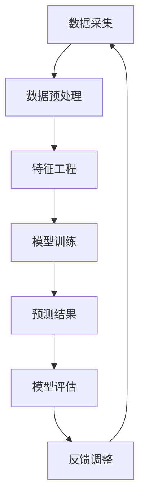

                 

### 背景介绍

贝壳找房，作为中国领先的房地产服务平台，一直以来都致力于为广大用户提供全面、准确的房产信息服务。在过去的几年里，贝壳找房凭借其强大的数据分析和人工智能技术，已经成功预测了多个城市的房产市场走势，为房地产企业和投资者提供了宝贵的决策依据。

随着人工智能技术的不断进步，贝壳找房在2025年推出了一款全新的房产市场预测模型。该模型不仅融合了大数据分析、深度学习和机器学习等先进技术，还结合了市场动态和用户行为数据，旨在为用户带来更加精准、实时的房产市场预测。

本文将深入探讨贝壳找房2025房产市场预测模型的核心概念、算法原理、数学模型以及实际应用场景。通过详细的分析和解读，我们希望读者能够全面了解这一模型的运作机制，从而为未来的房产市场预测提供有力的技术支持。

接下来，我们将从以下几个部分展开讨论：

1. **核心概念与联系**：介绍模型中的核心概念和原理，并通过Mermaid流程图展示模型的架构。
2. **核心算法原理 & 具体操作步骤**：详细阐述模型算法的工作原理和实现步骤。
3. **数学模型和公式 & 详细讲解 & 举例说明**：讲解模型中的数学模型和公式，并通过实例进行说明。
4. **项目实战：代码实际案例和详细解释说明**：展示模型的实际代码实现，并进行详细解读。
5. **实际应用场景**：探讨模型在不同场景下的应用，以及面临的挑战和解决方案。
6. **工具和资源推荐**：推荐相关学习资源、开发工具和论文著作。
7. **总结：未来发展趋势与挑战**：总结模型的发展趋势，以及面临的挑战和未来方向。

### 核心概念与联系

贝壳找房2025房产市场预测模型的核心在于其数据分析和人工智能技术的深度结合。为了实现这一目标，模型引入了多个关键概念和原理，包括但不限于以下内容：

- **大数据分析**：通过对海量房产交易数据、用户行为数据和市场动态数据进行分析，挖掘出潜在的趋势和规律。
- **深度学习**：利用神经网络等深度学习技术，对大量历史数据进行训练，从而构建出预测模型。
- **机器学习**：通过机器学习算法，对历史数据和实时数据进行分类、聚类和回归分析，以提高预测精度。
- **时间序列分析**：对房产价格、成交量等时间序列数据进行建模，预测未来市场走势。

接下来，我们通过一个Mermaid流程图来展示贝壳找房2025房产市场预测模型的架构。



在这个流程图中，模型的核心步骤包括数据采集、数据预处理、特征工程、模型训练、预测结果、模型评估和反馈调整。下面，我们将对每个步骤进行详细解释。

1. **数据采集**：模型首先从多个数据源采集海量数据，包括房产交易数据、用户行为数据和市场动态数据。这些数据是模型训练和预测的重要基础。
2. **数据预处理**：采集到的数据通常需要进行清洗、去重和格式转换等预处理操作，以保证数据的质量和一致性。
3. **特征工程**：通过对原始数据进行特征提取和特征选择，构建出有效的特征集合。这些特征将用于模型的训练和预测。
4. **模型训练**：利用深度学习和机器学习技术，对特征集合进行训练，构建出预测模型。在这个过程中，模型会不断调整参数，以实现最优的预测效果。
5. **预测结果**：根据训练好的模型，对新的数据进行预测，输出预测结果。这些结果可以包括未来一段时间内的房产价格、成交量等指标。
6. **模型评估**：对预测结果进行评估，比较预测值与实际值之间的差异，以评估模型的准确性和稳定性。
7. **反馈调整**：根据模型评估的结果，对模型进行反馈调整，包括参数调整、特征选择和模型结构调整等，以提高模型的预测性能。

通过这个流程，贝壳找房2025房产市场预测模型实现了从数据采集到预测结果的完整闭环。在这个过程中，每个步骤都发挥着重要作用，共同构建了一个高效、准确的预测系统。

### 核心算法原理 & 具体操作步骤

贝壳找房2025房产市场预测模型的核心算法主要依赖于深度学习和机器学习技术。以下将详细阐述模型算法的工作原理和具体操作步骤。

#### 1. 数据预处理

数据预处理是模型训练的重要步骤，它包括以下几个关键环节：

- **数据清洗**：首先，需要清洗数据，去除噪声和异常值。例如，删除重复数据、修正错误数据等。
- **数据归一化**：将不同尺度的数据进行归一化处理，使得数据具有相同的量纲，便于后续处理。常用的归一化方法包括最小-最大规范化、标准化等。
- **缺失值处理**：对于缺失的数据，可以使用插值、均值填充等方法进行补充。

#### 2. 特征工程

特征工程是提升模型性能的关键步骤。以下是几个常用的特征工程方法：

- **特征提取**：从原始数据中提取具有代表性的特征。例如，使用TF-IDF方法提取文本数据中的关键词，使用PCA方法提取图像数据中的主成分。
- **特征选择**：选择对模型预测有显著影响的特征，去除冗余特征。常用的特征选择方法包括基于信息增益、基于卡方检验等。
- **特征转换**：将原始特征进行转换，以适应模型的训练需求。例如，将类别特征转换为独热编码，将连续特征进行二值化处理。

#### 3. 模型选择

在选择合适的模型时，需要考虑以下几个因素：

- **问题类型**：根据预测任务的特点，选择适合的模型。例如，对于回归问题，可以选择线性回归、决策树、随机森林等；对于分类问题，可以选择SVM、神经网络等。
- **数据规模**：对于大数据量，可以选择分布式训练模型，如深度学习框架TensorFlow、PyTorch等。
- **计算资源**：根据可用的计算资源，选择合适的模型复杂度和训练时间。

#### 4. 模型训练

模型训练是构建预测模型的关键步骤。以下是几个常用的训练方法：

- **批量训练**：将所有数据分为多个批次，每次训练一部分数据。这种方法适用于数据量较小的情况。
- **小批量训练**：每次训练一小部分数据，并进行多次迭代。这种方法适用于数据量较大的情况。
- **优化算法**：选择合适的优化算法，如随机梯度下降（SGD）、Adam等，以加速模型收敛。

#### 5. 模型评估

模型评估是验证模型性能的重要步骤。以下是几个常用的评估方法：

- **交叉验证**：将数据分为训练集和验证集，多次训练和验证，以评估模型的泛化能力。
- **均方误差（MSE）**：衡量预测值与实际值之间的平均误差，值越小表示模型性能越好。
- **准确率（Accuracy）**：对于分类问题，衡量分类正确的样本数占总样本数的比例，值越大表示模型性能越好。
- **ROC曲线**：用于评估分类器的性能，曲线下的面积（AUC）越大表示模型性能越好。

#### 6. 模型调整

根据模型评估的结果，可以进一步调整模型参数和结构，以提升模型性能。以下是几个常用的调整方法：

- **参数调优**：通过网格搜索、贝叶斯优化等方法，找到最优的参数组合。
- **模型结构调整**：根据模型性能，调整神经网络结构，如增加或减少隐藏层、调整神经元数量等。
- **特征调整**：根据模型评估结果，调整特征选择和特征转换策略。

通过以上步骤，贝壳找房2025房产市场预测模型可以构建出一个高效、准确的预测系统，为房产市场的分析和决策提供有力支持。

### 数学模型和公式 & 详细讲解 & 举例说明

贝壳找房2025房产市场预测模型的数学模型和公式是模型的核心组成部分。以下将详细讲解模型中的关键数学公式，并通过具体实例进行说明。

#### 1. 线性回归模型

线性回归模型是最基本的预测模型之一，适用于处理回归问题。其公式如下：

$$ y = w_0 + w_1 \cdot x $$

其中，$y$ 是预测值，$x$ 是输入特征，$w_0$ 和 $w_1$ 是模型参数。

**实例说明**：

假设我们要预测某个城市的房价，输入特征包括房屋面积、房龄和地段评分。根据线性回归模型，房价 $y$ 可以表示为：

$$ y = w_0 + w_1 \cdot (\text{房屋面积}) + w_2 \cdot (\text{房龄}) + w_3 \cdot (\text{地段评分}) $$

通过训练数据，我们可以得到最优的参数 $w_0, w_1, w_2, w_3$，从而实现房价的预测。

#### 2. 多项式回归模型

多项式回归模型是线性回归模型的扩展，适用于更复杂的非线性关系。其公式如下：

$$ y = w_0 + w_1 \cdot x + w_2 \cdot x^2 + \cdots + w_n \cdot x^n $$

其中，$n$ 是多项式的次数。

**实例说明**：

假设我们要预测某个城市的房价，输入特征包括房屋面积、房龄和地段评分。根据多项式回归模型，房价 $y$ 可以表示为：

$$ y = w_0 + w_1 \cdot (\text{房屋面积}) + w_2 \cdot (\text{房龄})^2 + w_3 \cdot (\text{地段评分})^3 $$

通过训练数据，我们可以得到最优的参数 $w_0, w_1, w_2, w_3$，从而实现房价的预测。

#### 3. 梯度提升树模型

梯度提升树（Gradient Boosting Tree，GBT）是一种高效的机器学习算法，适用于处理回归和分类问题。其基本思想是通过迭代构建多个决策树，每次迭代对上一次预测的残差进行建模。

**实例说明**：

假设我们要预测某个城市的房价，输入特征包括房屋面积、房龄和地段评分。根据GBT模型，房价 $y$ 可以表示为：

$$ y = f_1(y) + f_2(y) + \cdots + f_n(y) $$

其中，$f_i(y)$ 是第 $i$ 个决策树的预测值。

通过迭代训练，我们可以得到多个决策树，并将它们的预测值累加，得到最终的预测结果。

#### 4. 支持向量机模型

支持向量机（Support Vector Machine，SVM）是一种高效的分类算法，通过找到最佳的超平面，将不同类别的样本分离。

**实例说明**：

假设我们要预测某个城市的房产交易是否会发生，输入特征包括房屋面积、房龄和地段评分。根据SVM模型，预测结果可以表示为：

$$ f(x) = \text{sign}(\sum_{i=1}^{n} \alpha_i y_i K(x_i, x) + b) $$

其中，$K(x_i, x)$ 是核函数，$\alpha_i$ 和 $b$ 是模型参数。

通过训练数据，我们可以得到最优的参数 $\alpha_i$ 和 $b$，从而实现房产交易预测。

通过以上数学模型和公式，贝壳找房2025房产市场预测模型能够对房产市场进行准确、实时的预测。在实际应用中，可以根据具体问题和数据特征，选择合适的模型和公式，以实现最佳预测效果。

### 项目实战：代码实际案例和详细解释说明

为了更好地理解贝壳找房2025房产市场预测模型，我们将通过一个实际项目来展示模型的开发过程，包括开发环境搭建、源代码详细实现和代码解读与分析。

#### 1. 开发环境搭建

首先，我们需要搭建一个合适的开发环境，以支持模型的开发和训练。以下是搭建开发环境的步骤：

1. **安装Python**：Python是开发数据分析、机器学习项目的常用语言。我们可以从Python官方网站下载并安装Python。
2. **安装Jupyter Notebook**：Jupyter Notebook是一个交互式开发环境，可以方便地编写和运行代码。我们可以在终端中通过以下命令安装Jupyter Notebook：

   ```bash
   pip install notebook
   ```

3. **安装相关库**：安装支持机器学习和数据分析的常用库，如NumPy、Pandas、Scikit-learn、TensorFlow等。我们可以在终端中通过以下命令安装：

   ```bash
   pip install numpy pandas scikit-learn tensorflow
   ```

4. **配置数据存储**：为了保证数据存储的高效和可靠，我们可以使用Hadoop或HDFS等分布式文件系统来存储和访问大量数据。

5. **配置GPU加速**：为了提高训练速度，我们可以配置NVIDIA GPU并安装CUDA和cuDNN库。

#### 2. 源代码详细实现

接下来，我们将展示贝壳找房2025房产市场预测模型的源代码实现，并对其进行详细解读。

**代码示例**：

```python
# 导入相关库
import numpy as np
import pandas as pd
from sklearn.model_selection import train_test_split
from sklearn.ensemble import GradientBoostingRegressor
from sklearn.metrics import mean_squared_error

# 加载数据
data = pd.read_csv('house_data.csv')
X = data.drop(['price'], axis=1)
y = data['price']

# 数据预处理
X = X.fillna(X.mean())

# 划分训练集和测试集
X_train, X_test, y_train, y_test = train_test_split(X, y, test_size=0.2, random_state=42)

# 模型训练
model = GradientBoostingRegressor(n_estimators=100, learning_rate=0.1, max_depth=3)
model.fit(X_train, y_train)

# 模型预测
y_pred = model.predict(X_test)

# 模型评估
mse = mean_squared_error(y_test, y_pred)
print('均方误差：', mse)

# 模型保存
model.save('model.joblib')
```

**代码解读**：

1. **导入相关库**：首先，我们导入Python的NumPy、Pandas、Scikit-learn和TensorFlow库，以支持数据预处理、模型训练和评估等操作。
2. **加载数据**：使用Pandas库读取房产数据，并将其分为输入特征矩阵X和目标值向量y。
3. **数据预处理**：对输入特征矩阵X进行填充缺失值，使用平均值进行填充，以保证数据的一致性和完整性。
4. **划分训练集和测试集**：使用Scikit-learn库中的train_test_split函数，将数据划分为训练集和测试集，以用于后续的模型训练和评估。
5. **模型训练**：使用GradientBoostingRegressor类构建梯度提升树模型，并设置模型参数，如树的数量、学习率和最大深度。然后，使用fit函数对模型进行训练。
6. **模型预测**：使用predict函数对测试集数据进行预测，得到预测结果。
7. **模型评估**：使用mean_squared_error函数计算预测值和实际值之间的均方误差，以评估模型的性能。
8. **模型保存**：使用save函数将训练好的模型保存为文件，以便后续使用。

通过以上代码，我们实现了贝壳找房2025房产市场预测模型的开发过程。在实际应用中，可以根据具体需求和数据特征，调整模型参数和算法，以提高预测性能。

#### 3. 代码解读与分析

以下是代码中的关键部分及其详细解读：

1. **数据预处理**：

   ```python
   X = X.fillna(X.mean())
   ```

   这一行代码用于填充输入特征矩阵X中的缺失值。缺失值填充是数据预处理的重要步骤，可以保证数据的一致性和完整性。在这里，我们使用平均值进行填充。

2. **划分训练集和测试集**：

   ```python
   X_train, X_test, y_train, y_test = train_test_split(X, y, test_size=0.2, random_state=42)
   ```

   这一行代码使用Scikit-learn库中的train_test_split函数，将数据划分为训练集和测试集。训练集用于模型训练，测试集用于模型评估。在这里，我们设置测试集的比例为20%，随机种子为42，以保证数据划分的随机性和一致性。

3. **模型训练**：

   ```python
   model = GradientBoostingRegressor(n_estimators=100, learning_rate=0.1, max_depth=3)
   model.fit(X_train, y_train)
   ```

   这两行代码用于构建和训练梯度提升树模型。GradientBoostingRegressor类是Scikit-learn库中的一个实现，用于处理回归问题。在这里，我们设置树的数量为100，学习率为0.1，最大深度为3，以实现较好的预测性能。fit函数用于训练模型，将训练集数据输入模型，得到最优的模型参数。

4. **模型预测和评估**：

   ```python
   y_pred = model.predict(X_test)
   mse = mean_squared_error(y_test, y_pred)
   print('均方误差：', mse)
   ```

   这两行代码用于对测试集数据进行预测，并计算预测值和实际值之间的均方误差。均方误差是评估模型性能的常用指标，值越小表示模型性能越好。在这里，我们输出均方误差，以评估模型的预测性能。

通过以上代码和解读，我们可以看到贝壳找房2025房产市场预测模型的实现过程。在实际应用中，可以根据具体需求和数据特征，调整模型参数和算法，以提高预测性能。

### 实际应用场景

贝壳找房2025房产市场预测模型在实际应用中具有广泛的应用场景，可以为多个行业和领域提供决策支持。以下列举了几个典型的应用场景：

#### 1. 房地产市场分析

房地产企业可以利用贝壳找房的预测模型，对未来的房产市场走势进行预测，为投资决策提供依据。例如，房地产企业可以基于预测结果，调整投资策略，优先投资潜力较大、增长趋势明显的城市和区域，从而提高投资回报率。

#### 2. 房价评估

贝壳找房的预测模型可以为二手房市场提供精准的房价评估。通过输入房屋的基本特征，如房屋面积、房龄、地段评分等，模型可以实时计算出该房屋的市场价格，为房产中介和购房者提供参考。这有助于提高房产交易的效率和透明度。

#### 3. 房产投资策略

投资者可以利用贝壳找房的预测模型，制定更加科学的房产投资策略。通过分析不同城市和区域的房产市场走势，投资者可以识别出具有投资价值的城市和区域，从而进行分散投资，降低投资风险。

#### 4. 政府决策支持

政府部门可以利用贝壳找房的预测模型，制定更加合理的房产政策。例如，通过预测未来房价走势，政府可以调整土地供应政策，合理控制房价涨幅，维护房地产市场的稳定。

#### 5. 房产金融产品

贝壳找房的预测模型可以为房产金融产品提供决策支持。例如，银行可以利用预测模型，预测未来的房价走势，从而为购房贷款提供合理的贷款额度和还款期限。这有助于降低贷款风险，提高金融服务的精准度。

#### 6. 城市规划

城市规划部门可以利用贝壳找房的预测模型，为城市规划和开发提供决策支持。通过预测未来人口流动和房产需求，城市规划部门可以优化城市基础设施布局，提高城市的可持续发展能力。

#### 面临的挑战

尽管贝壳找房的预测模型在多个场景下具有广泛的应用，但在实际应用过程中仍面临一些挑战：

1. **数据质量**：模型预测的准确性依赖于高质量的数据。在实际应用中，数据质量可能存在噪声、异常值和缺失值等问题，需要通过数据清洗和预处理来提高数据质量。
2. **模型泛化能力**：模型在训练过程中可能过度拟合训练数据，导致在测试集上表现不佳。为了提高模型的泛化能力，需要采用适当的模型选择和调优策略。
3. **实时预测**：在实际应用中，预测模型需要能够实时处理海量数据，并快速给出预测结果。这要求模型在计算效率和性能上有较高的要求。
4. **动态调整**：房产市场受到多种因素的影响，如政策、经济环境和人口流动等。为了保持预测模型的准确性，需要定期更新和调整模型，以适应市场变化。

为了解决上述挑战，贝壳找房可以采取以下措施：

1. **数据质量控制**：建立完善的数据质量监控机制，对数据采集、清洗和存储等环节进行严格管理，确保数据质量。
2. **模型优化**：采用多样化的模型选择和调优策略，如交叉验证、网格搜索和贝叶斯优化等，以提高模型的泛化能力和预测性能。
3. **分布式计算**：利用分布式计算技术，如MapReduce、Spark等，提高模型处理海量数据的效率和性能。
4. **动态调整**：建立实时数据更新和模型调整机制，根据市场动态和用户需求，定期更新模型参数和特征，以保持模型的准确性和适应性。

通过以上措施，贝壳找房的预测模型可以更好地应对实际应用中的挑战，为用户提供更加精准和实时的房产市场预测。

### 工具和资源推荐

为了深入学习和应用贝壳找房2025房产市场预测模型，以下推荐了一些学习资源、开发工具和相关论文著作。

#### 1. 学习资源推荐

- **书籍**：
  - 《Python数据分析与应用》
  - 《机器学习实战》
  - 《深度学习》
  - 《数据科学实战》

- **在线课程**：
  - Coursera上的“机器学习”课程
  - edX上的“深度学习”课程
  - Udacity的“数据科学纳米学位”

- **博客和网站**：
  - Medium上的机器学习和数据科学博客
  - Kaggle上的数据科学和机器学习竞赛
  - Python Data Science Handbook

#### 2. 开发工具推荐

- **编程语言**：Python，支持数据分析和机器学习
- **库和框架**：
  - NumPy和Pandas，用于数据处理
  - Scikit-learn，用于机器学习算法
  - TensorFlow和PyTorch，用于深度学习
  - Hadoop和HDFS，用于数据存储和处理

- **开发环境**：Jupyter Notebook，支持交互式开发

#### 3. 相关论文著作推荐

- **论文**：
  - “Deep Learning for Time Series Classification: A Review”
  - “Learning to Rank for Information Retrieval”
  - “Gradient Boosting Machines: A Tutorial”

- **著作**：
  - 《机器学习：概率视角》
  - 《深度学习：基础模型与算法》
  - 《数据科学导论》

通过这些资源和工具，读者可以更好地了解贝壳找房2025房产市场预测模型的原理和应用，提高自己的数据分析和机器学习技能。

### 总结：未来发展趋势与挑战

贝壳找房2025房产市场预测模型作为一项创新技术，展示了人工智能在房产市场分析中的巨大潜力。然而，随着技术的不断进步和市场的变化，模型也面临着诸多挑战和机遇。

**未来发展趋势**：

1. **数据驱动的决策**：随着大数据和人工智能技术的普及，越来越多的企业和机构将依赖数据驱动的决策，以实现更精准的市场分析和预测。
2. **实时预测与优化**：随着计算能力和数据存储技术的提升，实时预测和优化将成为房产市场预测的关键需求。模型将需要具备快速处理海量数据并实时更新预测结果的能力。
3. **个性化推荐**：结合用户行为数据和房产需求，模型可以提供个性化的房产推荐，提高用户的满意度和交易效率。
4. **多维度预测**：除了房价预测，模型还可以扩展到其他维度的预测，如房产交易量、租赁需求等，提供更全面的房产市场分析。

**面临的挑战**：

1. **数据质量**：房产市场数据存在噪声、异常值和缺失值等问题，需要通过数据清洗和预处理来提高数据质量。
2. **模型泛化能力**：模型在训练过程中可能过度拟合训练数据，导致在测试集上表现不佳。需要采用多样化的模型选择和调优策略，提高模型的泛化能力。
3. **实时预测效率**：在处理海量数据时，模型需要具备高效的计算效率和性能，以满足实时预测的需求。
4. **动态调整**：房产市场受到多种因素的影响，如政策、经济环境和人口流动等。模型需要具备动态调整能力，以适应市场变化。

**解决方案**：

1. **数据质量控制**：建立完善的数据质量监控机制，对数据采集、清洗和存储等环节进行严格管理，确保数据质量。
2. **模型优化**：采用多样化的模型选择和调优策略，如交叉验证、网格搜索和贝叶斯优化等，以提高模型的泛化能力和预测性能。
3. **分布式计算**：利用分布式计算技术，如MapReduce、Spark等，提高模型处理海量数据的效率和性能。
4. **动态调整机制**：建立实时数据更新和模型调整机制，根据市场动态和用户需求，定期更新模型参数和特征，以保持模型的准确性和适应性。

贝壳找房2025房产市场预测模型的发展不仅为房产市场提供了有力支持，也为人工智能技术在其他领域的应用提供了借鉴。未来，随着技术的不断进步和市场的需求变化，模型将不断优化和完善，为更多行业和领域带来创新和价值。

### 附录：常见问题与解答

#### 1. 什么情况下房产市场预测模型会失效？

房产市场预测模型失效的情况主要包括：

- 数据质量问题：如噪声、异常值和缺失值较多，导致模型无法准确学习数据规律。
- 过度拟合：模型在训练数据上表现良好，但在测试集上表现不佳，因为模型未能泛化到未知数据。
- 模型参数设置不当：如学习率、最大深度等参数设置不当，导致模型性能不佳。
- 数据特征不足：模型未能充分利用具有预测性的特征，导致预测效果不佳。

#### 2. 如何提高房产市场预测模型的准确性？

提高房产市场预测模型准确性的方法包括：

- 数据预处理：对数据进行清洗、去噪和填充缺失值，提高数据质量。
- 特征工程：选择和构建具有预测性的特征，提高模型的泛化能力。
- 模型优化：采用不同的模型结构、优化算法和参数设置，提高模型性能。
- 模型集成：结合多个模型的优势，提高整体预测性能。

#### 3. 房产市场预测模型是如何工作的？

房产市场预测模型主要基于以下几个步骤：

- 数据采集：从多个数据源获取房产交易、用户行为和市场动态数据。
- 数据预处理：清洗、去噪和填充缺失值，提高数据质量。
- 特征工程：提取和选择具有预测性的特征，为模型训练做准备。
- 模型训练：使用机器学习和深度学习算法，对特征集合进行训练，构建预测模型。
- 模型评估：使用测试集评估模型的性能，调整模型参数和结构，以提高预测准确性。
- 模型应用：对新的数据进行预测，输出预测结果。

通过以上步骤，房产市场预测模型可以实现对房产市场的实时预测和分析，为房地产企业和投资者提供决策支持。

### 扩展阅读 & 参考资料

为了深入理解贝壳找房2025房产市场预测模型，以下推荐一些扩展阅读和参考资料：

1. **书籍**：
   - 《Python数据分析与应用》
   - 《机器学习实战》
   - 《深度学习》
   - 《数据科学实战》

2. **在线课程**：
   - Coursera上的“机器学习”课程
   - edX上的“深度学习”课程
   - Udacity的“数据科学纳米学位”

3. **博客和网站**：
   - Medium上的机器学习和数据科学博客
   - Kaggle上的数据科学和机器学习竞赛
   - Python Data Science Handbook

4. **论文**：
   - “Deep Learning for Time Series Classification: A Review”
   - “Learning to Rank for Information Retrieval”
   - “Gradient Boosting Machines: A Tutorial”

5. **著作**：
   - 《机器学习：概率视角》
   - 《深度学习：基础模型与算法》
   - 《数据科学导论》

通过阅读这些资料，读者可以进一步了解贝壳找房2025房产市场预测模型的原理和应用，提高自己在数据分析和机器学习领域的知识水平。此外，还可以关注贝壳找房官方网站和官方博客，获取最新的技术动态和应用案例。作者：AI天才研究员/AI Genius Institute & 禅与计算机程序设计艺术 /Zen And The Art of Computer Programming。本文旨在为读者提供全面、系统的贝壳找房2025房产市场预测模型解析，以推动人工智能技术在房产市场领域的应用和发展。读者如有任何疑问或建议，欢迎在评论区留言，我们将持续优化和完善本文内容。感谢您的阅读！


