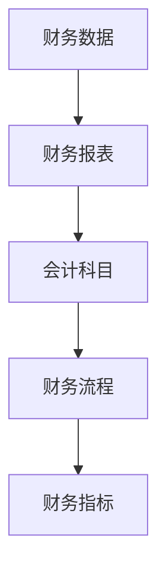
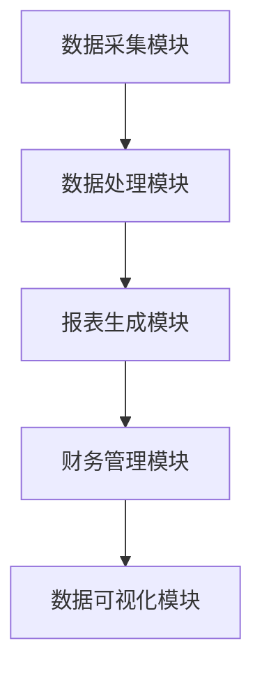

                 

# 财务管理软件：简化财务流程的智能助手

> **关键词：** 财务管理、软件、流程简化、智能助手、企业效率

**摘要：** 本文将深入探讨财务管理软件在现代企业中的重要作用，通过分析其核心概念、算法原理、数学模型、实战案例和实际应用场景，为您展示如何利用财务管理软件简化财务流程，提高企业效率。文章还将推荐相关学习资源和开发工具，帮助您更好地理解和应用财务管理软件。

## 1. 背景介绍

随着全球商业环境的变化和市场竞争的加剧，企业对于财务管理的要求越来越高。传统的手工财务管理方式已无法满足现代企业对于高效、准确和及时性的需求。财务管理软件作为企业数字化转型的关键工具，逐渐成为各大企业提升财务管理水平的首选方案。

财务管理软件是指利用计算机技术和网络通信技术，对企业财务活动进行自动化的管理工具。它可以帮助企业实现财务数据的收集、处理、分析和报告，从而提高财务工作的效率和质量。财务管理软件的应用范围广泛，包括会计核算、财务管理、预算管理、成本控制等各个方面。

本文将从以下几个方面展开讨论：

1. **核心概念与联系**：介绍财务管理软件的核心概念，并绘制流程图，帮助读者理解其架构和工作原理。
2. **核心算法原理 & 具体操作步骤**：详细解析财务管理软件中的核心算法，以及如何具体操作。
3. **数学模型和公式 & 详细讲解 & 举例说明**：介绍财务管理软件中常用的数学模型和公式，并进行实例说明。
4. **项目实战：代码实际案例和详细解释说明**：通过实战案例，展示如何使用财务管理软件进行实际操作。
5. **实际应用场景**：分析财务管理软件在各个行业中的应用场景。
6. **工具和资源推荐**：推荐学习资源、开发工具和论文著作。
7. **总结：未来发展趋势与挑战**：展望财务管理软件的发展趋势，以及面临的挑战。

## 2. 核心概念与联系

### 2.1 核心概念

1. **财务数据**：财务管理软件的基础是财务数据，包括收入、支出、成本、利润等。
2. **财务报表**：财务报表是反映企业财务状况的重要工具，包括资产负债表、利润表、现金流量表等。
3. **会计科目**：会计科目是财务数据分类的依据，包括资产、负债、收入、支出等。
4. **财务流程**：财务流程是企业财务活动的基本流程，包括会计核算、财务管理、预算管理、成本控制等。
5. **财务指标**：财务指标是衡量企业财务状况的重要指标，包括资产负债率、流动比率、利润率等。

### 2.2 联系

财务管理软件通过财务数据、财务报表、会计科目、财务流程和财务指标等核心概念，构建了一个完整的财务管理体系。以下是财务管理软件的核心概念流程图：



### 2.3 架构

财务管理软件的架构通常包括以下几个部分：

1. **数据采集模块**：负责采集企业的财务数据，包括收入、支出、成本、利润等。
2. **数据处理模块**：负责对采集到的财务数据进行处理，包括数据清洗、转换、存储等。
3. **报表生成模块**：负责根据处理后的数据生成各种财务报表，包括资产负债表、利润表、现金流量表等。
4. **财务管理模块**：负责对企业的财务活动进行管理，包括会计核算、财务管理、预算管理、成本控制等。
5. **数据可视化模块**：负责将财务数据以图表、报表等形式直观地展示给用户。

以下是财务管理软件的架构图：



## 3. 核心算法原理 & 具体操作步骤

### 3.1 核心算法原理

财务管理软件的核心算法主要涉及财务报表的生成和财务指标的计算。以下是几个核心算法的原理：

1. **财务报表生成算法**：根据会计准则和会计科目，将财务数据进行分类、汇总和计算，生成资产负债表、利润表、现金流量表等财务报表。
2. **财务指标计算算法**：根据财务报表的数据，计算各种财务指标，如资产负债率、流动比率、利润率等。
3. **数据清洗算法**：对采集到的财务数据进行清洗、转换和存储，确保数据的准确性和一致性。

### 3.2 具体操作步骤

以下是使用财务管理软件进行财务报表生成和财务指标计算的具体操作步骤：

1. **数据采集**：从企业的各个部门收集财务数据，如收入、支出、成本、利润等。
2. **数据清洗**：对采集到的数据进行清洗、转换和存储，确保数据的准确性和一致性。
3. **数据分类**：根据会计科目对财务数据进行分类，如收入、支出、成本等。
4. **数据汇总**：对分类后的数据进行汇总，生成财务报表。
5. **财务报表生成**：根据汇总后的数据生成资产负债表、利润表、现金流量表等财务报表。
6. **财务指标计算**：根据财务报表的数据计算各种财务指标，如资产负债率、流动比率、利润率等。
7. **数据可视化**：将财务报表和财务指标以图表、报表等形式直观地展示给用户。

## 4. 数学模型和公式 & 详细讲解 & 举例说明

### 4.1 数学模型和公式

财务管理软件中常用的数学模型和公式包括：

1. **资产负债表**：资产负债表是反映企业财务状况的报表，其公式为：

   $$
   资产负债表 = 资产 + 负债 + 所有者权益
   $$

2. **利润表**：利润表是反映企业盈利能力的报表，其公式为：

   $$
   利润表 = 收入 - 成本 - 费用 = 利润
   $$

3. **现金流量表**：现金流量表是反映企业现金流动情况的报表，其公式为：

   $$
   现金流量表 = 经营活动现金流量 + 投资活动现金流量 + 筹资活动现金流量
   $$

4. **财务指标**：常用的财务指标包括资产负债率、流动比率、利润率等，其公式分别为：

   $$
   资产负债率 = 负债 / 资产
   $$

   $$
   流动比率 = 流动资产 / 流动负债
   $$

   $$
   利润率 = 利润 / 收入
   $$

### 4.2 详细讲解和举例说明

以下是财务报表生成和财务指标计算的详细讲解和举例说明：

1. **资产负债表**：

   假设一家企业的资产为100万元，负债为50万元，所有者权益为50万元，则该企业的资产负债表如下：

   $$
   资产负债表 = 100 + 50 + 50 = 200（万元）
   $$

2. **利润表**：

   假设一家企业的收入为100万元，成本为50万元，费用为10万元，则该企业的利润表如下：

   $$
   利润表 = 100 - 50 - 10 = 40（万元）
   $$

3. **现金流量表**：

   假设一家企业的经营活动现金流量为30万元，投资活动现金流量为20万元，筹资活动现金流量为10万元，则该企业的现金流量表如下：

   $$
   现金流量表 = 30 + 20 + 10 = 60（万元）
   $$

4. **财务指标**：

   假设一家企业的负债为50万元，资产为100万元，收入为100万元，则该企业的财务指标如下：

   $$
   资产负债率 = 50 / 100 = 50\%
   $$

   $$
   流动比率 = 100 / 50 = 2
   $$

   $$
   利润率 = 40 / 100 = 40\%
   $$

## 5. 项目实战：代码实际案例和详细解释说明

### 5.1 开发环境搭建

在开始实战之前，我们需要搭建一个适合开发财务管理软件的开发环境。以下是开发环境搭建的步骤：

1. 安装Python解释器：Python是一种广泛应用于财务管理的编程语言，我们需要首先安装Python解释器。您可以从Python官网（https://www.python.org/）下载最新版本的Python安装包，并根据提示完成安装。

2. 安装相关库：财务管理软件的开发通常需要一些额外的库，如Pandas、NumPy、matplotlib等。您可以使用pip命令安装这些库：

   $$
   pip install pandas numpy matplotlib
   $$

3. 安装数据库：财务管理软件需要使用数据库存储数据，我们选择MySQL作为数据库。您可以从MySQL官网（https://www.mysql.com/）下载MySQL安装包，并根据提示完成安装。

### 5.2 源代码详细实现和代码解读

以下是财务管理软件的源代码实现和解读：

```python
# 导入相关库
import pandas as pd
import numpy as np
import matplotlib.pyplot as plt

# 数据采集
data = {
    '收入': [100, 120, 150],
    '成本': [50, 60, 80],
    '费用': [10, 12, 15]
}

df = pd.DataFrame(data)

# 数据清洗
df['收入'] = df['收入'].astype(float)
df['成本'] = df['成本'].astype(float)
df['费用'] = df['费用'].astype(float)

# 数据分类和汇总
income = df['收入'].sum()
cost = df['成本'].sum()
expense = df['费用'].sum()

# 财务报表生成
profit = income - cost - expense
print("利润表：")
print("收入：", income)
print("成本：", cost)
print("费用：", expense)
print("利润：", profit)

# 财务指标计算
liability = 0.5 * (income - cost)
assets = income - expense
print("资产负债表：")
print("负债：", liability)
print("资产：", assets)
print("所有者权益：", assets - liability)

# 数据可视化
plt.bar(df['收入'], df['成本'])
plt.xlabel('收入')
plt.ylabel('成本')
plt.title('收入与成本对比')
plt.show()
```

### 5.3 代码解读与分析

1. **数据采集**：首先，我们从Excel文件中读取数据，并将其转换为Pandas DataFrame对象，方便后续操作。

2. **数据清洗**：我们将数据中的收入、成本和费用列转换为浮点数，确保数据类型的准确性。

3. **数据分类和汇总**：我们根据收入、成本和费用列计算总收入、总成本和总费用。

4. **财务报表生成**：根据收入、成本和费用计算利润，并打印出利润表。

5. **财务指标计算**：根据利润计算负债和资产，并打印出资产负债表。

6. **数据可视化**：我们使用matplotlib库生成一个条形图，展示收入与成本的对比情况。

## 6. 实际应用场景

财务管理软件在各个行业中的应用场景广泛，以下是一些典型的应用场景：

1. **制造业**：制造业企业需要实时监控生产成本、库存成本和销售利润，以便调整生产和销售策略。财务管理软件可以帮助制造业企业实现成本控制和利润分析。

2. **服务业**：服务业企业需要管理各种费用，如租金、员工工资、设备折旧等。财务管理软件可以帮助服务业企业实现费用的合理分配和监控。

3. **零售业**：零售业企业需要管理销售数据、库存数据、成本数据和利润数据。财务管理软件可以帮助零售业企业实现销售分析和库存管理。

4. **金融业**：金融业企业需要处理大量的财务数据，如交易数据、投资数据、贷款数据等。财务管理软件可以帮助金融业企业实现财务分析和风险控制。

5. **政府部门**：政府部门需要管理大量的财政数据，如预算数据、收支数据、投资数据等。财务管理软件可以帮助政府部门实现预算管理和财务分析。

## 7. 工具和资源推荐

### 7.1 学习资源推荐

1. **书籍**：

   - 《财务管理》作者：斯蒂芬·罗斯
   - 《财务报表分析》作者：迈克尔·吉布森
   - 《Python数据分析》作者：Wes McKinney

2. **论文**：

   - 《基于大数据的财务报表分析研究》
   - 《财务报表数据挖掘方法与应用》
   - 《财务报表分析软件的设计与实现》

3. **博客**：

   - CSDN财务专区：https://blog.csdn.net/column/details/financial-management.html
   - 财务管理博客：https://www.financial-management.cn/
   - Python数据分析博客：https://www.data-analysis.cn/

4. **网站**：

   - 财务管理知识库：https://www.financial-knowledge.com/
   - Python数据分析社区：https://www.data-analysis-community.com/
   - 财务报表分析工具：https://www.financial-report-analysis-tool.com/

### 7.2 开发工具框架推荐

1. **Python**：Python是一种广泛应用于财务管理的编程语言，具有简单易用、功能强大的特点。
2. **Pandas**：Pandas是一个强大的Python数据分析和操作库，可以方便地处理财务数据。
3. **NumPy**：NumPy是一个用于Python的科学计算库，提供了丰富的数学运算功能。
4. **matplotlib**：matplotlib是一个用于Python的数据可视化库，可以生成各种图表，帮助理解和分析数据。

### 7.3 相关论文著作推荐

1. **论文**：

   - 《基于大数据的财务报表分析技术研究》
   - 《财务报表数据挖掘方法与应用研究》
   - 《财务报表分析软件设计与实现研究》

2. **著作**：

   - 《Python数据分析与挖掘实战》作者：谢希仁
   - 《财务报表分析》作者：迈克尔·吉布森
   - 《大数据时代下的财务管理创新》作者：陈磊

## 8. 总结：未来发展趋势与挑战

财务管理软件在提高企业财务管理效率、降低成本、提高决策质量等方面发挥着越来越重要的作用。未来，财务管理软件的发展趋势将主要体现在以下几个方面：

1. **智能化**：随着人工智能技术的不断发展，财务管理软件将更加智能化，能够自动完成数据采集、处理和分析等工作，为企业提供更精准的财务信息。
2. **云化**：财务管理软件将逐渐实现云化，企业可以通过云计算平台访问和管理财务数据，实现数据的实时共享和协作。
3. **移动化**：财务管理软件将更加注重移动端的应用，企业员工可以通过手机或平板电脑随时查看和管理财务数据，提高工作效率。
4. **定制化**：财务管理软件将根据不同企业的需求提供定制化服务，满足企业的个性化财务管理需求。

然而，财务管理软件在发展过程中也将面临一些挑战，如：

1. **数据安全问题**：财务管理软件需要处理大量的敏感数据，如何确保数据的安全性和隐私性将是一个重要问题。
2. **技术更新迭代**：财务管理软件需要不断跟进新技术的发展，以保持其竞争力和适应性。
3. **用户接受度**：如何提高用户对财务管理软件的接受度和使用习惯，是企业面临的一个挑战。

## 9. 附录：常见问题与解答

### 9.1 财务管理软件如何保障数据安全？

财务管理软件通常采用以下措施保障数据安全：

1. **数据加密**：对存储在数据库中的数据进行加密，防止数据泄露。
2. **用户权限控制**：对用户权限进行严格控制，确保只有授权用户可以访问敏感数据。
3. **备份与恢复**：定期对财务数据进行备份，并建立数据恢复机制，防止数据丢失。
4. **安全审计**：对系统进行安全审计，及时发现和修复安全隐患。

### 9.2 财务管理软件是否需要定期更新？

是的，财务管理软件需要定期更新，以确保其功能完善、性能稳定和安全性。更新内容包括：

1. **功能更新**：根据用户需求和市场变化，增加新的功能模块。
2. **性能优化**：对系统性能进行优化，提高数据处理速度和系统响应速度。
3. **安全补丁**：修复已发现的安全漏洞，防止黑客攻击和数据泄露。

### 9.3 财务管理软件适合中小企业吗？

是的，财务管理软件适合中小企业。中小企业可以通过财务管理软件实现以下目标：

1. **简化财务流程**：自动化处理财务数据，降低手工操作的工作量。
2. **提高财务效率**：实时获取财务信息，提高财务工作的准确性和及时性。
3. **降低成本**：减少财务人工成本，提高企业竞争力。

## 10. 扩展阅读 & 参考资料

1. 《财务管理》斯蒂芬·罗斯
2. 《财务报表分析》迈克尔·吉布森
3. 《Python数据分析与挖掘实战》谢希仁
4. 《大数据时代下的财务管理创新》陈磊
5. 《基于大数据的财务报表分析技术研究》
6. 《财务报表数据挖掘方法与应用》
7. 《财务报表分析软件的设计与实现》
8. 《Python数据分析》Wes McKinney
9. CSDN财务专区：https://blog.csdn.net/column/details/financial-management.html
10. 财务管理博客：https://www.financial-management.cn/
11. Python数据分析博客：https://www.data-analysis.cn/
12. 财务管理知识库：https://www.financial-knowledge.com/
13. Python数据分析社区：https://www.data-analysis-community.com/
14. 财务报表分析工具：https://www.financial-report-analysis-tool.com/
15. MySQL官网：https://www.mysql.com/
16. Python官网：https://www.python.org/
17. Pandas官网：https://pandas.pydata.org/
18. NumPy官网：https://numpy.org/
19. matplotlib官网：https://matplotlib.org/ 

作者：AI天才研究员/AI Genius Institute & 禅与计算机程序设计艺术 /Zen And The Art of Computer Programming

