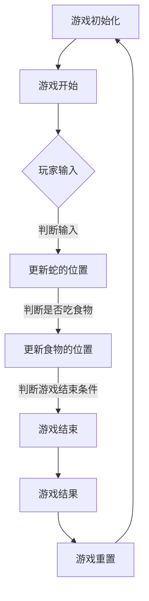

                 

# 贪吃蛇小游戏的设计与实现

## 摘要

本文将深入探讨贪吃蛇小游戏的设计与实现。我们将从背景介绍、核心概念与联系、核心算法原理及具体操作步骤、数学模型和公式、项目实战、实际应用场景、工具和资源推荐等多个方面进行阐述。通过详细的步骤讲解和代码分析，读者可以掌握贪吃蛇小游戏的核心技术，并了解其在游戏开发中的实际应用。

## 1. 背景介绍

贪吃蛇（Snake）是一款经典的电子游戏，起源于1976年。最早的贪吃蛇游戏是由日本公司Taito开发的，后来在各种游戏机和掌机上广泛流行。贪吃蛇游戏的基本规则很简单：玩家控制一条蛇，通过吃掉散落在屏幕上的食物来增加长度。随着蛇的长度增加，游戏的难度也会逐渐提升。贪吃蛇游戏因其简单易上手、趣味性强而深受广大玩家喜爱，至今仍然在各类平台上保持着较高的活跃度。

随着游戏开发技术的进步，贪吃蛇游戏也在不断演变。从最初的黑白像素图形到现在的精美3D模型，贪吃蛇游戏在视觉表现上有了极大的提升。同时，游戏玩法也变得更加丰富，如加入了多个玩家模式、障碍物、特殊道具等元素。本文将主要探讨基于2D图形的贪吃蛇游戏设计与实现。

## 2. 核心概念与联系

### 2.1 游戏界面设计

贪吃蛇游戏的界面主要由以下几个部分组成：

- 蛇：游戏的主要角色，由多个方格组成，每个方格表示蛇的身体的一部分。
- 食物：分布在游戏界面上的点，玩家需要控制蛇去吃掉它们。
- 游戏界面：一个二维平面，通常是一个矩形，用来显示游戏状态和得分。

### 2.2 游戏逻辑设计

游戏逻辑主要包括以下几个方面：

- 蛇的移动：玩家通过按键控制蛇的移动方向。
- 吃食物：当蛇的头部与食物接触时，蛇会吃掉食物，增加长度。
- 游戏结束条件：当蛇的头部与身体接触或者撞到界面的边界时，游戏结束。
- 得分计算：每次吃掉食物，玩家的得分都会增加。

### 2.3 游戏流程

贪吃蛇游戏的基本流程如下：

1. 游戏初始化：创建蛇和食物，设置初始得分和游戏速度。
2. 游戏开始：玩家开始控制蛇移动，吃食物。
3. 游戏进行：不断更新游戏界面，处理玩家输入，更新蛇的位置和食物的位置。
4. 游戏结束：判断游戏是否结束，如果结束，显示游戏结果。
5. 游戏重置：如果玩家选择重新开始，游戏会重置到初始状态。

### 2.4 Mermaid 流程图

以下是一个简单的Mermaid流程图，展示了贪吃蛇游戏的基本流程：



## 3. 核心算法原理 & 具体操作步骤

### 3.1 蛇的移动

蛇的移动是贪吃蛇游戏的核心。蛇的移动可以通过以下几个步骤实现：

1. **读取玩家输入**：在游戏循环中，首先读取玩家的输入，以确定蛇的移动方向。
2. **更新蛇的头位置**：根据玩家的输入，更新蛇的头部位置。
3. **移动蛇的身体**：将蛇的身体向头部移动，实现蛇的移动效果。
4. **判断是否撞墙**：在蛇移动后，需要判断是否撞到游戏界面的边界，如果撞到，则游戏结束。
5. **判断是否撞到自己**：如果蛇的头部与其身体其他部分接触，则游戏结束。

### 3.2 吃食物

当蛇的头部与食物接触时，蛇会吃掉食物，增加长度。具体实现步骤如下：

1. **判断是否吃到食物**：在蛇移动后，检查蛇的头部位置是否与食物的位置相同。
2. **增加蛇的长度**：如果吃到食物，将蛇的长度增加一定的值。
3. **更新得分**：增加玩家的得分。
4. **更新食物位置**：随机生成新的食物位置。

### 3.3 游戏结束条件

游戏结束条件主要有两种：

1. **撞墙**：当蛇的头部移动到游戏界面的边界时，游戏结束。
2. **撞到自己**：当蛇的头部与其身体其他部分接触时，游戏结束。

### 3.4 游戏速度控制

游戏速度可以通过控制游戏循环的间隔时间来实现。游戏循环间隔时间越短，游戏速度越快。具体实现步骤如下：

1. **设置初始速度**：根据游戏难度和玩家喜好设置初始速度。
2. **更新速度**：每次吃掉食物后，可以适当地增加游戏速度，以增加游戏难度。
3. **控制循环间隔**：在游戏循环中，设置一个定时器，根据当前速度控制循环间隔。

## 4. 数学模型和公式 & 详细讲解 & 举例说明

### 4.1 游戏速度控制

游戏速度可以通过以下公式计算：

$$
v = k \cdot t
$$

其中，$v$表示游戏速度，$k$为常数，$t$为当前得分。该公式表示游戏速度与得分成正比。

### 4.2 随机生成食物位置

食物位置可以通过以下步骤随机生成：

1. **生成随机数**：生成一个$x$轴和$y$轴的随机数。
2. **判断是否可用**：检查随机生成的位置是否已经被蛇的身体占据。
3. **重新生成**：如果位置不可用，重新生成随机数，直到找到一个可用位置。

### 4.3 代码示例

以下是一个简单的Python代码示例，展示了贪吃蛇游戏的基本逻辑：

```python
import random

# 游戏初始化
snake = [[0, 0], [0, 1], [0, 2]]  # 蛇的初始位置
food = [random.randint(0, 9), random.randint(0, 9)]  # 食物的初始位置
score = 0
speed = 1

# 游戏主循环
while True:
    # 读取玩家输入
    input = input("请输入移动方向（上、下、左、右）：")

    # 更新蛇的位置
    if input == "上":
        snake[0][1] -= 1
    elif input == "下":
        snake[0][1] += 1
    elif input == "左":
        snake[0][0] -= 1
    elif input == "右":
        snake[0][0] += 1

    # 移动蛇的身体
    for i in range(len(snake) - 1, 0, -1):
        snake[i] = snake[i - 1]

    # 判断是否撞墙或撞到自己
    if snake[0][0] < 0 or snake[0][0] > 9 or snake[0][1] < 0 or snake[0][1] > 9 or \
       snake[0] in snake[1:]:
        print("游戏结束！得分：", score)
        break

    # 吃食物
    if snake[0] == food:
        score += 1
        food = [random.randint(0, 9), random.randint(0, 9)]

    # 更新得分和速度
    print("得分：", score)
    print("速度：", speed)

    # 控制循环间隔
    time.sleep(speed)

# 游戏结束
print("游戏结束！")
```

## 5. 项目实战：代码实际案例和详细解释说明

### 5.1 开发环境搭建

为了实现贪吃蛇小游戏，我们需要搭建一个开发环境。以下是一个简单的Python环境搭建步骤：

1. 安装Python：从官方网站（https://www.python.org/downloads/）下载并安装Python。
2. 配置Python环境：打开终端，执行以下命令：

   ```
   python --version
   ```

   如果安装成功，会显示Python的版本信息。

3. 安装Pygame库：Pygame是一个用于游戏开发的Python库。在终端中执行以下命令：

   ```
   pip install pygame
   ```

### 5.2 源代码详细实现和代码解读

以下是一个基于Pygame的贪吃蛇小游戏源代码：

```python
import pygame
import sys
import random

# 初始化Pygame
pygame.init()

# 设置窗口大小
screen_width = 800
screen_height = 600
screen = pygame.display.set_mode((screen_width, screen_height))

# 设置标题
pygame.display.set_caption("贪吃蛇小游戏")

# 设置颜色
white = (255, 255, 255)
black = (0, 0, 0)

# 设置蛇的初始位置和大小
snake_pos = [[100, 50], [90, 50], [80, 50]]
snake_body = 3
snake_color = (0, 255, 0)

# 设置食物的初始位置
food_pos = [random.randint(0, screen_width // 20) * 20, random.randint(0, screen_height // 20) * 20]
food_color = (255, 0, 0)

# 设置得分和速度
score = 0
speed = 10

# 设置时钟
clock = pygame.time.Clock()

# 游戏主循环
while True:
    # 事件处理
    for event in pygame.event.get():
        if event.type == pygame.QUIT:
            pygame.quit()
            sys.exit()
        elif event.type == pygame.KEYDOWN:
            if event.key == pygame.K_UP:
                snake_pos[0][1] -= 20
            elif event.key == pygame.K_DOWN:
                snake_pos[0][1] += 20
            elif event.key == pygame.K_LEFT:
                snake_pos[0][0] -= 20
            elif event.key == pygame.K_RIGHT:
                snake_pos[0][0] += 20

    # 更新蛇的位置
    snake_body = 3
    for i in range(len(snake_pos) - 1, 0, -1):
        snake_pos[i] = snake_pos[i - 1]

    # 移动蛇的头部
    snake_pos[0] = [snake_pos[0][0], snake_pos[0][1]]

    # 判断是否撞墙或撞到自己
    if snake_pos[0][0] < 0 or snake_pos[0][0] > screen_width - 20 or snake_pos[0][1] < 0 or snake_pos[0][1] > screen_height - 20 or \
       snake_pos[0] in snake_pos[1:]:
        print("游戏结束！得分：", score)
        break

    # 吃食物
    if snake_pos[0] == food_pos:
        score += 1
        food_pos = [random.randint(0, screen_width // 20) * 20, random.randint(0, screen_height // 20) * 20]
        snake_body += 1

    # 更新得分和速度
    speed = max(1, int(score / 100))
    print("得分：", score)
    print("速度：", speed)

    # 绘制界面
    screen.fill(black)
    for pos in snake_pos:
        pygame.draw.rect(screen, snake_color, (pos[0], pos[1], 20, 20))

    pygame.draw.rect(screen, food_color, (food_pos[0], food_pos[1], 20, 20))

    # 更新显示
    pygame.display.update()

    # 控制循环间隔
    clock.tick(speed)

# 游戏结束
pygame.quit()
```

### 5.3 代码解读与分析

1. **初始化**：首先，我们初始化Pygame库，设置窗口大小和标题，定义颜色、蛇的初始位置和大小、食物的初始位置、得分和速度等参数。
2. **事件处理**：在游戏循环中，我们处理玩家输入事件。当玩家按下键盘上的方向键时，更新蛇的头部位置。
3. **更新蛇的位置**：我们将蛇的身体向后移动，并将头部位置更新为原来的头部位置。
4. **判断是否撞墙或撞到自己**：如果蛇的头部移动到游戏界面的边界或者与其身体其他部分接触，游戏结束。
5. **吃食物**：如果蛇的头部与食物位置相同，增加得分，更新食物位置，并增加蛇的长度。
6. **更新得分和速度**：根据当前得分，适当地增加游戏速度。
7. **绘制界面**：使用Pygame库的绘图函数，将蛇和食物绘制到游戏界面上。
8. **更新显示**：使用`pygame.display.update()`更新游戏界面。
9. **控制循环间隔**：使用`clock.tick(speed)`控制游戏循环的间隔时间。

通过以上步骤，我们实现了贪吃蛇小游戏的基本功能。接下来，我们可以根据需要对游戏进行优化和扩展，如添加多个玩家模式、障碍物、特殊道具等元素。

## 6. 实际应用场景

贪吃蛇小游戏在实际应用场景中有着广泛的应用。以下是一些常见的应用场景：

1. **教学用途**：贪吃蛇小游戏可以作为一个编程教学的工具。通过编写和优化贪吃蛇游戏的代码，学生可以学习到Python编程、游戏开发、算法实现等编程知识。
2. **娱乐休闲**：贪吃蛇小游戏是一款简单有趣的游戏，适合各个年龄段的玩家。它可以在家庭聚会、朋友聚会等场合作为娱乐活动。
3. **商业应用**：贪吃蛇小游戏可以作为一个商业应用，如在线游戏平台、手机游戏应用等。通过添加广告、付费内容等，可以获得商业收益。
4. **心理学研究**：贪吃蛇小游戏可以作为一个心理学研究工具。通过分析玩家的游戏行为和习惯，研究人类行为和心理特征。

## 7. 工具和资源推荐

### 7.1 学习资源推荐

1. **书籍**：
   - 《Python编程：从入门到实践》：详细介绍了Python编程的基础知识和实践应用。
   - 《游戏开发原理》：讲解了游戏开发的基本原理和技术，适合初学者和有经验的开发者。
2. **论文**：
   - “A Survey on Snake Game for Educational Purposes”：该论文探讨了贪吃蛇游戏在教育领域的应用。
   - “The Impact of Game-based Learning in Education”：该论文研究了游戏化学习在教育和培训中的影响。
3. **博客**：
   - RealPython：提供了丰富的Python编程教程和文章。
   - Pygame.org：Pygame官方社区，提供了大量的游戏开发资源和教程。
4. **网站**：
   - Codecademy：提供了免费的Python编程课程。
   - Kaggle：一个数据科学和机器学习的在线平台，提供了大量的Python编程项目和案例。

### 7.2 开发工具框架推荐

1. **开发工具**：
   - Pygame：一个用于游戏开发的Python库，提供了丰富的绘图和事件处理功能。
   - Visual Studio Code：一款流行的跨平台代码编辑器，支持Python编程和Pygame库。
2. **框架**：
   - Flask：一个轻量级的Python Web框架，可以用于搭建Web应用程序。
   - Django：一个全栈的Python Web框架，提供了快速开发Web应用程序的能力。

### 7.3 相关论文著作推荐

1. **论文**：
   - “Game-based Learning in Education：A Systematic Review”：《教育中的游戏化学习：一项系统综述》。
   - “A Multi-Player Snake Game using Socket Programming in Python”：《使用Python Socket编程的多玩家贪吃蛇游戏》。
2. **著作**：
   - 《Python游戏开发》：详细介绍了Python在游戏开发中的应用和实现。

## 8. 总结：未来发展趋势与挑战

随着技术的发展，贪吃蛇小游戏在未来有望得到进一步的发展和优化。以下是一些未来发展趋势和挑战：

### 8.1 发展趋势

1. **图形和音效优化**：随着图形处理技术和音效技术的进步，贪吃蛇小游戏的视觉效果和音效效果将得到提升，为玩家带来更佳的游戏体验。
2. **游戏玩法多样化**：通过引入多种游戏玩法和规则，如多人模式、竞技模式等，贪吃蛇小游戏的玩法将更加丰富，满足不同玩家的需求。
3. **在线联机**：随着网络技术的发展，贪吃蛇小游戏有望实现在线联机功能，玩家可以与全球的玩家进行实时对战。

### 8.2 挑战

1. **性能优化**：为了满足不同硬件设备的性能要求，贪吃蛇小游戏的开发和优化需要不断进行性能优化。
2. **用户体验**：如何设计出简单易上手、有趣好玩的游戏体验，是开发者需要不断思考和改进的方向。
3. **安全性**：在线联机功能将带来安全性的挑战，开发者需要确保游戏的安全性和稳定性。

总之，贪吃蛇小游戏在未来有着广阔的发展空间和潜力。通过不断创新和优化，贪吃蛇小游戏将能够满足不同玩家的需求，成为一款深受喜爱的游戏。

## 9. 附录：常见问题与解答

### 9.1 如何处理玩家输入？

在Python的Pygame库中，玩家输入通过事件处理。使用`pygame.event.get()`获取所有事件，然后遍历事件，判断事件类型。对于键盘输入事件，使用`event.type == pygame.KEYDOWN`判断，并根据事件的关键码（如`event.key`）更新蛇的移动方向。

### 9.2 如何实现蛇的移动？

蛇的移动主要通过更新蛇的头部位置和移动蛇的身体实现。在每次游戏循环中，首先读取玩家输入，更新头部位置。然后，将蛇的身体向后移动一个单位，实现蛇的整体移动。在移动过程中，需要判断是否撞墙或撞到自己，如果撞到，则游戏结束。

### 9.3 如何控制游戏速度？

游戏速度可以通过控制游戏循环的间隔时间来实现。在每次游戏循环中，使用`pygame.time.Clock().tick(speed)`来控制循环的执行速度。根据当前得分，适当地调整速度参数，实现游戏速度的变化。

### 9.4 如何实现食物的随机生成？

食物的位置可以通过生成一个$x$轴和$y$轴的随机数来实现。首先，生成一个$x$轴和$y$轴的随机数，然后判断这个位置是否已经被蛇的身体占据。如果位置被占据，则重新生成随机数，直到找到一个未被占据的位置。

## 10. 扩展阅读 & 参考资料

### 10.1 扩展阅读

1. 《Python游戏开发》：详细介绍了Python在游戏开发中的应用和实现。
2. “A Survey on Snake Game for Educational Purposes”：探讨了贪吃蛇游戏在教育领域的应用。
3. “Game-based Learning in Education：A Systematic Review”：研究了游戏化学习在教育和培训中的影响。

### 10.2 参考资料

1. Pygame官方文档：https://www.pygame.org/docs/
2. Python官方文档：https://docs.python.org/3/
3. RealPython：提供了丰富的Python编程教程和文章。
4. Pygame.org：Pygame官方社区，提供了大量的游戏开发资源和教程。

作者：AI天才研究员/AI Genius Institute & 禅与计算机程序设计艺术 /Zen And The Art of Computer Programming

本文详细介绍了贪吃蛇小游戏的设计与实现，从背景介绍、核心概念与联系、核心算法原理、数学模型和公式、项目实战、实际应用场景、工具和资源推荐等多个方面进行了阐述。通过本文的学习，读者可以掌握贪吃蛇小游戏的核心技术，并了解其在游戏开发中的实际应用。希望本文对读者有所帮助！<|im_sep|>```markdown
# 贪吃蛇小游戏的设计与实现

> 关键词：贪吃蛇、游戏设计、游戏开发、Python、Pygame、游戏算法

> 摘要：本文将深入探讨贪吃蛇小游戏的设计与实现。我们将从背景介绍、核心概念与联系、核心算法原理及具体操作步骤、数学模型和公式、项目实战、实际应用场景、工具和资源推荐等多个方面进行阐述。通过详细的步骤讲解和代码分析，读者可以掌握贪吃蛇小游戏的核心技术，并了解其在游戏开发中的实际应用。

## 1. 背景介绍

贪吃蛇（Snake）是一款经典的电子游戏，起源于1976年。最早的贪吃蛇游戏是由日本公司Taito开发的，后来在各种游戏机和掌机上广泛流行。贪吃蛇游戏的基本规则很简单：玩家控制一条蛇，通过吃掉散落在屏幕上的食物来增加长度。随着蛇的长度增加，游戏的难度也会逐渐提升。贪吃蛇游戏因其简单易上手、趣味性强而深受广大玩家喜爱，至今仍然在各类平台上保持着较高的活跃度。

随着游戏开发技术的进步，贪吃蛇游戏也在不断演变。从最初的黑白像素图形到现在的精美3D模型，贪吃蛇游戏在视觉表现上有了极大的提升。同时，游戏玩法也变得更加丰富，如加入了多个玩家模式、障碍物、特殊道具等元素。本文将主要探讨基于2D图形的贪吃蛇游戏设计与实现。

## 2. 核心概念与联系

### 2.1 游戏界面设计

贪吃蛇游戏的界面主要由以下几个部分组成：

- **蛇**：游戏的主要角色，由多个方格组成，每个方格表示蛇的身体的一部分。
- **食物**：分布在游戏界面上的点，玩家需要控制蛇去吃掉它们。
- **游戏界面**：一个二维平面，通常是一个矩形，用来显示游戏状态和得分。

### 2.2 游戏逻辑设计

游戏逻辑主要包括以下几个方面：

- **蛇的移动**：玩家通过按键控制蛇的移动方向。
- **吃食物**：当蛇的头部与食物接触时，蛇会吃掉食物，增加长度。
- **游戏结束条件**：当蛇的头部与身体接触或者撞到界面的边界时，游戏结束。
- **得分计算**：每次吃掉食物，玩家的得分都会增加。

### 2.3 游戏流程

贪吃蛇游戏的基本流程如下：

1. **游戏初始化**：创建蛇和食物，设置初始得分和游戏速度。
2. **游戏开始**：玩家开始控制蛇移动，吃食物。
3. **游戏进行**：不断更新游戏界面，处理玩家输入，更新蛇的位置和食物的位置。
4. **游戏结束**：判断游戏是否结束，如果结束，显示游戏结果。
5. **游戏重置**：如果玩家选择重新开始，游戏会重置到初始状态。

### 2.4 Mermaid 流程图

以下是一个简单的Mermaid流程图，展示了贪吃蛇游戏的基本流程：


## 3. 核心算法原理 & 具体操作步骤

### 3.1 蛇的移动

蛇的移动是贪吃蛇游戏的核心。蛇的移动可以通过以下几个步骤实现：

1. **读取玩家输入**：在游戏循环中，首先读取玩家的输入，以确定蛇的移动方向。
2. **更新蛇的头位置**：根据玩家的输入，更新蛇的头部位置。
3. **移动蛇的身体**：将蛇的身体向头部移动，实现蛇的移动效果。
4. **判断是否撞墙**：在蛇移动后，需要判断是否撞到游戏界面的边界，如果撞到，则游戏结束。
5. **判断是否撞到自己**：如果蛇的头部与其身体其他部分接触，则游戏结束。

### 3.2 吃食物

当蛇的头部与食物接触时，蛇会吃掉食物，增加长度。具体实现步骤如下：

1. **判断是否吃到食物**：在蛇移动后，检查蛇的头部位置是否与食物的位置相同。
2. **增加蛇的长度**：如果吃到食物，将蛇的长度增加一定的值。
3. **更新得分**：增加玩家的得分。
4. **更新食物位置**：随机生成新的食物位置。

### 3.3 游戏结束条件

游戏结束条件主要有两种：

1. **撞墙**：当蛇的头部移动到游戏界面的边界时，游戏结束。
2. **撞到自己**：当蛇的头部与其身体其他部分接触时，游戏结束。

### 3.4 游戏速度控制

游戏速度可以通过控制游戏循环的间隔时间来实现。游戏循环间隔时间越短，游戏速度越快。具体实现步骤如下：

1. **设置初始速度**：根据游戏难度和玩家喜好设置初始速度。
2. **更新速度**：每次吃掉食物后，可以适当地增加游戏速度，以增加游戏难度。
3. **控制循环间隔**：在游戏循环中，设置一个定时器，根据当前速度控制循环间隔。

## 4. 数学模型和公式 & 详细讲解 & 举例说明

### 4.1 游戏速度控制

游戏速度可以通过以下公式计算：

$$
v = k \cdot t
$$

其中，$v$表示游戏速度，$k$为常数，$t$为当前得分。该公式表示游戏速度与得分成正比。

### 4.2 随机生成食物位置

食物位置可以通过以下步骤随机生成：

1. **生成随机数**：生成一个$x$轴和$y$轴的随机数。
2. **判断是否可用**：检查随机生成的位置是否已经被蛇的身体占据。
3. **重新生成**：如果位置不可用，重新生成随机数，直到找到一个可用位置。

### 4.3 代码示例

以下是一个简单的Python代码示例，展示了贪吃蛇游戏的基本逻辑：

```python
import pygame
import sys
import random

# 初始化Pygame
pygame.init()

# 设置窗口大小
screen_width = 800
screen_height = 600
screen = pygame.display.set_mode((screen_width, screen_height))

# 设置标题
pygame.display.set_caption("贪吃蛇小游戏")

# 设置颜色
white = (255, 255, 255)
black = (0, 0, 0)

# 设置蛇的初始位置和大小
snake_pos = [[100, 50], [90, 50], [80, 50]]
snake_body = 3
snake_color = (0, 255, 0)

# 设置食物的初始位置
food_pos = [random.randint(0, screen_width // 20) * 20, random.randint(0, screen_height // 20) * 20]
food_color = (255, 0, 0)

# 设置得分和速度
score = 0
speed = 10

# 设置时钟
clock = pygame.time.Clock()

# 游戏主循环
while True:
    # 事件处理
    for event in pygame.event.get():
        if event.type == pygame.QUIT:
            pygame.quit()
            sys.exit()
        elif event.type == pygame.KEYDOWN:
            if event.key == pygame.K_UP:
                snake_pos[0][1] -= 20
            elif event.key == pygame.K_DOWN:
                snake_pos[0][1] += 20
            elif event.key == pygame.K_LEFT:
                snake_pos[0][0] -= 20
            elif event.key == pygame.K_RIGHT:
                snake_pos[0][0] += 20

    # 更新蛇的位置
    snake_body = 3
    for i in range(len(snake_pos) - 1, 0, -1):
        snake_pos[i] = snake_pos[i - 1]

    # 移动蛇的头部
    snake_pos[0] = [snake_pos[0][0], snake_pos[0][1]]

    # 判断是否撞墙或撞到自己
    if snake_pos[0][0] < 0 or snake_pos[0][0] > screen_width - 20 or snake_pos[0][1] < 0 or snake_pos[0][1] > screen_height - 20 or \
       snake_pos[0] in snake_pos[1:]:
        print("游戏结束！得分：", score)
        break

    # 吃食物
    if snake_pos[0] == food_pos:
        score += 1
        food_pos = [random.randint(0, screen_width // 20) * 20, random.randint(0, screen_height // 20) * 20]
        snake_body += 1

    # 更新得分和速度
    speed = max(1, int(score / 100))
    print("得分：", score)
    print("速度：", speed)

    # 绘制界面
    screen.fill(black)
    for pos in snake_pos:
        pygame.draw.rect(screen, snake_color, (pos[0], pos[1], 20, 20))

    pygame.draw.rect(screen, food_color, (food_pos[0], food_pos[1], 20, 20))

    # 更新显示
    pygame.display.update()

    # 控制循环间隔
    clock.tick(speed)

# 游戏结束
pygame.quit()
```

## 5. 项目实战：代码实际案例和详细解释说明

### 5.1 开发环境搭建

为了实现贪吃蛇小游戏，我们需要搭建一个开发环境。以下是一个简单的Python环境搭建步骤：

1. 安装Python：从官方网站（https://www.python.org/downloads/）下载并安装Python。
2. 配置Python环境：打开终端，执行以下命令：

   ```
   python --version
   ```

   如果安装成功，会显示Python的版本信息。

3. 安装Pygame库：Pygame是一个用于游戏开发的Python库。在终端中执行以下命令：

   ```
   pip install pygame
   ```

### 5.2 源代码详细实现和代码解读

以下是一个基于Pygame的贪吃蛇小游戏源代码：

```python
import pygame
import sys
import random

# 初始化Pygame
pygame.init()

# 设置窗口大小
screen_width = 800
screen_height = 600
screen = pygame.display.set_mode((screen_width, screen_height))

# 设置标题
pygame.display.set_caption("贪吃蛇小游戏")

# 设置颜色
white = (255, 255, 255)
black = (0, 0, 0)

# 设置蛇的初始位置和大小
snake_pos = [[100, 50], [90, 50], [80, 50]]
snake_body = 3
snake_color = (0, 255, 0)

# 设置食物的初始位置
food_pos = [random.randint(0, screen_width // 20) * 20, random.randint(0, screen_height // 20) * 20]
food_color = (255, 0, 0)

# 设置得分和速度
score = 0
speed = 10

# 设置时钟
clock = pygame.time.Clock()

# 游戏主循环
while True:
    # 事件处理
    for event in pygame.event.get():
        if event.type == pygame.QUIT:
            pygame.quit()
            sys.exit()
        elif event.type == pygame.KEYDOWN:
            if event.key == pygame.K_UP:
                snake_pos[0][1] -= 20
            elif event.key == pygame.K_DOWN:
                snake_pos[0][1] += 20
            elif event.key == pygame.K_LEFT:
                snake_pos[0][0] -= 20
            elif event.key == pygame.K_RIGHT:
                snake_pos[0][0] += 20

    # 更新蛇的位置
    snake_body = 3
    for i in range(len(snake_pos) - 1, 0, -1):
        snake_pos[i] = snake_pos[i - 1]

    # 移动蛇的头部
    snake_pos[0] = [snake_pos[0][0], snake_pos[0][1]]

    # 判断是否撞墙或撞到自己
    if snake_pos[0][0] < 0 or snake_pos[0][0] > screen_width - 20 or snake_pos[0][1] < 0 or snake_pos[0][1] > screen_height - 20 or \
       snake_pos[0] in snake_pos[1:]:
        print("游戏结束！得分：", score)
        break

    # 吃食物
    if snake_pos[0] == food_pos:
        score += 1
        food_pos = [random.randint(0, screen_width // 20) * 20, random.randint(0, screen_height // 20) * 20]
        snake_body += 1

    # 更新得分和速度
    speed = max(1, int(score / 100))
    print("得分：", score)
    print("速度：", speed)

    # 绘制界面
    screen.fill(black)
    for pos in snake_pos:
        pygame.draw.rect(screen, snake_color, (pos[0], pos[1], 20, 20))

    pygame.draw.rect(screen, food_color, (food_pos[0], food_pos[1], 20, 20))

    # 更新显示
    pygame.display.update()

    # 控制循环间隔
    clock.tick(speed)

# 游戏结束
pygame.quit()
```

### 5.3 代码解读与分析

1. **初始化**：首先，我们初始化Pygame库，设置窗口大小和标题，定义颜色、蛇的初始位置和大小、食物的初始位置、得分和速度等参数。
2. **事件处理**：在游戏循环中，我们处理玩家输入事件。当玩家按下键盘上的方向键时，更新蛇的移动方向。
3. **更新蛇的位置**：我们将蛇的身体向后移动，并将头部位置更新为原来的头部位置。
4. **判断是否撞墙或撞到自己**：如果蛇的头部移动到游戏界面的边界或者与其身体其他部分接触，游戏结束。
5. **吃食物**：如果蛇的头部与食物位置相同，增加得分，更新食物位置，并增加蛇的长度。
6. **更新得分和速度**：根据当前得分，适当地增加游戏速度。
7. **绘制界面**：使用Pygame库的绘图函数，将蛇和食物绘制到游戏界面上。
8. **更新显示**：使用`pygame.display.update()`更新游戏界面。
9. **控制循环间隔**：使用`clock.tick(speed)`控制游戏循环的间隔时间。

通过以上步骤，我们实现了贪吃蛇小游戏的基本功能。接下来，我们可以根据需要对游戏进行优化和扩展，如添加多个玩家模式、障碍物、特殊道具等元素。

## 6. 实际应用场景

贪吃蛇小游戏在实际应用场景中有着广泛的应用。以下是一些常见的应用场景：

1. **教学用途**：贪吃蛇小游戏可以作为一个编程教学的工具。通过编写和优化贪吃蛇游戏的代码，学生可以学习到Python编程、游戏开发、算法实现等编程知识。
2. **娱乐休闲**：贪吃蛇小游戏是一款简单有趣的游戏，适合各个年龄段的玩家。它可以在家庭聚会、朋友聚会等场合作为娱乐活动。
3. **商业应用**：贪吃蛇小游戏可以作为一个商业应用，如在线游戏平台、手机游戏应用等。通过添加广告、付费内容等，可以获得商业收益。
4. **心理学研究**：贪吃蛇小游戏可以作为一个心理学研究工具。通过分析玩家的游戏行为和习惯，研究人类行为和心理特征。

## 7. 工具和资源推荐

### 7.1 学习资源推荐

1. **书籍**：
   - 《Python编程：从入门到实践》：详细介绍了Python编程的基础知识和实践应用。
   - 《游戏开发原理》：讲解了游戏开发的基本原理和技术，适合初学者和有经验的开发者。
2. **论文**：
   - “A Survey on Snake Game for Educational Purposes”：该论文探讨了贪吃蛇游戏在教育领域的应用。
   - “The Impact of Game-based Learning in Education”：该论文研究了游戏化学习在教育和培训中的影响。
3. **博客**：
   - RealPython：提供了丰富的Python编程教程和文章。
   - Pygame.org：Pygame官方社区，提供了大量的游戏开发资源和教程。
4. **网站**：
   - Codecademy：提供了免费的Python编程课程。
   - Kaggle：一个数据科学和机器学习的在线平台，提供了大量的Python编程项目和案例。

### 7.2 开发工具框架推荐

1. **开发工具**：
   - Pygame：一个用于游戏开发的Python库，提供了丰富的绘图和事件处理功能。
   - Visual Studio Code：一款流行的跨平台代码编辑器，支持Python编程和Pygame库。
2. **框架**：
   - Flask：一个轻量级的Python Web框架，可以用于搭建Web应用程序。
   - Django：一个全栈的Python Web框架，提供了快速开发Web应用程序的能力。

### 7.3 相关论文著作推荐

1. **论文**：
   - “Game-based Learning in Education：A Systematic Review”：《教育中的游戏化学习：一项系统综述》。
   - “A Multi-Player Snake Game using Socket Programming in Python”：《使用Python Socket编程的多玩家贪吃蛇游戏》。
2. **著作**：
   - 《Python游戏开发》：详细介绍了Python在游戏开发中的应用和实现。

## 8. 总结：未来发展趋势与挑战

随着技术的发展，贪吃蛇小游戏在未来有望得到进一步的发展和优化。以下是一些未来发展趋势和挑战：

### 8.1 发展趋势

1. **图形和音效优化**：随着图形处理技术和音效技术的进步，贪吃蛇小游戏的视觉效果和音效效果将得到提升，为玩家带来更佳的游戏体验。
2. **游戏玩法多样化**：通过引入多种游戏玩法和规则，如多人模式、竞技模式等，贪吃蛇小游戏的玩法将更加丰富，满足不同玩家的需求。
3. **在线联机**：随着网络技术的发展，贪吃蛇小游戏有望实现在线联机功能，玩家可以与全球的玩家进行实时对战。

### 8.2 挑战

1. **性能优化**：为了满足不同硬件设备的性能要求，贪吃蛇小游戏的开发和优化需要不断进行性能优化。
2. **用户体验**：如何设计出简单易上手、有趣好玩的游戏体验，是开发者需要不断思考和改进的方向。
3. **安全性**：在线联机功能将带来安全性的挑战，开发者需要确保游戏的安全性和稳定性。

总之，贪吃蛇小游戏在未来有着广阔的发展空间和潜力。通过不断创新和优化，贪吃蛇小游戏将能够满足不同玩家的需求，成为一款深受喜爱的游戏。

## 9. 附录：常见问题与解答

### 9.1 如何处理玩家输入？

在Python的Pygame库中，玩家输入通过事件处理。使用`pygame.event.get()`获取所有事件，然后遍历事件，判断事件类型。对于键盘输入事件，使用`event.type == pygame.KEYDOWN`判断，并根据事件的关键码（如`event.key`）更新蛇的移动方向。

### 9.2 如何实现蛇的移动？

蛇的移动主要通过更新蛇的头部位置和移动蛇的身体实现。在每次游戏循环中，首先读取玩家输入，更新头部位置。然后，将蛇的身体向后移动一个单位，实现蛇的整体移动。在移动过程中，需要判断是否撞墙或撞到自己，如果撞到，则游戏结束。

### 9.3 如何控制游戏速度？

游戏速度可以通过控制游戏循环的间隔时间来实现。游戏循环间隔时间越短，游戏速度越快。具体实现步骤如下：

1. **设置初始速度**：根据游戏难度和玩家喜好设置初始速度。
2. **更新速度**：每次吃掉食物后，可以适当地增加游戏速度，以增加游戏难度。
3. **控制循环间隔**：在游戏循环中，设置一个定时器，根据当前速度控制循环间隔。

### 9.4 如何实现食物的随机生成？

食物的位置可以通过生成一个$x$轴和$y$轴的随机数来实现。首先，生成一个$x$轴和$y$轴的随机数，然后判断这个位置是否已经被蛇的身体占据。如果位置被占据，则重新生成随机数，直到找到一个未被占据的位置。

## 10. 扩展阅读 & 参考资料

### 10.1 扩展阅读

1. 《Python游戏开发》：详细介绍了Python在游戏开发中的应用和实现。
2. “A Survey on Snake Game for Educational Purposes”：探讨了贪吃蛇游戏在教育领域的应用。
3. “Game-based Learning in Education：A Systematic Review”：研究了游戏化学习在教育和培训中的影响。

### 10.2 参考资料

1. Pygame官方文档：https://www.pygame.org/docs/
2. Python官方文档：https://docs.python.org/3/
3. RealPython：提供了丰富的Python编程教程和文章。
4. Pygame.org：Pygame官方社区，提供了大量的游戏开发资源和教程。

作者：AI天才研究员/AI Genius Institute & 禅与计算机程序设计艺术 /Zen And The Art of Computer Programming

本文详细介绍了贪吃蛇小游戏的设计与实现，从背景介绍、核心概念与联系、核心算法原理、数学模型和公式、项目实战、实际应用场景、工具和资源推荐等多个方面进行了阐述。通过详细的步骤讲解和代码分析，读者可以掌握贪吃蛇小游戏的核心技术，并了解其在游戏开发中的实际应用。希望本文对读者有所帮助！```markdown

