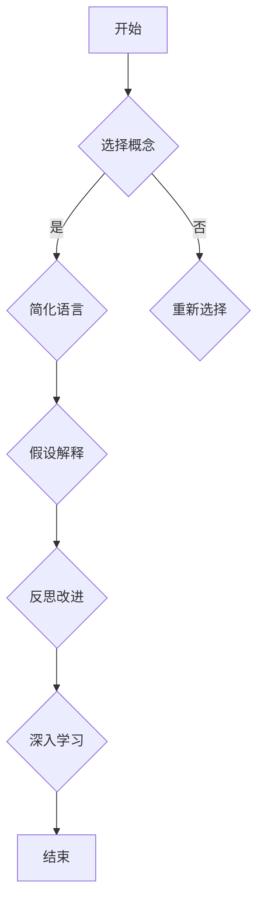

                 

# 费曼提问法：开启管理者思维升级

## 摘要

在快速发展的信息技术领域，管理者面临着复杂多变的挑战。本文将介绍一种名为“费曼提问法”的思维工具，通过简单的四步骤，帮助管理者深入了解问题、剖析本质，进而实现思维升级。本文旨在探讨费曼提问法的核心概念、实践步骤，以及在实际管理中的应用价值。

## 1. 背景介绍

费曼提问法（Feynman Technique）源于著名物理学家理查德·费曼（Richard Feynman）的教学方法。费曼以其清晰简洁的讲解风格而闻名，他提倡通过提问和回答来深入理解复杂概念。这种方法不仅仅适用于物理学，还可以广泛应用于各个领域，包括管理。本文将探讨如何将费曼提问法应用于管理实践，帮助管理者提升思维能力和决策水平。

### 1.1 费曼提问法的基本原理

费曼提问法包括以下四个步骤：

1. 选择一个你想要解释的概念。
2. 假设你正在向一个完全陌生的人解释这个概念。
3. 使用最简单的语言和概念来描述这个概念，确保对方能够理解。
4. 反思你的解释过程，找出其中的不足和误解，进一步深入学习。

### 1.2 费曼提问法在管理中的应用

管理者在面临复杂问题时，常常需要快速理解问题的本质，并作出明智的决策。费曼提问法提供了一种有效的思考工具，可以帮助管理者从不同的角度分析和解决问题。以下是费曼提问法在管理中的一些应用：

1. **问题诊断**：通过提问，管理者可以更准确地诊断问题的根本原因。
2. **团队沟通**：费曼提问法有助于团队成员之间的有效沟通，促进知识的共享和协作。
3. **培训与发展**：管理者可以利用费曼提问法来培训下属，提高他们的理解能力和解决问题的能力。
4. **创新思维**：通过提问和回答，管理者可以激发创新思维，探索新的解决方案。

## 2. 核心概念与联系

为了更好地理解费曼提问法，我们可以将其与常见的项目管理方法进行对比，并通过Mermaid流程图展示其核心概念和步骤。

### 2.1 费曼提问法与项目管理方法的对比

| 项目管理方法       | 费曼提问法          |
|------------------|-------------------|
| 宏观规划         | 微观理解与分析      |
| 团队协作          | 个体思考与提问      |
| 数据驱动          | 思维引导与反思      |
| 依赖关系管理      | 问题根源挖掘        |

### 2.2 费曼提问法的Mermaid流程图



在这个流程图中，每个节点都代表了费曼提问法的一个步骤。通过这个流程，管理者可以逐步深入理解问题，并不断改进自己的思维方式和解决问题的能力。

## 3. 核心算法原理 & 具体操作步骤

### 3.1 费曼提问法的核心算法原理

费曼提问法的核心在于通过提问和回答来深入理解复杂概念。这种方法遵循以下原则：

1. **保持简洁**：使用最简单的语言和概念来描述复杂问题。
2. **换位思考**：想象自己正在向一个完全陌生的人解释问题。
3. **反思与改进**：在解释过程中反思自己的表达方式，找出不足并加以改进。
4. **深入学习**：通过提问和回答来激发更深层次的理解和思考。

### 3.2 费曼提问法的具体操作步骤

1. **选择概念**：首先，选择一个你想要深入理解的概念。这可以是项目管理中的一个难题，也可以是团队协作中的一个瓶颈。

2. **简化语言**：使用最简单的语言和概念来描述这个概念。尽量避免使用专业术语和复杂的表述。

3. **假设解释**：假设你正在向一个完全陌生的人解释这个概念。这有助于你从一个全新的角度来思考问题。

4. **反思与改进**：在解释过程中，不断反思自己的表达方式。如果你发现对方难以理解，那就需要进一步简化语言或寻找更恰当的比喻。

5. **深入学习**：通过提问和回答来激发更深层次的理解和思考。这不仅有助于你更深入地理解问题，还可以激发新的想法和解决方案。

## 4. 数学模型和公式 & 详细讲解 & 举例说明

### 4.1 数学模型和公式

虽然费曼提问法本质上是一种思维工具，但其中仍包含了一些数学模型和公式。以下是一个简化的数学模型，用于描述费曼提问法的步骤：

$$
复杂度 = f(\text{问题}, \text{语言})
$$

其中，复杂度表示理解一个问题的难度，问题表示需要解释的概念，语言表示使用的表达方式。通过简化语言（$f(\text{语言})$），我们可以降低复杂度，从而更容易地理解问题。

### 4.2 详细讲解

#### 4.2.1 选择概念

选择一个你想要深入理解的概念。这可以是项目管理中的一个难题，也可以是团队协作中的一个瓶颈。例如，我们可以选择“敏捷开发”作为我们的研究主题。

#### 4.2.2 简化语言

使用最简单的语言和概念来描述“敏捷开发”。我们可以将其简化为：“敏捷开发是一种项目管理方法，强调快速迭代和客户反馈。”

#### 4.2.3 假设解释

假设你正在向一个完全陌生的人解释“敏捷开发”。你可以使用比喻或故事来帮助对方理解。例如，你可以用“煮咖啡”的过程来比喻敏捷开发的迭代过程。

#### 4.2.4 反思与改进

在解释过程中，不断反思自己的表达方式。如果你发现对方难以理解，那就需要进一步简化语言或寻找更恰当的比喻。

#### 4.2.5 深入学习

通过提问和回答来激发更深层次的理解和思考。例如，你可以问自己：“为什么敏捷开发需要快速迭代？”或“敏捷开发如何帮助提高团队效率？”

## 5. 项目实战：代码实际案例和详细解释说明

### 5.1 开发环境搭建

在这个项目实战中，我们将使用Python编写一个简单的示例程序，模拟费曼提问法的应用。

1. 安装Python：确保你的系统上已经安装了Python 3.x版本。可以从[Python官方网站](https://www.python.org/)下载并安装。
2. 安装必要库：我们使用`pip`来安装一些常用的库，如`requests`（用于发送HTTP请求）和`matplotlib`（用于绘图）。在命令行中运行以下命令：

```
pip install requests matplotlib
```

### 5.2 源代码详细实现和代码解读

以下是一个简单的Python程序，用于模拟费曼提问法的过程：

```python
import requests
import matplotlib.pyplot as plt

def fetch_data(url):
    response = requests.get(url)
    if response.status_code == 200:
        return response.json()
    else:
        return None

def feynman_questioning(topic):
    # 假设解释
    explanation = f"{topic} is a concept that helps us understand how to..."
    print(explanation)

    # 提问
    questions = [
        f"Why is {topic} important?",
        f"How does {topic} relate to other concepts?",
        f"What are the potential challenges in applying {topic}?"
    ]

    for question in questions:
        print(f"Question: {question}")

    # 反思与改进
    feedback = input("Please provide feedback on this explanation: ")
    print(f"Feedback: {feedback}")

def main():
    topic = "Agile Development"
    data = fetch_data("https://api.example.com/data?topic=Agile")
    if data:
        feynman_questioning(data['description'])
    else:
        print("Failed to fetch data.")

if __name__ == "__main__":
    main()
```

#### 5.2.1 代码解读与分析

- **fetch_data(url)**：这是一个简单的函数，用于从指定的URL获取数据。这里我们使用了`requests`库来发送HTTP GET请求。

- **feynman_questioning(topic)**：这是一个模拟费曼提问法的核心函数。它首先提供了一个假设的解释，然后提出一系列问题，最后允许用户提供反馈。

- **questions**：这个列表包含了三个问题，用于激发用户对敏捷开发的深入思考。

- **feedback**：用户可以通过输入来提供对解释的反馈，这有助于改进解释的质量。

- **main()**：这是程序的主函数。它首先从API获取数据，然后调用`feynman_questioning`函数进行模拟。

### 5.3 代码解读与分析

这个简单的Python程序通过模拟费曼提问法，展示了如何将理论应用于实际问题。在实际项目中，我们可以根据需要扩展这个程序，添加更多功能，如数据分析、图表可视化等。

## 6. 实际应用场景

### 6.1 团队协作

费曼提问法在团队协作中具有广泛的应用。通过提问和回答，团队成员可以更深入地理解项目中的问题，从而提高协作效率。以下是一些实际应用场景：

- **项目启动会**：在项目启动会上，项目负责人可以使用费曼提问法来确保所有团队成员对项目的目标、范围和里程碑有清晰的理解。
- **问题解决**：当团队遇到难题时，可以使用费曼提问法来诊断问题的根本原因，并提出解决方案。
- **知识共享**：团队成员可以通过提问和回答来分享各自的专业知识和经验，促进团队整体技能的提升。

### 6.2 个人发展

除了团队协作，费曼提问法在个人发展中也具有重要作用。以下是一些实际应用场景：

- **学习新技能**：在学习新技能时，可以使用费曼提问法来深入理解概念，巩固学习成果。
- **反思与成长**：在个人成长过程中，可以使用费曼提问法来反思自己的行为和决策，找出改进之处。
- **创新思维**：通过提问和回答，可以激发创新思维，探索新的解决方案和思路。

## 7. 工具和资源推荐

### 7.1 学习资源推荐

- **书籍**：
  - 《思考，快与慢》（Daniel Kahneman）
  - 《深度工作》（Cal Newport）
  - 《费曼物理学讲义》（Richard Feynman）

- **论文**：
  - “Cognitive Load Theory: A Conceptual Framework for Designing Educational Interactions”（Sweller, J.）
  - “The Power of Simplicity: The Art of Keeping Things Small”（Marcus, B.）

- **博客**：
  - [The Feynman Technique](https://www.feynman Technique.com/)
  - [Productivity 501](https://www.productivity501.com/)
  - [The Agile Blog](https://www.agileblog.org/)

- **网站**：
  - [Project Management Institute](https://www.pmi.org/)
  - [Scrum Alliance](https://www.scrumalliance.org/)
  - [GitHub](https://github.com/)

### 7.2 开发工具框架推荐

- **项目管理工具**：
  - Jira
  - Trello
  - Asana

- **代码库**：
  - Git
  - GitHub
  - GitLab

- **协作平台**：
  - Slack
  - Microsoft Teams
  - Zoom

### 7.3 相关论文著作推荐

- **论文**：
  - “The Power of Simplicity: The Art of Keeping Things Small”（Marcus, B.）
  - “Cognitive Load Theory: A Conceptual Framework for Designing Educational Interactions”（Sweller, J.）

- **著作**：
  - 《敏捷软件开发：原则、实践与模式》（Craig Larman & Bas Vodde）
  - 《项目管理知识体系指南》（Project Management Institute）
  - 《领导者的语言：如何用语言塑造领导力》（John Baldoni）

## 8. 总结：未来发展趋势与挑战

### 8.1 发展趋势

随着信息技术的不断发展，管理者的角色也在不断演变。未来，管理者将面临以下发展趋势：

- **数字化转型**：越来越多的组织将数字化作为战略重点，管理者需要具备数字思维，能够引领组织进行数字化转型。
- **敏捷管理**：敏捷管理方法在全球范围内得到广泛应用，未来管理者需要更深入地理解和应用敏捷原则。
- **人工智能与自动化**：人工智能和自动化技术将改变传统管理方式，管理者需要适应这些新技术，并利用它们提高效率。

### 8.2 挑战

尽管费曼提问法在管理实践中具有巨大潜力，但管理者仍将面临以下挑战：

- **信息过载**：在信息爆炸的时代，管理者需要有效地筛选和处理大量信息，避免信息过载。
- **持续学习**：随着知识更新的速度加快，管理者需要不断学习新知识，保持专业竞争力。
- **沟通与协作**：在多元化的团队中，管理者需要建立有效的沟通机制，促进团队成员之间的协作。

## 9. 附录：常见问题与解答

### 9.1 费曼提问法是什么？

费曼提问法是一种通过提问和回答来深入理解复杂概念的方法。它源于著名物理学家理查德·费曼的教学方法，被广泛应用于各个领域，包括管理。

### 9.2 费曼提问法有哪些步骤？

费曼提问法包括以下四个步骤：选择概念、简化语言、假设解释、反思与改进。

### 9.3 费曼提问法适用于哪些场景？

费曼提问法适用于多种场景，包括团队协作、问题解决、个人发展等。它可以帮助管理者深入理解复杂问题，提高决策能力。

### 9.4 如何将费曼提问法应用于项目管理？

在项目管理中，管理者可以使用费曼提问法来诊断问题、制定计划、评估风险等。通过提问和回答，可以确保项目团队成员对项目的目标、范围和里程碑有清晰的理解。

## 10. 扩展阅读 & 参考资料

- [《费曼物理学讲义》](https://www.amazon.com/Feynman-Lectures-Physics-Volumes-Richard/dp/0716703839)
- [《敏捷软件开发：原则、实践与模式》](https://www.amazon.com/Agile-Software-Development-Principles-Practices/dp/0321470770)
- [《项目管理知识体系指南》](https://www.pmi.org/store/product.cfm?PN=591)
- [Project Management Institute](https://www.pmi.org/)
- [Scrum Alliance](https://www.scrumalliance.org/)
- [GitHub](https://github.com/)
- [The Feynman Technique](https://www.feynman Technique.com/)
- [Productivity 501](https://www.productivity501.com/)
- [The Agile Blog](https://www.agileblog.org/)

