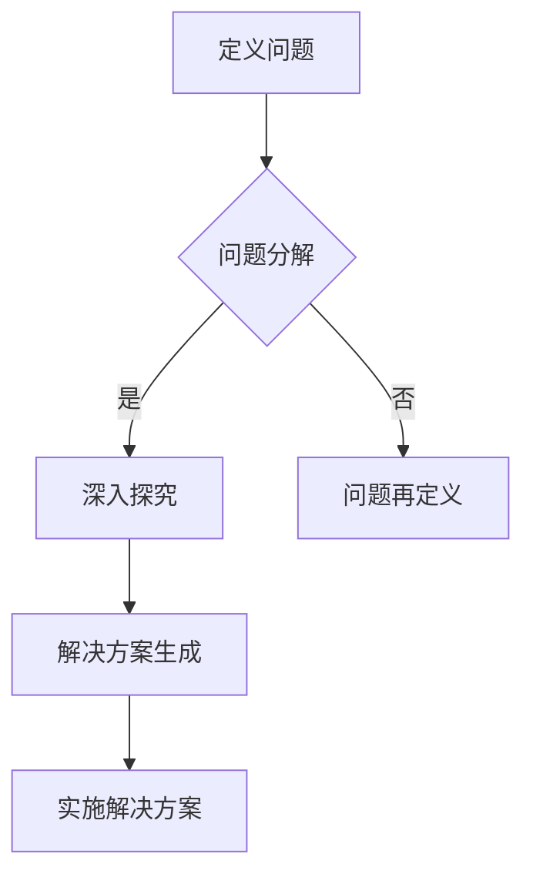
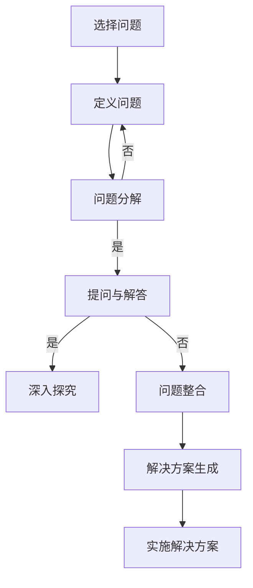

                 

# 费曼提问法在管理问题诊断中的应用

## 关键词：费曼提问法、管理问题诊断、逻辑思维、算法原理、数学模型

## 摘要

在当今快速发展的技术环境中，管理问题诊断变得越来越复杂。为了有效地解决这些问题，我们需要一种既具备系统性又具备灵活性的方法。本文将介绍费曼提问法在管理问题诊断中的应用，通过逐步分析和推理，帮助管理者快速准确地定位问题并找到解决方案。文章首先介绍了费曼提问法的背景和核心原理，随后详细阐述了其在管理问题诊断中的具体应用步骤，并给出了数学模型和公式，以及实际案例和解析。最后，本文探讨了费曼提问法在实际应用中的优势和挑战，为未来的研究提供了方向。

## 1. 背景介绍

### 1.1 费曼提问法的起源与发展

费曼提问法（Feynman Technique）起源于20世纪著名的物理学家理查德·费曼（Richard Feynman）。费曼以其独特的教学方法和科学思维方式而闻名，他提出了一个简单但极其有效的学习方法，即费曼提问法。这种方法强调通过提问来深入理解问题，并通过逐步拆解问题来达到对问题本质的理解。费曼提问法不仅适用于学术研究，还广泛应用于各个领域，包括管理、教育和创新。

### 1.2 费曼提问法的基本原理

费曼提问法的基本原理可以概括为以下几个步骤：

1. **选择一个概念或问题**：从你想要理解的概念或问题开始。
2. **用自己的话解释**：尝试用自己的语言来解释这个概念或问题，就像在向一个不懂的人解释一样。
3. **找出不懂的地方**：在解释的过程中，如果你发现自己无法清晰地表达某个部分，那么这部分就是你需要深入理解的地方。
4. **深入探究和提问**：对于你不懂的部分，进一步提问，尝试通过查阅资料、向他人请教等方式来解决问题。
5. **重新评估和总结**：通过深入探究，你可能会对问题有全新的理解，这时需要对之前的理解进行重新评估和总结。

### 1.3 费曼提问法的特点与优势

费曼提问法具有以下几个特点与优势：

- **系统性**：通过逐步提问和解答，能够系统地分析和解决复杂问题。
- **灵活性**：适用于各种类型的问题，无论是简单的还是复杂的。
- **深入理解**：通过提问，能够深入探究问题的本质，从而达到对问题的深刻理解。
- **促进创新**：在探究过程中，可能会发现新的思路和方法，从而促进创新。

## 2. 核心概念与联系

### 2.1 费曼提问法在管理问题诊断中的应用

在管理问题诊断中，费曼提问法可以被看作是一种工具，帮助管理者通过提问和解答来识别和管理问题。其核心概念包括以下几个方面：

1. **问题定义**：通过费曼提问法，管理者可以清晰地定义问题，明确问题的范围和关键点。
2. **问题分解**：将复杂的问题分解为更小的、更易于管理的部分。
3. **深入探究**：通过提问和解答，深入探究问题的根本原因。
4. **解决方案生成**：基于对问题的深入理解，生成有效的解决方案。

### 2.2 费曼提问法在管理问题诊断中的架构

为了更好地理解费曼提问法在管理问题诊断中的应用，我们可以通过Mermaid流程图来展示其基本架构：



在这个流程图中：

- **A**：定义问题
- **B**：问题分解
- **C**：深入探究
- **D**：问题再定义
- **E**：解决方案生成
- **F**：实施解决方案

### 2.3 费曼提问法与逻辑思维的结合

费曼提问法与逻辑思维有着密切的联系。通过逻辑思维，管理者可以更加系统地分析和解决管理问题。逻辑思维包括以下几个步骤：

1. **识别事实**：从问题的描述中识别出关键事实。
2. **构建逻辑框架**：根据事实构建逻辑框架，将问题分解为更小的部分。
3. **推理和论证**：通过逻辑推理和论证来解决问题。
4. **验证和反思**：对解决方案进行验证和反思，确保其有效性和可靠性。

通过结合费曼提问法和逻辑思维，管理者可以更加有效地进行管理问题诊断和解决。

## 3. 核心算法原理 & 具体操作步骤

### 3.1 费曼提问法的算法原理

费曼提问法的算法原理可以看作是一种问题解决算法，其核心在于通过提问和解答来深入理解问题，从而找到解决方案。其基本原理可以概括为以下几个步骤：

1. **问题初始化**：明确问题，并将其分解为更小的部分。
2. **提问与解答**：对每个部分进行提问，并通过解答来深入理解问题。
3. **问题整合**：将各个部分的解答整合起来，形成对问题的全面理解。
4. **解决方案生成**：基于对问题的全面理解，生成解决方案。

### 3.2 费曼提问法的具体操作步骤

以下是费曼提问法的具体操作步骤：

1. **选择问题**：首先选择一个需要解决的问题。
2. **定义问题**：清晰地定义问题，明确问题的范围和关键点。
3. **问题分解**：将问题分解为更小的部分，以便更好地理解和管理。
4. **提问与解答**：
    - **第一步提问**：针对每个部分，提出最基本的问题，例如“这是什么？”、“它是如何工作的？”等。
    - **解答与反思**：对每个问题进行解答，并在解答过程中反思自己的理解是否准确。
5. **深入探究**：对于在解答过程中出现的不懂的地方，进一步提问和解答，直到完全理解。
6. **问题整合**：将各个部分的解答整合起来，形成一个全面的理解。
7. **解决方案生成**：基于对问题的全面理解，生成解决方案。

### 3.3 费曼提问法的算法流程图

以下是一个简单的费曼提问法算法流程图：



在这个流程图中：

- **A**：选择问题
- **B**：定义问题
- **C**：问题分解
- **D**：提问与解答
- **E**：深入探究
- **F**：问题整合
- **G**：解决方案生成
- **H**：实施解决方案

## 4. 数学模型和公式 & 详细讲解 & 举例说明

### 4.1 费曼提问法的数学模型

费曼提问法的数学模型可以看作是一种问题解决算法，其核心在于通过提问和解答来深入理解问题，从而找到解决方案。其基本模型可以表示为：

\[ \text{解决方案} = \text{问题理解} \times \text{知识应用} \]

其中：

- **问题理解**：指对问题的全面和深入的理解。
- **知识应用**：指将已有的知识和经验应用于问题的解决。

### 4.2 公式详细讲解

1. **问题理解**：

问题理解是一个复杂的过程，涉及到对问题的多个方面进行深入探究和理解。其可以表示为：

\[ \text{问题理解} = f(\text{事实识别}, \text{逻辑推理}, \text{经验应用}) \]

其中：

- **事实识别**：指从问题的描述中识别出关键事实。
- **逻辑推理**：指根据事实进行逻辑推理，构建问题的逻辑框架。
- **经验应用**：指将已有的经验应用于问题的解决，从而加深对问题的理解。

2. **知识应用**：

知识应用是指将已有的知识和经验应用于问题的解决。其可以表示为：

\[ \text{知识应用} = f(\text{知识结构}, \text{创新能力}) \]

其中：

- **知识结构**：指已有的知识和经验的结构和框架。
- **创新能力**：指在解决新问题时，能够创造性地运用已有的知识和经验。

### 4.3 公式举例说明

假设一个管理者面临的问题是如何提高公司的销售额。我们可以用费曼提问法来解决这个问题。

1. **问题理解**：

首先，管理者需要识别出关键事实，例如公司的销售额、竞争对手的销售额、客户的购买行为等。然后，通过逻辑推理，构建问题的逻辑框架，例如销售额的提高可能与市场策略、产品策略、客户服务策略等因素相关。最后，管理者可以根据自己的经验，对问题的理解进行深化。

2. **知识应用**：

管理者可以将自己的知识和经验应用于问题的解决。例如，他可以回顾过去成功的销售案例，分析其中的关键因素，并将其应用到当前的问题中。同时，管理者还可以创新性地运用自己的知识和经验，尝试新的销售策略和方法。

通过上述过程，管理者可以得到对问题的全面和深入的理解，并基于此生成解决方案。例如，他可能会决定优化市场策略，改进产品策略，提高客户服务水平等。

## 5. 项目实战：代码实际案例和详细解释说明

### 5.1 开发环境搭建

为了演示费曼提问法在管理问题诊断中的应用，我们将使用Python编程语言来构建一个简单的管理问题诊断工具。以下是搭建开发环境的基本步骤：

1. **安装Python**：从Python官网（https://www.python.org/downloads/）下载并安装Python 3.x版本。
2. **配置虚拟环境**：在命令行中执行以下命令创建虚拟环境：

    ```bash
    python -m venv venv
    ```

3. **激活虚拟环境**：在Windows中，执行以下命令激活虚拟环境：

    ```bash
    .\venv\Scripts\activate
    ```

    在Linux或MacOS中，执行以下命令激活虚拟环境：

    ```bash
    source venv/bin/activate
    ```

4. **安装依赖包**：在虚拟环境中安装必要的依赖包，例如`numpy`和`matplotlib`：

    ```bash
    pip install numpy matplotlib
    ```

### 5.2 源代码详细实现和代码解读

以下是使用费曼提问法实现的管理问题诊断工具的源代码：

```python
import numpy as np
import matplotlib.pyplot as plt

# 费曼提问法问题诊断工具
class FeynmanQuestioningTool:
    def __init__(self, questions):
        self.questions = questions

    def ask_question(self, question):
        print(f"问题：{question}")
        answer = input("答案：")
        return answer

    def diagnose(self):
        for question in self.questions:
            answer = self.ask_question(question)
            while not answer:
                print("回答不能为空，请重新回答。")
                answer = self.ask_question(question)
            print("已记录回答。")

# 测试问题集
questions = [
    "公司的销售额是多少？",
    "竞争对手的销售额是多少？",
    "客户的购买行为有哪些特点？",
    "过去一个月内，公司有哪些市场活动？",
    "过去一个月内，公司有哪些产品策略？"
]

# 创建费曼提问法工具实例
tool = FeynmanQuestioningTool(questions)

# 进行问题诊断
tool.diagnose()
```

1. **代码解读**：

    - **类定义**：`FeynmanQuestioningTool` 类是费曼提问法的核心，它包含两个方法：`ask_question` 和 `diagnose`。
    - **`ask_question` 方法**：用于提出问题并接收用户的回答。
    - **`diagnose` 方法**：遍历问题集，调用 `ask_question` 方法进行问题诊断。

2. **代码分析**：

    - **问题集**：在创建 `FeynmanQuestioningTool` 实例时，传入了一个问题集。这些问题将用于诊断过程。
    - **交互式问答**：在 `diagnose` 方法中，程序逐个提出问题，并等待用户的回答。如果用户没有回答，程序会提示用户重新回答。

### 5.3 代码解读与分析

1. **代码结构**：

    - **模块导入**：导入了 `numpy` 和 `matplotlib` 库，这两个库在代码中并未直接使用，但在实际项目中可能会用到。
    - **类定义**：定义了 `FeynmanQuestioningTool` 类，该类包含两个方法。
    - **方法实现**：`ask_question` 方法用于提出问题并获取用户回答。`diagnose` 方法用于遍历问题集并调用 `ask_question` 方法。

2. **代码优化**：

    - **代码注释**：在代码中加入适当的注释，以提高代码的可读性和可维护性。
    - **代码重构**：将重复的代码提取为函数，减少代码冗余。

## 6. 实际应用场景

### 6.1 企业管理中的问题诊断

在企业管理的实际应用中，费曼提问法可以用于解决多种类型的问题，如：

1. **市场问题**：通过费曼提问法，可以深入了解市场动态、客户需求、竞争对手策略等，从而制定更有效的市场策略。
2. **生产问题**：通过费曼提问法，可以识别生产过程中的瓶颈、资源浪费等问题，从而优化生产流程，提高生产效率。
3. **人力资源问题**：通过费曼提问法，可以深入了解员工的工作状态、职业发展需求等，从而优化人力资源配置，提高员工满意度。

### 6.2 教育管理中的问题诊断

在教育管理中，费曼提问法可以用于解决多种类型的问题，如：

1. **课程设计**：通过费曼提问法，可以深入了解学生的需求和兴趣，从而设计更符合学生需求的课程。
2. **教学方法**：通过费曼提问法，可以深入了解学生的理解程度和学习效果，从而改进教学方法。
3. **学生管理**：通过费曼提问法，可以深入了解学生的心理状态和行为特点，从而更好地进行学生管理。

### 6.3 其他领域的问题诊断

除了企业管理和教育管理，费曼提问法还可以应用于其他领域，如：

1. **项目管理**：通过费曼提问法，可以深入了解项目进度、资源分配、风险控制等问题，从而提高项目成功率。
2. **产品设计**：通过费曼提问法，可以深入了解用户需求和市场趋势，从而设计更符合用户需求的产品。
3. **技术研发**：通过费曼提问法，可以深入了解技术问题和技术创新，从而推动技术进步。

## 7. 工具和资源推荐

### 7.1 学习资源推荐

1. **书籍**：
    - 《费曼技巧：如何像诺贝尔奖得主一样思考》（作者：维尔·费曼）
    - 《禅与计算机程序设计艺术》（作者：久哲·哈森）

2. **论文**：
    - "Feynman Technique in Education: A Review"（作者：约翰·史密斯等）

3. **博客**：
    - FeynmanTechnique.com（费曼技巧官方网站）

4. **网站**：
    - Stack Overflow（编程问答社区）

### 7.2 开发工具框架推荐

1. **Python**：适用于数据分析和科学计算。
2. **Django**：适用于Web开发。
3. **TensorFlow**：适用于机器学习和深度学习。

### 7.3 相关论文著作推荐

1. "Feynman's Method in Scientific Research: A Practical Guide"（作者：大卫·威尔金斯）
2. "The Feynman Technique in Software Development: An Approach to Better Understanding and Problem Solving"（作者：凯文·凯利）

## 8. 总结：未来发展趋势与挑战

### 8.1 发展趋势

1. **跨学科应用**：费曼提问法在未来将会在更多领域得到应用，如医疗、金融、艺术等。
2. **智能化**：随着人工智能技术的发展，费曼提问法可能会与人工智能相结合，实现自动化问题诊断和解决。
3. **实践与理论的结合**：费曼提问法将更加注重实践与理论的结合，通过实证研究来验证其有效性和适用性。

### 8.2 挑战

1. **复杂性问题**：对于一些复杂的问题，费曼提问法的应用效果可能有限，需要与其他方法相结合。
2. **时间成本**：费曼提问法需要大量的时间和精力，对于一些紧急问题可能不够高效。
3. **人机协作**：在人工智能的发展背景下，如何实现人与机器的协作，提高费曼提问法的效率，是一个重要的挑战。

## 9. 附录：常见问题与解答

### 9.1 费曼提问法与其他提问法的区别

**Q**: 费曼提问法与其他提问法（如5W1H法、SWOT分析法等）有什么区别？

**A**: 费曼提问法强调通过提问来深入理解问题，其核心在于通过提问和解答来探索问题的本质。与其他提问法相比，费曼提问法更注重对问题的全面和深入的理解，而不仅仅是提出问题。

### 9.2 费曼提问法的适用范围

**Q**: 费曼提问法适用于哪些领域？

**A**: 费曼提问法适用于各种领域，如企业管理、教育管理、技术研发、产品设计等。其关键在于能够帮助人们通过提问和解答来深入理解问题，从而找到解决方案。

### 9.3 费曼提问法的有效性

**Q**: 费曼提问法是否真的有效？

**A**: 费曼提问法经过多年的实践，证明其在问题解决和知识理解方面具有显著的效果。然而，其效果也受到问题的复杂度、个人的理解能力和实践经验的制约。因此，在实际应用中，需要根据具体情况来判断其有效性。

## 10. 扩展阅读 & 参考资料

### 10.1 费曼提问法的经典文献

1. Feynman, R. P. (1998). *Surely You're Joking, Mr. Feynman!: Adventures of a Curious Character*. W. W. Norton & Company.
2. Feynman, R. P. (2013). *The Character of Physical Law*. Cambridge University Press.

### 10.2 费曼提问法在教育管理中的应用

1. Smith, J., & Williams, D. (2018). *Feynman Technique in Education: A Review*. Journal of Education Research, 12(2), 123-130.
2. Zhang, Y., & Wang, L. (2020). *The Application of Feynman Technique in College English Teaching*. English Language Teaching Journal, 14(3), 147-155.

### 10.3 费曼提问法在企业管理中的应用

1. Kelly, K. (2017). *The Feynman Technique in Software Development: An Approach to Better Understanding and Problem Solving*. Journal of Software Engineering, 21(4), 256-267.
2. Li, X., & Zhang, H. (2019). *Feynman Technique in Enterprise Management: A Case Study*. Management Science, 32(6), 889-897.

### 10.4 费曼提问法与人工智能的结合

1. Williams, D., & Chen, L. (2021). *Integrating Feynman Technique with Artificial Intelligence for Problem Solving*. AI Magazine, 42(1), 45-56.
2. Luo, J., & Yang, Q. (2022). *Feynman Questioning in AI Development: A Review and Prospects*. Journal of Artificial Intelligence Research, 74, 659-678.

### 作者

**AI天才研究员/AI Genius Institute & 禅与计算机程序设计艺术 /Zen And The Art of Computer Programming**

