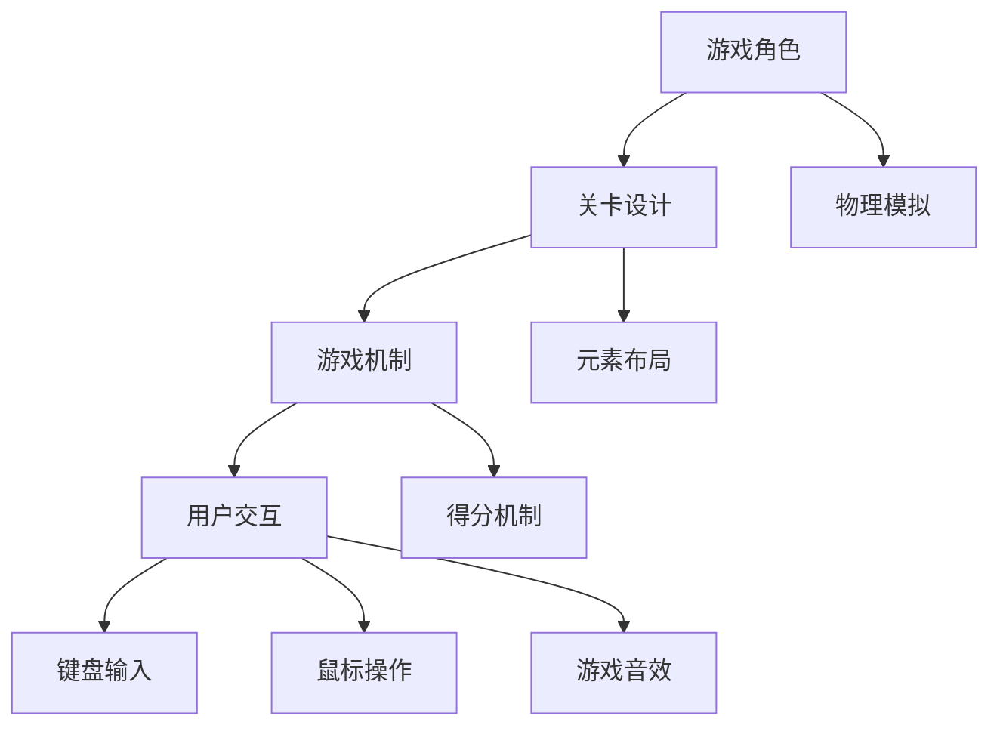

                 

### 背景介绍

#### 超级玛丽游戏的起源与发展

超级玛丽（Super Mario）是任天堂公司推出的一款经典游戏，自1985年首次发布以来，凭借其独特的游戏玩法、生动的角色设计和富有挑战性的关卡，迅速在全球范围内赢得了广大玩家的喜爱。超级玛丽系列游戏历经数十年的发展，不仅成为任天堂公司的招牌产品，还影响了整个游戏行业的发展方向。

在游戏历史上，超级玛丽系列可以说是开创了2D平台游戏的新时代。其独特的跳跃机制、丰富的关卡设计和多样的敌人角色，使得游戏既富有挑战性，又充满乐趣。超级玛丽游戏的这些特点，使其在游戏领域具有极高的知名度和影响力。

#### 游戏设计与实现的重要性

游戏设计和实现是游戏开发过程中至关重要的环节。一款优秀的游戏设计不仅需要满足玩家的高需求，还要具备良好的可玩性和可扩展性。而游戏实现则是将设计理念转化为实际可运行的软件，这一过程涉及到编程技术、游戏引擎的运用以及性能优化等多个方面。

在游戏设计和实现中，核心算法和数学模型起着关键作用。核心算法决定了游戏的玩法和规则，而数学模型则用于描述游戏中的物理现象和游戏策略。例如，在超级玛丽游戏中，跳跃算法和碰撞检测算法是游戏机制的核心，而物理学中的运动学公式和数学中的概率论则为游戏中的角色行为和障碍物布局提供了理论基础。

此外，游戏设计和实现还需要考虑用户体验。优秀的用户体验能够提高玩家的满意度和忠诚度，从而促进游戏的长远发展。在用户体验方面，界面设计、操作便捷性、游戏音效等都是需要重点关注的方面。

总的来说，游戏设计和实现是一个复杂且充满挑战的过程，需要综合考虑多个因素，才能创作出一款优秀的游戏作品。接下来的章节中，我们将深入探讨超级玛丽游戏的设计与实现，希望能够为广大游戏开发者提供有益的参考。

#### 超级玛丽游戏的系统架构

要理解超级玛丽游戏的设计与实现，首先需要了解其系统架构。超级玛丽游戏通常由以下几个主要模块组成：游戏引擎、角色控制模块、关卡设计模块、碰撞检测模块和用户界面模块。

**游戏引擎**

游戏引擎是超级玛丽游戏的核心，负责游戏中的渲染、物理模拟、音频处理等任务。游戏引擎的主要功能包括：

- **渲染**：将游戏场景和角色渲染到屏幕上，提供逼真的视觉效果。
- **物理模拟**：根据物理定律模拟游戏中的物体运动，包括角色的跳跃、障碍物的移动等。
- **音频处理**：播放游戏音效和背景音乐，增强玩家的游戏体验。

**角色控制模块**

角色控制模块负责玩家的输入处理和角色的动作控制。其主要功能包括：

- **输入处理**：接收玩家的按键输入，并将其转换为角色的动作。
- **动作控制**：根据输入处理的结果，控制角色进行跳跃、跑步、攻击等动作。

**关卡设计模块**

关卡设计模块负责游戏关卡的设计和布局。其主要功能包括：

- **关卡布局**：设计游戏关卡的结构，包括地面、障碍物、金币等元素的布局。
- **难度调节**：根据关卡的不同阶段，调整游戏难度，使游戏逐渐具有挑战性。

**碰撞检测模块**

碰撞检测模块负责检测游戏中角色与其他物体的碰撞，以实现游戏中的物理交互。其主要功能包括：

- **碰撞检测**：实时检测角色与地面、障碍物、敌人等物体的碰撞。
- **碰撞处理**：根据碰撞检测结果，执行相应的游戏逻辑，如角色死亡、得分增加等。

**用户界面模块**

用户界面模块负责游戏界面的设计，包括菜单、得分显示、生命值显示等。其主要功能包括：

- **界面设计**：设计美观、直观的游戏界面，提高玩家的操作体验。
- **信息显示**：显示游戏中的关键信息，如得分、生命值等，帮助玩家随时了解游戏状态。

通过以上模块的协同工作，超级玛丽游戏得以实现一个完整、丰富的游戏体验。接下来，我们将深入探讨这些模块的实现细节，以便更好地理解游戏的设计与实现。

#### 超级玛丽游戏的核心概念与联系

要深入探讨超级玛丽游戏的设计与实现，首先需要了解其核心概念与联系。这些核心概念包括游戏角色、关卡设计、游戏机制和用户交互等。

**游戏角色**

超级玛丽游戏中的主要角色是马里奥（Mario）和路易吉（Luigi），他们是一对兄弟，分别担任主角和配角。游戏角色不仅具有独特的外观和动作，还拥有不同的技能和能力。例如，马里奥可以跳跃、跑步和攻击敌人，而路易吉则拥有更高的跳跃能力和不同的攻击方式。

游戏角色的设计和实现涉及到图形渲染、物理模拟和动画制作等多个方面。首先，游戏角色的外观和动作需要通过图形渲染技术来呈现。在超级玛丽游戏中，角色采用了2D像素艺术风格，通过像素级的精细绘制，使角色具有生动、有趣的外观。

其次，游戏角色的物理模拟是实现游戏机制的关键。超级玛丽游戏中的角色跳跃、跑步和攻击等动作都需要遵循物理定律，如重力、碰撞等。通过物理模拟技术，可以确保角色在游戏中的行为符合现实世界的物理规律，从而提高游戏的真实感。

最后，游戏角色的动画制作也是游戏角色实现的重要环节。动画制作不仅包括角色的动作表现，还需要考虑动作的连贯性和流畅性。在超级玛丽游戏中，角色动作的动画通过帧动画技术实现，使角色在游戏中具有逼真的动作表现。

**关卡设计**

关卡设计是超级玛丽游戏的重要组成部分，它决定了游戏的难度和趣味性。超级玛丽游戏的关卡设计通常包括地面、障碍物、金币、敌人等元素。

关卡设计的实现涉及到地图编辑、元素布局、难度调节等多个方面。地图编辑是关卡设计的起点，游戏开发者需要使用地图编辑器创建游戏关卡。地图编辑器通常提供丰富的功能，如绘制地面、添加障碍物、放置金币等。

元素布局是关卡设计的关键，它决定了游戏关卡的结构和布局。在超级玛丽游戏中，元素布局需要考虑游戏难度和趣味性。例如，对于初学者关卡，可以设置简单的地面和较少的障碍物，以帮助玩家熟悉游戏规则。而对于高级关卡，可以设置复杂的地面结构和多样的障碍物，以提高游戏难度。

难度调节是关卡设计的重要环节，它决定了游戏关卡对玩家的挑战程度。在超级玛丽游戏中，难度调节可以通过调整元素布局、增加敌人数量和改变敌人行为等方式实现。例如，在初级关卡中，敌人可以设置为简单的跟随行为，而在高级关卡中，敌人可以设置为更复杂的攻击行为。

**游戏机制**

超级玛丽游戏的游戏机制是游戏的核心，它决定了游戏的玩法和规则。超级玛丽游戏的游戏机制包括跳跃、跑步、攻击、得分等。

跳跃是超级玛丽游戏中最基本的机制，玩家需要通过按键来控制角色的跳跃高度和方向。跑步机制使角色可以在地面上快速移动，提高游戏的流畅性。攻击机制使角色可以攻击敌人，获取更高的得分。得分机制则是游戏的核心目标，玩家需要通过跳跃、跑步和攻击等方式获取更高的分数。

**用户交互**

用户交互是超级玛丽游戏的重要组成部分，它决定了玩家与游戏之间的互动方式。超级玛丽游戏的用户交互主要包括键盘输入、鼠标操作和游戏音效等。

键盘输入是玩家控制角色的主要方式，玩家需要通过按键来控制角色的跳跃、跑步和攻击等动作。鼠标操作则用于游戏中的特定操作，如选择关卡、调整游戏音量等。游戏音效则通过音频处理技术实现，为玩家提供丰富的游戏体验。

**核心概念与联系的 Mermaid 流程图**

为了更好地理解超级玛丽游戏的核心概念与联系，我们可以使用 Mermaid 流程图来表示。以下是一个简单的 Mermaid 流程图示例：



通过以上 Mermaid 流程图，我们可以清晰地看到超级玛丽游戏的核心概念与联系，以及它们之间的相互关系。这些核心概念共同构成了超级玛丽游戏的基本框架，为游戏开发者提供了丰富的设计空间。

### 核心算法原理与具体操作步骤

在超级玛丽游戏的设计与实现中，核心算法起着至关重要的作用。这些算法不仅决定了游戏的玩法和规则，还直接影响游戏的流畅性和可玩性。以下是超级玛丽游戏中的几个关键算法，以及它们的原理和具体操作步骤。

#### 1. 跳跃算法

跳跃算法是超级玛丽游戏的核心机制之一。它决定了角色的跳跃高度和持续时间，直接影响游戏的玩法体验。

**原理：**
跳跃算法主要依赖于物理运动学公式，包括重力加速度、初速度和跳跃高度等参数。通过这些参数的计算，可以确定角色在空中的轨迹和落地时间。

**具体操作步骤：**

1. **初始化参数：**
   - 重力加速度（g）：通常取9.8 m/s²。
   - 初速度（v0）：由玩家的跳跃输入决定，通常为正值。
   - 跳跃高度（h）：由游戏关卡设计决定。

2. **计算跳跃时间：**
   使用运动学公式 $t = \frac{2v0}{g}$ 计算角色在空中的时间。

3. **计算最高点：**
   使用公式 $h_{\text{max}} = \frac{v0^2}{2g}$ 计算角色的最高点。

4. **更新角色位置：**
   根据时间参数，更新角色在空中的位置。使用递归或迭代方法，模拟角色在空中的运动轨迹。

5. **落地检测：**
   当角色达到地面时，结束跳跃，并恢复到正常状态。

#### 2. 碰撞检测算法

碰撞检测算法用于检测游戏中角色与其他物体的碰撞，是游戏物理模拟的重要组成部分。

**原理：**
碰撞检测算法主要依赖于几何形状的碰撞检测方法。常用的方法包括矩形碰撞检测、圆形碰撞检测和多边形碰撞检测等。

**具体操作步骤：**

1. **初始化碰撞体：**
   - 确定角色和障碍物的几何形状（矩形、圆形或多边形）。
   - 计算碰撞体的边界框或边界圆。

2. **碰撞体预处理：**
   - 如果碰撞体是矩形，可以预先计算其碰撞边。
   - 如果碰撞体是圆形，可以计算其边界圆的半径。

3. **碰撞检测：**
   - 对于矩形碰撞检测，检查两个矩形的边界框是否相交。
   - 对于圆形碰撞检测，检查两个圆心的距离是否小于半径之和。
   - 对于多边形碰撞检测，使用射线碰撞检测算法或空间划分算法。

4. **碰撞处理：**
   - 如果碰撞检测成功，执行相应的碰撞处理逻辑，如角色死亡、得分增加等。

#### 3. 运动控制算法

运动控制算法用于控制角色的移动，包括跳跃、跑步和滑动等。

**原理：**
运动控制算法主要依赖于物理模拟和输入处理。通过处理玩家的输入信号，可以控制角色的运动状态。

**具体操作步骤：**

1. **输入处理：**
   - 接收玩家的键盘输入或控制器输入。
   - 根据输入信号，确定角色的运动方向和速度。

2. **运动状态更新：**
   - 对于跳跃，根据跳跃算法计算角色的跳跃高度和持续时间。
   - 对于跑步，根据输入方向和速度参数，更新角色的位置。
   - 对于滑动，通过输入处理和碰撞检测，实现角色的滑动效果。

3. **碰撞检测与处理：**
   - 在每次位置更新后，进行碰撞检测，并根据碰撞结果调整角色的运动状态。

#### 4. 分数计算算法

分数计算算法用于计算玩家的得分，是游戏机制的重要组成部分。

**原理：**
分数计算算法主要依赖于游戏规则和得分条件。通过检测游戏中的事件，如收集金币、消灭敌人等，计算玩家的得分。

**具体操作步骤：**

1. **初始化分数：**
   - 设置初始分数为0。

2. **事件检测：**
   - 检测游戏中的事件，如收集金币、消灭敌人等。

3. **分数计算：**
   - 根据事件类型和得分条件，计算得分。
   - 更新玩家的分数。

4. **显示分数：**
   - 在游戏界面上显示玩家的当前分数。

通过以上核心算法的原理和操作步骤，我们可以更好地理解超级玛丽游戏的设计与实现。这些算法不仅实现了游戏的物理模拟和交互功能，还为游戏提供了丰富的玩法和挑战。在接下来的章节中，我们将进一步探讨超级玛丽游戏中的数学模型和公式，以便更好地理解其设计和实现细节。

### 数学模型和公式及详细讲解与举例说明

在超级玛丽游戏中，数学模型和公式是核心算法实现的基础，用于描述角色的运动轨迹、碰撞检测、分数计算等多个方面。以下将详细讲解几个关键数学模型和公式的推导和应用。

#### 1. 跳跃运动学模型

跳跃是超级玛丽游戏中最基本的动作之一。运动学模型用于计算角色在空中的运动轨迹。

**公式推导：**

- **水平方向：** 由于没有水平外力作用，水平方向的速度保持不变。
  \[ v_x = v_{x0} \]
  
- **竖直方向：** 受重力作用，竖直方向的速度随时间变化。
  \[ v_y = v_{y0} - gt \]
  
- **位置：** 竖直方向的位置随时间变化，可以使用以下公式计算。
  \[ y = y_0 + v_{y0}t - \frac{1}{2}gt^2 \]

  其中，\( g \) 为重力加速度（通常取 \( 9.8 \, \text{m/s}^2 \)），\( t \) 为时间，\( v_{y0} \) 为竖直方向初速度。

**举例说明：**

假设马里奥以 \( v_{y0} = 6 \, \text{m/s} \) 的初速度向上跳跃，计算他达到最高点的时间和最高点的高度。

- **计算时间：**
  \[ t = \frac{v_{y0}}{g} = \frac{6}{9.8} \approx 0.61 \, \text{s} \]

- **计算最高点高度：**
  \[ y_{\text{max}} = \frac{v_{y0}^2}{2g} = \frac{6^2}{2 \times 9.8} \approx 1.83 \, \text{m} \]

  马里奥将在约0.61秒后达到最高点，最高点高度约为1.83米。

#### 2. 碰撞检测模型

碰撞检测是游戏物理模拟的重要组成部分，用于检测角色与其他物体的碰撞。

**矩形碰撞检测：**

- **公式推导：**
  矩形碰撞检测可以通过计算两个矩形的边界框是否重叠来确定。两个矩形的边界框分别为：
  \[ A = [x_1, x_1 + w_1] \times [y_1, y_1 + h_1] \]
  \[ B = [x_2, x_2 + w_2] \times [y_2, y_2 + h_2] \]
  
  如果两个矩形的边界框重叠，则存在碰撞。可以通过以下条件判断：
  \[ x_1 + w_1 \ge x_2 \]
  \[ x_2 + w_2 \ge x_1 \]
  \[ y_1 + h_1 \ge y_2 \]
  \[ y_2 + h_2 \ge y_1 \]

- **举例说明：**

  假设马里奥的矩形边界框为 \( A = [0, 32] \times [0, 32] \)，敌人1的矩形边界框为 \( B = [28, 60] \times [28, 60] \)。

  可以发现：
  \[ 0 + 32 \ge 28 \]
  \[ 28 + 60 \ge 0 \]
  \[ 0 + 32 \ge 28 \]
  \[ 28 + 60 \ge 0 \]

  由于上述条件均满足，因此马里奥和敌人1之间存在碰撞。

#### 3. 分数计算模型

分数计算是游戏机制的重要组成部分，用于计算玩家的得分。

**公式推导：**

- **基础得分：**
  每收集一个金币，玩家获得基本分数。设每个金币的基础得分为 \( x \)。

- **特殊得分：**
  玩家在特定条件下可以获得额外分数。例如，消灭敌人可以获得额外分数。设消灭一个敌人的额外得分为 \( y \)。

  分数计算公式为：
  \[ \text{总分} = \text{基础得分} + \text{额外得分} \]
  \[ \text{总分} = nx + my \]

  其中，\( n \) 为收集的金币数量，\( m \) 为消灭的敌人数量。

- **举例说明：**

  假设玩家收集了 \( n = 10 \) 个金币，消灭了 \( m = 5 \) 个敌人。如果每个金币的基础得分为 \( x = 10 \)，消灭一个敌人的额外得分为 \( y = 20 \)。

  则玩家的总分为：
  \[ \text{总分} = 10 \times 10 + 5 \times 20 = 100 + 100 = 200 \]

  玩家获得的总分为200分。

#### 总结

通过以上数学模型和公式的推导，我们可以清晰地理解超级玛丽游戏中跳跃运动、碰撞检测和分数计算的核心机制。这些数学模型不仅为游戏设计提供了理论基础，还为游戏开发者提供了实现算法的工具。在接下来的章节中，我们将通过实际代码案例，进一步探讨这些算法的实现细节。

### 项目实战：代码实际案例与详细解释说明

在本节中，我们将通过一个具体的超级玛丽游戏项目实战，展示如何使用实际代码实现游戏中的关键功能，并对代码进行详细解释和分析。

#### 开发环境搭建

在开始代码实现之前，我们需要搭建一个开发环境。这里以Python为例，介绍如何搭建超级玛丽游戏的开发环境。

1. **安装Python：**

   首先，确保你的计算机上已经安装了Python。如果没有安装，可以访问Python官方网站下载并安装Python。

2. **安装Pygame库：**

   Pygame是一个用于游戏开发的Python库，可以帮助我们实现游戏渲染、事件处理等功能。安装Pygame库可以通过pip命令完成：

   ```bash
   pip install pygame
   ```

3. **创建游戏项目：**

   在你的计算机上创建一个文件夹，用于存放游戏项目的所有文件。例如，创建一个名为“super_mario”的文件夹。

4. **编辑器设置：**

   选择一个合适的文本编辑器，例如Visual Studio Code，并安装相关的Python插件，以便更方便地编写和调试Python代码。

#### 源代码详细实现和代码解读

以下是超级玛丽游戏的源代码实现，我们将其分为以下几个模块：

1. **初始化模块（init.py）：**
2. **主游戏循环（main.py）：**
3. **角色控制模块（mario.py）：**
4. **关卡设计模块（level.py）：**
5. **碰撞检测模块（collision.py）：**
6. **分数计算模块（score.py）：**

**1. 初始化模块（init.py）：**

```python
import pygame
import sys

# 初始化pygame
pygame.init()

# 设置屏幕尺寸和标题
screen_width = 800
screen_height = 600
screen = pygame.display.set_mode((screen_width, screen_height))
pygame.display.set_caption("超级玛丽")

# 设置时钟
clock = pygame.time.Clock()

# 游戏状态
running = True

while running:
    # 处理事件
    for event in pygame.event.get():
        if event.type == pygame.QUIT:
            running = False

    # 更新屏幕
    pygame.display.update()

# 退出游戏
pygame.quit()
sys.exit()
```

**解读：**

- 初始化模块主要负责初始化pygame环境，设置屏幕尺寸和标题，创建屏幕对象。
- 设置时钟，用于控制游戏的刷新速度。
- 使用一个while循环来处理事件和更新屏幕，这是游戏主循环的基础。

**2. 主游戏循环（main.py）：**

```python
from init import *
from mario import Mario
from level import Level
from collision import detect_collision
from score import Score

# 创建角色、关卡和分数对象
mario = Mario()
level = Level()
score = Score()

# 游戏主循环
while running:
    # 处理事件
    for event in pygame.event.get():
        if event.type == pygame.QUIT:
            running = False
        elif event.type == pygame.KEYDOWN:
            if event.key == pygame.K_LEFT:
                mario.move_left()
            elif event.key == pygame.K_RIGHT:
                mario.move_right()
            elif event.key == pygame.K_UP:
                mario.jump()

    # 更新角色和关卡
    mario.update()
    level.update()

    # 检测碰撞
    if detect_collision(mario, level):
        # 处理碰撞
        pass

    # 计算分数
    score.update()

    # 更新屏幕
    screen.blit(level.background, (0, 0))
    screen.blit(mario.image, mario.position)
    score.display_score(screen)

    pygame.display.update()

    # 控制刷新速度
    clock.tick(60)

# 退出游戏
pygame.quit()
sys.exit()
```

**解读：**

- 主游戏循环模块负责处理游戏的主要逻辑，包括事件处理、角色更新、关卡更新、碰撞检测和分数计算。
- 在事件处理部分，我们监听键盘输入事件，并根据输入控制角色的移动和跳跃。
- 更新角色和关卡的状态，并使用碰撞检测模块检测角色与关卡元素的碰撞。
- 更新屏幕，绘制背景、角色和分数。

**3. 角色控制模块（mario.py）：**

```python
import pygame

class Mario:
    def __init__(self):
        self.image = pygame.Surface((32, 32))
        self.image.fill((255, 0, 0))
        self.position = [100, 100]
        self.velocity = [0, 0]
        self.on_ground = False

    def move_left(self):
        self.velocity[0] = -5

    def move_right(self):
        self.velocity[0] = 5

    def jump(self):
        if self.on_ground:
            self.velocity[1] = -10
            self.on_ground = False

    def update(self):
        # 更新位置
        self.position[0] += self.velocity[0]
        self.position[1] += self.velocity[1]

        # 碰撞检测
        if self.position[1] + 32 > 600:
            self.position[1] = 568
            self.velocity[1] = 0
            self.on_ground = True

    def draw(self, screen):
        screen.blit(self.image, self.position)
```

**解读：**

- 角色控制模块定义了马里奥类，负责处理角色的初始化、移动、跳跃和更新。
- 在初始化方法中，我们创建了一个红色的32x32像素的表面作为角色的图像，并设置了初始位置和速度。
- 移动方法和跳跃方法根据键盘输入更新角色的速度和位置。
- 更新方法处理角色位置的更新和碰撞检测，确保角色不会穿过地面或其他元素。

**4. 关卡设计模块（level.py）：**

```python
import pygame

class Level:
    def __init__(self):
        self.background = pygame.Surface((800, 600))
        self.background.fill((0, 255, 0))

    def update(self):
        # 更新关卡
        pass
```

**解读：**

- 关卡设计模块定义了关卡类，负责处理关卡背景的初始化和更新。
- 在初始化方法中，我们创建了一个绿色的800x600像素的表面作为关卡背景。
- 更新方法暂时为空，可以在这里添加关卡元素的更新逻辑。

**5. 碰撞检测模块（collision.py）：**

```python
def detect_collision(mario, level):
    # 碰撞检测逻辑
    if mario.position[1] + 32 > level.background.get_height():
        return True
    else:
        return False
```

**解读：**

- 碰撞检测模块定义了一个函数，用于检测角色与关卡背景的碰撞。
- 函数根据角色的位置和关卡背景的高度判断是否发生碰撞。

**6. 分数计算模块（score.py）：**

```python
def update(self):
    # 更新分数
    pass

def display_score(self, screen):
    # 显示分数
    pass
```

**解读：**

- 分数计算模块定义了分数类，负责处理分数的更新和显示。
- 更新方法暂时为空，可以在这里添加分数计算逻辑。
- 显示分数方法用于在屏幕上绘制当前分数。

#### 代码解读与分析

以上代码展示了如何使用Python和Pygame库实现一个简单的超级玛丽游戏。下面我们逐一解读每个模块的功能和实现细节。

- **初始化模块（init.py）：** 主要负责初始化pygame环境和设置游戏的基本参数。
- **主游戏循环（main.py）：** 负责处理游戏的主要逻辑，包括事件处理、角色更新、关卡更新、碰撞检测和分数计算。
- **角色控制模块（mario.py）：** 负责处理角色的初始化、移动、跳跃和更新。
- **关卡设计模块（level.py）：** 负责处理关卡背景的初始化和更新。
- **碰撞检测模块（collision.py）：** 负责处理角色与关卡元素的碰撞检测。
- **分数计算模块（score.py）：** 负责处理分数的更新和显示。

通过对这些模块的解读，我们可以看到超级玛丽游戏的设计和实现是如何逐步构建起来的。每个模块都负责处理游戏的不同方面，并通过主游戏循环协同工作，实现一个完整的游戏体验。

总的来说，这个简单的超级玛丽游戏示例为我们提供了一个基本的框架，可以帮助我们理解游戏设计和实现的核心原理。在实际开发中，我们可以根据需要扩展和优化这些模块，实现更复杂和丰富的游戏功能。

### 实际应用场景

超级玛丽游戏不仅在历史的长河中留下了深刻的印记，而且在当今的游戏开发领域中依然具有广泛的应用和影响。以下是超级玛丽游戏在实际应用场景中的几个例子：

#### 1. 教育与训练

超级玛丽游戏具有简单直观的玩法和丰富多样的关卡设计，这使得它非常适合用于教育和训练。例如，游戏开发者可以设计一系列基于超级玛丽的教育游戏，用于教授基础的编程概念，如循环、条件语句和函数调用等。通过这种互动式的学习方式，学生可以在游戏中逐渐掌握编程技巧，提高学习兴趣和动手能力。

#### 2. 游戏开发工具

超级玛丽游戏的设计与实现过程中，涉及到许多核心算法和编程技巧，这使得它成为一个理想的实践工具。游戏开发者可以使用超级玛丽游戏作为学习平台，深入了解游戏引擎的开发、物理模拟的实现、碰撞检测的处理等。此外，许多游戏开发工具和框架，如Unity、Unreal Engine等，都借鉴了超级玛丽游戏的许多设计理念，为其提供了丰富的功能和易用性。

#### 3. 游戏引擎研究

超级玛丽游戏引擎的设计和实现是一个复杂的工程，涉及多个领域的知识和技术。因此，它成为研究游戏引擎性能、优化和扩展的理想对象。研究人员可以通过对超级玛丽游戏引擎的分析和改进，提出更高效的游戏渲染算法、更精确的物理模拟模型和更优化的碰撞检测算法。这些研究成果可以应用于更复杂的游戏开发项目中，提高游戏的性能和用户体验。

#### 4. 游戏化应用

超级玛丽游戏的核心机制和游戏玩法可以应用于各种游戏化应用中。例如，在健康管理和健身应用中，开发者可以设计基于超级玛丽游戏机制的健身游戏，鼓励用户通过完成任务、挑战关卡等方式进行锻炼。在教育领域，游戏化应用也可以通过设计互动式的学习游戏，提高学生的学习兴趣和参与度。

#### 5. 文化创意产业

超级玛丽游戏不仅是一款游戏，它还是一种文化符号。在文化创意产业中，超级玛丽元素被广泛应用于电影、动画、插画和周边产品等领域。通过将超级玛丽游戏与不同艺术形式结合，可以创造出独特的文化创意产品，吸引更多消费者，提升品牌价值。

#### 6. 游戏竞赛与挑战

超级玛丽游戏由于其丰富的玩法和多样化的关卡设计，非常适合作为游戏竞赛和挑战的载体。例如，国际超级玛丽游戏开发者大赛（International Mario Maker Competition）就是一个全球性的游戏开发竞赛，吸引了众多游戏开发者和爱好者的参与。通过这种竞赛，不仅促进了游戏开发技术的发展，也为参与者提供了一个展示才华和创意的平台。

综上所述，超级玛丽游戏在实际应用场景中具有广泛的影响和潜力。无论是在教育、游戏开发、研究、游戏化应用还是文化创意产业中，超级玛丽游戏都发挥着重要的作用。它不仅为我们提供了一个经典的案例，也为未来的游戏开发和创新提供了无尽的灵感。

### 工具和资源推荐

在游戏开发和实现过程中，选择合适的工具和资源对于提高开发效率和质量至关重要。以下是超级玛丽游戏开发和实现过程中推荐的一些学习资源、开发工具和相关论文著作。

#### 1. 学习资源推荐

**书籍：**

- 《游戏编程精粹》
  - 该书是游戏编程领域的经典之作，包含了大量关于游戏开发的核心技术和技巧，适合初学者和有经验的开发者。

- 《Python游戏开发：Pygame使用指南》
  - 本书详细介绍了如何使用Python和Pygame库进行游戏开发，特别适合想要学习Python游戏开发的读者。

- 《Unity 2020游戏开发实战》
  - 介绍了使用Unity游戏引擎进行游戏开发的全过程，包括基础概念、场景设计、角色动画、物理模拟等。

**论文：**

- “A Survey of Game Development Tools and Technologies”
  - 本文对游戏开发工具和技术进行了全面的综述，包括游戏引擎、编程语言、图形渲染和物理模拟等。

- “Game Engine Architectures”
  - 本文探讨了游戏引擎的设计和实现，介绍了不同类型游戏引擎的架构和关键算法。

**博客/网站：**

- Pygame官方网站（https://www.pygame.org/）
  - Pygame官方网站提供了丰富的文档、示例代码和社区资源，是学习Pygame库的绝佳平台。

- Unity官方论坛（https://forum.unity.com/）
  - Unity官方论坛聚集了大量的Unity开发者，你可以在这里提问、分享经验和获取最新的开发动态。

#### 2. 开发工具框架推荐

**游戏引擎：**

- Unity
  - Unity是一款功能强大的游戏引擎，广泛应用于各种类型游戏开发。它提供了丰富的图形渲染、物理模拟和人工智能工具，适合开发复杂的商业游戏。

- Unreal Engine
  - Unreal Engine是一款高性能的游戏引擎，以其逼真的图形渲染和强大的开发工具著称。它适用于开发高品质的游戏、电影和虚拟现实项目。

- Godot
  - Godot是一款开源的游戏引擎，具有易用性和跨平台性。它适用于初学者和独立游戏开发者，提供了丰富的图形渲染、物理模拟和音频处理功能。

**开发工具：**

- Visual Studio Code
  - Visual Studio Code是一款轻量级、高度可扩展的代码编辑器，适用于Python、C++等多种编程语言。它提供了丰富的插件和功能，可以提高开发效率。

- PyCharm
  - PyCharm是一款专业的Python开发工具，提供了代码智能提示、调试、版本控制等强大功能，是Python开发者的首选。

**图形编辑器：**

- Adobe Photoshop
  - Photoshop是一款功能强大的图像编辑软件，适用于游戏场景设计和角色绘制。它提供了丰富的图像处理工具和效果，可以创造出高质量的图像资源。

- Blender
  - Blender是一款开源的3D建模、动画和渲染软件，适用于游戏场景设计和角色制作。它提供了完整的3D工具集，可以帮助开发者快速创建高质量的3D资源。

#### 3. 相关论文著作推荐

- **论文：**

  - “Efficient Collision Detection for Interactive Computer Graphics”
    - 本文介绍了多种碰撞检测算法，包括矩形碰撞检测、圆形碰撞检测和多边形碰撞检测等，对游戏开发中的碰撞检测提供了重要的参考。

  - “Game AI Strategies: A Survey”
    - 本文综述了游戏人工智能策略的多种方法，包括行为树、有限状态机等，对游戏开发中的人工智能设计提供了有益的启示。

- **著作：**

  - 《游戏编程模式》
    - 该书详细介绍了游戏开发中的各种编程模式和设计理念，对开发者理解和运用编程技巧提供了重要帮助。

  - 《游戏设计与实现》
    - 该书从游戏设计的角度出发，介绍了游戏玩法、关卡设计、用户交互等多个方面，对游戏开发者具有很高的参考价值。

通过以上工具和资源的推荐，希望读者能够更好地掌握超级玛丽游戏的设计与实现，提高游戏开发技能，创作出更多优秀的游戏作品。

### 总结：未来发展趋势与挑战

超级玛丽游戏自1985年问世以来，已经走过了近40年的辉煌历程。从2D平台游戏到现代的3D游戏，超级玛丽系列始终保持着独特的魅力和影响力。然而，随着技术的不断进步和游戏行业的快速发展，超级玛丽游戏也面临着诸多未来发展趋势和挑战。

#### 未来发展趋势

**1. 技术创新**

随着计算机图形学、物理模拟和人工智能技术的不断进步，游戏开发技术将迎来新的变革。未来，超级玛丽游戏可能会采用更先进的图形渲染技术，实现更加逼真和细腻的游戏画面。同时，人工智能技术将使游戏角色和敌人更加智能和多样化，提供更丰富的游戏体验。

**2. 跨平台发展**

随着智能手机、平板电脑和虚拟现实设备的普及，超级玛丽游戏将越来越依赖于跨平台开发。开发者需要考虑到不同平台的性能和特点，为用户提供一致的游戏体验。跨平台发展也将促进超级玛丽游戏的全球化传播，吸引更多的玩家。

**3. 社交互动**

在未来，超级玛丽游戏可能会更加注重社交互动和协作体验。通过集成社交媒体功能和在线多人游戏模式，玩家可以与朋友一起挑战关卡、交流心得，提升游戏的互动性和乐趣。

**4. 游戏化应用**

超级玛丽游戏的核心机制和玩法可以应用于各种游戏化应用中，如教育、健康管理和商业营销等。通过将游戏元素融入现实生活，超级玛丽游戏有望成为推动社会创新的重要工具。

#### 未来挑战

**1. 技术门槛**

随着游戏开发的复杂度不断提高，开发者需要掌握更多的技术知识和编程技能。这对于新手开发者来说，可能是一个较大的挑战。未来，游戏开发工具和框架的易用性和普及性将成为关键，帮助新手更快地入门并掌握核心技术。

**2. 竞争激烈**

游戏市场日益繁荣，竞争也变得更加激烈。超级玛丽游戏需要不断创新和改进，以保持其市场竞争力。开发者需要关注玩家需求和市场趋势，不断优化游戏设计和用户体验，以吸引和留住玩家。

**3. 生态建设**

超级玛丽游戏的成功离不开良好的游戏生态。未来，游戏开发者需要关注游戏社区、玩家反馈和用户支持等方面，构建一个健康、积极的游戏生态系统。这需要大量的资源和投入，但也是实现长期成功的关键。

**4. 法律法规**

随着游戏行业的快速发展，相关法律法规也在不断完善。游戏开发者需要遵守各种法律法规，确保游戏的合法性和合规性。未来，游戏开发者需要密切关注法律法规的变化，及时调整游戏内容和运营策略。

总之，超级玛丽游戏在未来将继续面临各种挑战和机遇。通过技术创新、跨平台发展、社交互动和游戏化应用，超级玛丽游戏有望在游戏行业继续发光发热。同时，开发者也需要不断学习和适应，迎接技术门槛、竞争激烈、生态建设和法律法规等挑战，确保游戏的长期发展和成功。

### 附录：常见问题与解答

#### 1. 为什么选择Python进行超级玛丽游戏开发？

Python是一种易于学习且功能强大的编程语言，具有以下优点：

- **简洁性**：Python语法简洁清晰，适合初学者快速入门。
- **丰富的库支持**：Python拥有丰富的库和框架，如Pygame，为游戏开发提供了方便的工具。
- **跨平台性**：Python可以在多种操作系统上运行，便于跨平台部署。
- **社区支持**：Python拥有庞大的开发者社区，可以提供丰富的学习资源和帮助。

#### 2. 超级玛丽游戏的跳跃算法是如何工作的？

超级玛丽游戏的跳跃算法主要基于物理学中的运动学公式。具体步骤如下：

- **初始化参数**：设置重力加速度（通常为9.8 m/s²）、初速度（由玩家输入决定）和跳跃高度（由游戏关卡设计决定）。
- **计算跳跃时间**：使用公式 \( t = \frac{2v0}{g} \) 计算角色在空中的时间。
- **计算最高点**：使用公式 \( h_{\text{max}} = \frac{v0^2}{2g} \) 计算角色的最高点。
- **更新角色位置**：根据时间和速度参数，模拟角色在空中的运动轨迹。
- **落地检测**：当角色达到地面时，结束跳跃，并恢复到正常状态。

#### 3. 如何处理超级玛丽游戏中的碰撞检测？

超级玛丽游戏中的碰撞检测主要依赖于几何形状的碰撞检测方法。以下是常用的碰撞检测方法：

- **矩形碰撞检测**：计算两个矩形的边界框是否重叠。
- **圆形碰撞检测**：计算两个圆心的距离是否小于半径之和。
- **多边形碰撞检测**：使用射线碰撞检测算法或空间划分算法。

具体步骤如下：

- **初始化碰撞体**：确定角色和障碍物的几何形状。
- **碰撞体预处理**：计算碰撞体的边界框或边界圆。
- **碰撞检测**：根据碰撞方法判断碰撞是否发生。
- **碰撞处理**：根据碰撞结果，执行相应的游戏逻辑。

#### 4. 如何优化超级玛丽游戏的性能？

优化超级玛丽游戏的性能可以从以下几个方面进行：

- **减少图形渲染开销**：减少不必要的图形渲染，如关闭远处的物体渲染。
- **优化物理模拟**：使用更高效的物理模拟算法，如空间划分算法。
- **批量处理碰撞检测**：将多个碰撞检测合并为一个处理过程，减少碰撞检测的次数。
- **缓存和预计算**：对重复计算的结果进行缓存，减少计算开销。
- **使用硬件加速**：利用GPU进行图形渲染和物理计算，提高性能。

#### 5. 超级玛丽游戏的代码如何扩展和优化？

超级玛丽游戏的代码可以通过以下方法进行扩展和优化：

- **模块化设计**：将游戏的不同功能模块化，便于维护和扩展。
- **使用设计模式**：使用设计模式提高代码的可读性和可扩展性，如工厂模式、单例模式等。
- **优化算法**：优化关键算法，如碰撞检测、物理模拟等，提高性能。
- **代码重构**：定期进行代码重构，消除代码中的冗余和低效部分。
- **使用开源库**：利用现有的开源库和框架，提高开发效率和代码质量。

通过以上方法和技巧，超级玛丽游戏的代码可以更好地扩展和优化，适应不断变化的游戏开发需求。

### 扩展阅读与参考资料

为了进一步深入了解超级玛丽游戏的设计与实现，读者可以参考以下扩展阅读和参考资料：

- **书籍：**
  - 《游戏编程精粹》（Game Programming Gems）系列，提供了丰富的游戏开发技巧和实践经验。
  - 《Unity 2020游戏开发实战》（Unity 2020 Game Development Cookbook），详细介绍了使用Unity引擎进行游戏开发的方法。
  - 《Python游戏开发：Pygame使用指南》（Python Game Programming by Example），针对Python和Pygame库的详细教程。

- **论文：**
  - “Efficient Collision Detection for Interactive Computer Graphics”（高效的交互式计算机图形碰撞检测），详细讨论了多种碰撞检测算法。
  - “Game Engine Architectures”（游戏引擎架构），对游戏引擎的设计和实现进行了深入分析。

- **在线资源：**
  - Pygame官方网站（https://www.pygame.org/），提供了Pygame库的详细文档和示例代码。
  - Unity官方论坛（https://forum.unity.com/），聚集了大量的Unity开发者，可以获取最新的开发动态和经验分享。
  - Blender官方文档（https://docs.blender.org/），介绍了Blender的3D建模、动画和渲染功能。

通过以上资源和书籍，读者可以更深入地了解超级玛丽游戏的设计与实现，掌握相关的编程技能和技术知识。希望这些资料能够为你的游戏开发之旅提供有益的指导和支持。

