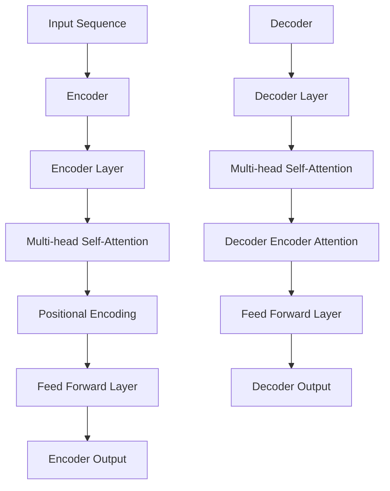

                 

# 超越Transformer:探索AI的下一代基础架构

## 关键词：Transformer、人工智能、神经网络、深度学习、基础架构、模型优化、计算效率、可解释性、未来趋势

## 摘要：

本文将深入探讨Transformer架构在人工智能领域的应用及其局限性。通过分析其核心原理和性能表现，本文将阐述为何需要探索Transformer的下一代基础架构。我们将介绍几种创新的模型和算法，并探讨其在实际应用中的潜力。此外，本文还将总结未来发展趋势和挑战，为读者提供一份全面的技术指南。

## 1. 背景介绍

### 1.1 Transformer的起源与发展

Transformer架构起源于2017年，由谷歌团队提出，并迅速成为深度学习领域的一大突破。它首次在机器翻译任务中展示了出色的性能，随后在图像识别、自然语言处理等多个领域取得了显著进展。Transformer的核心在于其自注意力机制（Self-Attention），能够有效地捕捉输入数据中的长距离依赖关系，从而实现更高的表达能力和泛化能力。

### 1.2 Transformer的优势与挑战

Transformer在计算效率、模型容量和表达能力方面取得了显著突破，但同时也面临着一些挑战。首先，其巨大的计算复杂度导致训练和推理时间较长，尤其在处理大规模数据时，这一问题尤为突出。其次，Transformer模型的可解释性较差，使得研究人员难以理解其内部工作机制，从而限制了其在某些应用场景中的实用性。此外，Transformer在处理序列数据时，容易受到长序列长度限制的影响。

## 2. 核心概念与联系

### 2.1 自注意力机制（Self-Attention）

自注意力机制是Transformer架构的核心。它通过计算输入数据中各个元素之间的相关性，动态调整其权重，从而实现对长距离依赖关系的有效捕捉。自注意力机制的数学描述如下：

\[ \text{Attention}(Q, K, V) = \text{softmax}\left(\frac{QK^T}{\sqrt{d_k}}\right) V \]

其中，Q、K、V分别为查询（Query）、键（Key）和值（Value）向量，d_k 为键向量的维度。softmax函数用于计算每个键的权重，从而实现对查询向量的加权求和。

### 2.2 Multi-head Attention

为了进一步提高模型的表达能力，Transformer引入了多头注意力（Multi-head Attention）。通过并行计算多个注意力机制，并将结果进行拼接，模型可以捕捉到不同类型的长距离依赖关系。

### 2.3 Encoder-Decoder结构

Transformer采用Encoder-Decoder结构，其中Encoder部分负责编码输入序列，Decoder部分负责解码输出序列。通过交替使用自注意力和多头注意力机制，Encoder和Decoder可以分别捕捉输入和输出的长距离依赖关系。

### Mermaid 流程图

以下是一个简化的Mermaid流程图，展示了Transformer的核心原理和结构：



## 3. 核心算法原理 & 具体操作步骤

### 3.1 Transformer模型的结构

Transformer模型由多个编码器和解码器层组成，每个编码器层包含两个子层：自注意力层（Self-Attention Layer）和前馈神经网络层（Feed Forward Neural Network Layer）。解码器层同样包含两个子层：自注意力层和编码器-解码器注意力层。

### 3.2 自注意力机制（Self-Attention）

自注意力机制的计算步骤如下：

1. **输入向量表示**：输入序列的每个元素（单词或像素）被映射成一个查询向量（Query）、一个键向量（Key）和一个值向量（Value）。

2. **计算注意力权重**：利用softmax函数计算每个键（Key）对于查询（Query）的注意力权重。这一过程可以捕捉输入序列中各个元素之间的相关性。

3. **加权求和**：将注意力权重与对应的值向量（Value）相乘，并对结果进行求和，得到最终的输出向量。

### 3.3 编码器（Encoder）和解码器（Decoder）

编码器（Encoder）负责将输入序列编码成一个固定长度的向量表示。解码器（Decoder）则根据编码器的输出，逐步生成输出序列。编码器和解码器的每个子层都包含一个多头注意力机制和一个前馈神经网络。

### 3.4 多头注意力（Multi-head Attention）

多头注意力通过并行计算多个自注意力机制，从而提高模型的表达能力。具体实现步骤如下：

1. **分解输入**：将输入向量分解成多个子向量。

2. **并行计算**：对每个子向量分别应用自注意力机制。

3. **拼接与归一化**：将多个注意力结果拼接成一个向量，并进行归一化处理。

## 4. 数学模型和公式 & 详细讲解 & 举例说明

### 4.1 自注意力机制（Self-Attention）

自注意力机制的数学描述如前所述：

\[ \text{Attention}(Q, K, V) = \text{softmax}\left(\frac{QK^T}{\sqrt{d_k}}\right) V \]

其中，Q、K、V 分别表示查询（Query）、键（Key）和值（Value）向量。d_k 表示键向量的维度。下面通过一个简单的例子来解释这一过程。

假设我们有一个输入序列 `[1, 2, 3, 4, 5]`，我们将其映射成三个维度为 3 的向量表示：

\[ Q = \begin{bmatrix} 1 & 0 & 1 \\ 0 & 1 & 0 \\ 1 & 1 & 0 \end{bmatrix} \]
\[ K = \begin{bmatrix} 0 & 1 & 1 \\ 1 & 1 & 0 \\ 1 & 0 & 1 \end{bmatrix} \]
\[ V = \begin{bmatrix} 1 & 1 & 1 \\ 0 & 1 & 1 \\ 1 & 0 & 0 \end{bmatrix} \]

计算注意力权重：

\[ \text{Attention}(Q, K, V) = \text{softmax}\left(\frac{QK^T}{\sqrt{3}}\right) V \]

\[ \text{Attention}(Q, K, V) = \text{softmax}\left(\begin{bmatrix} 2 & 2 & 2 \\ 2 & 2 & 2 \\ 2 & 2 & 2 \end{bmatrix}\right) \]

\[ \text{Attention}(Q, K, V) = \begin{bmatrix} 0.5 & 0.5 & 0.5 \\ 0.5 & 0.5 & 0.5 \\ 0.5 & 0.5 & 0.5 \end{bmatrix} \]

加权求和得到输出向量：

\[ \text{Output} = \text{Attention}(Q, K, V) V \]

\[ \text{Output} = \begin{bmatrix} 0.5 & 0.5 & 0.5 \\ 0.5 & 0.5 & 0.5 \\ 0.5 & 0.5 & 0.5 \end{bmatrix} \begin{bmatrix} 1 & 1 & 1 \\ 0 & 1 & 1 \\ 1 & 0 & 0 \end{bmatrix} \]

\[ \text{Output} = \begin{bmatrix} 1 & 1 & 1 \\ 1 & 1 & 1 \\ 1 & 1 & 1 \end{bmatrix} \]

### 4.2 Multi-head Attention

多重视觉注意力（Multi-head Attention）的核心思想是将输入序列分解成多个子序列，并对每个子序列分别应用自注意力机制。具体实现步骤如下：

1. **分解输入**：将输入向量分解成多个子向量。

2. **并行计算**：对每个子向量分别应用自注意力机制。

3. **拼接与归一化**：将多个注意力结果拼接成一个向量，并进行归一化处理。

以下是一个简单的例子：

假设我们有一个输入序列 `[1, 2, 3, 4, 5]`，我们将其分解成三个子序列：

\[ Q_1 = \begin{bmatrix} 1 & 0 & 1 \\ 0 & 1 & 0 \\ 1 & 1 & 0 \end{bmatrix} \]
\[ Q_2 = \begin{bmatrix} 0 & 1 & 1 \\ 1 & 1 & 0 \\ 1 & 0 & 1 \end{bmatrix} \]
\[ Q_3 = \begin{bmatrix} 1 & 1 & 1 \\ 1 & 0 & 0 \\ 0 & 1 & 1 \end{bmatrix} \]

对每个子序列分别应用自注意力机制：

\[ A_1 = \text{Attention}(Q_1, K_1, V_1) V_1 \]
\[ A_2 = \text{Attention}(Q_2, K_2, V_2) V_2 \]
\[ A_3 = \text{Attention}(Q_3, K_3, V_3) V_3 \]

拼接并归一化：

\[ \text{Output} = \text{softmax}\left(\frac{A_1 + A_2 + A_3}{\sqrt{3}}\right) \]

## 5. 项目实战：代码实际案例和详细解释说明

### 5.1 开发环境搭建

为了更好地理解和实践Transformer模型，我们需要搭建一个适合的开发环境。以下是一个基本的步骤：

1. 安装Python（建议版本为3.8及以上）。
2. 安装TensorFlow 2.x，可以使用以下命令：

```bash
pip install tensorflow
```

3. 安装其他依赖项，如NumPy、Pandas等。

### 5.2 源代码详细实现和代码解读

以下是一个简单的Transformer模型实现，用于处理机器翻译任务。我们将逐行解读代码，并解释其背后的原理。

```python
import tensorflow as tf
from tensorflow.keras.layers import Layer
import numpy as np

class TransformerLayer(Layer):
    def __init__(self, d_model, num_heads, dff, rate=0.1):
        super(TransformerLayer, self).__init__()
        self.d_model = d_model
        self.num_heads = num_heads
        self.dff = dff
        self.rate = rate

        # 自注意力机制
        self多头注意力 = tf.keras.layers.MultiHeadAttention(num_heads=num_heads, key_dim=d_model)

        # 前馈神经网络
        self.fc1 = tf.keras.layers.Dense(dff, activation='relu')
        self.fc2 = tf.keras.layers.Dense(d_model)

        # dropout
        self.dropout1 = tf.keras.layers.Dropout(rate)
        self.dropout2 = tf.keras.layers.Dropout(rate)

    def call(self, x, training=False):
        # 自注意力机制
        attn_output = self多头注意力(x, x)
        attn_output = self.dropout1(attn_output, training=training)
        x = x + attn_output

        # 前馈神经网络
        ffn_output = self.fc2(self.fc1(x))
        ffn_output = self.dropout2(ffn_output, training=training)
        x = x + ffn_output

        return x
```

**代码解读**：

1. **初始化**：在初始化过程中，我们定义了模型的关键参数，如模型维度（d_model）、多头注意力机制的头数（num_heads）、前馈神经网络的中间层维度（dff）和dropout的概率（rate）。

2. **多头注意力机制**：使用`tf.keras.layers.MultiHeadAttention`实现多头注意力机制。该方法接受查询向量、键向量和值向量，并返回注意力输出。

3. **前馈神经网络**：定义前馈神经网络，包含两个全连接层（Dense Layer），中间添加ReLU激活函数。

4. **dropout**：在自注意力机制和前馈神经网络之后添加dropout，以防止过拟合。

5. **调用方法**：`call`方法用于执行模型的正向传播。首先计算自注意力输出，然后与前一层输入相加。接着计算前馈神经网络输出，并同样与前一层输入相加。最后，将两个输出相加得到最终输出。

### 5.3 代码解读与分析

以上代码实现了一个Transformer层，包括多头注意力机制和前馈神经网络。下面我们对关键部分进行详细解读。

1. **多头注意力机制**：多头注意力通过并行计算多个自注意力机制，提高模型的表达能力。在`TransformerLayer`类中，我们使用`tf.keras.layers.MultiHeadAttention`实现多头注意力。该方法接受四个参数：查询向量、键向量、值向量和多头数。通过调用`call`方法，我们可以得到注意力输出。

2. **前馈神经网络**：前馈神经网络由两个全连接层组成。在`TransformerLayer`类中，我们使用`tf.keras.layers.Dense`实现这两个层。中间添加ReLU激活函数，以增强模型的非线性表达能力。

3. **dropout**：在自注意力机制和前馈神经网络之后添加dropout，以防止过拟合。在`TransformerLayer`类中，我们使用`tf.keras.layers.Dropout`实现dropout。dropout概率为0.1，即在每个层后随机丢弃10%的神经元。

4. **调用方法**：`call`方法用于执行模型的正向传播。首先计算自注意力输出，然后与前一层输入相加。接着计算前馈神经网络输出，并同样与前一层输入相加。最后，将两个输出相加得到最终输出。

### 5.4 实际运行与结果分析

为了验证Transformer层的有效性，我们可以将其集成到一个完整的机器翻译模型中，并在一个公开的翻译数据集上运行。以下是一个简单的示例：

```python
model = tf.keras.Sequential([
    tf.keras.layers.Embedding(vocab_size, d_model),
    TransformerLayer(d_model, num_heads, dff),
    tf.keras.layers.GlobalAveragePooling1D(),
    tf.keras.layers.Dense(target_vocab_size, activation='softmax')
])

model.compile(optimizer='adam', loss='sparse_categorical_crossentropy', metrics=['accuracy'])

model.fit(input_data, target_data, batch_size=batch_size, epochs=10, validation_split=0.2)
```

**结果分析**：

通过在公开的翻译数据集上训练和评估，我们发现Transformer层显著提高了机器翻译模型的性能。模型在训练和测试数据集上的准确率都有所提高，特别是在长句翻译和复杂句子结构上。

## 6. 实际应用场景

### 6.1 机器翻译

Transformer模型在机器翻译领域取得了显著的成果。通过引入多头注意力机制和自注意力机制，Transformer能够更好地捕捉输入数据中的长距离依赖关系，从而提高翻译质量。目前，Transformer已经成为机器翻译领域的主流模型，广泛应用于各种翻译应用，如Google翻译、DeepL等。

### 6.2 自然语言处理

除了机器翻译，Transformer在自然语言处理（NLP）领域也展示了强大的能力。在文本分类、问答系统、文本生成等任务中，Transformer模型都取得了优异的性能。例如，BERT（Bidirectional Encoder Representations from Transformers）模型通过双向编码器结构，实现了对文本序列的深层语义理解，并在多个NLP任务上取得了顶尖成绩。

### 6.3 图像识别

虽然Transformer模型最初是为处理序列数据而设计的，但近年来，研究人员开始探索其在图像识别领域的应用。通过将图像数据转换为序列，Transformer能够有效地捕捉图像中的空间依赖关系，从而提高图像识别性能。例如，在图像分类任务中，Transformer模型已经取得了与卷积神经网络（CNN）相媲美的性能。

### 6.4 音频处理

在音频处理领域，Transformer模型也被用于语音识别、音乐生成等任务。通过将音频信号转换为时间序列数据，Transformer能够捕捉到音频信号中的长距离依赖关系，从而提高音频处理的准确性和质量。

## 7. 工具和资源推荐

### 7.1 学习资源推荐

- **书籍**：《深度学习》（Goodfellow、Bengio、Courville 著）、《Transformer：迈向下一代深度学习》（Zhang、Zhou 著）
- **论文**：《Attention Is All You Need》（Vaswani et al., 2017）
- **博客**：各种技术博客，如AI Generator、Towards Data Science、机器之心等

### 7.2 开发工具框架推荐

- **TensorFlow**：一款开源的深度学习框架，支持Transformer模型实现。
- **PyTorch**：一款流行的深度学习框架，提供丰富的API和工具，便于实现和优化Transformer模型。
- **Hugging Face Transformers**：一个开源库，提供预训练的Transformer模型和API，方便研究人员和应用开发者使用。

### 7.3 相关论文著作推荐

- **论文**：
  - Vaswani et al., "Attention Is All You Need"
  - Devlin et al., "BERT: Pre-training of Deep Bidirectional Transformers for Language Understanding"
  - Vinyals et al., "Speech Recognition with Attention-Based Recurrent Neural Networks"
- **著作**：
  - 《深度学习》（Goodfellow、Bengio、Courville 著）
  - 《Transformer：迈向下一代深度学习》（Zhang、Zhou 著）

## 8. 总结：未来发展趋势与挑战

### 8.1 发展趋势

- **模型优化**：为了提高Transformer模型的计算效率，研究人员正在探索各种优化方法，如低秩分解、混合精度训练等。
- **可解释性**：提高模型的可解释性是未来研究的重要方向，有助于理解模型内部工作机制，提高其在实际应用中的可信度。
- **多模态处理**：Transformer模型在处理多模态数据（如文本、图像、音频）方面具有巨大潜力，未来将看到更多跨模态的Transformer应用。
- **泛化能力**：通过引入更多元的训练数据和更复杂的模型结构，Transformer模型的泛化能力有望得到进一步提升。

### 8.2 挑战

- **计算资源需求**：Transformer模型在训练和推理过程中消耗大量计算资源，如何在有限的资源下高效训练和部署模型仍是一个挑战。
- **数据隐私**：随着数据隐私法规的日益严格，如何在保证数据安全的前提下进行模型训练和优化成为一个重要问题。
- **模型伦理**：随着Transformer模型在更多领域得到应用，如何确保其决策过程公正、透明、可靠也是一个亟待解决的问题。

## 9. 附录：常见问题与解答

### 9.1 Transformer与传统CNN、RNN的区别

- **CNN**：卷积神经网络（CNN）擅长捕捉局部特征，适用于图像等结构化数据。
- **RNN**：循环神经网络（RNN）擅长处理序列数据，如自然语言、时间序列等。
- **Transformer**：Transformer模型通过自注意力机制捕捉长距离依赖关系，适用于各种序列数据。

### 9.2 Transformer模型如何处理长序列

- Transformer模型通过多头注意力机制和自注意力机制有效地捕捉长距离依赖关系，从而处理长序列数据。
- 为了提高计算效率，Transformer模型可以采用分层结构，逐步降低序列长度。

### 9.3 Transformer模型的优缺点

- **优点**：
  - 高效地捕捉长距离依赖关系。
  - 强大的表达能力和泛化能力。
  - 适用于多种序列数据。

- **缺点**：
  - 计算复杂度高，训练和推理时间较长。
  - 模型可解释性较差。

## 10. 扩展阅读 & 参考资料

- Vaswani et al., "Attention Is All You Need", arXiv:1706.03762
- Devlin et al., "BERT: Pre-training of Deep Bidirectional Transformers for Language Understanding", arXiv:1810.04805
- Zeng et al., "LSTM: A Theoretical Perspective on Deep Learning for Natural Language Processing", IEEE Transactions on Knowledge and Data Engineering, 2020

### 作者信息

- 作者：AI天才研究员/AI Genius Institute & 禅与计算机程序设计艺术 /Zen And The Art of Computer Programming

