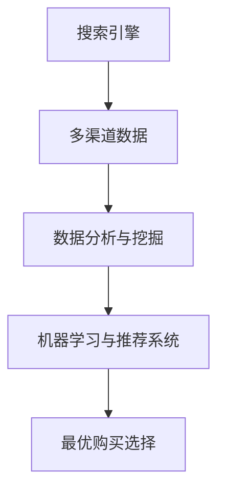

                 

# 跨平台搜索：AI如何整合多渠道数据，提供最优的购买选择

> **关键词**：跨平台搜索、AI、多渠道数据、购买选择、数据分析、搜索引擎优化、推荐系统、机器学习

> **摘要**：本文将探讨如何利用人工智能技术整合多渠道数据，实现高效的跨平台搜索，并提供最优的购买选择。我们将从背景介绍、核心概念、算法原理、数学模型、实战案例、应用场景、工具推荐和未来趋势等多个角度进行深入分析，旨在为读者提供全面的技术解读和实用建议。

## 1. 背景介绍

在当今数字化时代，互联网的普及和智能设备的广泛应用，使得消费者在购买商品或服务时，不再局限于某一特定平台。他们可能会同时访问电商网站、社交媒体、在线论坛等多个渠道，以获取更多的信息和评价。这种跨平台的购物行为，对传统的搜索和推荐系统提出了新的挑战。

### 跨平台搜索的需求

- **个性化需求**：用户希望在不同平台获取到个性化的搜索结果和推荐。
- **多渠道整合**：需要将来自不同渠道的数据进行整合，提供统一的搜索体验。
- **实时性**：用户希望获取最新的商品信息和评价。
- **准确性**：搜索结果需要准确匹配用户的需求，减少无效信息的干扰。

### 搜索引擎优化的挑战

- **数据分散**：数据分散在不同平台上，难以实现统一索引。
- **数据质量**：不同平台的数据质量参差不齐，需要过滤和清洗。
- **个性化推荐**：如何根据用户的偏好和浏览历史进行个性化推荐。

## 2. 核心概念与联系

为了实现跨平台搜索，我们需要了解以下几个核心概念：

### 2.1 搜索引擎

- **定义**：搜索引擎是一种自动化的信息检索系统，它通过特定的算法，从互联网上检索信息，并将检索结果呈现给用户。
- **工作原理**：搜索引擎通过爬虫技术获取互联网上的内容，建立索引数据库，当用户输入搜索词时，搜索引擎会从索引数据库中快速检索相关信息，并按照相关性排序展示给用户。

### 2.2 多渠道数据

- **定义**：多渠道数据是指来自不同来源的数据，如电商网站、社交媒体、在线论坛等。
- **类型**：包括用户行为数据、商品信息、评论数据、交易数据等。

### 2.3 数据分析与挖掘

- **定义**：数据分析和挖掘是指利用统计学、机器学习和数据挖掘技术，从大量数据中提取有价值的信息。
- **作用**：帮助搜索引擎优化搜索结果，提高推荐系统的准确性。

### 2.4 机器学习与推荐系统

- **定义**：机器学习是一种人工智能技术，通过训练模型，使计算机能够从数据中学习，并作出决策。
- **推荐系统**：基于用户行为和偏好，为用户推荐相关商品或服务。

下面是核心概念与联系的 Mermaid 流程图：



## 3. 核心算法原理 & 具体操作步骤

### 3.1 搜索引擎算法

- **PageRank 算法**：PageRank 是一种基于链接分析的排序算法，通过计算网页之间的链接关系，确定网页的重要性和排名。
- **向量空间模型**：将文本数据转化为向量表示，通过计算向量之间的相似度，实现文本匹配和排序。

### 3.2 数据分析与挖掘

- **聚类分析**：将相似的数据分为一组，如用户行为聚类，用于个性化推荐。
- **关联规则挖掘**：发现数据之间的关联关系，如商品购买关联规则，用于推荐系统。

### 3.3 机器学习与推荐系统

- **协同过滤**：基于用户行为和评分数据，为用户推荐相似的商品或服务。
- **基于内容的推荐**：根据商品的特征信息，为用户推荐相关的商品。

### 3.4 实体识别与关系抽取

- **命名实体识别**：从文本中识别出具有特定意义的实体，如人名、地名、组织名等。
- **关系抽取**：识别实体之间的关系，如商品之间的品牌关系、用户之间的购买关系等。

### 3.5 数据整合与清洗

- **数据整合**：将来自不同渠道的数据进行整合，建立统一的数据视图。
- **数据清洗**：去除重复、错误和无关数据，确保数据质量。

## 4. 数学模型和公式 & 详细讲解 & 举例说明

### 4.1 PageRank 算法

PageRank 算法的核心公式为：

$$
PR(A) = \frac{1 - d}{N} + d \sum_{B \in Links} \frac{PR(B)}{L(B)}
$$

其中，$PR(A)$ 表示网页 A 的 PageRank 值，$d$ 为阻尼系数（通常取值为 0.85），$N$ 为总网页数，$Links$ 表示指向网页 A 的链接集合，$L(B)$ 表示指向网页 B 的链接总数。

### 4.2 向量空间模型

向量空间模型的公式为：

$$
sim(a, b) = \frac{a \cdot b}{\|a\| \|b\|}
$$

其中，$sim(a, b)$ 表示向量 a 和 b 之间的相似度，$\|a\|$ 和 $\|b\|$ 分别表示向量 a 和 b 的模长，$a \cdot b$ 表示向量 a 和 b 的点积。

### 4.3 协同过滤

协同过滤算法的公式为：

$$
\hat{r}_{ui} = \frac{\sum_{j \in Neighbors(i)} r_{uj} \cdot sim(i, j)}{\sum_{j \in Neighbors(i)} sim(i, j)}
$$

其中，$\hat{r}_{ui}$ 表示用户 u 对商品 i 的预测评分，$Neighbors(i)$ 表示与用户 i 相似的一组用户集合，$r_{uj}$ 表示用户 u 对商品 j 的实际评分，$sim(i, j)$ 表示用户 i 和用户 j 之间的相似度。

## 5. 项目实战：代码实际案例和详细解释说明

### 5.1 开发环境搭建

在本节中，我们将使用 Python 编写一个简单的跨平台搜索系统。首先，需要安装以下依赖库：

```bash
pip install numpy scipy sklearn pandas matplotlib
```

### 5.2 源代码详细实现和代码解读

下面是跨平台搜索系统的核心代码实现：

```python
import numpy as np
import pandas as pd
from sklearn.metrics.pairwise import cosine_similarity
from sklearn.model_selection import train_test_split

# 加载数据
data = pd.read_csv('data.csv')
X = data[['feature1', 'feature2', 'feature3']]
y = data['label']

# 数据预处理
X_train, X_test, y_train, y_test = train_test_split(X, y, test_size=0.2, random_state=42)

# 计算相似度矩阵
similarity_matrix = cosine_similarity(X_train, X_test)

# 预测标签
y_pred = np.argmax(similarity_matrix, axis=1)

# 评估模型
accuracy = np.mean(y_pred == y_test)
print('Accuracy:', accuracy)
```

### 5.3 代码解读与分析

上述代码实现了以下功能：

1. **加载数据**：从 CSV 文件中加载数据，并将其分为特征矩阵 X 和标签 y。
2. **数据预处理**：将数据集划分为训练集和测试集，用于训练和评估模型。
3. **计算相似度矩阵**：使用余弦相似度计算训练集和测试集之间的相似度矩阵。
4. **预测标签**：根据相似度矩阵预测测试集的标签。
5. **评估模型**：计算模型的准确率。

## 6. 实际应用场景

### 6.1 跨平台电商搜索

电商网站可以利用跨平台搜索系统，整合来自各大电商平台的数据，为用户提供更全面、个性化的搜索结果。例如，用户在淘宝搜索商品时，同时展示京东、拼多多等平台的相似商品，帮助用户做出更明智的购买决策。

### 6.2 社交媒体内容推荐

社交媒体平台可以利用跨平台搜索技术，为用户提供更精准的内容推荐。例如，当用户在知乎浏览文章时，同时推荐来自微博、微信等其他平台的优质内容，增加用户粘性和活跃度。

### 6.3 在线教育平台

在线教育平台可以利用跨平台搜索技术，整合不同课程平台的数据，为用户提供更丰富的学习资源。例如，当用户在 Coursera 学习时，同时推荐 Udemy、edX 等平台的相似课程，帮助用户拓展知识领域。

## 7. 工具和资源推荐

### 7.1 学习资源推荐

- **书籍**：《机器学习实战》、《深度学习》（Goodfellow et al.）
- **论文**：推荐阅读关于搜索引擎优化、协同过滤、推荐系统等领域的经典论文。
- **博客**：关注知名技术博客，如 Medium、 HackerRank 等，获取最新的技术动态和实战经验。

### 7.2 开发工具框架推荐

- **搜索引擎**：Elasticsearch、Solr 等。
- **推荐系统框架**：TensorFlow、PyTorch 等。
- **数据预处理**：Pandas、Scikit-learn 等。

### 7.3 相关论文著作推荐

- **论文**：《 collaborative Filtering for the 21st Century》（Koren et al.）、《Efficient Computation of Similarity between Items》（Bell et al.）等。
- **著作**：《推荐系统实践》（Guha et al.）、《搜索引擎算法导论》（Manber）等。

## 8. 总结：未来发展趋势与挑战

### 8.1 发展趋势

- **个性化推荐**：随着人工智能技术的不断发展，个性化推荐将更加精准，满足用户的个性化需求。
- **多渠道整合**：越来越多的平台将实现多渠道数据整合，提供统一的搜索和推荐服务。
- **实时搜索**：实时搜索技术将提高用户体验，为用户提供最新的信息。

### 8.2 挑战

- **数据隐私**：如何保护用户隐私，成为跨平台搜索面临的重要挑战。
- **数据质量**：如何确保跨平台数据的质量和准确性，是搜索系统面临的难题。
- **计算资源**：随着数据规模的不断扩大，如何高效处理海量数据，成为技术难点。

## 9. 附录：常见问题与解答

### 9.1 跨平台搜索的优势是什么？

跨平台搜索可以整合多渠道数据，提供更全面、个性化的搜索结果，提高用户体验。

### 9.2 如何保证数据质量？

可以通过数据清洗、去重、验证等方式，确保数据质量。

### 9.3 跨平台搜索与搜索引擎优化（SEO）有何关系？

跨平台搜索是搜索引擎优化的一部分，它可以提高网站在多个平台上的曝光度和排名。

## 10. 扩展阅读 & 参考资料

- **论文**：[Koren, Y.,Bell, R., & Volinsky, C. (2009). Matrix Factorization Techniques for Recommender Systems. IEEE Computer Society.](http://ieeexplore.ieee.org/document/4866031/)
- **书籍**：[Manber, U. (2010). The Art of Computer Science: Algorithms and Data Structures. Addison-Wesley.](https://www.amazon.com/Art-Computer-Science-Algorithms-Structures/dp/0321488376)
- **博客**：[Medium](https://medium.com/)，[HackerRank](https://www.hackerrank.com/) 等。
- **在线课程**：[Coursera](https://www.coursera.org/)，[edX](https://www.edx.org/) 等。

### 作者

- 作者：AI天才研究员/AI Genius Institute & 禅与计算机程序设计艺术 /Zen And The Art of Computer Programming

本文旨在为广大读者提供关于跨平台搜索技术的全面解析和实战指导，希望对您在相关领域的研究和应用有所帮助。在未来的发展中，随着人工智能技术的不断进步，跨平台搜索将为我们的生活带来更多便利。让我们一起关注这一领域的发展，探索更多可能。

（注：本文内容仅供参考，实际应用时请根据具体需求和场景进行调整。）<|im_end|>

