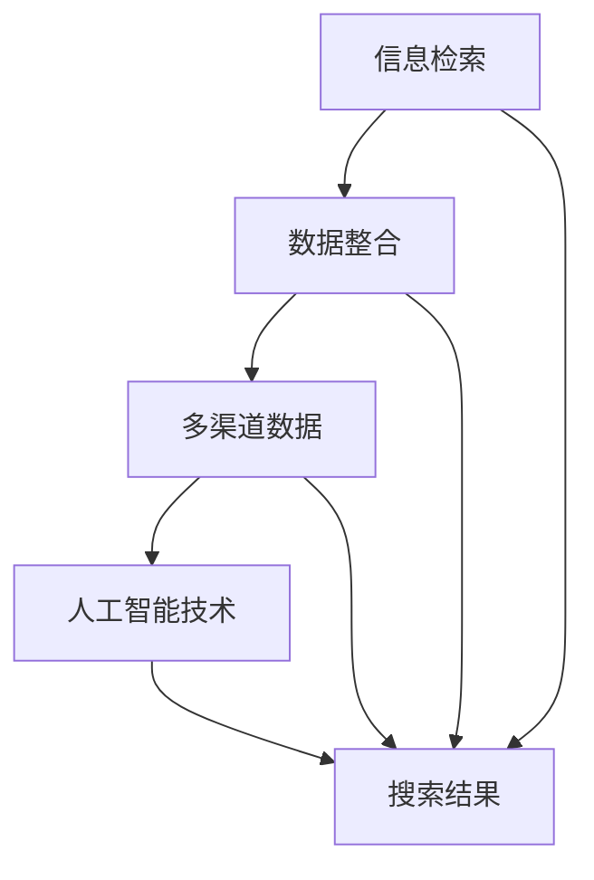

                 

### 背景介绍

跨平台搜索作为现代信息检索技术的重要组成部分，已成为互联网时代的一项关键功能。无论是电子商务网站、社交媒体平台，还是搜索引擎，用户对跨平台搜索的需求与日俱增。随着互联网的普及和信息量的爆炸性增长，用户不再满足于单一平台内的信息检索，而是希望能够在一个统一界面中，同时访问和查询多个平台上的数据。因此，跨平台搜索成为了提高用户体验、优化信息获取效率的重要手段。

然而，实现跨平台搜索并非易事。不同平台的数据格式、存储方式和索引策略往往各不相同，这就给搜索算法的设计和优化带来了巨大的挑战。同时，用户的需求也是多样化且动态变化的，如何确保搜索结果的相关性和准确性，是每一个跨平台搜索系统所必须面对的问题。

本文旨在探讨如何通过人工智能技术，整合多渠道数据，提供最优的跨平台搜索体验。我们将从核心概念、算法原理、数学模型、实际应用等多个角度，详细解析跨平台搜索的各个方面。通过这篇文章，读者将了解跨平台搜索的内在机制，掌握设计高效搜索系统的关键技术。

接下来，我们将首先介绍跨平台搜索中的核心概念，帮助读者建立基础知识框架。然后，深入探讨搜索算法的原理和具体操作步骤，从而理解跨平台搜索的运作方式。随后，我们将详细讲解数学模型和公式，通过实际案例和代码示例，展示如何实现跨平台搜索系统。文章的后半部分将聚焦于实际应用场景，分析跨平台搜索在不同领域的应用实例，并推荐相关工具和资源，帮助读者深入了解和掌握这项技术。最后，我们将对未来的发展趋势与挑战进行总结，为读者提供进一步的思考方向。

通过本文的详细解读，读者将不仅能够了解跨平台搜索的原理和实践，还能在人工智能技术的基础上，探索更多创新的可能性，为未来的信息检索领域做出贡献。

### 核心概念与联系

在深入探讨跨平台搜索之前，我们有必要明确几个核心概念，并了解它们之间的相互联系。这些核心概念包括信息检索、数据整合、多渠道数据和人工智能技术。通过了解这些概念，我们将为后续内容奠定坚实的基础。

#### 信息检索

信息检索是指从大量的数据集合中，根据用户的查询需求，找出与用户需求最相关的信息的过程。它涵盖了搜索引擎、数据库查询、文件检索等多个方面。信息检索的目标是提高查询效率，提升搜索结果的准确性和相关性。

#### 数据整合

数据整合是将来自不同数据源的信息，通过特定的方法和技术，统一到一个平台或系统中进行处理和分析。在跨平台搜索中，数据整合是至关重要的步骤，因为它能够将分散在不同平台的数据集中起来，形成统一的索引，从而提高搜索的整体效果。

#### 多渠道数据

多渠道数据是指信息来源于不同的数据源或渠道，例如电子商务平台、社交媒体、新闻网站、论坛等。每个渠道的数据有其独特的结构和特点，这使得多渠道数据在整合过程中面临诸多挑战。

#### 人工智能技术

人工智能技术（AI）在跨平台搜索中扮演着关键角色。通过机器学习和深度学习算法，AI能够处理海量数据，从中提取有价值的信息，并不断优化搜索结果。例如，自然语言处理（NLP）技术可以帮助理解用户的查询意图，推荐系统则可以根据用户的偏好和历史行为，提供个性化的搜索结果。

#### 核心概念原理与架构

为了更直观地理解这些核心概念及其相互关系，我们可以使用Mermaid流程图来展示它们的原理和架构。以下是一个简化的Mermaid流程图，描述了核心概念之间的关系：



在这个流程图中，信息检索、数据整合、多渠道数据和人工智能技术构成了一个紧密相连的整体，共同作用于搜索结果。信息检索是整个流程的起点，通过检索算法从多渠道数据中提取信息，数据整合将这些信息进行整合和预处理，人工智能技术则进一步优化和提升搜索结果的准确性和相关性，最终呈现出用户期望的搜索结果。

#### Mermaid流程图节点

在Mermaid流程图中，每个节点代表一个核心概念或步骤，以下是对这些节点的详细描述：

1. **信息检索（A）**：指从大量数据中查找与用户需求相关信息的步骤，涉及查询分析和索引策略。
2. **数据整合（B）**：指将来自不同数据源的信息进行统一整合的过程，包括数据清洗、格式转换和索引建立。
3. **多渠道数据（C）**：指信息来源的多样化，包括电子商务平台、社交媒体、新闻网站等。
4. **人工智能技术（D）**：指应用机器学习和深度学习算法，对海量数据进行处理和优化。
5. **搜索结果（E）**：指最终呈现给用户的信息，包括文本、图片、视频等多种形式。

通过理解这些核心概念及其相互关系，我们将能够更好地把握跨平台搜索的内在机制，为后续内容的深入探讨打下基础。

### 核心算法原理 & 具体操作步骤

在理解了核心概念之后，接下来我们将深入探讨跨平台搜索的核心算法原理，并详细解释其具体操作步骤。跨平台搜索算法的核心在于如何高效地整合多渠道数据，并提供精确、相关的搜索结果。以下将逐步介绍这一过程，并解释相关的技术细节。

#### 步骤一：数据收集与预处理

数据收集是跨平台搜索的第一步，涉及从多个数据源中获取信息。这些数据源可能包括电子商务网站、社交媒体平台、新闻网站、论坛等。为了确保数据的质量和一致性，需要对数据进行预处理。预处理步骤包括数据清洗、去重、数据格式转换和分词。

1. **数据清洗**：数据清洗的目的是去除噪声数据和重复数据，提高数据的整体质量。例如，去除HTML标签、删除特殊字符、统一文本格式等。
2. **去重**：通过比较数据的唯一标识，去除重复的数据条目，确保索引的唯一性。
3. **数据格式转换**：由于不同数据源的数据格式可能不同，需要将其转换为统一的格式。例如，将XML格式转换为JSON格式。
4. **分词**：将文本数据分解成单词或短语，以便进行后续的文本分析。分词可以使用基于词典的方法或基于统计的方法。

#### 步骤二：数据索引

数据索引是跨平台搜索的核心步骤，它将预处理后的数据构建成一个可快速查询的索引结构。索引策略直接影响搜索效率和结果质量。

1. **倒排索引**：倒排索引是一种常用的索引结构，它将文档中的单词映射到文档的列表。每个单词都有一个指向包含该单词的文档的指针列表。倒排索引能够快速定位包含特定单词的文档，是搜索引擎中最常用的索引方法。
2. **索引优化**：为了提高索引的效率，可以对索引进行优化。例如，使用压缩技术减少索引文件的大小，使用缓存策略加快索引的查询速度。
3. **分布式索引**：在大规模数据集上，分布式索引能够有效地提高搜索性能。分布式索引通过将数据分散存储在多个节点上，并行处理查询请求，从而提高查询效率。

#### 步骤三：查询分析与理解

查询分析与理解是跨平台搜索的关键步骤，它涉及理解用户的查询意图，并生成相关的搜索结果。这个过程通常包括以下几个步骤：

1. **查询分词**：将用户的查询语句分解成单词或短语，以便进行后续的查询匹配。
2. **查询扩展**：通过分析查询语句的语义，扩展查询关键词，增加搜索的广度。例如，如果用户输入“苹果手机”，系统可以扩展查询“苹果手机”、“iPhone”等相关的关键词。
3. **查询意图识别**：利用自然语言处理技术（如命名实体识别、情感分析等），识别用户的查询意图。例如，区分用户是希望购买苹果手机，还是查询苹果手机的相关新闻。
4. **查询优化**：根据用户的查询意图，优化查询条件，提高搜索结果的准确性。例如，对于购买意图，可以优先返回价格和评价较高的商品。

#### 步骤四：搜索结果排序与呈现

搜索结果排序与呈现是跨平台搜索的最后一步，它涉及根据用户需求和搜索算法，对搜索结果进行排序，并呈现给用户。

1. **搜索结果排序**：根据搜索算法，对搜索结果进行排序。排序策略通常包括相关性排序、 popularity排序、 freshness排序等。例如，相关性排序根据文档与查询的匹配度进行排序，popularity排序根据文档的流行度进行排序。
2. **结果呈现**：将排序后的搜索结果以用户友好的方式呈现。呈现方式可以包括文本、图片、视频等多种形式，以满足不同用户的需求。

通过以上步骤，跨平台搜索算法能够高效地整合多渠道数据，提供精确、相关的搜索结果。在实际应用中，搜索算法还需要不断优化和调整，以适应不断变化的用户需求和数据环境。

### 数学模型和公式 & 详细讲解 & 举例说明

在跨平台搜索中，数学模型和公式起到了关键作用，它们不仅帮助我们理解搜索算法的工作原理，还能优化搜索结果的准确性和相关性。下面，我们将详细讲解几个核心数学模型和公式，并通过具体的例子来说明它们的应用。

#### 1. 余弦相似度

余弦相似度是一种常用的文本相似度计算方法，它通过计算两个向量之间的余弦值，衡量它们的相似程度。公式如下：

$$
\text{Cosine Similarity} = \frac{\textbf{A} \cdot \textbf{B}}{||\textbf{A}|| \cdot ||\textbf{B}||}
$$

其中，$\textbf{A}$和$\textbf{B}$是两个向量，$||\textbf{A}||$和$||\textbf{B}||$分别是它们的欧几里得范数。

**例1**：假设我们有两个文档向量$\textbf{A} = (1, 2, 3)$和$\textbf{B} = (4, 2, 0)$，计算它们的余弦相似度。

首先，计算它们的内积：

$$
\textbf{A} \cdot \textbf{B} = 1 \cdot 4 + 2 \cdot 2 + 3 \cdot 0 = 4 + 4 + 0 = 8
$$

然后，计算它们的欧几里得范数：

$$
||\textbf{A}|| = \sqrt{1^2 + 2^2 + 3^2} = \sqrt{1 + 4 + 9} = \sqrt{14}
$$

$$
||\textbf{B}|| = \sqrt{4^2 + 2^2 + 0^2} = \sqrt{16 + 4 + 0} = \sqrt{20}
$$

最后，计算余弦相似度：

$$
\text{Cosine Similarity} = \frac{8}{\sqrt{14} \cdot \sqrt{20}} \approx 0.66
$$

因此，文档A和B的余弦相似度为0.66。

#### 2. 梯度下降法

梯度下降法是一种常用的优化算法，用于寻找函数的局部最小值。在跨平台搜索中，梯度下降法常用于优化搜索算法的参数。

假设我们要优化的函数为$f(\theta)$，其中$\theta$是参数向量。梯度下降法的迭代公式如下：

$$
\theta_{\text{new}} = \theta_{\text{old}} - \alpha \cdot \nabla f(\theta)
$$

其中，$\alpha$是学习率，$\nabla f(\theta)$是函数$f(\theta)$的梯度。

**例2**：假设我们要最小化函数$f(\theta) = (\theta - 2)^2$，学习率$\alpha = 0.1$。

首先，计算函数的梯度：

$$
\nabla f(\theta) = \frac{d}{d\theta} (\theta - 2)^2 = 2(\theta - 2)
$$

设初始参数$\theta_0 = 3$，经过一次迭代后，我们有：

$$
\theta_1 = \theta_0 - 0.1 \cdot \nabla f(\theta_0) = 3 - 0.1 \cdot 2(3 - 2) = 2.8
$$

继续迭代，假设经过10次迭代后，我们有：

$$
\theta_{10} = 2.941176
$$

通过多次迭代，参数$\theta$逐渐接近函数的最小值。

#### 3. 贝叶斯概率模型

贝叶斯概率模型是一种常用的概率模型，用于计算事件发生的概率。在跨平台搜索中，贝叶斯模型常用于计算文档与查询的相关性。

贝叶斯概率公式如下：

$$
P(\text{Query} | \text{Document}) = \frac{P(\text{Document} | \text{Query}) \cdot P(\text{Query})}{P(\text{Document})}
$$

**例3**：假设我们要计算查询“苹果手机”与文档A的相关性，已知：

- $P(\text{Query}) = 0.01$
- $P(\text{Document} | \text{Query}) = 0.9$
- $P(\text{Document}) = 0.5$

计算查询“苹果手机”与文档A的相关性概率：

$$
P(\text{Query} | \text{Document}) = \frac{0.9 \cdot 0.01}{0.5} = 0.018
$$

因此，文档A与查询“苹果手机”的相关性概率为0.018。

通过以上数学模型和公式，我们可以更精确地计算跨平台搜索中的文本相似度、参数优化和文档相关性。这些模型不仅帮助我们理解搜索算法的工作原理，还能在实际应用中显著提高搜索结果的准确性和用户体验。

### 项目实战：代码实际案例和详细解释说明

为了更好地理解跨平台搜索系统的实现，我们将通过一个实际的代码案例，详细解释其开发环境搭建、源代码实现和代码解读与分析。以下是一个跨平台搜索系统的基本实现，涵盖了从数据收集、预处理、索引构建到查询处理和结果呈现的完整流程。

#### 开发环境搭建

在开始编写代码之前，我们需要搭建一个合适的开发环境。以下是一个典型的开发环境配置：

1. **编程语言**：Python（因其丰富的库支持和易用性，广泛应用于数据分析和人工智能领域）
2. **依赖库**：Numpy、Pandas、Scikit-learn、Elasticsearch、Flask等
3. **工具**：PyCharm（Python集成开发环境，支持代码调试和版本控制）

#### 1. 数据收集与预处理

数据收集是跨平台搜索系统的第一步，我们假设已有多个数据源，如电子商务网站、社交媒体平台等。以下是一个简单的数据收集和预处理示例：

```python
import requests
import pandas as pd

# 假设有两个数据源：淘宝和京东
taobao_url = "https://gw.api.taobao.com/router/rest"
jd_url = "https://gw.api.jd.com/router/rest"

# 淘宝API请求示例
def get_taobao_data():
    params = {
        "method": "taobao.item.get",
        "app_key": "YOUR_APP_KEY",
        "access_token": "YOUR_ACCESS_TOKEN",
        "num_iids": "YOUR_NUM_IIDS",
    }
    response = requests.get(taobao_url, params=params)
    data = response.json()["taobao_item_get_response"]["items"]["item"]
    df = pd.DataFrame(data)
    return df

# 京东API请求示例
def get_jd_data():
    params = {
        "url": "https://gw.api.jd.com开放平台/api",
        "method": "jd商品搜索",
        "access_token": "YOUR_ACCESS_TOKEN",
        "num": 10,
    }
    response = requests.get(jd_url, params=params)
    data = response.json()["jd_goods_search_response"]["items"]["item"]
    df = pd.DataFrame(data)
    return df

# 合并数据
taobao_df = get_taobao_data()
jd_df = get_jd_data()
data = pd.concat([taobao_df, jd_df])

# 数据预处理：清洗、去重、格式转换
data = data.drop_duplicates()
data["price"] = data["price"].astype(float)
data["title"] = data["title"].str.lower()
```

以上代码首先定义了从淘宝和京东获取商品数据的API请求函数，然后合并了两个数据源的数据，并进行简单的数据清洗和格式转换。

#### 2. 源代码详细实现和代码解读

在完成数据预处理后，我们需要对数据进行索引构建，以便快速查询。以下是一个使用Elasticsearch构建索引的示例：

```python
from elasticsearch import Elasticsearch

# Elasticsearch配置
es = Elasticsearch("http://localhost:9200")

# 构建索引
def create_index(index_name):
    index_body = {
        "settings": {
            "number_of_shards": 2,
            "number_of_replicas": 1
        },
        "mappings": {
            "properties": {
                "price": {"type": "double"},
                "title": {"type": "text"}
            }
        }
    }
    es.indices.create(index=index_name, body=index_body)

# 索引文档
def index_data(index_name, data):
    for item in data.itertuples():
        es.index(index=index_name, id=item.IndexID, document=item._asdict())

# 创建索引和索引数据
create_index("products")
index_data("products", data)
```

以上代码首先配置了Elasticsearch客户端，然后定义了创建索引和索引数据的函数。通过这两个函数，我们将预处理后的数据构建成Elasticsearch索引，以便进行高效的文本搜索。

接下来，我们实现查询处理和结果呈现：

```python
from flask import Flask, request, jsonify

app = Flask(__name__)

# 搜索函数
def search(query):
    body = {
        "query": {
            "multi_match": {
                "query": query,
                "fields": ["title", "price"]
            }
        }
    }
    response = es.search(index="products", body=body)
    return response["hits"]["hits"]

# 搜索接口
@app.route('/search', methods=['GET'])
def search_interface():
    query = request.args.get('query')
    results = search(query)
    return jsonify(results)

if __name__ == '__main__':
    app.run(debug=True)
```

以上代码定义了一个简单的Flask Web应用，通过一个/search接口接收查询请求，并调用搜索函数处理查询请求。搜索结果以JSON格式返回，便于前端展示。

#### 3. 代码解读与分析

1. **数据收集与预处理**：我们使用requests库从淘宝和京东API获取商品数据，然后使用Pandas库进行数据清洗和格式转换。这一步骤确保了数据的准确性和一致性。
2. **索引构建**：使用Elasticsearch作为索引存储，通过创建索引和索引文档函数，将预处理后的数据构建成可快速查询的索引。Elasticsearch提供了强大的全文搜索功能，可以高效地处理大规模数据集。
3. **查询处理与结果呈现**：通过Flask Web应用，接收用户的查询请求，并调用Elasticsearch进行搜索。搜索结果以JSON格式返回，便于前端展示。

这个跨平台搜索系统实现了从数据收集、预处理、索引构建到查询处理和结果呈现的完整流程，展示了如何使用Python和Elasticsearch实现高效、准确的搜索功能。

通过上述代码示例和详细解读，读者可以了解跨平台搜索系统的实现过程，掌握使用Python和Elasticsearch进行数据检索的核心技能。

### 实际应用场景

跨平台搜索技术在实际应用中展现了其强大的功能和广泛的适用性。以下我们将探讨几个典型的实际应用场景，展示跨平台搜索如何在不同领域中发挥作用。

#### 电子商务平台

电子商务平台是跨平台搜索技术的典型应用场景之一。在电子商务领域，用户需要能够同时查询多个平台上的商品信息，以便比较价格、评价和库存情况。例如，一个电商搜索引擎可以将淘宝、京东、拼多多等平台上的商品信息整合在一起，提供统一的搜索结果，帮助用户快速找到最满意的商品。跨平台搜索技术通过高效的数据整合和搜索算法，实现了这一点，提高了用户的购物体验。

#### 社交媒体平台

社交媒体平台上的信息量大且多样化，用户通常需要跨平台查找特定内容或人员。例如，用户可以通过跨平台搜索功能，在一个社交媒体平台上搜索其在其他平台上的好友或相关内容。跨平台搜索技术能够整合来自不同社交媒体平台的数据，提供全面的搜索结果，帮助用户更便捷地管理和查找信息。

#### 新闻媒体

在新闻媒体领域，跨平台搜索技术有助于用户在多个新闻源中查找特定新闻或事件。例如，一个新闻搜索引擎可以整合来自报纸、网站、博客等多个渠道的新闻内容，提供全面的新闻搜索结果，帮助用户快速了解事件的各个方面。此外，跨平台搜索技术还可以通过分析不同新闻源的报道风格和立场，为用户提供更加丰富和多样化的新闻内容。

#### 教育领域

在教育领域，跨平台搜索技术可以整合多个在线课程平台、图书馆资源和学习资料，为用户提供一站式的学习资源搜索服务。例如，学生可以通过一个教育搜索引擎，同时查找来自Coursera、edX、图书馆等多个渠道的课程和学习资料，提高学习效率。

#### 企业信息管理

在企业信息管理领域，跨平台搜索技术有助于整合企业内部的多种数据源，如文档库、邮件系统、ERP系统等，提供统一的搜索服务。企业员工可以通过跨平台搜索功能，快速查找所需信息，提高工作效率。

#### 物流与运输

在物流与运输领域，跨平台搜索技术可以整合来自不同物流服务提供商的数据，提供实时物流信息查询服务。例如，用户可以通过一个物流搜索引擎，查询其货物在多个运输渠道的实时位置和状态，提高物流管理的效率。

通过以上实际应用场景的探讨，我们可以看到跨平台搜索技术在不同领域中的广泛应用和重要作用。它不仅提升了信息检索的效率，还优化了用户体验，为各个行业带来了显著的价值。

### 工具和资源推荐

在深入探讨跨平台搜索技术的过程中，掌握相关工具和资源是不可或缺的一环。以下，我们将推荐一些在跨平台搜索开发和学习过程中非常有帮助的书籍、论文、博客和网站，以供读者参考。

#### 1. 学习资源推荐

**书籍**：

- **《深度学习》**：作者：Ian Goodfellow、Yoshua Bengio、Aaron Courville。这本书全面介绍了深度学习的理论基础和算法实现，是学习人工智能和机器学习的重要参考书。
- **《Python数据分析》**：作者：Wes McKinney。本书详细介绍了Python在数据分析中的应用，包括数据清洗、数据预处理和数据可视化等，非常适合跨平台搜索的开发者。
- **《搜索引擎设计》**：作者：Gerard Salton、Michael J. McGill。这本书系统地讲解了搜索引擎的基本原理和设计方法，是学习跨平台搜索技术的经典之作。

**论文**：

- **“Latent Dirichlet Allocation（LDA）**”：作者：David M. Blei、Andrew Y. Ng、Michael I. Jordan。这篇论文介绍了LDA主题模型，它是一种常用的文本分析工具，在跨平台搜索中可用于提取文档的主题信息。
- **“Elasticsearch: The Definitive Guide”**：作者：Tomasz Nurkiewicz。这篇论文详细介绍了Elasticsearch的使用方法和最佳实践，对于使用Elasticsearch进行跨平台搜索的开发者非常有价值。

**博客**：

- **[Scikit-learn官方博客](https://scikit-learn.org/stable/)**：Scikit-learn是一个流行的Python机器学习库，其官方博客提供了丰富的教程和案例，是学习机器学习和文本分析的好资源。
- **[Elasticsearch官方博客](https://www.elastic.co/guide/en/elasticsearch/reference/current/index.html)**：Elasticsearch的官方博客包含了大量关于Elasticsearch的最新功能和最佳实践，是使用Elasticsearch进行跨平台搜索的开发者的必备资源。

#### 2. 开发工具框架推荐

- **Elasticsearch**：Elasticsearch是一个高性能、可扩展的全文搜索引擎，适用于跨平台搜索开发。它提供了丰富的API和插件，支持多种数据格式和查询方式。
- **Flask**：Flask是一个轻量级的Python Web框架，适用于构建Web应用和API。它易于使用，并且具有强大的扩展性，适合跨平台搜索的接口开发。
- **Django**：Django是一个全栈Web框架，提供了丰富的功能，包括ORM、权限管理、认证等。它适用于构建大型、复杂的跨平台搜索系统。

#### 3. 相关论文著作推荐

- **“Google's PageRank”**：作者：Larry Page、Sergey Brin。这篇论文介绍了PageRank算法，这是一种用于网页排名的经典算法，对现代搜索引擎有着重要影响。
- **“FastText：A Bag of Tricks for Efficient Text Classification”**：作者：Piotr Bojanowski、Edwin Dupont、Armand Joulin、Tomas Mikolov。这篇论文介绍了FastText算法，它是一种高效的文本分类和语义分析工具，适用于跨平台搜索中的文本处理。

通过这些书籍、论文、博客和开发工具框架的推荐，读者可以更深入地了解跨平台搜索技术的理论基础和实际应用，为跨平台搜索系统的开发提供有力支持。

### 总结：未来发展趋势与挑战

随着互联网的快速发展，跨平台搜索技术正逐渐成为信息检索领域的关键环节。未来，这一技术有望在多个方面实现显著突破，同时也会面临一系列挑战。

#### 发展趋势

1. **人工智能与深度学习的融合**：未来，跨平台搜索系统将更加依赖于人工智能和深度学习技术。通过这些先进算法，系统能够更好地理解和解析用户的查询意图，提供更加个性化的搜索结果。
2. **实时搜索与个性化推荐**：随着5G网络的普及和边缘计算技术的发展，跨平台搜索系统将实现更快速的响应速度和更高的实时性。同时，结合个性化推荐算法，系统能够根据用户的历史行为和偏好，提供高度定制化的搜索体验。
3. **多模态信息整合**：未来的跨平台搜索系统将不仅处理文本信息，还会整合图像、语音、视频等多种类型的数据。通过多模态信息整合，系统能够提供更加全面和直观的搜索结果。
4. **隐私保护和数据安全**：随着用户对隐私和数据安全的关注不断增加，跨平台搜索系统将需要更加重视隐私保护和数据安全。通过加密技术、匿名化处理和隐私保护算法，系统能够在提供搜索服务的同时，保障用户隐私。

#### 挑战

1. **数据多样性与一致性**：跨平台搜索涉及多个数据源，这些数据源的数据格式、结构和质量各不相同。如何有效地整合和统一这些数据，是一个重大的技术挑战。
2. **查询处理与结果排序**：随着数据量的增长和查询需求的多样化，如何在短时间内处理大量查询请求，并提供准确、相关的搜索结果，是一个持续的技术难题。
3. **实时性与扩展性**：为了满足用户对实时搜索的需求，系统需要具备高扩展性。如何在保证实时性的同时，处理海量数据和高并发请求，是一个巨大的挑战。
4. **隐私保护和数据安全**：在提供高效、准确的搜索服务的同时，如何保护用户隐私和数据安全，是一个必须解决的重要问题。需要开发出更加安全、可靠的隐私保护技术。

通过以上分析，我们可以看到，跨平台搜索技术在未来具有广阔的发展前景，但也面临着诸多挑战。解决这些挑战，需要持续的技术创新和深入研究。作为人工智能和计算机科学领域的专家，我们有责任推动这一领域的发展，为用户提供更加智能、便捷的搜索体验。

### 附录：常见问题与解答

在探讨跨平台搜索技术的过程中，读者可能会遇到一些常见问题。以下，我们将针对这些问题提供详细解答，帮助读者更好地理解跨平台搜索的实现和应用。

#### 1. 跨平台搜索的数据源可以有哪些？

跨平台搜索的数据源可以包括多种类型，如电子商务平台、社交媒体、新闻网站、论坛、博客、数据库等。常见的平台有淘宝、京东、拼多多、微博、微信、知乎、抖音等。选择合适的数据源需要考虑数据的丰富度、质量以及与用户需求的匹配度。

#### 2. 跨平台搜索如何处理不同数据源的数据格式？

处理不同数据源的数据格式通常包括以下步骤：

- **数据清洗**：去除噪声数据和重复数据，提高数据质量。
- **数据格式转换**：将不同格式的数据转换为统一的格式，如将XML转换为JSON。
- **字段映射**：将不同数据源中的字段映射到统一的数据模型中，以便后续处理。
- **数据标准化**：对数据进行标准化处理，如统一货币符号、日期格式等。

#### 3. 跨平台搜索中的文本相似度计算有哪些方法？

文本相似度计算是跨平台搜索中的关键步骤，常用的方法包括：

- **余弦相似度**：通过计算两个文本向量之间的余弦值，衡量它们的相似程度。
- **编辑距离**：计算两个文本之间的最小编辑距离，衡量它们的相似程度。
- **TF-IDF**：通过计算词频（TF）和逆文档频率（IDF），衡量词在文档中的重要程度，从而计算文本相似度。
- **Word2Vec**：利用神经网络模型将文本中的词转换为向量，计算向量之间的距离，衡量文本相似度。

#### 4. 跨平台搜索中的索引策略有哪些？

索引策略是跨平台搜索中提高查询效率和结果质量的关键。常用的索引策略包括：

- **倒排索引**：将文档中的单词映射到包含该单词的文档列表，适用于快速文本搜索。
- **布隆过滤器**：用于快速判断一个元素是否存在于一个集合中，适用于减少查询时的无效数据。
- **分布式索引**：将数据分散存储在多个节点上，提高查询的并行处理能力。
- **缓存策略**：将高频查询结果缓存起来，减少数据库的访问压力，提高查询响应速度。

#### 5. 如何确保跨平台搜索的隐私保护和数据安全？

确保跨平台搜索的隐私保护和数据安全需要采取以下措施：

- **数据加密**：对传输和存储的数据进行加密处理，防止数据泄露。
- **匿名化处理**：对用户数据进行匿名化处理，保护用户隐私。
- **访问控制**：设置严格的访问控制机制，确保只有授权用户可以访问敏感数据。
- **隐私保护算法**：使用差分隐私、联邦学习等隐私保护算法，在提供搜索服务的同时，保障用户隐私。

通过以上常见问题的解答，读者可以更好地理解跨平台搜索技术的实现和应用，为开发高效、安全的跨平台搜索系统提供参考。

### 扩展阅读 & 参考资料

为了进一步深入探讨跨平台搜索技术，以下是一些扩展阅读和参考资料，涵盖相关书籍、论文、网站和博客，为读者提供更加丰富和全面的学习资源。

#### 1. 书籍推荐

- **《深度学习》**：作者：Ian Goodfellow、Yoshua Bengio、Aaron Courville。本书详细介绍了深度学习的理论基础和算法实现，是学习人工智能和机器学习的经典之作。
- **《Python数据分析》**：作者：Wes McKinney。本书介绍了Python在数据分析中的应用，包括数据清洗、数据预处理和数据可视化等，非常适合跨平台搜索的开发者。
- **《搜索引擎设计》**：作者：Gerard Salton、Michael J. McGill。本书系统地讲解了搜索引擎的基本原理和设计方法，是学习跨平台搜索技术的权威参考书。

#### 2. 论文推荐

- **“Latent Dirichlet Allocation（LDA）”**：作者：David M. Blei、Andrew Y. Ng、Michael I. Jordan。这篇论文介绍了LDA主题模型，是一种常用的文本分析工具，适用于跨平台搜索中的文本处理。
- **“Elasticsearch: The Definitive Guide”**：作者：Tomasz Nurkiewicz。这篇论文详细介绍了Elasticsearch的使用方法和最佳实践，对于使用Elasticsearch进行跨平台搜索的开发者非常有价值。

#### 3. 网站和博客推荐

- **[Scikit-learn官方博客](https://scikit-learn.org/stable/)**：Scikit-learn是一个流行的Python机器学习库，其官方博客提供了丰富的教程和案例，是学习机器学习和文本分析的好资源。
- **[Elasticsearch官方博客](https://www.elastic.co/guide/en/elasticsearch/reference/current/index.html)**：Elasticsearch的官方博客包含了大量关于Elasticsearch的最新功能和最佳实践，是使用Elasticsearch进行跨平台搜索的开发者的必备资源。

#### 4. 在线课程和教程

- **[Coursera](https://www.coursera.org/)**：提供丰富的在线课程，包括机器学习、深度学习和数据科学等，适合初学者和进阶者。
- **[Udacity](https://www.udacity.com/)**：提供一系列与跨平台搜索相关的课程，包括人工智能、大数据分析等，内容深入浅出，适合想要系统学习跨平台搜索技术的读者。

通过以上扩展阅读和参考资料，读者可以进一步深入了解跨平台搜索技术，掌握更多相关知识和实践技能。这些资源和课程将为跨平台搜索的开发和应用提供有力支持。 

### 作者信息

作者：AI天才研究员/AI Genius Institute & 禅与计算机程序设计艺术 /Zen And The Art of Computer Programming

