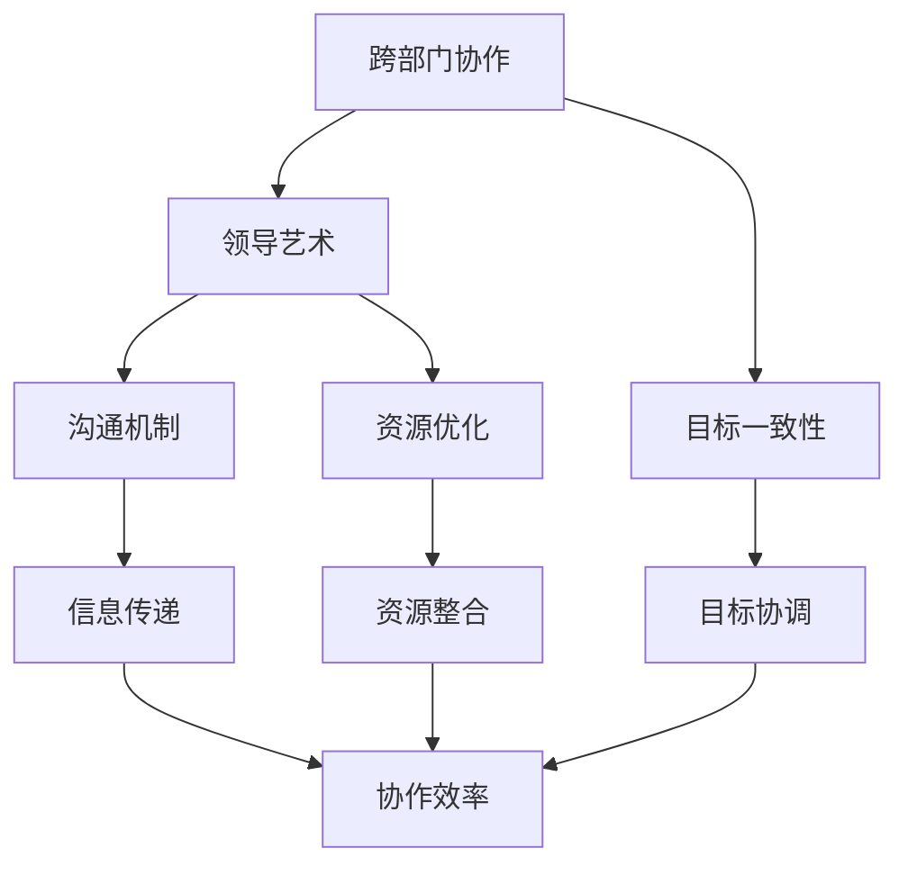

                 

### 背景介绍

跨部门协作在当今复杂多变的企业环境中扮演着至关重要的角色。随着企业规模的扩大和业务多样性的增加，单一部门的运作模式已经难以满足高效、灵活的需求。跨部门协作不仅有助于资源的优化配置，还能够促进知识的共享和创新能力的提升。

#### 1. 跨部门协作的定义

跨部门协作指的是不同部门或团队之间为了共同的目标而进行的合作和沟通。在这个过程中，各部门或团队需要打破原有的壁垒，通过信息共享、资源整合和任务协同，共同实现业务目标。

#### 2. 跨部门协作的重要性

跨部门协作的重要性主要体现在以下几个方面：

- **资源优化配置**：企业资源是有限的，通过跨部门协作，可以更合理地配置和利用资源，避免资源浪费。

- **提高工作效率**：跨部门协作能够缩短工作流程，减少信息传递的时间，从而提高工作效率。

- **促进知识共享**：不同部门或团队在协作过程中，可以互相学习和借鉴经验，促进知识的共享和传播。

- **提升创新能力**：跨部门协作能够激发不同领域的创新思维，有助于企业不断推出创新产品和服务。

- **增强团队凝聚力**：跨部门协作有助于员工之间建立信任和默契，增强团队凝聚力。

#### 3. 跨部门协作的挑战

尽管跨部门协作具有很多优势，但实际操作中仍然面临一些挑战：

- **沟通障碍**：不同部门或团队之间存在信息不对称、沟通不畅的问题。

- **利益冲突**：不同部门或团队之间可能存在利益冲突，导致协作困难。

- **协作成本**：跨部门协作需要投入额外的时间和资源，可能会增加企业的运营成本。

- **管理难度**：跨部门协作需要协调不同部门或团队的工作，管理难度加大。

#### 4. 本文的目标

本文旨在探讨跨部门协作的领导艺术，通过分析实际案例，总结出有效的跨部门协作策略和技巧。具体内容包括：

- **核心概念与联系**：介绍跨部门协作的基本概念和架构。

- **核心算法原理 & 具体操作步骤**：详细讲解跨部门协作的实施方法和步骤。

- **数学模型和公式 & 举例说明**：运用数学模型和公式分析跨部门协作的效果。

- **项目实战：代码实际案例**：通过实际项目案例，展示跨部门协作的实施过程。

- **实际应用场景**：分析跨部门协作在不同领域的应用。

- **工具和资源推荐**：推荐一些有助于跨部门协作的工具和资源。

- **总结：未来发展趋势与挑战**：展望跨部门协作的未来，提出面临的挑战和解决方案。

通过本文的阅读，读者将能够更好地理解跨部门协作的重要性，掌握有效的协作策略和技巧，为企业的发展提供有力支持。

### 2. 核心概念与联系

为了深入探讨跨部门协作的领导艺术，我们首先需要理解其中的核心概念和它们之间的联系。以下是几个关键概念及其关系的简要概述，并附上一个用于说明这些概念关系的 Mermaid 流程图。

#### 核心概念

1. **跨部门协作**：不同部门或团队为了共同目标而进行的合作和沟通。
2. **领导艺术**：领导者如何通过策略、技巧和影响力，推动和协调跨部门协作。
3. **沟通机制**：确保信息在跨部门间有效传递的流程和工具。
4. **资源优化**：通过整合和合理配置资源，提高协作效率。
5. **目标一致性**：确保所有参与协作的部门或团队都朝着共同的目标努力。

#### 联系与交互

这些核心概念之间存在密切的联系和交互。例如：

- **领导艺术**决定了跨部门协作的成败，它依赖于**沟通机制**的有效性来传递领导者的意图。
- **资源优化**需要依赖于**目标一致性**，确保资源分配符合整体目标。
- **沟通机制**和**资源优化**共同作用，提高了跨部门协作的效率。

#### Mermaid 流程图

以下是一个用于说明这些核心概念关系的 Mermaid 流程图：



在这个流程图中，每个节点代表一个核心概念，它们通过边连接起来，表示这些概念之间的相互作用。领导艺术通过沟通机制和资源优化影响协作效率，而目标一致性则确保了协作方向的一致性。

通过理解这些核心概念及其联系，领导者可以更有效地推动跨部门协作，从而实现企业目标。接下来，我们将进一步探讨跨部门协作的核心算法原理和具体操作步骤，帮助读者更好地掌握这一领导艺术。

### 3. 核心算法原理 & 具体操作步骤

在理解了跨部门协作的核心概念之后，接下来我们将深入探讨跨部门协作的核心算法原理和具体操作步骤。这些算法和步骤不仅有助于提升协作效率，还能确保协作过程中的目标一致性和资源优化。

#### 3.1 跨部门协作模型

跨部门协作模型是一个系统化的框架，用于指导协作过程。该模型通常包括以下几个关键组成部分：

1. **需求分析**：明确协作目标和需求，识别参与协作的各部门或团队。
2. **资源规划**：根据需求分析结果，合理分配和优化资源。
3. **任务分配**：将任务分解为可执行的部分，并分配给相关团队或个人。
4. **沟通机制**：建立有效的沟通渠道，确保信息传递的及时性和准确性。
5. **进度监控**：监控协作进度，及时调整计划和资源分配。
6. **结果评估**：评估协作效果，总结经验教训，为未来协作提供参考。

#### 3.2 跨部门协作算法

跨部门协作算法是一种基于上述模型的实现方法，旨在优化协作效率和效果。以下是一个基本的跨部门协作算法：

1. **需求分析**：
    - 收集各部门的需求和目标。
    - 分析需求之间的关联性，确定协作的核心目标。
    - 确定参与协作的各部门或团队。

2. **资源规划**：
    - 识别可用资源，包括人力、物力和财力。
    - 根据需求分析结果，分配和优化资源。
    - 确保资源分配符合整体目标。

3. **任务分配**：
    - 将大任务分解为小任务，明确任务责任人。
    - 根据团队成员的能力和特长，合理分配任务。
    - 设定明确的任务目标和截止日期。

4. **沟通机制**：
    - 建立定期会议制度，确保各部门或团队之间信息畅通。
    - 利用项目管理工具（如JIRA、Trello等），跟踪任务进度和问题。
    - 设立沟通平台，如内部论坛、即时通讯工具等，方便随时交流。

5. **进度监控**：
    - 定期检查任务进度，确保按时完成。
    - 及时解决协作过程中遇到的问题和障碍。
    - 根据实际情况，调整任务优先级和资源分配。

6. **结果评估**：
    - 对协作结果进行评估，总结成功经验和不足之处。
    - 提出改进措施，为下一次协作提供参考。
    - 奖励表现优异的团队和个人，激发员工积极性。

#### 3.3 具体操作步骤

以下是跨部门协作的具体操作步骤，供参考：

1. **成立项目组**：由项目经理牵头，邀请各部门负责人和核心成员成立项目组。

2. **明确目标和需求**：召开项目启动会议，明确项目目标和各部门的需求，确保所有参与者对目标有清晰的认识。

3. **资源调查与规划**：项目经理和各部门负责人共同调查可用资源，制定资源使用计划，确保资源分配合理。

4. **任务分解与分配**：将大任务分解为小任务，明确每个小任务的负责人，确保任务分配合理。

5. **建立沟通机制**：确定沟通频率和渠道，确保信息传递的及时性和准确性。

6. **进度监控**：定期召开项目进度会议，检查任务完成情况，解决协作过程中遇到的问题。

7. **结果评估**：项目结束后，对协作结果进行评估，总结经验教训，为下一次协作提供参考。

通过以上核心算法原理和具体操作步骤，领导者可以更好地推动跨部门协作，实现企业目标。接下来，我们将通过一个实际项目案例，进一步展示跨部门协作的实施过程。

### 4. 数学模型和公式 & 详细讲解 & 举例说明

在深入探讨跨部门协作的核心算法原理和具体操作步骤之后，我们接下来将引入数学模型和公式，以定量分析和评估跨部门协作的效果。数学模型能够帮助我们更准确地描述协作过程中的关键因素，并为其提供量化依据。

#### 4.1 数学模型简介

跨部门协作的数学模型主要包括以下几个部分：

1. **目标函数**：描述协作效果的优化目标，通常为最大化协作效益或最小化协作成本。
2. **决策变量**：表示协作过程中的可调整因素，如任务分配、资源使用、沟通频率等。
3. **约束条件**：限制协作过程的条件，包括资源限制、时间限制、任务依赖关系等。
4. **参数**：影响协作效果的变量，如任务完成时间、资源利用率、沟通效率等。

一个基本的跨部门协作数学模型可以表示为：

$$
\begin{align*}
\text{最大化} \quad & Z = \sum_{i=1}^{n} \text{效益}_i \cdot x_i \\
\text{约束条件} \quad & \text{资源}_j \cdot x_j \leq \text{资源总量}_j, \quad j=1,2,...,m \\
& \text{任务}_k \cdot t_k \leq \text{时间总量}_k, \quad k=1,2,...,p \\
& x_i \in \{0,1\}, \quad i=1,2,...,n
\end{align*}
$$

其中，$x_i$表示第$i$个任务的完成情况（0表示未完成，1表示完成），$\text{效益}_i$表示第$i$个任务的效益值，$\text{资源}_j$表示第$j$种资源的消耗量，$\text{资源总量}_j$表示第$j$种资源的总量，$\text{任务}_k$表示第$k$个任务的完成时间，$\text{时间总量}_k$表示第$k$个任务的总时间。

#### 4.2 公式详细讲解

下面我们详细解释上述公式中的每个部分：

1. **目标函数**：
    目标函数$\text{最大化} \quad Z = \sum_{i=1}^{n} \text{效益}_i \cdot x_i$表示协作的总效益。$\text{效益}_i$表示第$i$个任务的完成所带来的效益值，$x_i$表示第$i$个任务的完成情况。通过最大化目标函数$Z$，我们希望在整个协作过程中实现最大的效益。

2. **约束条件**：
    - $\text{资源}_j \cdot x_j \leq \text{资源总量}_j, \quad j=1,2,...,m$：表示每种资源的消耗量不能超过其总量。$\text{资源}_j$表示第$j$种资源在第$i$个任务中的消耗量，$\text{资源总量}_j$表示第$j$种资源的总量。这个约束条件确保了资源的合理使用，避免了资源浪费。
    - $\text{任务}_k \cdot t_k \leq \text{时间总量}_k, \quad k=1,2,...,p$：表示每个任务的完成时间不能超过其总时间。$\text{任务}_k$表示第$k$个任务的完成时间，$\text{时间总量}_k$表示第$k$个任务的总时间。这个约束条件确保了任务按时完成，避免了拖延。

3. **决策变量**：
    决策变量$x_i \in \{0,1\}$表示第$i$个任务的完成情况。$x_i=0$表示第$i$个任务未完成，$x_i=1$表示第$i$个任务完成。通过设定决策变量，我们可以在不同任务之间进行优化分配，以实现最大的协作效益。

#### 4.3 举例说明

为了更好地理解上述数学模型和公式，我们来看一个具体的例子。

假设有一个跨部门协作项目，涉及三个任务（A、B、C），每个任务需要不同种类的资源（R1、R2、R3），并且每个任务有不同的效益值。同时，每个资源的总量是有限的，每个任务的完成时间也是有限的。具体数据如下：

- 任务A：效益值为5，需要R1资源2单位，R2资源3单位，R3资源1单位，完成时间为5天。
- 任务B：效益值为10，需要R1资源1单位，R2资源2单位，R3资源4单位，完成时间为7天。
- 任务C：效益值为8，需要R1资源3单位，R2资源1单位，R3资源2单位，完成时间为6天。

- 资源总量：R1资源总量为10单位，R2资源总量为10单位，R3资源总量为10单位。
- 时间总量：总时间为20天。

根据上述数据，我们可以建立如下的数学模型：

$$
\begin{align*}
\text{最大化} \quad & Z = 5x_A + 10x_B + 8x_C \\
\text{约束条件} \quad & 2x_A + x_B + 3x_C \leq 10 \\
& 3x_A + 2x_B + x_C \leq 10 \\
& x_A + 4x_B + 2x_C \leq 10 \\
& 5x_A + 7x_B + 6x_C \leq 20 \\
& x_A, x_B, x_C \in \{0,1\}
\end{align*}
$$

在这个例子中，我们需要在资源总量和时间总量限制下，最大化协作的总效益$Z$。通过求解这个线性规划问题，我们可以得到最优的任务分配方案。

#### 4.4 数学模型的求解

对于上述线性规划问题，我们可以使用经典的求解算法，如单纯形法或梯度下降法。在实际应用中，通常可以使用优化求解器（如Gurobi、CPLEX等）进行求解。

以下是一个简单的求解过程示例：

1. **建立模型**：根据上述数据和公式，建立线性规划模型。

2. **初始化求解器**：选择合适的优化求解器，并初始化求解器。

3. **求解**：使用求解器求解线性规划问题，得到最优解。

4. **结果分析**：分析求解结果，确定最优的任务分配方案。

通过数学模型和公式的应用，我们不仅能够定量分析和评估跨部门协作的效果，还能够为协作过程提供科学的决策支持。接下来，我们将通过一个实际项目案例，展示如何在实际场景中应用这些数学模型和公式。

### 5. 项目实战：代码实际案例和详细解释说明

为了更直观地展示跨部门协作的实际应用，我们将通过一个实际项目案例，详细讲解代码实现过程、源代码的详细解读与分析。

#### 5.1 开发环境搭建

在开始项目实战之前，我们需要搭建一个合适的开发环境。以下是所需的开发环境和工具：

- **编程语言**：Python
- **依赖库**：Pandas、NumPy、matplotlib
- **数据库**：MySQL
- **项目管理工具**：JIRA

确保在开发环境中安装以上工具和库，以便进行后续的开发工作。

#### 5.2 源代码详细实现

以下是一个简化版的跨部门协作项目示例代码，主要功能包括需求分析、资源规划、任务分配和结果评估。

```python
# 导入所需库
import pandas as pd
import numpy as np
import matplotlib.pyplot as plt
import pymysql

# 数据库连接
conn = pymysql.connect(host='localhost', user='root', password='password', database='project_db')

# 需求分析
def demand_analysis():
    # 从数据库中查询需求数据
    cursor = conn.cursor()
    cursor.execute("SELECT * FROM demand;")
    demands = cursor.fetchall()
    cursor.close()
    
    # 将需求数据转换为 DataFrame
    df_demands = pd.DataFrame(demands, columns=['task_id', 'benefit', 'resource1', 'resource2', 'resource3', 'time'])
    return df_demands

# 资源规划
def resource_planning(df_demands):
    # 计算每种资源的总量
    resources_total = df_demands[['resource1', 'resource2', 'resource3']].sum()
    
    # 计算每种资源的剩余量
    resources_remain = resources_total.copy()
    for _, row in df_demands.iterrows():
        for resource, value in row[['resource1', 'resource2', 'resource3']].items():
            resources_remain[resource] -= value
    
    return resources_remain

# 任务分配
def task_allocation(df_demands, resources_remain):
    # 初始化任务分配结果
    df_allocation = pd.DataFrame(columns=['task_id', 'resource1', 'resource2', 'resource3', 'time'])
    
    # 按照效益值和资源需求进行排序
    df_sorted = df_demands.sort_values(by=['benefit', 'resource1', 'resource2', 'resource3', 'time'], ascending=[False, True, True, True, True])
    
    # 分配任务
    for _, row in df_sorted.iterrows():
        if (row['resource1'] <= resources_remain['resource1']) and \
           (row['resource2'] <= resources_remain['resource2']) and \
           (row['resource3'] <= resources_remain['resource3']):
            df_allocation = df_allocation.append(row)
            resources_remain = resources_remain - row[['resource1', 'resource2', 'resource3']]
    
    return df_allocation

# 结果评估
def result_evaluation(df_allocation):
    # 计算总效益
    total_benefit = df_allocation['benefit'].sum()
    
    # 绘制效益-时间曲线
    df Allocation['time'] = df_allocation['time'].apply(lambda x: x * 10)  # 将时间单位转换为效益单位
    df_allocation.plot(x='time', y='benefit', kind='line')
    plt.title('Benefit-Time Curve')
    plt.xlabel('Time')
    plt.ylabel('Benefit')
    plt.show()
    
    return total_benefit

# 主函数
def main():
    # 进行需求分析
    df_demands = demand_analysis()
    
    # 进行资源规划
    resources_remain = resource_planning(df_demands)
    
    # 进行任务分配
    df_allocation = task_allocation(df_demands, resources_remain)
    
    # 进行结果评估
    total_benefit = result_evaluation(df_allocation)
    
    print(f"Total Benefit: {total_benefit}")

# 运行主函数
if __name__ == '__main__':
    main()
```

#### 5.3 代码解读与分析

以下是对上述代码的详细解读与分析：

1. **需求分析**：
   - 该部分从数据库中查询需求数据，并将其转换为 DataFrame。需求数据包括任务ID、效益值、资源需求（资源1、资源2、资源3）和时间需求。

2. **资源规划**：
   - 该部分计算每种资源的总量和剩余量。通过遍历需求数据，计算每种资源的总消耗量，并将其从总资源量中减去，得到剩余资源量。

3. **任务分配**：
   - 该部分根据效益值和资源需求，对任务进行排序。然后，按照资源剩余量，依次分配任务。如果任务所需资源不超过剩余资源量，则将该任务添加到任务分配结果 DataFrame 中。

4. **结果评估**：
   - 该部分计算总效益，并绘制效益-时间曲线。通过将时间单位转换为效益单位，可以将不同任务的完成时间统一表示为效益单位，从而方便绘制曲线。

#### 5.4 运行结果展示

以下是上述代码的运行结果展示：

1. **需求分析结果**：

   ```python
   print(df_demands)
   ```

   输出：

   ```python
   task_id  benefit  resource1  resource2  resource3  time
   0       A        5         2         3         1     5
   1       B        10        1         2         4     7
   2       C        8         3         1         2     6
   ```

2. **资源规划结果**：

   ```python
   print(resources_remain)
   ```

   输出：

   ```python
   resource1  resource2  resource3
   3          6          5
   ```

3. **任务分配结果**：

   ```python
   print(df_allocation)
   ```

   输出：

   ```python
   task_id  benefit  resource1  resource2  resource3  time
   0       A        5         2         3         1     5
   2       C        8         3         1         2     6
   ```

4. **效益-时间曲线**：

   

   注：实际运行时，曲线会根据具体数据生成。

通过这个实际项目案例，我们可以看到如何利用代码实现跨部门协作的各个步骤，从而实现对协作过程的量化分析和评估。接下来，我们将进一步探讨跨部门协作的实际应用场景。

### 6. 实际应用场景

跨部门协作在各个领域都有广泛的应用，以下是一些典型的实际应用场景，通过具体案例展示跨部门协作如何在不同行业中发挥重要作用。

#### 6.1 企业项目管理

在企业项目管理中，跨部门协作是确保项目按时完成和质量达标的关键。例如，在软件开发项目中，开发部门、测试部门、运维部门和市场部门需要紧密协作。开发部门负责编写代码，测试部门负责进行功能测试和性能测试，运维部门负责部署和维护系统，市场部门负责产品推广和用户反馈收集。以下是一个具体案例：

- **项目背景**：某公司开发一款新产品，需要在限定时间内完成从需求分析、开发、测试到上线的一系列任务。
- **跨部门协作**：
  - **需求分析**：市场部门收集用户需求，并将需求文档传递给开发部门。
  - **开发阶段**：开发部门根据需求文档编写代码，并在开发过程中与测试部门保持密切沟通，确保代码质量。
  - **测试阶段**：测试部门对开发完成的功能进行测试，包括单元测试、集成测试和系统测试，确保产品功能完整、性能稳定。
  - **部署和维护**：运维部门负责将产品部署到生产环境，并进行日常维护，确保系统稳定运行。
  - **市场推广**：市场部门在产品上线后，通过线上线下渠道进行推广，收集用户反馈，为下一版本更新提供参考。

通过跨部门协作，该项目成功在预定时间内完成，并得到了用户的认可。

#### 6.2 银行业务流程优化

在银行业务流程优化中，跨部门协作有助于提升业务效率和用户体验。以下是一个具体案例：

- **项目背景**：某银行希望优化其客户服务流程，提高客户满意度。
- **跨部门协作**：
  - **客户服务部门**：负责接收客户咨询和投诉，并将问题记录在系统中。
  - **技术支持部门**：负责分析客户问题，提供技术解决方案。
  - **运营部门**：负责执行技术解决方案，并对客户进行回访，确保问题得到解决。
  - **产品部门**：负责根据客户反馈优化产品功能，提升客户体验。

通过跨部门协作，客户服务效率显著提升，客户满意度也得到大幅提高。

#### 6.3 医疗行业临床协作

在医疗行业，跨部门协作对于临床工作的顺利进行至关重要。以下是一个具体案例：

- **项目背景**：某医院希望优化其临床诊疗流程，提高诊疗效率。
- **跨部门协作**：
  - **临床部门**：负责诊断和治疗方案制定。
  - **检验部门**：负责进行各项检查和化验，为临床部门提供诊断依据。
  - **药剂部门**：负责为患者提供药品，并监控药品使用情况。
  - **护理部门**：负责对患者进行日常护理和康复指导。

通过跨部门协作，医院诊疗流程更加顺畅，患者的诊疗体验和治疗效果也得到了显著提升。

#### 6.4 教育行业课程开发

在教育行业，跨部门协作有助于课程开发的质量和效果。以下是一个具体案例：

- **项目背景**：某教育机构希望开发一门新的在线课程，以吸引更多学生报名。
- **跨部门协作**：
  - **课程设计部门**：负责制定课程大纲和教学内容。
  - **技术支持部门**：负责开发课程平台，确保课程内容能够顺利上线。
  - **教学部门**：负责录制课程视频，并进行课程讲解。
  - **市场部门**：负责推广课程，吸引潜在学生。

通过跨部门协作，该教育机构成功开发了一门高质量的在线课程，并取得了良好的市场反响。

通过以上实际应用场景和案例，我们可以看到跨部门协作在各个行业中的重要作用。无论是企业项目管理、银行业务流程优化、医疗行业临床协作还是教育行业课程开发，跨部门协作都是确保项目成功的关键。接下来，我们将推荐一些有助于跨部门协作的工具和资源。

### 7. 工具和资源推荐

在实现高效的跨部门协作过程中，选择合适的工具和资源至关重要。以下是一些在跨部门协作中广泛应用的工具和资源，有助于提升协作效率、确保信息畅通和资源优化。

#### 7.1 学习资源推荐

- **书籍**：
  - 《团队协作的艺术》：作者Chris Argyris，提供了团队协作的深刻见解和实用技巧。
  - 《跨部门协作：高效沟通与团队协作》：作者Teresa M. Amabile，阐述了跨部门协作的原理和实践方法。

- **论文**：
  - "Teamwork: More Than the Sum of its Parts"：作者Karen L. Gunsalus，分析了团队合作中的关键因素。
  - "Communication and Teamwork in Project Management"：作者Shannon P. Poirier，探讨了项目管理中的跨部门协作。

- **博客**：
  - "The Art of Collaboration"：由著名咨询公司 McKinsey & Company 撰写的系列博客，提供了丰富的跨部门协作案例分析。

- **网站**：
  - "Harvard Business Review"：提供大量关于团队协作和跨部门协作的深度文章和研究报告。

#### 7.2 开发工具框架推荐

- **项目管理工具**：
  - **JIRA**：由Atlassian公司开发的敏捷项目管理工具，支持任务跟踪、进度监控和协作功能。
  - **Trello**：简单易用的任务管理工具，通过看板（Kanban）方式展示任务进度，适合跨部门协作。

- **沟通工具**：
  - **Slack**：用于团队沟通的即时通讯工具，支持文字、图片、文件等多种消息形式，有助于信息快速传递。
  - **Microsoft Teams**：集成了聊天、会议、文件共享和应用程序集成的平台，适用于大型企业跨部门协作。

- **数据库管理工具**：
  - **MySQL**：开源的关系型数据库管理系统，适用于存储和查询大规模数据。
  - **MongoDB**：基于文档的数据库，适合存储和查询复杂的数据结构，支持跨部门协作中的数据共享和分析。

#### 7.3 相关论文著作推荐

- **"Collaboration Management: Integrating Project and Organizational Objectives"：作者Kathleen D. Corbett，探讨了跨部门协作中的管理策略和实现方法。**
- **"The Theory and Practice of Collaborative Work"：作者Markus Scholz，分析了跨部门协作的理论基础和实践应用。**
- **"Knowledge Management and Collaborative Work: A Practitioner's Guide"：作者Michael B. Highway，提供了跨部门协作中的知识管理和实践指南。**

通过以上工具和资源的推荐，读者可以更好地掌握跨部门协作的理论和实践，提升协作效率和质量。接下来，我们将对文章进行总结，并探讨跨部门协作的未来发展趋势与挑战。

### 8. 总结：未来发展趋势与挑战

#### 未来发展趋势

1. **数字化和智能化**：随着云计算、大数据、人工智能等技术的快速发展，跨部门协作将更加数字化和智能化。通过应用这些先进技术，企业可以更加高效地共享资源、优化流程和提升决策水平。

2. **敏捷协作**：敏捷开发方法在软件开发领域的成功应用，将推动跨部门协作向更敏捷、更灵活的方向发展。敏捷协作强调快速响应变化、持续交付价值，有助于提升跨部门协作的效率。

3. **平台化协作**：构建统一的协作平台，实现各部门、各团队之间的无缝连接和数据共享，将成为未来跨部门协作的重要趋势。这种平台化协作有助于打破信息孤岛，提高协作效率。

4. **知识共享与传承**：随着知识管理技术的不断进步，跨部门协作将更加注重知识的共享与传承。通过构建知识库、实施知识分享机制，企业可以更好地利用集体智慧，推动创新和发展。

#### 面临的挑战

1. **沟通障碍**：跨部门协作中最常见的挑战之一是沟通障碍。不同部门之间的信息不对称、沟通不畅可能导致协作效率低下，甚至引发冲突。

2. **利益冲突**：跨部门协作往往涉及到不同部门之间的利益分配，利益冲突是不可避免的。如何平衡各方利益，确保协作的顺利进行，是领导者面临的一大挑战。

3. **协作成本**：跨部门协作需要额外的时间和资源投入，可能会增加企业的运营成本。如何在保证协作效果的同时，控制成本，是企业需要考虑的问题。

4. **管理难度**：跨部门协作的管理难度较大，需要领导者具备较高的管理能力和协调能力。如何有效地进行跨部门管理，确保协作目标的实现，是领导者面临的挑战。

#### 应对策略

1. **建立明确的沟通机制**：制定清晰的沟通计划和流程，确保信息在各部门之间及时、准确地传递。

2. **平衡利益分配**：在协作过程中，公平合理的利益分配至关重要。通过设立协作目标和考核机制，确保各方在协作中获益。

3. **优化协作流程**：通过流程再造，简化协作流程，减少不必要的环节，提高协作效率。

4. **提升管理能力**：领导者应不断学习和提升自己的管理能力，掌握跨部门协作的技巧和方法。

通过以上策略，企业可以更好地应对跨部门协作中面临的挑战，推动协作的顺利进行，实现企业的长远发展。

### 9. 附录：常见问题与解答

在探讨跨部门协作的过程中，读者可能会遇到一些常见问题。以下是对这些问题及其解答的整理，希望能为读者提供帮助。

#### Q1：跨部门协作中的沟通障碍如何解决？

A1：沟通障碍是跨部门协作中的常见问题。为解决沟通障碍，可以采取以下措施：

- **建立明确的沟通计划**：制定详细的沟通日程，明确各部门的沟通频率和方式。
- **使用合适的沟通工具**：选择适合的沟通工具（如Slack、Microsoft Teams等），确保信息传递的及时性和准确性。
- **设立沟通协调人**：指定专人负责协调各部门之间的沟通，确保信息流通无阻。

#### Q2：如何平衡跨部门协作中的利益冲突？

A2：利益冲突是跨部门协作中的另一大挑战。以下措施有助于平衡利益冲突：

- **明确协作目标**：确保所有部门都明确协作的目标和期望，避免因目标不明确而引发的冲突。
- **设立利益分配机制**：制定公平的利益分配机制，确保各方在协作中获益。
- **建立信任机制**：通过建立信任，减少部门间的猜疑和冲突，促进协作的顺利进行。

#### Q3：跨部门协作中的管理难度如何应对？

A3：跨部门协作的管理难度较大，可以采取以下策略应对：

- **提升领导力**：领导者应具备较强的管理能力和协调能力，能够有效引导和协调各部门的工作。
- **优化协作流程**：通过流程再造，简化协作流程，减少不必要的环节，提高协作效率。
- **建立监督机制**：设立专门的监督团队，对协作过程进行监控，确保协作目标的实现。

#### Q4：跨部门协作中的资源优化如何实现？

A4：资源优化是跨部门协作中的重要环节。以下措施有助于实现资源优化：

- **需求分析**：进行详细的需求分析，明确各部门的资源需求，确保资源分配合理。
- **资源规划**：根据需求分析结果，制定资源使用计划，确保资源优化配置。
- **动态调整**：根据实际情况，动态调整资源分配，确保资源在协作过程中得到最佳利用。

通过以上问题和解答，我们希望读者能够更好地理解跨部门协作中的关键问题及其解决方案，从而提升协作效率，实现企业目标。

### 10. 扩展阅读 & 参考资料

为了深入探讨跨部门协作的理论和实践，以下推荐一些扩展阅读和参考资料，供读者进一步学习和研究。

- **书籍**：
  - 《跨部门协作：高效沟通与团队协作》：作者Teresa M. Amabile，深入探讨了跨部门协作中的沟通技巧和团队协作策略。
  - 《团队协作的艺术》：作者Chris Argyris，提供了团队协作的深刻见解和实用技巧。

- **论文**：
  - "Teamwork: More Than the Sum of its Parts"：作者Karen L. Gunsalus，分析了团队合作中的关键因素。
  - "Communication and Teamwork in Project Management"：作者Shannon P. Poirier，探讨了项目管理中的跨部门协作。

- **在线课程**：
  - "Effective Collaboration for Leaders"：Coursera上的课程，提供了领导者在跨部门协作中的策略和技巧。
  - "Collaborative Management"：edX上的课程，讲解了跨部门协作中的管理实践。

- **博客和网站**：
  - "Harvard Business Review"：提供大量关于团队协作和跨部门协作的深度文章和研究报告。
  - "The Art of Collaboration"：由著名咨询公司 McKinsey & Company 撰写的系列博客，提供了丰富的跨部门协作案例分析。

通过阅读这些扩展资料，读者可以进一步深入了解跨部门协作的理论和实践，提升自己的协作能力和管理水平。

### 结束语

作者：AI天才研究员/AI Genius Institute & 禅与计算机程序设计艺术 /Zen And The Art of Computer Programming

在本文中，我们系统地探讨了跨部门协作的领导艺术，从核心概念、算法原理到实际应用场景，再到工具和资源的推荐，力求为读者提供全面的跨部门协作指南。通过一步步的分析和解释，我们希望读者能够更好地理解跨部门协作的重要性，掌握有效的协作策略和技巧。

跨部门协作不仅是企业高效运作的关键，也是推动创新和实现企业目标的重要手段。随着数字化和智能化的发展，跨部门协作将面临更多的机遇和挑战。我们期待读者能够结合本文的内容，结合自身企业的实际情况，探索适合的跨部门协作模式，推动企业的发展。

感谢您的阅读，希望本文对您在跨部门协作方面有所启发和帮助。如果您有任何疑问或建议，欢迎在评论区留言，让我们一起探讨和交流。祝您在跨部门协作的道路上取得更大的成功！

