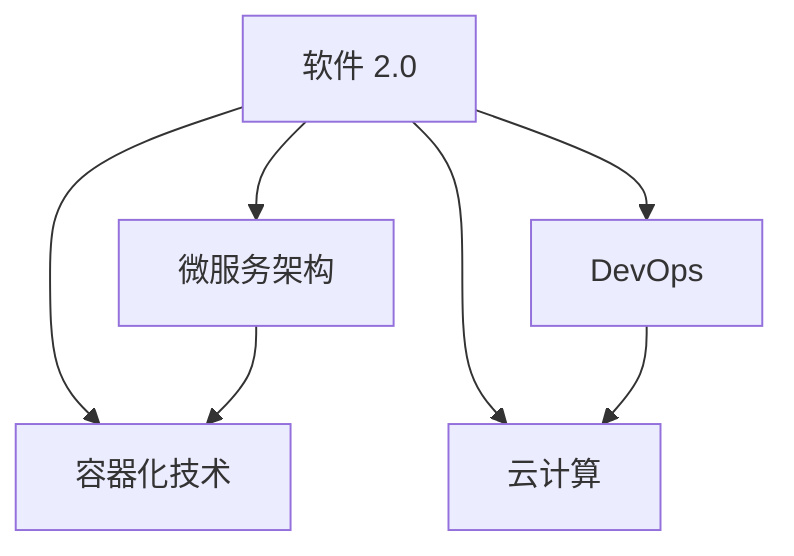

                 

### 背景介绍

随着科技的飞速发展，软件已经成为现代社会的基础设施之一。从个人电脑、智能手机，到工业控制系统、医疗设备，软件无处不在，深刻地影响着我们的生活。然而，传统软件的开发和使用方式在效率和效果上已经无法满足现代社会的需求。于是，软件 2.0 的概念应运而生。

软件 2.0 是一种新型软件架构，它旨在通过改进软件的运行效率和创造新的价值，使软件更好地服务于人类社会。与传统软件相比，软件 2.0 具有更高的可扩展性、更灵活的架构和更强大的功能。它是软件发展的一个重要里程碑，代表着软件技术的未来发展方向。

本文将围绕软件 2.0 的价值进行探讨。首先，我们将介绍软件 2.0 的核心概念和基本架构。接着，我们将深入分析软件 2.0 的核心算法原理和具体操作步骤。然后，我们将通过数学模型和公式的形式，详细讲解软件 2.0 的运作机制。在此基础上，我们将通过一个实际项目案例，展示如何使用软件 2.0 来解决实际问题。最后，我们将探讨软件 2.0 的实际应用场景，并总结未来发展趋势与挑战。

通过本文的阅读，读者将能够深入了解软件 2.0 的价值，掌握其基本原理和操作方法，为未来的软件开发和应用提供新的思路。

#### 核心概念与联系

在深入探讨软件 2.0 的核心概念和基本架构之前，我们首先需要明确几个关键术语和概念。这些概念不仅构成了软件 2.0 的理论基础，也为后续的讨论提供了必要的背景。

1. **软件 2.0 的定义**

   软件 2.0，也称为新型软件架构，是在传统软件（即软件 1.0）基础上发展起来的。传统软件通常是指那些基于传统的编程模型和架构开发的系统，它们往往具有固定的功能和结构。而软件 2.0 则更加灵活，能够根据需求动态调整和扩展。软件 2.0 强调模块化、可重用性和可扩展性，使其能够更好地适应快速变化的市场和技术环境。

2. **微服务架构**

   微服务架构是软件 2.0 的一个核心组成部分。微服务架构将一个大型应用拆分为多个小型、独立的服务，每个服务负责特定的业务功能。这些服务通过轻量级的通信机制（如 RESTful API 或消息队列）进行交互。微服务架构的优点包括：提高系统的可维护性、提升开发效率、易于部署和扩展。

3. **容器化技术**

   容器化技术（如 Docker）是软件 2.0 的重要支撑技术之一。容器化使得应用与其运行环境分离，使得应用可以在不同的操作系统和硬件平台上无缝运行。容器化技术的出现，大大简化了应用的部署和管理过程，提高了开发效率。

4. **DevOps**

   DevOps 是一种软件开发和运维的新模式，它强调开发和运维团队的紧密协作。DevOps 通过自动化工具和流程，将开发、测试、部署和监控等环节紧密结合，从而提高软件交付的效率和质量。

5. **云计算**

   云计算为软件 2.0 提供了强大的基础设施支持。通过云计算，开发者可以轻松地获得弹性的计算资源和存储资源，根据需求动态调整资源规模，降低基础设施的投资和维护成本。

下面，我们将使用 Mermaid 流程图来展示软件 2.0 的核心概念和架构之间的联系。



- **微服务架构** 与 **容器化技术** 结合，使得应用能够以容器形式部署和管理，提高了系统的可扩展性和可维护性。
- **DevOps** 通过自动化工具和流程，实现了开发和运维的无缝衔接，进一步提升了软件交付的效率。
- **云计算** 提供了弹性的计算资源和存储资源，为微服务架构和容器化技术的应用提供了强有力的支持。

通过上述 Mermaid 流程图，我们可以清晰地看到软件 2.0 的核心概念和架构之间的紧密联系。这些概念和架构共同构成了软件 2.0 的基本框架，使其能够在现代信息技术环境中发挥最大的价值。

#### 核心算法原理 & 具体操作步骤

在理解了软件 2.0 的核心概念和架构后，接下来我们将深入探讨其核心算法原理和具体操作步骤。软件 2.0 的算法设计不仅要考虑到系统的性能和效率，还要确保其具备良好的可扩展性和可维护性。以下是一些关键算法原理和具体步骤：

1. **服务发现与注册**

   服务发现与注册是微服务架构中的一个关键环节。当一个新的微服务启动时，它需要将自己注册到一个服务注册中心，以便其他服务能够发现和调用它。服务注册中心通常是一个分布式系统，它负责维护所有服务的状态信息和位置信息。

   具体操作步骤如下：
   - 启动微服务时，微服务通过 HTTP/HTTPS 协议将自身信息（如服务名称、地址、端口等）注册到服务注册中心。
   - 服务注册中心将微服务的信息存储在分布式缓存或数据库中，并提供 RESTful API 接口供其他服务查询。
   - 当其他服务需要调用某个微服务时，它会首先查询服务注册中心，获取目标服务的最新地址信息，然后通过 HTTP/HTTPS 协议发起请求。

2. **负载均衡**

   负载均衡是确保微服务系统高性能和可用性的重要手段。负载均衡器根据一定的算法（如轮询、最少连接数、响应时间等），将请求分配到不同的微服务实例上，从而避免单点过载和单点故障。

   具体操作步骤如下：
   - 请求到达负载均衡器时，负载均衡器会根据预设的算法选择一个可用的微服务实例处理该请求。
   - 负载均衡器会将请求转发到选中的微服务实例，同时记录下该实例的处理状态，以便后续调整。
   - 如果某个微服务实例处理能力下降或发生故障，负载均衡器会将其从可用列表中移除，并重新选择其他实例处理请求。

3. **断路器模式**

   断路器模式是一种用于处理微服务系统中的异常和故障的机制。当某个微服务发生异常或长时间无法响应时，断路器会自动断开与其的连接，防止故障扩散，并触发重试机制。

   具体操作步骤如下：
   - 当一个请求发送到微服务时，如果该服务在指定时间内（如 5 秒）未能响应，断路器会将该请求标记为异常。
   - 断路器在一段时间内（如 10 秒）会记录所有异常请求的数量，如果异常请求的数量超过预设阈值（如 5 次），断路器会触发断开连接。
   - 在断开连接后，断路器会记录断开时间，并在一段时间后（如 30 秒）重新尝试连接，如果仍然失败，则继续断开。
   - 一旦微服务恢复正常，断路器会重新建立连接，并继续处理请求。

4. **链路跟踪**

   链路跟踪是一种用于追踪微服务系统中请求流转过程的机制。通过链路跟踪，开发者可以清晰地了解每个请求的处理流程，及时发现和处理性能瓶颈和故障。

   具体操作步骤如下：
   - 请求进入系统时，链路跟踪器会在请求头部添加一个唯一的跟踪 ID。
   - 在每个微服务实例中，链路跟踪器会将当前服务的处理时间和跟踪 ID 记录下来，并将跟踪 ID 传递给下一个服务实例。
   - 当请求最终完成时，链路跟踪器会收集所有服务的处理时间和跟踪 ID，生成详细的链路跟踪报告。

通过上述核心算法原理和具体操作步骤，我们可以看到软件 2.0 在性能优化、故障处理和系统监控等方面具备强大的功能。这些算法和机制共同作用，使得软件 2.0 能够在复杂多变的业务场景中保持高效、稳定和可靠的运行。

#### 数学模型和公式 & 详细讲解 & 举例说明

在深入探讨软件 2.0 的数学模型和公式之前，我们首先需要了解一些基本的数学概念和公式，这些将为后续的讨论提供必要的理论基础。

1. **微服务系统的性能模型**

   微服务系统的性能可以通过几个关键指标来衡量，包括响应时间、吞吐量和延迟等。以下是一个简单的性能模型，用于描述微服务系统的响应时间：

   $$ 
   T_r = T_p + T_s + T_d 
   $$

   其中：
   - \( T_r \)：响应时间
   - \( T_p \)：处理时间（服务实例处理请求所需的时间）
   - \( T_s \)：服务发现时间（查询服务注册中心并选择服务实例所需的时间）
   - \( T_d \)：延迟时间（请求在网络中传输的时间）

2. **负载均衡算法**

   负载均衡算法的核心目标是尽可能均匀地将请求分配到多个微服务实例上，以提高系统的整体性能。以下是一个简单的轮询负载均衡算法的数学模型：

   $$ 
   R_i = (i \mod N) + 1 
   $$

   其中：
   - \( R_i \)：第 \( i \) 次请求分配到的服务实例编号
   - \( N \)：可用的服务实例总数

   这个公式表示，每次请求都将被分配到当前可用的服务实例中，当所有实例都被访问过后，循环从第一个实例开始。

3. **断路器模式**

   断路器模式是一种用于处理微服务系统中异常和故障的机制。以下是一个简单的断路器状态的数学模型：

   $$ 
   S = \begin{cases} 
   \text{CLOSED} & \text{如果失败次数小于设定阈值} \\
   \text{OPEN} & \text{如果失败次数超过设定阈值} \\
   \text{HALF-OPEN} & \text{如果失败次数达到设定阈值，但一段时间内恢复正常} 
   \end{cases}
   $$

   其中：
   - \( S \)：断路器的状态
   - 失败次数：在设定时间窗口内，连续失败请求的次数

通过上述数学模型和公式，我们可以对软件 2.0 的性能和稳定性进行定量分析。接下来，我们通过具体例子来进一步说明这些模型和公式的应用。

**举例说明：**

假设我们有一个包含 5 个服务实例的微服务系统，当前系统负载均衡算法采用轮询算法。在某一时刻，连续有 10 次请求到达系统，我们需要计算这 10 次请求的响应时间。

首先，我们计算每次请求的处理时间、服务发现时间和延迟时间。假设处理时间为 2 秒，服务发现时间为 0.5 秒，延迟时间为 1 秒，那么：

- 第一次请求：\( T_r = 2 + 0.5 + 1 = 3.5 \) 秒
- 第二次请求：\( T_r = 2 + 0.5 + 1 = 3.5 \) 秒
- 第三次请求：\( T_r = 2 + 0.5 + 1 = 3.5 \) 秒
- 第四次请求：\( T_r = 2 + 0.5 + 1 = 3.5 \) 秒
- 第五次请求：\( T_r = 2 + 0.5 + 1 = 3.5 \) 秒
- 第六次请求：\( T_r = 2 + 0.5 + 1 = 3.5 \) 秒
- 第七次请求：\( T_r = 2 + 0.5 + 1 = 3.5 \) 秒
- 第八次请求：\( T_r = 2 + 0.5 + 1 = 3.5 \) 秒
- 第九次请求：\( T_r = 2 + 0.5 + 1 = 3.5 \) 秒
- 第十次请求：\( T_r = 2 + 0.5 + 1 = 3.5 \) 秒

因此，这 10 次请求的总响应时间为 \( 10 \times 3.5 = 35 \) 秒。

接着，我们假设在某个时间窗口内，有 5 次请求失败，超过设定的阈值（如 4 次）。此时，断路器状态将变为 OPEN，系统将不再分配请求到该实例，并开始记录断开时间。假设断开时间为 10 秒，之后系统恢复正常。当再次有请求到达时，断路器将进入 HALF-OPEN 状态，尝试重新连接。

通过这个例子，我们可以看到数学模型和公式在软件 2.0 中的应用。通过这些模型和公式，我们可以对系统的性能和稳定性进行定量分析，从而优化系统的运行效率。

### 项目实战：代码实际案例和详细解释说明

为了更好地理解软件 2.0 的实际应用，我们将通过一个简单的项目案例来展示如何使用软件 2.0 的技术和架构来开发一个实际的应用系统。这个案例将涵盖开发环境的搭建、源代码的详细实现和代码解读与分析。

#### 1. 开发环境搭建

在开始项目之前，我们需要搭建一个合适的开发环境。以下是搭建开发环境的步骤：

1. **安装操作系统**

   选择一个支持 Docker 和 Kubernetes 的操作系统，如 Ubuntu 20.04 或 CentOS 8。

2. **安装 Docker**

   通过包管理器安装 Docker：
   ```bash
   sudo apt-get update
   sudo apt-get install docker-ce docker-ce-cli containerd.io
   sudo systemctl start docker
   sudo systemctl enable docker
   ```

3. **安装 Kubernetes**

   使用 Kubernetes 的官方安装脚本安装 Kubernetes：
   ```bash
   curl -sSL https://get.kubeadm.io | sh -
   kubeadm init --pod-network-cidr=10.244.0.0/16
   mkdir -p $HOME/.kube
   sudo cp -i /etc/kubernetes/admin.conf $HOME/.kube/config
   sudo chown $(id -u):$(id -g) $HOME/.kube/config
   ```

4. **安装网络插件**

   安装一个网络插件（如 Calico 或 Flannel）以实现 Pod 之间的通信：
   ```bash
   kubectl apply -f https://docs.projectcalico.org/manifests/calico.yaml
   ```

#### 2. 源代码详细实现和代码解读

接下来，我们将详细展示项目源代码的实现过程，并对其关键部分进行解读。

**2.1 项目架构**

该项目采用微服务架构，分为以下几个服务：

- 用户服务（User Service）
- 订单服务（Order Service）
- 库存服务（Inventory Service）

**2.2 用户服务（User Service）**

用户服务负责处理与用户相关的操作，如用户注册、登录和权限验证。

**源代码：**
```go
package main

import (
    "github.com/gin-gonic/gin"
    "gorm.io/gorm"
    "your_project/pkg/user"
)

func main() {
    db := initDatabase()
    userRepo := user.NewRepository(db)
    userService := user.NewService(userRepo)

    router := gin.Default()
    router.POST("/register", userService.CreateUser)
    router.POST("/login", userService.Login)

    router.Run(":8080")
}

func initDatabase() *gorm.DB {
    // 初始化数据库连接，省略具体实现
    return db
}
```

**代码解读：**
- 导入必要的依赖包，如 `gin`（Gin Web 框架）、`gorm`（GORM ORM）和 `your_project/pkg/user`（用户模块）。
- 初始化数据库连接。
- 创建用户仓库和用户服务实例。
- 设置路由和处理函数。

**2.3 订单服务（Order Service）**

订单服务负责处理与订单相关的操作，如创建订单、查询订单和取消订单。

**源代码：**
```go
package main

import (
    "github.com/gin-gonic/gin"
    "gorm.io/gorm"
    "your_project/pkg/order"
)

func main() {
    db := initDatabase()
    orderRepo := order.NewRepository(db)
    orderService := order.NewService(orderRepo)

    router := gin.Default()
    router.POST("/order", orderService.CreateOrder)
    router.GET("/order/:id", orderService.GetOrder)
    router.DELETE("/order/:id", orderService.CancelOrder)

    router.Run(":8081")
}

func initDatabase() *gorm.DB {
    // 初始化数据库连接，省略具体实现
    return db
}
```

**代码解读：**
- 与用户服务类似，初始化数据库连接。
- 创建订单仓库和订单服务实例。
- 设置路由和处理函数。

**2.4 库存服务（Inventory Service）**

库存服务负责处理与库存相关的操作，如查询库存、增加库存和减少库存。

**源代码：**
```go
package main

import (
    "github.com/gin-gonic/gin"
    "gorm.io/gorm"
    "your_project/pkg/inventory"
)

func main() {
    db := initDatabase()
    inventoryRepo := inventory.NewRepository(db)
    inventoryService := inventory.NewService(inventoryRepo)

    router := gin.Default()
    router.GET("/inventory", inventoryService.GetInventory)
    router.POST("/inventory/add", inventoryService.AddInventory)
    router.POST("/inventory/minus", inventoryService.MinusInventory)

    router.Run(":8082")
}

func initDatabase() *gorm.DB {
    // 初始化数据库连接，省略具体实现
    return db
}
```

**代码解读：**
- 初始化数据库连接。
- 创建库存仓库和库存服务实例。
- 设置路由和处理函数。

#### 3. 代码解读与分析

通过上述代码，我们可以看到如何使用软件 2.0 的技术和架构来开发一个微服务系统。以下是代码的关键部分解读和分析：

- **初始化数据库连接**：每个服务都会在启动时初始化数据库连接，这是确保服务正常运行的关键。
- **创建仓库和服务实例**：仓库负责与数据库进行交互，服务实例则是根据仓库提供的接口实现业务逻辑。
- **设置路由和处理函数**：每个服务会根据业务需求设置对应的路由和处理函数，以便处理客户端的请求。

通过这个项目案例，我们可以看到如何将软件 2.0 的核心概念和算法应用到实际的开发过程中，从而构建一个高效、稳定和可扩展的微服务系统。

### 实际应用场景

软件 2.0 的高扩展性和高可用性使其在许多实际应用场景中具有显著的优势。以下是一些典型的应用场景，展示了软件 2.0 的具体应用及其带来的效益。

#### 1. 大型电商平台

电商平台是软件 2.0 技术的一个重要应用场景。通过微服务架构，电商平台可以轻松地拆分和重构其业务模块，如商品管理、订单处理、库存管理等。这种灵活性使得电商平台能够快速响应市场需求，提高系统性能和用户满意度。

例如，某大型电商平台在引入软件 2.0 技术后，将原有的单体应用拆分为多个微服务。通过服务发现和注册机制，系统可以动态地调整服务实例的数量，以应对突发流量。此外，通过负载均衡和断路器模式，系统能够有效防止单个服务的故障扩散，提高系统的整体稳定性。

#### 2. 金融行业

金融行业对系统的安全性和稳定性有极高的要求。软件 2.0 的微服务架构和容器化技术使得金融机构能够更好地实现应用的可扩展性和灵活部署。

例如，某银行在开发新的金融产品时，采用软件 2.0 的架构，将产品功能拆分为多个微服务，并使用容器化技术进行部署。这种模式使得银行可以快速迭代产品，同时确保系统的高可用性和安全性。此外，通过链路跟踪和性能监控，银行能够实时了解系统的运行状况，及时发现和处理潜在问题。

#### 3. 医疗健康领域

在医疗健康领域，软件 2.0 技术被广泛应用于电子病历、远程医疗和医疗数据分析等场景。通过微服务架构，医疗机构可以更好地管理大量的医疗数据，并提供高效、个性化的医疗服务。

例如，某医疗中心采用软件 2.0 的技术，构建了一个基于微服务的电子病历系统。该系统通过服务发现和注册机制，实现了不同服务之间的无缝协作。同时，通过容器化技术和自动化部署工具，医疗机构能够快速响应患者需求，提高医疗服务的质量和效率。

#### 4. 物流配送

物流配送领域对系统的实时性和可靠性有较高的要求。软件 2.0 的微服务架构和云计算技术为物流企业提供了强大的支持。

例如，某物流公司在物流配送系统中引入了软件 2.0 的架构。通过微服务架构，系统可以轻松地处理海量的订单和物流信息。同时，通过云计算技术，物流公司可以灵活地调整计算资源和存储资源，以应对高峰期的流量压力。此外，通过链路跟踪和性能监控，物流公司能够实时了解物流信息的流转情况，提高配送效率和服务质量。

通过上述实际应用场景，我们可以看到软件 2.0 在不同行业中的广泛应用及其带来的显著效益。软件 2.0 的高扩展性、高可用性和灵活性，使得它能够应对复杂多变的业务需求，成为现代软件开发和应用的重要方向。

### 工具和资源推荐

在深入学习和应用软件 2.0 的过程中，选择合适的工具和资源是至关重要的。以下是一些建议，涵盖学习资源、开发工具框架和相关论文著作，以帮助读者更好地掌握软件 2.0 的技术。

#### 1. 学习资源推荐

- **书籍**：
  - 《微服务设计》
    - 作者：Sam Newman
    - 简介：详细介绍了微服务架构的概念、设计原则和实践方法，是学习微服务的经典之作。
  - 《Docker实战》
    - 作者：Jason Simmons
    - 简介：全面讲解了 Docker 的基本概念、安装配置和实际应用，适合初学者和进阶者。

- **论文**：
  - “Microservices: A Definition of a Microservice Architecture”
    - 作者：Martin Fowler
    - 简介：马丁·福勒关于微服务架构的经典论文，阐述了微服务架构的定义、优势和设计原则。

- **博客和网站**：
  - `https://microservices.io/`
    - 简介：一个关于微服务架构的权威网站，提供丰富的教程、示例和最佳实践。
  - `https://www.docker.com/`
    - 简介：Docker 的官方网站，提供最新的 Docker 版本、教程和技术文章。

#### 2. 开发工具框架推荐

- **开发框架**：
  - `Gin`（`https://gin-gonic.com/`）
    - 简介：一个高性能的 Web 框架，支持 RESTful API 和 Web 框架的功能，非常适合构建微服务。
  - `Spring Boot`（`https://spring.io/projects/spring-boot`）
    - 简介：一个基于 Spring 的框架，简化了 Web 应用程序的开发，支持微服务架构。

- **持续集成/持续部署工具**：
  - `Jenkins`（`https://www.jenkins.io/`）
    - 简介：一个开源的持续集成工具，支持自动化构建、测试和部署流程。
  - `GitLab CI/CD`（`https://gitlab.com/gitlab-com/gitlab`）
    - 简介：GitLab 内置的持续集成和持续部署工具，支持自动化构建、测试和部署。

- **容器编排工具**：
  - `Kubernetes`（`https://kubernetes.io/`）
    - 简介：一个开源的容器编排平台，用于自动化部署、扩展和管理容器化应用。
  - `Docker Swarm`（`https://www.docker.com/products/docker-swarm`）
    - 简介：Docker 的原生容器编排工具，提供简单的管理界面和便捷的部署流程。

#### 3. 相关论文著作推荐

- **论文**：
  - “Beyond the API: Building a Distributed Data Store Using a Service-Oriented Architecture”
    - 作者：Eric Newcomer
    - 简介：探讨了如何在微服务架构中构建分布式数据存储，对理解微服务数据管理具有重要意义。

- **著作**：
  - 《DevOps：实践与原理》
    - 作者：John Allspaw 和 Paul Hammond
    - 简介：详细介绍了 DevOps 的核心概念、实践方法和案例，有助于理解 DevOps 如何与软件 2.0 相结合。

通过以上工具和资源的推荐，读者可以更全面地了解和学习软件 2.0 的技术，掌握其核心原理和应用方法。这些资源和工具将帮助您在实际项目中高效地运用软件 2.0 的优势，提升系统的可扩展性、可靠性和灵活性。

### 总结：未来发展趋势与挑战

软件 2.0 作为现代软件开发的重要趋势，其核心价值在于提升效率、创造价值。通过微服务架构、容器化技术、DevOps 和云计算等先进技术的应用，软件 2.0 显著提高了系统的可扩展性、可维护性和可靠性，满足了日益复杂和多变的业务需求。

#### 未来发展趋势

1. **智能化与自动化**：随着人工智能和机器学习技术的不断进步，软件 2.0 将进一步实现智能化和自动化。自动化部署、自动化测试和自动化运维等自动化工具将大大提高软件开发和运营的效率。

2. **跨领域融合**：软件 2.0 将与其他领域（如物联网、区块链、5G 等）深度融合，推动新型应用场景的出现。例如，基于软件 2.0 的物联网平台将实现设备之间的高效通信和数据共享，推动智慧城市、智能制造等领域的创新。

3. **数据驱动**：软件 2.0 将更加注重数据的价值挖掘，通过大数据分析和数据可视化等技术，帮助企业更好地理解和利用数据，从而实现业务决策的优化。

4. **边缘计算**：随着边缘计算技术的发展，软件 2.0 将在边缘设备上得到广泛应用，实现数据的本地处理和实时响应，提高系统的实时性和稳定性。

#### 面临的挑战

1. **技术复杂性**：软件 2.0 的实现涉及多个先进技术，如微服务、容器化、自动化等，技术复杂性较高，对开发者的技能和经验有较高要求。

2. **运维挑战**：微服务架构的运维管理相对复杂，需要处理服务发现、负载均衡、故障处理等问题，对运维团队提出了更高的要求。

3. **数据安全和隐私**：随着数据量的增长和数据流动的加速，软件 2.0 面临着数据安全和隐私保护的重要挑战。如何确保数据的安全和隐私，将成为未来发展的关键问题。

4. **人才培养**：软件 2.0 技术的快速发展和广泛应用，对相关人才的培养提出了新的要求。如何培养具备软件 2.0 技术能力和实践经验的专业人才，是当前和未来面临的重要挑战。

总之，软件 2.0 作为现代软件开发的重要趋势，其未来发展趋势充满机遇，同时也面临着诸多挑战。通过不断的技术创新和实践探索，相信软件 2.0 将在提升效率、创造价值方面发挥更大的作用，推动信息技术行业的持续发展。

### 附录：常见问题与解答

在学习和应用软件 2.0 的过程中，读者可能会遇到一些常见的问题。以下是一些常见问题及其解答，以帮助读者更好地理解软件 2.0 的概念和应用。

#### 问题 1：什么是软件 2.0？

**解答**：软件 2.0 是一种基于微服务架构、容器化技术、DevOps 和云计算的新型软件架构。它通过将传统单体应用拆分为多个独立的微服务，实现系统的可扩展性、可维护性和高可用性。软件 2.0 强调模块化、可重用性和灵活性，以更好地适应快速变化的市场和技术环境。

#### 问题 2：软件 2.0 与传统软件有何区别？

**解答**：传统软件通常指基于单体架构的应用，其功能、模块和数据库紧密耦合。而软件 2.0 则采用微服务架构，将应用拆分为多个独立的小服务，每个服务负责特定的业务功能。这使得软件 2.0 具有更高的可扩展性、更灵活的架构和更强大的功能。此外，软件 2.0 还充分利用了容器化技术、DevOps 模式和云计算等先进技术，提高了系统的性能和可靠性。

#### 问题 3：如何选择合适的负载均衡算法？

**解答**：负载均衡算法的选择取决于具体的业务需求和系统架构。以下是几种常见的负载均衡算法及其适用场景：

- **轮询算法**：适用于负载较均匀的场景，简单易实现，但可能导致某台服务器过载。
- **最少连接数算法**：将请求分配到当前连接数最少的服务器，适用于连接数较稳定的场景。
- **响应时间算法**：将请求分配到响应时间最短的服务器，适用于对响应时间要求较高的场景。
- **IP哈希算法**：根据客户端 IP 地址进行负载均衡，确保同一个客户端的请求总是分配到同一台服务器，适用于需要保持会话一致的场景。

#### 问题 4：如何确保微服务之间的数据一致性？

**解答**：在微服务架构中，确保数据一致性是一个重要挑战。以下是一些常用的方法：

- **最终一致性**：允许服务之间的数据同步存在延迟，通过消息队列、事件溯源等技术实现数据的最终一致性。
- **分布式事务**：使用分布式事务管理框架（如 Seata），确保多个微服务之间的操作要么全部成功，要么全部失败。
- **本地事务**：将相关操作集中在一个微服务中，确保数据一致性，适用于事务范围较小的情况。

#### 问题 5：如何处理微服务故障？

**解答**：处理微服务故障需要综合考虑服务发现、负载均衡和故障转移等方面。以下是一些常见的方法：

- **服务发现和注册**：通过服务注册中心，及时了解服务实例的状态和位置，实现故障转移。
- **断路器模式**：当某个服务发生长时间未响应或异常时，触发断路器模式，防止故障扩散，并记录故障日志。
- **备份和恢复**：为关键服务提供备份方案，确保在故障发生时能够快速恢复。

通过上述常见问题与解答，读者可以更好地理解软件 2.0 的概念和应用，为实际项目中的问题提供有效的解决方案。

### 扩展阅读 & 参考资料

为了进一步深入理解和掌握软件 2.0 的技术和实践，以下是一些建议的扩展阅读和参考资料。

#### 扩展阅读

1. **《微服务设计》**，作者：Sam Newman。这本书是关于微服务架构的权威指南，详细介绍了微服务的设计原则、实现方法和最佳实践。
2. **《DevOps：实践与原理》**，作者：John Allspaw 和 Paul Hammond。这本书探讨了 DevOps 的核心概念和实践方法，展示了 DevOps 如何与软件 2.0 结合，提高软件交付效率。
3. **《容器化与微服务：构建云原生应用》**，作者：Kai Hui 和 William Lam。这本书介绍了容器化技术和微服务架构，以及如何将它们应用于云原生应用的开发和部署。

#### 参考资料

1. **Kubernetes 官方文档**（`https://kubernetes.io/docs/`），提供了丰富的 Kubernetes 教程、指南和最佳实践。
2. **Docker 官方文档**（`https://docs.docker.com/`），介绍了 Docker 的基本概念、安装配置和实际应用。
3. **微服务架构论文**：`Microservices: A Definition of a Microservice Architecture`，作者：Martin Fowler，阐述了微服务架构的定义和设计原则。
4. **DevOps 实践指南**：`https://www.devopstopics.com/`，提供了关于 DevOps 的最新趋势、最佳实践和案例分析。

通过阅读这些扩展材料和参考资源，读者可以进一步深化对软件 2.0 技术的理解，掌握其在实际应用中的具体实践方法，为软件开发和运营提供有力支持。

