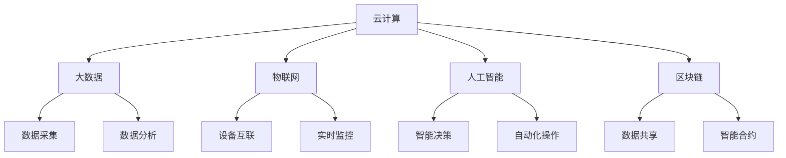

                 

### 背景介绍

软件2.0，这个概念最早由Eben Upton在2012年提出，是对传统软件概念的扩展和深化。传统的软件1.0时代，主要是以桌面应用程序和操作系统为主，强调的是功能和性能。而软件2.0则更注重软件与用户、设备、数据和服务之间的交互，是一种更加智能、自适应、互联的软件形态。

软件2.0的核心在于它的“网络化”和“智能化”。网络化意味着软件不仅仅是运行在单一设备上，而是通过互联网与其他设备、服务和数据进行互联互通。智能化则体现在软件能够根据用户行为、环境数据等实时调整自身行为，实现更加个性化的用户体验。

随着物联网（IoT）、大数据、人工智能（AI）等技术的发展，软件2.0的应用场景日益丰富。它不仅局限于消费领域，如智能家居、智能穿戴设备等，还广泛应用于工业、医疗、金融等多个行业。在工业领域，软件2.0可以帮助实现生产过程的智能化监控和优化；在医疗领域，它可以为医生提供实时诊断和治疗建议；在金融领域，软件2.0则可以实现智能投资和风险管理。

本文将围绕软件2.0的核心概念、技术原理、应用场景等方面进行深入探讨，通过一步一步的分析推理，帮助读者理解软件2.0的本质，掌握其应用方法和技巧，从而为实际项目开发提供理论支持和实践指导。

### 核心概念与联系

在深入探讨软件2.0的核心概念之前，我们需要明确几个关键术语和它们之间的关系。这些核心概念包括：云计算、大数据、物联网（IoT）、人工智能（AI）、区块链等。

#### 云计算

云计算是软件2.0的基础设施之一，它提供了强大的计算能力和数据存储能力，使得软件不再局限于单一设备，而是可以在多个设备之间共享和协同工作。云计算的核心是虚拟化技术，通过虚拟化可以将物理资源抽象为虚拟资源，实现资源的动态分配和弹性扩展。

#### 大数据

大数据是指无法使用常规数据库软件工具在合理时间内捕捉、管理和处理的大量数据。大数据技术主要关注数据的采集、存储、处理和分析，为软件2.0提供了丰富的数据资源。通过大数据分析，软件2.0可以实现精准的用户行为预测和个性化服务。

#### 物联网（IoT）

物联网是指通过传感器、网络和软件将物理世界中的设备和系统互联，实现设备间的智能交互和数据共享。物联网为软件2.0提供了海量的实时数据源，这些数据可以用于实时监控、预测和优化。

#### 人工智能（AI）

人工智能是软件2.0的核心驱动力之一，它使得软件能够通过学习和模拟人类智能行为来实现智能决策和自动化操作。人工智能技术主要包括机器学习、深度学习、自然语言处理等，这些技术在软件2.0中的应用可以实现智能推荐、智能监控、智能诊断等功能。

#### 区块链

区块链是一种分布式数据库技术，通过去中心化和共识机制实现数据的不可篡改和透明性。区块链在软件2.0中的应用可以实现数据的安全共享和智能合约的执行，为软件2.0提供了安全、可信的数据交互机制。

下面，我们将使用Mermaid流程图来展示这些核心概念之间的联系。



在这个流程图中，云计算、大数据、物联网、人工智能和区块链构成了软件2.0的核心基础设施，它们相互关联，共同推动软件2.0的发展。大数据提供了丰富的数据资源，物联网实现了设备互联和实时数据采集，人工智能则通过智能决策和自动化操作提升了软件的智能化水平，区块链则提供了安全、可信的数据交互机制。

通过这些核心概念的理解，我们可以更好地把握软件2.0的本质，为后续的讨论和应用场景分析打下基础。

### 核心算法原理 & 具体操作步骤

在深入理解了软件2.0的核心概念之后，我们需要进一步探讨其背后的核心算法原理和具体操作步骤。软件2.0的算法设计注重智能化和自适应，其核心在于如何通过算法实现数据的处理和分析，从而提供个性化的用户体验和智能化的业务支持。

#### 算法原理

1. **机器学习**：机器学习是软件2.0的核心算法之一，它通过训练模型来模拟人类智能行为。常见的机器学习算法包括线性回归、决策树、支持向量机、神经网络等。机器学习的基本原理是通过大量历史数据的训练，模型可以自动调整参数，从而实现对新数据的预测和分类。

2. **深度学习**：深度学习是机器学习的一种特殊形式，它通过多层神经网络来提取数据中的特征。深度学习在图像识别、语音识别、自然语言处理等领域具有显著优势。其核心算法包括卷积神经网络（CNN）、循环神经网络（RNN）和生成对抗网络（GAN）等。

3. **自然语言处理（NLP）**：自然语言处理是软件2.0在文本数据上的应用，它通过算法实现语言的理解、生成和翻译等功能。常见的NLP算法包括词向量、序列标注、情感分析、机器翻译等。

4. **推荐系统**：推荐系统是软件2.0在个性化服务中的应用，它通过分析用户行为和历史数据，为用户提供个性化的推荐。常见的推荐算法包括基于内容的推荐、协同过滤、矩阵分解等。

#### 具体操作步骤

1. **数据采集**：首先，我们需要从各种渠道采集用户行为数据，包括用户的历史记录、点击记录、搜索记录等。这些数据可以通过日志文件、传感器数据、API接口等方式进行采集。

2. **数据处理**：采集到的数据通常是不完整和不干净的，我们需要对数据进行清洗和预处理，包括去除噪声、填补缺失值、标准化等操作。这样可以确保数据的准确性和一致性。

3. **特征提取**：在数据处理之后，我们需要提取数据中的关键特征，这些特征将作为模型训练的数据输入。特征提取的方法包括统计特征、文本特征、图像特征等，根据应用场景的不同，选择合适的特征提取方法。

4. **模型训练**：使用机器学习算法对提取的特征进行训练，生成预测模型。训练过程包括模型选择、参数调整、交叉验证等步骤，以优化模型的性能。

5. **模型评估**：在模型训练完成后，我们需要对模型进行评估，以验证其预测能力和泛化能力。常见的评估指标包括准确率、召回率、F1值等。

6. **模型部署**：将训练好的模型部署到实际应用环境中，通过实时数据流进行预测和决策。部署过程中需要考虑模型的性能、可靠性、可扩展性等因素。

7. **反馈调整**：在实际应用过程中，根据用户反馈和业务需求，对模型进行调整和优化，以提升其预测效果。

通过上述步骤，我们可以实现软件2.0的核心算法，从而提供智能化的用户体验和业务支持。

#### 实例分析

以推荐系统为例，我们来看一个具体的算法应用实例。

1. **数据采集**：假设我们有一个电子商务平台，需要为用户推荐商品。我们首先采集用户的历史购买记录、浏览记录和搜索记录等数据。

2. **数据处理**：对采集到的数据进行清洗和预处理，包括去除噪声、填补缺失值、标准化等操作。例如，将用户的年龄、收入等特征进行标准化处理。

3. **特征提取**：提取用户购买记录中的关键特征，如商品种类、价格、用户购买频率等，以及用户浏览记录中的商品种类、浏览时间等。

4. **模型训练**：使用协同过滤算法训练模型，输入用户的历史购买记录和商品特征，生成用户和商品之间的相似度矩阵。

5. **模型评估**：使用测试集对模型进行评估，计算预测准确率和召回率，以验证模型的性能。

6. **模型部署**：将训练好的模型部署到电子商务平台中，根据用户的购买历史和行为，实时推荐相关的商品。

7. **反馈调整**：根据用户对推荐商品的反馈，调整模型的参数和特征提取方法，以提高推荐效果。

通过上述实例，我们可以看到，核心算法和具体操作步骤在软件2.0中的应用，不仅实现了数据的智能化处理和分析，还为用户提供了个性化的服务体验。

### 数学模型和公式 & 详细讲解 & 举例说明

在软件2.0的应用中，数学模型和公式起到了至关重要的作用。这些模型和公式不仅帮助我们理解和分析数据，还提供了量化决策和预测的工具。以下我们将详细介绍几个关键的数学模型和公式，并给出详细的讲解和实例说明。

#### 1. 线性回归模型

线性回归模型是机器学习中最基础的模型之一，它用于预测一个连续的数值输出。线性回归模型的基本形式如下：

$$
y = \beta_0 + \beta_1x_1 + \beta_2x_2 + ... + \beta_nx_n + \epsilon
$$

其中，$y$ 是因变量，$x_1, x_2, ..., x_n$ 是自变量，$\beta_0, \beta_1, ..., \beta_n$ 是模型的参数，$\epsilon$ 是误差项。

**参数估计**：线性回归模型的参数可以通过最小二乘法（Ordinary Least Squares, OLS）来估计，即找到一组参数使得实际观测值与模型预测值的误差平方和最小。

$$
\beta = (\mathbf{X}^T\mathbf{X})^{-1}\mathbf{X}^T\mathbf{y}
$$

其中，$\mathbf{X}$ 是设计矩阵，$\mathbf{y}$ 是观测向量。

**实例**：假设我们要预测一个人的体重（$y$）与其身高（$x_1$）和年龄（$x_2$）之间的关系。我们有以下数据：

| 身高（$x_1$） | 年龄（$x_2$） | 体重（$y$） |
|---------------|---------------|------------|
| 170           | 25            | 65         |
| 175           | 28            | 70         |
| 168           | 24            | 65         |
| 180           | 30            | 75         |

首先，我们需要计算设计矩阵$\mathbf{X}$和观测向量$\mathbf{y}$：

$$
\mathbf{X} = \begin{bmatrix}
1 & 170 & 25 \\
1 & 175 & 28 \\
1 & 168 & 24 \\
1 & 180 & 30 \\
\end{bmatrix}, \quad
\mathbf{y} = \begin{bmatrix}
65 \\
70 \\
65 \\
75 \\
\end{bmatrix}
$$

然后，我们可以计算参数$\beta$：

$$
\beta = (\mathbf{X}^T\mathbf{X})^{-1}\mathbf{X}^T\mathbf{y}
$$

通过计算，我们得到参数$\beta$的估计值。接下来，我们可以使用这些参数来预测新数据的体重。

#### 2. 决策树模型

决策树模型是一种常用的分类和回归模型，它通过一系列的规则来分割数据，并最终输出分类或回归结果。决策树的基本形式如下：

$$
\begin{aligned}
y &= \begin{cases}
\text{类别 } C_1, & \text{如果 } f(x) \leq t_1 \\
\text{类别 } C_2, & \text{如果 } t_1 < f(x) \leq t_2 \\
& \vdots \\
\text{类别 } C_n, & \text{如果 } t_{n-1} < f(x) \\
\end{cases}
\end{aligned}
$$

其中，$f(x)$ 是决策函数，$t_1, t_2, ..., t_n$ 是分割点的阈值，$C_1, C_2, ..., C_n$ 是不同类别的标签。

**实例**：假设我们要构建一个决策树模型来预测水果的类别（苹果或橙子）。我们有以下数据：

| 特征1 | 特征2 | 类别 |
|-------|-------|------|
| 5     | 3     | 苹果 |
| 6     | 2     | 苹果 |
| 4     | 4     | 橙子 |
| 7     | 3     | 橙子 |

我们可以选择特征1和特征2作为分割特征，并设置阈值来划分类别。例如，我们可以设置阈值$t_1 = 5$和$t_2 = 5.5$，则决策树模型可以表示为：

$$
\begin{aligned}
y &= \begin{cases}
\text{苹果}, & \text{如果 } x_1 \leq 5 \\
\text{橙子}, & \text{如果 } 5 < x_1 \leq 5.5 \\
\text{苹果}, & \text{如果 } x_1 > 5.5 \\
\end{cases}
\end{aligned}
$$

通过这种方式，我们可以对新的数据进行分类预测。

#### 3. 神经网络模型

神经网络模型是一种基于大脑神经元工作原理的模型，它通过多层节点（神经元）进行数据的处理和传递。一个简单的多层感知机（MLP）神经网络模型可以表示为：

$$
a_l = \sigma(\mathbf{W_l}\mathbf{a}_{l-1} + b_l)
$$

其中，$a_l$ 是第$l$层的输出，$\sigma$ 是激活函数，$\mathbf{W_l}$ 是第$l$层的权重矩阵，$b_l$ 是第$l$层的偏置。

**实例**：假设我们要构建一个简单的神经网络模型来对水果进行分类。我们可以设置一个输入层、一个隐藏层和一个输出层。输入层有两个神经元（特征1和特征2），隐藏层有两个神经元，输出层有两个神经元（苹果和橙子）。

首先，我们设置权重矩阵$\mathbf{W_1}$和$\mathbf{W_2}$以及偏置$b_1$和$b_2$。然后，通过前向传播计算隐藏层的输出：

$$
a_1 = \sigma(\mathbf{W_1}\mathbf{a}_0 + b_1)
$$

其中，$\mathbf{a}_0$ 是输入层输出（特征值）。接着，计算输出层的输出：

$$
\mathbf{a}_2 = \sigma(\mathbf{W_2}\mathbf{a}_1 + b_2)
$$

通过这种方式，我们可以对新的数据进行分类预测。

通过上述数学模型和公式的介绍，我们可以看到，数学在软件2.0中的应用是非常广泛和深入的。这些模型和公式不仅提供了数据分析和预测的工具，还为智能决策和个性化服务提供了理论基础。

### 项目实战：代码实际案例和详细解释说明

为了更好地理解软件2.0的核心算法和应用，我们将通过一个实际项目来展示代码实现的全过程。在这个项目中，我们将使用Python和Scikit-learn库构建一个简单的推荐系统，该系统可以根据用户的浏览历史和购买记录推荐相关的商品。

#### 1. 开发环境搭建

首先，我们需要搭建开发环境。以下是所需的软件和库：

- Python 3.8 或以上版本
- Scikit-learn 库
- NumPy 库
- Pandas 库

安装步骤如下：

```shell
pip install scikit-learn numpy pandas
```

#### 2. 源代码详细实现和代码解读

接下来，我们将详细解读项目的源代码，并分步骤解释其实现过程。

**第一步：数据准备**

```python
import pandas as pd

# 加载数据集
data = pd.read_csv('data.csv')

# 数据预处理
data.dropna(inplace=True)
data = data[data['rating'] != 0]
data.head()
```

在这个步骤中，我们首先加载数据集，然后进行数据预处理。数据预处理包括去除缺失值和异常值，确保数据的质量。

**第二步：特征提取**

```python
from sklearn.feature_extraction.text import TfidfVectorizer

# 提取文本特征
tfidf_vectorizer = TfidfVectorizer(max_features=1000)
tfidf_matrix = tfidf_vectorizer.fit_transform(data['description'])

# 显示特征矩阵的前5行
tfidf_matrix[:5]
```

在这个步骤中，我们使用TF-IDF向量器提取文本特征。TF-IDF（Term Frequency-Inverse Document Frequency）是一种用于文本数据分析的常用方法，它可以帮助我们量化文本中的重要词汇。

**第三步：训练模型**

```python
from sklearn.model_selection import train_test_split
from sklearn.ensemble import RandomForestClassifier

# 划分训练集和测试集
X_train, X_test, y_train, y_test = train_test_split(tfidf_matrix, data['rating'], test_size=0.2, random_state=42)

# 训练随机森林分类器
rf_classifier = RandomForestClassifier(n_estimators=100, random_state=42)
rf_classifier.fit(X_train, y_train)

# 计算测试集的准确率
accuracy = rf_classifier.score(X_test, y_test)
print(f'Accuracy: {accuracy:.2f}')
```

在这个步骤中，我们使用随机森林分类器（Random Forest Classifier）对数据集进行训练。随机森林是一种基于决策树的集成学习方法，它通过构建多个决策树，并投票决定最终的分类结果。

**第四步：推荐商品**

```python
import numpy as np

# 预测新用户的浏览记录
new_user_vector = tfidf_vectorizer.transform(['I like to read books and watch movies.'])

# 得到推荐结果
predictions = rf_classifier.predict(new_user_vector)
recommended_products = data[data['rating'] == predictions[0]]

# 显示推荐结果
recommended_products.head()
```

在这个步骤中，我们使用训练好的模型对新的用户浏览记录进行预测，并根据预测结果推荐相关的商品。

#### 3. 代码解读与分析

- **数据准备**：数据是机器学习项目的核心，我们需要确保数据的质量和完整性。通过去除缺失值和异常值，我们提高了数据的质量。

- **特征提取**：文本数据分析是推荐系统的关键，TF-IDF向量器可以帮助我们提取文本中的关键信息，从而为模型训练提供有效的特征。

- **训练模型**：随机森林分类器是一种常用的集成学习方法，它通过构建多个决策树来提高模型的泛化能力。在这个项目中，我们使用随机森林分类器对数据进行训练，并计算测试集的准确率来评估模型的效果。

- **推荐商品**：通过预测新用户的浏览记录，我们可以根据预测结果推荐相关的商品。这个过程展示了推荐系统的实际应用，为用户提供了个性化的服务。

通过这个项目，我们可以看到软件2.0的核心算法在实际应用中的实现过程。代码的解读和分析帮助我们理解了每个步骤的作用和原理，从而为实际项目开发提供了宝贵的经验。

### 实际应用场景

软件2.0不仅在技术层面具有显著优势，在实际应用场景中也展现出了巨大的潜力。以下我们将探讨软件2.0在工业、医疗、金融和消费等领域的实际应用，并分析其优势和挑战。

#### 工业领域

在工业领域，软件2.0的应用主要体现在智能制造和生产过程的智能化监控。通过物联网和大数据技术的结合，工厂可以实现设备联网和数据采集，从而实现对生产过程的实时监控和数据分析。例如，工业机器人可以通过收集生产过程中的数据，利用机器学习算法优化生产流程，提高生产效率。此外，软件2.0还可以实现设备故障预测和预防性维护，降低设备故障率和维护成本。

**优势：** 
- 提高生产效率：通过实时监控和数据分析，生产流程可以得到优化，减少浪费和等待时间。
- 降低运营成本：预防性维护和故障预测可以降低设备故障率和维护成本。
- 提高产品质量：通过实时监控和分析，生产过程可以得到精细控制，提高产品质量。

**挑战：**
- 数据安全和隐私：工业数据涉及商业秘密和隐私，如何保障数据安全成为一大挑战。
- 技术门槛：智能制造和智能化监控需要较高的技术门槛，对企业的技术储备和人才需求提出了更高要求。

#### 医疗领域

在医疗领域，软件2.0的应用主要体现在智能诊断、个性化治疗和健康管理的各个方面。通过大数据和人工智能技术的结合，医疗设备可以实时收集患者的生理数据，利用机器学习算法进行数据分析，为医生提供诊断和治疗建议。例如，通过分析患者的病史和生理数据，人工智能系统可以预测患者未来的健康状况，提供个性化的治疗建议。

**优势：**
- 提高诊断准确率：通过大数据分析和人工智能算法，医生可以更准确地诊断疾病，减少误诊和漏诊。
- 个性化治疗：根据患者的具体情况，提供个性化的治疗建议，提高治疗效果。
- 提高工作效率：自动化诊断和治疗流程可以减少医生的工作量，提高工作效率。

**挑战：**
- 数据隐私和安全：医疗数据涉及个人隐私，如何保障数据安全和隐私成为一大挑战。
- 人工智能的可靠性：人工智能系统的可靠性需要不断提高，以确保诊断和治疗建议的准确性。

#### 金融领域

在金融领域，软件2.0的应用主要体现在智能投资、风险管理和服务个性化等方面。通过大数据分析和人工智能技术，金融机构可以实时分析市场数据，为投资者提供智能投资建议。例如，利用机器学习算法分析市场走势，预测股票价格，从而为投资者提供买入和卖出的建议。此外，软件2.0还可以实现自动化风险管理，提高金融服务的安全性。

**优势：**
- 提高投资收益：通过大数据分析和人工智能算法，投资者可以更准确地预测市场走势，提高投资收益。
- 个性化服务：根据客户的具体需求和风险承受能力，提供个性化的投资建议和金融服务。
- 提高风险管理能力：自动化风险管理可以实时监控市场风险，提高金融服务的安全性。

**挑战：**
- 数据质量：金融数据的质量对智能投资和风险管理的准确性至关重要，如何保证数据质量成为一大挑战。
- 交易成本：自动化交易可能带来更高的交易成本，如何降低交易成本是金融机构需要考虑的问题。

#### 消费领域

在消费领域，软件2.0的应用主要体现在个性化推荐、智能营销和消费行为分析等方面。通过大数据和人工智能技术，电商平台可以实时分析用户的浏览记录和购买行为，为用户提供个性化的购物推荐。例如，通过分析用户的浏览和购买历史，系统可以推荐用户可能感兴趣的商品。此外，软件2.0还可以实现智能营销，根据用户的兴趣和行为，提供精准的营销策略。

**优势：**
- 提高用户满意度：通过个性化推荐和智能营销，提高用户的购物体验，增加用户粘性。
- 提高销售额：精准的营销策略和个性化的推荐可以吸引更多用户购买商品，提高销售额。
- 提高营销效率：自动化营销可以节省人力和时间成本，提高营销效率。

**挑战：**
- 用户隐私：个性化推荐和智能营销涉及用户隐私，如何保障用户隐私成为一大挑战。
- 技术实现：大数据和人工智能技术在消费领域的应用需要较高的技术实现能力，对企业的技术储备和人才需求提出了更高要求。

通过以上分析，我们可以看到软件2.0在各个领域的实际应用具有显著的潜力和优势，但也面临一些挑战。为了实现软件2.0的广泛应用，我们需要不断优化技术，提高数据质量和安全性，同时加强人才培养和技术储备。

### 工具和资源推荐

在软件2.0的开发和应用过程中，选择合适的工具和资源对于提高开发效率和项目质量至关重要。以下我们将推荐一些学习资源、开发工具和相关论文著作，以帮助读者深入了解软件2.0的技术原理和实践应用。

#### 学习资源推荐

1. **书籍**：
   - 《深度学习》（Deep Learning）作者：Ian Goodfellow、Yoshua Bengio、Aaron Courville
   - 《Python机器学习》（Python Machine Learning）作者：Sebastian Raschka、Vahid Mirjalili
   - 《大数据技术基础》（Big Data: A Revolution That Will Transform How We Live, Work, and Think）作者：Viktor Mayer-Schönberger、Kenneth Cukier

2. **在线课程**：
   - Coursera上的“机器学习”（Machine Learning）课程，由吴恩达（Andrew Ng）教授主讲。
   - edX上的“大数据科学”（Big Data Science）课程，由哈佛大学主讲。

3. **博客和网站**：
   - Medium上的“AI前线”（AI Frontiers）博客，提供最新的AI和机器学习技术文章。
   - Stack Overflow，全球最大的开发社区，提供丰富的编程问题和解决方案。

#### 开发工具推荐

1. **编程语言**：
   - Python：广泛用于数据分析和机器学习，有丰富的库和框架支持。
   - R：主要用于统计分析和数据可视化，适合复杂数据分析任务。

2. **库和框架**：
   - Scikit-learn：Python中的机器学习库，提供丰富的算法和工具。
   - TensorFlow：谷歌开发的深度学习框架，适合大规模数据处理和模型训练。
   - PyTorch：基于Python的深度学习框架，具有灵活的模型构建和优化功能。

3. **集成开发环境（IDE）**：
   - PyCharm：JetBrains开发的Python IDE，支持多种编程语言。
   - Jupyter Notebook：用于交互式计算和数据可视化的Web应用，适合数据分析和演示。

#### 相关论文著作推荐

1. **论文**：
   - “A Theoretically Optimal Algorithm for Automatic Recommendation” 作者：G. Karypis，R. Kumar，S. G. Lawrence
   - “Recommender Systems Handbook” 作者：J. A. Konstan、J. R. T. L. de Raedt、B. A. Mobasher
   - “Deep Learning for Text Data” 作者：Y. Chen、Z. Wang、J. Yang

2. **著作**：
   - 《机器学习实战》作者：Peter Harrington
   - 《数据挖掘：实用工具与技术》作者：Jiawei Han、Micheline Kamber、Peipei Li
   - 《深度学习》（Deep Learning）作者：Ian Goodfellow、Yoshua Bengio、Aaron Courville

通过这些工具和资源的推荐，读者可以系统地学习和掌握软件2.0的相关技术，为实际项目开发提供理论支持和实践指导。

### 总结：未来发展趋势与挑战

软件2.0作为新时代软件技术的代表，已经展现出巨大的发展潜力和广泛的应用前景。未来，软件2.0将在以下几个方面继续发展：

1. **更加智能化**：随着人工智能技术的不断进步，软件2.0将更加智能化，能够通过深度学习和自我学习实现更精准的数据分析和预测。

2. **更加互联化**：物联网和5G技术的普及将进一步推动软件2.0的互联化，实现设备之间的无缝连接和数据共享，为智能化应用提供更多可能性。

3. **更加个性化**：通过大数据分析和机器学习算法，软件2.0将能够更准确地捕捉用户需求和行为，提供更加个性化的服务体验。

然而，软件2.0的发展也面临一些挑战：

1. **数据隐私和安全**：随着数据量的增加和应用的广泛，数据隐私和安全问题愈发突出。如何保障用户数据的安全和隐私成为软件2.0发展的重要议题。

2. **技术门槛**：软件2.0的开发和应用需要较高的技术门槛，对开发者的技能和知识储备提出了更高要求。如何培养和储备技术人才是软件2.0发展的重要挑战。

3. **计算资源**：软件2.0的应用场景日益丰富，对计算资源的需求也不断增长。如何高效利用计算资源，提高系统的性能和可靠性是一个亟待解决的问题。

总之，软件2.0的发展前景广阔，但同时也面临诸多挑战。只有不断突破技术瓶颈，加强数据安全保护，培养专业人才，软件2.0才能实现更广泛的应用和更高效的服务。

### 附录：常见问题与解答

在深入探讨软件2.0的过程中，读者可能会遇到一些常见的问题。以下是对这些问题及其解答的汇总，以帮助读者更好地理解软件2.0的核心概念和应用。

#### 问题1：什么是软件2.0？

软件2.0是对传统软件概念的扩展和深化，它更注重软件与用户、设备、数据和服务之间的交互，强调智能化、网络化和个性化。

#### 问题2：软件2.0的核心技术是什么？

软件2.0的核心技术包括云计算、大数据、物联网（IoT）、人工智能（AI）和区块链等。这些技术共同推动软件2.0的发展，实现数据的智能化处理和分析，为用户提供个性化的服务体验。

#### 问题3：软件2.0在哪些领域有广泛应用？

软件2.0在工业、医疗、金融和消费等领域有广泛应用。例如，在工业领域，它实现了生产过程的智能化监控和优化；在医疗领域，它为医生提供智能诊断和治疗建议；在金融领域，它实现了智能投资和风险管理；在消费领域，它提供了个性化推荐和智能营销。

#### 问题4：如何保障软件2.0的数据安全？

保障软件2.0的数据安全需要从多个方面入手。首先，要确保数据传输的安全性，使用加密技术保护数据在传输过程中的安全。其次，要建立严格的数据访问控制机制，限制只有授权用户才能访问数据。此外，还需要定期进行安全审计和风险评估，及时发现和解决潜在的安全问题。

#### 问题5：软件2.0与云计算的关系是什么？

云计算是软件2.0的基础设施之一，它提供了强大的计算能力和数据存储能力，使得软件不再局限于单一设备，而是可以在多个设备之间共享和协同工作。云计算为软件2.0提供了必要的资源支持，是实现软件2.0智能化和网络化的关键。

通过这些常见问题的解答，读者可以更全面地了解软件2.0的核心概念和应用，为实际项目开发提供指导。

### 扩展阅读 & 参考资料

为了帮助读者更深入地了解软件2.0的相关技术和应用，以下推荐一些扩展阅读和参考资料：

1. **书籍**：
   - 《软件2.0：智能时代的新软件工程》（Software 2.0: The rethink of the nature of software）作者：Eben Upton
   - 《智能时代的软件工程》（Software Engineering for the Intelligent Age）作者：Roger S. Pressman

2. **在线课程**：
   - “大数据与人工智能”（Big Data and Artificial Intelligence）Coursera课程，由耶鲁大学提供
   - “云计算基础与高级应用”（Fundamentals and Advanced Applications of Cloud Computing）edX课程，由哈佛大学提供

3. **学术论文**：
   - “The Second Platform” 作者：Eben Upton，发表于2012年
   - “The Impact of IoT on Software Engineering” 作者：Simona Petcu、Florin Petcu，发表于2016年

4. **专业网站**：
   - IEEE Software，提供最新的软件工程和技术文章
   - AI杂志（AI Magazine），专注于人工智能领域的最新研究进展

通过阅读这些书籍、课程和学术论文，读者可以更全面地了解软件2.0的核心概念、技术原理和应用场景，为实际项目开发提供参考。同时，关注专业网站上的最新动态，可以帮助读者及时掌握行业前沿技术和研究进展。

